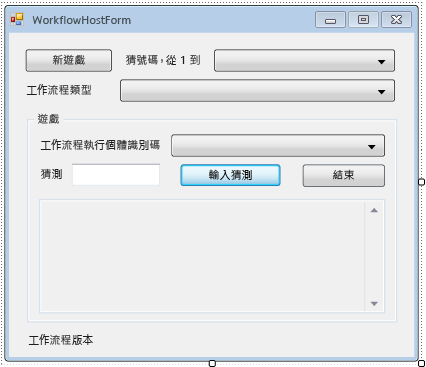

# <a name="how-to-create-and-run-a-long-running-workflow"></a><span data-ttu-id="8242c-102">HOW TO：建立及執行長時間執行的工作流程</span><span class="sxs-lookup"><span data-stu-id="8242c-102">How to: Create and Run a Long Running Workflow</span></span>
<span data-ttu-id="8242c-103">其中一項集中功能的 Windows Workflow Foundation (WF) 是保存和卸載閒置的工作流程，以資料庫的執行階段的功能。</span><span class="sxs-lookup"><span data-stu-id="8242c-103">One of the central features of Windows Workflow Foundation (WF) is the runtime’s ability to persist and unload idle workflows to a database.</span></span> <span data-ttu-id="8242c-104">中的步驟[How to:執行工作流程](how-to-run-a-workflow.md)所示範的工作流程裝載的主控台應用程式基本概念。</span><span class="sxs-lookup"><span data-stu-id="8242c-104">The steps in [How to: Run a Workflow](how-to-run-a-workflow.md) demonstrated the basics of workflow hosting using a console application.</span></span> <span data-ttu-id="8242c-105">範例包括啟動工作流程、工作流程開發週期處理常式，以及繼續使用書籤。</span><span class="sxs-lookup"><span data-stu-id="8242c-105">Examples were shown of starting workflows, workflow lifecycle handlers, and resuming bookmarks.</span></span> <span data-ttu-id="8242c-106">為有效示範工作流程持續性，必須要有較複雜的工作流程主機，以支援啟動與繼續使用多個工作流程執行個體。</span><span class="sxs-lookup"><span data-stu-id="8242c-106">In order to demonstrate workflow persistence effectively, a more complex workflow host is required that supports starting and resuming multiple workflow instances.</span></span> <span data-ttu-id="8242c-107">教學課程中的這個步驟，示範如何建立 Windows 表單主應用程式，以支援啟動與繼續使用多個工作流程執行個體、工作流程持續性，並且為後續教學課程步驟中示範的追蹤和版本設定等進階功能提供基礎。</span><span class="sxs-lookup"><span data-stu-id="8242c-107">This step in the tutorial demonstrates how to create a Windows form host application that supports starting and resuming multiple workflow instances, workflow persistence, and provides a basis for the advanced features such as tracking and versioning that are demonstrated in subsequent tutorial steps.</span></span>  
  
> [!NOTE]
>  <span data-ttu-id="8242c-108">本教學課程的步驟和後續步驟使用的所有三個工作流程類型[How to:建立工作流程](how-to-create-a-workflow.md)。</span><span class="sxs-lookup"><span data-stu-id="8242c-108">This tutorial step and the subsequent steps use all three workflow types from [How to: Create a Workflow](how-to-create-a-workflow.md).</span></span> <span data-ttu-id="8242c-109">如果您未完成所有的三種類型，您就可以下載完整的版的步驟[Windows Workflow Foundation (WF45)-入門教學課程](https://go.microsoft.com/fwlink/?LinkID=248976)。</span><span class="sxs-lookup"><span data-stu-id="8242c-109">If you did not complete all three types you can download a completed version of the steps from [Windows Workflow Foundation (WF45) - Getting Started Tutorial](https://go.microsoft.com/fwlink/?LinkID=248976).</span></span>  
  
> [!NOTE]
>  <span data-ttu-id="8242c-110">若要下載完整的版或觀看視訊逐步解說教學課程，請參閱[Windows Workflow Foundation (WF45)-入門教學課程](https://go.microsoft.com/fwlink/?LinkID=248976)。</span><span class="sxs-lookup"><span data-stu-id="8242c-110">To download a completed version or view a video walkthrough of the tutorial, see [Windows Workflow Foundation (WF45) - Getting Started Tutorial](https://go.microsoft.com/fwlink/?LinkID=248976).</span></span>  
  
## <a name="in-this-topic"></a><span data-ttu-id="8242c-111">本主題內容</span><span class="sxs-lookup"><span data-stu-id="8242c-111">In this topic</span></span>  
  
-   [<span data-ttu-id="8242c-112">若要建立持續性資料庫</span><span class="sxs-lookup"><span data-stu-id="8242c-112">To create the persistence database</span></span>](how-to-create-and-run-a-long-running-workflow.md#BKMK_CreatePersistenceDatabase)  
  
-   [<span data-ttu-id="8242c-113">若要加入至 DurableInstancing 組件參考</span><span class="sxs-lookup"><span data-stu-id="8242c-113">To add the reference to the DurableInstancing assemblies</span></span>](how-to-create-and-run-a-long-running-workflow.md#BKMK_AddReference)  
  
-   [<span data-ttu-id="8242c-114">若要建立工作流程主表單</span><span class="sxs-lookup"><span data-stu-id="8242c-114">To create the workflow host form</span></span>](how-to-create-and-run-a-long-running-workflow.md#BKMK_CreateForm)  
  
-   [<span data-ttu-id="8242c-115">若要新增的屬性和 helper 方法的表單</span><span class="sxs-lookup"><span data-stu-id="8242c-115">To add the properties and helper methods of the form</span></span>](how-to-create-and-run-a-long-running-workflow.md#BKMK_AddHelperMethods)  
  
-   [<span data-ttu-id="8242c-116">若要設定的執行個體存放區、 工作流程開發週期處理常式和延伸模組</span><span class="sxs-lookup"><span data-stu-id="8242c-116">To configure the instance store, workflow lifecycle handlers, and extensions</span></span>](how-to-create-and-run-a-long-running-workflow.md#BKMK_ConfigureWorkflowApplication)  
  
-   [<span data-ttu-id="8242c-117">若要啟用啟動與繼續使用多個工作流程類型</span><span class="sxs-lookup"><span data-stu-id="8242c-117">To enable starting and resuming multiple workflow types</span></span>](how-to-create-and-run-a-long-running-workflow.md#BKMK_WorkflowVersionMap)  
  
-   [<span data-ttu-id="8242c-118">若要啟動新的工作流程</span><span class="sxs-lookup"><span data-stu-id="8242c-118">To start a new workflow</span></span>](how-to-create-and-run-a-long-running-workflow.md#BKMK_StartWorkflow)  
  
-   [<span data-ttu-id="8242c-119">若要繼續工作流程</span><span class="sxs-lookup"><span data-stu-id="8242c-119">To resume a workflow</span></span>](how-to-create-and-run-a-long-running-workflow.md#BKMK_ResumeWorkflow)  
  
-   [<span data-ttu-id="8242c-120">終止工作流程</span><span class="sxs-lookup"><span data-stu-id="8242c-120">To terminate a workflow</span></span>](how-to-create-and-run-a-long-running-workflow.md#BKMK_TerminateWorkflow)  
  
-   [<span data-ttu-id="8242c-121">若要建置並執行應用程式</span><span class="sxs-lookup"><span data-stu-id="8242c-121">To build and run the application</span></span>](how-to-create-and-run-a-long-running-workflow.md#BKMK_BuildAndRun)  
  
### <a name="BKMK_CreatePersistenceDatabase"></a> <span data-ttu-id="8242c-122">若要建立持續性資料庫</span><span class="sxs-lookup"><span data-stu-id="8242c-122">To create the persistence database</span></span>  
  
1. <span data-ttu-id="8242c-123">開啟 SQL Server Management Studio 並連接至本機伺服器，例如 **。 \SQLEXPRESS**。</span><span class="sxs-lookup"><span data-stu-id="8242c-123">Open SQL Server Management Studio and connect to the local server, for example **.\SQLEXPRESS**.</span></span> <span data-ttu-id="8242c-124">以滑鼠右鍵按一下**資料庫**節點的本機伺服器，然後選取**新的資料庫**。</span><span class="sxs-lookup"><span data-stu-id="8242c-124">Right-click the **Databases** node on the local server, and select **New Database**.</span></span> <span data-ttu-id="8242c-125">新資料庫命名**WF45GettingStartedTutorial**，接受所有其他值，然後選取**確定**。</span><span class="sxs-lookup"><span data-stu-id="8242c-125">Name the new database **WF45GettingStartedTutorial**, accept all other values, and select **OK**.</span></span>  
  
    > [!NOTE]
    >  <span data-ttu-id="8242c-126">請確定您已**Create Database**本機伺服器上的權限，才能建立資料庫。</span><span class="sxs-lookup"><span data-stu-id="8242c-126">Ensure that you have **Create Database** permission on the local server before creating the database.</span></span>  
  
2. <span data-ttu-id="8242c-127">選擇**開放**，**檔案**從**檔案**功能表。</span><span class="sxs-lookup"><span data-stu-id="8242c-127">Choose **Open**, **File** from the **File** menu.</span></span> <span data-ttu-id="8242c-128">瀏覽至下列資料夾：`C:\Windows\Microsoft.NET\Framework\v4.0.30319\sql\en`</span><span class="sxs-lookup"><span data-stu-id="8242c-128">Browse to the following folder: `C:\Windows\Microsoft.NET\Framework\v4.0.30319\sql\en`</span></span>  
  
     <span data-ttu-id="8242c-129">選取下列兩個檔案，然後按一下**開啟**。</span><span class="sxs-lookup"><span data-stu-id="8242c-129">Select the following two files and click **Open**.</span></span>  
  
    -   <span data-ttu-id="8242c-130">SqlWorkflowInstanceStoreLogic.sql</span><span class="sxs-lookup"><span data-stu-id="8242c-130">SqlWorkflowInstanceStoreLogic.sql</span></span>  
  
    -   <span data-ttu-id="8242c-131">SqlWorkflowInstanceStoreSchema.sql</span><span class="sxs-lookup"><span data-stu-id="8242c-131">SqlWorkflowInstanceStoreSchema.sql</span></span>  
  
3. <span data-ttu-id="8242c-132">選擇**SqlWorkflowInstanceStoreSchema.sql**從**視窗**功能表。</span><span class="sxs-lookup"><span data-stu-id="8242c-132">Choose **SqlWorkflowInstanceStoreSchema.sql** from the **Window** menu.</span></span> <span data-ttu-id="8242c-133">請確認**WF45GettingStartedTutorial**中選取**可用的資料庫**下拉式清單，然後選擇**Execute**從**查詢**功能表。</span><span class="sxs-lookup"><span data-stu-id="8242c-133">Ensure that **WF45GettingStartedTutorial** is selected in the **Available Databases** drop-down and choose **Execute** from the **Query** menu.</span></span>  
  
4. <span data-ttu-id="8242c-134">選擇**SqlWorkflowInstanceStoreLogic.sql**從**視窗**功能表。</span><span class="sxs-lookup"><span data-stu-id="8242c-134">Choose **SqlWorkflowInstanceStoreLogic.sql** from the **Window** menu.</span></span> <span data-ttu-id="8242c-135">請確認**WF45GettingStartedTutorial**中選取**可用的資料庫**下拉式清單，然後選擇**Execute**從**查詢**功能表。</span><span class="sxs-lookup"><span data-stu-id="8242c-135">Ensure that **WF45GettingStartedTutorial** is selected in the **Available Databases** drop-down and choose **Execute** from the **Query** menu.</span></span>  
  
    > [!WARNING]
    >  <span data-ttu-id="8242c-136">務必按照正確順序執行前面的兩個步驟。</span><span class="sxs-lookup"><span data-stu-id="8242c-136">It is important to perform the previous two steps in the correct order.</span></span> <span data-ttu-id="8242c-137">如果未按照正確順序執行查詢，會發生錯誤，而且也無法正確地設定持續性資料庫。</span><span class="sxs-lookup"><span data-stu-id="8242c-137">If the queries are executed out of order, errors occur and the persistence database is not configured correctly.</span></span>  
  
### <a name="BKMK_AddReference"></a> <span data-ttu-id="8242c-138">若要加入至 DurableInstancing 組件參考</span><span class="sxs-lookup"><span data-stu-id="8242c-138">To add the reference to the DurableInstancing assemblies</span></span>  
  
1. <span data-ttu-id="8242c-139">以滑鼠右鍵按一下**NumberGuessWorkflowHost**中**方案總管**，然後選取**加入參考**。</span><span class="sxs-lookup"><span data-stu-id="8242c-139">Right-click **NumberGuessWorkflowHost** in **Solution Explorer** and select **Add Reference**.</span></span>  
  
2. <span data-ttu-id="8242c-140">選取 [**組件**從**加入參考**清單中，然後輸入`DurableInstancing`成**搜尋組件**] 方塊中。</span><span class="sxs-lookup"><span data-stu-id="8242c-140">Select **Assemblies** from the **Add Reference** list, and type `DurableInstancing` into the **Search Assemblies** box.</span></span> <span data-ttu-id="8242c-141">如此會篩選組件，讓您更容易選取所需的參考。</span><span class="sxs-lookup"><span data-stu-id="8242c-141">This filters the assemblies and makes the desired references easier to select.</span></span>  
  
3. <span data-ttu-id="8242c-142">核取方塊旁邊**System.Activities.DurableInstancing**並**System.activities.durableinstancing**從**搜尋結果**清單，然後按 **[確定]**。</span><span class="sxs-lookup"><span data-stu-id="8242c-142">Check the checkbox beside **System.Activities.DurableInstancing** and **System.Runtime.DurableInstancing** from the **Search Results** list, and click **OK**.</span></span>  
  
### <a name="BKMK_CreateForm"></a> <span data-ttu-id="8242c-143">若要建立工作流程主表單</span><span class="sxs-lookup"><span data-stu-id="8242c-143">To create the workflow host form</span></span>  
  
> [!NOTE]
>  <span data-ttu-id="8242c-144">此程序中的步驟描述如何手動加入及設定表單。</span><span class="sxs-lookup"><span data-stu-id="8242c-144">The steps in this procedure describe how to add and configure the form manually.</span></span> <span data-ttu-id="8242c-145">如果需要，可以下載教學課程的方案檔，並將完成的表單加入到專案中。</span><span class="sxs-lookup"><span data-stu-id="8242c-145">If desired, you can download the solution files for the tutorial and add the completed form to the project.</span></span> <span data-ttu-id="8242c-146">若要下載教學課程檔案，請參閱[Windows Workflow Foundation (WF45)-入門教學課程](https://go.microsoft.com/fwlink/?LinkID=248976)。</span><span class="sxs-lookup"><span data-stu-id="8242c-146">To download the tutorial files, see [Windows Workflow Foundation (WF45) - Getting Started Tutorial](https://go.microsoft.com/fwlink/?LinkID=248976).</span></span> <span data-ttu-id="8242c-147">一旦下載檔案時，以滑鼠右鍵按一下**NumberGuessWorkflowHost** ，然後選擇**加入參考**。</span><span class="sxs-lookup"><span data-stu-id="8242c-147">Once the files are downloaded, right-click **NumberGuessWorkflowHost** and choose **Add Reference**.</span></span> <span data-ttu-id="8242c-148">將參考加入**System.Windows.Forms**並**System.Drawing**。</span><span class="sxs-lookup"><span data-stu-id="8242c-148">Add a reference to **System.Windows.Forms** and **System.Drawing**.</span></span> <span data-ttu-id="8242c-149">這些參考會自動新增，如果您加入新的表單，從**新增**，**新項目** 功能表中，但當匯入表單必須以手動方式新增。</span><span class="sxs-lookup"><span data-stu-id="8242c-149">These references are added automatically if you add a new form from the **Add**, **New Item** menu, but must be added manually when importing a form.</span></span> <span data-ttu-id="8242c-150">一旦加入參考，以滑鼠右鍵按一下**NumberGuessWorkflowHost**中**方案總管**，然後選擇 **新增**，**現有項目**。</span><span class="sxs-lookup"><span data-stu-id="8242c-150">Once the references are added, right-click **NumberGuessWorkflowHost** in **Solution Explorer** and choose **Add**, **Existing Item**.</span></span> <span data-ttu-id="8242c-151">瀏覽至`Form`資料夾中的專案檔，請選取**WorkflowHostForm.cs** (或**WorkflowHostForm.vb**)，然後按一下**新增**。</span><span class="sxs-lookup"><span data-stu-id="8242c-151">Browse to the `Form` folder in the project files, select **WorkflowHostForm.cs** (or **WorkflowHostForm.vb**), and click **Add**.</span></span> <span data-ttu-id="8242c-152">如果您選擇匯入表單，則您可以直接跳到下一步 區段中，[添加屬性和 helper 方法，在表單的](how-to-create-and-run-a-long-running-workflow.md#BKMK_AddHelperMethods)。</span><span class="sxs-lookup"><span data-stu-id="8242c-152">If you choose to import the form, then you can skip down to the next section, [To add the properties and helper methods of the form](how-to-create-and-run-a-long-running-workflow.md#BKMK_AddHelperMethods).</span></span>  
  
1. <span data-ttu-id="8242c-153">以滑鼠右鍵按一下**NumberGuessWorkflowHost**中**方案總管**，然後選擇 **新增**，**新項目**。</span><span class="sxs-lookup"><span data-stu-id="8242c-153">Right-click **NumberGuessWorkflowHost** in **Solution Explorer** and choose **Add**, **New Item**.</span></span>  
  
2. <span data-ttu-id="8242c-154">在 **已安裝**範本清單中，選擇**Windows 表單**，型別`WorkflowHostForm`中**名稱**方塊，然後按一下**新增**。</span><span class="sxs-lookup"><span data-stu-id="8242c-154">In the **Installed** templates list, choose **Windows Form**, type `WorkflowHostForm` in the **Name** box, and click **Add**.</span></span>  
  
3. <span data-ttu-id="8242c-155">設定表單中的下列屬性。</span><span class="sxs-lookup"><span data-stu-id="8242c-155">Configure the following properties on the form.</span></span>  
  
    |<span data-ttu-id="8242c-156">屬性</span><span class="sxs-lookup"><span data-stu-id="8242c-156">Property</span></span>|<span data-ttu-id="8242c-157">值</span><span class="sxs-lookup"><span data-stu-id="8242c-157">Value</span></span>|  
    |--------------|-----------|  
    |<span data-ttu-id="8242c-158">FormBorderStyle</span><span class="sxs-lookup"><span data-stu-id="8242c-158">FormBorderStyle</span></span>|<span data-ttu-id="8242c-159">FixedSingle</span><span class="sxs-lookup"><span data-stu-id="8242c-159">FixedSingle</span></span>|  
    |<span data-ttu-id="8242c-160">MaximizeBox</span><span class="sxs-lookup"><span data-stu-id="8242c-160">MaximizeBox</span></span>|<span data-ttu-id="8242c-161">False</span><span class="sxs-lookup"><span data-stu-id="8242c-161">False</span></span>|  
    |<span data-ttu-id="8242c-162">大小</span><span class="sxs-lookup"><span data-stu-id="8242c-162">Size</span></span>|<span data-ttu-id="8242c-163">400, 420</span><span class="sxs-lookup"><span data-stu-id="8242c-163">400, 420</span></span>|  
  
4. <span data-ttu-id="8242c-164">依指定順序將下列控制項加入到表單中，並依指示設定屬性。</span><span class="sxs-lookup"><span data-stu-id="8242c-164">Add the following controls to the form in the order specified and configure the properties as directed.</span></span>  
  
    |<span data-ttu-id="8242c-165">控制項</span><span class="sxs-lookup"><span data-stu-id="8242c-165">Control</span></span>|<span data-ttu-id="8242c-166">屬性：值</span><span class="sxs-lookup"><span data-stu-id="8242c-166">Property: Value</span></span>|  
    |-------------|---------------------|  
    |<span data-ttu-id="8242c-167">**Button**</span><span class="sxs-lookup"><span data-stu-id="8242c-167">**Button**</span></span>|<span data-ttu-id="8242c-168">名稱：NewGame</span><span class="sxs-lookup"><span data-stu-id="8242c-168">Name: NewGame</span></span><br /><br /> <span data-ttu-id="8242c-169">位置:13, 13</span><span class="sxs-lookup"><span data-stu-id="8242c-169">Location: 13, 13</span></span><br /><br /> <span data-ttu-id="8242c-170">大小：75, 23</span><span class="sxs-lookup"><span data-stu-id="8242c-170">Size: 75, 23</span></span><br /><br /> <span data-ttu-id="8242c-171">文字：新遊戲</span><span class="sxs-lookup"><span data-stu-id="8242c-171">Text: New Game</span></span>|  
    |<span data-ttu-id="8242c-172">**Label**</span><span class="sxs-lookup"><span data-stu-id="8242c-172">**Label**</span></span>|<span data-ttu-id="8242c-173">位置:94, 18</span><span class="sxs-lookup"><span data-stu-id="8242c-173">Location: 94, 18</span></span><br /><br /> <span data-ttu-id="8242c-174">文字：猜號碼，從 1 到</span><span class="sxs-lookup"><span data-stu-id="8242c-174">Text: Guess a number from 1 to</span></span>|  
    |<span data-ttu-id="8242c-175">**ComboBox**</span><span class="sxs-lookup"><span data-stu-id="8242c-175">**ComboBox**</span></span>|<span data-ttu-id="8242c-176">名稱：NumberRange</span><span class="sxs-lookup"><span data-stu-id="8242c-176">Name: NumberRange</span></span><br /><br /> <span data-ttu-id="8242c-177">DropDownStyle:DropDownList</span><span class="sxs-lookup"><span data-stu-id="8242c-177">DropDownStyle: DropDownList</span></span><br /><br /> <span data-ttu-id="8242c-178">Items：10, 100, 1000</span><span class="sxs-lookup"><span data-stu-id="8242c-178">Items: 10, 100, 1000</span></span><br /><br /> <span data-ttu-id="8242c-179">位置:228, 12</span><span class="sxs-lookup"><span data-stu-id="8242c-179">Location: 228, 12</span></span><br /><br /> <span data-ttu-id="8242c-180">大小：143, 21</span><span class="sxs-lookup"><span data-stu-id="8242c-180">Size: 143, 21</span></span>|  
    |<span data-ttu-id="8242c-181">**Label**</span><span class="sxs-lookup"><span data-stu-id="8242c-181">**Label**</span></span>|<span data-ttu-id="8242c-182">位置:13, 43</span><span class="sxs-lookup"><span data-stu-id="8242c-182">Location: 13, 43</span></span><br /><br /> <span data-ttu-id="8242c-183">文字：工作流程類型</span><span class="sxs-lookup"><span data-stu-id="8242c-183">Text: Workflow type</span></span>|  
    |<span data-ttu-id="8242c-184">**ComboBox**</span><span class="sxs-lookup"><span data-stu-id="8242c-184">**ComboBox**</span></span>|<span data-ttu-id="8242c-185">名稱：WorkflowType</span><span class="sxs-lookup"><span data-stu-id="8242c-185">Name: WorkflowType</span></span><br /><br /> <span data-ttu-id="8242c-186">DropDownStyle:DropDownList</span><span class="sxs-lookup"><span data-stu-id="8242c-186">DropDownStyle: DropDownList</span></span><br /><br /> <span data-ttu-id="8242c-187">Items：StateMachineNumberGuessWorkflow，FlowchartNumberGuessWorkflow，SequentialNumberGuessWorkflow</span><span class="sxs-lookup"><span data-stu-id="8242c-187">Items: StateMachineNumberGuessWorkflow, FlowchartNumberGuessWorkflow, SequentialNumberGuessWorkflow</span></span><br /><br /> <span data-ttu-id="8242c-188">位置:94, 40</span><span class="sxs-lookup"><span data-stu-id="8242c-188">Location: 94, 40</span></span><br /><br /> <span data-ttu-id="8242c-189">大小：277, 21</span><span class="sxs-lookup"><span data-stu-id="8242c-189">Size: 277, 21</span></span>|  
    |<span data-ttu-id="8242c-190">**Label**</span><span class="sxs-lookup"><span data-stu-id="8242c-190">**Label**</span></span>|<span data-ttu-id="8242c-191">名稱：WorkflowVersion</span><span class="sxs-lookup"><span data-stu-id="8242c-191">Name: WorkflowVersion</span></span><br /><br /> <span data-ttu-id="8242c-192">位置:13, 362</span><span class="sxs-lookup"><span data-stu-id="8242c-192">Location: 13, 362</span></span><br /><br /> <span data-ttu-id="8242c-193">文字：工作流程版本</span><span class="sxs-lookup"><span data-stu-id="8242c-193">Text: Workflow version</span></span>|  
    |<span data-ttu-id="8242c-194">**GroupBox**</span><span class="sxs-lookup"><span data-stu-id="8242c-194">**GroupBox**</span></span>|<span data-ttu-id="8242c-195">位置:13, 67</span><span class="sxs-lookup"><span data-stu-id="8242c-195">Location: 13, 67</span></span><br /><br /> <span data-ttu-id="8242c-196">大小：358, 287</span><span class="sxs-lookup"><span data-stu-id="8242c-196">Size: 358, 287</span></span><br /><br /> <span data-ttu-id="8242c-197">文字：遊戲</span><span class="sxs-lookup"><span data-stu-id="8242c-197">Text: Game</span></span>|  
  
    > [!NOTE]
    >  <span data-ttu-id="8242c-198">時加入下列控制項，請將它們放入 GroupBox。</span><span class="sxs-lookup"><span data-stu-id="8242c-198">When adding the following controls, put them into the GroupBox.</span></span>  
  
    |<span data-ttu-id="8242c-199">控制項</span><span class="sxs-lookup"><span data-stu-id="8242c-199">Control</span></span>|<span data-ttu-id="8242c-200">屬性：值</span><span class="sxs-lookup"><span data-stu-id="8242c-200">Property: Value</span></span>|  
    |-------------|---------------------|  
    |<span data-ttu-id="8242c-201">**Label**</span><span class="sxs-lookup"><span data-stu-id="8242c-201">**Label**</span></span>|<span data-ttu-id="8242c-202">位置:7, 20</span><span class="sxs-lookup"><span data-stu-id="8242c-202">Location: 7, 20</span></span><br /><br /> <span data-ttu-id="8242c-203">文字：工作流程執行個體識別碼</span><span class="sxs-lookup"><span data-stu-id="8242c-203">Text: Workflow Instance Id</span></span>|  
    |<span data-ttu-id="8242c-204">**ComboBox**</span><span class="sxs-lookup"><span data-stu-id="8242c-204">**ComboBox**</span></span>|<span data-ttu-id="8242c-205">名稱：InstanceId</span><span class="sxs-lookup"><span data-stu-id="8242c-205">Name: InstanceId</span></span><br /><br /> <span data-ttu-id="8242c-206">DropDownStyle:DropDownList</span><span class="sxs-lookup"><span data-stu-id="8242c-206">DropDownStyle: DropDownList</span></span><br /><br /> <span data-ttu-id="8242c-207">位置:121, 17</span><span class="sxs-lookup"><span data-stu-id="8242c-207">Location: 121, 17</span></span><br /><br /> <span data-ttu-id="8242c-208">大小：227, 21</span><span class="sxs-lookup"><span data-stu-id="8242c-208">Size: 227, 21</span></span>|  
    |<span data-ttu-id="8242c-209">**Label**</span><span class="sxs-lookup"><span data-stu-id="8242c-209">**Label**</span></span>|<span data-ttu-id="8242c-210">位置:7, 47</span><span class="sxs-lookup"><span data-stu-id="8242c-210">Location: 7, 47</span></span><br /><br /> <span data-ttu-id="8242c-211">文字：猜測</span><span class="sxs-lookup"><span data-stu-id="8242c-211">Text: Guess</span></span>|  
    |<span data-ttu-id="8242c-212">**TextBox**</span><span class="sxs-lookup"><span data-stu-id="8242c-212">**TextBox**</span></span>|<span data-ttu-id="8242c-213">名稱：猜測</span><span class="sxs-lookup"><span data-stu-id="8242c-213">Name: Guess</span></span><br /><br /> <span data-ttu-id="8242c-214">位置:50, 44</span><span class="sxs-lookup"><span data-stu-id="8242c-214">Location: 50, 44</span></span><br /><br /> <span data-ttu-id="8242c-215">大小：65, 20</span><span class="sxs-lookup"><span data-stu-id="8242c-215">Size: 65, 20</span></span>|  
    |<span data-ttu-id="8242c-216">**Button**</span><span class="sxs-lookup"><span data-stu-id="8242c-216">**Button**</span></span>|<span data-ttu-id="8242c-217">名稱：EnterGuess</span><span class="sxs-lookup"><span data-stu-id="8242c-217">Name: EnterGuess</span></span><br /><br /> <span data-ttu-id="8242c-218">位置:121, 42</span><span class="sxs-lookup"><span data-stu-id="8242c-218">Location: 121, 42</span></span><br /><br /> <span data-ttu-id="8242c-219">大小：75, 23</span><span class="sxs-lookup"><span data-stu-id="8242c-219">Size: 75, 23</span></span><br /><br /> <span data-ttu-id="8242c-220">文字：輸入猜測</span><span class="sxs-lookup"><span data-stu-id="8242c-220">Text: Enter Guess</span></span>|  
    |<span data-ttu-id="8242c-221">**Button**</span><span class="sxs-lookup"><span data-stu-id="8242c-221">**Button**</span></span>|<span data-ttu-id="8242c-222">名稱：QuitGame</span><span class="sxs-lookup"><span data-stu-id="8242c-222">Name: QuitGame</span></span><br /><br /> <span data-ttu-id="8242c-223">位置:274, 42</span><span class="sxs-lookup"><span data-stu-id="8242c-223">Location: 274, 42</span></span><br /><br /> <span data-ttu-id="8242c-224">大小：75, 23</span><span class="sxs-lookup"><span data-stu-id="8242c-224">Size: 75, 23</span></span><br /><br /> <span data-ttu-id="8242c-225">文字：結束</span><span class="sxs-lookup"><span data-stu-id="8242c-225">Text: Quit</span></span>|  
    |<span data-ttu-id="8242c-226">**TextBox**</span><span class="sxs-lookup"><span data-stu-id="8242c-226">**TextBox**</span></span>|<span data-ttu-id="8242c-227">名稱：WorkflowStatus</span><span class="sxs-lookup"><span data-stu-id="8242c-227">Name: WorkflowStatus</span></span><br /><br /> <span data-ttu-id="8242c-228">位置:10, 73</span><span class="sxs-lookup"><span data-stu-id="8242c-228">Location: 10, 73</span></span><br /><br /> <span data-ttu-id="8242c-229">Multiline:True</span><span class="sxs-lookup"><span data-stu-id="8242c-229">Multiline: True</span></span><br /><br /> <span data-ttu-id="8242c-230">唯讀：True</span><span class="sxs-lookup"><span data-stu-id="8242c-230">ReadOnly: True</span></span><br /><br /> <span data-ttu-id="8242c-231">捲軸：垂直</span><span class="sxs-lookup"><span data-stu-id="8242c-231">ScrollBars: Vertical</span></span><br /><br /> <span data-ttu-id="8242c-232">大小：338, 208</span><span class="sxs-lookup"><span data-stu-id="8242c-232">Size: 338, 208</span></span>|  
  
5. <span data-ttu-id="8242c-233">設定**AcceptButton**表單的屬性**EnterGuess**。</span><span class="sxs-lookup"><span data-stu-id="8242c-233">Set the **AcceptButton** property of the form to **EnterGuess**.</span></span>  
  
 <span data-ttu-id="8242c-234">下列範例示範完成的表單。</span><span class="sxs-lookup"><span data-stu-id="8242c-234">The following example illustrates the completed form.</span></span>  
  
 <span data-ttu-id="8242c-235"></span><span class="sxs-lookup"><span data-stu-id="8242c-235"></span></span>  
  
### <a name="BKMK_AddHelperMethods"></a> <span data-ttu-id="8242c-236">若要新增的屬性和 helper 方法的表單</span><span class="sxs-lookup"><span data-stu-id="8242c-236">To add the properties and helper methods of the form</span></span>  
 <span data-ttu-id="8242c-237">本節中的步驟會將設定表單 UI 的屬性和 Helper 方法加入到表單類別中，以支援執行及繼續使用數字猜測工作流程。</span><span class="sxs-lookup"><span data-stu-id="8242c-237">The steps in this section add properties and helper methods to the form class that configure the UI of the form to support running and resuming number guess workflows.</span></span>  
  
1. <span data-ttu-id="8242c-238">以滑鼠右鍵按一下**WorkflowHostForm**中**方案總管**，然後選擇 **檢視程式碼**。</span><span class="sxs-lookup"><span data-stu-id="8242c-238">Right-click **WorkflowHostForm** in **Solution Explorer** and choose **View Code**.</span></span>  
  
2. <span data-ttu-id="8242c-239">將下列 `using` (或 `Imports`) 陳述式加入至檔案最上方的其他 `using` (或 `Imports`) 陳述式。</span><span class="sxs-lookup"><span data-stu-id="8242c-239">Add the following `using` (or `Imports`) statements at the top of the file with the other `using` (or `Imports`) statements.</span></span>  
  
    ```vb  
    Imports System.Windows.Forms  
    Imports System.Activities.DurableInstancing  
    Imports System.Activities  
    Imports System.Data.SqlClient  
    Imports System.IO  
    ```  
  
    ```csharp  
    using System.Windows.Forms;  
    using System.Activities.DurableInstancing;  
    using System.Activities;  
    using System.Data.SqlClient;  
    using System.IO;  
    ```  
  
3. <span data-ttu-id="8242c-240">將下列成員宣告來加入**WorkflowHostForm**類別。</span><span class="sxs-lookup"><span data-stu-id="8242c-240">Add the following member declarations to the **WorkflowHostForm** class.</span></span>  
  
    ```vb  
    Const connectionString = "Server=.\SQLEXPRESS;Initial Catalog=WF45GettingStartedTutorial;Integrated Security=SSPI"  
    Dim store As SqlWorkflowInstanceStore  
    Dim WorkflowStarting As Boolean  
    ```  
  
    ```csharp  
    const string connectionString = "Server=.\\SQLEXPRESS;Initial Catalog=WF45GettingStartedTutorial;Integrated Security=SSPI";  
    SqlWorkflowInstanceStore store;  
    bool WorkflowStarting;  
    ```  
  
    > [!NOTE]
    >  <span data-ttu-id="8242c-241">如果您的連接字串不同，請更新 `connectionString` 以參考您的資料庫。</span><span class="sxs-lookup"><span data-stu-id="8242c-241">If your connection string is different, update `connectionString` to refer to your database.</span></span>  
  
4. <span data-ttu-id="8242c-242">將 `WorkflowInstanceId` 屬性加入至 `WorkflowFormHost` 類別。</span><span class="sxs-lookup"><span data-stu-id="8242c-242">Add a `WorkflowInstanceId` property to the `WorkflowFormHost` class.</span></span>  
  
    ```vb  
    Public ReadOnly Property WorkflowInstanceId() As Guid  
        Get  
            If InstanceId.SelectedIndex = -1 Then  
                Return Guid.Empty  
            Else  
                Return New Guid(InstanceId.SelectedItem.ToString())  
            End If  
        End Get  
    End Property  
    ```  
  
    ```csharp  
    public Guid WorkflowInstanceId  
    {  
        get  
        {  
            return InstanceId.SelectedIndex == -1 ? Guid.Empty : (Guid)InstanceId.SelectedItem;  
        }  
    }  
    ```  
  
     <span data-ttu-id="8242c-243">`InstanceId`下拉式方塊會顯示一份持續性工作流程執行個體識別碼，而`WorkflowInstanceId`屬性會傳回目前選取的工作流程。</span><span class="sxs-lookup"><span data-stu-id="8242c-243">The `InstanceId` combo box displays a list of persisted workflow instance ids, and the `WorkflowInstanceId` property returns the currently selected workflow.</span></span>  
  
5. <span data-ttu-id="8242c-244">加入表單 `Load` 事件的處理常式。</span><span class="sxs-lookup"><span data-stu-id="8242c-244">Add a handler for the form `Load` event.</span></span> <span data-ttu-id="8242c-245">若要新增處理常式，請切換到 **[設計] 檢視**表單中，按一下**事件**頂端的圖示**屬性**視窗中，然後按兩下**負載**.</span><span class="sxs-lookup"><span data-stu-id="8242c-245">To add the handler, switch to **Design View** for the form, click the **Events** icon at the top of the **Properties** window, and double-click **Load**.</span></span>  
  
    ```vb  
    Private Sub WorkflowHostForm_Load(sender As Object, e As EventArgs) Handles Me.Load  
  
    End Sub  
    ```  
  
    ```csharp  
    private void WorkflowHostForm_Load(object sender, EventArgs e)  
    {  
  
    }  
    ```  
  
6. <span data-ttu-id="8242c-246">將下列程式碼加入至 `WorkflowHostForm_Load`。</span><span class="sxs-lookup"><span data-stu-id="8242c-246">Add the following code to `WorkflowHostForm_Load`.</span></span>  
  
    ```vb  
    'Initialize the store and configure it so that it can be used for  
    'multiple WorkflowApplication instances.  
    store = New SqlWorkflowInstanceStore(connectionString)  
    WorkflowApplication.CreateDefaultInstanceOwner(store, Nothing, WorkflowIdentityFilter.Any)  
  
    'Set default ComboBox selections.  
    NumberRange.SelectedIndex = 0  
    WorkflowType.SelectedIndex = 0  
  
    ListPersistedWorkflows()  
    ```  
  
    ```csharp  
    // Initialize the store and configure it so that it can be used for  
    // multiple WorkflowApplication instances.  
    store = new SqlWorkflowInstanceStore(connectionString);  
    WorkflowApplication.CreateDefaultInstanceOwner(store, null, WorkflowIdentityFilter.Any);  
  
    // Set default ComboBox selections.  
    NumberRange.SelectedIndex = 0;  
    WorkflowType.SelectedIndex = 0;  
  
    ListPersistedWorkflows();  
    ```  
  
     <span data-ttu-id="8242c-247">當表單載入時，會設定 `SqlWorkflowInstanceStore`，範圍和工作流程型別下拉式方塊會設為預設值，而且持續性工作流程執行個體會加入至 `InstanceId` 下拉式方塊。</span><span class="sxs-lookup"><span data-stu-id="8242c-247">When the form loads, the `SqlWorkflowInstanceStore` is configured, the range and workflow type combo boxes are set to default values, and the persisted workflow instances are added to the `InstanceId` combo box.</span></span>  
  
7. <span data-ttu-id="8242c-248">加入 `SelectedIndexChanged` 的 `InstanceId` 處理常式。</span><span class="sxs-lookup"><span data-stu-id="8242c-248">Add a `SelectedIndexChanged` handler for `InstanceId`.</span></span> <span data-ttu-id="8242c-249">若要新增處理常式，請切換到 **[設計] 檢視**表單中，選取`InstanceId`下拉式方塊中，按一下 [**事件**頂端的圖示**屬性**] 視窗中，和按兩下**SelectedIndexChanged**。</span><span class="sxs-lookup"><span data-stu-id="8242c-249">To add the handler, switch to **Design View** for the form, select the `InstanceId` combo box, click the **Events** icon at the top of the **Properties** window, and double-click **SelectedIndexChanged**.</span></span>  
  
    ```vb  
    Private Sub InstanceId_SelectedIndexChanged(sender As Object, e As EventArgs) Handles InstanceId.SelectedIndexChanged  
  
    End Sub  
    ```  
  
    ```csharp  
    private void InstanceId_SelectedIndexChanged(object sender, EventArgs e)  
    {  
  
    }  
    ```  
  
8. <span data-ttu-id="8242c-250">將下列程式碼加入至 `InstanceId_SelectedIndexChanged`。</span><span class="sxs-lookup"><span data-stu-id="8242c-250">Add the following code to `InstanceId_SelectedIndexChanged`.</span></span> <span data-ttu-id="8242c-251">只要使用者使用下拉式方塊選取工作流程，此處理常式就會更新狀態視窗。</span><span class="sxs-lookup"><span data-stu-id="8242c-251">Whenever the user selects a workflow by using the combo box this handler updates the status window.</span></span>  
  
    ```vb  
    If InstanceId.SelectedIndex = -1 Then  
        Return  
    End If  
  
    'Clear the status window.  
    WorkflowStatus.Clear()  
  
    'Get the workflow version and display it.  
    'If the workflow is just starting then this info will not  
    'be available in the persistence store so do not try and retrieve it.  
    If Not WorkflowStarting Then  
        Dim instance As WorkflowApplicationInstance = _  
            WorkflowApplication.GetInstance(WorkflowInstanceId, store)  
  
        WorkflowVersion.Text = _  
            WorkflowVersionMap.GetIdentityDescription(instance.DefinitionIdentity)  
  
        'Unload the instance.  
        instance.Abandon()  
    End If  
    ```  
  
    ```csharp  
    if (InstanceId.SelectedIndex == -1)  
    {  
        return;  
    }  
  
    // Clear the status window.  
    WorkflowStatus.Clear();  
  
    // Get the workflow version and display it.  
    // If the workflow is just starting then this info will not  
    // be available in the persistence store so do not try and retrieve it.  
    if (!WorkflowStarting)  
    {  
        WorkflowApplicationInstance instance =  
            WorkflowApplication.GetInstance(this.WorkflowInstanceId, store);  
  
        WorkflowVersion.Text =  
            WorkflowVersionMap.GetIdentityDescription(instance.DefinitionIdentity);  
  
        // Unload the instance.  
        instance.Abandon();  
    }  
    ```  
  
9. <span data-ttu-id="8242c-252">將下列 `ListPersistedWorkflows` 方法加入至表單類別。</span><span class="sxs-lookup"><span data-stu-id="8242c-252">Add the following `ListPersistedWorkflows` method to the form class.</span></span>  
  
    ```vb  
    Private Sub ListPersistedWorkflows()  
        Using localCon As New SqlConnection(connectionString)  
            Dim localCmd As String = _  
                "Select [InstanceId] from [System.Activities.DurableInstancing].[Instances] Order By [CreationTime]"  
  
            Dim cmd As SqlCommand = localCon.CreateCommand()  
            cmd.CommandText = localCmd  
            localCon.Open()  
            Using reader As SqlDataReader = cmd.ExecuteReader(CommandBehavior.CloseConnection)  
  
                While (reader.Read())  
                    'Get the InstanceId of the persisted Workflow.  
                    Dim id As Guid = Guid.Parse(reader(0).ToString())  
                    InstanceId.Items.Add(id)  
                End While  
            End Using  
        End Using  
    End Sub  
    ```  
  
    ```csharp  
    using (SqlConnection localCon = new SqlConnection(connectionString))  
    {  
        string localCmd =  
            "Select [InstanceId] from [System.Activities.DurableInstancing].[Instances] Order By [CreationTime]";  
  
        SqlCommand cmd = localCon.CreateCommand();  
        cmd.CommandText = localCmd;  
        localCon.Open();  
        using (SqlDataReader reader = cmd.ExecuteReader(CommandBehavior.CloseConnection))  
        {  
            while (reader.Read())  
            {  
                // Get the InstanceId of the persisted Workflow  
                Guid id = Guid.Parse(reader[0].ToString());  
                InstanceId.Items.Add(id);  
            }  
        }  
    }  
    ```  
  
     <span data-ttu-id="8242c-253">`ListPersistedWorkflows` 會在執行個體存放區中查詢持續性工作流成執行個體，並將執行個體識別碼加入 `cboInstanceId` 下拉式方塊。</span><span class="sxs-lookup"><span data-stu-id="8242c-253">`ListPersistedWorkflows` queries the instance store for persisted workflow instances, and adds the instance ids to the `cboInstanceId` combo box.</span></span>  
  
10. <span data-ttu-id="8242c-254">將下列 `UpdateStatus` 方法及對應的委派加入至表單類別。</span><span class="sxs-lookup"><span data-stu-id="8242c-254">Add the following `UpdateStatus` method and corresponding delegate to the form class.</span></span> <span data-ttu-id="8242c-255">此方法會將表單上的狀態視窗更新為目前執行中的工作流程狀態。</span><span class="sxs-lookup"><span data-stu-id="8242c-255">This method updates the status window on the form with the status of the currently running workflow.</span></span>  
  
    ```vb  
    Private Delegate Sub UpdateStatusDelegate(msg As String)  
    Public Sub UpdateStatus(msg As String)  
        'We may be on a different thread so we need to  
        'make this call using BeginInvoke.  
        If InvokeRequired Then  
            BeginInvoke(New UpdateStatusDelegate(AddressOf UpdateStatus), msg)  
        Else  
            If Not msg.EndsWith(vbCrLf) Then  
                msg = msg & vbCrLf  
            End If  
  
            WorkflowStatus.AppendText(msg)  
  
            'Ensure that the newly added status is visible.  
            WorkflowStatus.SelectionStart = WorkflowStatus.Text.Length  
            WorkflowStatus.ScrollToCaret()  
        End If  
    End Sub  
    ```  
  
    ```csharp  
    private delegate void UpdateStatusDelegate(string msg);  
    public void UpdateStatus(string msg)  
    {  
        // We may be on a different thread so we need to  
        // make this call using BeginInvoke.  
        if (InvokeRequired)  
        {  
            BeginInvoke(new UpdateStatusDelegate(UpdateStatus), msg);  
        }  
        else  
        {  
            if (!msg.EndsWith("\r\n"))  
            {  
                msg += "\r\n";  
            }  
            WorkflowStatus.AppendText(msg);  
  
            WorkflowStatus.SelectionStart = WorkflowStatus.Text.Length;  
            WorkflowStatus.ScrollToCaret();  
        }  
    }  
    ```  
  
11. <span data-ttu-id="8242c-256">將下列 `GameOver` 方法及對應的委派加入至表單類別。</span><span class="sxs-lookup"><span data-stu-id="8242c-256">Add the following `GameOver` method and corresponding delegate to the form class.</span></span> <span data-ttu-id="8242c-257">工作流程完成時，這個方法會藉由移除已完成的工作流程的執行個體 id 更新表單 UI 從**InstanceId**下拉式方塊。</span><span class="sxs-lookup"><span data-stu-id="8242c-257">When a workflow completes, this method updates the form UI by removing the instance id of the completed workflow from the **InstanceId** combo box.</span></span>  
  
    ```vb  
    Private Delegate Sub GameOverDelegate()  
    Private Sub GameOver()  
        If InvokeRequired Then  
            BeginInvoke(New GameOverDelegate(AddressOf GameOver))  
        Else  
            'Remove this instance from the InstanceId combo box.  
            InstanceId.Items.Remove(InstanceId.SelectedItem)  
            InstanceId.SelectedIndex = -1  
        End If  
    End Sub  
    ```  
  
    ```csharp  
    private delegate void GameOverDelegate();  
    private void GameOver()  
    {  
        if (InvokeRequired)  
        {  
            BeginInvoke(new GameOverDelegate(GameOver));  
        }  
        else  
        {  
            // Remove this instance from the combo box  
            InstanceId.Items.Remove(InstanceId.SelectedItem);  
            InstanceId.SelectedIndex = -1;  
        }  
    }  
    ```  
  
### <a name="BKMK_ConfigureWorkflowApplication"></a> <span data-ttu-id="8242c-258">若要設定的執行個體存放區、 工作流程開發週期處理常式和延伸模組</span><span class="sxs-lookup"><span data-stu-id="8242c-258">To configure the instance store, workflow lifecycle handlers, and extensions</span></span>  
  
1. <span data-ttu-id="8242c-259">將 `ConfigureWorkflowApplication` 方法加入至表單類別。</span><span class="sxs-lookup"><span data-stu-id="8242c-259">Add a `ConfigureWorkflowApplication` method to the form class.</span></span>  
  
    ```vb  
    Private Sub ConfigureWorkflowApplication(wfApp As WorkflowApplication)  
  
    End Sub  
    ```  
  
    ```csharp  
    private void ConfigureWorkflowApplication(WorkflowApplication wfApp)  
    {      
    }  
    ```  
  
     <span data-ttu-id="8242c-260">此方法會設定 `WorkflowApplication`、加入所需的擴充，然後加入工作流程開發週期事件的處理常式。</span><span class="sxs-lookup"><span data-stu-id="8242c-260">This method configures the `WorkflowApplication`, adds the desired extensions, and adds handlers for the workflow lifecycle events.</span></span>  
  
2. <span data-ttu-id="8242c-261">在 `ConfigureWorkflowApplication` 中指定 `SqlWorkflowInstanceStore` 的 `WorkflowApplication`。</span><span class="sxs-lookup"><span data-stu-id="8242c-261">In `ConfigureWorkflowApplication`, specify the `SqlWorkflowInstanceStore` for the `WorkflowApplication`.</span></span>  
  
    ```vb  
    'Configure the persistence store.  
    wfApp.InstanceStore = store  
    ```  
  
    ```csharp  
    // Configure the persistence store.  
    wfApp.InstanceStore = store;  
    ```  
  
3. <span data-ttu-id="8242c-262">接下來，建立 `StringWriter` 執行個體，並將其加入到 `Extensions` 的 `WorkflowApplication` 集合中。</span><span class="sxs-lookup"><span data-stu-id="8242c-262">Next, create a `StringWriter` instance and add it to the `Extensions` collection of the `WorkflowApplication`.</span></span> <span data-ttu-id="8242c-263">當`StringWriter`會加入至擴充之後它會擷取所有`WriteLine`活動輸出。</span><span class="sxs-lookup"><span data-stu-id="8242c-263">When a `StringWriter` is added to the extensions it captures all `WriteLine` activity output.</span></span> <span data-ttu-id="8242c-264">工作流程閒置時，可以從 `WriteLine` 擷取 `StringWriter` 輸出並顯示在表單上。</span><span class="sxs-lookup"><span data-stu-id="8242c-264">When the workflow becomes idle, the `WriteLine` output can be extracted from the `StringWriter` and displayed on the form.</span></span>  
  
    ```vb  
    'Add a StringWriter to the extensions. This captures the output  
    'from the WriteLine activities so we can display it in the form.  
    Dim sw As New StringWriter()  
    wfApp.Extensions.Add(sw)  
    ```  
  
    ```csharp  
    // Add a StringWriter to the extensions. This captures the output  
    // from the WriteLine activities so we can display it in the form.  
    StringWriter sw = new StringWriter();  
    wfApp.Extensions.Add(sw);  
    ```  
  
4. <span data-ttu-id="8242c-265">加入 `Completed` 事件的下列處理常式。</span><span class="sxs-lookup"><span data-stu-id="8242c-265">Add the following handler for the `Completed` event.</span></span> <span data-ttu-id="8242c-266">當工作流程成功完成時，會在狀態視窗中顯示用來猜測數字的次數。</span><span class="sxs-lookup"><span data-stu-id="8242c-266">When a workflow successfully completes, the number of turns taken to guess the number is displayed to the status window.</span></span> <span data-ttu-id="8242c-267">如果工作流程終止，會顯示導致終止的例外狀況資訊。</span><span class="sxs-lookup"><span data-stu-id="8242c-267">If the workflow terminates, the exception information that caused the termination is displayed.</span></span> <span data-ttu-id="8242c-268">在處理常式結束時，會呼叫 `GameOver` 方法，此方法會移除工作流程清單中已完成的工作流程。</span><span class="sxs-lookup"><span data-stu-id="8242c-268">At the end of the handler the `GameOver` method is called, which removes the completed workflow from the workflow list.</span></span>  
  
    ```vb  
    wfApp.Completed = _  
        Sub(e As WorkflowApplicationCompletedEventArgs)  
            If e.CompletionState = ActivityInstanceState.Faulted Then  
                UpdateStatus(String.Format("Workflow Terminated. Exception: {0}" & vbCrLf & "{1}", _  
                    e.TerminationException.GetType().FullName, _  
                    e.TerminationException.Message))  
            ElseIf e.CompletionState = ActivityInstanceState.Canceled Then  
                UpdateStatus("Workflow Canceled.")  
            Else  
                Dim Turns As Integer = Convert.ToInt32(e.Outputs("Turns"))  
                UpdateStatus(String.Format("Congratulations, you guessed the number in {0} turns.", Turns))  
            End If  
            GameOver()  
        End Sub  
    ```  
  
    ```csharp  
    wfApp.Completed = delegate(WorkflowApplicationCompletedEventArgs e)  
    {  
        if (e.CompletionState == ActivityInstanceState.Faulted)  
        {  
            UpdateStatus(string.Format("Workflow Terminated. Exception: {0}\r\n{1}",  
                e.TerminationException.GetType().FullName,  
                e.TerminationException.Message));  
        }  
        else if (e.CompletionState == ActivityInstanceState.Canceled)  
        {  
            UpdateStatus("Workflow Canceled.");  
        }  
        else  
        {  
            int Turns = Convert.ToInt32(e.Outputs["Turns"]);  
            UpdateStatus(string.Format("Congratulations, you guessed the number in {0} turns.", Turns));  
        }  
        GameOver();  
    };  
    ```  
  
5. <span data-ttu-id="8242c-269">加入下列 `Aborted` 和 `OnUnhandledException` 處理常式。</span><span class="sxs-lookup"><span data-stu-id="8242c-269">Add the following `Aborted` and `OnUnhandledException` handlers.</span></span> <span data-ttu-id="8242c-270">不會從 `GameOver` 處理常式呼叫 `Aborted` 方法，因為當工作流程執行個體中止時，並沒有終止，稍後可以再繼續該執行個體。</span><span class="sxs-lookup"><span data-stu-id="8242c-270">The `GameOver` method is not called from the `Aborted` handler because when a workflow instance is aborted, it does not terminate, and it is possible to resume the instance at a later time.</span></span>  
  
    ```vb  
    wfApp.Aborted = _  
        Sub(e As WorkflowApplicationAbortedEventArgs)  
            UpdateStatus(String.Format("Workflow Aborted. Exception: {0}" & vbCrLf & "{1}", _  
                e.Reason.GetType().FullName, _  
                e.Reason.Message))  
        End Sub  
  
    wfApp.OnUnhandledException = _  
        Function(e As WorkflowApplicationUnhandledExceptionEventArgs)  
            UpdateStatus(String.Format("Unhandled Exception: {0}" & vbCrLf & "{1}", _  
                e.UnhandledException.GetType().FullName, _  
                e.UnhandledException.Message))  
            GameOver()  
            Return UnhandledExceptionAction.Terminate  
        End Function  
    ```  
  
    ```csharp  
    wfApp.Aborted = delegate(WorkflowApplicationAbortedEventArgs e)  
    {  
        UpdateStatus(string.Format("Workflow Aborted. Exception: {0}\r\n{1}",  
                e.Reason.GetType().FullName,  
                e.Reason.Message));  
    };  
  
    wfApp.OnUnhandledException = delegate(WorkflowApplicationUnhandledExceptionEventArgs e)  
    {  
        UpdateStatus(string.Format("Unhandled Exception: {0}\r\n{1}",  
                e.UnhandledException.GetType().FullName,  
                e.UnhandledException.Message));  
        GameOver();  
        return UnhandledExceptionAction.Terminate;  
    };  
    ```  
  
6. <span data-ttu-id="8242c-271">加入下列 `PersistableIdle` 處理常式。</span><span class="sxs-lookup"><span data-stu-id="8242c-271">Add the following `PersistableIdle` handler.</span></span> <span data-ttu-id="8242c-272">此處理常式會擷取所加入的 `StringWriter` 擴充，從 `WriteLine` 活動擷取輸出，並顯示在狀態視窗中。</span><span class="sxs-lookup"><span data-stu-id="8242c-272">This handler retrieves the `StringWriter` extension that was added, extracts the output from the `WriteLine` activities, and displays it in the status window.</span></span>  
  
    ```vb  
    wfApp.PersistableIdle = _  
        Function(e As WorkflowApplicationIdleEventArgs)  
            'Send the current WriteLine outputs to the status window.  
            Dim writers = e.GetInstanceExtensions(Of StringWriter)()  
            For Each writer In writers  
                UpdateStatus(writer.ToString())  
            Next  
            Return PersistableIdleAction.Unload  
        End Function  
    ```  
  
    ```csharp  
    wfApp.PersistableIdle = delegate(WorkflowApplicationIdleEventArgs e)  
    {  
        // Send the current WriteLine outputs to the status window.  
        var writers = e.GetInstanceExtensions<StringWriter>();  
        foreach (var writer in writers)  
        {  
            UpdateStatus(writer.ToString());  
        }  
        return PersistableIdleAction.Unload;  
    };  
    ```  
  
     <span data-ttu-id="8242c-273"><xref:System.Activities.PersistableIdleAction> 列舉有三個值：<xref:System.Activities.PersistableIdleAction.None>、<xref:System.Activities.PersistableIdleAction.Persist> 及 <xref:System.Activities.PersistableIdleAction.Unload>。</span><span class="sxs-lookup"><span data-stu-id="8242c-273">The <xref:System.Activities.PersistableIdleAction> enumeration has three values: <xref:System.Activities.PersistableIdleAction.None>, <xref:System.Activities.PersistableIdleAction.Persist>, and <xref:System.Activities.PersistableIdleAction.Unload>.</span></span> <span data-ttu-id="8242c-274"><xref:System.Activities.PersistableIdleAction.Persist> 會使工作流程繼續持續，但不會導致工作流程卸載。</span><span class="sxs-lookup"><span data-stu-id="8242c-274"><xref:System.Activities.PersistableIdleAction.Persist> causes the workflow to persist but it does not cause the workflow to unload.</span></span> <span data-ttu-id="8242c-275"><xref:System.Activities.PersistableIdleAction.Unload> 會使工作流程繼續持續並卸載。</span><span class="sxs-lookup"><span data-stu-id="8242c-275"><xref:System.Activities.PersistableIdleAction.Unload> causes the workflow to persist and be unloaded.</span></span>  
  
     <span data-ttu-id="8242c-276">下列範例是完成的 `ConfigureWorkflowApplication` 方法。</span><span class="sxs-lookup"><span data-stu-id="8242c-276">The following example is the completed `ConfigureWorkflowApplication` method.</span></span>  
  
    ```vb  
    Private Sub ConfigureWorkflowApplication(wfApp As WorkflowApplication)  
        'Configure the persistence store.  
        wfApp.InstanceStore = store  
  
        'Add a StringWriter to the extensions. This captures the output  
        'from the WriteLine activities so we can display it in the form.  
        Dim sw As New StringWriter()  
        wfApp.Extensions.Add(sw)  
  
        wfApp.Completed = _  
            Sub(e As WorkflowApplicationCompletedEventArgs)  
                If e.CompletionState = ActivityInstanceState.Faulted Then  
                    UpdateStatus(String.Format("Workflow Terminated. Exception: {0}" & vbCrLf & "{1}", _  
                        e.TerminationException.GetType().FullName, _  
                        e.TerminationException.Message))  
                ElseIf e.CompletionState = ActivityInstanceState.Canceled Then  
                    UpdateStatus("Workflow Canceled.")  
                Else  
                    Dim Turns As Integer = Convert.ToInt32(e.Outputs("Turns"))  
                    UpdateStatus(String.Format("Congratulations, you guessed the number in {0} turns.", Turns))  
                End If  
                GameOver()  
            End Sub  
  
        wfApp.Aborted = _  
            Sub(e As WorkflowApplicationAbortedEventArgs)  
                UpdateStatus(String.Format("Workflow Aborted. Exception: {0}" & vbCrLf & "{1}", _  
                    e.Reason.GetType().FullName, _  
                    e.Reason.Message))  
            End Sub  
  
        wfApp.OnUnhandledException = _  
            Function(e As WorkflowApplicationUnhandledExceptionEventArgs)  
                UpdateStatus(String.Format("Unhandled Exception: {0}" & vbCrLf & "{1}", _  
                    e.UnhandledException.GetType().FullName, _  
                    e.UnhandledException.Message))  
                GameOver()  
                Return UnhandledExceptionAction.Terminate  
            End Function  
  
        wfApp.PersistableIdle = _  
            Function(e As WorkflowApplicationIdleEventArgs)  
                'Send the current WriteLine outputs to the status window.  
                Dim writers = e.GetInstanceExtensions(Of StringWriter)()  
                For Each writer In writers  
                    UpdateStatus(writer.ToString())  
                Next  
                Return PersistableIdleAction.Unload  
            End Function  
    End Sub  
    ```  
  
    ```csharp  
    private void ConfigureWorkflowApplication(WorkflowApplication wfApp)  
    {  
        // Configure the persistence store.  
        wfApp.InstanceStore = store;  
  
        // Add a StringWriter to the extensions. This captures the output  
        // from the WriteLine activities so we can display it in the form.  
        StringWriter sw = new StringWriter();  
        wfApp.Extensions.Add(sw);  
  
        wfApp.Completed = delegate(WorkflowApplicationCompletedEventArgs e)  
        {  
            if (e.CompletionState == ActivityInstanceState.Faulted)  
            {  
                UpdateStatus(string.Format("Workflow Terminated. Exception: {0}\r\n{1}",  
                    e.TerminationException.GetType().FullName,  
                    e.TerminationException.Message));  
            }  
            else if (e.CompletionState == ActivityInstanceState.Canceled)  
            {  
                UpdateStatus("Workflow Canceled.");  
            }  
            else  
            {  
                int Turns = Convert.ToInt32(e.Outputs["Turns"]);  
                UpdateStatus(string.Format("Congratulations, you guessed the number in {0} turns.", Turns));  
            }  
            GameOver();  
        };  
  
        wfApp.Aborted = delegate(WorkflowApplicationAbortedEventArgs e)  
        {  
            UpdateStatus(string.Format("Workflow Aborted. Exception: {0}\r\n{1}",  
                    e.Reason.GetType().FullName,  
                    e.Reason.Message));  
        };  
  
        wfApp.OnUnhandledException = delegate(WorkflowApplicationUnhandledExceptionEventArgs e)  
        {  
            UpdateStatus(string.Format("Unhandled Exception: {0}\r\n{1}",  
                    e.UnhandledException.GetType().FullName,  
                    e.UnhandledException.Message));  
            GameOver();  
            return UnhandledExceptionAction.Terminate;  
        };  
  
        wfApp.PersistableIdle = delegate(WorkflowApplicationIdleEventArgs e)  
        {  
            // Send the current WriteLine outputs to the status window.  
            var writers = e.GetInstanceExtensions<StringWriter>();  
            foreach (var writer in writers)  
            {  
                UpdateStatus(writer.ToString());  
            }  
            return PersistableIdleAction.Unload;  
        };  
    }  
    ```  
  
### <a name="BKMK_WorkflowVersionMap"></a> <span data-ttu-id="8242c-277">若要啟用啟動與繼續使用多個工作流程類型</span><span class="sxs-lookup"><span data-stu-id="8242c-277">To enable starting and resuming multiple workflow types</span></span>  
 <span data-ttu-id="8242c-278">主機必須提供工作流程定義，才能繼續工作流程執行個體。</span><span class="sxs-lookup"><span data-stu-id="8242c-278">In order to resume a workflow instance, the host has to provide the workflow definition.</span></span> <span data-ttu-id="8242c-279">本教學課程包含三種工作流程型別，後續的教學課程將介紹這些類型的多個版本。</span><span class="sxs-lookup"><span data-stu-id="8242c-279">In this tutorial there are three workflow types, and subsequent tutorial steps introduce multiple versions of these types.</span></span> <span data-ttu-id="8242c-280">`WorkflowIdentity` 提供方法，讓主應用程式能夠將識別資訊與持續的工作流程執行個體建立關聯。</span><span class="sxs-lookup"><span data-stu-id="8242c-280">`WorkflowIdentity` provides a way for a host application to associate identifying information with a persisted workflow instance.</span></span> <span data-ttu-id="8242c-281">本節中的步驟示範如何建立公用程式類別，以協助將持續性工作流程執行個體的工作流程識別對應至相對應的工作流程定義。</span><span class="sxs-lookup"><span data-stu-id="8242c-281">The steps in this section demonstrate how to create a utility class to assist with mapping the workflow identity from a persisted workflow instance to the corresponding workflow definition.</span></span> <span data-ttu-id="8242c-282">如需詳細資訊`WorkflowIdentity`及版本設定，請參閱 <<c2> [ 使用 WorkflowIdentity 與版本控制](using-workflowidentity-and-versioning.md)。</span><span class="sxs-lookup"><span data-stu-id="8242c-282">For more information about `WorkflowIdentity` and versioning, see [Using WorkflowIdentity and Versioning](using-workflowidentity-and-versioning.md).</span></span>  
  
1. <span data-ttu-id="8242c-283">以滑鼠右鍵按一下**NumberGuessWorkflowHost**中**方案總管**，然後選擇 **新增**，**類別**。</span><span class="sxs-lookup"><span data-stu-id="8242c-283">Right-click **NumberGuessWorkflowHost** in **Solution Explorer** and choose **Add**, **Class**.</span></span> <span data-ttu-id="8242c-284">型別`WorkflowVersionMap`成**名稱**方塊，然後按一下**新增**。</span><span class="sxs-lookup"><span data-stu-id="8242c-284">Type `WorkflowVersionMap` into the **Name** box and click **Add**.</span></span>  
  
2. <span data-ttu-id="8242c-285">將下列 `using` 或 `Imports` 陳述式加入至檔案最上方的其他 `using` 或 `Imports` 陳述式。</span><span class="sxs-lookup"><span data-stu-id="8242c-285">Add the following `using` or `Imports` statements at the top of the file with the other `using` or `Imports` statements.</span></span>  
  
    ```vb  
    Imports NumberGuessWorkflowActivities  
    Imports System.Activities  
    ```  
  
    ```csharp  
    using NumberGuessWorkflowActivities;  
    using System.Activities;  
    ```  
  
3. <span data-ttu-id="8242c-286">用下列宣告取代 `WorkflowVersionMap` 類別宣告。</span><span class="sxs-lookup"><span data-stu-id="8242c-286">Replace the `WorkflowVersionMap` class declaration with the following declaration.</span></span>  
  
    ```vb  
    Public Module WorkflowVersionMap  
        Dim map As Dictionary(Of WorkflowIdentity, Activity)  
  
        'Current version identities.  
        Public StateMachineNumberGuessIdentity As WorkflowIdentity  
        Public FlowchartNumberGuessIdentity As WorkflowIdentity  
        Public SequentialNumberGuessIdentity As WorkflowIdentity  
  
        Sub New()  
            map = New Dictionary(Of WorkflowIdentity, Activity)  
  
            'Add the current workflow version identities.  
            StateMachineNumberGuessIdentity = New WorkflowIdentity With  
            {  
                .Name = "StateMachineNumberGuessWorkflow",  
                .Version = New Version(1, 0, 0, 0)  
            }  
  
            FlowchartNumberGuessIdentity = New WorkflowIdentity With  
            {  
                .Name = "FlowchartNumberGuessWorkflow",  
                .Version = New Version(1, 0, 0, 0)  
            }  
  
            SequentialNumberGuessIdentity = New WorkflowIdentity With  
            {  
                .Name = "SequentialNumberGuessWorkflow",  
                .Version = New Version(1, 0, 0, 0)  
            }  
  
            map.Add(StateMachineNumberGuessIdentity, New StateMachineNumberGuessWorkflow())  
            map.Add(FlowchartNumberGuessIdentity, New FlowchartNumberGuessWorkflow())  
            map.Add(SequentialNumberGuessIdentity, New SequentialNumberGuessWorkflow())  
        End Sub  
  
        Public Function GetWorkflowDefinition(identity As WorkflowIdentity) As Activity  
            Return map(identity)  
        End Function  
  
        Public Function GetIdentityDescription(identity As WorkflowIdentity) As String  
            Return identity.ToString()  
        End Function  
    End Module  
    ```  
  
    ```csharp  
    public static class WorkflowVersionMap  
    {  
        static Dictionary<WorkflowIdentity, Activity> map;  
  
        // Current version identities.  
        static public WorkflowIdentity StateMachineNumberGuessIdentity;  
        static public WorkflowIdentity FlowchartNumberGuessIdentity;  
        static public WorkflowIdentity SequentialNumberGuessIdentity;  
  
        static WorkflowVersionMap()  
        {  
            map = new Dictionary<WorkflowIdentity, Activity>();  
  
            // Add the current workflow version identities.  
            StateMachineNumberGuessIdentity = new WorkflowIdentity  
            {  
                Name = "StateMachineNumberGuessWorkflow",  
                Version = new Version(1, 0, 0, 0)  
            };  
  
            FlowchartNumberGuessIdentity = new WorkflowIdentity  
            {  
                Name = "FlowchartNumberGuessWorkflow",  
                Version = new Version(1, 0, 0, 0)  
            };  
  
            SequentialNumberGuessIdentity = new WorkflowIdentity  
            {  
                Name = "SequentialNumberGuessWorkflow",  
                Version = new Version(1, 0, 0, 0)  
            };  
  
            map.Add(StateMachineNumberGuessIdentity, new StateMachineNumberGuessWorkflow());  
            map.Add(FlowchartNumberGuessIdentity, new FlowchartNumberGuessWorkflow());  
            map.Add(SequentialNumberGuessIdentity, new SequentialNumberGuessWorkflow());  
        }  
  
        public static Activity GetWorkflowDefinition(WorkflowIdentity identity)  
        {  
            return map[identity];  
        }  
  
        public static string GetIdentityDescription(WorkflowIdentity identity)  
        {          
            return identity.ToString();  
       }  
    }  
    ```  
  
     <span data-ttu-id="8242c-287">`WorkflowVersionMap` 包含三個工作流程識別，其對應於此教學課程中的三個工作流程定義，在下列章節中，啟動及繼續使用工作流程時會使用這些識別。</span><span class="sxs-lookup"><span data-stu-id="8242c-287">`WorkflowVersionMap` contains three workflow identities that map to the three workflow definitions from this tutorial and is used in the following sections when workflows are started and resumed.</span></span>  
  
### <a name="BKMK_StartWorkflow"></a> <span data-ttu-id="8242c-288">若要啟動新的工作流程</span><span class="sxs-lookup"><span data-stu-id="8242c-288">To start a new workflow</span></span>  
  
1. <span data-ttu-id="8242c-289">加入 `Click` 的 `NewGame` 處理常式。</span><span class="sxs-lookup"><span data-stu-id="8242c-289">Add a `Click` handler for `NewGame`.</span></span> <span data-ttu-id="8242c-290">若要新增處理常式，請切換到**設計檢視**的表單，然後按兩下`NewGame`。</span><span class="sxs-lookup"><span data-stu-id="8242c-290">To add the handler, switch to **Design View** for the form, and double-click `NewGame`.</span></span> <span data-ttu-id="8242c-291">會加入 `NewGame_Click` 處理常式，且表單的檢視會切換成程式碼檢視。</span><span class="sxs-lookup"><span data-stu-id="8242c-291">A `NewGame_Click` handler is added and the view switches to code view for the form.</span></span> <span data-ttu-id="8242c-292">每當使用者按一下此按鈕，就會啟動新的工作流程。</span><span class="sxs-lookup"><span data-stu-id="8242c-292">Whenever the user clicks this button a new workflow is started.</span></span>  
  
    ```vb  
    Private Sub NewGame_Click(sender As Object, e As EventArgs) Handles NewGame.Click  
  
    End Sub  
    ```  
  
    ```csharp  
    private void NewGame_Click(object sender, EventArgs e)  
    {  
  
    }  
    ```  
  
2. <span data-ttu-id="8242c-293">將下列程式碼加入至 Click 處理常式。</span><span class="sxs-lookup"><span data-stu-id="8242c-293">Add the following code to the click handler.</span></span> <span data-ttu-id="8242c-294">此程式碼會建立工作流程的輸入引數字典，以引數名稱為索引鍵。</span><span class="sxs-lookup"><span data-stu-id="8242c-294">This code creates a dictionary of input arguments for the workflow, keyed by argument name.</span></span> <span data-ttu-id="8242c-295">此字典有一個項目，其中包含從範圍下拉式方塊擷取之隨機產生號碼的範圍。</span><span class="sxs-lookup"><span data-stu-id="8242c-295">This dictionary has one entry that contains the range of the randomly generated number retrieved from the range combo box.</span></span>  
  
    ```vb  
    Dim inputs As New Dictionary(Of String, Object)()  
    inputs.Add("MaxNumber", Convert.ToInt32(NumberRange.SelectedItem))  
    ```  
  
    ```csharp  
    var inputs = new Dictionary<string, object>();  
    inputs.Add("MaxNumber", Convert.ToInt32(NumberRange.SelectedItem));  
    ```  
  
3. <span data-ttu-id="8242c-296">接下來，加入下列啟動工作流程的程式碼。</span><span class="sxs-lookup"><span data-stu-id="8242c-296">Next, add the following code that starts the workflow.</span></span> <span data-ttu-id="8242c-297">會使用 `WorkflowIdentity` Helper 類別，擷取對應至所選工作流程型別的 `WorkflowVersionMap` 和工作流程定義。</span><span class="sxs-lookup"><span data-stu-id="8242c-297">The `WorkflowIdentity` and workflow definition corresponding to the type of workflow selected are retrieved using the `WorkflowVersionMap` helper class.</span></span> <span data-ttu-id="8242c-298">接下來會使用工作流程定義 `WorkflowApplication` 和輸入引數的字典來建立新的 `WorkflowIdentity` 執行個體。</span><span class="sxs-lookup"><span data-stu-id="8242c-298">Next, a new `WorkflowApplication` instance is created using the workflow definition, `WorkflowIdentity`, and dictionary of input arguments.</span></span>  
  
    ```vb  
    Dim identity As WorkflowIdentity = Nothing  
    Select Case WorkflowType.SelectedItem.ToString()  
        Case "SequentialNumberGuessWorkflow"  
            identity = WorkflowVersionMap.SequentialNumberGuessIdentity  
  
        Case "StateMachineNumberGuessWorkflow"  
            identity = WorkflowVersionMap.StateMachineNumberGuessIdentity  
  
        Case "FlowchartNumberGuessWorkflow"  
            identity = WorkflowVersionMap.FlowchartNumberGuessIdentity  
    End Select  
  
    Dim wf As Activity = WorkflowVersionMap.GetWorkflowDefinition(identity)  
  
    Dim wfApp = New WorkflowApplication(wf, inputs, identity)  
    ```  
  
    ```csharp  
    WorkflowIdentity identity = null;  
    switch (WorkflowType.SelectedItem.ToString())  
    {  
        case "SequentialNumberGuessWorkflow":  
            identity = WorkflowVersionMap.SequentialNumberGuessIdentity;  
            break;  
  
        case "StateMachineNumberGuessWorkflow":  
            identity = WorkflowVersionMap.StateMachineNumberGuessIdentity;  
            break;  
  
        case "FlowchartNumberGuessWorkflow":  
            identity = WorkflowVersionMap.FlowchartNumberGuessIdentity;  
            break;  
    };  
  
    Activity wf = WorkflowVersionMap.GetWorkflowDefinition(identity);  
  
    WorkflowApplication wfApp = new WorkflowApplication(wf, inputs, identity);  
    ```  
  
4. <span data-ttu-id="8242c-299">接下來，加入下列程式碼，此程式碼會將工作流程加入到工作流程清單，並在表單上顯示該工作流程的版本資訊。</span><span class="sxs-lookup"><span data-stu-id="8242c-299">Next, add the following code which adds the workflow to the workflow list and displays the workflow's version information on the form.</span></span>  
  
    ```vb  
    'Add the workflow to the list and display the version information.  
    WorkflowStarting = True  
    InstanceId.SelectedIndex = InstanceId.Items.Add(wfApp.Id)  
    WorkflowVersion.Text = identity.ToString()  
    WorkflowStarting = False  
    ```  
  
    ```csharp  
    // Add the workflow to the list and display the version information.  
    WorkflowStarting = true;  
    InstanceId.SelectedIndex = InstanceId.Items.Add(wfApp.Id);  
    WorkflowVersion.Text = identity.ToString();  
    WorkflowStarting = false;  
    ```  
  
5. <span data-ttu-id="8242c-300">呼叫 `ConfigureWorkflowApplication` 以設定執行個體存放區、擴充，以及此 `WorkflowApplication` 執行個體的工作流程開發週期處理常式。</span><span class="sxs-lookup"><span data-stu-id="8242c-300">Call `ConfigureWorkflowApplication` to configure the instance store, extensions, and workflow lifecycle handlers for this `WorkflowApplication` instance.</span></span>  
  
    ```vb  
    'Configure the instance store, extensions, and   
    'workflow lifecycle handlers.  
    ConfigureWorkflowApplication(wfApp)  
    ```  
  
    ```csharp  
    // Configure the instance store, extensions, and   
    // workflow lifecycle handlers.  
    ConfigureWorkflowApplication(wfApp);  
    ```  
  
6. <span data-ttu-id="8242c-301">最後，請呼叫 `Run`。</span><span class="sxs-lookup"><span data-stu-id="8242c-301">Finally, call `Run`.</span></span>  
  
    ```vb  
    'Start the workflow.  
    wfApp.Run()  
    ```  
  
    ```  
    // Start the workflow.  
    wfApp.Run();  
    ```  
  
     <span data-ttu-id="8242c-302">下列範例是已完成的 `NewGame_Click` 處理常式。</span><span class="sxs-lookup"><span data-stu-id="8242c-302">The following example is the completed `NewGame_Click` handler.</span></span>  
  
    ```vb  
    Private Sub NewGame_Click(sender As Object, e As EventArgs) Handles NewGame.Click  
        'Start a new workflow.  
        Dim inputs As New Dictionary(Of String, Object)()  
        inputs.Add("MaxNumber", Convert.ToInt32(NumberRange.SelectedItem))  
  
        Dim identity As WorkflowIdentity = Nothing  
        Select Case WorkflowType.SelectedItem.ToString()  
            Case "SequentialNumberGuessWorkflow"  
                identity = WorkflowVersionMap.SequentialNumberGuessIdentity  
  
            Case "StateMachineNumberGuessWorkflow"  
                identity = WorkflowVersionMap.StateMachineNumberGuessIdentity  
  
            Case "FlowchartNumberGuessWorkflow"  
                identity = WorkflowVersionMap.FlowchartNumberGuessIdentity  
        End Select  
  
        Dim wf As Activity = WorkflowVersionMap.GetWorkflowDefinition(identity)  
  
        Dim wfApp = New WorkflowApplication(wf, inputs, identity)  
  
        'Add the workflow to the list and display the version information.  
        WorkflowStarting = True  
        InstanceId.SelectedIndex = InstanceId.Items.Add(wfApp.Id)  
        WorkflowVersion.Text = identity.ToString()  
        WorkflowStarting = False  
  
        'Configure the instance store, extensions, and   
        'workflow lifecycle handlers.  
        ConfigureWorkflowApplication(wfApp)  
  
        'Start the workflow.  
        wfApp.Run()  
    End Sub  
    ```  
  
    ```csharp  
    private void NewGame_Click(object sender, EventArgs e)  
    {  
        var inputs = new Dictionary<string, object>();  
        inputs.Add("MaxNumber", Convert.ToInt32(NumberRange.SelectedItem));  
  
        WorkflowIdentity identity = null;  
        switch (WorkflowType.SelectedItem.ToString())  
        {  
            case "SequentialNumberGuessWorkflow":  
                identity = WorkflowVersionMap.SequentialNumberGuessIdentity;  
                break;  
  
            case "StateMachineNumberGuessWorkflow":  
                identity = WorkflowVersionMap.StateMachineNumberGuessIdentity;  
                break;  
  
            case "FlowchartNumberGuessWorkflow":  
                identity = WorkflowVersionMap.FlowchartNumberGuessIdentity;  
                break;  
        };  
  
        Activity wf = WorkflowVersionMap.GetWorkflowDefinition(identity);  
  
        WorkflowApplication wfApp = new WorkflowApplication(wf, inputs, identity);  
  
        // Add the workflow to the list and display the version information.  
        WorkflowStarting = true;  
        InstanceId.SelectedIndex = InstanceId.Items.Add(wfApp.Id);  
        WorkflowVersion.Text = identity.ToString();  
        WorkflowStarting = false;  
  
        // Configure the instance store, extensions, and   
        // workflow lifecycle handlers.  
        ConfigureWorkflowApplication(wfApp);  
  
        // Start the workflow.  
        wfApp.Run();  
    }  
    ```  
  
### <a name="BKMK_ResumeWorkflow"></a> <span data-ttu-id="8242c-303">若要繼續工作流程</span><span class="sxs-lookup"><span data-stu-id="8242c-303">To resume a workflow</span></span>  
  
1. <span data-ttu-id="8242c-304">加入 `Click` 的 `EnterGuess` 處理常式。</span><span class="sxs-lookup"><span data-stu-id="8242c-304">Add a `Click` handler for `EnterGuess`.</span></span> <span data-ttu-id="8242c-305">若要新增處理常式，請切換到**設計檢視**的表單，然後按兩下`EnterGuess`。</span><span class="sxs-lookup"><span data-stu-id="8242c-305">To add the handler, switch to **Design View** for the form, and double-click `EnterGuess`.</span></span> <span data-ttu-id="8242c-306">每當使用者按一下此按鈕，就會繼續使用該工作流程。</span><span class="sxs-lookup"><span data-stu-id="8242c-306">Whenever the user clicks this button a workflow is resumed.</span></span>  
  
    ```vb  
    Private Sub EnterGuess_Click(sender As Object, e As EventArgs) Handles EnterGuess.Click  
  
    End Sub  
    ```  
  
    ```csharp  
    private void EnterGuess_Click(object sender, EventArgs e)  
    {  
  
    }  
    ```  
  
2. <span data-ttu-id="8242c-307">加入下列程式碼，以確保已在工作流程清單中選取工作流程，且使用者的猜測是有效的。</span><span class="sxs-lookup"><span data-stu-id="8242c-307">Add the following code to ensure that a workflow is selected in the workflow list, and that the user's guess is valid.</span></span>  
  
    ```vb  
    If WorkflowInstanceId = Guid.Empty Then  
        MessageBox.Show("Please select a workflow.")  
        Return  
    End If  
  
    Dim userGuess As Integer  
    If Not Int32.TryParse(Guess.Text, userGuess) Then  
        MessageBox.Show("Please enter an integer.")  
        Guess.SelectAll()  
        Guess.Focus()  
        Return  
    End If  
    ```  
  
    ```csharp  
    if (WorkflowInstanceId == Guid.Empty)  
    {  
        MessageBox.Show("Please select a workflow.");  
        return;  
    }  
  
    int guess;  
    if (!Int32.TryParse(Guess.Text, out guess))  
    {  
        MessageBox.Show("Please enter an integer.");  
        Guess.SelectAll();  
        Guess.Focus();  
        return;  
    }  
    ```  
  
3. <span data-ttu-id="8242c-308">接下來，擷取持續性工作流程執行個體的 `WorkflowApplicationInstance`。</span><span class="sxs-lookup"><span data-stu-id="8242c-308">Next, retrieve the `WorkflowApplicationInstance` of the persisted workflow instance.</span></span> <span data-ttu-id="8242c-309">`WorkflowApplicationInstance` 代表尚未與工作流程定義相關聯的持續性工作流程執行個體。</span><span class="sxs-lookup"><span data-stu-id="8242c-309">A `WorkflowApplicationInstance` represents a persisted workflow instance that has not yet been associated with a workflow definition.</span></span> <span data-ttu-id="8242c-310">`DefinitionIdentity` 的 `WorkflowApplicationInstance` 包含持續性工作流程執行個體的 `WorkflowIdentity`。</span><span class="sxs-lookup"><span data-stu-id="8242c-310">The `DefinitionIdentity` of the `WorkflowApplicationInstance` contains the `WorkflowIdentity` of the persisted workflow instance.</span></span> <span data-ttu-id="8242c-311">在本教學課程中，會使用 `WorkflowVersionMap` 公用程式類別，將 `WorkflowIdentity` 對應至正確的工作流程定義。</span><span class="sxs-lookup"><span data-stu-id="8242c-311">In this tutorial, the `WorkflowVersionMap` utility class is used to map the `WorkflowIdentity` to the correct workflow definition.</span></span> <span data-ttu-id="8242c-312">擷取工作流程定義後，會使用正確的工作流程定義來建立 `WorkflowApplication`。</span><span class="sxs-lookup"><span data-stu-id="8242c-312">Once the workflow definition is retrieved, a `WorkflowApplication` is created, using the correct workflow definition.</span></span>  
  
    ```vb  
    Dim instance As WorkflowApplicationInstance = _  
        WorkflowApplication.GetInstance(WorkflowInstanceId, store)  
  
    'Use the persisted WorkflowIdentity to retrieve the correct workflow  
    'definition from the dictionary.  
    Dim wf As Activity = _  
        WorkflowVersionMap.GetWorkflowDefinition(instance.DefinitionIdentity)  
  
    'Associate the WorkflowApplication with the correct definition  
    Dim wfApp As WorkflowApplication = _  
        New WorkflowApplication(wf, instance.DefinitionIdentity)  
    ```  
  
    ```csharp  
    WorkflowApplicationInstance instance =  
        WorkflowApplication.GetInstance(WorkflowInstanceId, store);  
  
    // Use the persisted WorkflowIdentity to retrieve the correct workflow  
    // definition from the dictionary.  
    Activity wf =  
        WorkflowVersionMap.GetWorkflowDefinition(instance.DefinitionIdentity);  
  
    // Associate the WorkflowApplication with the correct definition  
    WorkflowApplication wfApp =  
        new WorkflowApplication(wf, instance.DefinitionIdentity);  
    ```  
  
4. <span data-ttu-id="8242c-313">建立 `WorkflowApplication` 後，呼叫 `ConfigureWorkflowApplication`，以設定執行個體存放區、工作流程開發週期處理常式和擴充。</span><span class="sxs-lookup"><span data-stu-id="8242c-313">Once the `WorkflowApplication` is created, configure the instance store, workflow lifecycle handlers, and extensions by calling `ConfigureWorkflowApplication`.</span></span> <span data-ttu-id="8242c-314">每次建立新的 `WorkflowApplication` 時，都必須完成這些步驟，而且必須在將工作流程執行個體載入到 `WorkflowApplication` 之前完成。</span><span class="sxs-lookup"><span data-stu-id="8242c-314">These steps must be done every time a new `WorkflowApplication` is created, and they must be done before the workflow instance is loaded into the `WorkflowApplication`.</span></span> <span data-ttu-id="8242c-315">載入工作流程後，會繼續進行使用者的猜測。</span><span class="sxs-lookup"><span data-stu-id="8242c-315">After the workflow is loaded, it is resumed with the user's guess.</span></span>  
  
    ```vb  
    'Configure the extensions and lifecycle handlers.  
    'Do this before the instance is loaded. Once the instance is  
    'loaded it is too late to add extensions.  
    ConfigureWorkflowApplication(wfApp)  
  
    'Load the workflow.  
    wfApp.Load(instance)  
  
    'Resume the workflow.  
    wfApp.ResumeBookmark("EnterGuess", userGuess)  
    ```  
  
    ```csharp  
    // Configure the extensions and lifecycle handlers.  
    // Do this before the instance is loaded. Once the instance is  
    // loaded it is too late to add extensions.  
    ConfigureWorkflowApplication(wfApp);  
  
    // Load the workflow.  
    wfApp.Load(instance);  
  
    // Resume the workflow.  
    wfApp.ResumeBookmark("EnterGuess", guess);  
    ```  
  
5. <span data-ttu-id="8242c-316">最後，清除猜測文字方塊，並準備表單以接受另一種猜測。</span><span class="sxs-lookup"><span data-stu-id="8242c-316">Finally, clear the guess textbox and prepare the form to accept another guess.</span></span>  
  
    ```vb  
    'Clear the Guess textbox.  
    Guess.Clear()  
    Guess.Focus()  
    ```  
  
    ```csharp  
    // Clear the Guess textbox.  
    Guess.Clear();  
    Guess.Focus();  
    ```  
  
     <span data-ttu-id="8242c-317">下列範例是已完成的 `EnterGuess_Click` 處理常式。</span><span class="sxs-lookup"><span data-stu-id="8242c-317">The following example is the completed `EnterGuess_Click` handler.</span></span>  
  
    ```vb  
    Private Sub EnterGuess_Click(sender As Object, e As EventArgs) Handles EnterGuess.Click  
        If WorkflowInstanceId = Guid.Empty Then  
            MessageBox.Show("Please select a workflow.")  
            Return  
        End If  
  
        Dim userGuess As Integer  
        If Not Int32.TryParse(Guess.Text, userGuess) Then  
            MessageBox.Show("Please enter an integer.")  
            Guess.SelectAll()  
            Guess.Focus()  
            Return  
        End If  
  
        Dim instance As WorkflowApplicationInstance = _  
            WorkflowApplication.GetInstance(WorkflowInstanceId, store)  
  
        'Use the persisted WorkflowIdentity to retrieve the correct workflow  
        'definition from the dictionary.  
        Dim wf As Activity = _  
            WorkflowVersionMap.GetWorkflowDefinition(instance.DefinitionIdentity)  
  
        'Associate the WorkflowApplication with the correct definition  
        Dim wfApp As WorkflowApplication = _  
            New WorkflowApplication(wf, instance.DefinitionIdentity)  
  
        'Configure the extensions and lifecycle handlers.  
        'Do this before the instance is loaded. Once the instance is  
        'loaded it is too late to add extensions.  
        ConfigureWorkflowApplication(wfApp)  
  
        'Load the workflow.  
        wfApp.Load(instance)  
  
        'Resume the workflow.  
        wfApp.ResumeBookmark("EnterGuess", userGuess)  
  
        'Clear the Guess textbox.  
        Guess.Clear()  
        Guess.Focus()  
    End Sub  
    ```  
  
    ```csharp  
    private void EnterGuess_Click(object sender, EventArgs e)  
    {  
        if (WorkflowInstanceId == Guid.Empty)  
        {  
            MessageBox.Show("Please select a workflow.");  
            return;  
        }  
  
        int guess;  
        if (!Int32.TryParse(Guess.Text, out guess))  
        {  
            MessageBox.Show("Please enter an integer.");  
            Guess.SelectAll();  
            Guess.Focus();  
            return;  
        }  
  
        WorkflowApplicationInstance instance =  
            WorkflowApplication.GetInstance(WorkflowInstanceId, store);  
  
        // Use the persisted WorkflowIdentity to retrieve the correct workflow  
        // definition from the dictionary.  
        Activity wf =  
            WorkflowVersionMap.GetWorkflowDefinition(instance.DefinitionIdentity);  
  
        // Associate the WorkflowApplication with the correct definition  
        WorkflowApplication wfApp =  
            new WorkflowApplication(wf, instance.DefinitionIdentity);  
  
        // Configure the extensions and lifecycle handlers.  
        // Do this before the instance is loaded. Once the instance is  
        // loaded it is too late to add extensions.  
        ConfigureWorkflowApplication(wfApp);  
  
        // Load the workflow.  
        wfApp.Load(instance);  
  
        // Resume the workflow.  
        wfApp.ResumeBookmark("EnterGuess", guess);  
  
        // Clear the Guess textbox.  
        Guess.Clear();  
        Guess.Focus();  
    }  
    ```  
  
### <a name="BKMK_TerminateWorkflow"></a> <span data-ttu-id="8242c-318">終止工作流程</span><span class="sxs-lookup"><span data-stu-id="8242c-318">To terminate a workflow</span></span>  
  
1. <span data-ttu-id="8242c-319">加入 `Click` 的 `QuitGame` 處理常式。</span><span class="sxs-lookup"><span data-stu-id="8242c-319">Add a `Click` handler for `QuitGame`.</span></span> <span data-ttu-id="8242c-320">若要新增處理常式，請切換到**設計檢視**的表單，然後按兩下`QuitGame`。</span><span class="sxs-lookup"><span data-stu-id="8242c-320">To add the handler, switch to **Design View** for the form, and double-click `QuitGame`.</span></span> <span data-ttu-id="8242c-321">每當使用者按一下此按鈕，就會終止目前選取的工作流程。</span><span class="sxs-lookup"><span data-stu-id="8242c-321">Whenever the user clicks this button the currently selected workflow is terminated.</span></span>  
  
    ```vb  
    Private Sub QuitGame_Click(sender As Object, e As EventArgs) Handles QuitGame.Click  
  
    End Sub  
    ```  
  
    ```csharp  
    private void QuitGame_Click(object sender, EventArgs e)  
    {  
  
    }  
    ```  
  
2. <span data-ttu-id="8242c-322">將下列程式碼加入至 `QuitGame_Click` 處理常式。</span><span class="sxs-lookup"><span data-stu-id="8242c-322">Add the following code to the `QuitGame_Click` handler.</span></span> <span data-ttu-id="8242c-323">此程式碼會先檢查，確定已在工作流程清單中選取工作流程。</span><span class="sxs-lookup"><span data-stu-id="8242c-323">This code first checks to ensure that a workflow is selected in the workflow list.</span></span> <span data-ttu-id="8242c-324">接著會將持續性執行個體載入到 `WorkflowApplicationInstance`、使用 `DefinitionIdentity` 來判斷正確的工作流程定義，然後初始化 `WorkflowApplication`。</span><span class="sxs-lookup"><span data-stu-id="8242c-324">Then it loads the persisted instance into a `WorkflowApplicationInstance`, uses the `DefinitionIdentity` to determine the correct workflow definition, and then initializes the `WorkflowApplication`.</span></span> <span data-ttu-id="8242c-325">接下來會呼叫 `ConfigureWorkflowApplication` 以設定擴充和工作流程開發週期處理常式。</span><span class="sxs-lookup"><span data-stu-id="8242c-325">Next the extensions and workflow lifecycle handlers are configured with a call to `ConfigureWorkflowApplication`.</span></span> <span data-ttu-id="8242c-326">設定 `WorkflowApplication` 之後，會載入它，然後呼叫 `Terminate`。</span><span class="sxs-lookup"><span data-stu-id="8242c-326">Once the `WorkflowApplication` is configured, it is loaded, and then `Terminate` is called.</span></span>  
  
    ```vb  
    If WorkflowInstanceId = Guid.Empty Then  
        MessageBox.Show("Please select a workflow.")  
        Return  
    End If  
  
    Dim instance As WorkflowApplicationInstance = _  
        WorkflowApplication.GetInstance(WorkflowInstanceId, store)  
  
    'Use the persisted WorkflowIdentity to retrieve the correct workflow  
    'definition from the dictionary.  
    Dim wf As Activity = WorkflowVersionMap.GetWorkflowDefinition(instance.DefinitionIdentity)  
  
    'Associate the WorkflowApplication with the correct definition.  
    Dim wfApp As WorkflowApplication = _  
        New WorkflowApplication(wf, instance.DefinitionIdentity)  
  
    'Configure the extensions and lifecycle handlers.  
    ConfigureWorkflowApplication(wfApp)  
  
    'Load the workflow.  
    wfApp.Load(instance)  
  
    'Terminate the workflow.  
    wfApp.Terminate("User resigns.")  
    ```  
  
    ```csharp  
    if (WorkflowInstanceId == Guid.Empty)  
    {  
        MessageBox.Show("Please select a workflow.");  
        return;  
    }  
  
    WorkflowApplicationInstance instance =  
        WorkflowApplication.GetInstance(WorkflowInstanceId, store);  
  
    // Use the persisted WorkflowIdentity to retrieve the correct workflow  
    // definition from the dictionary.  
    Activity wf = WorkflowVersionMap.GetWorkflowDefinition(instance.DefinitionIdentity);  
  
    // Associate the WorkflowApplication with the correct definition  
    WorkflowApplication wfApp =  
        new WorkflowApplication(wf, instance.DefinitionIdentity);  
  
    // Configure the extensions and lifecycle handlers  
    ConfigureWorkflowApplication(wfApp);  
  
    // Load the workflow.  
    wfApp.Load(instance);  
  
    // Terminate the workflow.  
    wfApp.Terminate("User resigns.");  
    ```  
  
### <a name="BKMK_BuildAndRun"></a> <span data-ttu-id="8242c-327">若要建置及執行應用程式</span><span class="sxs-lookup"><span data-stu-id="8242c-327">To build and run the application</span></span>  
  
1. <span data-ttu-id="8242c-328">按兩下**Program.cs** (或**Module1.vb**) 中**方案總管 中**顯示程式碼。</span><span class="sxs-lookup"><span data-stu-id="8242c-328">Double-click **Program.cs** (or **Module1.vb**) in **Solution Explorer** to display the code.</span></span>  
  
2. <span data-ttu-id="8242c-329">將下列 `using` (或 `Imports`) 陳述式加入至檔案最上方的其他 `using` (或 `Imports`) 陳述式。</span><span class="sxs-lookup"><span data-stu-id="8242c-329">Add the following `using` (or `Imports`) statement at the top of the file with the other `using` (or `Imports`) statements.</span></span>  
  
    ```vb  
    Imports System.Windows.Forms  
    ```  
  
    ```csharp  
    using System.Windows.Forms;  
    ```  
  
3. <span data-ttu-id="8242c-330">移除或註解現有的工作流程裝載程式碼從[How to:執行工作流程](how-to-run-a-workflow.md)，並將它取代為下列程式碼。</span><span class="sxs-lookup"><span data-stu-id="8242c-330">Remove or comment out the existing workflow hosting code from [How to: Run a Workflow](how-to-run-a-workflow.md), and replace it with the following code.</span></span>  
  
    ```vb  
    Sub Main()  
        Application.EnableVisualStyles()  
        Application.Run(New WorkflowHostForm())  
    End Sub  
    ```  
  
    ```csharp  
    static void Main(string[] args)  
    {  
        Application.EnableVisualStyles();  
        Application.Run(new WorkflowHostForm());  
    }  
    ```  
  
4. <span data-ttu-id="8242c-331">以滑鼠右鍵按一下**NumberGuessWorkflowHost**中**方案總管**，然後選擇 **屬性**。</span><span class="sxs-lookup"><span data-stu-id="8242c-331">Right-click **NumberGuessWorkflowHost** in **Solution Explorer** and choose **Properties**.</span></span> <span data-ttu-id="8242c-332">在 **應用程式**索引標籤上，指定**Windows 應用程式**for**輸出類型**。</span><span class="sxs-lookup"><span data-stu-id="8242c-332">In the **Application** tab, specify **Windows Application** for the **Output type**.</span></span> <span data-ttu-id="8242c-333">此步驟是選用性的，但如果不進行此步驟，除了表單外還會顯示主控台視窗。</span><span class="sxs-lookup"><span data-stu-id="8242c-333">This step is optional, but if it is not followed the console window is displayed in addition to the form.</span></span>  
  
5. <span data-ttu-id="8242c-334">按 Ctrl+Shift+B 建置應用程式。</span><span class="sxs-lookup"><span data-stu-id="8242c-334">Press Ctrl+Shift+B to build the application.</span></span>  
  
6. <span data-ttu-id="8242c-335">請確認**NumberGuessWorkflowHost**是設定為啟動應用程式，並按 Ctrl + F5 鍵啟動應用程式。</span><span class="sxs-lookup"><span data-stu-id="8242c-335">Ensure that **NumberGuessWorkflowHost** is set as the startup application, and press Ctrl+F5 to start the application.</span></span>  
  
7. <span data-ttu-id="8242c-336">選取的範圍猜測遊戲和要開始，然後按一下 工作流程的型別**新遊戲**。</span><span class="sxs-lookup"><span data-stu-id="8242c-336">Select a range for the guessing game and the type of workflow to start, and click **New Game**.</span></span> <span data-ttu-id="8242c-337">輸入在猜測**猜測**方塊，然後按一下**移**提交猜測。</span><span class="sxs-lookup"><span data-stu-id="8242c-337">Enter a guess in the **Guess** box and click **Go** to submit your guess.</span></span> <span data-ttu-id="8242c-338">請注意，`WriteLine` 活動的輸出會顯示在表單上。</span><span class="sxs-lookup"><span data-stu-id="8242c-338">Note that the output from the `WriteLine` activities is displayed on the form.</span></span>  
  
8. <span data-ttu-id="8242c-339">啟動數個使用不同的工作流程類型和數字範圍、 輸入猜測，和從選取的工作流程之間切換**工作流程執行個體識別碼**清單。</span><span class="sxs-lookup"><span data-stu-id="8242c-339">Start several workflows using different workflow types and number ranges, enter some guesses, and switch between the workflows by selecting from the **Workflow Instance Id** list.</span></span>  
  
     <span data-ttu-id="8242c-340">請注意，當您切換到新的工作流程時，先前的猜測和工作流程的進度都不會顯示在狀態視窗中。</span><span class="sxs-lookup"><span data-stu-id="8242c-340">Note that when you switch to a new workflow, the previous guesses and progress of the workflow are not displayed in the status window.</span></span> <span data-ttu-id="8242c-341">不顯示狀態的原因是未擷取狀態，也未儲存在任何位置。</span><span class="sxs-lookup"><span data-stu-id="8242c-341">The reason the status is not available is because it is not captured and saved anywhere.</span></span> <span data-ttu-id="8242c-342">教學課程中，下一個步驟中[How to:建立自訂追蹤參與者](how-to-create-a-custom-tracking-participant.md)，建立自訂追蹤參與者會儲存這項資訊。</span><span class="sxs-lookup"><span data-stu-id="8242c-342">In the next step of the tutorial, [How to: Create a Custom Tracking Participant](how-to-create-a-custom-tracking-participant.md), you create a custom tracking participant that saves this information.</span></span>
