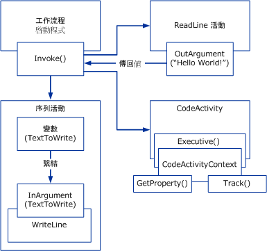

# Windows Workflow 概觀
工作流程是一組基本的單位，稱為*活動*，會儲存為描述真實世界的程序的模型。 工作流程能夠描述執行的順序，以及短期工作和長期工作之間的相依關係。 這個工作會從頭到尾經過整個模型，而活動可能會由人員或系統功能執行。  
  
## 工作流程執行階段引擎  
 每個執行中的工作流程執行個體是由同處理序執行階段引擎建立與維護的，主機處理序會透過以下其中一種方式與該引擎互動：  
  
-   <xref:System.Activities.WorkflowInvoker>，如同方法一般叫用工作流程。  
  
-   <xref:System.Activities.WorkflowApplication>，明確控制單一工作流程執行個體的執行。  
  
-   在多個執行個體的案例中進行訊息式互動的 <xref:System.ServiceModel.WorkflowServiceHost>。  
  
 這裡每個類別都會包含核心活動執行階段，此執行階段是以負責活動執行的 <xref:System.Activities.ActivityInstance> 來表示。 在並行執行的應用程式網域內可能有幾個 <xref:System.Activities.ActivityInstance> 物件。  
  
 前三個主機互動物件是從稱為工作流程程式的活動樹狀中所建立。 使用這些型別或自訂主機包裝<xref:System.Activities.ActivityInstance>，包括主控台應用程式，任何 Windows 處理序內執行的工作流程表單為基礎的應用程式、 Windows 服務[!INCLUDE[vstecasp](../../../includes/vstecasp-md.md)]Web 站台和 Windows Communication Foundation （WCF) 服務。  
  
   
主機處理序中的工作流程元件  
  
## 工作流程元件之間的互動  
 下圖顯示工作流程元件之間的互動方式。  
  
   
  
 在上圖中，<xref:System.Activities.WorkflowInvoker.Invoke%2A> 類別的 <xref:System.Activities.WorkflowInvoker> 方法是用於叫用幾個工作流程執行個體。 <xref:System.Activities.WorkflowInvoker> 是用於不需要從主機管理的輕量工作流程，需要從主機 (例如 <xref:System.Activities.Bookmark> 繼續) 管理的工作流程則必須改用 <xref:System.Activities.WorkflowApplication.Run%2A> 來執行。 不一定要先等候一個工作流程完成，才能叫用另一個工作流程，執行階段引擎支援同時執行多個工作流程執行個體。  叫用的工作流程如下：  
  
-   包含 <xref:System.Activities.Statements.Sequence> 子活動的 <xref:System.Activities.Statements.WriteLine> 活動。 父活動的 <xref:System.Activities.Variable> 會繫結至子活動的 <xref:System.Activities.InArgument>。 如需變數、 引數以及繫結的相關詳細資訊，請參閱 <<c0> [ 變數和引數](../../../docs/framework/windows-workflow-foundation/variables-and-arguments.md)。  
  
-   稱為 `ReadLine` 的自訂活動。 <xref:System.Activities.OutArgument> 活動的 `ReadLine` 會傳回，以呼叫 <xref:System.Activities.WorkflowInvoker.Invoke%2A> 方法。  
  
-   衍生自 <xref:System.Activities.CodeActivity>抽象類別的自訂活動。 <xref:System.Activities.CodeActivity> 可存取使用 <xref:System.Activities.CodeActivityContext> 而可用來做為 <xref:System.Activities.CodeActivity.Execute%2A> 方法之參數的執行階段功能 (例如追蹤與屬性)。 如需這些執行階段功能的詳細資訊，請參閱[工作流程追蹤](../../../docs/framework/windows-workflow-foundation/workflow-tracking-and-tracing.md)並[工作流程執行屬性](../../../docs/framework/windows-workflow-foundation/workflow-execution-properties.md)。  
  
## 另請參閱  
 [BizTalk Server 2006 或 WF？選擇適合您專案的正確工作流程工具](https://go.microsoft.com/fwlink/?LinkId=154901)
