# <a name="windows-workflow-foundation-4-performance"></a>Windows Workflow Foundation 4 效能
Dustin Metzgar  
  
 Wenlong Dong  
  
 Microsoft Corporation，2010 年 9 月  
  
 Microsoft [!INCLUDE[netfx40_long](../../../includes/netfx40-long-md.md)] 包含 [!INCLUDE[wf](../../../includes/wf-md.md)] 的重大修訂，其在效能上進行了大量投資。  這個新修訂在設計方面做了改變，與 .NET Framework 3.0 和 [!INCLUDE[wf1](../../../includes/wf1-md.md)] 隨附的舊版 [!INCLUDE[netfx35_short](../../../includes/netfx35-short-md.md)] 有明顯的不同。 在此版本中，程式設計模型、執行階段及工具的核心已重新架構，以大幅改善效能和可用性。 本主題說明這些修訂的重要效能特性，並且與其舊版進行比較。  
  
 WF3 與 WF4 之間個別工作流程元件效能提升的速度很快。  如此一來，手動編碼的 [!INCLUDE[indigo1](../../../includes/indigo1-md.md)] 服務和 [!INCLUDE[indigo2](../../../includes/indigo2-md.md)] 工作流程服務之間的差距就變得很小。  在 WF4 中，工作流程延遲已大幅降低。  持續性效能已提升 2.5 至 3.0 倍。  透過工作流程追蹤進行健康監視的負荷已明顯減少。  這些都是移轉至 WF4 或在應用程式中採用 WF4 的絕佳理由。  
  
## <a name="terminology"></a>用語  
 本主題後續內容皆以 WF4 代表 [!INCLUDE[wf1](../../../includes/wf1-md.md)] 中引進的 [!INCLUDE[netfx40_short](../../../includes/netfx40-short-md.md)] 版本。  [!INCLUDE[wf1](../../../includes/wf1-md.md)] 是在 .Net 3.0 中引進的，並且透過 [!INCLUDE[netfx35_short](../../../includes/netfx35-short-md.md)] SP1 進行了幾項小幅修訂。 本主題中一律將 [!INCLUDE[netfx35_short](../../../includes/netfx35-short-md.md)] 版的 Workflow Foundation 稱為 WF3。 WF3 與 WF4 一同隨附於 [!INCLUDE[netfx40_short](../../../includes/netfx40-short-md.md)]。 [!INCLUDE[crabout](../../../includes/crabout-md.md)]請參閱 < 將 WF3 成品移轉至 WF4: [Windows Workflow Foundation 4 移轉指南](http://go.microsoft.com/fwlink/?LinkID=153313)  
  
 [!INCLUDE[indigo1](../../../includes/indigo1-md.md)] 是 Microsoft 的統一程式設計模型，用於建置服務導向的應用程式。 它一開始是做為 .NET 3.0 的一部分與 WF3 一併導入，而現在已成為 [!INCLUDE[dnprdnshort](../../../includes/dnprdnshort-md.md)] 的其中一個重要元件。  
  
 Windows Server AppFabric 是一組整合式技術，可讓您更輕鬆地建置、調整及管理 IIS 上執行的 Web 與複合應用程式。 它提供了監視及管理服務和工作流程的工具。 [!INCLUDE[crdefault](../../../includes/crdefault-md.md)][Windows Server AppFabric](http://msdn.microsoft.com/windowsserver/ee695849.aspx)  
  
## <a name="goals"></a>目標  
 本主題的目標在於說明 WF4 的效能特性，其中包含的資料會針對不同的案例加以計算。 此外也會提供 WF4 與 WF3 之間的詳細比較，藉此說明這個新修訂中所做的優越改良。 本文的案例和資料會將 WF4 和 WF3 各層面的基礎成本加以量化。 這項資料除了能讓您充分了解 WF4 的效能特性之外，同時有助於規劃從 WF3 移轉至 WF4 的作業，或是在應用程式開發的過程中使用 WF4。 不過，應用本文資料得出的結論時，務必謹慎考慮。 複合工作流程應用程式的效能主要取決於工作流程的實作方式以及不同元件的整合方式。 因此必須謹慎評估每一個應用程式，才能判斷出該應用程式的效能特性。  
  
## <a name="overview-of-wf4-performance-enhancements"></a>WF4 效能加強功能的概觀  
 WF4 經過仔細的設計與實作，其高效能與延展性將在以下各節中加以描述。  
  
### <a name="wf-runtime"></a>WF 執行階段  
 [!INCLUDE[wf1](../../../includes/wf1-md.md)] 執行階段的核心擁有非同步的排程器，可讓工作流程中的活動執行。 它提供了高效能且可預測的活動執行環境。 這個環境具備妥善定義的執行、接續、完成、取消、例外狀況合約，以及可預測的執行緒模型。  
  
 與 WF3 相較之下，WF4 執行階段的排程器更有效率。 它會運用與 [!INCLUDE[indigo2](../../../includes/indigo2-md.md)] 所使用相同的 I/O 執行緒集區，因此在執行批次工作項目時相當有效率。 內部工作項目排程器佇列已針對最常見的使用模式完成最佳化。 WF4 執行階段還會透過最低限度的同步處理和事件處理邏輯，以相當輕量的方式管理執行狀態，而 WF3 則須倚賴大量的事件註冊和叫用作業，針對狀態轉換進行複雜的同步處理。  
  
### <a name="data-storage-and-flow"></a>資料儲存和流程  
 在 WF3 中，與活動相關聯的資料會透過 <xref:System.Windows.DependencyProperty> 型別所實作的相依性屬性模型化。 相依性屬性模式已於 [!INCLUDE[avalon1](../../../includes/avalon1-md.md)] 中導入。 一般而言，此模式相當富彈性，可支援簡單的資料繫結和其他 UI 功能。 不過，此模式需要將屬性定義為工作流程定義中的靜態欄位。 每當 [!INCLUDE[wf1](../../../includes/wf1-md.md)] 執行階段設定或取得屬性值，就會涉及相當大量的查詢邏輯。  
  
 WF4 使用清楚的資料範圍邏輯，大幅改善了在工作流程中處理資料的方式。 它會使用兩種不同的概念：變數和引數，將儲存於活動中的資料與在活動界限之間流動的資料加以區分。 利用清楚的階層式範圍的變數和"In/Out/InOut"引數，就能大幅降低活動的資料使用複雜度，也會自動設定之資料的存留期範圍。 活動都具有妥善定義的特徵標記，而此特徵標記由其引數所描述。 只要檢查活動，您就可以判斷活動應接收的資料為何，以及活動執行後會產生哪些資料。  
  
 在 WF3 中，活動會在建立工作流程時初始化。 在 WF 4 中，活動只會在對應的活動執行時初始化。 這樣會讓活動的生命週期更為簡單，不必在新的工作流程執行個體建立時執行初始化/取消初始化作業，也因而更有效率。  
  
### <a name="control-flow"></a>控制流程  
 就像任何程式語言一樣，[!INCLUDE[wf1](../../../includes/wf1-md.md)] 透過導入一組用於順序、迴圈、分支和其他模式的控制流程活動，支援工作流程定義的控制流程。 在 WF3 中，當需要重新執行相同的活動時，就會建立新的 <xref:System.Workflow.ComponentModel.ActivityExecutionContext>，而該活動會透過以 <xref:System.Runtime.Serialization.Formatters.Binary.BinaryFormatter> 為基礎的大量序列化和還原序列化邏輯進行複製。 通常反覆執行之控制流程的效能會比執行一系列活動的效能慢很多。  
  
 WF4 處理的方式則大為不同。 它會採用活動範本、建立新的 ActivityInstance 物件，並且將該物件加入至排程器佇列。 這整個程序只需要明確地建立物件，作業相當輕量。  
  
### <a name="asynchronous-programming"></a>非同步程式設計  
 應用程式針對長時間執行的封鎖作業 (例如 I/O) 或分散式運算作業採用非同步程式設計時，通常可展現較佳的效能和延展性。 WF4 會透過基礎活動型別 <xref:System.Activities.AsyncCodeActivity> 和 <xref:System.Activities.AsyncCodeActivity%601> 提供非同步支援。 執行階段原本即了解非同步活動，因此可以在非同步工作未處理完畢時，自動將執行個體放入不保存區域中。 您可以從這些類型衍生自訂活動，以執行非同步工作；如此就不會佔用工作流程排程器執行緒，也不會阻擋任何可平行執行的活動。  
  
### <a name="messaging"></a>傳訊  
 WF3 一開始僅透過外部事件或叫用 Web 服務提供相當有限的傳訊支援。 在 .NET 3.5 中，工作流程可透過 [!INCLUDE[indigo2](../../../includes/indigo2-md.md)] 和 [!INCLUDE[indigo2](../../../includes/indigo2-md.md)] 實作為 <xref:System.Workflow.Activities.SendActivity> 用戶端，或是公開為 <xref:System.Workflow.Activities.ReceiveActivity> 服務。 WF4 已強化這個以工作流程為架構的傳訊程式設計概念，方法是將 [!INCLUDE[indigo2](../../../includes/indigo2-md.md)] 傳訊邏輯緊密整合至 WF。  
  
 .NET 4 的 [!INCLUDE[indigo2](../../../includes/indigo2-md.md)] 中提供的統一訊息處理管線，可大幅提升 WF4 服務的效能和延展性，比 WF3 要高出許多。 WF4 還提供更豐富的傳訊程式設計支援，可建立複雜的訊息交換模式 (MEP) 模型。 開發人員可以使用具型別的服務合約輕鬆進行程式設計，或使用不具型別的服務合約獲得更佳的效能，而不必付出序列化成本。 WF4 中透過 <xref:System.ServiceModel.Activities.SendMessageChannelCache> 類別提供的用戶端通道快取支援，可幫助開發人員執行最少的工作來建置快速的應用程式。 [!INCLUDE[crdefault](../../../includes/crdefault-md.md)][變更快取共用層級傳送活動](../../../docs/framework/wcf/feature-details/changing-the-cache-sharing-levels-for-send-activities.md)。  
  
### <a name="declarative-programming"></a>宣告式程式設計  
 WF4 提供清楚且簡單的宣告式程式設計架構來建立商務程序和服務的模型。 程式設計模型支援完全以宣告的方式撰寫活動，沒有任何 Code-Beside，因而大幅簡化了工作流程的撰寫。 在 [!INCLUDE[netfx40_short](../../../includes/netfx40-short-md.md)] 中，XAML 宣告式程式設計架構已整合至單一組件 System.Xaml.dll，以同時支援 WPF 和 WF。  
  
 在 WF4 中，XAML 提供了真正的宣告式體驗，而且允許使用 XML 標記定義工作流程的整個定義，並參考使用 .NET 建置的活動和型別。 這種方式在採用 XOML 格式的 WF3 中不容易達成，因為沒有自訂的程式碼後置邏輯。 .Net 4 中新的 XAML 堆疊能在序列化/還原序列化工作流程成品方面提供更佳的效能，並且讓宣告式程式設計更吸引人也更穩固。  
  
### <a name="workflow-designer"></a>Workflow Designer  
 WF4 的完全宣告式程式設計支援對於大型工作流程在設計階段的效能要求明顯更高。 與 WF3 相較之下，WF4 中的工作流程設計工具對於大型工作流程擁有較佳的延展性。 有了 UI 虛擬化支援，設計工具只要幾秒鐘就能輕鬆載入包含 1000 個活動的大型工作流程，而 WF3 設計工具則幾乎不可能載入擁有幾百個活動的工作流程。  
  
## <a name="component-level-performance-comparisons"></a>元件層級的效能比較  
 本節包含在 WF3 和 WF4 工作流程中個別活動之間進行直接比較的相關資料。  像是持續性等重要方面，對於效能的影響就比個別活動元件的影響更為深遠。  不過，WF4 中個別元件的效能改進也相當重要，因為現在元件的速度已經迎頭趕上手動編碼的協調流程邏輯。  下一節涵蓋的範例: < 服務撰寫案例 」。  
  
### <a name="environment-setup"></a>環境設定  
 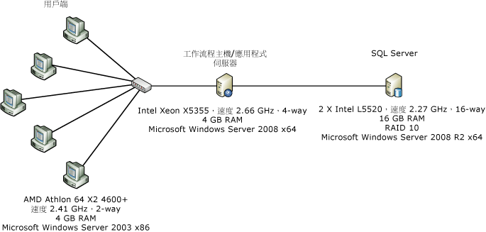  
  
 上圖顯示用於測量元件層級效能的電腦組態。 一部伺服器和五個用戶端透過單一 1 Gbps 乙太網路的網路介面連接。 為了輕鬆進行測量，伺服器會設定為使用執行 Windows Server 2008 x86 雙處理器/四核心伺服器的單一核心。 系統 CPU 使用率幾乎維持在 100%。  
  
### <a name="test-details"></a>測試詳細資料  
 WF3 <xref:System.Workflow.Activities.CodeActivity> 可能是可在 WF3 工作流程中使用的最簡單活動。  此活動會呼叫程式碼後置中的方法，工作流程程式設計人員可以在其中放入自訂程式碼。  在 WF4 中，沒有任何項目與 WF3 的 <xref:System.Workflow.Activities.CodeActivity>  類似且可提供相同功能。  請注意，WF4 中的 <xref:System.Activities.CodeActivity> 基底類別與 WF3 <xref:System.Workflow.Activities.CodeActivity> 不相關。  建議工作流程作者建立自訂活動並建置僅限 XAML 的工作流程。  在下列測試中， WF4 工作流程中空的 `Comment` 會由稱為 <xref:System.Workflow.Activities.CodeActivity> 的活動取代。  `Comment` 活動中的程式碼如下所示：  
  
```  
[ContentProperty("Body")]  
    public sealed class Comment : CodeActivity  
    {  
        public Comment()  
            : base()  
        {  
        }  
  
        [DefaultValue(null)]  
        public Activity Body  
        {  
            get;  
            set;  
        }  
  
        protected override void Execute(CodeActivityContext context)  
        {  
        }  
    }  
```  
  
### <a name="empty-workflow"></a>空白工作流程  
 這項測試會使用沒有子活動的序列工作流程。  
  
### <a name="single-activity"></a>單一活動  
 工作流程是包含一個子活動的序列工作流程。  活動是 <xref:System.Workflow.Activities.CodeActivity>，該活動在 WF3 案例中沒有程式碼，而在 WF4 案例中則為 `Comment` 活動。  
  
### <a name="while-with-1000-iterations"></a>While 搭配 1000 個反覆項目  
 序列工作流程包含一個擁有一個子活動的 <xref:System.Activities.Statements.While> 活動，它位於不執行任何工作的迴圈中。  
  
### <a name="replicator-compared-to-parallelforeach"></a>與 ParallelForEach 比較的 Replicator  
 WF3 中的 <xref:System.Workflow.Activities.ReplicatorActivity> 具有循序和平行執行模式。  在循序模式中，活動的效能與 <xref:System.Workflow.Activities.WhileActivity> 相似。  <xref:System.Workflow.Activities.ReplicatorActivity> 最適合用於平行執行。  WF4 中與此相似的項目為 <xref:System.Activities.Statements.ParallelForEach%601> 活動。  
  
 下圖顯示這項測試所使用的工作流程。 左邊為 WF3 工作流程，右邊為 WF4 工作流程。  
  
 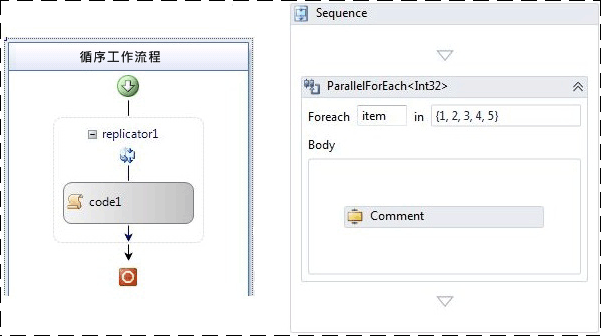  
  
### <a name="sequential-workflow-with-five-activities"></a>包含五個活動的循序工作流程  
 這項測試的目的在於顯示依序執行數個活動的效果。  序列中有五個活動。  
  
### <a name="transaction-scope"></a>交易範圍  
 與其他測試稍為不同的是，交易範圍測試不會針對每個反覆項目建立新的工作流程執行個體。  工作流程會以 while 迴圈建構，該迴圈包含的 <xref:System.Activities.Statements.TransactionScope> 活動中會有一個不執行任何工作的活動。  每次透過 while 迴圈執行一批包含 50 個反覆項目的作業，都會計算為單一作業。  
  
### <a name="compensation"></a>補償  
 WF3 工作流程具有名為 `WorkScope` 的單一可補償活動。  此活動只會實作 <xref:System.Workflow.ComponentModel.ICompensatableActivity> 介面：  
  
```  
class WorkScope :   
        CompositeActivity, ICompensatableActivity  
    {  
        public WorkScope() : base() { }  
  
        public WorkScope(string name)  
        {  
            this.Name = name;  
        }  
  
        public ActivityExecutionStatus Compensate(  
            ActivityExecutionContext executionContext)  
        {  
            return ActivityExecutionStatus.Closed;  
        }  
    }  
```  
  
 錯誤處理常式會以 `WorkScope` 活動為目標。WF4 工作流程同樣非常簡單。  <xref:System.Activities.Statements.CompensableActivity> 包含主體和補償處理常式。  序列中的下一個會是明確補償。  主體活動和補償處理常式活動都是空白實作：  
  
```  
public sealed class CompensableActivityEmptyCompensation : CodeActivity  
    {  
        public CompensableActivityEmptyCompensation()  
            : base() { }  
  
        public Activity Body { get; set; }  
  
        protected override void Execute(CodeActivityContext context) { }  
    }  
    public sealed class CompensableActivityEmptyBody : CodeActivity  
    {  
        public CompensableActivityEmptyBody()  
            : base() { }  
  
        public Activity Body { get; set; }  
  
        protected override void Execute(CodeActivityContext context) { }  
    }  
```  
  
 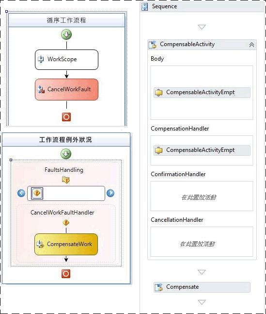  
  
 圖 2 - WF3 (左) 和 WF4 (右) 的基本補償工作流程  
  
### <a name="performance-test-results"></a>效能測試結果  
 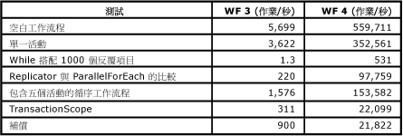  
  
 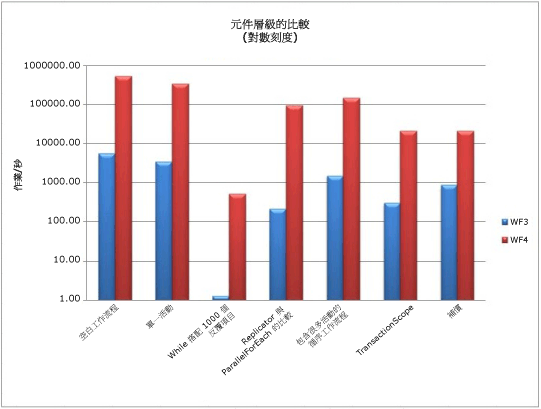  
  
 工作流程的所有測試都是以秒為測量單位，但是異動範圍測試除外。  如上面所示，[!INCLUDE[wf1](../../../includes/wf1-md.md)] 執行階段效能已全面提升，尤其是在需要多次執行相同活動 (如 while 迴圈) 的區域中。  
  
## <a name="service-composition-scenario"></a>服務撰寫案例  
 在上一節 「 元件層級的效能比較 > 中所顯示已經過大幅縮小程式 WF3 和 WF4 之間的額外負荷。  [!INCLUDE[indigo2](../../../includes/indigo2-md.md)] 工作流程服務現在幾乎能夠和手寫程式碼 [!INCLUDE[indigo2](../../../includes/indigo2-md.md)] 服務的效能相抗衡，但仍保有 [!INCLUDE[wf1](../../../includes/wf1-md.md)] 執行階段的所有優點。  這個測試案例會比較 [!INCLUDE[indigo2](../../../includes/indigo2-md.md)] 服務與 WF4 中的 [!INCLUDE[indigo2](../../../includes/indigo2-md.md)] 工作流程服務。  
  
### <a name="online-store-service"></a>線上存放服務  
 [!INCLUDE[wf2](../../../includes/wf2-md.md)] 的其中一項優點在於能夠使用數項服務撰寫處理序。  這個優點的範例為線上存放服務，該服務會協調兩個服務呼叫以採購訂單。  第一個步驟是使用訂單驗證服務驗證訂單。  第二個步驟是使用倉儲服務填寫訂單。  
  
 在兩項測驗中，訂單驗證服務和倉儲服務這兩項後端服務保持不變。  變更的部分是執行協調流程的線上存放服務。  在其中一個案例中，此服務會手動編碼為 [!INCLUDE[indigo2](../../../includes/indigo2-md.md)] 服務。  而在另一個案例中，服務會撰寫為 WF4 中的 [!INCLUDE[indigo2](../../../includes/indigo2-md.md)] 工作流程服務。 在這項測試中，[!INCLUDE[wf1](../../../includes/wf1-md.md)] 的專屬功能像是追蹤和持續性都會關閉。  
  
### <a name="environment"></a>環境  
   
  
 從多部電腦透過 HTTP 對線上存放服務發出用戶端要求。  這三項服務全裝載於單一電腦。  線上存放服務和後端服務之間的傳輸層是 TCP 或 HTTP。  對作業/秒的測量是以完成的 `PurchaseOrder` 呼叫數目為基礎，這些呼叫的目標是線上存放服務。  通道共用是 WF4 提供的新功能。  在這項測試的 [!INCLUDE[indigo2](../../../includes/indigo2-md.md)] 部分，通道共用並非立即可用，因此線上存放服務中是使用簡單共用技術的手動編碼實作。  
  
### <a name="performance"></a>效能  
 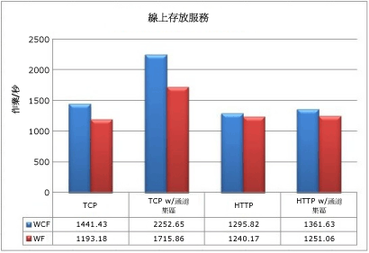  
  
 不透過通道共用連線到後端 TCP 服務時，[!INCLUDE[wf1](../../../includes/wf1-md.md)] 服務的輸送量會有 17.2% 的影響。  若透過通道共用，則影響約 23.8%。  若為 HTTP，則影響相對較低：不透過共用為 4.3%，透過共用則為 8.1%。  另外要特別注意的是，使用 HTTP 時通道共用的效用不大。  
  
 雖然在這項測試中，WF4 執行階段與手動編碼的 [!INCLUDE[indigo2](../../../includes/indigo2-md.md)] 服務相較之下仍有負荷，但是可以視為最壞情況的案例。  在這項測試中，兩個後端服務執行的工作相當少。  在實際的端對端案例中，這些服務會執行更耗費資源的作業，像是資料庫呼叫，傳輸層效能的影響即變得較不重要。  再加上 WF4 所提供的功能優勢，使得 Workflow Foundation 成為一項建立協調流程服務的可行選擇。  
  
## <a name="key-performance-considerations"></a>重要的效能考量  
 本節中提到的功能 (Interop 除外) 在 WF3 和 WF4 之間已有大幅變更。  這會影響工作流程應用程式的設計以及效能。  
  
#### <a name="workflow-activation-latency"></a>工作流程啟動延遲  
 在 [!INCLUDE[indigo2](../../../includes/indigo2-md.md)] 工作流程服務應用程式中，用於啟動新工作流程或載入現有工作流程的延遲十分重要，因為可能會造成封鎖的情況。  這項測試案例會評估一般案例中的 WF3 XOML 主機與 WF4 XAMLX 主機。  
  
##### <a name="environment-setup"></a>環境設定  
 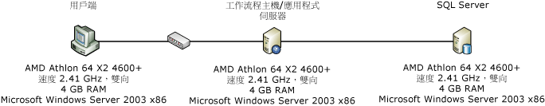  
  
##### <a name="test-setup"></a>測試設定  
 在此案例中，用戶端電腦會使用以內容為主的相互關聯來連絡 [!INCLUDE[indigo2](../../../includes/indigo2-md.md)] 工作流程服務。  內容相互關聯需要特殊的內容繫結，並使用內容標頭或 Cookie 將訊息與正確的工作流程產生關聯。  這樣做有益於效能，因為相互關聯 ID 位於訊息標頭中，因此訊息本文不需要進行剖析。 [!INCLUDE[crabout](../../../includes/crabout-md.md)]請參閱 < 內容相互關聯[內容交換相互關聯](../../../docs/framework/wcf/feature-details/context-exchange-correlation.md)  
  
 服務將根據要求建立新的工作流程，並且傳送立即回應，如此對延遲的測量就不會包括執行工作流程所花的時間。  WF3 工作流程是包含程式碼後置的 XOML，而 WF4 工作流程完全是 XAML。  WF4 工作流程看起來像這樣：  
  
 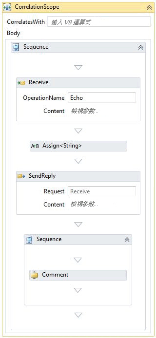  
  
 <xref:System.ServiceModel.Activities.Receive> 活動會建立工作流程執行個體。  接收的訊息中傳遞的值會重複在回覆訊息中。  回覆之後的序列包含工作流程的其餘部分。  上述案例中只會顯示一個註解活動。  註解活動的數量會變更，以模擬工作流程的複雜度。  註解活動相當於不執行任何工作的 WF3 <xref:System.Workflow.Activities.CodeActivity>。 [!INCLUDE[crabout](../../../includes/crabout-md.md)]註解活動，請參閱本文稍早的 「 元件層級效能比較 > 一節。  
  
##### <a name="test-results"></a>測試結果  
 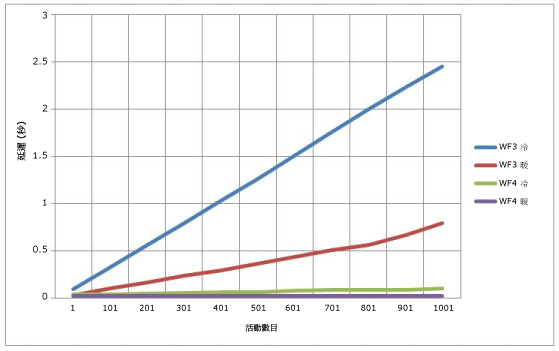  
  
 圖 3 - WCF 工作流程服務的冷延遲和暖延遲  
  
 在上圖中，「冷」是表示指定的工作流程沒有現有的 <xref:System.ServiceModel.WorkflowServiceHost>。  換句話說，冷延遲意謂第一次使用此工作流程，XOML 或 XAML 需要進行編譯。  暖延遲則意謂所建立的新工作流程執行個體，其工作流程類型已完成編譯。  工作流程的複雜度在 WF4 案例中只有相當些微的差異，但是在 WF3 案例中則呈現直線進展。  
  
#### <a name="correlation-throughput"></a>相互關聯輸送量  
 WF4 採用新的內容架構相互關聯 (Content-Based Correlation) 功能。  WF3 僅提供以內容為主的相互關聯 (Context-Based Correlation)。  以內容為主的相互關聯只能透過特定 [!INCLUDE[indigo2](../../../includes/indigo2-md.md)] 通道繫結進行。  使用這些繫結時，工作流程 ID 會插入至訊息標頭。  WF3 執行階段只能根據工作流程 ID 來識別工作流程。搭配以內容為基礎的相互關聯的工作流程作者可以建立不相關的一份資料，像是帳戶號碼或客戶識別碼。 相互關聯索引鍵[!INCLUDE[crabout](../../../includes/crabout-md.md)]內容架構相互關聯，請參閱[內容基礎的相互關聯](../../../docs/framework/wcf/feature-details/content-based-correlation.md)。  
  
 以內容為主的相互關聯擁有的效能優勢在於，相互關聯索引鍵位於訊息標頭內。  索引鍵可以從訊息讀取，而不需進行還原序列化/訊息複製。  在內容架構的相互關聯中，相互關聯索引鍵是儲存在訊息主體中。  XPath 運算式會用來尋找該索引鍵。  這項額外處理的成本取決於訊息的大小、索引鍵在主體中的深度，以及索引鍵的數量。  這項測試會比較以內容為主的相互關聯與內容架構的相互關聯，另外還會顯示使用多個索引鍵時效能降低的情況。  
  
#### <a name="environment-setup"></a>環境設定  
   
  
#### <a name="test-setup"></a>測試設定  
 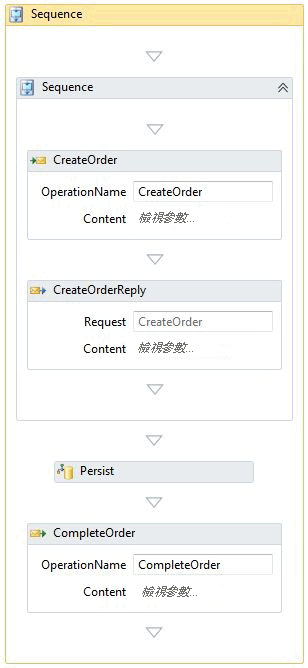  
  
 如上所示的工作流程是在以下的 < 持續性 > 一節中所用的相同。  執行階段中並未針對未包含持續性的相互關聯測試安裝持續性提供者。  相互關聯會在兩處發生：CreateOrder 和 CompleteOrder。  
  
#### <a name="test-results"></a>測試結果  
 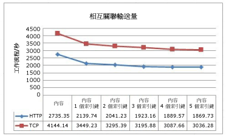  
  
 此圖顯示效能會隨著內容架構相互關聯中使用的索引鍵數目增加而降低。  TCP 和 HTTP 之間曲線的相似度，表示與這兩種通訊協定相關聯的負荷。  
  
#### <a name="correlation-with-persistence"></a>具備持續性的相互關聯  
 使用已保存的工作流程時，來自內容架構相互關聯的 CPU 壓力會從工作流程執行階段轉移至 SQL 資料庫。  SQL 持續性提供者中的預存程序會進行比對索引鍵的工作，以找出適當的工作流程。  
  
 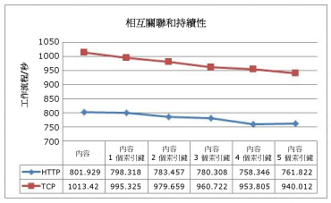  
  
 以內容為主的相互關聯速度仍然比內容架構的相互關聯快。  然而差異較不明顯，因為持續性對於效能的影響比相互關聯還要大。  
  
### <a name="complex-workflow-throughput"></a>複雜的工作流程輸送量  
 在測量工作流程複雜度時，並不只是看活動的數目。  複合活動可能包含許多子系，而這些子系本身也可能是複合活動。  隨著巢狀層級的數目增加，目前可能處於執行中狀態的活動數目，以及處於狀態中的變數數目也會增加。  這項測試會比較執行複雜工作流程時 WF3 和 WF4 的輸送量。  
  
### <a name="test-setup"></a>測試設定  
 這些測試會在執行 Windows Server 2008 x64、擁有 4GB RAM 且採用 Xeon X5355 (速度 2.66GHz) 的 4 向電腦上執行。  測試程式碼會在單一處理序中以每個核心一個執行緒的方式執行，以達到 100% CPU 使用率。  
  
 針對這項測試所產生的工作流程有兩個主要變數：深度和每個序列的活動數目。  每一個深度層級都包含一個平行活動、while 迴圈、決策、指派及序列。  下圖顯示的 WF4 設計工具中，會顯示最上層流程圖。  每個流程圖活動都與主要流程圖相似。  您可以將這個工作流程想像成一個不規則碎片，其中深度受限於測試的參數。  
  
 指定之測試中活動的數目取決於深度和每個序列的活動數目。  下列方程式會計算 WF4 測試中的活動數目：  
  
   
  
 由於有額外的序列，WF3 測試的活動計數可以藉由稍為不同的方程式計算：  
  
   
  
 其中 d 代表深度，a 代表每個序列的活動數目。  這些方程式背後的邏輯在於，第一個常數乘以 a 得出序列的數目，而第二個常數是目前層級中的靜態活動數目。  每一個流程圖中會有三個流程圖子活動。  這些流程圖在最下層會是空的，但是在其他層級中則會是主要流程圖的複本。  下表針對每個經變化的測試，顯示其工作流程定義中的活動數目：  
  
 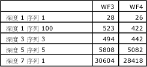  
  
 工作流程定義中的活動數目會隨著深度加深而大幅增加。  但是，在指定的工作流程執行個體中，每個決策點只會執行一個路徑，因此只會執行實際活動的一小部分。  
  
 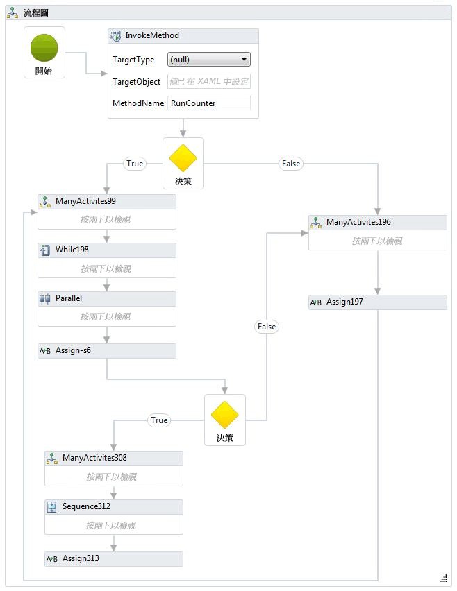  
  
 WF3 中會建立對等的工作流程。 WF3 設計工具會在設計區域中顯示整個工作流程，而非巢狀結構，因此超出本主題所能顯示的範圍。 下面顯示工作流程的片段。  
  
 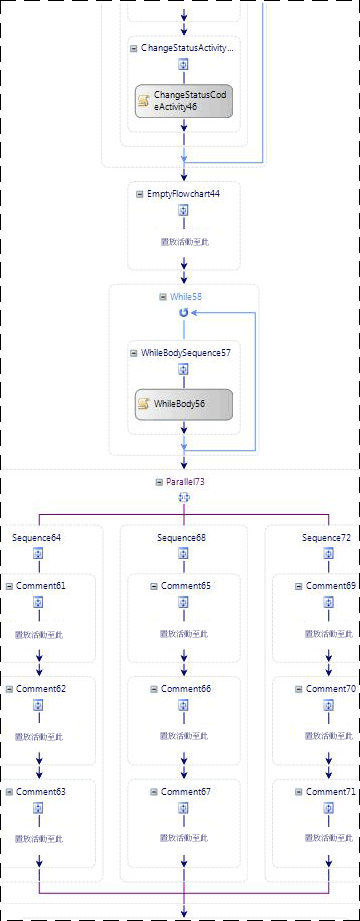  
  
 為了練習極端案例中的巢狀結構，這項測試包含的另一個工作流程會使用 100 個巢狀序列。  最內層的序列是單一 `Comment` 或 <xref:System.Workflow.Activities.CodeActivity>。  
  
 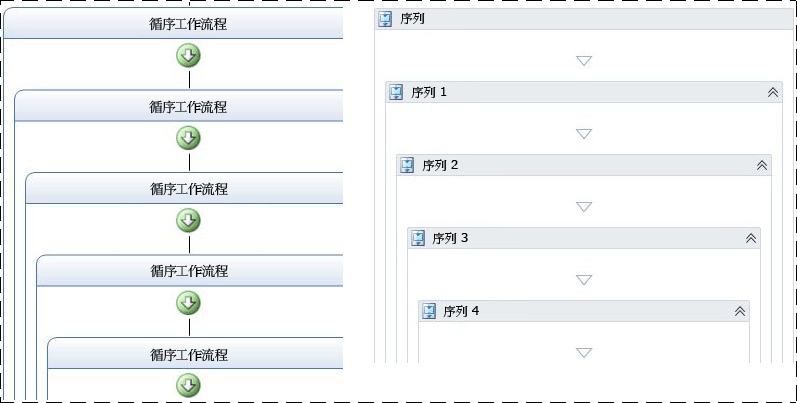  
  
 這項測試中不會使用追蹤和持續性。  
  
### <a name="test-results"></a>測試結果  
 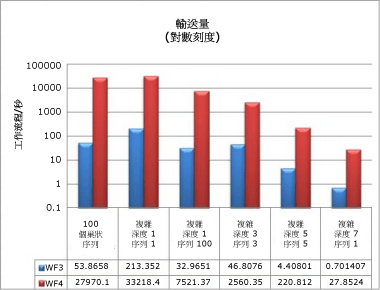  
  
 即使是擁有多層深度和大量活動的複雜工作流程，其效能與本文前段所示的其他輸送量數字一致。  WF4 的輸送量增加的速度較快，而且必須在對數刻度上進行比較。  
  
### <a name="memory"></a>記憶體  
 Windows Workflow Foundation 的記憶體負荷是從兩個重要的方面加以測量：工作流程複雜度和工作流程定義的數目。  記憶體測量作業是在 Windows 7 64 位元工作站上進行。  有許多方法來取得工作集大小，例如監視效能計數器、 輪詢 Environment.WorkingSet，或使用可從 VMMap 這類工具進行的測量[VMMap](http://technet.microsoft.com/sysinternals/dd535533.aspx)。 您可以結合各種方式來取得和驗證每項測試的結果。  
  
### <a name="workflow-complexity-test"></a>工作流程複雜度測試  
 工作流程複雜度測試會依據工作流程的複雜度測量工作集的差異。  除了上節中使用的複雜工作流程之外，還加入了新的變化以涵蓋兩個基本案例：單一活動工作流程，以及包含 1000 個活動的序列。  在這些測試中，工作流程會在單一序列迴圈中初始化並且完整執行 (為時一分鐘)。  每一個經變化的測試都會執行三次，而記錄的資料會是這三個回合的平均值。  
  
 兩項新基本測試中的工作流程如下所示：  
  
 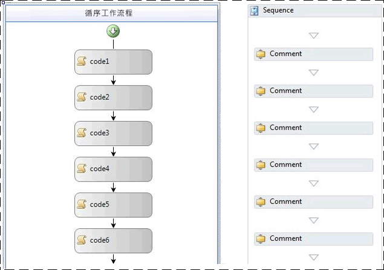  
  
 在上面所示的 WF3 工作流程中，會使用空的 <xref:System.Workflow.Activities.CodeActivity> 活動。  上面的 WF4 工作流程則會使用 `Comment` 活動。  `Comment` 活動已在本文前段的＜元件層級的效能比較＞一節中說明。  
  
 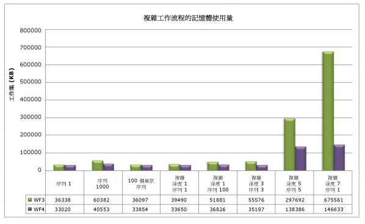  
  
 此圖中其中一個值得注意的明顯趨勢為：巢狀結構對於 WF3 和 WF4 的記憶體使用量相對來說影響較小。  指定之工作流程中的活動數目對記憶體的影響程度最大。  若查看序列 1000、複雜深度 5 序列 5 及複雜深度 7 序列 1 這些變化的資料，就能清楚得知，活動數目增加到千位數時，記憶體使用量也會更明顯地增加。  在有將近 29000 個活動的極端案例中 (深度 7 序列 1)，WF4 使用的記憶體幾乎比 WF3 少 79%。  
  
### <a name="multiple-workflow-definitions-test"></a>多個工作流程定義測試  
 由於 WF3 和 WF4 中可用於裝載工作流程的選項有所不同，因此會分成兩項不同的測試來測量每個工作流程定義的記憶體使用量。  這兩項測試執行的方式與工作流程複雜度測試不同，因為根據定義初始化和執行指定之工作流程的次數只有一次。  這是因為工作流程定義及其主機在 AppDomain 的存留期會保留在記憶體中。  為執行指定之工作流程執行個體而使用的記憶體應該在記憶體回收期間清除。  WF4 的移轉指引包含有關裝載選項的詳細資訊。 [!INCLUDE[crdefault](../../../includes/crdefault-md.md)][WF 移轉操作手冊： 工作流程裝載](http://go.microsoft.com/fwlink/?LinkID=153313)。  
  
 您可以透過使用幾種方式建立許多工作流程定義，以進工作流程定義測試。  例如，您可以使用程式碼產生建立一組除了名稱之外完全相同的 1000 個工作流程，然後將每一個工作流程儲存到不同的檔案中。  這種方式原本是用於主控台裝載的測試。  在 WF3 中，<xref:System.Workflow.Runtime.WorkflowRuntime> 類別是用來執行工作流程定義。  WF4 可使用 <xref:System.Activities.WorkflowApplication> 來建立單一工作流程執行個體，也可以直接使用 <xref:System.Activities.WorkflowInvoker> 來執行活動，就像使用方法呼叫一樣。  <xref:System.Activities.WorkflowApplication> 是單一工作流程執行個體的主機，其功能與 <xref:System.Workflow.Runtime.WorkflowRuntime> 相近，因此在這項測試中使用。  
  
 在 IIS 中裝載工作流程時，可以使用 <xref:System.Web.Hosting.VirtualPathProvider> 建立新的 <xref:System.ServiceModel.WorkflowServiceHost>，而不產生所有 XAMLX 或 XOML 檔案。  <xref:System.Web.Hosting.VirtualPathProvider>處理傳入要求和 「 虛擬檔案 」 可從資料庫載入或，立即在此情況下，產生的回應。  因此不需要建立 1000 個實體檔案。  
  
 主控台測試中所使用的工作流程定義是包含單一活動的簡單循序工作流程。  單一活動在 WF3 案例中是空的 <xref:System.Workflow.Activities.CodeActivity>，在 WF4 案例中則是 `Comment` 活動。  IIS 裝載的案例使用的工作流程是從接收訊息開始，於傳送回覆時結束：  
  
 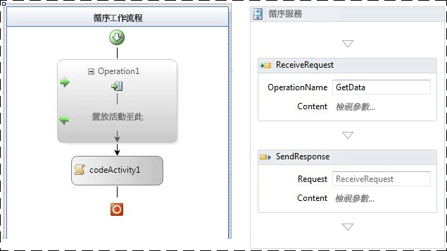  
  
 圖 4 - 使用 ReceiveActivity 的 WF3 工作流程，以及使用要求/回應模式的 WF4 工作流程  
  
 下表顯示單一工作流程定義與 1001 個定義在工作集上的差異：  
  
|裝載選項|WF3 工作集差異|WF4 工作集差異|  
|---------------------|---------------------------|---------------------------|  
|主控台應用程式裝載的工作流程|18 MB|9 MB|  
|IIS 裝載的工作流程服務|446 MB|364 MB|  
  
 在 IIS 中裝載工作流程定義會因為 <xref:System.ServiceModel.WorkflowServiceHost>、詳細的 [!INCLUDE[indigo2](../../../includes/indigo2-md.md)] 服務成品，以及與主機相關聯的訊息處理邏輯，而耗用更多記憶體。  
  
 針對 WF3 中的主控台裝載作業，工作流程會以程式碼實作，而不是 XOML。  在 WF4 中，預設為使用 XAML。  XAML 會在組件中儲存為內嵌資源，並且在執行階段期間編譯，以提供工作流程的實作。  此程序會產生一些負荷。  為了在 WF3 和 WF4 之間進行公平的比較，會使用以程式碼 (而非 XAML) 撰寫的工作流程。  以下顯示其中一個 WF4 工作流程的範例：  
  
```  
public class Workflow1 : Activity  
{  
    protected override Func<Activity> Implementation  
    {  
        get  
        {  
            return new Func<Activity>(() =>  
            {  
                return new Sequence  
                {  
                    Activities = {  
                        new Comment()  
                    }  
                };  
            });  
        }  
        set  
        {  
            base.Implementation = value;  
        }  
    }  
}  
```  
  
 還有許多其他的因素可能會影響記憶體消耗。 針對所有 Managed 程式的相同建議仍適用。  在 IIS 裝載環境中，針對工作流程定義建立的 <xref:System.ServiceModel.WorkflowServiceHost> 物件會保留在記憶體中，直到回收應用程式集區為止。  撰寫延伸模組時，務必記住這點。  此外，最好避免 「 全域 」 變數 （範圍為整個工作流程的變數），並盡可能限制變數的範圍。  
  
## <a name="workflow-runtime-services"></a>工作流程執行階段服務  
  
### <a name="persistence"></a>持續性  
 WF3 和 WF4 都隨附 SQL 持續性提供者。  WF3 SQL 持續性提供者是一個簡單的實作，可以將工作流程執行個體序列化並將它儲存到 BLOB 中。  基於這個理由，工作流程執行個體的大小對於此提供者的效能會有相當大的影響。  在 WF3 中，可能導致執行個體大小增加的原因有許多種，如本文件前段所討論。  許多客戶選擇不使用預設的 SQL 持續性提供者，因為將序列化執行個體儲存在資料庫中會導致無法看見工作流程的狀態。  若要在不知道工作流程 ID 的情況下尋找特定工作流程，則必須還原序列化每個保存的執行個體，並且檢查內容。  許多開發人員偏好撰寫自己的持續性提供者來克服這個障礙。  
  
 WF4 SQL 持續性提供者已嘗試解決部分問題。  持續性資料表會公開特定資訊，例如使用中書籤和可提升的屬性。  WF4 中新的內容架構相互關聯功能使用 WF3 SQL 持續性方法的話，可能無法正常執行，該功能已對保存的工作流程執行個體進行一些組織上的變更。  這樣會使持續性提供者的工作更為複雜，並帶給資料庫額外的壓力。  
  
### <a name="environment-setup"></a>環境設定  
   
  
### <a name="test-setup"></a>測試設定  
 即使有了改良的功能集和更優越的並行處理，WF4 中 SQL 持續性提供者的速度還是比 WF3 中的提供者快。  為了展示這個情況，以下將比較 WF3 和 WF4 中執行本質相同之作業的兩個工作流程。  
  
 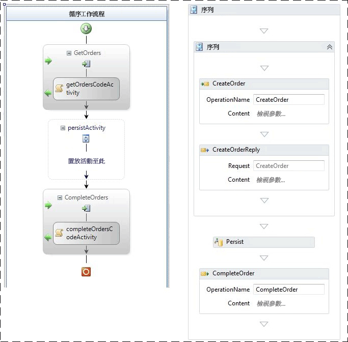  
  
 圖 5 - 左邊為 WF3 中的持續性工作流程，右邊則為 WF4  
  
 兩個工作流程都是透過收到的訊息所建立。  傳送初始回覆之後，會保存工作流程。  WF3 案例中會使用空的 <xref:System.Workflow.ComponentModel.TransactionScopeActivity> 啟始持續性。  相同無法在 WF3 中達成方式是標示為 「 保存關閉 」。 活動  另一個相互關聯的訊息會完成工作流程。  工作流程會保存，但是不會卸載。  
  
### <a name="test-results"></a>測試結果  
 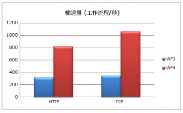  
  
 當用戶端和中介層之間的傳輸為 HTTP 時，WF4 中的持續性就會提升 2.6 倍。  TCP 傳輸會將該係數增加為 3.0 倍。  在所有案例中，中介層的 CPU 使用率都會是 98% 或更高。  WF4 輸送量較大的原因在於，工作流程執行階段的速度較快。  這兩個案例的序列化執行個體都不大，所以在此情況下並不是主要影響因素。  
  
 這項測試中的 WF3 和 WF4 工作流程都使用活動明確指出持續性應該發生的時機。  這樣做的優點在於保存工作流程，而不將它卸載。  在 WF3 中也可以使用 <xref:System.ServiceModel.Activities.Description.WorkflowIdleBehavior.TimeToUnload%2A> 功能保存，但是這樣會從記憶體卸載工作流程執行個體。  如果使用 WF3 的開發人員想要確保在特定時間點保存工作流程，則必須修改工作流程定義，或是付出卸載及重新載入工作流程執行個體的成本。  WF4 的新功能則可在不需要卸載的情況下保存工作流程執行個體：<xref:System.ServiceModel.Activities.Description.WorkflowIdleBehavior.TimeToPersist%2A>。  這項功能允許工作流程執行個體在閒置時被保存，並且保留在記憶體中，直到達到 <xref:System.ServiceModel.Activities.Description.WorkflowIdleBehavior.TimeToUnload%2A> 臨界值或繼續執行時。  
  
 請注意，WF4 SQL 持續性提供者在資料庫層中會執行較多工作。  由於 SQL 資料庫可能變成瓶頸，因此務必監視該處的 CPU 和磁碟使用量。  效能測試工作流程應用程式時，務必包括以下 SQL 資料庫中的效能計數器：  
  
-   PhysicalDisk\\%的磁碟讀取的時間  
  
-   PhysicalDisk\\%Disk Time  
  
-   PhysicalDisk\\%的磁碟寫入的時間  
  
-   PhysicalDisk\\%avg.Disk Queue Length  
  
-   PhysicalDisk\Avg.Disk Read Queue Length  
  
-   PhysicalDisk\Avg.Disk Write Queue Length  
  
-   PhysicalDisk\Current Disk Queue Length  
  
-   處理器資訊\\%處理器時間  
  
-   SQLServer:Latches\Average Latch Wait Time (ms)  
  
-   SQLServer:Latches\Latch Waits/sec  
  
### <a name="tracking"></a>追蹤  
 工作流程追蹤可以用來追蹤工作流程的進度。  追蹤事件中包含的資訊是由追蹤設定檔所決定。  追蹤設定檔越複雜，追蹤所耗用的資源就愈多。  
  
 WF3 隨附 SQL 架構追蹤服務。  這項服務可以在批次和非批次模式下運作。  在非批次模式中，追蹤事件會直接寫入資料庫。  在批次模式中，追蹤事件會收集到與工作流程執行個體狀態相同的批次中。  針對最廣泛的工作流程設計，批次模式可提供最佳效能。  不過，如果工作流程執行許多活動而未保存，而且這些活動都會加以追蹤，則批次處理可能對效能產生負面影響。  這種情況常發生在迴圈中，而避免這種情況發生的最佳方式，就是設計大型迴圈來包含保存點。  在迴圈中導入保存點同樣可能對效能造成負面影響，因此務必計算各項的成本並找出平衡。  
  
 WF4 沒有隨附 SQL 追蹤服務。  將追蹤資訊記錄到 SQL 資料庫的工作，交由應用程式伺服器處理會比內建於 [!INCLUDE[dnprdnshort](../../../includes/dnprdnshort-md.md)] 更有效。 因此，SQL 追蹤現在是由 AppFabric 處理。  WF4 中現成的追蹤提供者是以 Windows 事件追蹤 (ETW) 為基礎。  
  
 ETW 是核心層級的低延遲事件系統，內建於 Windows。  它使用提供者/消費者模型，如此在實際上有消費者時，就只有事件追蹤會產生負面影響。  除了核心事件 (像是處理器、磁碟、記憶體和網路使用量) 之外，許多應用程式也都會運用 ETW。  ETW 事件的功能比效能計數器強大，因為可以針對應用程式自訂事件。  事件可以包含像是工作流程 ID 或資訊訊息這類文字。  此外，事件還會依位元遮罩分類，如此一來，使用特定事件子集對效能的影響就會比擷取所有事件低。  
  
 使用 ETW 而不使用 SQL 進行追蹤的優點如下：  
  
-   追蹤事件的收集工作可以分割到另一個處理序。  如此就能在事件記錄方式上獲得更大的彈性。  
  
-   ETW 追蹤事件可輕鬆結合 [!INCLUDE[indigo2](../../../includes/indigo2-md.md)] ETW 事件或是其他 ETW 提供者，例如 SQL Server 或核心提供者。  
  
-   工作流程作者不需要修改工作流程，就能更充分地運用特定追蹤實作，例如 WF3 SQL 追蹤服務的批次模式。  
  
-   系統管理員可以開啟或關閉追蹤功能，而不需回收主機處理序。  
  
 但是 ETW 追蹤的效能優點伴隨了一個缺點。  如果系統的資源壓力很大，則 ETW 事件可能會遺失。  事件處理的目的不是封鎖正常的程式執行，因此無法保證所有 ETW 事件都會廣播至其訂閱者。  因此 ETW 追蹤相當適合用於健康監視，但不適合用於稽核。  
  
 雖然 WF4 沒有 SQL 追蹤提供者，但是 AppFabric 有。  AppFabric 的 SQL 追蹤方法是使用 Windows 服務訂閱 ETW 事件，此服務會批次處理事件並將事件寫入可快速插入的 SQL 資料表中。  另一項工作會從這個資料表取出資料，然後重新製成可在 AppFabric 儀表板上檢視的報告資料表。  這表示一批追蹤事件會與其來源的工作流程分開處理，因此不必等待保存點即可加以記錄。  
  
 ETW 事件可以使用 logman 或 xperf 這類工具記錄。  壓縮的 ETL 檔案可以使用 xperfview 這類工具檢視，或是使用 tracerpt 轉換成更容易閱讀的格式，例如 XML。  在 WF3 中，若要不使用 SQL 資料庫來取得追蹤事件，唯一的方法就是建立自訂追蹤服務。 [!INCLUDE[crabout](../../../includes/crabout-md.md)]ETW，請參閱[WCF 服務和 Windows 事件追蹤](../../../docs/framework/wcf/samples/wcf-services-and-event-tracing-for-windows.md)和[Windows 事件追蹤](http://msdn.microsoft.com/library/ff190903.aspx\))。  
  
 啟用工作流程追蹤對效能會有不同程度的影響。  下列基準會使用 logman 工具取用 ETW 追蹤事件，並且將事件記錄到 ETL 檔案。  AppFabric 中 SQL 追蹤的成本不在本文的討論範圍內。  此基準中會顯示基本追蹤設定檔 (也會在 AppFabric 中使用)。  另外還包括僅追蹤健康監視事件的成本。  這些事件有助於問題的疑難排解，以及判斷系統的平均輸送量。  
  
### <a name="environment-setup"></a>環境設定  
   
  
### <a name="test-results"></a>測試結果  
 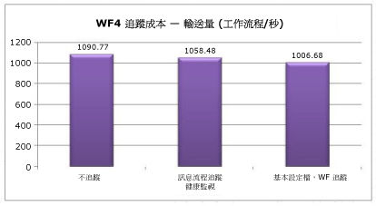  
  
 健康監視對於輸送量的影響約為 3%。  基本設定檔的成本約為 8%。  
  
## <a name="interop"></a>Interop  
 WF4 幾乎是完全重新撰寫 [!INCLUDE[wf1](../../../includes/wf1-md.md)] 的結果，因此 WF3 工作流程和活動無法與 WF4 直接相容。  採用的許多客戶[!INCLUDE[wf2](../../../includes/wf2-md.md)]早期將有內部或第三方的工作流程定義和自訂活動的 WF3。  其中一種輕鬆轉換至 WF4 的方式就是使用 Interop 活動，該活動可以從 WF4 工作流程內執行 WF3 活動。  建議必要時才使用 <xref:System.Activities.Statements.Interop> 活動。 [!INCLUDE[crabout](../../../includes/crabout-md.md)]移轉至 WF4 簽出[WF4 移轉指引](http://go.microsoft.com/fwlink/?LinkID=153313)。  
  
### <a name="environment-setup"></a>環境設定  
   
  
### <a name="test-results"></a>測試結果  
 下表顯示在各種不同組態中，執行序列中包含五個活動之工作流程的結果。  
  
|測試|輸送量 (工作流程/秒)|  
|----------|-----------------------------------|  
|WF3 執行階段中的 WF3 序列|1,576|  
|使用 Interop 之 WF4 執行階段中的 WF3 序列|2,745|  
|WF4 序列|153,582|  
  
 直接透過 WF3 使用 Interop 在效能上有顯著提升。  不過，與 WF4 活動相較之下，這項提升就顯得微不足道。  
  
## <a name="summary"></a>摘要  
 WF4 中對效能的大量投資已在許多重要的方面獲得成效。  在某些情況下，WF4 中個別工作流程元件的效能比 WF3 快上數百倍，因為 WF4 擁有較精簡的 [!INCLUDE[wf1](../../../includes/wf1-md.md)] 執行階段。  延遲數據同樣大為改善。  這表示若將使用 [!INCLUDE[wf1](../../../includes/wf1-md.md)] 的附加優勢納入考量，則相較於手動編碼的 [!INCLUDE[indigo2](../../../includes/indigo2-md.md)] 協調流程服務，使用 [!INCLUDE[wf1](../../../includes/wf1-md.md)] 的效能負面影響便相當小。  持續性效能已提升 2.5 至 3.0 倍。  現在透過工作流程追蹤進行健康監視的負荷已相當低。  若您考慮從 WF3 移至 WF4，我們提供了一套完整的移轉指南。  這些都將使 WF4 成為撰寫複雜應用程式的理想選擇。  
  
## <a name="acknowledgements"></a>謝誌  
 非常感謝下列參與人員與校閱人員的大力協助：  
  
-   Leon Welicki，Microsoft Corporation  
  
-   Ryszard Kwiecinski，Microsoft Corporation  
  
-   Emil Velinov，Microsoft Corporation  
  
-   Nate Talbert，Microsoft Corporation  
  
-   Bob Schmidt，Microsoft Corporation  
  
-   Stefan Batres，Microsoft Corporation
