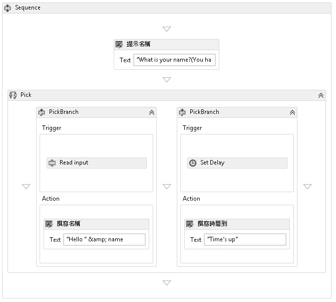

# <a name="pick-activity"></a><span data-ttu-id="33629-102">Pick 活動</span><span class="sxs-lookup"><span data-stu-id="33629-102">Pick Activity</span></span>
<span data-ttu-id="33629-103"><xref:System.Activities.Statements.Pick> 活動會簡化一組後續有對應處理常式之事件觸發程序的模型。</span><span class="sxs-lookup"><span data-stu-id="33629-103">The <xref:System.Activities.Statements.Pick> activity simplifies the modeling of a set of event triggers followed by their corresponding handlers.</span></span>  <span data-ttu-id="33629-104"><xref:System.Activities.Statements.Pick> 活動包含<xref:System.Activities.Statements.PickBranch> 活動的集合，其中每個 <xref:System.Activities.Statements.PickBranch> 是 <xref:System.Activities.Statements.PickBranch.Trigger%2A> 活動和 <xref:System.Activities.Statements.PickBranch.Action%2A> 活動間的配對。</span><span class="sxs-lookup"><span data-stu-id="33629-104">A <xref:System.Activities.Statements.Pick> activity contains a collection of <xref:System.Activities.Statements.PickBranch> activities, where each <xref:System.Activities.Statements.PickBranch> is a pairing between a <xref:System.Activities.Statements.PickBranch.Trigger%2A> activity and an <xref:System.Activities.Statements.PickBranch.Action%2A> activity.</span></span>  <span data-ttu-id="33629-105">在執行時間，會平行執行所有分支的觸發程序。</span><span class="sxs-lookup"><span data-stu-id="33629-105">At execution time, the triggers for all branches are executed in parallel.</span></span>  <span data-ttu-id="33629-106">當一個觸發程序完成時，就會執行對應的動作，然後取消所有其他的觸發程序。</span><span class="sxs-lookup"><span data-stu-id="33629-106">When one trigger completes, then its corresponding action is executed, and all other triggers are canceled.</span></span>  <span data-ttu-id="33629-107">[!INCLUDE[netfx_current_short](../../../includes/netfx-current-short-md.md)]<xref:System.Activities.Statements.Pick> 活動的行為與 [!INCLUDE[netfx35_short](../../../includes/netfx35-short-md.md)]<xref:System.Workflow.Activities.ListenActivity> 活動相似。</span><span class="sxs-lookup"><span data-stu-id="33629-107">The behavior of the [!INCLUDE[netfx_current_short](../../../includes/netfx-current-short-md.md)]<xref:System.Activities.Statements.Pick> activity is similar to the [!INCLUDE[netfx35_short](../../../includes/netfx35-short-md.md)]<xref:System.Workflow.Activities.ListenActivity> activity.</span></span>  
  
 <span data-ttu-id="33629-108">以下螢幕擷取畫面是出自[使用 Pick 活動](./samples/using-the-pick-activity.md) SDK 範例，示範兩個分支的 Pick 活動。</span><span class="sxs-lookup"><span data-stu-id="33629-108">The following screenshot from the [Using the Pick Activity](./samples/using-the-pick-activity.md) SDK sample shows a Pick activity with two branches.</span></span>  <span data-ttu-id="33629-109">分支有稱為 [讀取輸入] 的觸發程序，而這是從命令列讀取輸入的自訂活動。</span><span class="sxs-lookup"><span data-stu-id="33629-109">One branch has a trigger called **Read input**, a custom activity that reads input from the command line.</span></span> <span data-ttu-id="33629-110">第二個分支有 <xref:System.Activities.Statements.Delay> 活動觸發程序。</span><span class="sxs-lookup"><span data-stu-id="33629-110">The second branch has a <xref:System.Activities.Statements.Delay> activity trigger.</span></span> <span data-ttu-id="33629-111">如果**讀取輸入**活動接收資料，然後才<xref:System.Activities.Statements.Delay>活動完成<xref:System.Activities.Statements.Delay>取消延遲，並且將祝賀詞寫入主控台。</span><span class="sxs-lookup"><span data-stu-id="33629-111">If the **Read input** activity receives data before the <xref:System.Activities.Statements.Delay> activity finishes, <xref:System.Activities.Statements.Delay> Delay will be canceled and a greeting will be written to the console.</span></span>  <span data-ttu-id="33629-112">否則，如果在分配的時間內 [讀取輸入] 活動沒有收到資料，就會取消它，並且將逾時訊息寫入主控台。</span><span class="sxs-lookup"><span data-stu-id="33629-112">Otherwise, if the **Read input** activity does not receive data in the allotted time, then it will be canceled and a timeout message will be written to the console.</span></span>  <span data-ttu-id="33629-113">這是用來將逾時加入至任何動作的常見形式。</span><span class="sxs-lookup"><span data-stu-id="33629-113">This is a common pattern used to add a timeout to any action.</span></span>  
  
 <span data-ttu-id="33629-114"></span><span class="sxs-lookup"><span data-stu-id="33629-114"></span></span>  
  
## <a name="best-practices"></a><span data-ttu-id="33629-115">最佳作法</span><span class="sxs-lookup"><span data-stu-id="33629-115">Best practices</span></span>  
 <span data-ttu-id="33629-116">使用 Pick 時，執行的分支是先完成其觸發程序的分支。</span><span class="sxs-lookup"><span data-stu-id="33629-116">When using Pick, the branch that executes is the branch whose trigger completes first.</span></span>  <span data-ttu-id="33629-117">概念上，所有觸發程序會平行執行，且在一個觸發程序完成而取消另一個觸發程序之前，會先執行其主要邏輯。</span><span class="sxs-lookup"><span data-stu-id="33629-117">Conceptually, all triggers execute in parallel, and one trigger may have executed the majority of its logic before it is canceled by the completion of another trigger.</span></span>  <span data-ttu-id="33629-118">請記住，使用 Pick 活動時要遵循的一般指導原則，就是將觸發程序視為單一事件的表示，並盡量少放入邏輯。</span><span class="sxs-lookup"><span data-stu-id="33629-118">With this in mind, a general guideline to follow when using the Pick activity is to treat the trigger as representing a single event, and to put as little logic as possible into it.</span></span>  <span data-ttu-id="33629-119">理想上，觸發程序應包含剛好足以擷取事件的邏輯，且該事件的所有處理，都應在分支中採取行動。</span><span class="sxs-lookup"><span data-stu-id="33629-119">Ideally, the trigger should contain just enough logic to receive an event, and all the processing of that event should go into the action of the branch.</span></span>  <span data-ttu-id="33629-120">這個方法會最小化觸發程序間的重疊執行量。</span><span class="sxs-lookup"><span data-stu-id="33629-120">This method minimizes the amount of overlap between the execution of the triggers.</span></span>  <span data-ttu-id="33629-121">例如，試想具有兩個觸發程序的 <xref:System.Activities.Statements.Pick>，其中每個觸發程序都包含後續有其他邏輯的 <xref:System.ServiceModel.Activities.Receive> 活動。</span><span class="sxs-lookup"><span data-stu-id="33629-121">For example, consider a <xref:System.Activities.Statements.Pick> with two triggers, where each trigger contains a <xref:System.ServiceModel.Activities.Receive> activity followed by additional logic.</span></span>  <span data-ttu-id="33629-122">如果其他邏輯引起閒置點，則很可能兩個 <xref:System.ServiceModel.Activities.Receive> 活動都成功完成。</span><span class="sxs-lookup"><span data-stu-id="33629-122">If the additional logic introduces an idle point, then there is the possibility of both <xref:System.ServiceModel.Activities.Receive> activities completing successfully.</span></span>  <span data-ttu-id="33629-123">一個觸發程序會全部完成，而另一個觸發程序會部分完成。</span><span class="sxs-lookup"><span data-stu-id="33629-123">One trigger will fully complete, while another will partially complete.</span></span>  <span data-ttu-id="33629-124">在部分案例中，接受訊息然後完成部分的處理是不被接受的。</span><span class="sxs-lookup"><span data-stu-id="33629-124">In some scenarios, accepting a message, and then partially completing the processing of it is unacceptable.</span></span>  <span data-ttu-id="33629-125">因此，當使用例如 <xref:System.ServiceModel.Activities.Receive> 和 <xref:System.ServiceModel.Activities.SendReply> 的內建 WF 訊息活動時 (<xref:System.ServiceModel.Activities.Receive> 常用於觸發程序)，就應盡量讓 <xref:System.ServiceModel.Activities.SendReply> 和其他邏輯採取行動。</span><span class="sxs-lookup"><span data-stu-id="33629-125">Therefore, when using WF built-in messaging activities such as <xref:System.ServiceModel.Activities.Receive> and <xref:System.ServiceModel.Activities.SendReply>, while <xref:System.ServiceModel.Activities.Receive> is commonly used in the trigger, <xref:System.ServiceModel.Activities.SendReply> and other logic should be put in the action whenever possible.</span></span>  
  
## <a name="using-the-pick-activity-in-the-designer"></a><span data-ttu-id="33629-126">使用設計工具中的 Pick 活動</span><span class="sxs-lookup"><span data-stu-id="33629-126">Using the Pick activity in the designer</span></span>  
 <span data-ttu-id="33629-127">若要在設計工具中使用 Pick，請尋找工具列中的 [Pick] 和 [PickBranch]。</span><span class="sxs-lookup"><span data-stu-id="33629-127">To use Pick in the designer, find **Pick** and **PickBranch** in the toolbox.</span></span>  <span data-ttu-id="33629-128">將 [Pick] 拖放到畫布上。</span><span class="sxs-lookup"><span data-stu-id="33629-128">Drag and drop **Pick** onto the canvas.</span></span>  <span data-ttu-id="33629-129">根據預設，設計工具中的新 [Pick] 活動會包含兩個分支。</span><span class="sxs-lookup"><span data-stu-id="33629-129">By default, a new **Pick** Activity in the designer will contain two branches.</span></span>  <span data-ttu-id="33629-130">若要加入其他分支，請拖曳 [PickBranch] 活動並置於現有分支旁。</span><span class="sxs-lookup"><span data-stu-id="33629-130">To add additional branches, drag the **PickBranch** activity and drop it next to existing branches.</span></span> <span data-ttu-id="33629-131">活動可拖曳至 [Pick] 活動上任何 [PickBranch] 的 [Trigger] 區域或 [Action] 區域中。</span><span class="sxs-lookup"><span data-stu-id="33629-131">Activities can be dropped onto the **Pick** Activity into either the **Trigger** area or the **Action** area of any **PickBranch**.</span></span>  
  
## <a name="using-the-pick-activity-in-code"></a><span data-ttu-id="33629-132">在程式碼中使用 Pick 活動</span><span class="sxs-lookup"><span data-stu-id="33629-132">Using the Pick Activity in code</span></span>  
 <span data-ttu-id="33629-133"><xref:System.Activities.Statements.Pick> 活動的使用方式是將 <xref:System.Activities.Statements.Pick.Branches%2A> 活動填入其 <xref:System.Activities.Statements.PickBranch> 集合。</span><span class="sxs-lookup"><span data-stu-id="33629-133">The <xref:System.Activities.Statements.Pick> activity is used by populating its <xref:System.Activities.Statements.Pick.Branches%2A> collection with <xref:System.Activities.Statements.PickBranch> activities.</span></span> <span data-ttu-id="33629-134">每個 <xref:System.Activities.Statements.PickBranch> 活動都有型別 <xref:System.Activities.Statements.PickBranch.Trigger%2A> 的 <xref:System.Activities.Activity> 屬性。</span><span class="sxs-lookup"><span data-stu-id="33629-134">The <xref:System.Activities.Statements.PickBranch> activities each have a <xref:System.Activities.Statements.PickBranch.Trigger%2A> property of type <xref:System.Activities.Activity>.</span></span> <span data-ttu-id="33629-135">當指定活動完成執行時，就會執行<xref:System.Activities.Statements.PickBranch.Action%2A>。</span><span class="sxs-lookup"><span data-stu-id="33629-135">When the specified activity completes execution, the <xref:System.Activities.Statements.PickBranch.Action%2A> executes.</span></span>  
  
 <span data-ttu-id="33629-136">在下列程式碼範例中，示範了如何使用 <xref:System.Activities.Statements.Pick> 活動來實作從主控台讀取行之活動的逾時。</span><span class="sxs-lookup"><span data-stu-id="33629-136">The following code example demonstrates how to use a <xref:System.Activities.Statements.Pick> activity to implement a timeout for an activity that reads a line from the console.</span></span>  
  
```csharp  
Sequence body = new Sequence()  
{  
    Variables = { name },  
    Activities =   
   {  
       new System.Activities.Statements.Pick  
        {  
           Branches =   
           {  
               new PickBranch  
               {  
                   Trigger = new ReadLine  
                   {  
                      Result = name,  
                      BookmarkName = "name"  
                   },  
                   Action = new WriteLine   
                   {   
                       Text = ExpressionServices.Convert<string>(ctx => "Hello " +   
                           name.Get(ctx))   
                   }  
               },  
               new PickBranch  
               {  
                   Trigger = new Delay  
                   {  
                      Duration = new TimeSpan(0, 0, 5)  
                   },  
                   Action = new WriteLine  
                   {  
                      Text = "Time is up."  
                   }  
               }  
           }  
       }  
   }  
};  
```  
  
```xaml  
<Sequence xmlns="http://schemas.microsoft.com/netfx/2009/xaml/activities" xmlns:x="http://schemas.microsoft.com/winfx/2006/xaml">  
  <Sequence.Variables>  
    <Variable x:TypeArguments="x:String" Name="username" />  
  </Sequence.Variables>  
  <Pick>  
    <PickBranch>  
      <PickBranch.Trigger>  
        <ReadLine BookmarkName="name" Result="username" />  
      </PickBranch.Trigger>  
      <WriteLine>[String.Concat("Hello ", username)]</WriteLine>  
    </PickBranch>  
    <PickBranch>  
      <PickBranch.Trigger>  
        <Delay>00:00:05</Delay>  
      </PickBranch.Trigger>  
      <WriteLine>Time is up.</WriteLine>  
    </PickBranch>  
  </Pick>  
</Sequence>  
```
