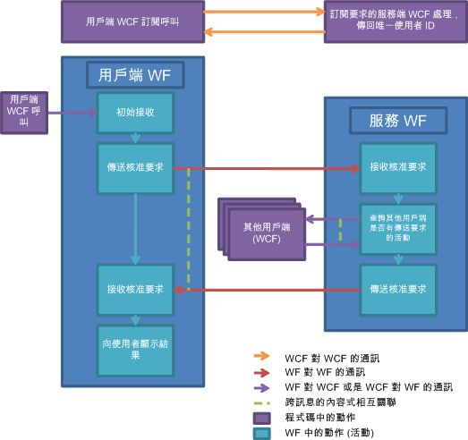

# 文件核准程序
這個範例示範許多 [!INCLUDE[wf](../../../../includes/wf-md.md)] 和 [!INCLUDE[indigo1](../../../../includes/indigo1-md.md)] 功能併用的方式。 結合這些功能來實作文件核准程序案例。 用戶端應用程式會提交文件以供核准，以及核准文件。 核准管理員應用程式是用來促進用戶端之間的通訊，以及強制執行核准程序的規則。 核准程序是可執行數個核准類型的工作流程。 活動是用來取得單一核准、仲裁核准 (核准者集合的百分比)，以及在序列中包含仲裁和單一核准的複雜核准程序。  
  
> [!IMPORTANT]
>  這些範例可能已安裝在您的電腦上。 請先檢查下列 (預設) 目錄，然後再繼續。  
>   
>  `<InstallDrive>:\WF_WCF_Samples`  
>   
>  如果此目錄不存在，請移至 [Windows Communication Foundation (WCF) and Windows Workflow Foundation (WF) Samples for .NET Framework 4  (適用於 .NET Framework 4 的 Windows Communication Foundation (WCF) 與 Windows Workflow Foundation (WF) 範例)](http://go.microsoft.com/fwlink/?LinkId=150780) ，以下載所有 [!INCLUDE[indigo1](../../../../includes/indigo1-md.md)] 和 [!INCLUDE[wf1](../../../../includes/wf1-md.md)] 範例。 此範例位於下列目錄。  
>   
>  `<InstallDrive>:\WF_WCF_Samples\WF\Application\DocumentApprovalProcess`  
  
## 範例詳細資料  
 下圖示範此文件核准程序工作流程。  
  
   
  
 從用戶端的觀點來看，核准程序的運作方式如下：  
  
1.  用戶端在核准程序系統中訂閱成為使用者。  
  
2.  [!INCLUDE[indigo2](../../../../includes/indigo2-md.md)] 用戶端傳送要求給核准管理員應用程式主控的 [!INCLUDE[indigo2](../../../../includes/indigo2-md.md)] 服務。  
  
3.  唯一的使用者識別碼傳回至用戶端。 用戶端現在會參與核准程序。  
  
4.  一旦加入，用戶端可以使用單一核准、仲裁核准或複雜核准程序來傳送文件以供核准。  
  
5.  按一下用戶端介面中的按鈕，在用戶端的工作流程服務主機中啟動工作流程執行個體。  
  
6.  工作流程傳送核准要求給核准管理員應用程式。  
  
7.  工作流程管理員在其一方啟動工作流程以代表核准程序。  
  
8.  一旦管理員核准工作流程執行，將結果送回用戶端。  
  
9. 用戶端顯示結果。  
  
10. 用戶端隨時可能收到核准要求，並回應要求。  
  
11. 裝載於用戶端的 [!INCLUDE[indigo2](../../../../includes/indigo2-md.md)] 服務可以從核准管理員應用程式收到核准要求。  
  
12. 文件資訊在用戶端上呈現以供檢閱。  
  
13. 使用者可以核准或拒絕文件。  
  
14. [!INCLUDE[indigo2](../../../../includes/indigo2-md.md)] 用戶端用來將核准回應送回核准管理員應用程式。  
  
 從核准管理員應用程式的觀點來看，核准程序的運作方式如下：  
  
1.  用戶端要求參與核准程序系統。  
  
2.  核准管理員應用程式上的 [!INCLUDE[indigo2](../../../../includes/indigo2-md.md)] 服務收到加入成為核准程序系統一部分的要求。  
  
3.  產生用戶端的唯一識別碼。 將使用者資訊儲存在資料庫中。  
  
4.  唯一的識別碼送回使用者。  
  
5.  收到核准要求。 核准管理員執行核准程序。  
  
6.  核准管理員收到核准要求，啟動新的工作流程。  
  
7.  根據要求類型 (單一、仲裁或複雜)，執行不同的活動。  
  
8.  具有相互關聯的 Send 和 Receive 活動用來將核准要求傳送至用戶端以供檢閱，以及傳送回應。  
  
9. 核准程序工作流程的結果傳送至用戶端。  
  
## 使用範例  
  
##### 若要設定資料庫  
  
1.  以系統管理員權限開啟 [!INCLUDE[vs2010](../../../../includes/vs2010-md.md)] 命令提示字元視窗，然後瀏覽至此 DocumentApprovalProcess 資料夾，並執行 Setup.cmd。  
  
##### 若要設定應用程式  
  
1.  使用 [!INCLUDE[vs2010](../../../../includes/vs2010-md.md)] 開啟 DocumentApprovalProcess.sln 方案檔案。  
  
2.  若要建置此方案，請按 CTRL+SHIFT+B。  
  
3.  若要執行此方案，請啟動核准管理員應用程式中的 ApprovalManager 專案上按一下滑鼠右鍵**方案總管 中**按一下**偵錯**->**開始**從快顯功能表的新執行個體。  
  
     等候管理員輸出，通知已準備就緒。  
  
##### 若要執行單一核准案例  
  
1.  以系統管理員權限開啟命令提示字元。  
  
2.  巡覽至包含方案的目錄。  
  
3.  巡覽至 ApprovalClient\Bin\Debug 資料夾，並執行兩個 ApprovalClient.exe 執行個體。  
  
4.  按一下**探索**，等到**訂閱**按鈕啟用。  
  
5.  輸入任何使用者名稱，然後按一下**訂閱**。 對其中一個用戶端，使用 `UserType1`，對另一個輸入 `UserType2`。  
  
6.  在 `UserType1` 用戶端中，從下拉式功能表中選取單一核准類型，然後輸入文件名稱和內容。 按一下**要求核准**。  
  
7.  在 `UserType2` 用戶端中，待核准的文件隨即出現。 選取它，然後按**核准**或**拒絕**。 `UserType1` 用戶端中應該會顯示結果。  
  
##### 若要執行仲裁核准案例  
  
1.  以系統管理員權限開啟命令提示字元。  
  
2.  巡覽至包含方案的目錄。  
  
3.  巡覽至 ApprovalClient\Bin\Debug 資料夾，並執行三個 ApprovalClient.exe 執行個體。  
  
4.  按一下**探索**，等到**訂閱**按鈕啟用。  
  
5.  輸入任何使用者名稱，然後按一下**訂閱**。 對其中一個用戶端，使用 `UserType1`，對另外兩個輸入 `UserType2`。  
  
6.  在 `UserType1` 用戶端中，從下拉式功能表中選取仲裁核准類型，然後輸入文件名稱和內容。 按一下**要求核准**。 這會要求兩個 `UserType2` 用戶端核准或拒絕文件。 雖然兩個 `UserType2` 用戶端都必須回應，但是只要一個用戶端核准文件，文件就會獲得已核准狀態。  
  
7.  在 `UserType2` 用戶端中，待核准的文件隨即出現。 選取它，然後按**核准**或**拒絕**。 `UserType1` 用戶端中應該會顯示結果。  
  
##### 若要執行複雜核准案例  
  
1.  以系統管理員權限開啟命令提示字元。  
  
2.  巡覽至包含方案的目錄。  
  
3.  巡覽至 ApprovalClient\Bin\Debug 資料夾，並執行四個 ApprovalClient.exe 執行個體。  
  
4.  按一下**探索**，等到**訂閱**按鈕啟用。  
  
5.  輸入任何使用者名稱，然後按一下**訂閱**。 對其中一個用戶端，使用 `UserType1`，在兩個用戶端中輸入 `UserType2`，並在最後一個用戶端中使用 `UserType3`。  
  
6.  在 `UserType1` 用戶端中，從下拉式功能表中選取單一核准類型，然後輸入文件名稱和內容。 按一下**要求核准**。  
  
7.  在 `UserType2` 用戶端中，待核准的文件隨即出現。 選取它，然後按**核准**，文件傳遞至`UserType3`用戶端。  
  
     如果第一個 `UserType2` 仲裁核准文件，文件會傳遞至 `UserType3` 用戶端。  
  
8.  從 `UserType3` 用戶端核准或拒絕文件。 `UserType1` 用戶端中應該會顯示結果。  
  
##### 若要清除  
  
1.  從 [!INCLUDE[vs2010](../../../../includes/vs2010-md.md)] 命令提示字元，巡覽至 DocumentApprovalProcess 資料夾，並執行 Cleanup.cmd。