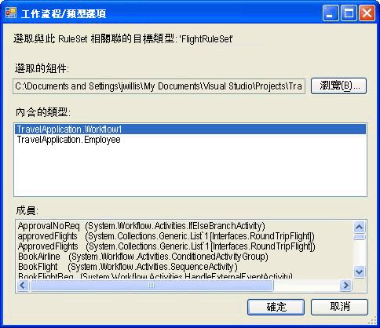

# <a name="external-ruleset-toolkit"></a>外部 Ruleset 工具組

通常在工作流程應用程式內使用規則時，這些規則算是組件的一部分。 在某些案例中，您可能會想要將 RuleSet 與組件分開維護，讓它們不需要重新建置及部署工作流程組件便可加以更新。 這個範例可讓您用資料庫來管理及編輯 RuleSet，並可從執行階段的工作流程中存取這些 RuleSet。 這樣可讓執行中的工作流程執行個體自動納入 RuleSet 變更。

外部 RuleSet 工具組範例包含 Windows Forms 工具，可用於在資料庫中管理及編輯 RuleSet 版本。 它也包含執行這些規則的活動和主機服務。

> [!NOTE]
> 此範例需要[Microsoft SQL Server](https://go.microsoft.com/fwlink/?LinkId=96181)。

Visual Studio 會提供 RuleSet 編輯器做為一部分的 Windows Workflow Foundation (WF)。 您可以在工作流程中按兩下 `Policy` 活動來啟動這個編輯器；它會將已定義的 RuleSet 物件序列化到與此工作流程有關聯的 .rules 檔案 (`Policy` 活動會針對該工作流程執行 RuleSet 執行個體)。 當您建置工作流程專案時，.rules 檔案會編譯成組件來做為資源。

這個範例的元件包括：

- RuleSet 圖形使用者介面工具，它可用於編輯及管理資料庫中 RuleSet 版本。

- 設定在主應用程式上的 RuleSet 服務，它可以從資料庫存取 RuleSet。

- `ExternalPolicy` 活動，它會向 RuleSet 服務要求 RuleSet，並針對工作流程執行 RuleSet。

在下圖顯示元件的互動。 後面各節將說明各個元件。


> [!IMPORTANT]
> 這些範例可能已安裝在您的電腦上。 請先檢查下列 (預設) 目錄，然後再繼續。
>
> `<InstallDrive>:\WF_WCF_Samples`
>
> 如果此目錄不存在，請移至[Windows Communication Foundation (WCF) 和.NET Framework 4 的 Windows Workflow Foundation (WF) 範例](https://go.microsoft.com/fwlink/?LinkId=150780)以下載所有 Windows Communication Foundation (WCF) 和[!INCLUDE[wf1](../../../../includes/wf1-md.md)]範例。 此範例位於下列目錄。
>
> `<InstallDrive>:\WF_WCF_Samples\WF\Scenario\ExternalRuleSetToolKit`

## <a name="ruleset-tool"></a>RuleSet 工具

下圖是 RuleSet 工具的螢幕擷取畫面。 從**規則存放區** 功能表中，您可以從資料庫載入可用的 Ruleset，並將修改過的 ruleset 存回存放區。 應用程式組態檔會提供 RuleSet 資料庫的資料庫連線字串。 當您啟動此工具時，它會從設定的資料庫自動載入 RuleSet。


RuleSet 工具會將主要和次要版本號碼套用至 RuleSet，讓您可以同時維護及儲存多個版本 (除了版本控制功能，此工具不提供鎖定或其他組態管理功能)。 使用這個工具，您便可以建立新的 RuleSet 版本或刪除現有的版本。 當您按一下 **新增**，工具會建立新的 RuleSet 名稱，並套用 1.0 版。 當您複製某個版本時，此工具會建立所選取 RuleSet 版本的複本 (包括其內含的規則)，並指派全新的唯一版本號碼。 這些版本號碼是以現有 RuleSet 的版本號碼為基礎。 您可以使用表單中相關欄位來變更該 RuleSet 的名稱和版本號碼。

當您按一下 **編輯規則**，啟動 RuleSet 編輯器中，如下圖所示：


這是重新裝載屬於 Windows Workflow Foundation Visual Studio 增益集的 [編輯器] 對話方塊。 它會提供相同的功能，包括 Intellisense 支援。 規則是針對與工具; 中的規則集相關聯的目標類型 （例如工作流程） 撰寫當您按一下 [**瀏覽**主要工具對話方塊中，在**工作流程/類型選取器**] 對話方塊隨即出現，如 [圖 4] 所示。



圖 4：工作流程/類型選取器

您可以使用**工作流程/類型選取器**來指定組件以及該組件內的特定類型的對話方塊。 這個類型就是所撰寫 (及執行) 之規則的目標類型。 在多數情況下，此目標類型是工作流程或某些其他活動類型。 然而，您可以對任何 .NET 型別執行 RuleSet。

組件檔案路徑和類型`name are stored with the`資料庫中的規則集，以便從資料庫擷取該 RuleSet 工具會嘗試自動載入該目標類型。

當您按一下 [ **[確定]** 中**工作流程/類型選取器**] 對話方塊中，它會驗證所選取的類型，根據 RuleSet，以確保該目標類型具有規則所參考的所有成員。 錯誤會顯示**驗證錯誤**對話方塊。 您可以選擇繼續進行變更，儘管發生錯誤，或按一下**取消**。 從**工具** 功能表中的主要工具對話方塊，您可以按一下**Validate**重新驗證 RuleSet 版本，針對目標活動。


從**資料**功能表在工具中，您可以匯入及匯出 Ruleset。 當您按一下 **匯入**，檔案選擇器對話方塊隨即出現，您可以從中選取.rules 檔案。 這可能會或可能不是最初在 Visual Studio 中建立檔案。 此 .rules 檔案應該會包含已序列化的 `RuleDefinitions` 執行個體，該執行個體會包含條件的集合和 RuleSet 的集合。 此工具不會使用該條件集合，但它會使用`RuleDefinitions`.rules 格式來允許 Visual Studio 環境的互動。

選取.rules 檔案之後， **RuleSet 選取器**對話方塊隨即出現。 您可以使用此對話方塊，選擇要匯入之檔案中的 RuleSet (預設值是指定所有 RuleSet)。 在此 .rules 檔案中的 RuleSet 並沒有版本號碼，因為它們在 WF 專案中的版本控制和組件中的版本是相同的。 在匯入過程中，此工具會自動指派下一個可用的主要版本號碼 （其中您可以在匯入後變更）;您可以看到在指派的版本號碼**RuleSet 選取器**清單。

此工具會針對其匯入的各個 RuleSet，根據 RuleSet 中所使用的成員，嘗試從 .rules 檔案 (如果存在) 位置下的 bin\Debug 資料夾找出相關聯的類型。 如果此工具找到多個相符的類型，它就會嘗試根據 .rules 檔案名稱和類型名稱之間的配對來選擇類型 (例如，`Workflow1` 類型會對應至 Workflow1.rules)。 如果存在多個相符類型，便會提示您要選取類型。 如果這個自動識別機制無法找出相符的組件或型別，則匯入之後，您可以按一下**瀏覽**上主要工具對話方塊來瀏覽至相關聯的類型。 下圖顯示 RuleSet 選取器：

![顯示 [RuleSet 選取器] 對話方塊的螢幕擷取畫面。](./media/external-ruleset-toolkit/ruleset-selector-dialog.gif)

當您按一下 [**資料匯出**主要工具] 功能表中，從**RuleSet 選取器**對話方塊會再次出現，從中您可以判斷資料庫應匯出的 Ruleset。 當您按一下  **確定**，則**儲存檔案**對話方塊隨即出現，您可以在其中指定結果.rules 檔案的位置與名稱。 由於 .rules 檔案不包含版本資訊，因此您只能選取一個具有指定 RuleSet 名稱的 RuleSet 版本。

## <a name="policyfromservice-activity"></a>PolicyFromService 活動

`PolicyFromService` 活動的程式碼是很直接的工作。 它的運作方式十分類似 WF 所提供的 `Policy` 活動，但是它不是從 .rules 檔案擷取目標 RuleSet，而是呼叫主機服務以取得 RuleSet 執行個體。 然後它會對根工作流程活動執行個體執行 RuleSet。

如果要在工作流程中使用活動，請從您的工作流程專案新增 `PolicyActivities` 和 `RuleSetService` 組件的參考。 如需如何將活動新增至工具箱的討論，請參閱本主題結尾的程序。

在將活動放入工作流程之後，您必須提供要執行的 RuleSet 的名稱。 您可以輸入名稱做為常值，或繫結至另一個活動的工作流程變數或屬性。 或者，您可以輸入應該要執行之特定 RuleSet 的版本號碼。 如果您保留主要和次要版本號碼的預設值為 0 ，該活動就會自動使用資料庫提供的最新版本號碼。

## <a name="ruleset-service"></a>RuleSet 服務

此服務會負責從資料庫擷取指定的 RuleSet 版本，並將它傳回給呼叫活動。 如先前所討論，如果傳遞到 `GetRuleSet` 呼叫中的主要和次要版本值都是 0，此服務便會擷取最新的版本。 此時並不會快取任何 RuleSet 定義或執行個體；同樣地，這時沒有可將 RuleSet 版本標記為「已部署」以便區別進行中之 RuleSet 的功能。

由服務存取的資料庫，應該要經由應用程式組態檔設定於主機上。

#### <a name="to-run-the-tool"></a>執行工具

1. 負責設定由工具和服務使用之 RuleSet 資料表的資料夾中包含 Setup.sql 檔案。 您可以執行 Setup.cmd 批次檔，以便在 SQL Express 上建立 Rules 資料庫，以及設定 RuleSet 資料表。

2. 如果您編輯批次檔或 Setup.sql，並指定不要使用 SQL Express 或是不要將資料表放入名稱有別於 `Rules` 的資料庫中，則在 RuleSet 工具和 `UsageSample` 專案中的應用程式組態檔應該要編輯成相同資訊。

3. 在執行 Setup.sql 指令碼之後，您就可以建置 `ExternalRuleSetToolkit` 方案，然後從 ExternalRuleSetTool 專案啟動 RuleSet 工具。

4. `RuleSetToolkitUsageSample` 循序工作流程主控台應用程式方案包括工作流程範例。 此工作流程是由一個 `PolicyFromService` 活動和兩個變數、`orderValue` 和 `discount` 所組成的，而且它是目標 RuleSet 執行的依據。

5. 如果要使用範例，請建置 `RuleSetToolkitUsageSample` 方案。 然後從 RuleSet 工具主功能表中，按一下**資料匯入**並指向 RuleSetToolkitUsageSample 資料夾中的 DiscountRuleSet.rules 檔案。 按一下 **規則存放區-儲存**功能表選項以匯入的 RuleSet 儲存至資料庫。

6. 由於 `PolicyActivities` 組件是從範例工作流程專案參考的，因此 `PolicyFromService` 活動會出現在工作流程中。 然而，根據預設，它不會出現在工具箱中。 若要將它新增至工具箱，請執行下列操作：

    - 以滑鼠右鍵按一下 [工具箱]，然後選取**選擇項目**（這可能需要一段時間）。

    - 當**選擇工具箱項目** 對話方塊出現時，按一下**活動** 索引標籤。

    - 瀏覽至`PolicyActivities`中的組件`ExternalRuleSetToolkit`方案，然後按一下**開啟**。

    - 請確認`PolicyFromService`中選取活動**選擇工具箱項目**對話方塊，然後按一下**確定**。

    - 活動現在應該會出現在工具箱 中**RuleSetToolkitUsageSample 元件**類別目錄。

7. RuleSet 服務已經由 Program.cs 中的下列陳述式，設定於主控台應用程式主機上。

    ```csharp
    workflowRuntime.AddService(new RuleSetService());
    ```

8. 您也可以使用組態檔在主機上設定服務，如需詳細資訊，請參閱 SDK 文件。

9. 應用程式組態檔會新增至工作流程專案，以指定要由服務使用的資料庫的連線字串。 這個連線字串應該就是 RuleSet 工具所使用的連線字串，它會指向包含該 RuleSet 資料表的資料庫。

10. 現在，您可以用處理其他任何工作流程主控台應用程式的方式來執行 `RuleSetToolkitUsageSample` 專案。 按下 F5 或 Ctrl + F5，在 Visual Studio 中，或直接執行 RuleSetToolkitUsageSample.exe 檔案。

    > [!NOTE]
    > 您必須先關閉 RuleSet 工具才可重新編譯此使用範例，因為工具會載入此使用範例組件。
