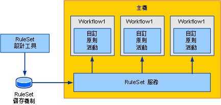
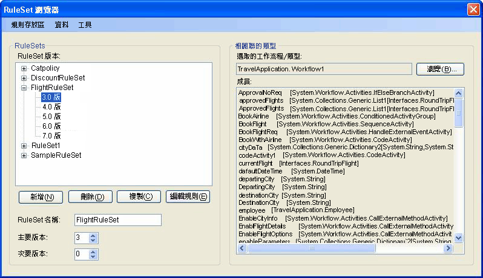
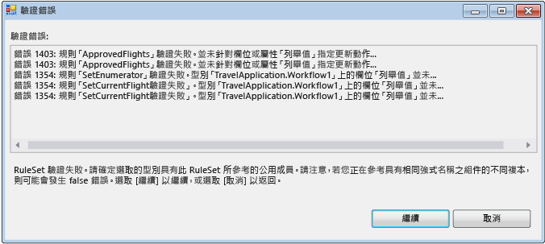
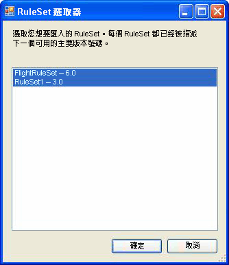

# <a name="external-ruleset-toolkit"></a><span data-ttu-id="9367f-102">外部 Ruleset 工具組</span><span class="sxs-lookup"><span data-stu-id="9367f-102">External Ruleset Toolkit</span></span>
<span data-ttu-id="9367f-103">通常在工作流程應用程式內使用規則時，這些規則算是組件的一部分。</span><span class="sxs-lookup"><span data-stu-id="9367f-103">Normally when rules are used within a workflow application, the rules are part of the assembly.</span></span> <span data-ttu-id="9367f-104">在某些案例中，您可能會想要將 RuleSet 與組件分開維護，讓它們不需要重新建置及部署工作流程組件便可加以更新。</span><span class="sxs-lookup"><span data-stu-id="9367f-104">In some scenarios, you may want to maintain the RuleSets separately from the assembly so that they can be updated without rebuilding and deploying the workflow assembly.</span></span> <span data-ttu-id="9367f-105">這個範例可讓您用資料庫來管理及編輯 RuleSet，並可從執行階段的工作流程中存取這些 RuleSet。</span><span class="sxs-lookup"><span data-stu-id="9367f-105">This sample allows you to manage and edit RuleSets in a database and access those RuleSets from a workflow at runtime.</span></span> <span data-ttu-id="9367f-106">這樣可讓執行中的工作流程執行個體自動納入 RuleSet 變更。</span><span class="sxs-lookup"><span data-stu-id="9367f-106">This enables running workflow instances to automatically incorporate RuleSet changes.</span></span>

 <span data-ttu-id="9367f-107">外部 RuleSet 工具組範例包含 Windows Forms 工具，可用於在資料庫中管理及編輯 RuleSet 版本。</span><span class="sxs-lookup"><span data-stu-id="9367f-107">The External RuleSet Toolkit sample contains a Windows Forms-based tool that you can use to manage and edit RuleSet versions in a database.</span></span> <span data-ttu-id="9367f-108">它也包含執行這些規則的活動和主機服務。</span><span class="sxs-lookup"><span data-stu-id="9367f-108">It also includes an activity and a host service for executing those rules.</span></span>

> [!NOTE]
>  <span data-ttu-id="9367f-109">此範例需要[Microsoft SQL Server](https://go.microsoft.com/fwlink/?LinkId=96181)。</span><span class="sxs-lookup"><span data-stu-id="9367f-109">This sample requires [Microsoft SQL Server](https://go.microsoft.com/fwlink/?LinkId=96181).</span></span>  
  
 <span data-ttu-id="9367f-110">Visual Studio 會提供 RuleSet 編輯器做為一部分的 Windows Workflow Foundation (WF)。</span><span class="sxs-lookup"><span data-stu-id="9367f-110">Visual Studio provides a RuleSet editor as part of the Windows Workflow Foundation (WF).</span></span> <span data-ttu-id="9367f-111">您可以在工作流程中按兩下 `Policy` 活動來啟動這個編輯器；它會將已定義的 RuleSet 物件序列化到與此工作流程有關聯的 .rules 檔案 (`Policy` 活動會針對該工作流程執行 RuleSet 執行個體)。</span><span class="sxs-lookup"><span data-stu-id="9367f-111">You can start this editor by double-clicking the `Policy` activity in a workflow; it serializes the defined RuleSet object to the .rules file associated with the workflow (a `Policy` activity runs a RuleSet instance against the workflow).</span></span> <span data-ttu-id="9367f-112">當您建置工作流程專案時，.rules 檔案會編譯成組件來做為資源。</span><span class="sxs-lookup"><span data-stu-id="9367f-112">The .rules file is compiled into the assembly as a resource when you build the workflow project.</span></span>  
  
 <span data-ttu-id="9367f-113">這個範例的元件包括：</span><span class="sxs-lookup"><span data-stu-id="9367f-113">The components of this sample include:</span></span>  
  
-   <span data-ttu-id="9367f-114">RuleSet 圖形使用者介面工具，它可用於編輯及管理資料庫中 RuleSet 版本。</span><span class="sxs-lookup"><span data-stu-id="9367f-114">A RuleSet graphical user interface tool that you can use to edit and manage RuleSet versions in the database.</span></span>  
  
-   <span data-ttu-id="9367f-115">設定在主應用程式上的 RuleSet 服務，它可以從資料庫存取 RuleSet。</span><span class="sxs-lookup"><span data-stu-id="9367f-115">A RuleSet service that is configured on the host application and accesses RuleSets from the database.</span></span>  
  
-   <span data-ttu-id="9367f-116">`ExternalPolicy` 活動，它會向 RuleSet 服務要求 RuleSet，並針對工作流程執行 RuleSet。</span><span class="sxs-lookup"><span data-stu-id="9367f-116">An `ExternalPolicy` activity that requests a RuleSet from the RuleSet service and runs the RuleSet against the workflow.</span></span>  
  
 <span data-ttu-id="9367f-117">這些元件的互動方式如圖 1 所示。</span><span class="sxs-lookup"><span data-stu-id="9367f-117">The interaction of the components is shown in Figure 1.</span></span> <span data-ttu-id="9367f-118">後面各節將說明各個元件。</span><span class="sxs-lookup"><span data-stu-id="9367f-118">The sections that follow describe each component.</span></span>  
  
 <span data-ttu-id="9367f-119"></span><span class="sxs-lookup"><span data-stu-id="9367f-119"></span></span>  
  
 <span data-ttu-id="9367f-120">圖 1：範例概觀</span><span class="sxs-lookup"><span data-stu-id="9367f-120">Figure 1: Sample Overview</span></span>  
  
> [!IMPORTANT]
>  <span data-ttu-id="9367f-121">這些範例可能已安裝在您的電腦上。</span><span class="sxs-lookup"><span data-stu-id="9367f-121">The samples may already be installed on your machine.</span></span> <span data-ttu-id="9367f-122">請先檢查下列 (預設) 目錄，然後再繼續。</span><span class="sxs-lookup"><span data-stu-id="9367f-122">Check for the following (default) directory before continuing.</span></span>  
>   
>  `<InstallDrive>:\WF_WCF_Samples`  
>   
>  <span data-ttu-id="9367f-123">如果此目錄不存在，請移至[Windows Communication Foundation (WCF) 和.NET Framework 4 的 Windows Workflow Foundation (WF) 範例](https://go.microsoft.com/fwlink/?LinkId=150780)以下載所有 Windows Communication Foundation (WCF) 和[!INCLUDE[wf1](../../../../includes/wf1-md.md)]範例。</span><span class="sxs-lookup"><span data-stu-id="9367f-123">If this directory does not exist, go to [Windows Communication Foundation (WCF) and Windows Workflow Foundation (WF) Samples for .NET Framework 4](https://go.microsoft.com/fwlink/?LinkId=150780) to download all Windows Communication Foundation (WCF) and [!INCLUDE[wf1](../../../../includes/wf1-md.md)] samples.</span></span> <span data-ttu-id="9367f-124">此範例位於下列目錄。</span><span class="sxs-lookup"><span data-stu-id="9367f-124">This sample is located in the following directory.</span></span>  
>   
>  `<InstallDrive>:\WF_WCF_Samples\WF\Scenario\ExternalRuleSetToolKit`  
  
## <a name="ruleset-tool"></a><span data-ttu-id="9367f-125">RuleSet 工具</span><span class="sxs-lookup"><span data-stu-id="9367f-125">RuleSet Tool</span></span>  
 <span data-ttu-id="9367f-126">RuleSet 工具的螢幕擷取畫面如圖 2 所示。</span><span class="sxs-lookup"><span data-stu-id="9367f-126">A screen shot of the RuleSet tool is shown in Figure 2.</span></span> <span data-ttu-id="9367f-127">從**規則存放區** 功能表中，您可以從資料庫載入可用的 Ruleset，並將修改過的 ruleset 存回存放區。</span><span class="sxs-lookup"><span data-stu-id="9367f-127">From the **Rule Store** menu, you can load the available RuleSets from the database and save modified RuleSets back to the store.</span></span> <span data-ttu-id="9367f-128">應用程式組態檔會提供 RuleSet 資料庫的資料庫連線字串。</span><span class="sxs-lookup"><span data-stu-id="9367f-128">An application configuration file provides a database connection string for the RuleSet database.</span></span> <span data-ttu-id="9367f-129">當您啟動此工具時，它會從設定的資料庫自動載入 RuleSet。</span><span class="sxs-lookup"><span data-stu-id="9367f-129">When you start the tool, it automatically loads the RuleSets from the configured database.</span></span>  
  
 <span data-ttu-id="9367f-130"></span><span class="sxs-lookup"><span data-stu-id="9367f-130"></span></span>  
  
 <span data-ttu-id="9367f-131">圖 2：RuleSet 瀏覽器</span><span class="sxs-lookup"><span data-stu-id="9367f-131">Figure 2: RuleSet Browser</span></span>  
  
 <span data-ttu-id="9367f-132">RuleSet 工具會將主要和次要版本號碼套用至 RuleSet，讓您可以同時維護及儲存多個版本 (除了版本控制功能，此工具不提供鎖定或其他組態管理功能)。</span><span class="sxs-lookup"><span data-stu-id="9367f-132">The RuleSet tool applies major and minor version numbers to the RuleSets, allowing you to simultaneously maintain and store multiple versions (the tool provides no locking or other configuration management features in addition to the versioning capability).</span></span> <span data-ttu-id="9367f-133">使用這個工具，您便可以建立新的 RuleSet 版本或刪除現有的版本。</span><span class="sxs-lookup"><span data-stu-id="9367f-133">Using the tool, you can create new RuleSet versions or delete existing versions.</span></span> <span data-ttu-id="9367f-134">當您按一下 **新增**，工具會建立新的 RuleSet 名稱，並套用 1.0 版。</span><span class="sxs-lookup"><span data-stu-id="9367f-134">When you click **New**, the tool creates a new RuleSet name and applies version 1.0.</span></span> <span data-ttu-id="9367f-135">當您複製某個版本時，此工具會建立所選取 RuleSet 版本的複本 (包括其內含的規則)，並指派全新的唯一版本號碼。</span><span class="sxs-lookup"><span data-stu-id="9367f-135">When you copy a version, the tool creates a copy of the selected RuleSet version, including the contained rules, and assigns new, unique version numbers.</span></span> <span data-ttu-id="9367f-136">這些版本號碼是以現有 RuleSet 的版本號碼為基礎。</span><span class="sxs-lookup"><span data-stu-id="9367f-136">These version numbers are based on the version numbers of existing RuleSets.</span></span> <span data-ttu-id="9367f-137">您可以使用表單中相關欄位來變更該 RuleSet 的名稱和版本號碼。</span><span class="sxs-lookup"><span data-stu-id="9367f-137">You can change the RuleSet name and version numbers using the associated fields on the form.</span></span>  
  
 <span data-ttu-id="9367f-138">當您按一下 **編輯規則**，會啟動 RuleSet 編輯器，如 圖 3 所示。</span><span class="sxs-lookup"><span data-stu-id="9367f-138">When you click **Edit Rules**, the RuleSet editor starts, as shown in Figure 3.</span></span>  
  
 <span data-ttu-id="9367f-139"></span><span class="sxs-lookup"><span data-stu-id="9367f-139"></span></span>  
  
 <span data-ttu-id="9367f-140">圖 3：RuleSet 編輯器</span><span class="sxs-lookup"><span data-stu-id="9367f-140">Figure 3: RuleSet Editor</span></span>  
  
 <span data-ttu-id="9367f-141">這是重新裝載屬於 Windows Workflow Foundation Visual Studio 增益集的 [編輯器] 對話方塊。</span><span class="sxs-lookup"><span data-stu-id="9367f-141">This is a re-hosting of the editor dialog that is part of the Windows Workflow Foundation Visual Studio add-in.</span></span> <span data-ttu-id="9367f-142">它會提供相同的功能，包括 Intellisense 支援。</span><span class="sxs-lookup"><span data-stu-id="9367f-142">It provides the same functionality, including Intellisense support.</span></span> <span data-ttu-id="9367f-143">規則是針對與工具; 中的規則集相關聯的目標類型 （例如工作流程） 撰寫當您按一下 [**瀏覽**主要工具對話方塊中，在**工作流程/類型選取器**] 對話方塊隨即出現，如 [圖 4] 所示。</span><span class="sxs-lookup"><span data-stu-id="9367f-143">The rules are authored against a target type (such as a workflow) that is associated with the RuleSet in the tool; when you click **Browse** in the main tool dialog, the **Workflow/Type Selector** dialog appears, as shown in Figure 4.</span></span>  
  
 <span data-ttu-id="9367f-144"></span><span class="sxs-lookup"><span data-stu-id="9367f-144"></span></span>  
  
 <span data-ttu-id="9367f-145">圖 4：工作流程/類型選取器</span><span class="sxs-lookup"><span data-stu-id="9367f-145">Figure 4: Workflow/Type Selector</span></span>  
  
 <span data-ttu-id="9367f-146">您可以使用**工作流程/類型選取器**來指定組件以及該組件內的特定類型的對話方塊。</span><span class="sxs-lookup"><span data-stu-id="9367f-146">You can use the **Workflow/Type Selector** dialog to specify an assembly and a specific type within that assembly.</span></span> <span data-ttu-id="9367f-147">這個類型就是所撰寫 (及執行) 之規則的目標類型。</span><span class="sxs-lookup"><span data-stu-id="9367f-147">This type is the target type against which the rules are authored (and run).</span></span> <span data-ttu-id="9367f-148">在多數情況下，此目標類型是工作流程或某些其他活動類型。</span><span class="sxs-lookup"><span data-stu-id="9367f-148">In many cases, the target type is a workflow or some other activity type.</span></span> <span data-ttu-id="9367f-149">然而，您可以對任何 .NET 型別執行 RuleSet。</span><span class="sxs-lookup"><span data-stu-id="9367f-149">However, you can run a RuleSet against any .NET type.</span></span>  
  
 <span data-ttu-id="9367f-150">組件檔案路徑和類型`name are stored with the`資料庫中的規則集，以便從資料庫擷取該 RuleSet 工具會嘗試自動載入該目標類型。</span><span class="sxs-lookup"><span data-stu-id="9367f-150">The path to the assembly file and the type `name are stored with the` RuleSet in the database, so that when the RuleSet is retrieved from the database, the tool attempts to automatically load the target type.</span></span>  
  
 <span data-ttu-id="9367f-151">當您按一下 [ **[確定]** 中**工作流程/類型選取器**] 對話方塊中，它會驗證所選取的類型，根據 RuleSet，以確保該目標類型具有規則所參考的所有成員。</span><span class="sxs-lookup"><span data-stu-id="9367f-151">When you click **OK** in the **Workflow/Type Selector** dialog, it validates the selected type against the RuleSet, to ensure that the target type has all the members referenced by the rules.</span></span> <span data-ttu-id="9367f-152">錯誤會顯示**驗證錯誤**對話方塊 （請參閱 [圖 5]）。</span><span class="sxs-lookup"><span data-stu-id="9367f-152">Errors are shown in a **Validation Errors** dialog (see Figure 5).</span></span> <span data-ttu-id="9367f-153">您可以選擇繼續進行變更，儘管發生錯誤，或按一下**取消**。</span><span class="sxs-lookup"><span data-stu-id="9367f-153">You can choose to continue with the change despite the errors, or click **Cancel**.</span></span> <span data-ttu-id="9367f-154">從**工具** 功能表中的主要工具對話方塊，您可以按一下**Validate**重新驗證 RuleSet 版本，針對目標活動。</span><span class="sxs-lookup"><span data-stu-id="9367f-154">From the **Tools** menu in the main tool dialog, you can click **Validate** to re-validate the RuleSet version against the target activity.</span></span>  
  
 <span data-ttu-id="9367f-155"></span><span class="sxs-lookup"><span data-stu-id="9367f-155"></span></span>  
  
 <span data-ttu-id="9367f-156">圖 5：驗證錯誤</span><span class="sxs-lookup"><span data-stu-id="9367f-156">Figure 5: Validation Errors</span></span>  
  
 <span data-ttu-id="9367f-157">從**資料**功能表在工具中，您可以匯入及匯出 Ruleset。</span><span class="sxs-lookup"><span data-stu-id="9367f-157">From the **Data** menu in the tool, you can import and export RuleSets.</span></span> <span data-ttu-id="9367f-158">當您按一下 **匯入**，檔案選擇器對話方塊隨即出現，您可以從中選取.rules 檔案。</span><span class="sxs-lookup"><span data-stu-id="9367f-158">When you click **Import**, a file-chooser dialog appears, from which you can select a .rules file.</span></span> <span data-ttu-id="9367f-159">這可能會或可能不是最初在 Visual Studio 中建立檔案。</span><span class="sxs-lookup"><span data-stu-id="9367f-159">This may or may not be a file initially created in Visual Studio.</span></span> <span data-ttu-id="9367f-160">此 .rules 檔案應該會包含已序列化的 `RuleDefinitions` 執行個體，該執行個體會包含條件的集合和 RuleSet 的集合。</span><span class="sxs-lookup"><span data-stu-id="9367f-160">The .rules file should contain a serialized `RuleDefinitions` instance that contains a collection of conditions and a collection of RuleSets.</span></span> <span data-ttu-id="9367f-161">此工具不會使用該條件集合，但它會使用`RuleDefinitions`.rules 格式來允許 Visual Studio 環境的互動。</span><span class="sxs-lookup"><span data-stu-id="9367f-161">The tool does not use the conditions collection, but it does use the `RuleDefinitions` .rules format to allow interaction with the Visual Studio environment.</span></span>  
  
 <span data-ttu-id="9367f-162">選取.rules 檔案之後， **RuleSet 選取器**對話方塊隨即出現 （請參閱 圖 6）。</span><span class="sxs-lookup"><span data-stu-id="9367f-162">After selecting a .rules file, a **RuleSet Selector** dialog appears (see Figure 6).</span></span> <span data-ttu-id="9367f-163">您可以使用此對話方塊，選擇要匯入之檔案中的 RuleSet (預設值是指定所有 RuleSet)。</span><span class="sxs-lookup"><span data-stu-id="9367f-163">You can use the dialog to select the RuleSets from the file that you want to import (the default specifies all RuleSets).</span></span> <span data-ttu-id="9367f-164">在此 .rules 檔案中的 RuleSet 並沒有版本號碼，因為它們在 WF 專案中的版本控制和組件中的版本是相同的。</span><span class="sxs-lookup"><span data-stu-id="9367f-164">RuleSets in the .rules file do not have version numbers, because their versioning within a WF project is the same as the version of the assembly.</span></span> <span data-ttu-id="9367f-165">在匯入過程中，此工具會自動指派下一個可用的主要版本號碼 （其中您可以在匯入後變更）;您可以看到在指派的版本號碼**RuleSet 選取器**清單。</span><span class="sxs-lookup"><span data-stu-id="9367f-165">During the importing process, the tool automatically assigns the next available major version number (which you can change after importing); you can see the assigned version numbers in the **RuleSet Selector** list.</span></span>  
  
 <span data-ttu-id="9367f-166">此工具會針對其匯入的各個 RuleSet，根據 RuleSet 中所使用的成員，嘗試從 .rules 檔案 (如果存在) 位置下的 bin\Debug 資料夾找出相關聯的類型。</span><span class="sxs-lookup"><span data-stu-id="9367f-166">For each RuleSet it imports, the tool attempts to locate the associated type from the bin\Debug folder under the location of the .rules file (if it exists), based on the members used in the RuleSet.</span></span> <span data-ttu-id="9367f-167">如果此工具找到多個相符的類型，它就會嘗試根據 .rules 檔案名稱和類型名稱之間的配對來選擇類型 (例如，`Workflow1` 類型會對應至 Workflow1.rules)。</span><span class="sxs-lookup"><span data-stu-id="9367f-167">If the tool finds multiple matching types, it attempts to choose a type based on a match between the .rules file name and the type name (for example, the `Workflow1` type corresponds to Workflow1.rules).</span></span> <span data-ttu-id="9367f-168">如果存在多個相符類型，便會提示您要選取類型。</span><span class="sxs-lookup"><span data-stu-id="9367f-168">If multiple matches exist, you are prompted to select the type.</span></span> <span data-ttu-id="9367f-169">如果這個自動識別機制無法找出相符的組件或型別，則匯入之後，您可以按一下**瀏覽**上主要工具對話方塊來瀏覽至相關聯的類型。</span><span class="sxs-lookup"><span data-stu-id="9367f-169">If this auto-identification mechanism fails to locate a matching assembly or type, then after importing you can click **Browse** on the main tool dialog to navigate to the associated type.</span></span>  
  
 <span data-ttu-id="9367f-170"></span><span class="sxs-lookup"><span data-stu-id="9367f-170"></span></span>  
  
 <span data-ttu-id="9367f-171">圖 6：RuleSet 選取器</span><span class="sxs-lookup"><span data-stu-id="9367f-171">Figure 6: RuleSet Selector</span></span>  
  
 <span data-ttu-id="9367f-172">當您按一下 [**資料匯出**主要工具] 功能表中，從**RuleSet 選取器**對話方塊會再次出現，從中您可以判斷資料庫應匯出的 Ruleset。</span><span class="sxs-lookup"><span data-stu-id="9367f-172">When you click **Data-Export** from the main tool menu, the **RuleSet Selector** dialog appears again, from which you can determine the RuleSets from the database that should be exported.</span></span> <span data-ttu-id="9367f-173">當您按一下  **確定**，則**儲存檔案**對話方塊隨即出現，您可以在其中指定結果.rules 檔案的位置與名稱。</span><span class="sxs-lookup"><span data-stu-id="9367f-173">When you click **OK**, a **Save File** dialog appears, in which you can specify the name and location of the resulting .rules file.</span></span> <span data-ttu-id="9367f-174">由於 .rules 檔案不包含版本資訊，因此您只能選取一個具有指定 RuleSet 名稱的 RuleSet 版本。</span><span class="sxs-lookup"><span data-stu-id="9367f-174">Because the .rules file does not contain version information, you can only select one RuleSet version with a given RuleSet name.</span></span>  
  
## <a name="policyfromservice-activity"></a><span data-ttu-id="9367f-175">PolicyFromService 活動</span><span class="sxs-lookup"><span data-stu-id="9367f-175">PolicyFromService Activity</span></span>  
 <span data-ttu-id="9367f-176">`PolicyFromService` 活動的程式碼是很直接的工作。</span><span class="sxs-lookup"><span data-stu-id="9367f-176">The code for the `PolicyFromService` activity is straightforward.</span></span> <span data-ttu-id="9367f-177">它的運作方式十分類似 WF 所提供的 `Policy` 活動，但是它不是從 .rules 檔案擷取目標 RuleSet，而是呼叫主機服務以取得 RuleSet 執行個體。</span><span class="sxs-lookup"><span data-stu-id="9367f-177">It works much like the `Policy` activity provided with WF, but instead of retrieving the target RuleSet from the .rules file, it calls a host service to obtain the RuleSet instance.</span></span> <span data-ttu-id="9367f-178">然後它會對根工作流程活動執行個體執行 RuleSet。</span><span class="sxs-lookup"><span data-stu-id="9367f-178">It then runs the RuleSet against the root workflow activity instance.</span></span>  
  
 <span data-ttu-id="9367f-179">如果要在工作流程中使用活動，請從您的工作流程專案新增 `PolicyActivities` 和 `RuleSetService` 組件的參考。</span><span class="sxs-lookup"><span data-stu-id="9367f-179">To use the activity in a workflow, add a reference to the `PolicyActivities` and `RuleSetService` assemblies from your workflow project.</span></span> <span data-ttu-id="9367f-180">如需如何將活動新增至工具箱的討論，請參閱本主題結尾的程序。</span><span class="sxs-lookup"><span data-stu-id="9367f-180">See the procedure at the end of this topic for a discussion of how to add the activity to the toolbox.</span></span>  
  
 <span data-ttu-id="9367f-181">在將活動放入工作流程之後，您必須提供要執行的 RuleSet 的名稱。</span><span class="sxs-lookup"><span data-stu-id="9367f-181">After placing the activity in your workflow, you must provide the name of the RuleSet to be run.</span></span> <span data-ttu-id="9367f-182">您可以輸入名稱做為常值，或繫結至另一個活動的工作流程變數或屬性。</span><span class="sxs-lookup"><span data-stu-id="9367f-182">You can enter the name as a literal value, or bind to a workflow variable or property of another activity.</span></span> <span data-ttu-id="9367f-183">或者，您可以輸入應該要執行之特定 RuleSet 的版本號碼。</span><span class="sxs-lookup"><span data-stu-id="9367f-183">Optionally, you can enter version numbers for the specific RuleSet that should be run.</span></span> <span data-ttu-id="9367f-184">如果您保留主要和次要版本號碼的預設值為 0 ，該活動就會自動使用資料庫提供的最新版本號碼。</span><span class="sxs-lookup"><span data-stu-id="9367f-184">If you leave the default value of 0 for the major and minor version numbers, the latest version number in the database is automatically provided for the activity.</span></span>  
  
## <a name="ruleset-service"></a><span data-ttu-id="9367f-185">RuleSet 服務</span><span class="sxs-lookup"><span data-stu-id="9367f-185">RuleSet Service</span></span>  
 <span data-ttu-id="9367f-186">此服務會負責從資料庫擷取指定的 RuleSet 版本，並將它傳回給呼叫活動。</span><span class="sxs-lookup"><span data-stu-id="9367f-186">The service is responsible for retrieving the specified RuleSet version from the database and returning it to the calling activity.</span></span> <span data-ttu-id="9367f-187">如先前所討論，如果傳遞到 `GetRuleSet` 呼叫中的主要和次要版本值都是 0，此服務便會擷取最新的版本。</span><span class="sxs-lookup"><span data-stu-id="9367f-187">As previously discussed, if the major and minor version values passed in the `GetRuleSet` call are both 0, the service retrieves the latest version.</span></span> <span data-ttu-id="9367f-188">此時並不會快取任何 RuleSet 定義或執行個體；同樣地，這時沒有可將 RuleSet 版本標記為「已部署」以便區別進行中之 RuleSet 的功能。</span><span class="sxs-lookup"><span data-stu-id="9367f-188">At this point, there is no caching of RuleSet definitions or instances; similarly, there are no features for marking RuleSet versions as "deployed" to differentiate them from in-progress RuleSets.</span></span>  
  
 <span data-ttu-id="9367f-189">由服務存取的資料庫，應該要經由應用程式組態檔設定於主機上。</span><span class="sxs-lookup"><span data-stu-id="9367f-189">The database to be accessed by the service should be configured on the host using an application configuration file.</span></span>  
  
#### <a name="to-run-the-tool"></a><span data-ttu-id="9367f-190">執行工具</span><span class="sxs-lookup"><span data-stu-id="9367f-190">To run the tool</span></span>  
  
1.  <span data-ttu-id="9367f-191">負責設定由工具和服務使用之 RuleSet 資料表的資料夾中包含 Setup.sql 檔案。</span><span class="sxs-lookup"><span data-stu-id="9367f-191">The folder that sets up the RuleSet table used by the tool and the service contains a Setup.sql file.</span></span> <span data-ttu-id="9367f-192">您可以執行 Setup.cmd 批次檔，以便在 SQL Express 上建立 Rules 資料庫，以及設定 RuleSet 資料表。</span><span class="sxs-lookup"><span data-stu-id="9367f-192">You can run the Setup.cmd batch file to create the Rules database on SQL Express and to set up the RuleSet table.</span></span>  
  
2.  <span data-ttu-id="9367f-193">如果您編輯批次檔或 Setup.sql，並指定不要使用 SQL Express 或是不要將資料表放入名稱有別於 `Rules` 的資料庫中，則在 RuleSet 工具和 `UsageSample` 專案中的應用程式組態檔應該要編輯成相同資訊。</span><span class="sxs-lookup"><span data-stu-id="9367f-193">If you edit the batch file or Setup.sql and specify not to use SQL Express or to place the table in a database named something other than `Rules`, the application configuration files in the RuleSet tool and `UsageSample` projects should be edited with the same information.</span></span>  
  
3.  <span data-ttu-id="9367f-194">在執行 Setup.sql 指令碼之後，您就可以建置 `ExternalRuleSetToolkit` 方案，然後從 ExternalRuleSetTool 專案啟動 RuleSet 工具。</span><span class="sxs-lookup"><span data-stu-id="9367f-194">After you run the Setup.sql script, you can build the `ExternalRuleSetToolkit` solution and then launch the RuleSet tool from the ExternalRuleSetTool project.</span></span>  
  
4.  <span data-ttu-id="9367f-195">`RuleSetToolkitUsageSample` 循序工作流程主控台應用程式方案包括工作流程範例。</span><span class="sxs-lookup"><span data-stu-id="9367f-195">The `RuleSetToolkitUsageSample` Sequential Workflow Console Application solution includes a sample workflow.</span></span> <span data-ttu-id="9367f-196">此工作流程是由一個 `PolicyFromService` 活動和兩個變數、`orderValue` 和 `discount` 所組成的，而且它是目標 RuleSet 執行的依據。</span><span class="sxs-lookup"><span data-stu-id="9367f-196">The workflow consists of a `PolicyFromService` activity and two variables, `orderValue` and `discount`, against which the target RuleSet runs.</span></span>  
  
5.  <span data-ttu-id="9367f-197">如果要使用範例，請建置 `RuleSetToolkitUsageSample` 方案。</span><span class="sxs-lookup"><span data-stu-id="9367f-197">To use the sample, build the `RuleSetToolkitUsageSample` solution.</span></span> <span data-ttu-id="9367f-198">然後從 RuleSet 工具主功能表中，按一下**資料匯入**並指向 RuleSetToolkitUsageSample 資料夾中的 DiscountRuleSet.rules 檔案。</span><span class="sxs-lookup"><span data-stu-id="9367f-198">Then from the RuleSet tool main menu, click **Data-Import** and point to the DiscountRuleSet.rules file in the RuleSetToolkitUsageSample folder.</span></span> <span data-ttu-id="9367f-199">按一下 **規則存放區-儲存**功能表選項以匯入的 RuleSet 儲存至資料庫。</span><span class="sxs-lookup"><span data-stu-id="9367f-199">Click the **Rule Store-Save** menu option to save the imported RuleSet to the database.</span></span>  
  
6.  <span data-ttu-id="9367f-200">由於 `PolicyActivities` 組件是從範例工作流程專案參考的，因此 `PolicyFromService` 活動會出現在工作流程中。</span><span class="sxs-lookup"><span data-stu-id="9367f-200">Because the `PolicyActivities` assembly is referenced from the sample workflow project, the `PolicyFromService` activity appears in the workflow.</span></span> <span data-ttu-id="9367f-201">然而，根據預設，它不會出現在工具箱中。</span><span class="sxs-lookup"><span data-stu-id="9367f-201">It does not, however, appear in the toolbox by default.</span></span> <span data-ttu-id="9367f-202">若要將它新增至工具箱，請執行下列操作：</span><span class="sxs-lookup"><span data-stu-id="9367f-202">To add it to the toolbox, do the following:</span></span>  
  
    -   <span data-ttu-id="9367f-203">以滑鼠右鍵按一下 [工具箱]，然後選取**選擇項目**（這可能需要一段時間）。</span><span class="sxs-lookup"><span data-stu-id="9367f-203">Right-click the toolbox and select **Choose Items** (this may take a while).</span></span>  
  
    -   <span data-ttu-id="9367f-204">當**選擇工具箱項目** 對話方塊出現時，按一下**活動** 索引標籤。</span><span class="sxs-lookup"><span data-stu-id="9367f-204">When the **Choose Toolbox Items** dialog appears, click the **Activities** tab.</span></span>  
  
    -   <span data-ttu-id="9367f-205">瀏覽至`PolicyActivities`中的組件`ExternalRuleSetToolkit`方案，然後按一下**開啟**。</span><span class="sxs-lookup"><span data-stu-id="9367f-205">Browse to the `PolicyActivities` assembly in the `ExternalRuleSetToolkit` solution and click **Open**.</span></span>  
  
    -   <span data-ttu-id="9367f-206">請確認`PolicyFromService`中選取活動**選擇工具箱項目**對話方塊，然後按一下**確定**。</span><span class="sxs-lookup"><span data-stu-id="9367f-206">Ensure that the `PolicyFromService` activity is selected in the **Choose Toolbox Items** dialog and then click **OK**.</span></span>  
  
    -   <span data-ttu-id="9367f-207">活動現在應該會出現在工具箱 中**RuleSetToolkitUsageSample 元件**類別目錄。</span><span class="sxs-lookup"><span data-stu-id="9367f-207">The activity should now appear in the toolbox in the **RuleSetToolkitUsageSample Components** category.</span></span>  
  
7.  <span data-ttu-id="9367f-208">RuleSet 服務已經由 Program.cs 中的下列陳述式，設定於主控台應用程式主機上。</span><span class="sxs-lookup"><span data-stu-id="9367f-208">The RuleSet service is already configured on the console application host using the following statement in Program.cs.</span></span>  
  
    ```  
    workflowRuntime.AddService(new RuleSetService());  
    ```  
  
8.  <span data-ttu-id="9367f-209">您也可以使用組態檔在主機上設定服務，如需詳細資訊，請參閱 SDK 文件。</span><span class="sxs-lookup"><span data-stu-id="9367f-209">You can also configure the service on the host using a configuration file; see the SDK documentation for details.</span></span>  
  
9. <span data-ttu-id="9367f-210">應用程式組態檔會新增至工作流程專案，以指定要由服務使用的資料庫的連線字串。</span><span class="sxs-lookup"><span data-stu-id="9367f-210">An application configuration file is added to the workflow project to specify the connection string for the database to be used by the service.</span></span> <span data-ttu-id="9367f-211">這個連線字串應該就是 RuleSet 工具所使用的連線字串，它會指向包含該 RuleSet 資料表的資料庫。</span><span class="sxs-lookup"><span data-stu-id="9367f-211">This should be the same connection string used by the RuleSet tool, which points to the database that contains the RuleSet table.</span></span>  
  
10. <span data-ttu-id="9367f-212">現在，您可以用處理其他任何工作流程主控台應用程式的方式來執行 `RuleSetToolkitUsageSample` 專案。</span><span class="sxs-lookup"><span data-stu-id="9367f-212">You can now run the `RuleSetToolkitUsageSample` project as you would any other workflow console application.</span></span> <span data-ttu-id="9367f-213">按下 F5 或 Ctrl + F5，在 Visual Studio 中，或直接執行 RuleSetToolkitUsageSample.exe 檔案。</span><span class="sxs-lookup"><span data-stu-id="9367f-213">Press F5 or Ctrl+F5 within Visual Studio or run the RuleSetToolkitUsageSample.exe file directly.</span></span>  
  
    > [!NOTE]
    >  <span data-ttu-id="9367f-214">您必須先關閉 RuleSet 工具才可重新編譯此使用範例，因為工具會載入此使用範例組件。</span><span class="sxs-lookup"><span data-stu-id="9367f-214">You must close the RuleSet tool to recompile the usage sample, because the tool loads the usage sample assembly.</span></span>