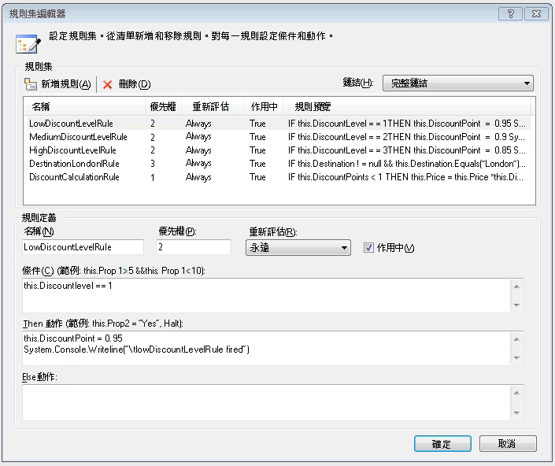
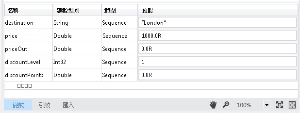
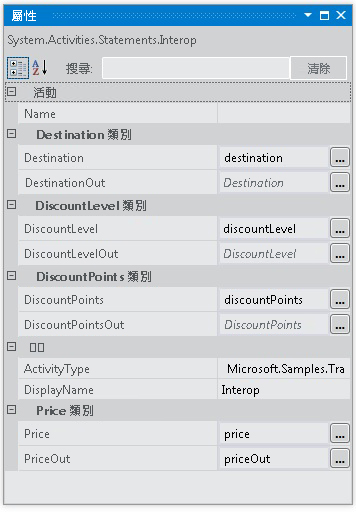

# <a name="interop-with-35-rule-set"></a>和 3.5 規則集互通
此範例示範如何使用<xref:System.Activities.Statements.Interop>活動中的自訂活動的整合[!INCLUDE[netfx35_short](../../../../includes/netfx35-short-md.md)]使用<!--zz <xref:System.Workflow.Activities.Policy> -->`System.Workflow.Activities.Policy`和規則。 範例中會透過將 [!INCLUDE[netfx_current_long](../../../../includes/netfx-current-long-md.md)] 變數繫結至自訂活動公開之相依性屬性的方式，將資料傳遞至自訂活動。  
  
## <a name="requirements"></a>需求  
  
1.  [!INCLUDE[vs_current_long](../../../../includes/vs-current-long-md.md)]  
  
2.  [!INCLUDE[netfx_current_long](../../../../includes/netfx-current-long-md.md)]  
  
3.  [!INCLUDE[netfx35_long](../../../../includes/netfx35-long-md.md)]  
  
## <a name="demonstrates"></a>示範  
 <xref:System.Activities.Statements.Interop> 活動<!--zz <xref:System.Workflow.Activities.Policy> -->`System.Workflow.Activities.Policy`中的活動[!INCLUDE[netfx35_short](../../../../includes/netfx35-short-md.md)]與相依性屬性  
  
## <a name="discussion"></a>討論  
 此範例示範整合 [!INCLUDE[netfx35_short](../../../../includes/netfx35-short-md.md)] 活動的其中一個整合案例。 此範例包含[!INCLUDE[netfx35_short](../../../../includes/netfx35-short-md.md)]叫用的自訂活動<!--zz <xref:System.Workflow.Activities.Policy> -->`System.Workflow.Activities.Policy`活動。  
  
## <a name="travelrulelibrary"></a>TravelRuleLibrary  
 在設計工具中開啟 TravelRuleSet.cs，顯示包含 Policy 活動的自訂循序活動，如下所示。  
  
   
  
 按兩下**DiscountPolicy**原則活動以檢查規則。 規則編輯器會出現並顯示規則。  
  
   
  
 以滑鼠右鍵按一下**DiscountPolicy**活動，然後選取**檢視程式碼**檢查程式碼除外 C# 程式碼，此活動的選項。 您會看見 `DiscountLevel` 的相依性屬性設定。 這相當於 <xref:System.Activities.Argument> 中的 [!INCLUDE[netfx_current_short](../../../../includes/netfx-current-short-md.md)]。  
  
```  
public static DependencyProperty DiscountLevelProperty = DependencyProperty.Register("DiscountLevel", typeof(int), typeof(TravelRuleSet));  
  
[DescriptionAttribute("DiscountLevel")]  
[CategoryAttribute("DiscountLevel Category")]  
[BrowsableAttribute(true)]  
[DesignerSerializationVisibilityAttribute(DesignerSerializationVisibility.Visible)]  
public int DiscountLevel  
{  
   get  
   {  
return ((int)base.GetValue(TravelRuleSet.DiscountLevelProperty)));  
   }  
   set  
   {  
base.SetValue(TravelRuleSet.DiscountLevelProperty, value);  
   }  
}  
```  
  
## <a name="interopwith35ruleset"></a>InteropWith35RuleSet  
 這是 [!INCLUDE[netfx_current_short](../../../../includes/netfx-current-short-md.md)] 循序工作流程專案，該專案會使用 <xref:System.Activities.Statements.Interop> 活動整合 TravelRuleLibrary 專案中建立的自訂規則集。 變數會在 <xref:System.Activities.Statements.Sequence> 的最上層建立，如下所示。  
  
   
  
   
  
 最後，<xref:System.Activities.Statements.Interop> 活動會用來與 TravelRuleSet 整合。 稍早在 <xref:System.Activities.Statements.Sequence> 上宣告的變數會用來繫結至相依性屬性。  
  
   
  
   
  
   
  
> [!IMPORTANT]
>  這些範例可能已安裝在您的電腦上。 請先檢查下列 (預設) 目錄，然後再繼續。  
>   
>  `<InstallDrive>:\WF_WCF_Samples`  
>   
>  如果此目錄不存在，請移至[Windows Communication Foundation (WCF) 和.NET Framework 4 的 Windows Workflow Foundation (WF) 範例](https://go.microsoft.com/fwlink/?LinkId=150780)以下載所有 Windows Communication Foundation (WCF) 和[!INCLUDE[wf1](../../../../includes/wf1-md.md)]範例。 此範例位於下列目錄。  
>   
>  `<InstallDrive>:\WF_WCF_Samples\WF\Basic\Built-InActivities\InteropWith35RuleSet`
