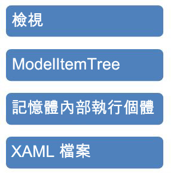

# <a name="programming-model-item-tree"></a>程式設計模型項目樹狀
這個範例會示範如何瀏覽<xref:System.Activities.Presentation.Model.ModelItem>使用宣告式資料繫結，從 Windows Presentation Foundation (WPF) 樹狀結構檢視。

## <a name="sample-details"></a>範例詳細資料
 <xref:System.Activities.Presentation.Model.ModelItem> 樹狀結構是一個抽象概念，由 [!INCLUDE[wfd1](../../../../includes/wfd1-md.md)] 基礎結構用來公開要編輯之基礎執行個體的相關資料。 下圖描述 [!INCLUDE[wfd2](../../../../includes/wfd2-md.md)] 內基礎結構的各個不同層。

 

 <xref:System.Activities.Presentation.Model.ModelItem> 包含基礎值的指標，以及 <xref:System.Activities.Presentation.Model.ModelProperty> 物件的集合。 <xref:System.Activities.Presentation.Model.ModelProperty> 物件則是由名稱、屬性型別和值的指標這類資料所構成，而值的指標則會是另一個 <xref:System.Activities.Presentation.Model.ModelItem>。 值轉換子可用來操作從 <xref:System.Activities.Presentation.Model.ModelItem> 傳回的一些 <xref:System.Activities.Presentation.Model.ModelProperty>，讓它們在樹狀檢視中正確顯示。 接著這個範例會示範如何使用命令式語法，以命令方式對 <xref:System.Activities.Presentation.Model.ModelItem> 樹狀結構進行程式設計，如下面範例中所示。

```csharp
ModelItem mi = wd.Context.Services.GetService<ModelService>().Root;
ModelProperty mp = mi.Properties["Activities"];
mp.Collection.Add(new Persist());
ModelItem justAdded = mp.Collection.Last();
justAdded.Properties["DisplayName"].SetValue("new name");
```

#### <a name="to-use-this-sample"></a>若要使用這個範例

1.  Visual Studio 2010 中開啟 [programmingmodelitemtree.sln] 方案。

2.  選取 建置方案**建置方案**從**建置**功能表。

3.  按 F5 執行應用程式。 [!INCLUDE[avalon2](../../../../includes/avalon2-md.md)] 格式隨即顯示。

4.  按一下 **載入 WF**按鈕以載入<xref:System.Activities.Presentation.Model.ModelItem>並將它繫結至樹狀檢視。

5.  按一下 **變更模型項目樹狀結構**按鈕會執行上述程式碼新增到樹狀結構的項目和設定的屬性。

> [!IMPORTANT]
>  這些範例可能已安裝在您的電腦上。 請先檢查下列 (預設) 目錄，然後再繼續。  
>   
>  `<InstallDrive>:\WF_WCF_Samples`  
>   
>  如果此目錄不存在，請移至[Windows Communication Foundation (WCF) 和.NET Framework 4 的 Windows Workflow Foundation (WF) 範例](https://go.microsoft.com/fwlink/?LinkId=150780)以下載所有 Windows Communication Foundation (WCF) 和[!INCLUDE[wf1](../../../../includes/wf1-md.md)]範例。 此範例位於下列目錄。  
>   
>  `<InstallDrive>:\WF_WCF_Samples\WF\Basic\Designer\ProgrammingModelItemTree`  
  
## <a name="see-also"></a>另請參閱
- <xref:System.Windows.Data.IValueConverter>
