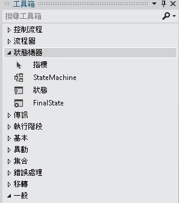

# 狀態機器工作流程
狀態機器是用來開發程式的知名範例。 <xref:System.Activities.Statements.StateMachine> 活動以及 <xref:System.Activities.Statements.State>、<xref:System.Activities.Statements.Transition> 和其他活動皆可用來建置狀態機器工作流程程式。 本主題提供建立狀態機器工作流程的概觀。  
  
## 狀態機器工作流程概觀  
 狀態機工作流提供模型樣式，可讓您以事件導向的方式建立工作流程的模型。 <xref:System.Activities.Statements.StateMachine> 活動包含組成狀態機器邏輯的狀態和轉換，並且適用於任何能夠使用活動的地方。 狀態機器執行階段包含數種類別：  
  
-   <xref:System.Activities.Statements.StateMachine>  
  
-   <xref:System.Activities.Statements.State>  
  
-   <xref:System.Activities.Statements.Transition>  
  
 若要建立狀態機器工作流程，必須將狀態加入至 <xref:System.Activities.Statements.StateMachine> 活動，並使用轉換來控制狀態之間的流向。 下列螢幕擷取畫面中，從[入門教學課程](../../../docs/framework/windows-workflow-foundation/getting-started-tutorial.md)步驟[How to： 建立狀態機器工作流程](../../../docs/framework/windows-workflow-foundation/how-to-create-a-state-machine-workflow.md)，顯示三個狀態和三個轉換的狀態機器工作流程。 **初始化目標**是初始狀態，表示工作流程中的第一個狀態。 這由從開頭的行所指定**啟動**節點。 名為工作流程中的最終狀態**FinalState**，並代表工作流程完成時的點。  
  
   
  
 狀態機器工作流程必須且只能有一個初始狀態，以及至少有一個最終狀態。 每個不是最終狀態的狀態都至少要有一個轉換。 以下各節將說明建立和設定狀態及轉換。  
  
## 建立和設定狀態  
 <xref:System.Activities.Statements.State> 代表狀態機器可以具有的狀態。 若要加入<xref:System.Activities.Statements.State>至工作流程中，拖曳**狀態**活動設計工具從**狀態機器**區段**工具箱**並將其放置<xref:System.Activities.Statements.StateMachine>上的活動[!INCLUDE[wfd1](../../../includes/wfd1-md.md)]介面。  
  
   
  
 若要將狀態設定為**初始狀態**，以滑鼠右鍵按一下狀態，然後選取**設為初始狀態**。 此外，如果沒有目前的初始狀態，初始狀態，即可指定將從線條**啟動**的所需狀態之工作流程的頂端節點。 當<xref:System.Activities.Statements.StateMachine>活動放到工作流程設計工具中，會預先設定名為的初始狀態**State1**。 狀態機器工作流程必須且只能有一個初始狀態。  
  
 在狀態機器中代表終止狀態的狀態稱為最終狀態。 最終狀態就是其 <xref:System.Activities.Statements.State.IsFinal%2A> 屬性設為 `true` 的狀態，沒有任何 <xref:System.Activities.Statements.State.Exit%2A> 活動，而且沒有源自於此的轉換。 若要將最後狀態加入至工作流程，拖曳**FinalState**活動設計工具從**狀態機器**區段**工具箱**並將其放置<xref:System.Activities.Statements.StateMachine>上的活動[!INCLUDE[wfd1](../../../includes/wfd1-md.md)]介面。 狀態機器工作流程至少要有一個最終狀態。  
  
### 設定進入及結束動作  
 狀態可以有 <xref:System.Activities.Statements.State.Entry%2A> 和 <xref:System.Activities.Statements.State.Exit%2A> 動作。 (設定為最終狀態的狀態只能有一個進入動作)。 當工作流程執行個體進入狀態時，就會執行進入動作中的任何活動。 進入動作完成時，會針對狀態的轉換排定觸發程序。 確認轉換成另一個狀態時，會執行結束狀態中的活動，即使該狀態重新轉換回相同狀態也一樣。 結束動作完成後，會執行轉換動作中的活動，然後轉換成新狀態，並排定其進入動作。  
  
> [!NOTE]
>  在偵錯狀態機器工作流程時，可以將中斷點放置在根狀態機器活動以及狀態機器工作流程的狀態上。 中斷點不能直接放在轉換上，但可以放在狀態及轉換中包含的任何活動上。  
  
## 建立和設定轉換  
 所有狀態都至少要有一個轉換，但最終狀態不能有任何轉換。 可在將狀態加入到狀態機器工作流程之後再加入轉換，也可以在放置狀態時建立轉換。  
  
 若要加入<xref:System.Activities.Statements.State>並建立轉換，在一個步驟中，拖曳**狀態**活動從**狀態機器**區段**工具箱**並停留在另一個狀態工作流程設計工具。 當被拖曳的 <xref:System.Activities.Statements.State> 位在另一個 <xref:System.Activities.Statements.State> 上方時，另一個 <xref:System.Activities.Statements.State> 周圍會出現四個三角形。 如果將 <xref:System.Activities.Statements.State> 拖放到四個三角形的其中一個，就會將它加入到該狀態機器，並建立從來源 <xref:System.Activities.Statements.State> 到所放置之目的地 <xref:System.Activities.Statements.State> 的轉換。 如需詳細資訊，請參閱[Transition 活動設計工具](/visualstudio/workflow-designer/transition-activity-designer)。  
  
 若要在加入狀態後建立轉換，有兩個選項。 第一個選項是從工作流程設計工具介面拖曳狀態，將它移到現有狀態上方，然後在其中一個放置點上將它放下。 這種方法與上一節說明的方法類似。 您也可以將滑鼠游標移到所需的來源狀態上方，然後將一條線拖曳至所需的目的地狀態。  
  
> [!NOTE]
>  狀態機器中的單一狀態最多可以有 76 個以工作流程設計工具來建立的轉換。 針對在設計工具以外建立的工作流程，狀態的轉換數目上限僅受制於系統資源。  
  
 轉換中可能會有 <xref:System.Activities.Statements.Transition.Trigger%2A>、<xref:System.Activities.Statements.Transition.Condition%2A> 和 <xref:System.Activities.Statements.Transition.Action%2A>。 轉換的 <xref:System.Activities.Statements.Transition.Trigger%2A> 會在轉換來源狀態的 <xref:System.Activities.Statements.State.Entry%2A> 動作完成時排定。 通常 <xref:System.Activities.Statements.Transition.Trigger%2A> 是等候某事件類型發生的活動，但它可以是任何活動，也可以不是活動。 <xref:System.Activities.Statements.Transition.Trigger%2A>活動完成後，如有　<xref:System.Activities.Statements.Transition.Condition%2A> 存在，就會對其進行評估。 如果沒有任何 <xref:System.Activities.Statements.Transition.Trigger%2A>活動，就會立即評估 <xref:System.Activities.Statements.Transition.Condition%2A>。 如果條件評估為 `false`，就會取消轉換，並且會針對從該狀態的所有轉換，重新排定 <xref:System.Activities.Statements.Transition.Trigger%2A> 活動。 如果有其他轉換與目前轉換共用相同的來源狀態，會取消這些 <xref:System.Activities.Statements.Transition.Trigger%2A> 動作，並重新排定。 如果 <xref:System.Activities.Statements.Transition.Condition%2A> 評估為 `true`，或是沒有任何條件，則會執行來源狀態的 <xref:System.Activities.Statements.State.Exit%2A> 動作，然後執行轉換的 <xref:System.Activities.Statements.Transition.Action%2A>。 當<xref:System.Activities.Statements.Transition.Action%2A>完成，控制權會傳遞給**目標**狀態  
  
 共用相同觸發程序的轉換稱為共用觸發程序轉換。 共用觸發程序轉換群組中的每個轉換都有相同的觸發程序，但各自擁有唯一的 <xref:System.Activities.Statements.Transition.Condition%2A> 和動作。 若要將其他動作加入到轉換，並建立共用轉換，請按一下指出所要之轉換起始點的圓形，然後將它拖曳到所要的狀態。 新的轉換會與初始轉換共用相同的觸發程序，但擁有唯一的條件和動作。 共用的轉換也會建立從轉換設計工具內按一下**新增共用的觸發程序轉換**底部的轉換設計工具，然後選取 從想要的目標狀態**要連線的可用狀態**下拉式清單。  
  
> [!NOTE]
>  請注意，如果轉換的 <xref:System.Activities.Statements.Transition.Condition%2A> 值評估為 `False` (或所有共用觸發轉換的條件皆評估為 `False`)，則不會發生轉換，且會重新排程該狀態之所有轉換的所有觸發。  
  
 如需有關如何建立狀態機器工作流程的詳細資訊，請參閱[How to： 建立狀態機器工作流程](../../../docs/framework/windows-workflow-foundation/how-to-create-a-state-machine-workflow.md)， [StateMachine 活動設計工具](/visualstudio/workflow-designer/statemachine-activity-designer)，[狀態活動設計工具](/visualstudio/workflow-designer/state-activity-designer)，[FinalState 活動設計工具](/visualstudio/workflow-designer/finalstate-activity-designer)，和[轉換活動設計工具](/visualstudio/workflow-designer/transition-activity-designer)。  
  
## 狀態機器術語  
 本節定義在本主題中使用的狀態機器詞彙。  
  
 狀態  
 組成狀態機器的基本單位。 狀態機器可在任何特定時間進入一種狀態。  
  
 進入動作  
 進入狀態時所執行的動作  
  
 結束動作  
 結束狀態時所執行的動作  
  
 轉換  
 兩個狀態之間的定向關係，代表狀態機器對於發生特定事件類型的完整回應。  
  
 共用轉換  
 與一個或多個轉換共用來源狀態及觸發程序的轉換，但每個轉換各有其唯一的條件和動作。  
  
 觸發程序  
 會導致轉換發生的觸發活動。  
  
 條件  
 在發生觸發之後，條件約束必須評估為 `true`，才能使轉換完成。  
  
 轉換動作  
 在執行特定轉換時所執行的活動。  
  
 條件轉換  
 有明確條件的轉換。  
  
 自行轉換  
 從某狀態轉換成該狀態本身的轉換。  
  
 起始狀態  
 代表狀態機器起點的狀態。  
  
 最終狀態  
 代表狀態機器完成的狀態。  
  
## 另請參閱  
 [如何：建立狀態機器工作流程](../../../docs/framework/windows-workflow-foundation/how-to-create-a-state-machine-workflow.md)  
 [StateMachine 活動設計工具](/visualstudio/workflow-designer/statemachine-activity-designer)  
 [State 活動設計工具](/visualstudio/workflow-designer/state-activity-designer)  
 [FinalState 活動設計工具](/visualstudio/workflow-designer/finalstate-activity-designer)  
 [Transition 活動設計工具](/visualstudio/workflow-designer/transition-activity-designer)
