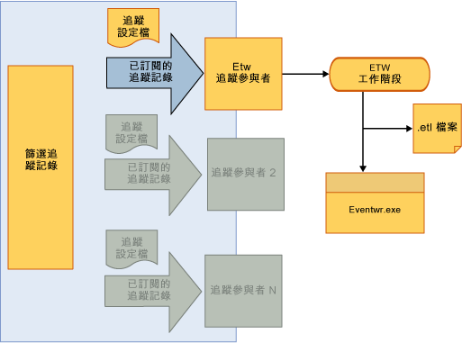

# <a name="tracking-participants"></a>追蹤參與者
追蹤參與者是可讓工作流程開發人員存取 <xref:System.Activities.Tracking.InteropTrackingRecord.TrackingRecord%2A> 物件並加以處理的擴充點。 [!INCLUDE[netfx_current_long](../../../includes/netfx-current-long-md.md)] 包含寫入追蹤記錄以做為 Windows 事件追蹤 (ETW) 事件的標準追蹤參與者。 如果不符合需求，您也可以寫入自訂的追蹤參與者。  
  
## <a name="tracking-participants"></a>追蹤參與者  
 追蹤基礎結構可讓應用程式篩選外送的追蹤記錄，讓參與者可訂閱記錄的子集。 此機制會透過追蹤設定檔來套用篩選。  
  
 Windows Workflow Foundation (WF) 中[!INCLUDE[netfx_current_short](../../../includes/netfx-current-short-md.md)]提供將追蹤記錄寫入至 ETW 工作階段的追蹤參與者。 透過在設定檔中加入特定追蹤的行為，您可以設定工作流程服務上的參與者。 啟用 ETW 追蹤參與者可在事件檢視器中檢視追蹤記錄。 ETW 式追蹤的 SDK 範例是熟悉使用 ETW 式追蹤參與者之 WF 追蹤的理想方式。  
  
## <a name="etw-tracking-participant"></a>ETW 追蹤參與者  
 [!INCLUDE[netfx_current_short](../../../includes/netfx-current-short-md.md)] 包含將追蹤記錄寫入至 ETW 工作階段的 ETW 追蹤參與者。 這是非常有效率的方式，對應用程式效能或伺服器輸送量所造成的衝擊最小。 使用標準 ETW 追蹤參與者的優點在於，可在 Windows 事件檢視器中使用其他應用程式和系統記錄來檢視它所收到的追蹤記錄。  
  
 標準 ETW 追蹤參與者會在 Web.config 檔中配置，如以下範例所示。  
  
```xml  
<configuration>  
  <system.web>  
    <compilation debug="true" targetFramework="4.0" />  
  </system.web>  
  <system.serviceModel>  
    <behaviors>  
      <serviceBehaviors>  
        <behavior>  
          <etwTracking profileName="Sample Tracking Profile"/>  
        </behavior>  
      </serviceBehaviors>  
    </behaviors>  
   <tracking>  
      <profiles>  
        <trackingProfile name="Sample Tracking Profile">  
        ….  
       </trackingProfile>  
      </profiles>  
    </tracking>  
  </system.serviceModel>  
</configuration>  
```  
  
> [!NOTE]
>  如果未指定 `trackingProfile` 名稱，例如只有 `<etwTracking/>` 或 `<etwTracking profileName=""/>`，則會使用 Machine.config 檔中連同 [!INCLUDE[netfx_current_short](../../../includes/netfx-current-short-md.md)] 安裝的預設追蹤設定檔。  
  
 在 Machine.config 檔中，預設追蹤設定檔會訂閱工作流程執行個體記錄和錯誤。  
  
 在 ETW 中，會透過提供者 ID 將事件寫入 ETW 工作階段。 ETW 追蹤參與者用來將追蹤記錄寫入至 ETW 的提供者 ID，是定義於 Web.config 檔中的診斷工作階段 (在 `<system.serviceModel><diagnostics>` 下)。 根據預設，當未指定提供者 ID 時，ETW 追蹤參與者會使用預設提供者 ID，如以下範例所示。  
  
```xml  
<system.serviceModel>  
        <diagnostics etwProviderId="52A3165D-4AD9-405C-B1E8-7D9A257EAC9F" />  
```  
  
 下圖顯示透過 ETW 追蹤參與者追蹤資料的流程。 一旦追蹤資料到達 ETW 工作階段，就可以透過多種方式加以存取。 其中最實用的方式之一就是透過事件檢視器，這是常用的 Windows 工具，可用來檢視記錄並從應用程式和服務進行追蹤。  
  
   
  
## <a name="tracking-participant-event-data"></a>追蹤參與者事件資料  
 追蹤參與者會以每個追蹤記錄包含一個事件的形式，將已追蹤的事件資料序列化至 ETW 工作階段。  事件會使用從 100 到 199 範圍的 ID 來識別。 如需追蹤事件的定義記錄發出的追蹤參與者，請參閱[追蹤事件參考](../../../docs/framework/windows-workflow-foundation/tracking-events-reference.md)主題。  
  
 ETW 事件大小會受到 ETW 緩衝區大小或 ETW 事件的最大承載所限制，兩者的值都較小。 如果事件大小超過這裡任一種 ETW 限制，則會截斷事件，並任意移除其內容。 變數、引數、附註和自訂資料都不可選擇性移除。 發生截斷情形時，不論造成事件大小超出 ETW 限制的值大小為何，這些元素全都會遭到截斷。  已移除的資料會以 `<item>..<item>` 來取代。  
  
 複雜型別變數、 引數，和自訂資料項目序列化至 ETW 事件記錄使用[NetDataContractSerializer 類別](http://go.microsoft.com/fwlink/?LinkId=177537)。 此類別包含序列化 XML 資料流中的 CLR 型別資訊。  
  
 因 ETW 限制而截斷承載資料，可能會造成將追蹤記錄傳送到 ETW 工作階段。 如果有一個以上的工作階段正在接聽事件，且工作階段有不同的事件承載限制時，就可能會發生這種情況。  
  
 至於限制較低的工作階段可能會截斷事件。 ETW 追蹤參與者並不知道工作階段接聽事件的數量；如果在工作階段中某個事件遭到截斷，則 ETW 參與者就會再試著傳送事件一次。 在這樣的情況下，將工作階段配置為接受較大承載大小，就會收到事件兩次 (未遭到截斷與遭到截斷的事件)。 將所有 ETW 工作階段配置為相同的緩衝區大小限制，即可避免發生重複。  
  
## <a name="accessing-tracking-data-from-an-etw-participant-in-the-event-viewer"></a>在事件檢視器中從 ETW 追蹤參與者存取追蹤記錄資料  
 由 ETW 追蹤參與者寫入至 ETW 工作階段的事件，可透過事件檢視器進行存取 (當使用預設提供者 ID 時)。 這可快速檢視已由工作流程發出的追蹤記錄。  
  
> [!NOTE]
>  發出至 ETW 工作階段的追蹤記錄事件會使用從 100 到 199 範圍的事件 ID。  
  
#### <a name="to-enable-viewing-the-tracking-records-in-event-viewer"></a>若要在事件檢視器中檢視追蹤記錄  
  
1.  啟動事件檢視器 (EVENTVWR.EXE)  
  
2.  選取**事件檢視器、 應用程式和服務記錄檔、 Microsoft、 Windows、 應用程式伺服器-應用程式**。  
  
3.  以滑鼠右鍵按一下，並確定**檢視、 顯示分析與偵錯記錄檔**已選取。 如果未選取該選項，請加以選取，使其旁邊出現核取記號。 這會顯示**分析**，**效能**，和**偵錯**記錄檔。  
  
4.  以滑鼠右鍵按一下**分析**記錄，然後選取 **啟用記錄**。 記錄檔將位於 %SystemRoot%\System32\Winevt\Logs\Microsoft-Windows-Application Server-Applications%4Analytic.etl 檔案。  
  
## <a name="custom-tracking-participant"></a>自訂追蹤參與者  
 追蹤參與者 API 允許以使用者提供的追蹤者來擴充追蹤執行階段，可包含自訂邏輯以處理工作流程執行階段發出的追蹤記錄。 若要寫入自訂追蹤參與者，開發人員必須實作 `Track` 類別上的 <xref:System.Activities.Tracking.TrackingParticipant> 方法。 當工作流程執行階段發出追蹤記錄時，會呼叫此方法。  
  
 追蹤參與者衍生自 <xref:System.Activities.Tracking.TrackingParticipant> 類別。 系統提供的 <xref:System.Activities.Tracking.EtwTrackingParticipant> 會針對所收到的每個追蹤記錄發出 Windows 事件追蹤 (ETW) 事件。 若要建立自訂追蹤參與者，會建立衍生自 <xref:System.Activities.Tracking.TrackingParticipant> 的類別。 若要提供基本追蹤功能，請覆寫 <xref:System.Activities.Tracking.TrackingParticipant.Track%2A>。 當執行階段傳送追蹤記錄且可以想要的方式來處理時，就會呼叫 <xref:System.Activities.Tracking.TrackingParticipant.Track%2A>。 在以下範例中，自訂追蹤參與者的類別是定義為發出所有追蹤記錄至主控台視窗。 您也可實作 <xref:System.Activities.Tracking.TrackingParticipant> 物件，此物件會使用其 `BeginTrack` 和 `EndTrack` 方法來非同步處理追蹤記錄。  
  
```csharp  
class ConsoleTrackingParticipant : TrackingParticipant  
{  
    protected override void Track(TrackingRecord record, TimeSpan timeout)  
    {  
        if (record != null)  
        {  
            Console.WriteLine("=================================");  
            Console.WriteLine(record);  
        }  
    }  
}  
```  
  
 若要使用特定追蹤參與者，請使用您想追蹤的工作流程執行個體來進行登錄，如以下範例所示。  
  
```csharp  
myInstance.Extensions.Add(new ConsoleTrackingParticipant());  
```  
  
 在以下範例中，會建立由 <xref:System.Activities.Statements.Sequence> 活動構成的工作流程，此工作流程包含 <xref:System.Activities.Statements.WriteLine> 活動。 `ConsoleTrackingParticipant` 會加入擴充，並叫用工作流程。  
  
```csharp  
Activity activity= new Sequence()  
{  
    Activities =  
    {  
        new WriteLine()  
        {  
            Text = "Hello World."  
        }  
    }  
};  
  
WorkflowApplication instance = new WorkflowApplication(activity);  
  
instance.Extensions.Add(new ConsoleTrackingParticipant());  
  instance.Completed = delegate(WorkflowApplicationCompletedEventArgs e)  
            {  
                Console.WriteLine("workflow instance completed, Id = " + instance.Id);  
                resetEvent.Set();  
            };  
            instance.Run();  
            Console.ReadLine();  
```  
  
## <a name="see-also"></a>另請參閱  
 [Windows Server App Fabric 監控](http://go.microsoft.com/fwlink/?LinkId=201273)  
 [使用 App Fabric 監控應用程式](http://go.microsoft.com/fwlink/?LinkId=201275)
