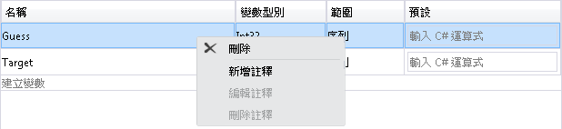
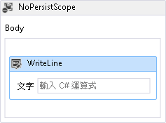
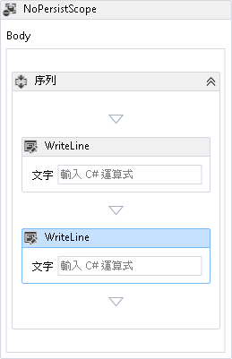
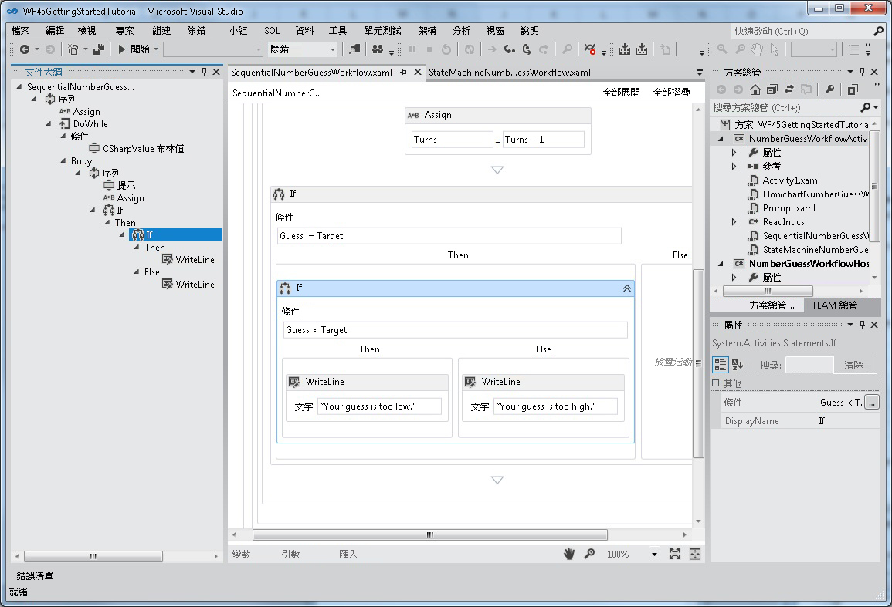
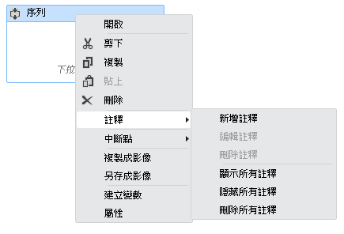
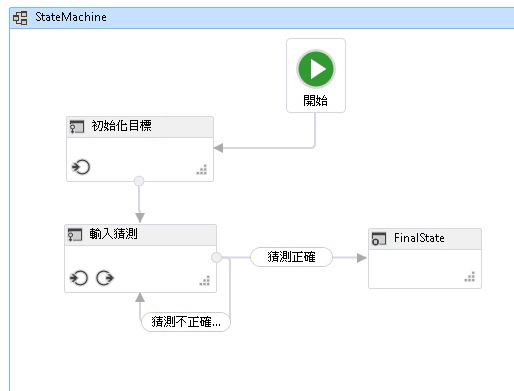

# 針對重新裝載之工作流程設計工具中的新 Workflow Foundation 4.5 功能提供的支援
Windows Workflow Foundation (WF) 中[!INCLUDE[net_v45](../../../includes/net-v45-md.md)]導入許多新功能，包括工作流程設計工具經驗的數個增強功能。 本主題詳細介紹重新裝載的設計工具支援其中哪些功能，以及目前不支援的功能。

> [!NOTE]
>  取得一份所有新的 Windows Workflow Foundation (WF) 功能中引進[!INCLUDE[net_v45](../../../includes/net-v45-md.md)]，包括那些不重新裝載設計工具相關的請參閱 < [What's New in.NET 4.5 中 Windows Workflow Foundation](whats-new-in-wf-in-dotnet.md)。

## 活動
 內建活動程式庫包含新的活動及現有活動的新功能。 重新裝載的設計工具支援所有新活動。 如需有關這些新活動的詳細資訊，請參閱 <<c0> [ 活動](whats-new-in-wf-in-dotnet.md#BKMK_NewActivities)一節[What's New in.NET 4.5 中 Windows Workflow Foundation](whats-new-in-wf-in-dotnet.md)。

## C# 運算式
 在 [!INCLUDE[net_v45](../../../includes/net-v45-md.md)] 之前，您只能使用 Visual Basic 來撰寫工作流程中的所有運算式。 在 [!INCLUDE[net_v45](../../../includes/net-v45-md.md)] 中，Visual Basic 運算式只用於使用 Visual Basic 建立的專案。 Visual C# 專案現在使用 C# 來撰寫運算式。 當撰寫 Visual Studio 2012 中的工作流程，功能完整的 C# 運算式編輯器提供的反白顯示文法及 intellisense 等功能。 在舊版中使用 Visual Basic 運算式建立的 C# 工作流程專案仍可繼續運作。

> [!WARNING]
>  重新裝載的設計工具不支援 C# 運算式。

## 新的設計工具功能

### 設計工具搜尋
 [快速尋找](whats-new-in-wf-in-dotnet.md#BKMK_QuickFind)並[檔案中尋找](whats-new-in-wf-in-dotnet.md#BKMK_FindInFiles)功能引進[!INCLUDE[net_v45](../../../includes/net-v45-md.md)]重新裝載設計工具中不支援。 重新裝載的設計工具支援 `Toolbox` 搜尋。 如需有關這些功能的詳細資訊，請參閱 <<c0> [ 設計工具搜尋](whats-new-in-wf-in-dotnet.md#BKMK_DesignerSearch)。

> [!WARNING]
>  [快速尋找](whats-new-in-wf-in-dotnet.md#BKMK_QuickFind)並[檔案中尋找](whats-new-in-wf-in-dotnet.md#BKMK_FindInFiles)重新裝載設計工具中不支援。

### 變數和引數設計工具中的刪除內容功能表項目
 在 [!INCLUDE[netfx40_short](../../../includes/netfx40-short-md.md)] 中，只能使用鍵盤刪除設計工具中的變數和引數。 從 [!INCLUDE[net_v45](../../../includes/net-v45-md.md)] 開始，即可以使用內容功能表刪除變數和引數。 重新裝載的設計工具支援此功能。

 下列螢幕擷取畫面顯示變數和引數設計工具內容功能表。

 

### 使用 Sequence 進行 Auto-surround
 由於工作流程或特定容器活動 (如 <xref:System.Activities.Statements.NoPersistScope>) 只能包含單一主體活動，因此開發人員必須先刪除第一個活動、加入 <xref:System.Activities.Statements.Sequence> 活動，然後將這兩個活動同時加入序列活動中，才能加入第二個活動。 從 [!INCLUDE[net_v45](../../../includes/net-v45-md.md)] 開始，將第二個活動加入到設計工具介面時，會自動建立一個 `Sequence` 活動，以同時包含這兩個活動。 重新裝載的設計工具支援此功能。

 下列螢幕擷取畫面顯示 `WriteLine` 活動，此活動位在 `Body` 的 `NoPersistScope` 中。

 

 當第二個 `Sequence` 降到第一個之下時，下列螢幕擷取畫面會顯示在 `Body` 中自動建立的 `WriteLine` 活動。

 

### 移動瀏覽模式
 若要更輕鬆地在設計工具中巡覽大型工作流程，可以啟用移動瀏覽模式，讓開發人員能夠透過按一下與拖曳方式來移動工作流程的可見部分，而不需使用捲軸。 啟用移動瀏覽模式的按鈕位於設計工具的右下角。 重新裝載的設計工具支援此功能。

 下列螢幕擷取畫面顯示位於工作流程設計工具右下角的移動瀏覽按鈕。

 

 您也可以使用滑鼠中鍵或空白鍵移動瀏覽工作流程設計工具。

### 多重選取
 您可以拖曳矩形將所要的活動圍住 (未啟用移動瀏覽模式時)，或是按住 Ctrl 鍵並依序按一下所需的活動，以同時選取多個活動。 重新裝載的設計工具支援此功能。

 您也可以在設計工具中拖放多個活動選取項目，或者使用內容功能表與選取項目互動。

### 工作流程項目的大綱檢視
 為簡化階層工作流程的巡覽功能，工作流程的元件會顯示在樹狀大綱檢閱中。 大綱檢視會顯示在**文件大綱**檢視。 若要在 Visual Studio 中開啟此檢視，從頂端功能表，選取**檢視**，**其他 Windows**，**文件大綱**，或按下 Ctrl W、 u。 按一下大綱檢視中的節點，會巡覽至工作流程設計工具中對應的活動，且大綱檢視會更新以顯示在設計工具中選取的活動。 重新裝載的設計工具支援此功能。

 從完成的工作流程中的下列螢幕擷取畫面[入門教學課程](getting-started-tutorial.md)顯示循序工作流程的大綱檢視。

 

### 更多殼層列及標頭項目的可見度控制功能
 在重新裝載的設計工具中，部分標準 UI 控制項可能對特定工作流程沒有意義，而且可能是關閉狀態。 在 [!INCLUDE[netfx40_short](../../../includes/netfx40-short-md.md)] 中，只有設計工具最下方的殼層列支援這項自訂功能。 在 [!INCLUDE[net_v45](../../../includes/net-v45-md.md)] 中，可以透過設定 <xref:System.Activities.Presentation.View.DesignerView.WorkflowShellHeaderItemsVisibility%2A> 與適當的 <xref:System.Activities.Presentation.View.ShellHeaderItemsVisibility> 值，來調整是否顯示設計工具最上方的殼層標頭項目。

### 流程圖與狀態機器工作流程中的自動連接和自動插入
 在 [!INCLUDE[netfx40_short](../../../includes/netfx40-short-md.md)] 中，流程圖工作流程的節點連接必須手動加入。 [!INCLUDE[net_v45](../../../includes/net-v45-md.md)] 的流程圖和狀態機器的節點具有自動連接點，在將活動從工具箱拖曳到設計工具介面上時，就會顯示自動連接點。 將活動拖曳到其中一點上，會自動加入該活動及必要的連接。

 下列螢幕擷取畫面顯示從工具箱拖曳活動時顯示的附加點。

 

 您也可以將活動拖曳到流程圖節點和狀態之間的連接，以在其他兩個節點之間自動插入該節點。 下列螢幕擷取畫面顯示反白顯示的連接線，在此可以從工具箱中拖曳及放置活動。

 

 重新裝載的設計工具支援自動連接和自動插入。

### 設計工具標註
 為方便開發大型工作流程，設計工具現已支援加入標註，以追蹤設計流程。 您可以在活動、狀態、流程圖節點、變數和引數中加入標註。 下列螢幕擷取畫面顯示用來將標註加入設計工具的操作功能表。

 

 重新裝載的設計工具支援設計工具標註。

### 在設計工具中定義與取用 ActivityDelegate 物件
 [!INCLUDE[netfx40_short](../../../includes/netfx40-short-md.md)] 中的活動使用 <xref:System.Activities.ActivityDelegate> 物件來公開執行點，其中工作流程的其他部分可與工作流程的執行互動，但使用這些執行點通常需要許多程式碼。 在這個版本中，開發人員可以使用工作流程設計工具來定義及取用活動委派。 如需詳細資訊，請參閱[如何：定義和使用工作流程設計工具中的活動委派](/visualstudio/workflow-designer/how-to-define-and-consume-activity-delegates-in-the-workflow-designer)。

 重新裝載的設計工具支援活動委派。

### 建置階段驗證
 在 [!INCLUDE[netfx40_short](../../../includes/netfx40-short-md.md)] 中，不會將工作流程驗證錯誤計為工作流程專案建置期間的建置錯誤。 這表示，即使有工作流程驗證錯誤，仍可能成功建置工作流程專案。 在 [!INCLUDE[net_v45](../../../includes/net-v45-md.md)] 中，工作流程驗證錯誤會導致建置失敗。

> [!WARNING]
>  重新裝載的設計工具不支援建置階段驗證。  
  
### 設計階段背景驗證  
 在 [!INCLUDE[netfx40_short](../../../includes/netfx40-short-md.md)] 中，會在前景處理序中驗證工作流程，因此若驗證處理序較複雜或耗時，可能會使 UI 停止回應。 現在，工作流程驗證會在背景執行緒中進行，因此不會封鎖 UI。  
  
 重新裝載的設計工具支援設計階段背景驗證。  
  
### 檢視狀態在 XAML 檔案中的獨立位置  
 在 [!INCLUDE[netfx40_short](../../../includes/netfx40-short-md.md)] 中，工作流程的檢視狀態資訊會跨 XAML 檔案儲存在許多不同的位置。 對於想要直接讀取 XAML 或撰寫程式碼來移除檢視狀態資訊的開發人員來說，這樣很不方便。 在  [!INCLUDE[net_v45](../../../includes/net-v45-md.md)]，XAML 檔案中的檢視狀態資訊會序列化為 XAML 檔案中的個別項目。  開發人員可以輕鬆地找出和編輯活動的檢視狀態資訊或完全移除檢視狀態。  
  
 重新裝載的工作流程設計工具支援此功能。  
  
### 在重新裝載設計工具中，選擇使用 Workflow 4.5 功能  
 為保持回溯相容性，重新裝載的設計工具預設中並未啟用包含在 [!INCLUDE[net_v45](../../../includes/net-v45-md.md)] 中的一些新功能。 這是為了確保現有的應用程式 (使用重新裝載設計工具) 不會因為更新至最新版本而中斷。 若要在重新裝載的設計工具中啟用新功能，請將 <xref:System.Activities.Presentation.DesignerConfigurationService.TargetFrameworkName%2A> 設為 ".Net Framework 4.5"，或者設定 <xref:System.Activities.Presentation.DesignerConfigurationService> 的個別成員以啟用個別功能。  
  
## 新的工作流程開發模型  
 除了流程圖和循序工作流程開發模型外，此版本還包括狀態機器工作流程和合約優先工作流程服務。  
  
### 狀態機器工作流程  
 狀態機器工作流程引進為.NET Framework 4.0.1 中一部分[Microsoft.NET Framework 4 Platform Update 1](https://go.microsoft.com/fwlink/?LinkID=215092)。 此更新包括若干新類別和活動，可讓開發人員建立狀態機器工作流程。 這些類別和活動在 [!INCLUDE[net_v45](../../../includes/net-v45-md.md)] 中皆已更新。 更新包括：  
  
1.  可設定狀態中斷點的功能  
  
2.  可在工作流程設計工具中複製和貼上轉換的功能  
  
3.  設計工具支援建立共用的觸發程序轉換  
  
4.  用來建立狀態機器工作流程的活動包括：<xref:System.Activities.Statements.StateMachine>、<xref:System.Activities.Statements.State> 和 <xref:System.Activities.Statements.Transition>  
  
 下列螢幕擷取畫面會顯示已完成的狀態機器工作流程，從[入門教學課程](getting-started-tutorial.md)步驟[How to:建立狀態機器工作流程](how-to-create-a-state-machine-workflow.md)。  
  
   
  
 如需有關如何建立狀態機器工作流程的詳細資訊，請參閱 <<c0> [ 狀態機器工作流程](state-machine-workflows.md)。 重新裝載的設計工具支援狀態機器工作流程。  
  
### 合約優先工作流程開發  
 合約優先工作流程開發工具可讓開發人員應該設計優先，程式碼中的合約，然後按幾下滑鼠，在 Visual Studio 中，自動產生活動範本 」 表示每個作業的工具箱 中。 之後，這些活動可以用於建立工作流程，以實作合約所定義的作業。 工作流程設計工具將會驗證工作流程服務，以確保這些作業都有進行實作且工作流程的簽章與合約簽章相符。 開發人員也可以在工作流程服務與實作合約的集合之間建立關聯。 如需有關合約優先工作流程服務開發的詳細資訊，請參閱[How to:建立會取用現有服務合約的工作流程服務](how-to-create-a-workflow-service-that-consumes-an-existing-service-contract.md)。  
  
> [!WARNING]
>  工作流程設計工具不支援合約優先工作流程開發。
