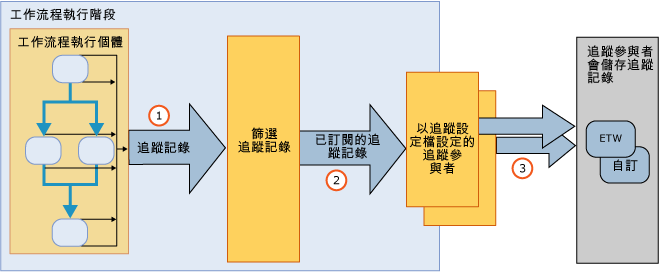

# 工作流程追蹤與追查
Windows 工作流程追蹤是專為提供工作流程可見性而設計的 [!INCLUDE[netfx_current_long](../../../includes/netfx-current-long-md.md)] 功能。 它提供追蹤基礎架構，可追蹤工作流程執行個體的執行。 WF 追蹤基礎結構會透明化地檢測工作流程，在執行期間發出記錄以反映重要事件。 根據預設，任何 [!INCLUDE[netfx_current_short](../../../includes/netfx-current-short-md.md)] 工作流程都可使用這個功能。 不需要對 [!INCLUDE[netfx_current_long](../../../includes/netfx-current-long-md.md)] 工作流程做任何變更，即可進行追蹤。 只需決定您想接收多少追蹤資料即可。 當工作流程執行個體開始或完成時，會發出處理的追蹤記錄。 追蹤也可以擷取與工作流程變數相關聯的商務相關資料。 例如，如果工作流程代表訂單處理系統，則訂單識別碼可與 <xref:System.Activities.Tracking.TrackingRecord> 物件一併擷取。 一般而言，啟用 WF 追蹤有助於對從執行工作流程而存取的資料進行診斷或業務分析。  
  
 這些追蹤元件等同於 [!INCLUDE[vstecwinfx](../../../includes/vstecwinfx-md.md)] 中的追蹤服務。 在 [!INCLUDE[netfx_current_short](../../../includes/netfx-current-short-md.md)] 中已改善效能，且已為 WF 追蹤功能簡化程式設計的模型。 追蹤執行階段會檢測工作流程執行個體，以發出與工作流程生命週期相關的事件、工作流程活動和自訂事件。  
  
 Windows Server App Fabric 還提供可監視 WCF 和工作流程服務執行的功能。 [!INCLUDE[crdefault](../../../includes/crdefault-md.md)][Windows Server App Fabric 監控](http://go.microsoft.com/fwlink/?LinkId=201273)和[監視使用 Windows Server AppFabric 應用程式](http://go.microsoft.com/fwlink/?LinkId=201287)  
  
 若要針對工作流程執行階段進行疑難排解，您可開啟診斷工作流程追蹤。 [!INCLUDE[crdefault](../../../includes/crdefault-md.md)][工作流程追蹤](../../../docs/framework/windows-workflow-foundation/workflow-tracing.md)。  
  
 若要了解程式設計的模型，本主題已針對追蹤基礎結構的主要元件進行討論：  
  
-   從工作流程執行階段發出的 <xref:System.Activities.Tracking.TrackingRecord> 物件。 [!INCLUDE[crdefault](../../../includes/crdefault-md.md)][追蹤記錄](../../../docs/framework/windows-workflow-foundation/tracking-records.md)。  
  
-   訂閱 <xref:System.Activities.Tracking.TrackingParticipant> 物件的 <xref:System.Activities.Tracking.TrackingRecord> 物件。 追蹤參與者包含處理來自 <xref:System.Activities.Tracking.TrackingRecord> 物件之裝載的邏輯 (例如，他們可以選擇寫入檔案)。 [!INCLUDE[crdefault](../../../includes/crdefault-md.md)][追蹤參與者](../../../docs/framework/windows-workflow-foundation/tracking-participants.md)。  
  
-   從工作流程執行個體發出的 <xref:System.Activities.Tracking.TrackingProfile> 物件篩選追蹤記錄。 [!INCLUDE[crdefault](../../../includes/crdefault-md.md)][追蹤設定檔](../../../docs/framework/windows-workflow-foundation/tracking-profiles.md)。  
  
## 工作流程追蹤基礎結構  
 工作流程追蹤基礎結構會依照發行與訂閱的範例。 工作流程執行個體是追蹤記錄的發行者，而追蹤記錄的訂閱者則是註冊為工作流程的延伸。 訂閱 <xref:System.Activities.Tracking.TrackingRecord> 物件的這些延伸稱為追蹤參與者。 追蹤參與者是可延伸點，可存取 <xref:System.Activities.Tracking.TrackingRecord> 物件，並以編寫它們的任何方式進行處理。 追蹤基礎結構可讓應用程式篩選外送的追蹤記錄，讓參與者訂閱記錄的子集。 這個篩選機制是透過追蹤設定檔來完成。  
  
 下圖顯示追蹤基礎結構的高層級檢視。  
  
   
  
## 本節內容  
 [追蹤記錄](../../../docs/framework/windows-workflow-foundation/tracking-records.md)  
 描述工作流程執行階段發出的追蹤記錄。  
  
 [追蹤設定檔](../../../docs/framework/windows-workflow-foundation/tracking-profiles.md)  
 討論如何使用追蹤設定檔。  
  
 [追蹤參與者](../../../docs/framework/windows-workflow-foundation/tracking-participants.md)  
 描述如何使用系統提供的追蹤參與者，或如何建立自訂追蹤參與者。  
  
 [設定工作流程的追蹤](../../../docs/framework/windows-workflow-foundation/configuring-tracking-for-a-workflow.md)  
 描述如何配置工作流程的追蹤。  
  
 [工作流程追蹤](../../../docs/framework/windows-workflow-foundation/workflow-tracing.md)  
 描述兩種啟用工作流程偵錯追蹤的方式。  
  
 [使用追蹤判斷工作流程的執行期間](../../../docs/framework/windows-workflow-foundation/determining-workflow-execution-duration-using-tracing.md)  
 說明如何使用追蹤訊息，以判斷工作流程執行持續期間。  
  
## 請參閱  
 [SQL 追蹤](../../../docs/framework/windows-workflow-foundation/samples/sql-tracking.md)
