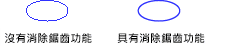

# 線條和曲線的反鋸齒功能Antialiasing with Lines and Curves
當您使用[!INCLUDE[ndptecgdiplus](../../../../includes/ndptecgdiplus-md.md)]繪製一條線，您提供的起點和結束點的行，但您沒有提供在列上的任何資訊的個別像素。When you use [!INCLUDE[ndptecgdiplus](../../../../includes/ndptecgdiplus-md.md)] to draw a line, you provide the starting point and ending point of the line, but you do not have to provide any information about the individual pixels on the line. [!INCLUDE[ndptecgdiplus](../../../../includes/ndptecgdiplus-md.md)]顯示驅動程式軟體，以判斷哪一個像素為單位將會開啟以特定顯示裝置上顯示線與搭配運作。 works in conjunction with the display driver software to determine which pixels will be turned on to show the line on a particular display device.  
  
## 別名Aliasing  
 請考慮直接紅線，會從點 （4，2） 移至的點 （16，10）。Consider the straight red line that goes from the point (4, 2) to the point (16, 10). 假設座標系統的原點位於左上角和度量單位為像素。Assume the coordinate system has its origin in the upper-left corner and that the unit of measure is the pixel. 也假設，x 軸指向右側，而 y 軸向下。Also assume that the x-axis points to the right and the y-axis points down. 下圖顯示彩色的背景上繪製紅線放大的的檢視。The following illustration shows an enlarged view of the red line drawn on a multicolored background.  
  
   
  
 用來呈現線條的紅色像素是不透明的。The red pixels used to render the line are opaque. 行中有不透明的像素。There are no partially transparent pixels in the line. 這種類型的行呈現所產生的線條不規則的外觀，並看起來有點像階梯。This type of line rendering gives the line a jagged appearance, and the line looks somewhat like a staircase. 代表的階梯線條的這項技術稱為別名。階梯是理論行的別名。This technique of representing a line with a staircase is called aliasing; the staircase is an alias for the theoretical line.  
  
## 反鋸齒功能Antialiasing  
 繪製線條更趨精密完美的技術包含使用透明的像素，以及不透明的像素為單位。A more sophisticated technique for rendering a line involves using partially transparent pixels along with opaque pixels. 像素為單位設定為純紅色，或紅和背景色彩混合體，根據如何關閉它們是列。Pixels are set to pure red, or to some blend of red and the background color, depending on how close they are to the line. 這種類型的呈現稱為反鋸齒功能，而導致人類的眼睛感知為更平滑線。This type of rendering is called antialiasing and results in a line that the human eye perceives as more smooth. 下圖顯示如何在背景產生鋸齒線條與混合特定像素為單位。The following illustration shows how certain pixels are blended with the background to produce an antialiased line.  
  
   
  
 反鋸齒功能，也稱為 平滑，也可以套用至曲線。Antialiasing, also called smoothing, can also be applied to curves. 下圖顯示放大平滑的橢圓形的檢視。The following illustration shows an enlarged view of a smoothed ellipse.  
  
   
  
 下圖顯示相同的橢圓形的實際大小，一次進行反鋸齒處理而一次使用反鋸齒功能。The following illustration shows the same ellipse in its actual size, once without antialiasing and once with antialiasing.  
  
   
  
 若要繪製的直線和曲線使用消除鋸齒，建立的執行個體<xref:System.Drawing.Graphics>類別並設定其<xref:System.Drawing.Graphics.SmoothingMode%2A>屬性<xref:System.Drawing.Drawing2D.SmoothingMode.AntiAlias>或<xref:System.Drawing.Drawing2D.SmoothingMode.HighQuality>。To draw lines and curves that use antialiasing, create an instance of the <xref:System.Drawing.Graphics> class and set its <xref:System.Drawing.Graphics.SmoothingMode%2A> property to <xref:System.Drawing.Drawing2D.SmoothingMode.AntiAlias> or <xref:System.Drawing.Drawing2D.SmoothingMode.HighQuality>. 然後呼叫其中一個繪圖的方法相同<xref:System.Drawing.Graphics>類別。Then call one of the drawing methods of that same <xref:System.Drawing.Graphics> class.  
  
 [!code-csharp[LinesCurvesAndShapes#81](../../../../samples/snippets/csharp/VS_Snippets_Winforms/LinesCurvesAndShapes/CS/Class1.cs#81)]
 [!code-vb[LinesCurvesAndShapes#81](../../../../samples/snippets/visualbasic/VS_Snippets_Winforms/LinesCurvesAndShapes/VB/Class1.vb#81)]  
  
## 請參閱See Also  
 <xref:System.Drawing.Drawing2D.SmoothingMode?displayProperty=nameWithType>  
 [線條、曲線和形狀Lines, Curves, and Shapes](../../../../docs/framework/winforms/advanced/lines-curves-and-shapes.md)  
 [操作說明：使用文字反鋸齒功能How to: Use Antialiasing with Text](../../../../docs/framework/winforms/advanced/how-to-use-antialiasing-with-text.md)
