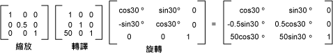

# 全域和區域轉換Global and Local Transformations
全域轉換為轉換套用至所繪製的每個項目的指定<xref:System.Drawing.Graphics>物件。A global transformation is a transformation that applies to every item drawn by a given <xref:System.Drawing.Graphics> object. 相反地，區域轉換為套用至要繪製的特定項目的轉換。In contrast, a local transformation is a transformation that applies to a specific item to be drawn.  
  
## 全域轉換Global Transformations  
 若要建立全域的轉換，建構<xref:System.Drawing.Graphics>物件，然後再操作其<xref:System.Drawing.Graphics.Transform%2A>屬性。To create a global transformation, construct a <xref:System.Drawing.Graphics> object, and then manipulate its <xref:System.Drawing.Graphics.Transform%2A> property. <xref:System.Drawing.Graphics.Transform%2A>屬性是<xref:System.Drawing.Drawing2D.Matrix>物件，因此它能容納仿射轉換的任何序列。The <xref:System.Drawing.Graphics.Transform%2A> property is a <xref:System.Drawing.Drawing2D.Matrix> object, so it can hold any sequence of affine transformations. 轉換儲存在<xref:System.Drawing.Graphics.Transform%2A>呼叫全局轉換的屬性。The transformation stored in the <xref:System.Drawing.Graphics.Transform%2A> property is called the world transformation. <xref:System.Drawing.Graphics>類別提供數種方法建立複合的自然變換： <xref:System.Drawing.Graphics.MultiplyTransform%2A>， <xref:System.Drawing.Graphics.RotateTransform%2A>， <xref:System.Drawing.Graphics.ScaleTransform%2A>，和<xref:System.Drawing.Graphics.TranslateTransform%2A>。The <xref:System.Drawing.Graphics> class provides several methods for building up a composite world transformation: <xref:System.Drawing.Graphics.MultiplyTransform%2A>, <xref:System.Drawing.Graphics.RotateTransform%2A>, <xref:System.Drawing.Graphics.ScaleTransform%2A>, and <xref:System.Drawing.Graphics.TranslateTransform%2A>. 下列範例會繪製橢圓形兩次： 一次之前建立的自然變換和之後的一次。The following example draws an ellipse twice: once before creating a world transformation and once after. 轉換會先根據 0.5 y 方向的因數來縮放則轉換 x 方向的 50 個單位，並再旋轉 30 度。The transformation first scales by a factor of 0.5 in the y direction, then translates 50 units in the x direction, and then rotates 30 degrees.  
  
 [!code-csharp[System.Drawing.CoordinateSystems#21](../../../../samples/snippets/csharp/VS_Snippets_Winforms/System.Drawing.CoordinateSystems/CS/Class1.cs#21)]
 [!code-vb[System.Drawing.CoordinateSystems#21](../../../../samples/snippets/visualbasic/VS_Snippets_Winforms/System.Drawing.CoordinateSystems/VB/Class1.vb#21)]  
  
 下圖顯示參與轉換矩陣。The following illustration shows the matrices involved in the transformation.  
  
   
  
> [!NOTE]
>  在上述範例中，會在用戶端區域的左上角座標系統的原點旋轉橢圓形。In the preceding example, the ellipse is rotated about the origin of the coordinate system, which is at the upper-left corner of the client area. 這會產生不同的結果旋轉中心橢圓形。This produces a different result than rotating the ellipse about its own center.  
  
## 區域轉換Local Transformations  
 局部的轉換套用至要繪製的特定項目。A local transformation applies to a specific item to be drawn. 例如，<xref:System.Drawing.Drawing2D.GraphicsPath>物件具有<xref:System.Drawing.Drawing2D.GraphicsPath.Transform%2A>方法，可讓您轉換該路徑的資料點。For example, a <xref:System.Drawing.Drawing2D.GraphicsPath> object has a <xref:System.Drawing.Drawing2D.GraphicsPath.Transform%2A> method that allows you to transform the data points of that path. 下列範例會繪製任何轉換的矩形和旋轉轉換的路徑。The following example draws a rectangle with no transformation and a path with a rotation transformation. （假設是沒有全局轉換）。(Assume that there is no world transformation.)  
  
 [!code-csharp[System.Drawing.CoordinateSystems#22](../../../../samples/snippets/csharp/VS_Snippets_Winforms/System.Drawing.CoordinateSystems/CS/Class1.cs#22)]
 [!code-vb[System.Drawing.CoordinateSystems#22](../../../../samples/snippets/visualbasic/VS_Snippets_Winforms/System.Drawing.CoordinateSystems/VB/Class1.vb#22)]  
  
 您可以結合自然變換和區域轉換來達成各種不同的結果。You can combine the world transformation with local transformations to achieve a variety of results. 例如，您可以使用全局轉換修訂座標系統，並使用本機的轉換，旋轉和縮放繪製在新的座標系統上的物件。For example, you can use the world transformation to revise the coordinate system and use local transformations to rotate and scale objects drawn on the new coordinate system.  
  
 假設您想從工作區左邊緣與其來源 200 像素和 150 個像素，從用戶端區域的頂端座標系統。Suppose you want a coordinate system that has its origin 200 pixels from the left edge of the client area and 150 pixels from the top of the client area. 此外，假設您想要的度量單位為像素 x 軸指向右側和 y 軸向上。Furthermore, assume that you want the unit of measure to be the pixel, with the x-axis pointing to the right and the y-axis pointing up. 預設座標系統有 y 軸指向下方，因此您需要執行反映在水平軸。The default coordinate system has the y-axis pointing down, so you need to perform a reflection across the horizontal axis. 下圖顯示此類反射的矩陣。The following illustration shows the matrix of such a reflection.  
  
   
  
 接下來，假設您要執行轉譯 200 的單位，向右和向下的 150 單位。Next, assume you need to perform a translation 200 units to the right and 150 units down.  
  
 下列範例會建立剛剛所述設定的自然變換的座標系統<xref:System.Drawing.Graphics>物件。The following example establishes the coordinate system just described by setting the world transformation of a <xref:System.Drawing.Graphics> object.  
  
 [!code-csharp[System.Drawing.CoordinateSystems#23](../../../../samples/snippets/csharp/VS_Snippets_Winforms/System.Drawing.CoordinateSystems/CS/Class1.cs#23)]
 [!code-vb[System.Drawing.CoordinateSystems#23](../../../../samples/snippets/visualbasic/VS_Snippets_Winforms/System.Drawing.CoordinateSystems/VB/Class1.vb#23)]  
  
 下列程式碼 （放在前述範例中的結尾） 會建立單一的新的座標系統的原始位置左下角矩形組成的路徑。The following code (placed at the end of the preceding example) creates a path that consists of a single rectangle with its lower-left corner at the origin of the new coordinate system. 矩形填滿一次使用任何本機的轉換，另一次使用區域轉換。The rectangle is filled once with no local transformation and once with a local transformation. 「 本機 」 轉換包含水平延展，後面接著 30 度旋轉的 2 倍。The local transformation consists of a horizontal scaling by a factor of 2 followed by a 30-degree rotation.  
  
 [!code-csharp[System.Drawing.CoordinateSystems#24](../../../../samples/snippets/csharp/VS_Snippets_Winforms/System.Drawing.CoordinateSystems/CS/Class1.cs#24)]
 [!code-vb[System.Drawing.CoordinateSystems#24](../../../../samples/snippets/visualbasic/VS_Snippets_Winforms/System.Drawing.CoordinateSystems/VB/Class1.vb#24)]  
  
 下圖顯示新的座標系統和兩個矩形。The following illustration shows the new coordinate system and the two rectangles.  
  
   
  
## 請參閱See Also  
 [座標系統和轉換Coordinate Systems and Transformations](../../../../docs/framework/winforms/advanced/coordinate-systems-and-transformations.md)  
 [使用 Managed GDI+ 中的轉換Using Transformations in Managed GDI+](../../../../docs/framework/winforms/advanced/using-transformations-in-managed-gdi.md)
