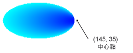

# 如何：建立路徑漸層How to: Create a Path Gradient
<xref:System.Drawing.Drawing2D.PathGradientBrush>類別可讓您自訂您漸層色彩填滿圖形的方式。The <xref:System.Drawing.Drawing2D.PathGradientBrush> class allows you to customize the way you fill a shape with gradually changing colors. 比方說，您可以指定一個色彩為路徑的中央和路徑的界限的另一種色彩。For example, you can specify one color for the center of a path and another color for the boundary of a path. 您也可以指定不同的色彩，每個界限的幾個點的路徑。You can also specify separate colors for each of several points along the boundary of a path.  
  
> [!NOTE]
>  在[!INCLUDE[ndptecgdiplus](../../../../includes/ndptecgdiplus-md.md)]，路徑是一串的直線和曲線所維護<xref:System.Drawing.Drawing2D.GraphicsPath>物件。In [!INCLUDE[ndptecgdiplus](../../../../includes/ndptecgdiplus-md.md)], a path is a sequence of lines and curves maintained by a <xref:System.Drawing.Drawing2D.GraphicsPath> object. 如需有關[!INCLUDE[ndptecgdiplus](../../../../includes/ndptecgdiplus-md.md)]路徑，請參閱[GDI + 中的圖形路徑](../../../../docs/framework/winforms/advanced/graphics-paths-in-gdi.md)和[Constructing 和繪製路徑](../../../../docs/framework/winforms/advanced/constructing-and-drawing-paths.md)。For more information about [!INCLUDE[ndptecgdiplus](../../../../includes/ndptecgdiplus-md.md)] paths, see [Graphics Paths in GDI+](../../../../docs/framework/winforms/advanced/graphics-paths-in-gdi.md) and [Constructing and Drawing Paths](../../../../docs/framework/winforms/advanced/constructing-and-drawing-paths.md).  
  
### 若要使用的路徑漸層填滿橢圓形To fill an ellipse with a path gradient  
  
-   下列範例會填滿橢圓形路徑漸層筆刷。The following example fills an ellipse with a path gradient brush. 中心色彩設定為藍色並界限色彩設定為青色。The center color is set to blue and the boundary color is set to aqua. 下圖顯示實心的橢圓形。The following illustration shows the filled ellipse.  
  
       
  
     根據預設，路徑漸層筆刷不會延伸超出路徑的界限。By default, a path gradient brush does not extend outside the boundary of the path. 如果您使用路徑漸層筆刷填滿超出路徑的邊界的圖形，在路徑外螢幕區域不會被填入。If you use the path gradient brush to fill a figure that extends beyond the boundary of the path, the area of the screen outside the path will not be filled.  
  
     下圖顯示如果您變更，會發生什麼事<xref:System.Drawing.Graphics.FillEllipse%2A>在下列程式碼中呼叫`e.Graphics.FillRectangle(pthGrBrush, 0, 10, 200, 40)`。The following illustration shows what happens if you change the <xref:System.Drawing.Graphics.FillEllipse%2A> call in the following code to `e.Graphics.FillRectangle(pthGrBrush, 0, 10, 200, 40)`.  
  
       
  
     [!code-csharp[System.Drawing.UsingaGradientBrush#11](../../../../samples/snippets/csharp/VS_Snippets_Winforms/System.Drawing.UsingaGradientBrush/CS/Class1.cs#11)]
     [!code-vb[System.Drawing.UsingaGradientBrush#11](../../../../samples/snippets/visualbasic/VS_Snippets_Winforms/System.Drawing.UsingaGradientBrush/VB/Class1.vb#11)]  
  
     上述程式碼範例設計用於搭配 Windows Form，且其需要<xref:System.Windows.Forms.PaintEventArgs>e 是參數的<xref:System.Windows.Forms.PaintEventHandler>。The preceding code example is designed for use with Windows Forms, and it requires the <xref:System.Windows.Forms.PaintEventArgs> e, which is a parameter of <xref:System.Windows.Forms.PaintEventHandler>.  
  
### 若要指定點的界限To specify points on the boundary  
  
-   下列範例會建構路徑漸層筆刷從星形的路徑。The following example constructs a path gradient brush from a star-shaped path. 程式碼集<xref:System.Drawing.Drawing2D.PathGradientBrush.CenterColor%2A>屬性，設定在為紅色星號的距心的色彩。The code sets the <xref:System.Drawing.Drawing2D.PathGradientBrush.CenterColor%2A> property, which sets the color at the centroid of the star to red. 然後程式碼集<xref:System.Drawing.Drawing2D.PathGradientBrush.SurroundColors%2A>屬性來指定不同的色彩 (儲存在`colors`陣列) 中的個別點`points`陣列。Then the code sets the <xref:System.Drawing.Drawing2D.PathGradientBrush.SurroundColors%2A> property to specify various colors (stored in the `colors` array) at the individual points in the `points` array. 最後的程式碼陳述式會填滿星形路徑與路徑漸層筆刷。The final code statement fills the star-shaped path with the path gradient brush.  
  
     [!code-csharp[System.Drawing.UsingaGradientBrush#12](../../../../samples/snippets/csharp/VS_Snippets_Winforms/System.Drawing.UsingaGradientBrush/CS/Class1.cs#12)]
     [!code-vb[System.Drawing.UsingaGradientBrush#12](../../../../samples/snippets/visualbasic/VS_Snippets_Winforms/System.Drawing.UsingaGradientBrush/VB/Class1.vb#12)]  
  
-   下列範例會繪製路徑漸層，而不<xref:System.Drawing.Drawing2D.GraphicsPath>程式碼中的物件。The following example draws a path gradient without a <xref:System.Drawing.Drawing2D.GraphicsPath> object in the code. 特定<xref:System.Drawing.Drawing2D.PathGradientBrush.%23ctor%2A>接收的點陣列建構函式在範例中，但不需要<xref:System.Drawing.Drawing2D.GraphicsPath>物件。The particular <xref:System.Drawing.Drawing2D.PathGradientBrush.%23ctor%2A> constructor in the example receives an array of points but does not require a <xref:System.Drawing.Drawing2D.GraphicsPath> object. 另請注意，<xref:System.Drawing.Drawing2D.PathGradientBrush>用來填滿的矩形，不是路徑。Also, note that the <xref:System.Drawing.Drawing2D.PathGradientBrush> is used to fill a rectangle, not a path. 矩形會大於已關閉用來定義筆刷，因此部分矩形將不會繪製筆刷的路徑。The rectangle is larger than the closed path used to define the brush, so some of the rectangle is not painted by the brush. 下圖顯示的矩形 （虛線） 和部分路徑漸層筆刷繪製的矩形。The following illustration shows the rectangle (dotted line) and the portion of the rectangle painted by the path gradient brush.  
  
       
  
     [!code-csharp[System.Drawing.UsingaGradientBrush#13](../../../../samples/snippets/csharp/VS_Snippets_Winforms/System.Drawing.UsingaGradientBrush/CS/Class1.cs#13)]
     [!code-vb[System.Drawing.UsingaGradientBrush#13](../../../../samples/snippets/visualbasic/VS_Snippets_Winforms/System.Drawing.UsingaGradientBrush/VB/Class1.vb#13)]  
  
### 若要自訂路徑漸層To customize a path gradient  
  
-   若要自訂路徑漸層筆刷的一種方式為設定其<xref:System.Drawing.Drawing2D.PathGradientBrush.FocusScales%2A>屬性。One way to customize a path gradient brush is to set its <xref:System.Drawing.Drawing2D.PathGradientBrush.FocusScales%2A> property. 焦點比例指定主要路徑內的內部路徑。The focus scales specify an inner path that lies inside the main path. 中心色彩全部都會顯示內部路徑，而不是只在中心點。The center color is displayed everywhere inside that inner path rather than only at the center point.  
  
     下列範例會建立路徑漸層筆刷根據橢圓形的路徑。The following example creates a path gradient brush based on an elliptical path. 程式碼界限色彩設定為藍色，中心色彩設定為青色，，然後再使用路徑漸層筆刷填滿橢圓形的路徑。The code sets the boundary color to blue, sets the center color to aqua, and then uses the path gradient brush to fill the elliptical path.  
  
     接下來，此程式碼會設定路徑的漸層筆刷的焦點比例。Next, the code sets the focus scales of the path gradient brush. X 焦點小數位數設定為 0.3，和 y 焦點小數位數設定為 0.8。The x focus scale is set to 0.3, and the y focus scale is set to 0.8. 程式碼會呼叫<xref:System.Drawing.Graphics.TranslateTransform%2A>方法<xref:System.Drawing.Graphics>物件以便後續呼叫<xref:System.Drawing.Graphics.FillPath%2A>會填滿橢圓形位於右邊的第一個橢圓形。The code calls the <xref:System.Drawing.Graphics.TranslateTransform%2A> method of a <xref:System.Drawing.Graphics> object so that the subsequent call to <xref:System.Drawing.Graphics.FillPath%2A> fills an ellipse that sits to the right of the first ellipse.  
  
     若要查看焦點比例的效果，假設共用同一個中心與主要橢圓形的小型橢圓形。To see the effect of the focus scales, imagine a small ellipse that shares its center with the main ellipse. 小 （內部） 橢圓形是主要的省略符號 （關於其中心） 水平調整，因數為 0.3 平和垂直方式，因數為 0.8。The small (inner) ellipse is the main ellipse scaled (about its center) horizontally by a factor of 0.3 and vertically by a factor of 0.8. 當您移動從外部橢圓形的邊界內部的橢圓形的邊界時，色彩逐漸從變成藍色青色。As you move from the boundary of the outer ellipse to the boundary of the inner ellipse, the color changes gradually from blue to aqua. 當您從內部橢圓形的邊界移到共用的中心，色彩會保持為青色。As you move from the boundary of the inner ellipse to the shared center, the color remains aqua.  
  
     下圖顯示下列程式碼的輸出。The following illustration shows the output of the following code. 在左側橢圓形是青色的中心點。The ellipse on the left is aqua only at the center point. 在右邊的省略符號是青色 everywhere 內的內部路徑。The ellipse on the right is aqua everywhere inside the inner path.  
  
   
  
 [!code-csharp[System.Drawing.UsingaGradientBrush#14](../../../../samples/snippets/csharp/VS_Snippets_Winforms/System.Drawing.UsingaGradientBrush/CS/Class1.cs#14)]
 [!code-vb[System.Drawing.UsingaGradientBrush#14](../../../../samples/snippets/visualbasic/VS_Snippets_Winforms/System.Drawing.UsingaGradientBrush/VB/Class1.vb#14)]  
  
### 若要自訂使用插補To customize with interpolation  
  
-   若要自訂路徑漸層筆刷的另一種方式是指定插補色彩的陣列和陣列的插補的位置。Another way to customize a path gradient brush is to specify an array of interpolation colors and an array of interpolation positions.  
  
     下列範例會建立路徑漸層筆刷根據三角形。The following example creates a path gradient brush based on a triangle. 程式碼集<xref:System.Drawing.Drawing2D.PathGradientBrush.InterpolationColors%2A>路徑漸層筆刷深綠色、 青色 （藍） 的插補色彩的陣列和陣列的插補位置 （0，0.25，1） 指定的屬性。The code sets the <xref:System.Drawing.Drawing2D.PathGradientBrush.InterpolationColors%2A> property of the path gradient brush to specify an array of interpolation colors (dark green, aqua, blue) and an array of interpolation positions (0, 0.25, 1). 當您移動的三角形界限從中心點，色彩會逐漸從深綠色青色，然後從青色為藍色。As you move from the boundary of the triangle to the center point, the color changes gradually from dark green to aqua and then from aqua to blue. 深綠色青色的變更會發生在 25%的距離為藍色深綠色。The change from dark green to aqua happens in 25 percent of the distance from dark green to blue.  
  
     下圖顯示自訂路徑漸層筆刷填滿的三角形。The following illustration shows the triangle filled with the custom path gradient brush.  
  
       
  
     [!code-csharp[System.Drawing.UsingaGradientBrush#15](../../../../samples/snippets/csharp/VS_Snippets_Winforms/System.Drawing.UsingaGradientBrush/CS/Class1.cs#15)]
     [!code-vb[System.Drawing.UsingaGradientBrush#15](../../../../samples/snippets/visualbasic/VS_Snippets_Winforms/System.Drawing.UsingaGradientBrush/VB/Class1.vb#15)]  
  
### 若要設定的中心點To set the center point  
  
-   根據預設，路徑漸層筆刷的中心點位於用來建構筆刷的路徑的距心。By default, the center point of a path gradient brush is at the centroid of the path used to construct the brush. 您可以藉由設定變更的中心點的位置<xref:System.Drawing.Drawing2D.PathGradientBrush.CenterPoint%2A>屬性<xref:System.Drawing.Drawing2D.PathGradientBrush>類別。You can change the location of the center point by setting the <xref:System.Drawing.Drawing2D.PathGradientBrush.CenterPoint%2A> property of the <xref:System.Drawing.Drawing2D.PathGradientBrush> class.  
  
     下列範例會建立路徑漸層筆刷根據橢圓形。The following example creates a path gradient brush based on an ellipse. 橢圓形的中心位於 70 (35），但路徑漸層筆刷的中心點設定為 120 (40）。The center of the ellipse is at (70, 35), but the center point of the path gradient brush is set to (120, 40).  
  
     [!code-csharp[System.Drawing.UsingaGradientBrush#16](../../../../samples/snippets/csharp/VS_Snippets_Winforms/System.Drawing.UsingaGradientBrush/CS/Class1.cs#16)]
     [!code-vb[System.Drawing.UsingaGradientBrush#16](../../../../samples/snippets/visualbasic/VS_Snippets_Winforms/System.Drawing.UsingaGradientBrush/VB/Class1.vb#16)]  
  
     下圖顯示實心的橢圓形和路徑的漸層筆刷的中心點。The following illustration shows the filled ellipse and the center point of the path gradient brush.  
  
       
  
-   您可以設定用來建構筆刷的路徑以外的位置路徑的漸層筆刷的中心點。You can set the center point of a path gradient brush to a location outside the path that was used to construct the brush. 下列範例會取代設定的呼叫<xref:System.Drawing.Drawing2D.PathGradientBrush.CenterPoint%2A>上述程式碼中的屬性。The following example replaces the call to set the <xref:System.Drawing.Drawing2D.PathGradientBrush.CenterPoint%2A> property in the preceding code.  
  
     [!code-csharp[System.Drawing.UsingaGradientBrush#17](../../../../samples/snippets/csharp/VS_Snippets_Winforms/System.Drawing.UsingaGradientBrush/CS/Class1.cs#17)]
     [!code-vb[System.Drawing.UsingaGradientBrush#17](../../../../samples/snippets/visualbasic/VS_Snippets_Winforms/System.Drawing.UsingaGradientBrush/VB/Class1.vb#17)]  
  
     下圖顯示這項變更的輸出。The following illustration shows the output with this change.  
  
       
  
     在上圖中，最右邊的省略符號的點不是純藍色 （雖然它們是非常接近）。In the preceding illustration, the points at the far right of the ellipse are not pure blue (although they are very close). 中所使用漸層的色彩都位於如同填滿到達其中色彩會 （0，0，255） 的純藍色點 （145，35）。The colors in the gradient are positioned as if the fill reached the point (145, 35) where the color would be pure blue (0, 0, 255). 但永遠不會到達填滿 （145，35） 因為路徑的漸層筆刷繪製只在其路徑。But the fill never reaches (145, 35) because a path gradient brush paints only inside its path.  
  
## 編譯程式碼Compiling the Code  
 前面的範例專為搭配 Windows Form 使用，而且會要求<xref:System.Windows.Forms.PaintEventArgs> `e`，這是參數的<xref:System.Windows.Forms.Control.Paint>事件處理常式。The preceding examples are designed for use with Windows Forms, and they require <xref:System.Windows.Forms.PaintEventArgs> `e`, which is a parameter of the <xref:System.Windows.Forms.Control.Paint> event handler.  
  
## 請參閱See Also  
 [使用漸層筆刷填滿形狀Using a Gradient Brush to Fill Shapes](../../../../docs/framework/winforms/advanced/using-a-gradient-brush-to-fill-shapes.md)
