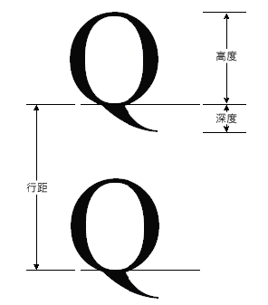

# HOW TO：取得字型度量資訊How to: Obtain Font Metrics
<xref:System.Drawing.FontFamily>類別提供下列方法，擷取各種度量，針對特定的系列樣式組合：The <xref:System.Drawing.FontFamily> class provides the following methods that retrieve various metrics for a particular family/style combination:  
  
-   <xref:System.Drawing.FontFamily.GetEmHeight%2A>([Fontstyle])<xref:System.Drawing.FontFamily.GetEmHeight%2A>(FontStyle)  
  
-   <xref:System.Drawing.FontFamily.GetCellAscent%2A>([Fontstyle])<xref:System.Drawing.FontFamily.GetCellAscent%2A>(FontStyle)  
  
-   <xref:System.Drawing.FontFamily.GetCellDescent%2A>([Fontstyle])<xref:System.Drawing.FontFamily.GetCellDescent%2A>(FontStyle)  
  
-   <xref:System.Drawing.FontFamily.GetLineSpacing%2A>([Fontstyle])<xref:System.Drawing.FontFamily.GetLineSpacing%2A>(FontStyle)  
  
 這些方法所傳回的數字為字型設計單位，因此它們是獨立的大小和單位的特定<xref:System.Drawing.Font>物件。The numbers returned by these methods are in font design units, so they are independent of the size and units of a particular <xref:System.Drawing.Font> object.  
  
 下圖顯示各種計量。The following illustration shows the various metrics.  
  
   
  
## 範例Example  
 下列範例會顯示規則的樣式，新細明體字型家族的計量。The following example displays the metrics for the regular style of the Arial font family. 程式碼也會建立<xref:System.Drawing.Font>具有大小為 16 像素，並顯示該特定的計量 （以像素為單位） （根據新細明體系列） 的物件<xref:System.Drawing.Font>物件。The code also creates a <xref:System.Drawing.Font> object (based on the Arial family) with size 16 pixels and displays the metrics (in pixels) for that particular <xref:System.Drawing.Font> object.  
  
 下圖顯示的範例程式碼的輸出。The following illustration shows the output of the example code.  
  
   
  
 請注意上圖中的前兩行。Note the first two lines of output in the preceding illustration. <xref:System.Drawing.Font>物件傳回的大小為 16，而<xref:System.Drawing.FontFamily>物件傳回 em 高度 2,048。The <xref:System.Drawing.Font> object returns a size of 16, and the <xref:System.Drawing.FontFamily> object returns an em height of 2,048. 這兩個數字 （16 及 2,048） 是字型設計單位和單位 （在此案例的像素） 之間進行轉換的關鍵<xref:System.Drawing.Font>物件。These two numbers (16 and 2,048) are the key to converting between font design units and the units (in this case pixels) of the <xref:System.Drawing.Font> object.  
  
 例如，您可以將轉換 ascent 設計單位為像素，如下所示：For example, you can convert the ascent from design units to pixels as follows:  
  
   
  
 下列程式碼文字垂直定位 splittunneling<xref:System.Drawing.PointF.Y%2A>資料成員<xref:System.Drawing.PointF>物件。The following code positions text vertically by setting the <xref:System.Drawing.PointF.Y%2A> data member of a <xref:System.Drawing.PointF> object. Y 座標會隨著增加`font.Height`針對每個新的一行文字。The y-coordinate is increased by `font.Height` for each new line of text. <xref:System.Drawing.Font.Height%2A>的屬性<xref:System.Drawing.Font>物件傳回該特定的行距 （單位為像素）<xref:System.Drawing.Font>物件。The <xref:System.Drawing.Font.Height%2A> property of a <xref:System.Drawing.Font> object returns the line spacing (in pixels) for that particular <xref:System.Drawing.Font> object. 在此範例中，數字傳回<xref:System.Drawing.Font.Height%2A>為 19。In this example, the number returned by <xref:System.Drawing.Font.Height%2A> is 19. 請注意，這是由行距度量轉換為像素 （無條件進位到整數） 的數字相同。Note that this is the same as the number (rounded up to an integer) obtained by converting the line-spacing metric to pixels.  
  
 請注意，（也稱為大小或 em 大小） 其 em 高度不上升和下降的總和。Note that the em height (also called size or em size) is not the sum of the ascent and the descent. 上升和下降的總和會呼叫儲存格的高度。The sum of the ascent and the descent is called the cell height. 儲存格的高度減去內部的前置字元等於其 em 高度。The cell height minus the internal leading is equal to the em height. 儲存格的高度加上外部前置字元等於行距。The cell height plus the external leading is equal to the line spacing.  
  
 [!code-csharp[System.Drawing.FontsAndText#71](~/samples/snippets/csharp/VS_Snippets_Winforms/System.Drawing.FontsAndText/CS/Class1.cs#71)]
 [!code-vb[System.Drawing.FontsAndText#71](~/samples/snippets/visualbasic/VS_Snippets_Winforms/System.Drawing.FontsAndText/VB/Class1.vb#71)]  
  
## 編譯程式碼Compiling the Code  
 上述範例設計是為搭配 Windows Form 使用所設計，而且需要 <xref:System.Windows.Forms.PaintEventArgs> `e`，這是 <xref:System.Windows.Forms.PaintEventHandler> 的參數。The preceding example is designed for use with Windows Forms, and it requires <xref:System.Windows.Forms.PaintEventArgs> `e`, which is a parameter of <xref:System.Windows.Forms.PaintEventHandler>.  
  
## 另請參閱See also
- [Windows Forms 中的圖形和繪圖Graphics and Drawing in Windows Forms](graphics-and-drawing-in-windows-forms.md)
- [使用字型和文字Using Fonts and Text](using-fonts-and-text.md)
