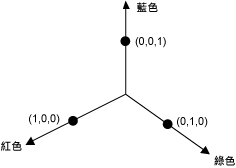
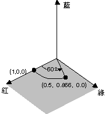
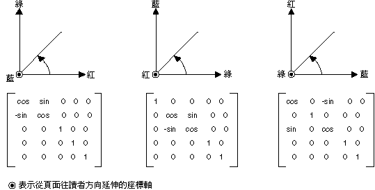
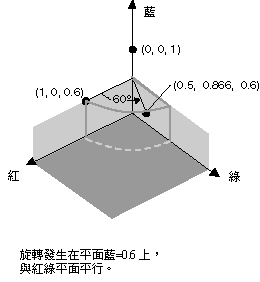

# HOW TO：旋轉色彩
四維色彩空間中的旋轉很難視覺化。 我們可以輕鬆地視覺化起來要保留固定的色彩元件之一。 假設同意將固定為 1 的 alpha 元件 （完全不透明）。 然後我們可以將三維色彩空間視覺化具有紅色、 綠色和藍色的軸，如下圖所示。  
  
   
  
 色彩可以視為在 3d 空間中的點。 比方說，空間中的點 （1，0，0） 表示的色彩為紅色，並在空間中的點 （0、 1、 0） 代表綠色的色彩。  
  
 下圖顯示旋轉的色彩 （1，0，0） 的意義透過紅色、 綠色分別平面中的 60 度的角度。 紅色、 綠色分別平面平行的平面中的循環可視為藍色軸旋轉。  
  
   
  
 下圖顯示如何初始化色彩矩陣，以執行每一個的三個座標的軸 （紅色、 綠色、 藍色） 的旋轉。  
  
   
  
## 範例  
 下列範例會為所有的一種色彩 （1，0，0.6） 與藍色軸 60 度旋轉套用的映像。 旋轉的角度會是紅色、 綠色分別平面平行的平面中，只要進行清理出。  
  
 下圖顯示原始的映像，在左邊和右邊的旋轉色彩的映像。  
  
   
  
 下圖顯示色彩旋轉，執行下列程式碼中的視覺效果。  
  
   
  
 [!code-csharp[System.Drawing.RotateColors#1](../../../../samples/snippets/csharp/VS_Snippets_Winforms/System.Drawing.RotateColors/CS/Form1.cs#1)]
 [!code-vb[System.Drawing.RotateColors#1](../../../../samples/snippets/visualbasic/VS_Snippets_Winforms/System.Drawing.RotateColors/VB/Form1.vb#1)]  
  
## 編譯程式碼  
 上述範例中專為搭配 Windows Form 使用，而且需要<xref:System.Windows.Forms.PaintEventArgs> `e`，這是參數的<xref:System.Windows.Forms.Control.Paint>事件處理常式。 取代`RotationInput.bmp`映像檔案名稱和您系統上有效的路徑。  
  
## 另請參閱
- <xref:System.Drawing.Imaging.ColorMatrix>
- <xref:System.Drawing.Imaging.ImageAttributes>
- [Windows Forms 中的圖形和繪圖](../../../../docs/framework/winforms/advanced/graphics-and-drawing-in-windows-forms.md)
- [為影像重新著色](../../../../docs/framework/winforms/advanced/recoloring-images.md)
