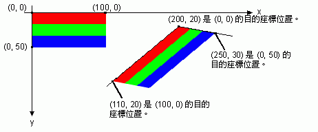

# 如何：旋轉、反射和傾斜影像How to: Rotate, Reflect, and Skew Images
您可以旋轉、 反射和傾斜影像藉由指定目的端座標點的原始影像的左上角、 右上角和左下角。You can rotate, reflect, and skew an image by specifying destination points for the upper-left, upper-right, and lower-left corners of the original image. 這三個目的點決定仿射轉換平行四邊形對應原始矩形的映像。The three destination points determine an affine transformation that maps the original rectangular image to a parallelogram.  
  
## 範例Example  
 例如，假設在原始圖像是在左上角的矩形 （0，0），在右上角 （100，0），以及在左下角 （0，50）。For example, suppose the original image is a rectangle with upper-left corner at (0, 0), upper-right corner at (100, 0), and lower-left corner at (0, 50). 現在假設您將這些對應三個點至目的地點，如下所示。Now suppose you map those three points to destination points as follows.  
  
|原始的點Original point|目的地點Destination point|  
|--------------------|-----------------------|  
|左上方 （0，0）Upper-left (0, 0)|(200, 20)(200, 20)|  
|右上方 （100，0）Upper-right (100, 0)|(110, 100)(110, 100)|  
|左下方 （0，50）Lower-left (0, 50)|(250, 30)(250, 30)|  
  
 下圖顯示原始的映像和對應的平行四邊形的映像。The following illustration shows the original image and the image mapped to the parallelogram. 原始的映像具有已有所偏差、 反映、 旋轉和轉譯。The original image has been skewed, reflected, rotated, and translated. 原始的映像的上邊緣 x 軸會對應至逐步執行一行 （200，20） 和 110 (100）。The x-axis along the top edge of the original image is mapped to the line that runs through (200, 20) and (110, 100). 原始的映像的左邊緣沿著 y 軸會對應至逐步執行一行 （200，20） 和 250 (30）。The y-axis along the left edge of the original image is mapped to the line that runs through (200, 20) and (250, 30).  
  
   
  
 下圖顯示類似的轉換套用至相片的映像。The following illustration shows a similar transformation applied to a photographic image.  
  
   
  
 下圖顯示類似的轉換套用到中繼檔。The following illustration shows a similar transformation applied to a metafile.  
  
   
  
 下列範例會產生第一個圖例中所顯示的影像。The following example produces the images shown in the first illustration.  
  
 [!code-csharp[System.Drawing.WorkingWithImages#61](../../../../samples/snippets/csharp/VS_Snippets_Winforms/System.Drawing.WorkingWithImages/CS/Class1.cs#61)]
 [!code-vb[System.Drawing.WorkingWithImages#61](../../../../samples/snippets/visualbasic/VS_Snippets_Winforms/System.Drawing.WorkingWithImages/VB/Class1.vb#61)]  
  
## 編譯程式碼Compiling the Code  
 上述範例是為了搭配 Windows Form 使用而設計，且其需要 <xref:System.Windows.Forms.PaintEventArgs>`e`，這是 <xref:System.Windows.Forms.Control.Paint> 事件處理常式的參數。The preceding example is designed for use with Windows Forms, and it requires <xref:System.Windows.Forms.PaintEventArgs>`e`, which is a parameter of the <xref:System.Windows.Forms.Control.Paint> event handler. 請務必取代`Stripes.bmp`與適用於您的系統映像的路徑。Make sure to replace `Stripes.bmp` with the path to an image that is valid on your system.  
  
## 另請參閱See Also  
 [使用影像、點陣圖、圖示和中繼檔Working with Images, Bitmaps, Icons, and Metafiles](../../../../docs/framework/winforms/advanced/working-with-images-bitmaps-icons-and-metafiles.md)
