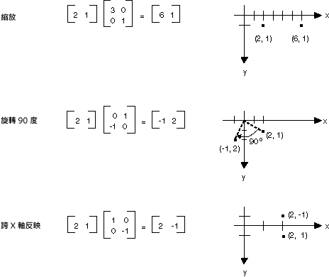
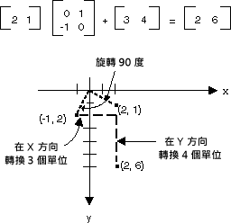
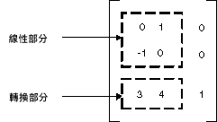

# 以矩陣來表示轉換
M × n 矩陣是一組在億個資料列和 n 個資料行中排列的數字。 下圖顯示數個矩陣。  
  
   
  
 您可以藉由新增個別的項目加入相同大小的兩個矩陣。 下圖顯示兩個矩陣新增範例。  
  
   
  
 M × n 矩陣乘以 n × p 矩陣，且結果為 m × p 矩陣。 第一個矩陣中的資料行數目必須是第二個矩陣中的資料列數目相同。 例如，4 × 2 的矩陣可以乘以 2 的 × 3 矩陣，以產生 4 × 3 的矩陣。  
  
 在平面和資料列和資料行的矩陣中的點可以視為向量。 例如，（2，5） 是具有兩個元件的向量和 （3，7，1） 是具有三個元件的向量。 兩個向量的內積定義，如下所示：  
  
 (a、 b） • (c，d) = ac + bd  
  
 (a、 b、 c） • （d，e，f） = ad + 是 + cf  
  
 比方說，積 （2、 3） 和 （5，4） 是 (2)(5) + (3)(4) = 22。 積 （2，5，1） 和 （4，3，1） 是 (2)(4) + (5)(3) + (1)(1) = 24。 請注意，兩個向量的內積數字，而非另一個向量。 也請注意，您就可以計算積，只有當兩個向量擁有相同數目的元件。  
  
 讓 A(i, j) 是矩陣的第 i 個資料列和第 j 個資料行中的項目。 比方說的 （3，2） 是矩陣的第 3 個資料列和第 2 個資料行中的項目。 假設 A、 B 和 C 是矩陣和 AB = c。C 的項目計算，如下所示：  
  
 C （i，j） = （資料列 i A） • （資料行 j B）  
  
 下圖矩陣相乘的數個的範例。  
  
   
  
 如果您將做為 1 的 × 2 矩陣平面中的點，您可以藉由將它乘以 2 × 2 矩陣來轉換該點。 下圖顯示數個轉換套用到 （2，1） 的點。  
  
   
  
 所有在上圖中顯示的轉換都是線性轉換。 某些其他轉換，例如轉譯，而且非屬線性，不能表示為乘以 2 × 2 矩陣。 假設您想要開始使用點 （2，1），旋轉 90 度、 將它轉譯成 3 個單位 x 方向和將其轉譯在 y 方向的 4 個單位。 您可以使用後面接著矩陣加入矩陣相乘來完成。  
  
   
  
 後面的翻譯 （加 1 × 2 矩陣的） 的線性轉換 （由 2 × 2 矩陣乘法） 稱為仿射轉換。 儲存仿射轉換矩陣 （一個為線性的一部分），做為轉換的一組中的替代方式是將整個轉換儲存 3 × 3 矩陣中。 若要讓這項工作，在平面的點必須儲存在與虛擬的第 3 個座標 1 × 3 的矩陣。 常用的技巧是讓所有的第 3 個座標等於 1。 例如，（2，1） 的點被以矩陣 [2 1 1]。 下圖顯示仿射轉換 （旋轉 90 度; 轉譯在 x 方向的 3 個單位，在 y 方向的 4 個單位） 乘以 3 × 3 矩陣以表示。  
  
   
  
 在上述範例中，點 （2，1） 會對應到點 （2，6）。 請注意 3 × 3 矩陣的第三個資料行包含數字 0，0，1。 這一律會是 3 × 3 矩陣仿射轉換的情況。 重要的數字是 1 和 2 的資料行中的六個數字。 矩陣的左上方 2 × 2 部分代表線性的組件的轉換，而第 3 個資料列中的前兩個項目代表轉譯。  
  
   
  
 在 [!INCLUDE[ndptecgdiplus](../../../../includes/ndptecgdiplus-md.md)]您可以儲存在仿射轉換<xref:System.Drawing.Drawing2D.Matrix>物件。 因為代表仿射轉換矩陣的第三個資料行一律是 （0，0，1），當您建構時，在前兩個資料行中指定的六個數字<xref:System.Drawing.Drawing2D.Matrix>物件。 陳述式`Matrix myMatrix = new Matrix(0, 1, -1, 0, 3, 4)`建構如上圖所示的矩陣。  
  
## 複合轉換  
 複合轉換是一連串的轉換，後面接著另一個。 請考慮下列清單中的轉換與矩陣：  
  
|||  
|-|-|  
|矩陣的|旋轉 90 度|  
|矩陣 B|在 x 方向的 2 倍縮放|  
|矩陣 C|轉譯在 y 方向的 3 個單位|  
  
 如果我們開始點 （2，1） — 矩陣 [2 1 1] 表示的 — 並乘以 A，然後 B，則 C，（2，1） 的點將會進行三種轉換中列出的順序。  
  
 [2 1 1]ABC = [-2 5 1]  
  
 而非 「 複合 」 轉換的三個部分儲存在三個個別的矩陣中，您可以將 A、 B 和 C 來取得儲存整個複合轉換單一 3 × 3 矩陣。 假設 ABC = d。然後乘以 D 點會給予相同的結果為點乘以 A，然後 B，然後 c。  
  
 [2 1 1]D = [-2 5 1]  
  
 下圖顯示矩陣的 A、 B、 C 和 d。  
  
   
  
 複合轉換矩陣可以依據個別的轉換矩陣相乘，這表示仿射轉換的任何序列都可以儲存在單一<xref:System.Drawing.Drawing2D.Matrix>物件。  
  
> [!CAUTION]
>  複合轉換順序很重要。 一般情況下，旋轉，然後調整，然後轉換並不相同小數位數為然後旋轉，然後轉換。 同樣地，矩陣相乘的順序很重要的。 一般情況下，ABC 不與備份相同。  
  
 <xref:System.Drawing.Drawing2D.Matrix>類別提供多種方法來建置複合轉換： <xref:System.Drawing.Drawing2D.Matrix.Multiply%2A>， <xref:System.Drawing.Drawing2D.Matrix.Rotate%2A>， <xref:System.Drawing.Drawing2D.Matrix.RotateAt%2A>， <xref:System.Drawing.Drawing2D.Matrix.Scale%2A>， <xref:System.Drawing.Drawing2D.Matrix.Shear%2A>，和<xref:System.Drawing.Drawing2D.Matrix.Translate%2A>。 下列範例會建立複合的轉換，先旋轉 30 度，則在 y 方向的 2 倍縮放，然後再平移 x 方向的 5 個單位矩陣：  
  
 [!code-csharp[System.Drawing.CoordinateSystems#11](~/samples/snippets/csharp/VS_Snippets_Winforms/System.Drawing.CoordinateSystems/CS/Class1.cs#11)]
 [!code-vb[System.Drawing.CoordinateSystems#11](~/samples/snippets/visualbasic/VS_Snippets_Winforms/System.Drawing.CoordinateSystems/VB/Class1.vb#11)]  
  
 下圖顯示矩陣。  
  
   
  
## 另請參閱

- [座標系統和轉換](coordinate-systems-and-transformations.md)
- [使用 Managed GDI+ 中的轉換](using-transformations-in-managed-gdi.md)
