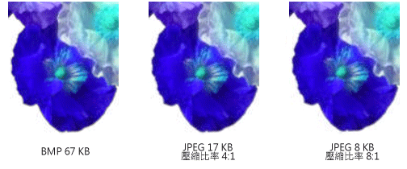

# 點陣圖類型
點陣圖是指定的每個像素色彩的像素矩形陣列中的位元陣列。 組成個別像素的位元數目會決定可以指派給該像素的色彩數目。 比方說，如果以 4 位元表示每個像素，然後指定像素可以指派其中 16 個不同的色彩 (2 ^4 = 16)。 下表顯示的一些範例可以指派給像素，以表示所指定的位元數的色彩數目。  
  
|每個像素的位元|可以指派給像素的色彩數目|  
|--------------------|------------------------------------------------------|  
|1|2^1 = 2|  
|2|2^2 = 4|  
|4|2^4 = 16|  
|8|2^8 = 256|  
|16|2^16 = 65,536|  
|24|2^24 = 16,777,216|  
  
 磁碟儲存的檔案，點陣圖通常包含一或多個資訊區塊儲存在陣列中的資訊，例如每個像素、 每個資料列中，像素數目和資料列數的位元數。 這類檔案可能也會包含色彩表 （有時稱為色彩調色盤）。 色彩表會將數字，點陣圖中的對應至特定色彩。 下圖顯示放大的影像，以及其點陣圖和色彩的資料表。 每個像素會以 4 位元數字，因此沒有 2 ^4 = 16 個色彩的色彩表中。 24 位元數字所表示的資料表中的每個色彩： 紅色的 8 位元、 8 位元，綠色和藍色的 8 位元。 數字以十六進位 (基底 16) 格式顯示： A = 10，B = 11，C = 12，D = 13，E = 14、 F = 15。  
  
   
  
 尋找資料列 3，資料行 5 的映像中的像素。 在點陣圖中對應的數字為 1。 色彩表告訴我們 1 表示的色彩為紅色，因此像素為紅色。 點陣圖的頂端列中的所有項目都是 3。 色彩表告訴我們，3 表示藍色，因此會以藍色顯示影像的頂端列中的所有像素。  
  
> [!NOTE]
>  某些點陣圖格式儲存在由下往上;點陣圖的第一個資料列中的數字會對應至映像的底端列中的像素。  
  
 點陣圖索引儲存至色彩表稱為調色盤編製索引的點陣圖。 某些點陣圖會有色彩表不需要。 比方說，如果點陣圖使用每個像素的 24 位元，該點陣圖可以儲存自己的色彩，而不是索引至色彩表。 下圖顯示點陣圖，直接儲存色彩 （24 位元 / 像素），而不是使用色彩表。 下圖也顯示對應的映像的放大的檢視。 在點陣圖，FFFFFF 代表白色、 FF0000 代表紅色、 00FF00 代表綠色，而 0000ff> 代表藍色。  
  
   
  
## 圖形檔格式  
 有許多標準格式將點陣圖儲存在磁碟檔案。 [!INCLUDE[ndptecgdiplus](../../../../includes/ndptecgdiplus-md.md)] 支援的圖形檔案下列段落中所述的格式。  
  
### BMP  
 BMP 是 Windows 用來儲存與裝置無關和與應用程式無關的映像以標準格式。 檔案標頭中指定的每個像素 （1、 4、 8、 15、 24、 32 或 64） 指定的 BMP 檔案的位元數。 每個像素的 24 位元的 BMP 檔案通。 BMP 檔案通常未壓縮，而且，因此不適合傳輸在網際網路上。  
  
### 圖形交換格式 (GIF)  
 GIF 是出現在網頁的映像的一般格式。 Gif 適用於線條繪圖、 使用的純色，區塊的圖片和圖片與銳利色彩之間的界限。 Gif 被壓縮，而且壓縮程序; 不會損失任何資訊解壓縮映像完全是與原來相同。 Gif 的一種色彩可以指定為透明，使映像將會有任何網頁上顯示的背景色彩。 一連串的 GIF 影像可以儲存在單一檔案，以形成動畫的 GIF。 Gif 儲存最多 8 位元 / 像素，所以它們會限制為 256 色。  
  
### Joint Photographic Experts Group (JPEG)  
 JPEG 非常適用於自然場景，例如掃描照片的壓縮配置。 有些資訊會遺失在壓縮過程中，但通常是無法察覺到人類的眼睛遺失。 Jpeg 儲存 24 位元 / 像素，這樣就可顯示多個 16 萬種色彩。 Jpeg 不支援透明或動畫。  
  
 JPEG 影像壓縮層級設定，但較高的壓縮層級 （較小的檔案） 會造成多個遺失的資訊。 20:1 壓縮比率通常會產生肉眼難以區別與原始版本的映像。 下圖顯示 BMP 影像，以及兩個已從該 BMP 影像壓縮的 JPEG 影像。 第一個 JPEG 壓縮比率 4:1，第二個 JPEG 壓縮比率約為 8:1。  
  
   
  
 JPEG 壓縮不適合線條繪圖，區塊的單色，並明顯的界線。 下圖顯示兩個 Jpeg 以及 GIF BMP。 Jpeg 和 GIF 已從 BMP 壓縮。 壓縮比為 4:1 GIF、 4:1，較小的 jpeg，和 8:3 大 jpeg。 請注意，GIF 維護尖的界限，沿著 Jpeg 通常會設定為模糊的界限。  
  
   
  
 JPEG 是一種壓縮配置，不是檔案格式。 JPEG 檔案交換格式 (JFIF) 是通常用來儲存和傳輸 JPEG 配置根據已壓縮的影像檔案格式。 網頁瀏覽器所顯示的 JFIF 檔案使用.jpg 副檔名。  
  
### 可交換影像檔案 (EXIF)  
 EXIF 是用來擷取數位相機所拍攝的相片的檔案格式。 EXIF 檔案包含壓縮的 JPEG 規格根據映像。 EXIF 檔案也包含相片的相關資訊 （拍攝日期、 快門速度、 曝光時間等） 和相機 （製造商、 型號及等等） 的相關資訊。  
  
### Portable Network Graphics (PNG)  
 PNG 格式會保留 GIF 格式的優點，但是也提供功能以外的 GIF。 就像 GIF 檔案，且不會遺失的資訊會壓縮 PNG 檔案。 PNG 檔案可以儲存 8、 24、 或每個像素和灰階 1、 2、 4、 8、 48 位元或 16 位元 / 像素的色彩。 相反地，GIF 檔可以使用 1、 2、 4 或 8 位元 / 像素。 PNG 檔案也可以儲存每個像素指定的像素的色彩會與背景色彩混合的程度的 alpha 值。  
  
 PNG 改進了 GIF 漸進顯示影像的能力 （也就是要顯示為它的映像的較佳的和更好的近似值到達透過網路連線）。 PNG 檔案可以包含 gamma 修正和色彩修正的資訊，使映像可以精確地轉譯的顯示裝置上。  
  
### Tif 檔案格式 (TIFF)  
 TIFF 是具彈性而且可擴充的格式支援的各種不同的平台和映像處理應用程式。 TIFF 檔案可以儲存包含任意數目的每個像素的位元的映像，並可採用各種不同的壓縮演算法。 數個映像可以儲存在單一的多頁 TIFF 檔案中。 掃描器製作、 主機電腦 （型別壓縮、 方向、 每個像素和等等的範例） 的映像的相關資訊可以儲存在檔案中，且透過標記使用方式排列。 可以擴充 TIFF 格式，視需要進行核准和加入的新標記。  
  
## 另請參閱  
 <xref:System.Drawing.Image?displayProperty=nameWithType>  
 <xref:System.Drawing.Bitmap?displayProperty=nameWithType>  
 <xref:System.Drawing.Imaging.PixelFormat?displayProperty=nameWithType>  
 [影像、點陣圖和中繼檔](../../../../docs/framework/winforms/advanced/images-bitmaps-and-metafiles.md)  
 [使用影像、點陣圖、圖示和中繼檔](../../../../docs/framework/winforms/advanced/working-with-images-bitmaps-icons-and-metafiles.md)
