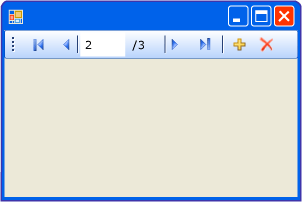

# BindingNavigator 控制項概觀 (Windows Form)BindingNavigator Control Overview (Windows Forms)
您可以使用 <xref:System.Windows.Forms.BindingNavigator> 控制項來建立標準化的方法，讓使用者用來搜尋和變更 Windows Form 上的資料。You can use the <xref:System.Windows.Forms.BindingNavigator> control to create a standardized means for users to search and change data on a Windows Form. 您經常使用 <xref:System.Windows.Forms.BindingNavigator> 搭配 <xref:System.Windows.Forms.BindingSource> 元件，讓使用者能夠瀏覽表單上的資料記錄，以及與記錄互動。You frequently use <xref:System.Windows.Forms.BindingNavigator> with the <xref:System.Windows.Forms.BindingSource> component to enable users to move through data records on a form and interact with the records.  
  
## BindingNavigator 的運作方式How the BindingNavigator Works  
 <xref:System.Windows.Forms.BindingNavigator> 控制項是由 <xref:System.Windows.Forms.ToolStrip> 與一系列 <xref:System.Windows.Forms.ToolStripItem> 物件所組成，可用來進行大多數常見的資料相關動作：加入資料、刪除資料，以及巡覽資料。The <xref:System.Windows.Forms.BindingNavigator> control is composed of a <xref:System.Windows.Forms.ToolStrip> with a series of <xref:System.Windows.Forms.ToolStripItem> objects for most of the common data-related actions: adding data, deleting data, and navigating through data. 根據預設，<xref:System.Windows.Forms.BindingNavigator> 控制項會包含這些標準按鈕。By default, the <xref:System.Windows.Forms.BindingNavigator> control contains these standard buttons. 下列螢幕擷取畫面顯示表單上的 <xref:System.Windows.Forms.BindingNavigator> 控制項。The following screen shot shows the <xref:System.Windows.Forms.BindingNavigator> control on a form.  
  
   
  
 下表列出控制項，並描述其功能。The following table lists the controls and describes their functions.  
  
|控制項Control|函式Function|  
|-------------|--------------|  
|<xref:System.Windows.Forms.BindingNavigator.AddNewItem%2A> 按鈕<xref:System.Windows.Forms.BindingNavigator.AddNewItem%2A> button|將新資料列插入基礎資料來源中。Inserts a new row into the underlying data source.|  
|<xref:System.Windows.Forms.BindingNavigator.DeleteItem%2A> 按鈕<xref:System.Windows.Forms.BindingNavigator.DeleteItem%2A> button|從基礎資料來源中刪除目前的資料列。Deletes the current row from the underlying data source.|  
|<xref:System.Windows.Forms.BindingNavigator.MoveFirstItem%2A> 按鈕<xref:System.Windows.Forms.BindingNavigator.MoveFirstItem%2A> button|移至基礎資料來源中的第一個項目。Moves to the first item in the underlying data source.|  
|<xref:System.Windows.Forms.BindingNavigator.MoveLastItem%2A> 按鈕<xref:System.Windows.Forms.BindingNavigator.MoveLastItem%2A> button|移至基礎資料來源中的最後一個項目。Moves to the last item in the underlying data source.|  
|<xref:System.Windows.Forms.BindingNavigator.MoveNextItem%2A> 按鈕<xref:System.Windows.Forms.BindingNavigator.MoveNextItem%2A> button|移至基礎資料來源中的下一個項目。Moves to the next item in the underlying data source.|  
|<xref:System.Windows.Forms.BindingNavigator.MovePreviousItem%2A> 按鈕<xref:System.Windows.Forms.BindingNavigator.MovePreviousItem%2A> button|移至基礎資料來源中的上一個項目。Moves to the previous item in the underlying data source.|  
|<xref:System.Windows.Forms.BindingNavigator.PositionItem%2A> 文字方塊<xref:System.Windows.Forms.BindingNavigator.PositionItem%2A> text box|傳回在基礎資料來源內的目前位置。Returns the current position within the underlying data source.|  
|<xref:System.Windows.Forms.BindingNavigator.CountItem%2A> 文字方塊<xref:System.Windows.Forms.BindingNavigator.CountItem%2A> text box|傳回基礎資料來源中的項目總數。Returns the total number of items in the underlying data source.|  
  
 針對此集合中的每個控制項，各有一個 <xref:System.Windows.Forms.BindingSource> 元件的對應成員，它會以程式設計的方式提供相同的功能。For each control in this collection, there is a corresponding member of the <xref:System.Windows.Forms.BindingSource> component that programmatically provides the same functionality. 例如，<xref:System.Windows.Forms.BindingNavigator.MoveFirstItem%2A> 按鈕對應至 <xref:System.Windows.Forms.BindingSource> 元件的 <xref:System.Windows.Forms.BindingSource.MoveFirst%2A> 方法，<xref:System.Windows.Forms.BindingNavigator.DeleteItem%2A> 按鈕對應至 <xref:System.Windows.Forms.BindingSource.RemoveCurrent%2A> 方法等。For example, the <xref:System.Windows.Forms.BindingNavigator.MoveFirstItem%2A> button corresponds to the <xref:System.Windows.Forms.BindingSource.MoveFirst%2A> method of the <xref:System.Windows.Forms.BindingSource> component, the <xref:System.Windows.Forms.BindingNavigator.DeleteItem%2A> button corresponds to the <xref:System.Windows.Forms.BindingSource.RemoveCurrent%2A> method, and so on.  
  
 如果預設按鈕不適合您的應用程式，或者如果您需要其他按鈕來支援其他類型的功能，您可以提供自己的 <xref:System.Windows.Forms.ToolStrip> 按鈕。If the default buttons are not suited to your application, or if you require additional buttons to support other types of functionality, you can supply your own <xref:System.Windows.Forms.ToolStrip> buttons. 另請參閱[如何：將載入、儲存和取消按鈕新增至 Windows Forms BindingNavigator 控制項](../../../../docs/framework/winforms/controls/load-save-and-cancel-bindingnavigator.md)。Also see [How to: Add Load, Save, and Cancel Buttons to the Windows Forms BindingNavigator Control](../../../../docs/framework/winforms/controls/load-save-and-cancel-bindingnavigator.md).  
  
## 另請參閱See Also  
 <xref:System.Windows.Forms.BindingNavigator>  
 <xref:System.Windows.Forms.BindingSource>  
 [BindingNavigator 控制項BindingNavigator Control](../../../../docs/framework/winforms/controls/bindingnavigator-control-windows-forms.md)
