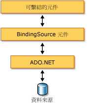

# BindingSource 元件概觀

  <xref:System.Windows.Forms.BindingSource> 元件的設計目的，是為了簡化將控制項繫結至基礎資料來源的程序。 <xref:System.Windows.Forms.BindingSource> 元件可同時做為管線和其他控制項繫結的目標資料來源。 它可以在透過命令傳遞至基礎資料清單時，提供表單資料連接的抽象層。 此外，您也可以直接加入資料，將元件本身當做資料來源使用。  
  
## 做為媒介的 BindingSource 元件  
 
  <xref:System.Windows.Forms.BindingSource> 元件可做為表單上部分或全部控制項的資料來源。 在 Visual Studio 中，<xref:System.Windows.Forms.BindingSource>可以藉由控制繫結`DataBindings`屬性，因此可從**屬性**視窗。 另請參閱[How to:繫結 Windows Form 控制項和 BindingSource 元件加以使用設計工具](bind-wf-controls-with-the-bindingsource.md)。  
  
 您可以將 <xref:System.Windows.Forms.BindingSource> 元件繫結至簡單的資料來源 (例如物件或 <xref:System.Collections.ArrayList> 等基本集合的單一屬性)，也可以繫結至複雜的資料來源 (例如資料庫資料表)。 <xref:System.Windows.Forms.BindingSource> 元件可做為提供繫結和貨幣管理服務的媒介。 您可以在設計階段或執行階段，透過將資料來源的 <xref:System.Windows.Forms.BindingSource.DataSource%2A> 和 <xref:System.Windows.Forms.BindingSource.DataMember%2A> 屬性分別設定為資料庫和資料表，將 <xref:System.Windows.Forms.BindingSource> 元件繫結至複雜的資料來源。 下圖示範 <xref:System.Windows.Forms.BindingSource> 元件在現有資料繫結架構中的位置。  
  
   
  
> [!NOTE]
>  在設計階段，有些動作 (例如將資料庫資料表從資料視窗拖曳到空白表單上) 可在一個作業之內同時完成建立 <xref:System.Windows.Forms.BindingSource> 元件、將之繫結至基礎資料來源及加入資料感知控制項。 另請參閱[在 Visual Studio 中將 Windows Forms 控制項繫結至資料](/visualstudio/data-tools/bind-windows-forms-controls-to-data-in-visual-studio)。  
  
## 做為資料來源的 BindingSource 元件  
 如果沒有事先指定要繫結的清單，就開始將項目加入 <xref:System.Windows.Forms.BindingSource> 元件，則這個元件的作用會類似清單樣式的資料來源，並會接受這些加入的項目。  
  
 此外，您可以撰寫程式碼，透過 <xref:System.Windows.Forms.BindingSource.AddingNew> 事件來提供自訂 "AddNew" 功能，這個事件是在將項目加入清單之前呼叫 <xref:System.Windows.Forms.BindingSource.AddNew%2A> 方法時所引發的。 如需詳細資訊，請參閱 [BindingSource 元件架構](bindingsource-component-architecture.md)。  
  
## 巡覽  
 對於需要在表單上巡覽資料的使用者，<xref:System.Windows.Forms.BindingNavigator> 元件搭配 <xref:System.Windows.Forms.BindingSource> 元件可讓您巡覽和管理資料。 如需詳細資訊，請參閱 [BindingNavigator 控制項](bindingnavigator-control-windows-forms.md)。  
  
## 資料管理  
 <xref:System.Windows.Forms.BindingSource> 可做為其所有繫結的 <xref:System.Windows.Forms.CurrencyManager>，因此可存取有關資料來源的貨幣和位置資訊。 下表顯示 <xref:System.Windows.Forms.BindingSource> 元件所提供用於存取和管理基礎資料的成員。  
  
|成員|描述|  
|------------|-----------------|  
|<xref:System.Windows.Forms.BindingSource.Current%2A> 屬性|取得資料來源的目前項目。|  
|<xref:System.Windows.Forms.BindingSource.Position%2A> 屬性|取得或設定基礎清單中的目前位置。|  
|<xref:System.Windows.Forms.BindingSource.List%2A> 屬性|取得 <xref:System.Windows.Forms.BindingSource.DataSource%2A> 評估和 <xref:System.Windows.Forms.BindingSource.DataMember%2A> 評估的清單。 如果未設定 <xref:System.Windows.Forms.BindingSource.DataMember%2A>，則會傳回 <xref:System.Windows.Forms.BindingSource.DataSource%2A> 所指定的清單。|  
|<xref:System.Windows.Forms.BindingSource.Insert%2A> 方法|將項目插入清單中指定的索引處。|  
|<xref:System.Windows.Forms.BindingSource.RemoveCurrent%2A> 方法|從清單中移除目前項目。|  
|<xref:System.Windows.Forms.BindingSource.EndEdit%2A> 方法|將暫止的變更套用至基礎資料來源。|  
|<xref:System.Windows.Forms.BindingSource.CancelEdit%2A> 方法|取消目前的編輯作業。|  
|<xref:System.Windows.Forms.BindingSource.AddNew%2A> 方法|將新的項目加入基礎清單中。 如果資料來源實作 <xref:System.ComponentModel.IBindingList> 並從 <xref:System.Windows.Forms.BindingSource.AddingNew> 事件傳回項目，則加入這個項目。 否則，這個要求會傳遞給清單的 <xref:System.ComponentModel.IBindingList.AddNew%2A> 方法。 如果基礎清單不是 <xref:System.ComponentModel.IBindingList>，則會透過其公用預設建構函式自動建立項目。|  
  
## 排序和篩選  
 您通常會使用資料來源的已排序或已篩選檢視。 下表顯示 <xref:System.Windows.Forms.BindingSource> 元件資料來源提供的成員。  
  
|成員|描述|  
|------------|-----------------|  
|<xref:System.Windows.Forms.BindingSource.Sort%2A> 屬性|如果資料來源是 <xref:System.ComponentModel.IBindingList>，可取得或設定用來排序的資料行名稱，以及排序次序資訊。 如果資料來源是 <xref:System.ComponentModel.IBindingListView> 並支援進階排序，可取得用來排序的多個資料行名稱，以及排序次序資訊。|  
|<xref:System.Windows.Forms.BindingSource.Filter%2A> 屬性|如果資料來源是 <xref:System.ComponentModel.IBindingListView>，可取得或設定用來篩選所檢視之資料列的運算式。|  
  
## 另請參閱
- <xref:System.Windows.Forms.BindingSource>
- <xref:System.Windows.Forms.BindingNavigator>
- [BindingSource 元件架構](bindingsource-component-architecture.md)
- [BindingSource 元件](bindingsource-component.md)
- [BindingNavigator 控制項](bindingnavigator-control-windows-forms.md)
- [Windows Forms 資料繫結](../windows-forms-data-binding.md)
- [在 Windows Forms 上使用的控制項](controls-to-use-on-windows-forms.md)
