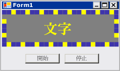

# <a name="walkthrough-creating-a-windows-forms-control-that-takes-advantage-of-visual-studio-design-time-features"></a><span data-ttu-id="bff20-102">逐步解說：建立利用 Visual Studio 設計階段功能的 Windows Form 控制項</span><span class="sxs-lookup"><span data-stu-id="bff20-102">Walkthrough: Creating a Windows Forms Control That Takes Advantage of Visual Studio Design-Time Features</span></span>
<span data-ttu-id="bff20-103">撰寫相關聯的自訂設計工具，可以增進自訂控制項的設計階段經驗。</span><span class="sxs-lookup"><span data-stu-id="bff20-103">The design-time experience for a custom control can be enhanced by authoring an associated custom designer.</span></span>  
  
 <span data-ttu-id="bff20-104">這個逐步解說將說明如何建立自訂控制項的自訂設計工具。</span><span class="sxs-lookup"><span data-stu-id="bff20-104">This walkthrough illustrates how to create a custom designer for a custom control.</span></span> <span data-ttu-id="bff20-105">您將實作`MarqueeControl`類型和相關聯的設計工具類別，稱為`MarqueeControlRootDesigner`。</span><span class="sxs-lookup"><span data-stu-id="bff20-105">You will implement a `MarqueeControl` type and an associated designer class, called `MarqueeControlRootDesigner`.</span></span>  
  
 <span data-ttu-id="bff20-106">`MarqueeControl`型別會實作可顯示類似劇場跑馬燈，與動畫燈號閃爍的文字。</span><span class="sxs-lookup"><span data-stu-id="bff20-106">The `MarqueeControl` type implements a display similar to a theater marquee, with animated lights and flashing text.</span></span>  
  
 <span data-ttu-id="bff20-107">此控制項的設計工具會與要提供自訂的設計階段經驗的設計環境互動。</span><span class="sxs-lookup"><span data-stu-id="bff20-107">The designer for this control interacts with the design environment to provide a custom design-time experience.</span></span> <span data-ttu-id="bff20-108">使用自訂設計工具中，您可以將組譯自訂`MarqueeControl`實作與動畫燈號閃爍文字多種組合。</span><span class="sxs-lookup"><span data-stu-id="bff20-108">With the custom designer, you can assemble a custom `MarqueeControl` implementation with animated lights and flashing text in many combinations.</span></span> <span data-ttu-id="bff20-109">您可以使用組合像任何其他 Windows Form 控制項在表單上的控制項。</span><span class="sxs-lookup"><span data-stu-id="bff20-109">You can use the assembled control on a form like any other Windows Forms control.</span></span>  
  
 <span data-ttu-id="bff20-110">這個逐步解說中所述的工作包括：</span><span class="sxs-lookup"><span data-stu-id="bff20-110">Tasks illustrated in this walkthrough include:</span></span>  
  
-   <span data-ttu-id="bff20-111">建立專案</span><span class="sxs-lookup"><span data-stu-id="bff20-111">Creating the Project</span></span>  
  
-   <span data-ttu-id="bff20-112">建立控制項程式庫專案</span><span class="sxs-lookup"><span data-stu-id="bff20-112">Creating a Control Library Project</span></span>  
  
-   <span data-ttu-id="bff20-113">參考自訂控制項專案</span><span class="sxs-lookup"><span data-stu-id="bff20-113">Referencing the Custom Control Project</span></span>  
  
-   <span data-ttu-id="bff20-114">定義自訂控制項和其自訂的設計工具</span><span class="sxs-lookup"><span data-stu-id="bff20-114">Defining a Custom Control and Its Custom Designer</span></span>  
  
-   <span data-ttu-id="bff20-115">建立自訂控制項的執行個體</span><span class="sxs-lookup"><span data-stu-id="bff20-115">Creating an Instance of Your Custom Control</span></span>  
  
-   <span data-ttu-id="bff20-116">設計階段偵錯的專案設定</span><span class="sxs-lookup"><span data-stu-id="bff20-116">Setting Up the Project for Design-Time Debugging</span></span>  
  
-   <span data-ttu-id="bff20-117">實作自訂控制項</span><span class="sxs-lookup"><span data-stu-id="bff20-117">Implementing Your Custom Control</span></span>  
  
-   <span data-ttu-id="bff20-118">建立自訂控制項的子控制項</span><span class="sxs-lookup"><span data-stu-id="bff20-118">Creating a Child Control for Your Custom Control</span></span>  
  
-   <span data-ttu-id="bff20-119">建立 MarqueeBorder 子控制項</span><span class="sxs-lookup"><span data-stu-id="bff20-119">Create the MarqueeBorder Child Control</span></span>  
  
-   <span data-ttu-id="bff20-120">建立自訂的設計工具，以遮蔽和篩選屬性</span><span class="sxs-lookup"><span data-stu-id="bff20-120">Creating a Custom Designer to Shadow and Filter Properties</span></span>  
  
-   <span data-ttu-id="bff20-121">處理元件的變更</span><span class="sxs-lookup"><span data-stu-id="bff20-121">Handling Component Changes</span></span>  
  
-   <span data-ttu-id="bff20-122">將設計工具動詞命令加入至您的自訂設計工具</span><span class="sxs-lookup"><span data-stu-id="bff20-122">Adding Designer Verbs to your Custom Designer</span></span>  
  
-   <span data-ttu-id="bff20-123">建立自訂的 UITypeEditor</span><span class="sxs-lookup"><span data-stu-id="bff20-123">Creating a Custom UITypeEditor</span></span>  
  
-   <span data-ttu-id="bff20-124">在設計工具中測試您的自訂控制項</span><span class="sxs-lookup"><span data-stu-id="bff20-124">Testing your Custom Control in the Designer</span></span>  
  
 <span data-ttu-id="bff20-125">當您完成時，您的自訂控制項看起來像下面這樣：</span><span class="sxs-lookup"><span data-stu-id="bff20-125">When you are finished, your custom control will look something like the following:</span></span>  
  
 <span data-ttu-id="bff20-126"></span><span class="sxs-lookup"><span data-stu-id="bff20-126"></span></span>  
  
 <span data-ttu-id="bff20-127">如需完整的程式碼清單，請參閱[How to： 建立 Windows Form 控制項，會利用的設計階段功能](http://msdn.microsoft.com/library/8e0bad0e-56f3-43d2-bf63-a945c654d97c)。</span><span class="sxs-lookup"><span data-stu-id="bff20-127">For the complete code listing, see [How to: Create a Windows Forms Control That Takes Advantage of Design-Time Features](http://msdn.microsoft.com/library/8e0bad0e-56f3-43d2-bf63-a945c654d97c).</span></span>  
  
> [!NOTE]
>  <span data-ttu-id="bff20-128">根據您目前使用的設定或版本，您所看到的對話方塊與功能表命令可能會與 [說明] 中描述的不同。</span><span class="sxs-lookup"><span data-stu-id="bff20-128">The dialog boxes and menu commands you see might differ from those described in Help depending on your active settings or edition.</span></span> <span data-ttu-id="bff20-129">若要變更設定，請從 [ **工具** ] 功能表中選取 [ **匯入和匯出設定** ]。</span><span class="sxs-lookup"><span data-stu-id="bff20-129">To change your settings, choose **Import and Export Settings** on the **Tools** menu.</span></span> <span data-ttu-id="bff20-130">如需詳細資訊，請參閱 [在 Visual Studio 中自訂開發設定](http://msdn.microsoft.com/library/22c4debb-4e31-47a8-8f19-16f328d7dcd3)</span><span class="sxs-lookup"><span data-stu-id="bff20-130">For more information, see [Customizing Development Settings in Visual Studio](http://msdn.microsoft.com/library/22c4debb-4e31-47a8-8f19-16f328d7dcd3).</span></span>  
  
## <a name="prerequisites"></a><span data-ttu-id="bff20-131">必要條件</span><span class="sxs-lookup"><span data-stu-id="bff20-131">Prerequisites</span></span>  
 <span data-ttu-id="bff20-132">若要完成這個逐步解說，您將需要：</span><span class="sxs-lookup"><span data-stu-id="bff20-132">In order to complete this walkthrough, you will need:</span></span>  
  
-   <span data-ttu-id="bff20-133">若要能夠建立及安裝 Visual Studio 的電腦上執行 Windows Form 應用程式專案有足夠的權限。</span><span class="sxs-lookup"><span data-stu-id="bff20-133">Sufficient permissions to be able to create and run Windows Forms application projects on the computer where Visual Studio is installed.</span></span>  
  
## <a name="creating-the-project"></a><span data-ttu-id="bff20-134">建立專案</span><span class="sxs-lookup"><span data-stu-id="bff20-134">Creating the Project</span></span>  
 <span data-ttu-id="bff20-135">第一個步驟是建立應用程式專案。</span><span class="sxs-lookup"><span data-stu-id="bff20-135">The first step is to create the application project.</span></span> <span data-ttu-id="bff20-136">您將使用此專案來建置裝載自訂控制項的應用程式。</span><span class="sxs-lookup"><span data-stu-id="bff20-136">You will use this project to build the application that hosts the custom control.</span></span>  
  
#### <a name="to-create-the-project"></a><span data-ttu-id="bff20-137">若要建立專案</span><span class="sxs-lookup"><span data-stu-id="bff20-137">To create the project</span></span>  
  
-   <span data-ttu-id="bff20-138">建立 Windows Forms 應用程式專案，稱為 「 MarqueeControlTest。 」</span><span class="sxs-lookup"><span data-stu-id="bff20-138">Create a Windows Forms Application project called "MarqueeControlTest."</span></span> <span data-ttu-id="bff20-139">如需詳細資訊，請參閱[如何：建立 Windows 應用程式專案](http://msdn.microsoft.com/library/b2f93fed-c635-4705-8d0e-cf079a264efa)。</span><span class="sxs-lookup"><span data-stu-id="bff20-139">For more information, see [How to: Create a Windows Application Project](http://msdn.microsoft.com/library/b2f93fed-c635-4705-8d0e-cf079a264efa).</span></span>  
  
## <a name="creating-a-control-library-project"></a><span data-ttu-id="bff20-140">建立控制項程式庫專案</span><span class="sxs-lookup"><span data-stu-id="bff20-140">Creating a Control Library Project</span></span>  
 <span data-ttu-id="bff20-141">下一個步驟是建立控制項程式庫專案。</span><span class="sxs-lookup"><span data-stu-id="bff20-141">The next step is to create the control library project.</span></span> <span data-ttu-id="bff20-142">您將建立新的自訂控制項和其相對應的自訂設計工具。</span><span class="sxs-lookup"><span data-stu-id="bff20-142">You will create a new custom control and its corresponding custom designer.</span></span>  
  
#### <a name="to-create-the-control-library-project"></a><span data-ttu-id="bff20-143">若要建立控制項程式庫專案</span><span class="sxs-lookup"><span data-stu-id="bff20-143">To create the control library project</span></span>  
  
1.  <span data-ttu-id="bff20-144">將 Windows Form 控制項程式庫專案加入方案。</span><span class="sxs-lookup"><span data-stu-id="bff20-144">Add a Windows Forms Control Library project to the solution.</span></span> <span data-ttu-id="bff20-145">專案"MarqueeControlLibrary。 」</span><span class="sxs-lookup"><span data-stu-id="bff20-145">Name the project "MarqueeControlLibrary."</span></span>  
  
2.  <span data-ttu-id="bff20-146">使用**方案總管 中**，藉由刪除來源檔案，視您所選擇的語言而定，名為"UserControl1.cs"或"UserControl1.vb"，刪除專案的預設控制項。</span><span class="sxs-lookup"><span data-stu-id="bff20-146">Using **Solution Explorer**, delete the project's default control by deleting the source file named "UserControl1.cs" or "UserControl1.vb", depending on your language of choice.</span></span> <span data-ttu-id="bff20-147">如需詳細資訊，請參閱[NIB： 如何： 移除、 刪除和排除的項目](http://msdn.microsoft.com/library/6dffdc86-29c8-4eff-bcd8-e3a0dd9e9a73)。</span><span class="sxs-lookup"><span data-stu-id="bff20-147">For more information, see [NIB:How to: Remove, Delete, and Exclude Items](http://msdn.microsoft.com/library/6dffdc86-29c8-4eff-bcd8-e3a0dd9e9a73).</span></span>  
  
3.  <span data-ttu-id="bff20-148">加入新<xref:System.Windows.Forms.UserControl>項目`MarqueeControlLibrary`專案。</span><span class="sxs-lookup"><span data-stu-id="bff20-148">Add a new <xref:System.Windows.Forms.UserControl> item to the `MarqueeControlLibrary` project.</span></span> <span data-ttu-id="bff20-149">提供新的來源檔案的基底名稱"MarqueeControl。 」</span><span class="sxs-lookup"><span data-stu-id="bff20-149">Give the new source file a base name of "MarqueeControl."</span></span>  
  
4.  <span data-ttu-id="bff20-150">使用**方案總管 中**，建立新的資料夾中`MarqueeControlLibrary`專案。</span><span class="sxs-lookup"><span data-stu-id="bff20-150">Using **Solution Explorer**, create a new folder in the `MarqueeControlLibrary` project.</span></span> <span data-ttu-id="bff20-151">如需詳細資訊，請參閱[NIB： 如何： 加入新的專案項目](http://msdn.microsoft.com/library/63d3e16b-de6e-4bb5-a0e3-ecec762201ce)。</span><span class="sxs-lookup"><span data-stu-id="bff20-151">For more information, see [NIB:How to: Add New Project Items](http://msdn.microsoft.com/library/63d3e16b-de6e-4bb5-a0e3-ecec762201ce).</span></span> <span data-ttu-id="bff20-152">將新的資料夾命名為 [設計]。</span><span class="sxs-lookup"><span data-stu-id="bff20-152">Name the new folder "Design."</span></span>  
  
5.  <span data-ttu-id="bff20-153">以滑鼠右鍵按一下**設計**資料夾並加入新的類別。</span><span class="sxs-lookup"><span data-stu-id="bff20-153">Right-click the **Design** folder and add a new class.</span></span> <span data-ttu-id="bff20-154">提供的原始程式檔的基底名稱"MarqueeControlRootDesigner。 」</span><span class="sxs-lookup"><span data-stu-id="bff20-154">Give the source file a base name of "MarqueeControlRootDesigner."</span></span>  
  
6.  <span data-ttu-id="bff20-155">您必須使用來自 System.Design 組件的類型，因此請加入此參考`MarqueeControlLibrary`專案。</span><span class="sxs-lookup"><span data-stu-id="bff20-155">You will need to use types from the System.Design assembly, so add this reference to the `MarqueeControlLibrary` project.</span></span>  
  
    > [!NOTE]
    >  <span data-ttu-id="bff20-156">若要使用 System.Design 組件，您的專案必須為目標的完整版本的.NET Framework 中，而非.NET Framework Client Profile。</span><span class="sxs-lookup"><span data-stu-id="bff20-156">To use the System.Design assembly, your project must target the full version of the .NET Framework, not the .NET Framework Client Profile.</span></span> <span data-ttu-id="bff20-157">若要變更目標 framework，請參閱[How to： 以.NET Framework 版本為目標](/visualstudio/ide/how-to-target-a-version-of-the-dotnet-framework)。</span><span class="sxs-lookup"><span data-stu-id="bff20-157">To change the target framework, see [How to: Target a Version of the .NET Framework](/visualstudio/ide/how-to-target-a-version-of-the-dotnet-framework).</span></span>  
  
## <a name="referencing-the-custom-control-project"></a><span data-ttu-id="bff20-158">參考自訂控制項專案</span><span class="sxs-lookup"><span data-stu-id="bff20-158">Referencing the Custom Control Project</span></span>  
 <span data-ttu-id="bff20-159">您將使用`MarqueeControlTest`專案來進行測試的自訂控制項。</span><span class="sxs-lookup"><span data-stu-id="bff20-159">You will use the `MarqueeControlTest` project to test the custom control.</span></span> <span data-ttu-id="bff20-160">測試專案將會察覺自訂控制項，當您將加入的專案參考`MarqueeControlLibrary`組件。</span><span class="sxs-lookup"><span data-stu-id="bff20-160">The test project will become aware of the custom control when you add a project reference to the `MarqueeControlLibrary` assembly.</span></span>  
  
#### <a name="to-reference-the-custom-control-project"></a><span data-ttu-id="bff20-161">若要參考自訂控制項專案</span><span class="sxs-lookup"><span data-stu-id="bff20-161">To reference the custom control project</span></span>  
  
-   <span data-ttu-id="bff20-162">在`MarqueeControlTest`專案中，加入的專案參考`MarqueeControlLibrary`組件。</span><span class="sxs-lookup"><span data-stu-id="bff20-162">In the `MarqueeControlTest` project, add a project reference to the `MarqueeControlLibrary` assembly.</span></span> <span data-ttu-id="bff20-163">務必使用**專案**索引標籤中**加入參考**對話方塊而不是參考`MarqueeControlLibrary`直接組件。</span><span class="sxs-lookup"><span data-stu-id="bff20-163">Be sure to use the **Projects** tab in the **Add Reference** dialog box instead of referencing the `MarqueeControlLibrary` assembly directly.</span></span>  
  
## <a name="defining-a-custom-control-and-its-custom-designer"></a><span data-ttu-id="bff20-164">定義自訂控制項和其自訂的設計工具</span><span class="sxs-lookup"><span data-stu-id="bff20-164">Defining a Custom Control and Its Custom Designer</span></span>  
 <span data-ttu-id="bff20-165">您的自訂控制項衍生<xref:System.Windows.Forms.UserControl>類別。</span><span class="sxs-lookup"><span data-stu-id="bff20-165">Your custom control will derive from the <xref:System.Windows.Forms.UserControl> class.</span></span> <span data-ttu-id="bff20-166">這可讓您包含其他控制項的控制項，並讓您控制許多預設功能。</span><span class="sxs-lookup"><span data-stu-id="bff20-166">This allows your control to contain other controls, and it gives your control a great deal of default functionality.</span></span>  
  
 <span data-ttu-id="bff20-167">您的自訂控制項將會有相關聯的自訂設計工具。</span><span class="sxs-lookup"><span data-stu-id="bff20-167">Your custom control will have an associated custom designer.</span></span> <span data-ttu-id="bff20-168">這可讓您建立唯一的設計經驗，特別適合您的自訂控制項。</span><span class="sxs-lookup"><span data-stu-id="bff20-168">This allows you to create a unique design experience tailored specifically for your custom control.</span></span>  
  
 <span data-ttu-id="bff20-169">您使用相關聯控制項與設計工具<xref:System.ComponentModel.DesignerAttribute>類別。</span><span class="sxs-lookup"><span data-stu-id="bff20-169">You associate the control with its designer by using the <xref:System.ComponentModel.DesignerAttribute> class.</span></span> <span data-ttu-id="bff20-170">因為您正在開發的自訂控制項的整個設計階段行為，將實作自訂的設計工具<xref:System.ComponentModel.Design.IRootDesigner>介面。</span><span class="sxs-lookup"><span data-stu-id="bff20-170">Because you are developing the entire design-time behavior of your custom control, the custom designer will implement the <xref:System.ComponentModel.Design.IRootDesigner> interface.</span></span>  
  
#### <a name="to-define-a-custom-control-and-its-custom-designer"></a><span data-ttu-id="bff20-171">若要定義自訂控制項和其自訂的設計工具</span><span class="sxs-lookup"><span data-stu-id="bff20-171">To define a custom control and its custom designer</span></span>  
  
1.  <span data-ttu-id="bff20-172">開啟`MarqueeControl`原始程式檔中的**程式碼編輯器**。</span><span class="sxs-lookup"><span data-stu-id="bff20-172">Open the `MarqueeControl` source file in the **Code Editor**.</span></span> <span data-ttu-id="bff20-173">在檔案頂端，匯入下列命名空間：</span><span class="sxs-lookup"><span data-stu-id="bff20-173">At the top of the file, import the following namespaces:</span></span>  
  
     [!code-csharp[System.Windows.Forms.Design.DocumentDesigner#220](../../../../samples/snippets/csharp/VS_Snippets_Winforms/System.Windows.Forms.Design.DocumentDesigner/CS/marqueecontrol.cs#220)]
     [!code-vb[System.Windows.Forms.Design.DocumentDesigner#220](../../../../samples/snippets/visualbasic/VS_Snippets_Winforms/System.Windows.Forms.Design.DocumentDesigner/VB/marqueecontrol.vb#220)]  
  
2.  <span data-ttu-id="bff20-174">新增<xref:System.ComponentModel.DesignerAttribute>至`MarqueeControl`類別宣告。</span><span class="sxs-lookup"><span data-stu-id="bff20-174">Add the <xref:System.ComponentModel.DesignerAttribute> to the `MarqueeControl` class declaration.</span></span> <span data-ttu-id="bff20-175">這樣會將與設計工具關聯的自訂控制項。</span><span class="sxs-lookup"><span data-stu-id="bff20-175">This associates the custom control with its designer.</span></span>  
  
     [!code-csharp[System.Windows.Forms.Design.DocumentDesigner#240](../../../../samples/snippets/csharp/VS_Snippets_Winforms/System.Windows.Forms.Design.DocumentDesigner/CS/marqueecontrol.cs#240)]
     [!code-vb[System.Windows.Forms.Design.DocumentDesigner#240](../../../../samples/snippets/visualbasic/VS_Snippets_Winforms/System.Windows.Forms.Design.DocumentDesigner/VB/marqueecontrol.vb#240)]  
  
3.  <span data-ttu-id="bff20-176">開啟`MarqueeControlRootDesigner`原始程式檔中的**程式碼編輯器**。</span><span class="sxs-lookup"><span data-stu-id="bff20-176">Open the `MarqueeControlRootDesigner` source file in the **Code Editor**.</span></span> <span data-ttu-id="bff20-177">在檔案頂端，匯入下列命名空間：</span><span class="sxs-lookup"><span data-stu-id="bff20-177">At the top of the file, import the following namespaces:</span></span>  
  
     [!code-csharp[System.Windows.Forms.Design.DocumentDesigner#520](../../../../samples/snippets/csharp/VS_Snippets_Winforms/System.Windows.Forms.Design.DocumentDesigner/CS/marqueecontrolrootdesigner.cs#520)]
     [!code-vb[System.Windows.Forms.Design.DocumentDesigner#520](../../../../samples/snippets/visualbasic/VS_Snippets_Winforms/System.Windows.Forms.Design.DocumentDesigner/VB/marqueecontrolrootdesigner.vb#520)]  
  
4.  <span data-ttu-id="bff20-178">變更宣告`MarqueeControlRootDesigner`繼承自<xref:System.Windows.Forms.Design.DocumentDesigner>類別。</span><span class="sxs-lookup"><span data-stu-id="bff20-178">Change the declaration of `MarqueeControlRootDesigner` to inherit from the <xref:System.Windows.Forms.Design.DocumentDesigner> class.</span></span> <span data-ttu-id="bff20-179">套用<xref:System.ComponentModel.ToolboxItemFilterAttribute>指定與設計工具的互動**工具箱**。</span><span class="sxs-lookup"><span data-stu-id="bff20-179">Apply the <xref:System.ComponentModel.ToolboxItemFilterAttribute> to specify the designer interaction with the **Toolbox**.</span></span>  
  
     <span data-ttu-id="bff20-180">**請注意**的定義`MarqueeControlRootDesigner`類別已經括在命名空間中稱為 「 MarqueeControlLibrary.Design。 」</span><span class="sxs-lookup"><span data-stu-id="bff20-180">**Note** The definition for the `MarqueeControlRootDesigner` class has been enclosed in a namespace called "MarqueeControlLibrary.Design."</span></span> <span data-ttu-id="bff20-181">這個宣告置於設計工具的特殊命名空間保留的設計相關的類型。</span><span class="sxs-lookup"><span data-stu-id="bff20-181">This declaration places the designer in a special namespace reserved for design-related types.</span></span>  
  
     [!code-csharp[System.Windows.Forms.Design.DocumentDesigner#530](../../../../samples/snippets/csharp/VS_Snippets_Winforms/System.Windows.Forms.Design.DocumentDesigner/CS/marqueecontrolrootdesigner.cs#530)]
     [!code-vb[System.Windows.Forms.Design.DocumentDesigner#530](../../../../samples/snippets/visualbasic/VS_Snippets_Winforms/System.Windows.Forms.Design.DocumentDesigner/VB/marqueecontrolrootdesigner.vb#530)]  
  
5.  <span data-ttu-id="bff20-182">定義的建構函式`MarqueeControlRootDesigner`類別。</span><span class="sxs-lookup"><span data-stu-id="bff20-182">Define the constructor for the `MarqueeControlRootDesigner` class.</span></span> <span data-ttu-id="bff20-183">插入<xref:System.Diagnostics.Trace.WriteLine%2A>建構函式主體中的陳述式。</span><span class="sxs-lookup"><span data-stu-id="bff20-183">Insert a <xref:System.Diagnostics.Trace.WriteLine%2A> statement in the constructor body.</span></span> <span data-ttu-id="bff20-184">這會是用來偵錯。</span><span class="sxs-lookup"><span data-stu-id="bff20-184">This will be useful for debugging purposes.</span></span>  
  
     [!code-csharp[System.Windows.Forms.Design.DocumentDesigner#540](../../../../samples/snippets/csharp/VS_Snippets_Winforms/System.Windows.Forms.Design.DocumentDesigner/CS/marqueecontrolrootdesigner.cs#540)]
     [!code-vb[System.Windows.Forms.Design.DocumentDesigner#540](../../../../samples/snippets/visualbasic/VS_Snippets_Winforms/System.Windows.Forms.Design.DocumentDesigner/VB/marqueecontrolrootdesigner.vb#540)]  
  
## <a name="creating-an-instance-of-your-custom-control"></a><span data-ttu-id="bff20-185">建立自訂控制項的執行個體</span><span class="sxs-lookup"><span data-stu-id="bff20-185">Creating an Instance of Your Custom Control</span></span>  
 <span data-ttu-id="bff20-186">若要觀察自訂控制項的設計階段行為，您將放置在表單上控制項的執行個體`MarqueeControlTest`專案。</span><span class="sxs-lookup"><span data-stu-id="bff20-186">To observe the custom design-time behavior of your control, you will place an instance of your control on the form in `MarqueeControlTest` project.</span></span>  
  
#### <a name="to-create-an-instance-of-your-custom-control"></a><span data-ttu-id="bff20-187">若要建立自訂控制項的執行個體</span><span class="sxs-lookup"><span data-stu-id="bff20-187">To create an instance of your custom control</span></span>  
  
1.  <span data-ttu-id="bff20-188">加入新<xref:System.Windows.Forms.UserControl>項目`MarqueeControlTest`專案。</span><span class="sxs-lookup"><span data-stu-id="bff20-188">Add a new <xref:System.Windows.Forms.UserControl> item to the `MarqueeControlTest` project.</span></span> <span data-ttu-id="bff20-189">提供新的來源檔案的基底名稱"DemoMarqueeControl。 」</span><span class="sxs-lookup"><span data-stu-id="bff20-189">Give the new source file a base name of "DemoMarqueeControl."</span></span>  
  
2.  <span data-ttu-id="bff20-190">開啟`DemoMarqueeControl`檔案**程式碼編輯器**。</span><span class="sxs-lookup"><span data-stu-id="bff20-190">Open the `DemoMarqueeControl` file in the **Code Editor**.</span></span> <span data-ttu-id="bff20-191">在檔案頂端，匯入`MarqueeControlLibrary`命名空間：</span><span class="sxs-lookup"><span data-stu-id="bff20-191">At the top of the file, import the `MarqueeControlLibrary` namespace:</span></span>  
  
```vb  
Imports MarqueeControlLibrary  
```  
  
```csharp  
using MarqueeControlLibrary;  
```  
  
1.  <span data-ttu-id="bff20-192">變更宣告`DemoMarqueeControl`繼承自`MarqueeControl`類別。</span><span class="sxs-lookup"><span data-stu-id="bff20-192">Change the declaration of `DemoMarqueeControl` to inherit from the `MarqueeControl` class.</span></span>  
  
2.  <span data-ttu-id="bff20-193">建置專案。</span><span class="sxs-lookup"><span data-stu-id="bff20-193">Build the project.</span></span>  
  
3.  <span data-ttu-id="bff20-194">在 Windows Form 設計工具中開啟 `Form1`。</span><span class="sxs-lookup"><span data-stu-id="bff20-194">Open `Form1` in the Windows Forms Designer.</span></span>  
  
4.  <span data-ttu-id="bff20-195">尋找**MarqueeControlTest 元件**索引標籤中**工具箱**並開啟它。</span><span class="sxs-lookup"><span data-stu-id="bff20-195">Find the **MarqueeControlTest Components** tab in the **Toolbox** and open it.</span></span> <span data-ttu-id="bff20-196">拖曳`DemoMarqueeControl`從**工具箱**拖曳至表單。</span><span class="sxs-lookup"><span data-stu-id="bff20-196">Drag a `DemoMarqueeControl` from the **Toolbox** onto your form.</span></span>  
  
5.  <span data-ttu-id="bff20-197">建置專案。</span><span class="sxs-lookup"><span data-stu-id="bff20-197">Build the project.</span></span>  
  
## <a name="setting-up-the-project-for-design-time-debugging"></a><span data-ttu-id="bff20-198">設計階段偵錯的專案設定</span><span class="sxs-lookup"><span data-stu-id="bff20-198">Setting Up the Project for Design-Time Debugging</span></span>  
 <span data-ttu-id="bff20-199">當您開發自訂的設計階段經驗時，就必須偵錯您的控制項和元件。</span><span class="sxs-lookup"><span data-stu-id="bff20-199">When you are developing a custom design-time experience, it will be necessary to debug your controls and components.</span></span> <span data-ttu-id="bff20-200">沒有簡單的方式來設定您的專案，才能在設計階段偵錯。</span><span class="sxs-lookup"><span data-stu-id="bff20-200">There is a simple way to set up your project to allow debugging at design time.</span></span> <span data-ttu-id="bff20-201">如需詳細資訊，請參閱[逐步解說： 在設計階段偵錯自訂 Windows Form 控制項](../../../../docs/framework/winforms/controls/walkthrough-debugging-custom-windows-forms-controls-at-design-time.md)。</span><span class="sxs-lookup"><span data-stu-id="bff20-201">For more information, see [Walkthrough: Debugging Custom Windows Forms Controls at Design Time](../../../../docs/framework/winforms/controls/walkthrough-debugging-custom-windows-forms-controls-at-design-time.md).</span></span>  
  
#### <a name="to-set-up-the-project-for-design-time-debugging"></a><span data-ttu-id="bff20-202">若要設定的設計階段偵錯專案</span><span class="sxs-lookup"><span data-stu-id="bff20-202">To set up the project for design-time debugging</span></span>  
  
1.  <span data-ttu-id="bff20-203">以滑鼠右鍵按一下`MarqueeControlLibrary`專案，然後選取**屬性**。</span><span class="sxs-lookup"><span data-stu-id="bff20-203">Right-click the `MarqueeControlLibrary` project and select **Properties**.</span></span>  
  
2.  <span data-ttu-id="bff20-204">在 「 MarqueeControlLibrary 屬性頁面 」 對話方塊中，選取**偵錯**頁面。</span><span class="sxs-lookup"><span data-stu-id="bff20-204">In the "MarqueeControlLibrary Property Pages" dialog box, select the **Debug** page.</span></span>  
  
3.  <span data-ttu-id="bff20-205">在**起始動作**區段中，選取**起始外部程式**。</span><span class="sxs-lookup"><span data-stu-id="bff20-205">In the **Start Action** section, select **Start External Program**.</span></span> <span data-ttu-id="bff20-206">您將無法偵錯 Visual Studio 中，個別執行個體，按一下省略符號 () 按鈕來瀏覽 Visual Studio IDE。</span><span class="sxs-lookup"><span data-stu-id="bff20-206">You will be debugging a separate instance of Visual Studio, so click the ellipsis () button to browse for the Visual Studio IDE.</span></span> <span data-ttu-id="bff20-207">可執行檔的名稱是 devenv.exe，且如果您安裝到預設位置，其路徑為 %programfiles%\Microsoft Visual Studio 9.0\Common7\IDE\devenv.exe。</span><span class="sxs-lookup"><span data-stu-id="bff20-207">The name of the executable file is devenv.exe, and if you installed to the default location, its path is %programfiles%\Microsoft Visual Studio 9.0\Common7\IDE\devenv.exe.</span></span>  
  
4.  <span data-ttu-id="bff20-208">按一下 [確定] 以關閉對話方塊。</span><span class="sxs-lookup"><span data-stu-id="bff20-208">Click OK to close the dialog box.</span></span>  
  
5.  <span data-ttu-id="bff20-209">以滑鼠右鍵按一下`MarqueeControlLibrary`專案，然後選取 」 設定為啟始專案 」 來啟用這個偵錯組態。</span><span class="sxs-lookup"><span data-stu-id="bff20-209">Right-click the `MarqueeControlLibrary` project and select "Set as StartUp Project" to enable this debugging configuration.</span></span>  
  
## <a name="checkpoint"></a><span data-ttu-id="bff20-210">檢查點</span><span class="sxs-lookup"><span data-stu-id="bff20-210">Checkpoint</span></span>  
 <span data-ttu-id="bff20-211">您現在準備偵錯您的自訂控制項的設計階段行為。</span><span class="sxs-lookup"><span data-stu-id="bff20-211">You are now ready to debug the design-time behavior of your custom control.</span></span> <span data-ttu-id="bff20-212">一旦您決定在偵錯環境已正確設定時，您將測試自訂控制項和自訂的設計工具之間的關聯。</span><span class="sxs-lookup"><span data-stu-id="bff20-212">Once you have determined that the debugging environment is set up correctly, you will test the association between the custom control and the custom designer.</span></span>  
  
#### <a name="to-test-the-debugging-environment-and-the-designer-association"></a><span data-ttu-id="bff20-213">若要測試的偵錯環境和設計工具關聯</span><span class="sxs-lookup"><span data-stu-id="bff20-213">To test the debugging environment and the designer association</span></span>  
  
1.  <span data-ttu-id="bff20-214">開啟`MarqueeControlRootDesigner`原始程式檔中的**程式碼編輯器**，並將中斷點放在<xref:System.Diagnostics.Trace.WriteLine%2A>陳述式。</span><span class="sxs-lookup"><span data-stu-id="bff20-214">Open the `MarqueeControlRootDesigner` source file in the **Code Editor** and place a breakpoint on the <xref:System.Diagnostics.Trace.WriteLine%2A> statement.</span></span>  
  
2.  <span data-ttu-id="bff20-215">按 f5 鍵啟動偵錯工作階段。</span><span class="sxs-lookup"><span data-stu-id="bff20-215">Press F5 to start the debugging session.</span></span> <span data-ttu-id="bff20-216">請注意，要建立的 Visual Studio 的新執行個體。</span><span class="sxs-lookup"><span data-stu-id="bff20-216">Note that a new instance of Visual Studio is created.</span></span>  
  
3.  <span data-ttu-id="bff20-217">在 Visual Studio 的新執行個體，開啟 「 MarqueeControlTest 」 方案。</span><span class="sxs-lookup"><span data-stu-id="bff20-217">In the new instance of Visual Studio, open the "MarqueeControlTest" solution.</span></span> <span data-ttu-id="bff20-218">您可以輕鬆地找到所選取的方案**最近使用的專案**從**檔案**功能表。</span><span class="sxs-lookup"><span data-stu-id="bff20-218">You can easily find the solution by selecting **Recent Projects** from the **File** menu.</span></span> <span data-ttu-id="bff20-219">會列出 「 MarqueeControlTest.sln 」 方案檔，如此最近使用過的檔案。</span><span class="sxs-lookup"><span data-stu-id="bff20-219">The "MarqueeControlTest.sln" solution file will be listed as the most recently used file.</span></span>  
  
4.  <span data-ttu-id="bff20-220">開啟`DemoMarqueeControl`設計工具中。</span><span class="sxs-lookup"><span data-stu-id="bff20-220">Open the `DemoMarqueeControl` in the designer.</span></span> <span data-ttu-id="bff20-221">請注意，Visual Studio 偵錯執行個體取得焦點，執行會在您的中斷點停止。</span><span class="sxs-lookup"><span data-stu-id="bff20-221">Note that the debugging instance of Visual Studio acquires focus and execution stops at your breakpoint.</span></span> <span data-ttu-id="bff20-222">按 F5 繼續偵錯工作階段。</span><span class="sxs-lookup"><span data-stu-id="bff20-222">Press F5 to continue the debugging session.</span></span>  
  
 <span data-ttu-id="bff20-223">此時，所有項目是可供您開發和偵錯您的自訂控制項和其相關聯的自訂設計工具。</span><span class="sxs-lookup"><span data-stu-id="bff20-223">At this point, everything is in place for you to develop and debug your custom control and its associated custom designer.</span></span> <span data-ttu-id="bff20-224">本逐步解說的其餘部分會專注於實作的控制項和設計工具功能的詳細資料。</span><span class="sxs-lookup"><span data-stu-id="bff20-224">The remainder of this walkthrough will concentrate on the details of implementing features of the control and the designer.</span></span>  
  
## <a name="implementing-your-custom-control"></a><span data-ttu-id="bff20-225">實作自訂控制項</span><span class="sxs-lookup"><span data-stu-id="bff20-225">Implementing Your Custom Control</span></span>  
 <span data-ttu-id="bff20-226">`MarqueeControl`是<xref:System.Windows.Forms.UserControl>利用最少的自訂。</span><span class="sxs-lookup"><span data-stu-id="bff20-226">The `MarqueeControl` is a <xref:System.Windows.Forms.UserControl> with a little bit of customization.</span></span> <span data-ttu-id="bff20-227">它會公開兩種方法： `Start`，以便啟動跑馬燈動畫和`Stop`，這會停止動畫。</span><span class="sxs-lookup"><span data-stu-id="bff20-227">It exposes two methods: `Start`, which starts the marquee animation, and `Stop`, which stops the animation.</span></span> <span data-ttu-id="bff20-228">因為`MarqueeControl`包含子控制項實作`IMarqueeWidget`介面，`Start`和`Stop`列舉每個子控制項和呼叫`StartMarquee`和`StopMarquee`方法，分別在每個子控制項它會實作`IMarqueeWidget`。</span><span class="sxs-lookup"><span data-stu-id="bff20-228">Because the `MarqueeControl` contains child controls that implement the `IMarqueeWidget` interface, `Start` and `Stop` enumerate each child control and call the `StartMarquee` and `StopMarquee` methods, respectively, on each child control that implements `IMarqueeWidget`.</span></span>  
  
 <span data-ttu-id="bff20-229">外觀`MarqueeBorder`和`MarqueeText`控制項是取決於配置，因此`MarqueeControl`會覆寫<xref:System.Windows.Forms.Control.OnLayout%2A>方法，呼叫<xref:System.Windows.Forms.Control.PerformLayout%2A>上此類型的子控制項。</span><span class="sxs-lookup"><span data-stu-id="bff20-229">The appearance of the `MarqueeBorder` and `MarqueeText` controls is dependent on the layout, so `MarqueeControl` overrides the <xref:System.Windows.Forms.Control.OnLayout%2A> method and calls <xref:System.Windows.Forms.Control.PerformLayout%2A> on child controls of this type.</span></span>  
  
 <span data-ttu-id="bff20-230">這是範圍`MarqueeControl`自訂項目。</span><span class="sxs-lookup"><span data-stu-id="bff20-230">This is the extent of the `MarqueeControl` customizations.</span></span> <span data-ttu-id="bff20-231">執行階段功能由實作`MarqueeBorder`和`MarqueeText`控制項和設計階段功能由實作`MarqueeBorderDesigner`和`MarqueeControlRootDesigner`類別。</span><span class="sxs-lookup"><span data-stu-id="bff20-231">The run-time features are implemented by the `MarqueeBorder` and `MarqueeText` controls, and the design-time features are implemented by the `MarqueeBorderDesigner` and `MarqueeControlRootDesigner` classes.</span></span>  
  
#### <a name="to-implement-your-custom-control"></a><span data-ttu-id="bff20-232">若要實作自訂控制項</span><span class="sxs-lookup"><span data-stu-id="bff20-232">To implement your custom control</span></span>  
  
1.  <span data-ttu-id="bff20-233">開啟`MarqueeControl`原始程式檔中的**程式碼編輯器**。</span><span class="sxs-lookup"><span data-stu-id="bff20-233">Open the `MarqueeControl` source file in the **Code Editor**.</span></span> <span data-ttu-id="bff20-234">實作`Start`和`Stop`方法。</span><span class="sxs-lookup"><span data-stu-id="bff20-234">Implement the `Start` and `Stop` methods.</span></span>  
  
     [!code-csharp[System.Windows.Forms.Design.DocumentDesigner#260](../../../../samples/snippets/csharp/VS_Snippets_Winforms/System.Windows.Forms.Design.DocumentDesigner/CS/marqueecontrol.cs#260)]
     [!code-vb[System.Windows.Forms.Design.DocumentDesigner#260](../../../../samples/snippets/visualbasic/VS_Snippets_Winforms/System.Windows.Forms.Design.DocumentDesigner/VB/marqueecontrol.vb#260)]  
  
2.  <span data-ttu-id="bff20-235">覆寫 <xref:System.Windows.Forms.Control.OnLayout%2A> 方法。</span><span class="sxs-lookup"><span data-stu-id="bff20-235">Override the <xref:System.Windows.Forms.Control.OnLayout%2A> method.</span></span>  
  
     [!code-csharp[System.Windows.Forms.Design.DocumentDesigner#270](../../../../samples/snippets/csharp/VS_Snippets_Winforms/System.Windows.Forms.Design.DocumentDesigner/CS/marqueecontrol.cs#270)]
     [!code-vb[System.Windows.Forms.Design.DocumentDesigner#270](../../../../samples/snippets/visualbasic/VS_Snippets_Winforms/System.Windows.Forms.Design.DocumentDesigner/VB/marqueecontrol.vb#270)]  
  
## <a name="creating-a-child-control-for-your-custom-control"></a><span data-ttu-id="bff20-236">建立自訂控制項的子控制項</span><span class="sxs-lookup"><span data-stu-id="bff20-236">Creating a Child Control for Your Custom Control</span></span>  
 <span data-ttu-id="bff20-237">`MarqueeControl`將裝載子控制項的兩種：`MarqueeBorder`控制項和`MarqueeText`控制項。</span><span class="sxs-lookup"><span data-stu-id="bff20-237">The `MarqueeControl` will host two kinds of child control: the `MarqueeBorder` control and the `MarqueeText` control.</span></span>  
  
-   <span data-ttu-id="bff20-238">`MarqueeBorder`： 這個控制項繪製"lights"其邊緣的框線。</span><span class="sxs-lookup"><span data-stu-id="bff20-238">`MarqueeBorder`: This control paints a border of "lights" around its edges.</span></span> <span data-ttu-id="bff20-239">燈號閃爍在順序中，以便移動框線周圍顯示。</span><span class="sxs-lookup"><span data-stu-id="bff20-239">The lights flash in sequence, so they appear to be moving around the border.</span></span> <span data-ttu-id="bff20-240">燈號閃爍的速度由名`UpdatePeriod`。</span><span class="sxs-lookup"><span data-stu-id="bff20-240">The speed at which the lights flash is controlled by a property called `UpdatePeriod`.</span></span> <span data-ttu-id="bff20-241">其他幾個自訂屬性決定控制項的外觀的其他層面。</span><span class="sxs-lookup"><span data-stu-id="bff20-241">Several other custom properties determine other aspects of the control's appearance.</span></span> <span data-ttu-id="bff20-242">兩種方法，稱為`StartMarquee`和`StopMarquee`，控制何時啟動動畫和停止。</span><span class="sxs-lookup"><span data-stu-id="bff20-242">Two methods, called `StartMarquee` and `StopMarquee`, control when the animation starts and stops.</span></span>  
  
-   <span data-ttu-id="bff20-243">`MarqueeText`： 這個控制項繪製閃爍的字串。</span><span class="sxs-lookup"><span data-stu-id="bff20-243">`MarqueeText`: This control paints a flashing string.</span></span> <span data-ttu-id="bff20-244">像`MarqueeBorder`控制項文字的閃爍的速度由`UpdatePeriod`屬性。</span><span class="sxs-lookup"><span data-stu-id="bff20-244">Like the `MarqueeBorder` control, the speed at which the text flashes is controlled by the `UpdatePeriod` property.</span></span> <span data-ttu-id="bff20-245">`MarqueeText`控制項也有`StartMarquee`和`StopMarquee`方法與`MarqueeBorder`控制項。</span><span class="sxs-lookup"><span data-stu-id="bff20-245">The `MarqueeText` control also has the `StartMarquee` and `StopMarquee` methods in common with the `MarqueeBorder` control.</span></span>  
  
 <span data-ttu-id="bff20-246">在設計階段`MarqueeControlRootDesigner`讓這些兩個控制項型別加入至`MarqueeControl`任何組合。</span><span class="sxs-lookup"><span data-stu-id="bff20-246">At design time, the `MarqueeControlRootDesigner` allows these two control types to be added to a `MarqueeControl` in any combination.</span></span>  
  
 <span data-ttu-id="bff20-247">兩個控制項的一般功能會納入介面呼叫`IMarqueeWidget`。</span><span class="sxs-lookup"><span data-stu-id="bff20-247">Common features of the two controls are factored into an interface called `IMarqueeWidget`.</span></span> <span data-ttu-id="bff20-248">這可讓`MarqueeControl`探索任何跑馬燈相關的子控制項，並賦予特殊處理。</span><span class="sxs-lookup"><span data-stu-id="bff20-248">This allows the `MarqueeControl` to discover any Marquee-related child controls and give them special treatment.</span></span>  
  
 <span data-ttu-id="bff20-249">若要實作定期動畫功能，您將使用<xref:System.ComponentModel.BackgroundWorker>物件從<xref:System.ComponentModel?displayProperty=nameWithType>命名空間。</span><span class="sxs-lookup"><span data-stu-id="bff20-249">To implement the periodic animation feature, you will use <xref:System.ComponentModel.BackgroundWorker> objects from the <xref:System.ComponentModel?displayProperty=nameWithType> namespace.</span></span> <span data-ttu-id="bff20-250">您可以使用<xref:System.Windows.Forms.Timer>物件，但是在許多`IMarqueeWidget`物件存在，可能無法跟上動畫單一 UI 執行緒。</span><span class="sxs-lookup"><span data-stu-id="bff20-250">You could use <xref:System.Windows.Forms.Timer> objects, but when many `IMarqueeWidget` objects are present, the single UI thread may be unable to keep up with the animation.</span></span>  
  
#### <a name="to-create-a-child-control-for-your-custom-control"></a><span data-ttu-id="bff20-251">若要建立您的自訂控制項的子控制項</span><span class="sxs-lookup"><span data-stu-id="bff20-251">To create a child control for your custom control</span></span>  
  
1.  <span data-ttu-id="bff20-252">若要加入新的類別`MarqueeControlLibrary`專案。</span><span class="sxs-lookup"><span data-stu-id="bff20-252">Add a new class item to the `MarqueeControlLibrary` project.</span></span> <span data-ttu-id="bff20-253">提供新的來源檔案的基底名稱"IMarqueeWidget。 」</span><span class="sxs-lookup"><span data-stu-id="bff20-253">Give the new source file a base name of "IMarqueeWidget."</span></span>  
  
2.  <span data-ttu-id="bff20-254">開啟`IMarqueeWidget`原始程式檔中的**程式碼編輯器**並將變更從宣告`class`至`interface`:</span><span class="sxs-lookup"><span data-stu-id="bff20-254">Open the `IMarqueeWidget` source file in the **Code Editor** and change the declaration from `class` to `interface`:</span></span>  
  
     [!code-csharp[System.Windows.Forms.Design.DocumentDesigner#2](../../../../samples/snippets/csharp/VS_Snippets_Winforms/System.Windows.Forms.Design.DocumentDesigner/CS/imarqueewidget.cs#2)]
     [!code-vb[System.Windows.Forms.Design.DocumentDesigner#2](../../../../samples/snippets/visualbasic/VS_Snippets_Winforms/System.Windows.Forms.Design.DocumentDesigner/VB/imarqueewidget.vb#2)]  
  
3.  <span data-ttu-id="bff20-255">將下列程式碼加入`IMarqueeWidget`介面來公開兩個方法和操作跑馬燈動畫的屬性：</span><span class="sxs-lookup"><span data-stu-id="bff20-255">Add the following code to the `IMarqueeWidget` interface to expose two methods and a property that manipulate the marquee animation:</span></span>  
  
     [!code-csharp[System.Windows.Forms.Design.DocumentDesigner#3](../../../../samples/snippets/csharp/VS_Snippets_Winforms/System.Windows.Forms.Design.DocumentDesigner/CS/imarqueewidget.cs#3)]
     [!code-vb[System.Windows.Forms.Design.DocumentDesigner#3](../../../../samples/snippets/visualbasic/VS_Snippets_Winforms/System.Windows.Forms.Design.DocumentDesigner/VB/imarqueewidget.vb#3)]  
  
4.  <span data-ttu-id="bff20-256">加入新**自訂控制項**項目`MarqueeControlLibrary`專案。</span><span class="sxs-lookup"><span data-stu-id="bff20-256">Add a new **Custom Control** item to the `MarqueeControlLibrary` project.</span></span> <span data-ttu-id="bff20-257">提供新的來源檔案的基底名稱"MarqueeText。 」</span><span class="sxs-lookup"><span data-stu-id="bff20-257">Give the new source file a base name of "MarqueeText."</span></span>  
  
5.  <span data-ttu-id="bff20-258">拖曳<xref:System.ComponentModel.BackgroundWorker>元件從**工具箱**拖曳至您`MarqueeText`控制項。</span><span class="sxs-lookup"><span data-stu-id="bff20-258">Drag a <xref:System.ComponentModel.BackgroundWorker> component from the **Toolbox** onto your `MarqueeText` control.</span></span> <span data-ttu-id="bff20-259">此元件可讓`MarqueeText`控制項以非同步方式更新本身。</span><span class="sxs-lookup"><span data-stu-id="bff20-259">This component will allow the `MarqueeText` control to update itself asynchronously.</span></span>  
  
6.  <span data-ttu-id="bff20-260">在 [屬性] 視窗中，設定<xref:System.ComponentModel.BackgroundWorker>元件的`WorkerReportsProgess`和<xref:System.ComponentModel.BackgroundWorker.WorkerSupportsCancellation%2A>屬性`true`。</span><span class="sxs-lookup"><span data-stu-id="bff20-260">In the Properties window, set the <xref:System.ComponentModel.BackgroundWorker> component's `WorkerReportsProgess` and <xref:System.ComponentModel.BackgroundWorker.WorkerSupportsCancellation%2A> properties to `true`.</span></span> <span data-ttu-id="bff20-261">這些設定可讓<xref:System.ComponentModel.BackgroundWorker>元件會定期引發<xref:System.ComponentModel.BackgroundWorker.ProgressChanged>事件以及取消非同步更新。</span><span class="sxs-lookup"><span data-stu-id="bff20-261">These settings allow the <xref:System.ComponentModel.BackgroundWorker> component to periodically raise the <xref:System.ComponentModel.BackgroundWorker.ProgressChanged> event and to cancel asynchronous updates.</span></span> <span data-ttu-id="bff20-262">如需詳細資訊，請參閱[BackgroundWorker 元件](../../../../docs/framework/winforms/controls/backgroundworker-component.md)。</span><span class="sxs-lookup"><span data-stu-id="bff20-262">For more information, see [BackgroundWorker Component](../../../../docs/framework/winforms/controls/backgroundworker-component.md).</span></span>  
  
7.  <span data-ttu-id="bff20-263">開啟`MarqueeText`原始程式檔中的**程式碼編輯器**。</span><span class="sxs-lookup"><span data-stu-id="bff20-263">Open the `MarqueeText` source file in the **Code Editor**.</span></span> <span data-ttu-id="bff20-264">在檔案頂端，匯入下列命名空間：</span><span class="sxs-lookup"><span data-stu-id="bff20-264">At the top of the file, import the following namespaces:</span></span>  
  
     [!code-csharp[System.Windows.Forms.Design.DocumentDesigner#120](../../../../samples/snippets/csharp/VS_Snippets_Winforms/System.Windows.Forms.Design.DocumentDesigner/CS/marqueetext.cs#120)]
     [!code-vb[System.Windows.Forms.Design.DocumentDesigner#120](../../../../samples/snippets/visualbasic/VS_Snippets_Winforms/System.Windows.Forms.Design.DocumentDesigner/VB/marqueetext.vb#120)]  
  
8.  <span data-ttu-id="bff20-265">變更宣告`MarqueeText`繼承自<xref:System.Windows.Forms.Label>並實作`IMarqueeWidget`介面：</span><span class="sxs-lookup"><span data-stu-id="bff20-265">Change the declaration of `MarqueeText` to inherit from <xref:System.Windows.Forms.Label> and to implement the `IMarqueeWidget` interface:</span></span>  
  
     [!code-csharp[System.Windows.Forms.Design.DocumentDesigner#130](../../../../samples/snippets/csharp/VS_Snippets_Winforms/System.Windows.Forms.Design.DocumentDesigner/CS/marqueetext.cs#130)]
     [!code-vb[System.Windows.Forms.Design.DocumentDesigner#130](../../../../samples/snippets/visualbasic/VS_Snippets_Winforms/System.Windows.Forms.Design.DocumentDesigner/VB/marqueetext.vb#130)]  
  
9. <span data-ttu-id="bff20-266">宣告的執行個體變數對應至公開的屬性，並在建構函式中初始化它們。</span><span class="sxs-lookup"><span data-stu-id="bff20-266">Declare the instance variables that correspond to the exposed properties, and initialize them in the constructor.</span></span> <span data-ttu-id="bff20-267">`isLit`欄位判斷文字是否要繪製在所指定的色彩`LightColor`屬性。</span><span class="sxs-lookup"><span data-stu-id="bff20-267">The `isLit` field determines if the text is to be painted in the color given by the `LightColor` property.</span></span>  
  
     [!code-csharp[System.Windows.Forms.Design.DocumentDesigner#140](../../../../samples/snippets/csharp/VS_Snippets_Winforms/System.Windows.Forms.Design.DocumentDesigner/CS/marqueetext.cs#140)]
     [!code-vb[System.Windows.Forms.Design.DocumentDesigner#140](../../../../samples/snippets/visualbasic/VS_Snippets_Winforms/System.Windows.Forms.Design.DocumentDesigner/VB/marqueetext.vb#140)]  
  
10. <span data-ttu-id="bff20-268">實作 `IMarqueeWidget` 介面。</span><span class="sxs-lookup"><span data-stu-id="bff20-268">Implement the `IMarqueeWidget` interface.</span></span>  
  
     <span data-ttu-id="bff20-269">`StartMarquee`和`StopMarquee`方法叫用<xref:System.ComponentModel.BackgroundWorker>元件的<xref:System.ComponentModel.BackgroundWorker.RunWorkerAsync%2A>和<xref:System.ComponentModel.BackgroundWorker.CancelAsync%2A>方法啟動或停止動畫。</span><span class="sxs-lookup"><span data-stu-id="bff20-269">The `StartMarquee` and `StopMarquee` methods invoke the <xref:System.ComponentModel.BackgroundWorker> component's <xref:System.ComponentModel.BackgroundWorker.RunWorkerAsync%2A> and <xref:System.ComponentModel.BackgroundWorker.CancelAsync%2A> methods to start and stop the animation.</span></span>  
  
     <span data-ttu-id="bff20-270"><xref:System.ComponentModel.CategoryAttribute.Category%2A>和<xref:System.ComponentModel.BrowsableAttribute.Browsable%2A>屬性會套用至`UpdatePeriod`屬性，讓它出現在 [屬性] 視窗，稱為 「 跑馬燈。 「 自訂區段</span><span class="sxs-lookup"><span data-stu-id="bff20-270">The <xref:System.ComponentModel.CategoryAttribute.Category%2A> and <xref:System.ComponentModel.BrowsableAttribute.Browsable%2A> attributes are applied to the `UpdatePeriod` property so it appears in a custom section of the Properties window called "Marquee."</span></span>  
  
     [!code-csharp[System.Windows.Forms.Design.DocumentDesigner#150](../../../../samples/snippets/csharp/VS_Snippets_Winforms/System.Windows.Forms.Design.DocumentDesigner/CS/marqueetext.cs#150)]
     [!code-vb[System.Windows.Forms.Design.DocumentDesigner#150](../../../../samples/snippets/visualbasic/VS_Snippets_Winforms/System.Windows.Forms.Design.DocumentDesigner/VB/marqueetext.vb#150)]  
  
11. <span data-ttu-id="bff20-271">實作屬性存取子。</span><span class="sxs-lookup"><span data-stu-id="bff20-271">Implement the property accessors.</span></span> <span data-ttu-id="bff20-272">您將公開給用戶端的兩個屬性：`LightColor`和`DarkColor`。</span><span class="sxs-lookup"><span data-stu-id="bff20-272">You will expose two properties to clients: `LightColor` and `DarkColor`.</span></span> <span data-ttu-id="bff20-273"><xref:System.ComponentModel.CategoryAttribute.Category%2A>和<xref:System.ComponentModel.BrowsableAttribute.Browsable%2A>屬性套用至這些屬性，因此屬性會出現在稱為 「 跑馬燈。 」 的 [屬性] 視窗中的自訂 > 一節</span><span class="sxs-lookup"><span data-stu-id="bff20-273">The <xref:System.ComponentModel.CategoryAttribute.Category%2A> and <xref:System.ComponentModel.BrowsableAttribute.Browsable%2A> attributes are applied to these properties, so the properties appear in a custom section of the Properties window called "Marquee."</span></span>  
  
     [!code-csharp[System.Windows.Forms.Design.DocumentDesigner#160](../../../../samples/snippets/csharp/VS_Snippets_Winforms/System.Windows.Forms.Design.DocumentDesigner/CS/marqueetext.cs#160)]
     [!code-vb[System.Windows.Forms.Design.DocumentDesigner#160](../../../../samples/snippets/visualbasic/VS_Snippets_Winforms/System.Windows.Forms.Design.DocumentDesigner/VB/marqueetext.vb#160)]  
  
12. <span data-ttu-id="bff20-274">實作的處理常式<xref:System.ComponentModel.BackgroundWorker>元件的<xref:System.ComponentModel.BackgroundWorker.DoWork>和<xref:System.ComponentModel.BackgroundWorker.ProgressChanged>事件。</span><span class="sxs-lookup"><span data-stu-id="bff20-274">Implement the handlers for the <xref:System.ComponentModel.BackgroundWorker> component's <xref:System.ComponentModel.BackgroundWorker.DoWork> and <xref:System.ComponentModel.BackgroundWorker.ProgressChanged> events.</span></span>  
  
     <span data-ttu-id="bff20-275"><xref:System.ComponentModel.BackgroundWorker.DoWork>事件處理常式進入睡眠狀態所指定的毫秒數`UpdatePeriod`然後引發<xref:System.ComponentModel.BackgroundWorker.ProgressChanged>事件，直到您的程式碼會藉由呼叫停止動畫<xref:System.ComponentModel.BackgroundWorker.CancelAsync%2A>。</span><span class="sxs-lookup"><span data-stu-id="bff20-275">The <xref:System.ComponentModel.BackgroundWorker.DoWork> event handler sleeps for the number of milliseconds specified by `UpdatePeriod` then raises the <xref:System.ComponentModel.BackgroundWorker.ProgressChanged> event, until your code stops the animation by calling <xref:System.ComponentModel.BackgroundWorker.CancelAsync%2A>.</span></span>  
  
     <span data-ttu-id="bff20-276"><xref:System.ComponentModel.BackgroundWorker.ProgressChanged>事件處理常式將文字之間切換其淺色與深色的狀態，以提供閃爍的外觀。</span><span class="sxs-lookup"><span data-stu-id="bff20-276">The <xref:System.ComponentModel.BackgroundWorker.ProgressChanged> event handler toggles the text between its light and dark state to give the appearance of flashing.</span></span>  
  
     [!code-csharp[System.Windows.Forms.Design.DocumentDesigner#180](../../../../samples/snippets/csharp/VS_Snippets_Winforms/System.Windows.Forms.Design.DocumentDesigner/CS/marqueetext.cs#180)]
     [!code-vb[System.Windows.Forms.Design.DocumentDesigner#180](../../../../samples/snippets/visualbasic/VS_Snippets_Winforms/System.Windows.Forms.Design.DocumentDesigner/VB/marqueetext.vb#180)]  
  
13. <span data-ttu-id="bff20-277">覆寫<xref:System.Windows.Forms.Control.OnPaint%2A>方法，以啟用動畫。</span><span class="sxs-lookup"><span data-stu-id="bff20-277">Override the <xref:System.Windows.Forms.Control.OnPaint%2A> method to enable the animation.</span></span>  
  
     [!code-csharp[System.Windows.Forms.Design.DocumentDesigner#170](../../../../samples/snippets/csharp/VS_Snippets_Winforms/System.Windows.Forms.Design.DocumentDesigner/CS/marqueetext.cs#170)]
     [!code-vb[System.Windows.Forms.Design.DocumentDesigner#170](../../../../samples/snippets/visualbasic/VS_Snippets_Winforms/System.Windows.Forms.Design.DocumentDesigner/VB/marqueetext.vb#170)]  
  
14. <span data-ttu-id="bff20-278">按 F6 建置此方案。</span><span class="sxs-lookup"><span data-stu-id="bff20-278">Press F6 to build the solution.</span></span>  
  
## <a name="create-the-marqueeborder-child-control"></a><span data-ttu-id="bff20-279">建立 MarqueeBorder 子控制項</span><span class="sxs-lookup"><span data-stu-id="bff20-279">Create the MarqueeBorder Child Control</span></span>  
 <span data-ttu-id="bff20-280">`MarqueeBorder`控制項是稍微複雜一點比`MarqueeText`控制項。</span><span class="sxs-lookup"><span data-stu-id="bff20-280">The `MarqueeBorder` control is slightly more sophisticated than the `MarqueeText` control.</span></span> <span data-ttu-id="bff20-281">它有更多的屬性和中的動畫<xref:System.Windows.Forms.Control.OnPaint%2A>方法會更為複雜。</span><span class="sxs-lookup"><span data-stu-id="bff20-281">It has more properties and the animation in the <xref:System.Windows.Forms.Control.OnPaint%2A> method is more involved.</span></span> <span data-ttu-id="bff20-282">基本上，是非常類似`MarqueeText`控制項。</span><span class="sxs-lookup"><span data-stu-id="bff20-282">In principle, it is quite similar to the `MarqueeText` control.</span></span>  
  
 <span data-ttu-id="bff20-283">因為`MarqueeBorder`控制項可以有子控制項，它必須留意<xref:System.Windows.Forms.Control.Layout>事件。</span><span class="sxs-lookup"><span data-stu-id="bff20-283">Because the `MarqueeBorder` control can have child controls, it needs to be aware of <xref:System.Windows.Forms.Control.Layout> events.</span></span>  
  
#### <a name="to-create-the-marqueeborder-control"></a><span data-ttu-id="bff20-284">若要建立 MarqueeBorder 控制項</span><span class="sxs-lookup"><span data-stu-id="bff20-284">To create the MarqueeBorder control</span></span>  
  
1.  <span data-ttu-id="bff20-285">加入新**自訂控制項**項目`MarqueeControlLibrary`專案。</span><span class="sxs-lookup"><span data-stu-id="bff20-285">Add a new **Custom Control** item to the `MarqueeControlLibrary` project.</span></span> <span data-ttu-id="bff20-286">提供新的來源檔案的基底名稱"MarqueeBorder。 」</span><span class="sxs-lookup"><span data-stu-id="bff20-286">Give the new source file a base name of "MarqueeBorder."</span></span>  
  
2.  <span data-ttu-id="bff20-287">拖曳<xref:System.ComponentModel.BackgroundWorker>元件從**工具箱**拖曳至您`MarqueeBorder`控制項。</span><span class="sxs-lookup"><span data-stu-id="bff20-287">Drag a <xref:System.ComponentModel.BackgroundWorker> component from the **Toolbox** onto your `MarqueeBorder` control.</span></span> <span data-ttu-id="bff20-288">此元件可讓`MarqueeBorder`控制項以非同步方式更新本身。</span><span class="sxs-lookup"><span data-stu-id="bff20-288">This component will allow the `MarqueeBorder` control to update itself asynchronously.</span></span>  
  
3.  <span data-ttu-id="bff20-289">在 [屬性] 視窗中，設定<xref:System.ComponentModel.BackgroundWorker>元件的`WorkerReportsProgess`和<xref:System.ComponentModel.BackgroundWorker.WorkerSupportsCancellation%2A>屬性`true`。</span><span class="sxs-lookup"><span data-stu-id="bff20-289">In the Properties window, set the <xref:System.ComponentModel.BackgroundWorker> component's `WorkerReportsProgess` and <xref:System.ComponentModel.BackgroundWorker.WorkerSupportsCancellation%2A> properties to `true`.</span></span> <span data-ttu-id="bff20-290">這些設定可讓<xref:System.ComponentModel.BackgroundWorker>元件會定期引發<xref:System.ComponentModel.BackgroundWorker.ProgressChanged>事件以及取消非同步更新。</span><span class="sxs-lookup"><span data-stu-id="bff20-290">These settings allow the <xref:System.ComponentModel.BackgroundWorker> component to periodically raise the <xref:System.ComponentModel.BackgroundWorker.ProgressChanged> event and to cancel asynchronous updates.</span></span> <span data-ttu-id="bff20-291">如需詳細資訊，請參閱[BackgroundWorker 元件](../../../../docs/framework/winforms/controls/backgroundworker-component.md)。</span><span class="sxs-lookup"><span data-stu-id="bff20-291">For more information, see [BackgroundWorker Component](../../../../docs/framework/winforms/controls/backgroundworker-component.md).</span></span>  
  
4.  <span data-ttu-id="bff20-292">在 [屬性] 視窗中，按一下 [事件] 按鈕。</span><span class="sxs-lookup"><span data-stu-id="bff20-292">In the Properties window, click the Events button.</span></span> <span data-ttu-id="bff20-293">附加的處理常式<xref:System.ComponentModel.BackgroundWorker.DoWork>和<xref:System.ComponentModel.BackgroundWorker.ProgressChanged>事件。</span><span class="sxs-lookup"><span data-stu-id="bff20-293">Attach handlers for the <xref:System.ComponentModel.BackgroundWorker.DoWork> and <xref:System.ComponentModel.BackgroundWorker.ProgressChanged> events.</span></span>  
  
5.  <span data-ttu-id="bff20-294">開啟`MarqueeBorder`原始程式檔中的**程式碼編輯器**。</span><span class="sxs-lookup"><span data-stu-id="bff20-294">Open the `MarqueeBorder` source file in the **Code Editor**.</span></span> <span data-ttu-id="bff20-295">在檔案頂端，匯入下列命名空間：</span><span class="sxs-lookup"><span data-stu-id="bff20-295">At the top of the file, import the following namespaces:</span></span>  
  
     [!code-csharp[System.Windows.Forms.Design.DocumentDesigner#20](../../../../samples/snippets/csharp/VS_Snippets_Winforms/System.Windows.Forms.Design.DocumentDesigner/CS/marqueeborder.cs#20)]
     [!code-vb[System.Windows.Forms.Design.DocumentDesigner#20](../../../../samples/snippets/visualbasic/VS_Snippets_Winforms/System.Windows.Forms.Design.DocumentDesigner/VB/marqueeborder.vb#20)]  
  
6.  <span data-ttu-id="bff20-296">變更宣告`MarqueeBorder`繼承自<xref:System.Windows.Forms.Panel>並實作`IMarqueeWidget`介面。</span><span class="sxs-lookup"><span data-stu-id="bff20-296">Change the declaration of `MarqueeBorder` to inherit from <xref:System.Windows.Forms.Panel> and to implement the `IMarqueeWidget` interface.</span></span>  
  
     [!code-csharp[System.Windows.Forms.Design.DocumentDesigner#30](../../../../samples/snippets/csharp/VS_Snippets_Winforms/System.Windows.Forms.Design.DocumentDesigner/CS/marqueeborder.cs#30)]
     [!code-vb[System.Windows.Forms.Design.DocumentDesigner#30](../../../../samples/snippets/visualbasic/VS_Snippets_Winforms/System.Windows.Forms.Design.DocumentDesigner/VB/marqueeborder.vb#30)]  
  
7.  <span data-ttu-id="bff20-297">宣告兩個用於管理列舉`MarqueeBorder`控制項的狀態： `MarqueeSpinDirection`，可判斷在其中燈號 「 微調 」 框線周圍的方向和`MarqueeLightShape`，這會決定指示燈 （正方形或循環） 的圖形。</span><span class="sxs-lookup"><span data-stu-id="bff20-297">Declare two enumerations for managing the `MarqueeBorder` control's state: `MarqueeSpinDirection`, which determines the direction in which the lights "spin" around the border, and `MarqueeLightShape`, which determines the shape of the lights (square or circular).</span></span> <span data-ttu-id="bff20-298">將這些宣告之前`MarqueeBorder`類別宣告。</span><span class="sxs-lookup"><span data-stu-id="bff20-298">Place these declarations before the `MarqueeBorder` class declaration.</span></span>  
  
     [!code-csharp[System.Windows.Forms.Design.DocumentDesigner#97](../../../../samples/snippets/csharp/VS_Snippets_Winforms/System.Windows.Forms.Design.DocumentDesigner/CS/marqueeborder.cs#97)]
     [!code-vb[System.Windows.Forms.Design.DocumentDesigner#97](../../../../samples/snippets/visualbasic/VS_Snippets_Winforms/System.Windows.Forms.Design.DocumentDesigner/VB/marqueeborder.vb#97)]  
  
8.  <span data-ttu-id="bff20-299">宣告的執行個體變數對應至公開的屬性，並在建構函式中初始化它們。</span><span class="sxs-lookup"><span data-stu-id="bff20-299">Declare the instance variables that correspond to the exposed properties, and initialize them in the constructor.</span></span>  
  
     [!code-csharp[System.Windows.Forms.Design.DocumentDesigner#40](../../../../samples/snippets/csharp/VS_Snippets_Winforms/System.Windows.Forms.Design.DocumentDesigner/CS/marqueeborder.cs#40)]
     [!code-vb[System.Windows.Forms.Design.DocumentDesigner#40](../../../../samples/snippets/visualbasic/VS_Snippets_Winforms/System.Windows.Forms.Design.DocumentDesigner/VB/marqueeborder.vb#40)]  
  
9. <span data-ttu-id="bff20-300">實作 `IMarqueeWidget` 介面。</span><span class="sxs-lookup"><span data-stu-id="bff20-300">Implement the `IMarqueeWidget` interface.</span></span>  
  
     <span data-ttu-id="bff20-301">`StartMarquee`和`StopMarquee`方法叫用<xref:System.ComponentModel.BackgroundWorker>元件的<xref:System.ComponentModel.BackgroundWorker.RunWorkerAsync%2A>和<xref:System.ComponentModel.BackgroundWorker.CancelAsync%2A>方法啟動或停止動畫。</span><span class="sxs-lookup"><span data-stu-id="bff20-301">The `StartMarquee` and `StopMarquee` methods invoke the <xref:System.ComponentModel.BackgroundWorker> component's <xref:System.ComponentModel.BackgroundWorker.RunWorkerAsync%2A> and <xref:System.ComponentModel.BackgroundWorker.CancelAsync%2A> methods to start and stop the animation.</span></span>  
  
     <span data-ttu-id="bff20-302">因為`MarqueeBorder`控制項可以包含子控制項`StartMarquee`方法會列舉所有的子控制項和呼叫`StartMarquee`那些實作`IMarqueeWidget`。</span><span class="sxs-lookup"><span data-stu-id="bff20-302">Because the `MarqueeBorder` control can contain child controls, the `StartMarquee` method enumerates all child controls and calls `StartMarquee` on those that implement `IMarqueeWidget`.</span></span> <span data-ttu-id="bff20-303">`StopMarquee`方法具有類似的實作。</span><span class="sxs-lookup"><span data-stu-id="bff20-303">The `StopMarquee` method has a similar implementation.</span></span>  
  
     [!code-csharp[System.Windows.Forms.Design.DocumentDesigner#50](../../../../samples/snippets/csharp/VS_Snippets_Winforms/System.Windows.Forms.Design.DocumentDesigner/CS/marqueeborder.cs#50)]
     [!code-vb[System.Windows.Forms.Design.DocumentDesigner#50](../../../../samples/snippets/visualbasic/VS_Snippets_Winforms/System.Windows.Forms.Design.DocumentDesigner/VB/marqueeborder.vb#50)]  
  
10. <span data-ttu-id="bff20-304">實作屬性存取子。</span><span class="sxs-lookup"><span data-stu-id="bff20-304">Implement the property accessors.</span></span> <span data-ttu-id="bff20-305">`MarqueeBorder`控制項有數個屬性來控制其外觀。</span><span class="sxs-lookup"><span data-stu-id="bff20-305">The `MarqueeBorder` control has several properties for controlling its appearance.</span></span>  
  
     [!code-csharp[System.Windows.Forms.Design.DocumentDesigner#60](../../../../samples/snippets/csharp/VS_Snippets_Winforms/System.Windows.Forms.Design.DocumentDesigner/CS/marqueeborder.cs#60)]
     [!code-vb[System.Windows.Forms.Design.DocumentDesigner#60](../../../../samples/snippets/visualbasic/VS_Snippets_Winforms/System.Windows.Forms.Design.DocumentDesigner/VB/marqueeborder.vb#60)]  
  
11. <span data-ttu-id="bff20-306">實作的處理常式<xref:System.ComponentModel.BackgroundWorker>元件的<xref:System.ComponentModel.BackgroundWorker.DoWork>和<xref:System.ComponentModel.BackgroundWorker.ProgressChanged>事件。</span><span class="sxs-lookup"><span data-stu-id="bff20-306">Implement the handlers for the <xref:System.ComponentModel.BackgroundWorker> component's <xref:System.ComponentModel.BackgroundWorker.DoWork> and <xref:System.ComponentModel.BackgroundWorker.ProgressChanged> events.</span></span>  
  
     <span data-ttu-id="bff20-307"><xref:System.ComponentModel.BackgroundWorker.DoWork>事件處理常式進入睡眠狀態所指定的毫秒數`UpdatePeriod`然後引發<xref:System.ComponentModel.BackgroundWorker.ProgressChanged>事件，直到您的程式碼會藉由呼叫停止動畫<xref:System.ComponentModel.BackgroundWorker.CancelAsync%2A>。</span><span class="sxs-lookup"><span data-stu-id="bff20-307">The <xref:System.ComponentModel.BackgroundWorker.DoWork> event handler sleeps for the number of milliseconds specified by `UpdatePeriod` then raises the <xref:System.ComponentModel.BackgroundWorker.ProgressChanged> event, until your code stops the animation by calling <xref:System.ComponentModel.BackgroundWorker.CancelAsync%2A>.</span></span>  
  
     <span data-ttu-id="bff20-308"><xref:System.ComponentModel.BackgroundWorker.ProgressChanged>事件處理常式會遞增 「 基底 」 的光線，從中淡/濃其他燈號判斷狀態和呼叫的位置<xref:System.Windows.Forms.Control.Refresh%2A>方法，讓控制項重繪本身。</span><span class="sxs-lookup"><span data-stu-id="bff20-308">The <xref:System.ComponentModel.BackgroundWorker.ProgressChanged> event handler increments the position of the "base" light, from which the light/dark state of the other lights is determined, and calls the <xref:System.Windows.Forms.Control.Refresh%2A> method to cause the control to repaint itself.</span></span>  
  
     [!code-csharp[System.Windows.Forms.Design.DocumentDesigner#90](../../../../samples/snippets/csharp/VS_Snippets_Winforms/System.Windows.Forms.Design.DocumentDesigner/CS/marqueeborder.cs#90)]
     [!code-vb[System.Windows.Forms.Design.DocumentDesigner#90](../../../../samples/snippets/visualbasic/VS_Snippets_Winforms/System.Windows.Forms.Design.DocumentDesigner/VB/marqueeborder.vb#90)]  
  
12. <span data-ttu-id="bff20-309">實作 helper 方法，`IsLit`和`DrawLight`。</span><span class="sxs-lookup"><span data-stu-id="bff20-309">Implement the helper methods, `IsLit` and `DrawLight`.</span></span>  
  
     <span data-ttu-id="bff20-310">`IsLit`方法會判斷指定的位置光線色彩。</span><span class="sxs-lookup"><span data-stu-id="bff20-310">The `IsLit` method determines the color of a light at a given position.</span></span> <span data-ttu-id="bff20-311">所指定的色彩繪製為 「 亮 」 的燈號`LightColor`屬性，以及是 「 暗色調 」 中所指定的色彩繪製`DarkColor`屬性。</span><span class="sxs-lookup"><span data-stu-id="bff20-311">Lights that are "lit" are drawn in the color given by the `LightColor` property, and those that are "dark" are drawn in the color given by the `DarkColor` property.</span></span>  
  
     <span data-ttu-id="bff20-312">`DrawLight`方法繪製使用適當的色彩、 圖形與位置的燈號。</span><span class="sxs-lookup"><span data-stu-id="bff20-312">The `DrawLight` method draws a light using the appropriate color, shape, and position.</span></span>  
  
     [!code-csharp[System.Windows.Forms.Design.DocumentDesigner#80](../../../../samples/snippets/csharp/VS_Snippets_Winforms/System.Windows.Forms.Design.DocumentDesigner/CS/marqueeborder.cs#80)]
     [!code-vb[System.Windows.Forms.Design.DocumentDesigner#80](../../../../samples/snippets/visualbasic/VS_Snippets_Winforms/System.Windows.Forms.Design.DocumentDesigner/VB/marqueeborder.vb#80)]  
  
13. <span data-ttu-id="bff20-313">覆寫<xref:System.Windows.Forms.Control.OnLayout%2A>和<xref:System.Windows.Forms.Control.OnPaint%2A>方法。</span><span class="sxs-lookup"><span data-stu-id="bff20-313">Override the <xref:System.Windows.Forms.Control.OnLayout%2A> and <xref:System.Windows.Forms.Control.OnPaint%2A> methods.</span></span>  
  
     <span data-ttu-id="bff20-314"><xref:System.Windows.Forms.Control.OnPaint%2A>方法繪製周圍的膠帶燈`MarqueeBorder`控制項。</span><span class="sxs-lookup"><span data-stu-id="bff20-314">The <xref:System.Windows.Forms.Control.OnPaint%2A> method draws the lights along the edges of the `MarqueeBorder` control.</span></span>  
  
     <span data-ttu-id="bff20-315">因為<xref:System.Windows.Forms.Control.OnPaint%2A>方法取決於維度的`MarqueeBorder`控制項，您需要每次配置變更時呼叫它。</span><span class="sxs-lookup"><span data-stu-id="bff20-315">Because the <xref:System.Windows.Forms.Control.OnPaint%2A> method depends on the dimensions of the `MarqueeBorder` control, you need to call it whenever the layout changes.</span></span> <span data-ttu-id="bff20-316">若要達成此目的，覆寫<xref:System.Windows.Forms.Control.OnLayout%2A>呼叫<xref:System.Windows.Forms.Control.Refresh%2A>。</span><span class="sxs-lookup"><span data-stu-id="bff20-316">To achieve this, override <xref:System.Windows.Forms.Control.OnLayout%2A> and call <xref:System.Windows.Forms.Control.Refresh%2A>.</span></span>  
  
     [!code-csharp[System.Windows.Forms.Design.DocumentDesigner#70](../../../../samples/snippets/csharp/VS_Snippets_Winforms/System.Windows.Forms.Design.DocumentDesigner/CS/marqueeborder.cs#70)]
     [!code-vb[System.Windows.Forms.Design.DocumentDesigner#70](../../../../samples/snippets/visualbasic/VS_Snippets_Winforms/System.Windows.Forms.Design.DocumentDesigner/VB/marqueeborder.vb#70)]  
  
## <a name="creating-a-custom-designer-to-shadow-and-filter-properties"></a><span data-ttu-id="bff20-317">建立自訂的設計工具，以遮蔽和篩選屬性</span><span class="sxs-lookup"><span data-stu-id="bff20-317">Creating a Custom Designer to Shadow and Filter Properties</span></span>  
 <span data-ttu-id="bff20-318">`MarqueeControlRootDesigner`類別提供的根目錄設計工具的實作。</span><span class="sxs-lookup"><span data-stu-id="bff20-318">The `MarqueeControlRootDesigner` class provides the implementation for the root designer.</span></span> <span data-ttu-id="bff20-319">除了這個設計工具中，這對`MarqueeControl`，您必須特別相關聯的自訂設計工具`MarqueeBorder`控制項。</span><span class="sxs-lookup"><span data-stu-id="bff20-319">In addition to this designer, which operates on the `MarqueeControl`, you will need a custom designer that is specifically associated with the `MarqueeBorder` control.</span></span> <span data-ttu-id="bff20-320">這個設計工具提供自訂的根目錄設計工具的內容中適當的自訂行為。</span><span class="sxs-lookup"><span data-stu-id="bff20-320">This designer provides custom behavior that is appropriate in the context of the custom root designer.</span></span>  
  
 <span data-ttu-id="bff20-321">具體來說，`MarqueeBorderDesigner`將 「 陰影 」 和篩選的某些屬性上`MarqueeBorder`控制項，變更其在設計環境互動。</span><span class="sxs-lookup"><span data-stu-id="bff20-321">Specifically, the `MarqueeBorderDesigner` will "shadow" and filter certain properties on the `MarqueeBorder` control, changing their interaction with the design environment.</span></span>  
  
 <span data-ttu-id="bff20-322">攔截元件的屬性存取子的呼叫稱為 「 遮蔽 」。</span><span class="sxs-lookup"><span data-stu-id="bff20-322">Intercepting calls to a component's property accessor is known as "shadowing."</span></span> <span data-ttu-id="bff20-323">它可讓設計工具來追蹤使用者所設定的值，並選擇性地將該值傳遞至正在設計的元件。</span><span class="sxs-lookup"><span data-stu-id="bff20-323">It allows a designer to track the value set by the user and optionally pass that value to the component being designed.</span></span>  
  
 <span data-ttu-id="bff20-324">針對此範例中，<xref:System.Windows.Forms.Control.Visible%2A>和<xref:System.Windows.Forms.Control.Enabled%2A>屬性會被遮蔽`MarqueeBorderDesigner`，它可防止進行使用者`MarqueeBorder`不可見或已停用在設計階段期間的控制項。</span><span class="sxs-lookup"><span data-stu-id="bff20-324">For this example, the <xref:System.Windows.Forms.Control.Visible%2A> and <xref:System.Windows.Forms.Control.Enabled%2A> properties will be shadowed by the `MarqueeBorderDesigner`, which prevents the user from making the `MarqueeBorder` control invisible or disabled during design time.</span></span>  
  
 <span data-ttu-id="bff20-325">設計工具也可以加入或移除屬性。</span><span class="sxs-lookup"><span data-stu-id="bff20-325">Designers can also add and remove properties.</span></span> <span data-ttu-id="bff20-326">例如，<xref:System.Windows.Forms.Control.Padding%2A>屬性將會移除在設計階段，因為`MarqueeBorder`控制項以程式設計方式設定的燈號所指定大小所根據的邊框間距`LightSize`屬性。</span><span class="sxs-lookup"><span data-stu-id="bff20-326">For this example, the <xref:System.Windows.Forms.Control.Padding%2A> property will be removed at design time, because the `MarqueeBorder` control programmatically sets the padding based on the size of the lights specified by the `LightSize` property.</span></span>  
  
 <span data-ttu-id="bff20-327">基底類別`MarqueeBorderDesigner`是<xref:System.ComponentModel.Design.ComponentDesigner>，其中包含可以變更屬性、 屬性和控制項所公開的設計階段事件的方法：</span><span class="sxs-lookup"><span data-stu-id="bff20-327">The base class for `MarqueeBorderDesigner` is <xref:System.ComponentModel.Design.ComponentDesigner>, which has methods that can change the attributes, properties, and events exposed by a control at design time:</span></span>  
  
-   <xref:System.ComponentModel.Design.ComponentDesigner.PreFilterProperties%2A>  
  
-   <xref:System.ComponentModel.Design.ComponentDesigner.PostFilterProperties%2A>  
  
-   <xref:System.ComponentModel.Design.ComponentDesigner.PreFilterAttributes%2A>  
  
-   <xref:System.ComponentModel.Design.ComponentDesigner.PostFilterAttributes%2A>  
  
-   <xref:System.ComponentModel.Design.ComponentDesigner.PreFilterEvents%2A>  
  
-   <xref:System.ComponentModel.Design.ComponentDesigner.PostFilterEvents%2A>  
  
 <span data-ttu-id="bff20-328">變更時使用這些方法之元件的公用介面，您必須遵守下列規則：</span><span class="sxs-lookup"><span data-stu-id="bff20-328">When changing the public interface of a component using these methods, you must follow these rules:</span></span>  
  
-   <span data-ttu-id="bff20-329">新增或移除項目中的`PreFilter`只方法</span><span class="sxs-lookup"><span data-stu-id="bff20-329">Add or remove items in the `PreFilter` methods only</span></span>  
  
-   <span data-ttu-id="bff20-330">修改現有的項目中`PostFilter`只方法</span><span class="sxs-lookup"><span data-stu-id="bff20-330">Modify existing items in the `PostFilter` methods only</span></span>  
  
-   <span data-ttu-id="bff20-331">一律第一次呼叫基底實作`PreFilter`方法</span><span class="sxs-lookup"><span data-stu-id="bff20-331">Always call the base implementation first in the `PreFilter` methods</span></span>  
  
-   <span data-ttu-id="bff20-332">務必上次呼叫基底實作`PostFilter`方法</span><span class="sxs-lookup"><span data-stu-id="bff20-332">Always call the base implementation last in the `PostFilter` methods</span></span>  
  
 <span data-ttu-id="bff20-333">遵守這些規則可確保在設計階段環境中的所有設計工具有一致的所有元件的設計檢視。</span><span class="sxs-lookup"><span data-stu-id="bff20-333">Adhering to these rules ensures that all designers in the design-time environment have a consistent view of all components being designed.</span></span>  
  
 <span data-ttu-id="bff20-334"><xref:System.ComponentModel.Design.ComponentDesigner>類別提供的字典，用於管理已遮蔽屬性值，其中減輕您需要建立特定的執行個體變數。</span><span class="sxs-lookup"><span data-stu-id="bff20-334">The <xref:System.ComponentModel.Design.ComponentDesigner> class provides a dictionary for managing the values of shadowed properties, which relieves you of the need to create specific instance variables.</span></span>  
  
#### <a name="to-create-a-custom-designer-to-shadow-and-filter-properties"></a><span data-ttu-id="bff20-335">若要建立自訂的設計工具，以遮蔽和篩選的屬性</span><span class="sxs-lookup"><span data-stu-id="bff20-335">To create a custom designer to shadow and filter properties</span></span>  
  
1.  <span data-ttu-id="bff20-336">以滑鼠右鍵按一下**設計**資料夾並加入新的類別。</span><span class="sxs-lookup"><span data-stu-id="bff20-336">Right-click the **Design** folder and add a new class.</span></span> <span data-ttu-id="bff20-337">提供的原始程式檔的基底名稱"MarqueeBorderDesigner。 」</span><span class="sxs-lookup"><span data-stu-id="bff20-337">Give the source file a base name of "MarqueeBorderDesigner."</span></span>  
  
2.  <span data-ttu-id="bff20-338">開啟`MarqueeBorderDesigner`原始程式檔中的**程式碼編輯器**。</span><span class="sxs-lookup"><span data-stu-id="bff20-338">Open the `MarqueeBorderDesigner` source file in the **Code Editor**.</span></span> <span data-ttu-id="bff20-339">在檔案頂端，匯入下列命名空間：</span><span class="sxs-lookup"><span data-stu-id="bff20-339">At the top of the file, import the following namespaces:</span></span>  
  
     [!code-csharp[System.Windows.Forms.Design.DocumentDesigner#420](../../../../samples/snippets/csharp/VS_Snippets_Winforms/System.Windows.Forms.Design.DocumentDesigner/CS/marqueeborderdesigner.cs#420)]
     [!code-vb[System.Windows.Forms.Design.DocumentDesigner#420](../../../../samples/snippets/visualbasic/VS_Snippets_Winforms/System.Windows.Forms.Design.DocumentDesigner/VB/marqueeborderdesigner.vb#420)]  
  
3.  <span data-ttu-id="bff20-340">變更宣告`MarqueeBorderDesigner`繼承自<xref:System.Windows.Forms.Design.ParentControlDesigner>。</span><span class="sxs-lookup"><span data-stu-id="bff20-340">Change the declaration of `MarqueeBorderDesigner` to inherit from <xref:System.Windows.Forms.Design.ParentControlDesigner>.</span></span>  
  
     <span data-ttu-id="bff20-341">因為`MarqueeBorder`控制項可以包含子控制項`MarqueeBorderDesigner`繼承自<xref:System.Windows.Forms.Design.ParentControlDesigner>，處理父子式互動。</span><span class="sxs-lookup"><span data-stu-id="bff20-341">Because the `MarqueeBorder` control can contain child controls, `MarqueeBorderDesigner` inherits from <xref:System.Windows.Forms.Design.ParentControlDesigner>, which handles the parent-child interaction.</span></span>  
  
     [!code-csharp[System.Windows.Forms.Design.DocumentDesigner#430](../../../../samples/snippets/csharp/VS_Snippets_Winforms/System.Windows.Forms.Design.DocumentDesigner/CS/marqueeborderdesigner.cs#430)]
     [!code-vb[System.Windows.Forms.Design.DocumentDesigner#430](../../../../samples/snippets/visualbasic/VS_Snippets_Winforms/System.Windows.Forms.Design.DocumentDesigner/VB/marqueeborderdesigner.vb#430)]  
  
4.  <span data-ttu-id="bff20-342">覆寫的基底實作<xref:System.ComponentModel.Design.ComponentDesigner.PreFilterProperties%2A>。</span><span class="sxs-lookup"><span data-stu-id="bff20-342">Override the base implementation of <xref:System.ComponentModel.Design.ComponentDesigner.PreFilterProperties%2A>.</span></span>  
  
     [!code-csharp[System.Windows.Forms.Design.DocumentDesigner#450](../../../../samples/snippets/csharp/VS_Snippets_Winforms/System.Windows.Forms.Design.DocumentDesigner/CS/marqueeborderdesigner.cs#450)]
     [!code-vb[System.Windows.Forms.Design.DocumentDesigner#450](../../../../samples/snippets/visualbasic/VS_Snippets_Winforms/System.Windows.Forms.Design.DocumentDesigner/VB/marqueeborderdesigner.vb#450)]  
  
5.  <span data-ttu-id="bff20-343">實作 <xref:System.Windows.Forms.Control.Enabled%2A> 和 <xref:System.Windows.Forms.Control.Visible%2A> 屬性。</span><span class="sxs-lookup"><span data-stu-id="bff20-343">Implement the <xref:System.Windows.Forms.Control.Enabled%2A> and <xref:System.Windows.Forms.Control.Visible%2A> properties.</span></span> <span data-ttu-id="bff20-344">這些實作會遮蔽控制項的屬性。</span><span class="sxs-lookup"><span data-stu-id="bff20-344">These implementations shadow the control's properties.</span></span>  
  
     [!code-csharp[System.Windows.Forms.Design.DocumentDesigner#440](../../../../samples/snippets/csharp/VS_Snippets_Winforms/System.Windows.Forms.Design.DocumentDesigner/CS/marqueeborderdesigner.cs#440)]
     [!code-vb[System.Windows.Forms.Design.DocumentDesigner#440](../../../../samples/snippets/visualbasic/VS_Snippets_Winforms/System.Windows.Forms.Design.DocumentDesigner/VB/marqueeborderdesigner.vb#440)]  
  
## <a name="handling-component-changes"></a><span data-ttu-id="bff20-345">處理元件的變更</span><span class="sxs-lookup"><span data-stu-id="bff20-345">Handling Component Changes</span></span>  
 <span data-ttu-id="bff20-346">`MarqueeControlRootDesigner`類別會提供自訂的設計階段經驗，針對您`MarqueeControl`執行個體。</span><span class="sxs-lookup"><span data-stu-id="bff20-346">The `MarqueeControlRootDesigner` class provides the custom design-time experience for your `MarqueeControl` instances.</span></span> <span data-ttu-id="bff20-347">大部分的設計階段功能都繼承自<xref:System.Windows.Forms.Design.DocumentDesigner>類別; 您的程式碼會實作兩個特定的自訂項目： 處理元件的變更，並加入設計工具動詞命令。</span><span class="sxs-lookup"><span data-stu-id="bff20-347">Most of the design-time functionality is inherited from the <xref:System.Windows.Forms.Design.DocumentDesigner> class; your code will implement two specific customizations: handling component changes, and adding designer verbs.</span></span>  
  
 <span data-ttu-id="bff20-348">為使用者設計其`MarqueeControl`情況下，您的根設計工具會追蹤變更`MarqueeControl`及其子控制項。</span><span class="sxs-lookup"><span data-stu-id="bff20-348">As users design their `MarqueeControl` instances, your root designer will track changes to the `MarqueeControl` and its child controls.</span></span> <span data-ttu-id="bff20-349">設計階段環境提供便利的服務， <xref:System.ComponentModel.Design.IComponentChangeService>、 追蹤變更為元件的狀態。</span><span class="sxs-lookup"><span data-stu-id="bff20-349">The design-time environment offers a convenient service, <xref:System.ComponentModel.Design.IComponentChangeService>, for tracking changes to component state.</span></span>  
  
 <span data-ttu-id="bff20-350">您藉由查詢的環境中取得此服務的參考<xref:System.ComponentModel.Design.ComponentDesigner.GetService%2A>方法。</span><span class="sxs-lookup"><span data-stu-id="bff20-350">You acquire a reference to this service by querying the environment with the <xref:System.ComponentModel.Design.ComponentDesigner.GetService%2A> method.</span></span> <span data-ttu-id="bff20-351">如果查詢成功，您的設計工具可以附加的處理常式<xref:System.ComponentModel.Design.IComponentChangeService.ComponentChanged>事件，並執行任何工作的需要在設計階段中維持一致的狀態。</span><span class="sxs-lookup"><span data-stu-id="bff20-351">If the query is successful, your designer can attach a handler for the <xref:System.ComponentModel.Design.IComponentChangeService.ComponentChanged> event and perform whatever tasks are required to maintain a consistent state at design time.</span></span>  
  
 <span data-ttu-id="bff20-352">如果是`MarqueeControlRootDesigner`類別，您會呼叫<xref:System.Windows.Forms.Control.Refresh%2A>上每個方法`IMarqueeWidget`物件所包含的`MarqueeControl`。</span><span class="sxs-lookup"><span data-stu-id="bff20-352">In the case of the `MarqueeControlRootDesigner` class, you will call the <xref:System.Windows.Forms.Control.Refresh%2A> method on each `IMarqueeWidget` object contained by the `MarqueeControl`.</span></span> <span data-ttu-id="bff20-353">這會導致`IMarqueeWidget`重繪本身適當時屬性例如其父系物件<xref:System.Windows.Forms.Control.Size%2A>會變更。</span><span class="sxs-lookup"><span data-stu-id="bff20-353">This will cause the `IMarqueeWidget` object to repaint itself appropriately when properties like its parent's <xref:System.Windows.Forms.Control.Size%2A> are changed.</span></span>  
  
#### <a name="to-handle-component-changes"></a><span data-ttu-id="bff20-354">若要處理元件的變更</span><span class="sxs-lookup"><span data-stu-id="bff20-354">To handle component changes</span></span>  
  
1.  <span data-ttu-id="bff20-355">開啟`MarqueeControlRootDesigner`原始程式檔中的**程式碼編輯器**並覆寫<xref:System.Windows.Forms.Design.DocumentDesigner.Initialize%2A>方法。</span><span class="sxs-lookup"><span data-stu-id="bff20-355">Open the `MarqueeControlRootDesigner` source file in the **Code Editor** and override the <xref:System.Windows.Forms.Design.DocumentDesigner.Initialize%2A> method.</span></span> <span data-ttu-id="bff20-356">呼叫的基底實作<xref:System.Windows.Forms.Design.DocumentDesigner.Initialize%2A>和查詢<xref:System.ComponentModel.Design.IComponentChangeService>。</span><span class="sxs-lookup"><span data-stu-id="bff20-356">Call the base implementation of <xref:System.Windows.Forms.Design.DocumentDesigner.Initialize%2A> and query for the <xref:System.ComponentModel.Design.IComponentChangeService>.</span></span>  
  
     [!code-csharp[System.Windows.Forms.Design.DocumentDesigner#580](../../../../samples/snippets/csharp/VS_Snippets_Winforms/System.Windows.Forms.Design.DocumentDesigner/CS/marqueecontrolrootdesigner.cs#580)]
     [!code-vb[System.Windows.Forms.Design.DocumentDesigner#580](../../../../samples/snippets/visualbasic/VS_Snippets_Winforms/System.Windows.Forms.Design.DocumentDesigner/VB/marqueecontrolrootdesigner.vb#580)]  
  
2.  <span data-ttu-id="bff20-357">實作<xref:System.ComponentModel.Design.IComponentChangeService.OnComponentChanged%2A>事件處理常式。</span><span class="sxs-lookup"><span data-stu-id="bff20-357">Implement the <xref:System.ComponentModel.Design.IComponentChangeService.OnComponentChanged%2A> event handler.</span></span> <span data-ttu-id="bff20-358">測試傳送的元件類型，而且如果它是`IMarqueeWidget`，呼叫其<xref:System.Windows.Forms.Control.Refresh%2A>方法。</span><span class="sxs-lookup"><span data-stu-id="bff20-358">Test the sending component's type, and if it is an `IMarqueeWidget`, call its <xref:System.Windows.Forms.Control.Refresh%2A> method.</span></span>  
  
     [!code-csharp[System.Windows.Forms.Design.DocumentDesigner#560](../../../../samples/snippets/csharp/VS_Snippets_Winforms/System.Windows.Forms.Design.DocumentDesigner/CS/marqueecontrolrootdesigner.cs#560)]
     [!code-vb[System.Windows.Forms.Design.DocumentDesigner#560](../../../../samples/snippets/visualbasic/VS_Snippets_Winforms/System.Windows.Forms.Design.DocumentDesigner/VB/marqueecontrolrootdesigner.vb#560)]  
  
## <a name="adding-designer-verbs-to-your-custom-designer"></a><span data-ttu-id="bff20-359">將設計工具動詞命令加入至您的自訂設計工具</span><span class="sxs-lookup"><span data-stu-id="bff20-359">Adding Designer Verbs to your Custom Designer</span></span>  
 <span data-ttu-id="bff20-360">設計工具動詞命令是連結至事件處理常式的功能表命令。</span><span class="sxs-lookup"><span data-stu-id="bff20-360">A designer verb is a menu command linked to an event handler.</span></span> <span data-ttu-id="bff20-361">設計工具動詞命令是在設計階段加入至元件的捷徑功能表。</span><span class="sxs-lookup"><span data-stu-id="bff20-361">Designer verbs are added to a component's shortcut menu at design time.</span></span> <span data-ttu-id="bff20-362">如需詳細資訊，請參閱<xref:System.ComponentModel.Design.DesignerVerb>。</span><span class="sxs-lookup"><span data-stu-id="bff20-362">For more information, see <xref:System.ComponentModel.Design.DesignerVerb>.</span></span>  
  
 <span data-ttu-id="bff20-363">您將會加入您的設計工具中的兩個設計工具動詞命令：**執行測試**和**停止測試**。</span><span class="sxs-lookup"><span data-stu-id="bff20-363">You will add two designer verbs to your designers: **Run Test** and **Stop Test**.</span></span> <span data-ttu-id="bff20-364">這些動詞命令可讓您檢視執行階段行為的`MarqueeControl`在設計階段。</span><span class="sxs-lookup"><span data-stu-id="bff20-364">These verbs will allow you to view the run-time behavior of the `MarqueeControl` at design time.</span></span> <span data-ttu-id="bff20-365">這些動詞命令會加入至`MarqueeControlRootDesigner`。</span><span class="sxs-lookup"><span data-stu-id="bff20-365">These verbs will be added to the `MarqueeControlRootDesigner`.</span></span>  
  
 <span data-ttu-id="bff20-366">當**執行測試**是叫用動詞命令的事件處理常式會呼叫`StartMarquee`方法`MarqueeControl`。</span><span class="sxs-lookup"><span data-stu-id="bff20-366">When **Run Test** is invoked, the verb event handler will call the `StartMarquee` method on the `MarqueeControl`.</span></span> <span data-ttu-id="bff20-367">當**停止測試**是叫用動詞命令的事件處理常式會呼叫`StopMarquee`方法`MarqueeControl`。</span><span class="sxs-lookup"><span data-stu-id="bff20-367">When **Stop Test** is invoked, the verb event handler will call the `StopMarquee` method on the `MarqueeControl`.</span></span> <span data-ttu-id="bff20-368">實作`StartMarquee`和`StopMarquee`方法會呼叫這些方法上包含的控制項實作`IMarqueeWidget`，因此任何包含`IMarqueeWidget`測試也會加入控制項。</span><span class="sxs-lookup"><span data-stu-id="bff20-368">The implementation of the `StartMarquee` and `StopMarquee` methods call these methods on contained controls that implement `IMarqueeWidget`, so any contained `IMarqueeWidget` controls will also participate in the test.</span></span>  
  
#### <a name="to-add-designer-verbs-to-your-custom-designers"></a><span data-ttu-id="bff20-369">若要將設計工具動詞命令加入至您的自訂設計工具</span><span class="sxs-lookup"><span data-stu-id="bff20-369">To add designer verbs to your custom designers</span></span>  
  
1.  <span data-ttu-id="bff20-370">在`MarqueeControlRootDesigner`類別中，加入名為事件處理常式`OnVerbRunTest`和`OnVerbStopTest`。</span><span class="sxs-lookup"><span data-stu-id="bff20-370">In the `MarqueeControlRootDesigner` class, add event handlers named `OnVerbRunTest` and `OnVerbStopTest`.</span></span>  
  
     [!code-csharp[System.Windows.Forms.Design.DocumentDesigner#570](../../../../samples/snippets/csharp/VS_Snippets_Winforms/System.Windows.Forms.Design.DocumentDesigner/CS/marqueecontrolrootdesigner.cs#570)]
     [!code-vb[System.Windows.Forms.Design.DocumentDesigner#570](../../../../samples/snippets/visualbasic/VS_Snippets_Winforms/System.Windows.Forms.Design.DocumentDesigner/VB/marqueecontrolrootdesigner.vb#570)]  
  
2.  <span data-ttu-id="bff20-371">連接至其對應的設計工具動詞的這些事件處理常式。</span><span class="sxs-lookup"><span data-stu-id="bff20-371">Connect these event handlers to their corresponding designer verbs.</span></span> <span data-ttu-id="bff20-372">`MarqueeControlRootDesigner`繼承<xref:System.ComponentModel.Design.DesignerVerbCollection>自其基底類別。</span><span class="sxs-lookup"><span data-stu-id="bff20-372">`MarqueeControlRootDesigner` inherits a <xref:System.ComponentModel.Design.DesignerVerbCollection> from its base class.</span></span> <span data-ttu-id="bff20-373">您將建立兩個新<xref:System.ComponentModel.Design.DesignerVerb>物件，並將它們加入此集合中<xref:System.Windows.Forms.Design.DocumentDesigner.Initialize%2A>方法。</span><span class="sxs-lookup"><span data-stu-id="bff20-373">You will create two new <xref:System.ComponentModel.Design.DesignerVerb> objects and add them to this collection in the <xref:System.Windows.Forms.Design.DocumentDesigner.Initialize%2A> method.</span></span>  
  
     [!code-csharp[System.Windows.Forms.Design.DocumentDesigner#590](../../../../samples/snippets/csharp/VS_Snippets_Winforms/System.Windows.Forms.Design.DocumentDesigner/CS/marqueecontrolrootdesigner.cs#590)]
     [!code-vb[System.Windows.Forms.Design.DocumentDesigner#590](../../../../samples/snippets/visualbasic/VS_Snippets_Winforms/System.Windows.Forms.Design.DocumentDesigner/VB/marqueecontrolrootdesigner.vb#590)]  
  
## <a name="creating-a-custom-uitypeeditor"></a><span data-ttu-id="bff20-374">建立自訂的 UITypeEditor</span><span class="sxs-lookup"><span data-stu-id="bff20-374">Creating a Custom UITypeEditor</span></span>  
 <span data-ttu-id="bff20-375">當您建立自訂的設計階段經驗的使用者時，通常會建立與 [屬性] 視窗的自訂互動。</span><span class="sxs-lookup"><span data-stu-id="bff20-375">When you create a custom design-time experience for users, it is often desirable to create a custom interaction with the Properties window.</span></span> <span data-ttu-id="bff20-376">您可以完成此作業建立<xref:System.Drawing.Design.UITypeEditor>。</span><span class="sxs-lookup"><span data-stu-id="bff20-376">You can accomplish this by creating a <xref:System.Drawing.Design.UITypeEditor>.</span></span> <span data-ttu-id="bff20-377">如需詳細資訊，請參閱[How to： 建立 UI 類型編輯器](http://msdn.microsoft.com/library/292c6e33-8d85-4012-9b51-05835a6f6dfd)。</span><span class="sxs-lookup"><span data-stu-id="bff20-377">For more information, see [How to: Create a UI Type Editor](http://msdn.microsoft.com/library/292c6e33-8d85-4012-9b51-05835a6f6dfd).</span></span>  
  
 <span data-ttu-id="bff20-378">`MarqueeBorder`控制項不僅會公開數個屬性，在 [屬性] 視窗中的。</span><span class="sxs-lookup"><span data-stu-id="bff20-378">The `MarqueeBorder` control exposes several properties in the Properties window.</span></span> <span data-ttu-id="bff20-379">這些屬性，其中兩個`MarqueeSpinDirection`和`MarqueeLightShape`都由列舉型別。</span><span class="sxs-lookup"><span data-stu-id="bff20-379">Two of these properties, `MarqueeSpinDirection` and `MarqueeLightShape` are represented by enumerations.</span></span> <span data-ttu-id="bff20-380">若要說明的 UI 類型編輯器中，使用`MarqueeLightShape`屬性會有相關聯<xref:System.Drawing.Design.UITypeEditor>類別。</span><span class="sxs-lookup"><span data-stu-id="bff20-380">To illustrate the use of a UI type editor, the `MarqueeLightShape` property will have an associated <xref:System.Drawing.Design.UITypeEditor> class.</span></span>  
  
#### <a name="to-create-a-custom-ui-type-editor"></a><span data-ttu-id="bff20-381">若要建立自訂的 UI 類型編輯器</span><span class="sxs-lookup"><span data-stu-id="bff20-381">To create a custom UI type editor</span></span>  
  
1.  <span data-ttu-id="bff20-382">開啟`MarqueeBorder`原始程式檔中的**程式碼編輯器**。</span><span class="sxs-lookup"><span data-stu-id="bff20-382">Open the `MarqueeBorder` source file in the **Code Editor**.</span></span>  
  
2.  <span data-ttu-id="bff20-383">定義中的`MarqueeBorder`類別，宣告一種類別稱為`LightShapeEditor`衍生自<xref:System.Drawing.Design.UITypeEditor>。</span><span class="sxs-lookup"><span data-stu-id="bff20-383">In the definition of the `MarqueeBorder` class, declare a class called `LightShapeEditor` that derives from <xref:System.Drawing.Design.UITypeEditor>.</span></span>  
  
     [!code-csharp[System.Windows.Forms.Design.DocumentDesigner#96](../../../../samples/snippets/csharp/VS_Snippets_Winforms/System.Windows.Forms.Design.DocumentDesigner/CS/marqueeborder.cs#96)]
     [!code-vb[System.Windows.Forms.Design.DocumentDesigner#96](../../../../samples/snippets/visualbasic/VS_Snippets_Winforms/System.Windows.Forms.Design.DocumentDesigner/VB/marqueeborder.vb#96)]  
  
3.  <span data-ttu-id="bff20-384">宣告<xref:System.Windows.Forms.Design.IWindowsFormsEditorService>名的執行個體變數`editorService`。</span><span class="sxs-lookup"><span data-stu-id="bff20-384">Declare an <xref:System.Windows.Forms.Design.IWindowsFormsEditorService> instance variable called `editorService`.</span></span>  
  
     [!code-csharp[System.Windows.Forms.Design.DocumentDesigner#92](../../../../samples/snippets/csharp/VS_Snippets_Winforms/System.Windows.Forms.Design.DocumentDesigner/CS/marqueeborder.cs#92)]
     [!code-vb[System.Windows.Forms.Design.DocumentDesigner#92](../../../../samples/snippets/visualbasic/VS_Snippets_Winforms/System.Windows.Forms.Design.DocumentDesigner/VB/marqueeborder.vb#92)]  
  
4.  <span data-ttu-id="bff20-385">覆寫 <xref:System.Drawing.Design.UITypeEditor.GetEditStyle%2A> 方法。</span><span class="sxs-lookup"><span data-stu-id="bff20-385">Override the <xref:System.Drawing.Design.UITypeEditor.GetEditStyle%2A> method.</span></span> <span data-ttu-id="bff20-386">這個實作會傳回<xref:System.Drawing.Design.UITypeEditorEditStyle.DropDown>，以取得如何顯示在設計環境`LightShapeEditor`。</span><span class="sxs-lookup"><span data-stu-id="bff20-386">This implementation returns <xref:System.Drawing.Design.UITypeEditorEditStyle.DropDown>, which tells the design environment how to display the `LightShapeEditor`.</span></span>  
  
     [!code-csharp[System.Windows.Forms.Design.DocumentDesigner#93](../../../../samples/snippets/csharp/VS_Snippets_Winforms/System.Windows.Forms.Design.DocumentDesigner/CS/marqueeborder.cs#93)]
     [!code-vb[System.Windows.Forms.Design.DocumentDesigner#93](../../../../samples/snippets/visualbasic/VS_Snippets_Winforms/System.Windows.Forms.Design.DocumentDesigner/VB/marqueeborder.vb#93)]  
  
5.  <span data-ttu-id="bff20-387">覆寫 <xref:System.Drawing.Design.UITypeEditor.EditValue%2A> 方法。</span><span class="sxs-lookup"><span data-stu-id="bff20-387">Override the <xref:System.Drawing.Design.UITypeEditor.EditValue%2A> method.</span></span> <span data-ttu-id="bff20-388">這項實作查詢的設計環境<xref:System.Windows.Forms.Design.IWindowsFormsEditorService>物件。</span><span class="sxs-lookup"><span data-stu-id="bff20-388">This implementation queries the design environment for an <xref:System.Windows.Forms.Design.IWindowsFormsEditorService> object.</span></span> <span data-ttu-id="bff20-389">如果成功，它會建立`LightShapeSelectionControl`。</span><span class="sxs-lookup"><span data-stu-id="bff20-389">If successful, it creates a `LightShapeSelectionControl`.</span></span> <span data-ttu-id="bff20-390"><xref:System.Windows.Forms.Design.IWindowsFormsEditorService.DropDownControl%2A>方法會叫用來啟動`LightShapeEditor`。</span><span class="sxs-lookup"><span data-stu-id="bff20-390">The <xref:System.Windows.Forms.Design.IWindowsFormsEditorService.DropDownControl%2A> method is invoked to start the `LightShapeEditor`.</span></span> <span data-ttu-id="bff20-391">這個引動過程傳回值會傳回到設計環境。</span><span class="sxs-lookup"><span data-stu-id="bff20-391">The return value from this invocation is returned to the design environment.</span></span>  
  
     [!code-csharp[System.Windows.Forms.Design.DocumentDesigner#94](../../../../samples/snippets/csharp/VS_Snippets_Winforms/System.Windows.Forms.Design.DocumentDesigner/CS/marqueeborder.cs#94)]
     [!code-vb[System.Windows.Forms.Design.DocumentDesigner#94](../../../../samples/snippets/visualbasic/VS_Snippets_Winforms/System.Windows.Forms.Design.DocumentDesigner/VB/marqueeborder.vb#94)]  
  
## <a name="creating-a-view-control-for-your-custom-uitypeeditor"></a><span data-ttu-id="bff20-392">為您自訂的 UITypeEditor 建立檢視控制項</span><span class="sxs-lookup"><span data-stu-id="bff20-392">Creating a View Control for your Custom UITypeEditor</span></span>  
  
1.  <span data-ttu-id="bff20-393">`MarqueeLightShape`屬性支援兩種類型的淺圖形：`Square`和`Circle`。</span><span class="sxs-lookup"><span data-stu-id="bff20-393">The `MarqueeLightShape` property supports two types of light shapes: `Square` and `Circle`.</span></span> <span data-ttu-id="bff20-394">您將建立自訂控制項，僅用於以圖形方式顯示在 [屬性] 視窗中的這些值。</span><span class="sxs-lookup"><span data-stu-id="bff20-394">You will create a custom control used solely for the purpose of graphically displaying these values in the Properties window.</span></span> <span data-ttu-id="bff20-395">此自訂控制項將使用您<xref:System.Drawing.Design.UITypeEditor>與 [屬性] 視窗進行互動。</span><span class="sxs-lookup"><span data-stu-id="bff20-395">This custom control will be used by your <xref:System.Drawing.Design.UITypeEditor> to interact with the Properties window.</span></span>  
  
#### <a name="to-create-a-view-control-for-your-custom-ui-type-editor"></a><span data-ttu-id="bff20-396">若要建立您自訂的 UI 類型編輯器的檢視控制項</span><span class="sxs-lookup"><span data-stu-id="bff20-396">To create a view control for your custom UI type editor</span></span>  
  
1.  <span data-ttu-id="bff20-397">加入新<xref:System.Windows.Forms.UserControl>項目`MarqueeControlLibrary`專案。</span><span class="sxs-lookup"><span data-stu-id="bff20-397">Add a new <xref:System.Windows.Forms.UserControl> item to the `MarqueeControlLibrary` project.</span></span> <span data-ttu-id="bff20-398">提供新的來源檔案的基底名稱"LightShapeSelectionControl。 」</span><span class="sxs-lookup"><span data-stu-id="bff20-398">Give the new source file a base name of "LightShapeSelectionControl."</span></span>  
  
2.  <span data-ttu-id="bff20-399">拖放兩<xref:System.Windows.Forms.Panel>控制從**工具箱**到`LightShapeSelectionControl`。</span><span class="sxs-lookup"><span data-stu-id="bff20-399">Drag two <xref:System.Windows.Forms.Panel> controls from the **Toolbox** onto the `LightShapeSelectionControl`.</span></span> <span data-ttu-id="bff20-400">它們的名稱`squarePanel`和`circlePanel`。</span><span class="sxs-lookup"><span data-stu-id="bff20-400">Name them `squarePanel` and `circlePanel`.</span></span> <span data-ttu-id="bff20-401">將它們並排方式排列。</span><span class="sxs-lookup"><span data-stu-id="bff20-401">Arrange them side by side.</span></span> <span data-ttu-id="bff20-402">設定<xref:System.Windows.Forms.Control.Size%2A>屬性<xref:System.Windows.Forms.Panel>控制項 （60，60）。</span><span class="sxs-lookup"><span data-stu-id="bff20-402">Set the <xref:System.Windows.Forms.Control.Size%2A> property of both <xref:System.Windows.Forms.Panel> controls to (60, 60).</span></span> <span data-ttu-id="bff20-403">設定<xref:System.Windows.Forms.Control.Location%2A>屬性`squarePanel`控制項 （8，10）。</span><span class="sxs-lookup"><span data-stu-id="bff20-403">Set the <xref:System.Windows.Forms.Control.Location%2A> property of the `squarePanel` control to (8, 10).</span></span> <span data-ttu-id="bff20-404">設定<xref:System.Windows.Forms.Control.Location%2A>屬性`circlePanel`控制權傳輸至 80 (10）。</span><span class="sxs-lookup"><span data-stu-id="bff20-404">Set the <xref:System.Windows.Forms.Control.Location%2A> property of the `circlePanel` control to (80, 10).</span></span> <span data-ttu-id="bff20-405">最後，設定<xref:System.Windows.Forms.Control.Size%2A>屬性`LightShapeSelectionControl`到 150 (80）。</span><span class="sxs-lookup"><span data-stu-id="bff20-405">Finally, set the <xref:System.Windows.Forms.Control.Size%2A> property of the `LightShapeSelectionControl` to (150, 80).</span></span>  
  
3.  <span data-ttu-id="bff20-406">開啟`LightShapeSelectionControl`原始程式檔中的**程式碼編輯器**。</span><span class="sxs-lookup"><span data-stu-id="bff20-406">Open the `LightShapeSelectionControl` source file in the **Code Editor**.</span></span> <span data-ttu-id="bff20-407">在檔案頂端，匯入<xref:System.Windows.Forms.Design?displayProperty=nameWithType>命名空間：</span><span class="sxs-lookup"><span data-stu-id="bff20-407">At the top of the file, import the <xref:System.Windows.Forms.Design?displayProperty=nameWithType> namespace:</span></span>  
  
```vb  
Imports System.Windows.Forms.Design  
```  
  
```csharp  
using System.Windows.Forms.Design;  
```  
  
1.  <span data-ttu-id="bff20-408">實作<xref:System.Windows.Forms.Control.Click>事件處理常式`squarePanel`和`circlePanel`控制項。</span><span class="sxs-lookup"><span data-stu-id="bff20-408">Implement <xref:System.Windows.Forms.Control.Click> event handlers for the `squarePanel` and `circlePanel` controls.</span></span> <span data-ttu-id="bff20-409">這些方法叫用<xref:System.Windows.Forms.Design.IWindowsFormsEditorService.CloseDropDown%2A>結束自訂<xref:System.Drawing.Design.UITypeEditor>編輯工作階段。</span><span class="sxs-lookup"><span data-stu-id="bff20-409">These methods invoke <xref:System.Windows.Forms.Design.IWindowsFormsEditorService.CloseDropDown%2A> to end the custom <xref:System.Drawing.Design.UITypeEditor> editing session.</span></span>  
  
     [!code-csharp[System.Windows.Forms.Design.DocumentDesigner#390](../../../../samples/snippets/csharp/VS_Snippets_Winforms/System.Windows.Forms.Design.DocumentDesigner/CS/lightshapeselectioncontrol.cs#390)]
     [!code-vb[System.Windows.Forms.Design.DocumentDesigner#390](../../../../samples/snippets/visualbasic/VS_Snippets_Winforms/System.Windows.Forms.Design.DocumentDesigner/VB/lightshapeselectioncontrol.vb#390)]  
  
2.  <span data-ttu-id="bff20-410">宣告<xref:System.Windows.Forms.Design.IWindowsFormsEditorService>名的執行個體變數`editorService`。</span><span class="sxs-lookup"><span data-stu-id="bff20-410">Declare an <xref:System.Windows.Forms.Design.IWindowsFormsEditorService> instance variable called `editorService`.</span></span>  
  
```vb  
Private editorService As IWindowsFormsEditorService  
```  
  
```csharp  
private IWindowsFormsEditorService editorService;  
```  
  
1.  <span data-ttu-id="bff20-411">宣告`MarqueeLightShape`名的執行個體變數`lightShapeValue`。</span><span class="sxs-lookup"><span data-stu-id="bff20-411">Declare a `MarqueeLightShape` instance variable called `lightShapeValue`.</span></span>  
  
     [!code-csharp[System.Windows.Forms.Design.DocumentDesigner#330](../../../../samples/snippets/csharp/VS_Snippets_Winforms/System.Windows.Forms.Design.DocumentDesigner/CS/lightshapeselectioncontrol.cs#330)]
     [!code-vb[System.Windows.Forms.Design.DocumentDesigner#330](../../../../samples/snippets/visualbasic/VS_Snippets_Winforms/System.Windows.Forms.Design.DocumentDesigner/VB/lightshapeselectioncontrol.vb#330)]  
  
2.  <span data-ttu-id="bff20-412">在`LightShapeSelectionControl`建構函式，將附加<xref:System.Windows.Forms.Control.Click>事件處理常式，`squarePanel`和`circlePanel`控制項的<xref:System.Windows.Forms.Control.Click>事件。</span><span class="sxs-lookup"><span data-stu-id="bff20-412">In the `LightShapeSelectionControl` constructor, attach the <xref:System.Windows.Forms.Control.Click> event handlers to the `squarePanel` and `circlePanel` controls' <xref:System.Windows.Forms.Control.Click> events.</span></span> <span data-ttu-id="bff20-413">此外，定義指派的建構函式多載`MarqueeLightShape`設計環境來取值`lightShapeValue`欄位。</span><span class="sxs-lookup"><span data-stu-id="bff20-413">Also, define a constructor overload that assigns the `MarqueeLightShape` value from the design environment to the `lightShapeValue` field.</span></span>  
  
     [!code-csharp[System.Windows.Forms.Design.DocumentDesigner#340](../../../../samples/snippets/csharp/VS_Snippets_Winforms/System.Windows.Forms.Design.DocumentDesigner/CS/lightshapeselectioncontrol.cs#340)]
     [!code-vb[System.Windows.Forms.Design.DocumentDesigner#340](../../../../samples/snippets/visualbasic/VS_Snippets_Winforms/System.Windows.Forms.Design.DocumentDesigner/VB/lightshapeselectioncontrol.vb#340)]  
  
3.  <span data-ttu-id="bff20-414">在<xref:System.ComponentModel.Component.Dispose%2A>方法中，卸離<xref:System.Windows.Forms.Control.Click>事件處理常式。</span><span class="sxs-lookup"><span data-stu-id="bff20-414">In the <xref:System.ComponentModel.Component.Dispose%2A> method, detach the <xref:System.Windows.Forms.Control.Click> event handlers.</span></span>  
  
     [!code-csharp[System.Windows.Forms.Design.DocumentDesigner#350](../../../../samples/snippets/csharp/VS_Snippets_Winforms/System.Windows.Forms.Design.DocumentDesigner/CS/lightshapeselectioncontrol.cs#350)]
     [!code-vb[System.Windows.Forms.Design.DocumentDesigner#350](../../../../samples/snippets/visualbasic/VS_Snippets_Winforms/System.Windows.Forms.Design.DocumentDesigner/VB/lightshapeselectioncontrol.vb#350)]  
  
4.  <span data-ttu-id="bff20-415">在方案總管中，按一下 [顯示所有檔案] 按鈕。</span><span class="sxs-lookup"><span data-stu-id="bff20-415">In **Solution Explorer**, click the **Show All Files** button.</span></span> <span data-ttu-id="bff20-416">開啟 LightShapeSelectionControl.Designer.cs 或 LightShapeSelectionControl.Designer.vb 檔案，並移除預設定義<xref:System.ComponentModel.Component.Dispose%2A>方法。</span><span class="sxs-lookup"><span data-stu-id="bff20-416">Open the LightShapeSelectionControl.Designer.cs or LightShapeSelectionControl.Designer.vb file, and remove the default definition of the <xref:System.ComponentModel.Component.Dispose%2A> method.</span></span>  
  
5.  <span data-ttu-id="bff20-417">實作 `LightShape` 屬性。</span><span class="sxs-lookup"><span data-stu-id="bff20-417">Implement the `LightShape` property.</span></span>  
  
     [!code-csharp[System.Windows.Forms.Design.DocumentDesigner#360](../../../../samples/snippets/csharp/VS_Snippets_Winforms/System.Windows.Forms.Design.DocumentDesigner/CS/lightshapeselectioncontrol.cs#360)]
     [!code-vb[System.Windows.Forms.Design.DocumentDesigner#360](../../../../samples/snippets/visualbasic/VS_Snippets_Winforms/System.Windows.Forms.Design.DocumentDesigner/VB/lightshapeselectioncontrol.vb#360)]  
  
6.  <span data-ttu-id="bff20-418">覆寫 <xref:System.Windows.Forms.Control.OnPaint%2A> 方法。</span><span class="sxs-lookup"><span data-stu-id="bff20-418">Override the <xref:System.Windows.Forms.Control.OnPaint%2A> method.</span></span> <span data-ttu-id="bff20-419">這個實作會繪製填滿的方形和圓形。</span><span class="sxs-lookup"><span data-stu-id="bff20-419">This implementation will draw a filled square and circle.</span></span> <span data-ttu-id="bff20-420">它也會繪製圖形或其他周圍的框線，反白選取的值。</span><span class="sxs-lookup"><span data-stu-id="bff20-420">It will also highlight the selected value by drawing a border around one shape or the other.</span></span>  
  
     [!code-csharp[System.Windows.Forms.Design.DocumentDesigner#380](../../../../samples/snippets/csharp/VS_Snippets_Winforms/System.Windows.Forms.Design.DocumentDesigner/CS/lightshapeselectioncontrol.cs#380)]
     [!code-vb[System.Windows.Forms.Design.DocumentDesigner#380](../../../../samples/snippets/visualbasic/VS_Snippets_Winforms/System.Windows.Forms.Design.DocumentDesigner/VB/lightshapeselectioncontrol.vb#380)]  
  
## <a name="testing-your-custom-control-in-the-designer"></a><span data-ttu-id="bff20-421">在設計工具中測試您的自訂控制項</span><span class="sxs-lookup"><span data-stu-id="bff20-421">Testing your Custom Control in the Designer</span></span>  
 <span data-ttu-id="bff20-422">此時，您可以建置`MarqueeControlLibrary`專案。</span><span class="sxs-lookup"><span data-stu-id="bff20-422">At this point, you can build the `MarqueeControlLibrary` project.</span></span> <span data-ttu-id="bff20-423">建立繼承的控制項來測試您的實作`MarqueeControl`類別，而在表單上使用它。</span><span class="sxs-lookup"><span data-stu-id="bff20-423">Test your implementation by creating a control that inherits from the `MarqueeControl` class and using it on a form.</span></span>  
  
#### <a name="to-create-a-custom-marqueecontrol-implementation"></a><span data-ttu-id="bff20-424">若要建立自訂的 MarqueeControl 實作</span><span class="sxs-lookup"><span data-stu-id="bff20-424">To create a custom MarqueeControl implementation</span></span>  
  
1.  <span data-ttu-id="bff20-425">在 Windows Form 設計工具中開啟 `DemoMarqueeControl`。</span><span class="sxs-lookup"><span data-stu-id="bff20-425">Open `DemoMarqueeControl` in the Windows Forms Designer.</span></span> <span data-ttu-id="bff20-426">這會建立的執行個體`DemoMarqueeControl`輸入和顯示執行個體中`MarqueeControlRootDesigner`型別。</span><span class="sxs-lookup"><span data-stu-id="bff20-426">This creates an instance of the `DemoMarqueeControl` type and displays it in an instance of the `MarqueeControlRootDesigner` type.</span></span>  
  
2.  <span data-ttu-id="bff20-427">在**工具箱**，開啟**MarqueeControlLibrary 元件** 索引標籤。您會看到`MarqueeBorder`和`MarqueeText`可讓您選取的控制項。</span><span class="sxs-lookup"><span data-stu-id="bff20-427">In the **Toolbox**, open the **MarqueeControlLibrary Components** tab. You will see the `MarqueeBorder` and `MarqueeText` controls available for selection.</span></span>  
  
3.  <span data-ttu-id="bff20-428">執行個體`MarqueeBorder`控制項拖曳至`DemoMarqueeControl`設計介面。</span><span class="sxs-lookup"><span data-stu-id="bff20-428">Drag an instance of the `MarqueeBorder` control onto the `DemoMarqueeControl` design surface.</span></span> <span data-ttu-id="bff20-429">停駐此`MarqueeBorder`父控制項的控制項。</span><span class="sxs-lookup"><span data-stu-id="bff20-429">Dock this `MarqueeBorder` control to the parent control.</span></span>  
  
4.  <span data-ttu-id="bff20-430">執行個體`MarqueeText`控制項拖曳至`DemoMarqueeControl`設計介面。</span><span class="sxs-lookup"><span data-stu-id="bff20-430">Drag an instance of the `MarqueeText` control onto the `DemoMarqueeControl` design surface.</span></span>  
  
5.  <span data-ttu-id="bff20-431">建置方案。</span><span class="sxs-lookup"><span data-stu-id="bff20-431">Build the solution.</span></span>  
  
6.  <span data-ttu-id="bff20-432">以滑鼠右鍵按一下`DemoMarqueeControl`從快顯功能表選取**執行測試**選項來啟動動畫。</span><span class="sxs-lookup"><span data-stu-id="bff20-432">Right-click the `DemoMarqueeControl` and from the shortcut menu select the **Run Test** option to start the animation.</span></span> <span data-ttu-id="bff20-433">按一下**停止測試**停止動畫。</span><span class="sxs-lookup"><span data-stu-id="bff20-433">Click **Stop Test** to stop the animation.</span></span>  
  
7.  <span data-ttu-id="bff20-434">開啟**Form1**設計 檢視中。</span><span class="sxs-lookup"><span data-stu-id="bff20-434">Open **Form1** in Design view.</span></span>  
  
8.  <span data-ttu-id="bff20-435">將兩個<xref:System.Windows.Forms.Button>表單上的控制項。</span><span class="sxs-lookup"><span data-stu-id="bff20-435">Place two <xref:System.Windows.Forms.Button> controls on the form.</span></span> <span data-ttu-id="bff20-436">它們的名稱`startButton`和`stopButton`，並變更<xref:System.Windows.Forms.Control.Text%2A>屬性值來**啟動**和**停止**分別。</span><span class="sxs-lookup"><span data-stu-id="bff20-436">Name them `startButton` and `stopButton`, and change the <xref:System.Windows.Forms.Control.Text%2A> property values to **Start** and **Stop**, respectively.</span></span>  
  
9. <span data-ttu-id="bff20-437">實作<xref:System.Windows.Forms.Control.Click>兩個事件處理常式<xref:System.Windows.Forms.Button>控制項。</span><span class="sxs-lookup"><span data-stu-id="bff20-437">Implement <xref:System.Windows.Forms.Control.Click> event handlers for both <xref:System.Windows.Forms.Button> controls.</span></span>  
  
10. <span data-ttu-id="bff20-438">在**工具箱**，開啟**MarqueeControlTest 元件** 索引標籤。您會看到`DemoMarqueeControl`可讓您選取。</span><span class="sxs-lookup"><span data-stu-id="bff20-438">In the **Toolbox**, open the **MarqueeControlTest Components** tab. You will see the `DemoMarqueeControl` available for selection.</span></span>  
  
11. <span data-ttu-id="bff20-439">執行個體`DemoMarqueeControl`到**Form1**設計介面。</span><span class="sxs-lookup"><span data-stu-id="bff20-439">Drag an instance of `DemoMarqueeControl` onto the **Form1** design surface.</span></span>  
  
12. <span data-ttu-id="bff20-440">在<xref:System.Windows.Forms.Control.Click>叫用事件處理常式，`Start`和`Stop`方法`DemoMarqueeControl`。</span><span class="sxs-lookup"><span data-stu-id="bff20-440">In the <xref:System.Windows.Forms.Control.Click> event handlers, invoke the `Start` and `Stop` methods on the `DemoMarqueeControl`.</span></span>  
  
```vb  
Private Sub startButton_Click(sender As Object, e As System.EventArgs)  
    Me.demoMarqueeControl1.Start()  
End Sub 'startButton_Click  
  
Private Sub stopButton_Click(sender As Object, e As System.EventArgs)  
Me.demoMarqueeControl1.Stop()  
End Sub 'stopButton_Click  
```  
  
```csharp  
private void startButton_Click(object sender, System.EventArgs e)  
{  
    this.demoMarqueeControl1.Start();  
}  
  
private void stopButton_Click(object sender, System.EventArgs e)  
{  
    this.demoMarqueeControl1.Stop();  
}  
```  
  
1.  <span data-ttu-id="bff20-441">設定`MarqueeControlTest`專案為啟始專案，並執行它。</span><span class="sxs-lookup"><span data-stu-id="bff20-441">Set the `MarqueeControlTest` project as the startup project and run it.</span></span> <span data-ttu-id="bff20-442">您會看到表單顯示程式`DemoMarqueeControl`。</span><span class="sxs-lookup"><span data-stu-id="bff20-442">You will see the form displaying your `DemoMarqueeControl`.</span></span> <span data-ttu-id="bff20-443">按一下**啟動**按鈕以啟動動畫。</span><span class="sxs-lookup"><span data-stu-id="bff20-443">Click the **Start** button to start the animation.</span></span> <span data-ttu-id="bff20-444">您應該會看到閃爍的文字和移動框線周圍的燈號。</span><span class="sxs-lookup"><span data-stu-id="bff20-444">You should see the text flashing and the lights moving around the border.</span></span>  
  
## <a name="next-steps"></a><span data-ttu-id="bff20-445">後續步驟</span><span class="sxs-lookup"><span data-stu-id="bff20-445">Next Steps</span></span>  
 <span data-ttu-id="bff20-446">`MarqueeControlLibrary`示範自訂控制項和相關聯的設計工具的簡單實作。</span><span class="sxs-lookup"><span data-stu-id="bff20-446">The `MarqueeControlLibrary` demonstrates a simple implementation of custom controls and associated designers.</span></span> <span data-ttu-id="bff20-447">您可以在此範例更趨精密完美數種方式：</span><span class="sxs-lookup"><span data-stu-id="bff20-447">You can make this sample more sophisticated in several ways:</span></span>  
  
-   <span data-ttu-id="bff20-448">變更的屬性值`DemoMarqueeControl`設計工具中。</span><span class="sxs-lookup"><span data-stu-id="bff20-448">Change the property values for the `DemoMarqueeControl` in the designer.</span></span> <span data-ttu-id="bff20-449">新增更多`MarqueBorder`控制，並將它們停駐在其父執行個體，以建立巢狀的效果。</span><span class="sxs-lookup"><span data-stu-id="bff20-449">Add more `MarqueBorder` controls and dock them within their parent instances to create a nested effect.</span></span> <span data-ttu-id="bff20-450">嘗試使用不同設定的`UpdatePeriod`和 light 相關的屬性。</span><span class="sxs-lookup"><span data-stu-id="bff20-450">Experiment with different settings for the `UpdatePeriod` and the light-related properties.</span></span>  
  
-   <span data-ttu-id="bff20-451">撰寫您自己的實作`IMarqueeWidget`。</span><span class="sxs-lookup"><span data-stu-id="bff20-451">Author your own implementations of `IMarqueeWidget`.</span></span> <span data-ttu-id="bff20-452">您可以例如建立，閃爍 「 neon 簽署 」 或動畫的號與多個映像。</span><span class="sxs-lookup"><span data-stu-id="bff20-452">You could, for example, create a flashing "neon sign" or an animated sign with multiple images.</span></span>  
  
-   <span data-ttu-id="bff20-453">進一步自訂的設計階段經驗。</span><span class="sxs-lookup"><span data-stu-id="bff20-453">Further customize the design-time experience.</span></span> <span data-ttu-id="bff20-454">您可以嘗試遮蔽屬性數目超過<xref:System.Windows.Forms.Control.Enabled%2A>和<xref:System.Windows.Forms.Control.Visible%2A>，而且您無法加入新的屬性。</span><span class="sxs-lookup"><span data-stu-id="bff20-454">You could try shadowing more properties than <xref:System.Windows.Forms.Control.Enabled%2A> and <xref:System.Windows.Forms.Control.Visible%2A>, and you could add new properties.</span></span> <span data-ttu-id="bff20-455">加入新的設計工具動詞命令，以簡化常見工作，像是停駐子控制項。</span><span class="sxs-lookup"><span data-stu-id="bff20-455">Add new designer verbs to simplify common tasks like docking child controls.</span></span>  
  
-   <span data-ttu-id="bff20-456">授權`MarqueeControl`。</span><span class="sxs-lookup"><span data-stu-id="bff20-456">License the `MarqueeControl`.</span></span> <span data-ttu-id="bff20-457">如需詳細資訊，請參閱[How to： 授權元件和控制項](http://msdn.microsoft.com/library/8e66c1ed-a445-4b26-8185-990b6e2bbd57)。</span><span class="sxs-lookup"><span data-stu-id="bff20-457">For more information, see [How to: License Components and Controls](http://msdn.microsoft.com/library/8e66c1ed-a445-4b26-8185-990b6e2bbd57).</span></span>  
  
-   <span data-ttu-id="bff20-458">控制如何序列化您的控制項，並為其產生程式碼的方式。</span><span class="sxs-lookup"><span data-stu-id="bff20-458">Control how your controls are serialized and how code is generated for them.</span></span> <span data-ttu-id="bff20-459">如需詳細資訊，請參閱[動態原始程式碼的產生和編譯](../../../../docs/framework/reflection-and-codedom/dynamic-source-code-generation-and-compilation.md)。</span><span class="sxs-lookup"><span data-stu-id="bff20-459">For more information, see [Dynamic Source Code Generation and Compilation](../../../../docs/framework/reflection-and-codedom/dynamic-source-code-generation-and-compilation.md).</span></span>  
  
## <a name="see-also"></a><span data-ttu-id="bff20-460">請參閱</span><span class="sxs-lookup"><span data-stu-id="bff20-460">See Also</span></span>  
 <xref:System.Windows.Forms.UserControl>  
 <xref:System.Windows.Forms.Design.ParentControlDesigner>  
 <xref:System.Windows.Forms.Design.DocumentDesigner>  
 <xref:System.ComponentModel.Design.IRootDesigner>  
 <xref:System.ComponentModel.Design.DesignerVerb>  
 <xref:System.Drawing.Design.UITypeEditor>  
 <xref:System.ComponentModel.BackgroundWorker>  
 [<span data-ttu-id="bff20-461">如何：建立採用設計階段功能的 Windows Forms 控制項</span><span class="sxs-lookup"><span data-stu-id="bff20-461">How to: Create a Windows Forms Control That Takes Advantage of Design-Time Features</span></span>](http://msdn.microsoft.com/library/8e0bad0e-56f3-43d2-bf63-a945c654d97c)  
 [<span data-ttu-id="bff20-462">擴充設計階段支援</span><span class="sxs-lookup"><span data-stu-id="bff20-462">Extending Design-Time Support</span></span>](http://msdn.microsoft.com/library/d6ac8a6a-42fd-4bc8-bf33-b212811297e2)  
 [<span data-ttu-id="bff20-463">自訂的設計工具</span><span class="sxs-lookup"><span data-stu-id="bff20-463">Custom Designers</span></span>](http://msdn.microsoft.com/library/ca11988e-d38e-44d8-a05d-71362ae7844d)  
 [<span data-ttu-id="bff20-464">.NET 圖形程式庫： 範例設計工具</span><span class="sxs-lookup"><span data-stu-id="bff20-464">.NET Shape Library: A Sample Designer</span></span>](http://windowsforms.net/articles/shapedesigner.aspx)
