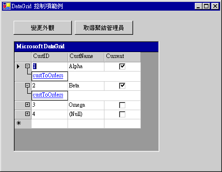

# DataGrid 控制項概觀 (Windows Form)
> [!NOTE]
>  <xref:System.Windows.Forms.DataGridView> 控制項會取代 <xref:System.Windows.Forms.DataGrid> 控制項並加入其他功能，不過您也可以選擇保留 <xref:System.Windows.Forms.DataGrid> 控制項，以提供回溯相容性及未來使用。 如需詳細資訊，請參閱 [Windows Forms DataGridView 和 DataGrid 控制項之間的差異](../../../../docs/framework/winforms/controls/differences-between-the-windows-forms-datagridview-and-datagrid-controls.md)。  
  
 Windows Form <xref:System.Windows.Forms.DataGrid> 控制項會在一連串的資料列和資料行中顯示資料。 最簡單的案例是，以沒有包含關聯性的單一資料表，將格線繫結至資料來源。 在此案例中，資料會出現在簡單的資料列和資料行中，就像在試算表中一樣。 如需將資料繫結至其他控制項的詳細資訊，請參閱[資料繫結和 Windows Forms](../../../../docs/framework/winforms/data-binding-and-windows-forms.md)。  
  
 如果以多個相關資料表將 <xref:System.Windows.Forms.DataGrid> 繫結至資料，以及如果格線上啟用巡覽，格線就會在每個資料列中顯示展開器。 使用展開器可讓使用者從父資料表移到子資料表。 按一下節點會顯示子資料表，按一下上一頁按鈕，就會顯示原始的父資料表。 格線會以這種方式來顯示資料表之間的階層式關聯性。  
  
 下列螢幕擷取畫面顯示以多個資料表繫結至資料的 DataGrid。  
  
   
繫結至具有多個資料表之資料的 DataGrid  
  
  <xref:System.Windows.Forms.DataGrid> 可以提供資料集的使用者介面、相關資料表之間的巡覽，以及豐富的格式化和編輯功能。  
  
 顯示和操作資料是不同的功能：這個控制項負責使用者介面，而 Windows Form 資料繫結架構與處理資料更新[!INCLUDE[dnprdnshort](../../../../includes/dnprdnshort-md.md)]資料提供者。 因此，繫結至相同的資料來源的多個控制項將保持同步。  
  
> [!NOTE]
>  如果您熟悉 Visual Basic 6.0 中的 DataGrid 控制項，您會在 Windows Form <xref:System.Windows.Forms.DataGrid> 控制項中發現一些顯著的差異。  
  
 當格線繫結至 <xref:System.Data.DataSet> 時，會自動建立、格式化並填滿資料行和資料列。 如需詳細資訊，請參閱 [Data Binding and Windows Forms](../../../../docs/framework/winforms/data-binding-and-windows-forms.md)。 遵循 <xref:System.Windows.Forms.DataGrid> 控制項的產生，您可以依據您的需求來加入、刪除、重新排列及格式化資料行和資料列。  
  
## 將資料繫結至控制項  
 為了讓 <xref:System.Windows.Forms.DataGrid> 控制項運作，應在設計階段使用 <xref:System.Windows.Forms.DataGrid.DataSource%2A> 和 <xref:System.Windows.Forms.DataGrid.DataMember%2A> 屬性，或在執行階段使用 <xref:System.Windows.Forms.DataGrid.SetDataBinding%2A> 方法，將其繫結至資料來源。 此繫結會將 <xref:System.Windows.Forms.DataGrid> 指向具現化的資料來源物件，例如 <xref:System.Data.DataSet> 或 <xref:System.Data.DataTable>)。 <xref:System.Windows.Forms.DataGrid> 控制項會顯示在資料上執行之動作的結果。 大部分資料特定動作都不是透過 <xref:System.Windows.Forms.DataGrid> 來執行，而是透過資料來源。  
  
 如果透過任何機制將繫結資料集中的資料更新， <xref:System.Windows.Forms.DataGrid> 控制項會反映那些變更。 如果資料格及其資料表樣式和資料行樣式`ReadOnly`屬性設定為`false`，可以透過更新資料集內的<xref:System.Windows.Forms.DataGrid>控制項。  
  
 在 <xref:System.Windows.Forms.DataGrid> 中，一次只能顯示一個資料表。 如果資料表之間有定義父子關聯性，則使用者可以在相關的資料表之間移動，以選取要顯示在 <xref:System.Windows.Forms.DataGrid> 控制項中的資料表。 如需有關繫結資訊<xref:System.Windows.Forms.DataGrid>若要控制[!INCLUDE[vstecado](../../../../includes/vstecado-md.md)]資料來源在設計階段或執行的階段，請參閱[How to:將 Windows Forms DataGrid 控制項繫結至資料來源](../../../../docs/framework/winforms/controls/how-to-bind-the-windows-forms-datagrid-control-to-a-data-source.md)。  
  
 <xref:System.Windows.Forms.DataGrid> 的有效資料來源包括：  
  
-   <xref:System.Data.DataTable> 類別  
  
-   <xref:System.Data.DataView> 類別  
  
-   <xref:System.Data.DataSet> 類別  
  
-   <xref:System.Data.DataViewManager> 類別  
  
 如果您的來源是資料集，資料集可能是表單中的物件，或是由 XML Web 服務傳遞至表單的物件。 您可以繫結至具類型資料集或不具類型的資料集。  
  
 如果結構 (例如陣列中的項目) 中的物件公開公用屬性，您也可以將 <xref:System.Windows.Forms.DataGrid> 控制項繫結至其他結構。 格線會將項目的所有公用屬性顯示在結構中。 例如，如果您將 <xref:System.Windows.Forms.DataGrid> 控制項繫結至客戶物件的陣列，此格線會顯示這些客戶物件的所有公用屬性。 在某些案例中，這表示雖然您可以繫結至結構，但是所產生的繫結結構可能沒有實際的應用程式。 例如，您可以繫結至整數陣列，但是因為 `Integer` 資料類型不支援公用屬性，所以格線無法顯示任何資料。  
  
 如果下列結構的項目公開公用屬性，您就可以繫結至這些結構：  
  
-   實作 <xref:System.Collections.IList> 介面的任何元件。 這包括一維陣列。  
  
-   實作 <xref:System.ComponentModel.IListSource> 介面的任何元件。  
  
-   實作 <xref:System.ComponentModel.IBindingList> 介面的任何元件。  
  
 如需可能資料來源的詳細資訊，請參閱 [Windows Forms 支援的資料來源](../../../../docs/framework/winforms/data-sources-supported-by-windows-forms.md)。  
  
## 格線顯示  
 <xref:System.Windows.Forms.DataGrid> 控制項有一種常見用法，是顯示資料集中單一資料表的資料。 不過，此控制項也可以用來顯示多個資料表，包括相關的資料表。 格線的顯示方式會根據資料來源自動調整。 下表顯示各種組態的顯示內容。  
  
|資料集的內容|顯示的內容|  
|--------------------------|-----------------------|  
|單一資料表。|資料表會顯示在格線中。|  
|多個資料表。|格線可以顯示樹狀檢視，讓使用者能夠巡覽，以尋找他們想要顯示的資料表。|  
|多個相關的資料表。|格線可以顯示用來選取資料表的樹狀檢視，或者您可以指定格線顯示父資料表。 父資料表中的記錄可讓使用者巡覽至相關的子資料列。|  
  
> [!NOTE]
> 資料集中的資料表會使用 <xref:System.Data.DataRelation> 來建立關聯。 另請參閱[建立資料集之間的關聯性](/visualstudio/data-tools/relationships-in-datasets)。
  
 當 <xref:System.Windows.Forms.DataGrid> 控制項顯示資料表，且 <xref:System.Windows.Forms.DataGrid.AllowSorting%2A> 屬性設為 `true` 時，按一下資料行標頭，即可重新排序資料。 使用者也可以加入資料列以及編輯儲存格。  
  
 一組資料表之間的關聯性，會以巡覽的父/子結構向使用者顯示。 父資料表是資料的最高層級，而子資料表是從父資料表中的個別清單衍生的那些資料表。 包含子資料表的每個父資料列中，都會顯示展開器。 按一下展開器，就會產生類似網頁的子資料表連結清單。 當使用者選取連結時，就會顯示子資料表。 按一下顯示/隱藏父資料列圖示 ()，將會隱藏父資料表的相關資訊，如果使用者先前已將其隱藏，則會使其重新顯示。 使用者可以按一下上一頁按鈕，以回到先前檢視的資料表。  
  
## 資料行和資料列  
 <xref:System.Windows.Forms.DataGrid> 是由 <xref:System.Windows.Forms.DataGridTableStyle> 物件的集合所組成，這些物件包含在 <xref:System.Windows.Forms.DataGrid> 控制項的 <xref:System.Windows.Forms.DataGrid.TableStyles%2A> 屬性中。 資料表樣式可能包含 <xref:System.Windows.Forms.DataGridColumnStyle> 物件的集合，這些物件包含在 <xref:System.Windows.Forms.DataGridTableStyle> 的 <xref:System.Windows.Forms.DataGridTableStyle.GridColumnStyles%2A> 屬性中。 您可以編輯<xref:System.Windows.Forms.DataGrid.TableStyles%2A>並<xref:System.Windows.Forms.DataGridTableStyle.GridColumnStyles%2A>屬性使用透過存取的集合編輯器**屬性**視窗。  
  
 與 <xref:System.Windows.Forms.DataGrid> 控制項相關聯的任何 <xref:System.Windows.Forms.DataGridTableStyle>，都可以透過 <xref:System.Windows.Forms.GridTableStylesCollection> 來存取。 <xref:System.Windows.Forms.GridTableStylesCollection> 可以在具有 <xref:System.Windows.Forms.DataGridTableStyle> 集合編輯器的設計工具中編輯，或是透過 <xref:System.Windows.Forms.DataGrid> 控制項的 <xref:System.Windows.Forms.DataGrid.TableStyles%2A> 屬性，以程式設計方式編輯。  
  
   
下圖顯示 DataGrid 控制項中所包含的物件。  
  
 若要將資料表樣式和資料行樣式與 <xref:System.Data.DataTable> 物件和 <xref:System.Data.DataColumn> 物件同步處理，可以將其 `MappingName` 屬性設為適當的 <xref:System.Data.DataTable.TableName%2A> 和 <xref:System.Data.DataColumn.ColumnName%2A> 屬性。 將沒有任何資料行樣式的 <xref:System.Windows.Forms.DataGridTableStyle>，加入繫結至有效資料來源的 <xref:System.Windows.Forms.DataGrid> 控制項，且該資料表樣式的 <xref:System.Windows.Forms.DataGridTableStyle.MappingName%2A> 屬性設為有效的 <xref:System.Data.DataTable.TableName%2A> 屬性時，就會針對該資料表樣式建立 <xref:System.Windows.Forms.DataGridColumnStyle> 物件的集合。 針對在 <xref:System.Data.DataTable> 的 <xref:System.Data.DataTable.Columns%2A> 集合中找到的每個 <xref:System.Data.DataColumn>，會將對應的 <xref:System.Windows.Forms.DataGridColumnStyle> 加入 <xref:System.Windows.Forms.GridColumnStylesCollection> 中。 <xref:System.Windows.Forms.GridColumnStylesCollection> 可透過 <xref:System.Windows.Forms.DataGridTableStyle> 的 <xref:System.Windows.Forms.DataGridTableStyle.GridColumnStyles%2A> 屬性來存取。 若要在格線中加入或刪除資料行，可以在 <xref:System.Windows.Forms.GridColumnStylesCollection> 上使用 <xref:System.Windows.Forms.GridColumnStylesCollection.Add%2A> 或 <xref:System.Windows.Forms.GridColumnStylesCollection.Remove%2A> 方法。 如需詳細資訊，請參閱[＜How to：新增資料表和資料行以 Windows Forms DataGrid 控制項](../../../../docs/framework/winforms/controls/how-to-add-tables-and-columns-to-the-windows-forms-datagrid-control.md)和[How to:刪除或隱藏資料行中的 Windows Forms DataGrid 控制項](../../../../docs/framework/winforms/controls/how-to-delete-or-hide-columns-in-the-windows-forms-datagrid-control.md)。  
  
 資料行類型的集合可以用擴充具有豐富格式化和編輯功能的 <xref:System.Windows.Forms.DataGridColumnStyle> 類別。 所有資料行類型皆繼承自 <xref:System.Windows.Forms.DataGridColumnStyle> 基底類別。 所建立的類別取決於 <xref:System.Data.DataColumn> 的 <xref:System.Data.DataColumn.DataType%2A> 屬性，其為 <xref:System.Web.UI.WebControls.DataGridColumn> 的基礎。 例如，將 <xref:System.Data.DataColumn.DataType%2A> 屬性設為 <xref:System.Boolean> 的 <xref:System.Data.DataColumn>，將會與 <xref:System.Windows.Forms.DataGridBoolColumn> 相關聯。 下表針對每個資料行類型進行說明。  
  
|資料行型別|描述|  
|-----------------|-----------------|  
|<xref:System.Windows.Forms.DataGridTextBoxColumn>|接受並顯示資料為格式化或未格式化的字串。 編輯功能與在簡單 <xref:System.Windows.Forms.TextBox> 中編輯資料時的功能相同。 繼承自 <xref:System.Windows.Forms.DataGridColumnStyle>。|  
|<xref:System.Windows.Forms.DataGridBoolColumn>|接受並顯示 `true`、`false` 和 null 值。 繼承自 <xref:System.Windows.Forms.DataGridColumnStyle>。|  
  
 按兩下資料行的右邊緣會調整資料行的大小，以顯示其完整的標題和最寬項目。  
  
## 資料表樣式和資料行樣式  
 建立 <xref:System.Windows.Forms.DataGrid> 控制項的預設格式之後，即可自訂當某些資料表顯示在資料格中時，所使用的色彩。  
  
 您可以建立 <xref:System.Windows.Forms.DataGridTableStyle> 類別的執行個體來達成此目的。 資料表樣式會指定特定資料表的格式，不同於 <xref:System.Windows.Forms.DataGrid> 控制項本身的預設格式。 每個資料表一次只能有一個為其定義的資料表樣式。  
  
 有時候，您會希望特定資料行的外觀，不同於特定資料表的其餘資料行。 您可以使用 <xref:System.Windows.Forms.DataGridTableStyle.GridColumnStyles%2A> 屬性來建立一組自訂的資料行樣式。  
  
 資料行樣式與資料集中的資料行相關，就像資料表樣式與資料表相關。 就像每個資料表一次只能有一個為其定義的資料表樣式，因此，在特定資料表樣式中，每個資料行也只能有一個為其定義的資料行樣式。 此關聯性定義在資料行的 <xref:System.Windows.Forms.DataGridColumnStyle.MappingName%2A> 屬性中。  
  
 如果您已經建立資料表樣式沒有資料行樣式加入至它，Visual Studio 將會加入預設資料行樣式，在執行階段建立表單和格線時。 不過，如果您已建立資料表樣式，並加入任何資料行樣式，Visual Studio 不會建立任何資料行樣式。 此外，您也需要定義資料行樣式，並為它們指派對應名稱，使您想要資料行出現在格線中。  
  
 因為您藉由指派資料行樣式給資料行，指定將哪些資料行內含在資料格中，但沒有任何資料行樣式已指派給資料行，所以您包含資料集中未顯示在格線內的資料行。 不過，因為資料行內含在資料集中，所以您可以用程式設計方式來編輯未顯示的資料。  
  
> [!NOTE]
>  一般而言，要先建立資料行樣式，並將其加入資料行樣式集合中，然後再將資料表樣式加入資料表樣式集合中。 當您將空的資料表樣式加入集合中時，會自動為您產生資料行樣式。 因此，如果您嘗試將具有重複 <xref:System.Windows.Forms.DataGridColumnStyle.MappingName%2A> 值的新資料行樣式加入資料行樣式集合，將會擲回例外狀況。  
>   
>  有時候，您會想要在許多資料行之間，只調整一個資料行；例如，資料集包含 50 個資料行，而您只想要其中 49 個。 在此情況下，將所有 50 個資料行匯入，再以程式設計方式移除其中一個，會比以程式設計方式，將 49 個您想要的資料行一一加入容易。  
  
## 格式化  
 可以套用至 <xref:System.Windows.Forms.DataGrid> 控制項的格式，包括框線樣式、格線樣式、字型、標題屬性、資料對齊，以及在資料列之間更改背景色彩。 如需詳細資訊，請參閱[＜How to：格式化 Windows Forms DataGrid 控制項](../../../../docs/framework/winforms/controls/how-to-format-the-windows-forms-datagrid-control.md)。  
  
## 事件  
 除了 <xref:System.Windows.Forms.Control.MouseDown>、<xref:System.Windows.Forms.Control.Enter> 和 <xref:System.Windows.Forms.DataGrid.Scroll> 之類的一般控制項事件，<xref:System.Windows.Forms.DataGrid> 控制項還可支援在格線內編輯和巡覽的相關聯事件。 <xref:System.Windows.Forms.DataGrid.CurrentCell%2A> 屬性會決定選取哪一個儲存格。 當使用者巡覽至新的儲存格時，會引發 <xref:System.Windows.Forms.DataGrid.CurrentCellChanged> 事件。 當使用者透過父/子關聯性，巡覽至新的資料表時，會引發 <xref:System.Windows.Forms.DataGrid.Navigate> 事件。 如果使用者在檢視子資料表時按一下上一頁按鈕，會引發 <xref:System.Windows.Forms.DataGrid.BackButtonClick> 事件，按一下顯示/隱藏父資料列圖示時，會引發 <xref:System.Windows.Forms.DataGrid.ShowParentDetailsButtonClick> 事件。  
  
## 另請參閱
- [DataGrid 控制項](../../../../docs/framework/winforms/controls/datagrid-control-windows-forms.md)
- [如何：將 Windows Forms DataGrid 控制項繫結至資料來源](../../../../docs/framework/winforms/controls/how-to-bind-the-windows-forms-datagrid-control-to-a-data-source.md)
- [如何：將資料表和資料行新增至 Windows Forms DataGrid 控制項](../../../../docs/framework/winforms/controls/how-to-add-tables-and-columns-to-the-windows-forms-datagrid-control.md)
- [如何：刪除或隱藏 Windows Forms DataGrid 控制項中的資料行](../../../../docs/framework/winforms/controls/how-to-delete-or-hide-columns-in-the-windows-forms-datagrid-control.md)
- [如何：格式化 Windows Forms DataGrid 控制項](../../../../docs/framework/winforms/controls/how-to-format-the-windows-forms-datagrid-control.md)
