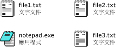

# <a name="how-to-enable-tile-view-in-a-windows-forms-listview-control"></a>如何：在 Windows Forms ListView 控制項中啟用並排顯示
使用的 <xref:System.Windows.Forms.ListView> 控制項的並排顯示檢視功能，您可以提供圖形和文字資訊之間的視覺化平衡。 並排顯示檢視中針對項目顯示的文字資訊與詳細資料檢視所定義的資料行資訊相同。 並排顯示檢視與 <xref:System.Windows.Forms.ListView> 控制項中的群組或插入標記功能相配合。  
  
 並排顯示檢視會使用 32 x 32 像素圖示和數行的文字，如下列影像所示。  
  
   
並排顯示的圖示和文字  
  
 若要啟用並排顯示檢視，請將 <xref:System.Windows.Forms.ListView.View%2A> 屬性設定為 <xref:System.Windows.Forms.View.Tile>。 您可以藉由設定 <xref:System.Windows.Forms.ListView.TileSize%2A> 屬性調整並排顯示的大小，並藉由調整 <xref:System.Windows.Forms.ListView.Columns%2A> 集合來調整並排顯示中顯示的文字行數。  
  
> [!NOTE]
>  並排顯示檢視是僅在您的應用程式呼叫 <xref:System.Windows.Forms.Application.EnableVisualStyles%2A?displayProperty=nameWithType> 方法時適用於 [!INCLUDE[WinXpFamily](../../../../includes/winxpfamily-md.md)] 上。 在舊版作業系統中，任何與並排顯示檢視相關的程式碼都無效，而且 <xref:System.Windows.Forms.ListView> 控制項會顯示在大圖示檢視中。 如需詳細資訊，請參閱<xref:System.Windows.Forms.ListView.View%2A?displayProperty=nameWithType>。  
  
### <a name="to-set-tile-view-programmatically"></a>以程式設計方式設定並排顯示檢視  
  
1.  使用 <xref:System.Windows.Forms.ListView> 控制項的 <xref:System.Windows.Forms.View> 的列舉。  
  
    ```vb  
    ListView1.View = View.Tile  
    ```  
  
    ```csharp  
    listView1.View = View.Tile;  
    ```  
  
## <a name="example"></a>範例  
 下列完整的程式碼範例示範並排顯示檢視，並修改為可顯示三行文字。 已經調整並排顯示大小以避免自動換行。  
  
 [!code-cpp[System.Windows.Forms.ListView.Tiling#1](../../../../samples/snippets/cpp/VS_Snippets_Winforms/System.Windows.Forms.ListView.Tiling/CPP/listviewtilingexample.cpp#1)]
 [!code-csharp[System.Windows.Forms.ListView.Tiling#1](../../../../samples/snippets/csharp/VS_Snippets_Winforms/System.Windows.Forms.ListView.Tiling/CS/listviewtilingexample.cs#1)]
 [!code-vb[System.Windows.Forms.ListView.Tiling#1](../../../../samples/snippets/visualbasic/VS_Snippets_Winforms/System.Windows.Forms.ListView.Tiling/VB/listviewtilingexample.vb#1)]  
  
## <a name="compiling-the-code"></a>編譯程式碼  
 這個範例需要：  
  
-   System 和 System.Windows.Forms 組件的參考。  
  
-   名為 book.ico 的圖示檔，位於與可執行檔相同的目錄中。  
  
 如需從 [!INCLUDE[vbprvb](../../../../includes/vbprvb-md.md)] 或 [!INCLUDE[csprcs](../../../../includes/csprcs-md.md)] 的命令列建置這個範例的資訊，請參閱[從命令列建置](~/docs/visual-basic/reference/command-line-compiler/building-from-the-command-line.md)或[使用 csc.exe 建置命令列](~/docs/csharp/language-reference/compiler-options/command-line-building-with-csc-exe.md)。 您也可以將程式碼貼在新的專案中，以在 [!INCLUDE[vsprvs](../../../../includes/vsprvs-md.md)] 中建置這個範例。  另請參閱 [如何：使用 Visual Studio 編譯及執行完整的 Windows Form 程式碼範例](http://msdn.microsoft.com/library/Bb129228\(v=vs.110\))。  
  
## <a name="see-also"></a>請參閱  
 <xref:System.Windows.Forms.ListView>  
 <xref:System.Windows.Forms.ListView.TileSize%2A>  
 [ListView 控制項](../../../../docs/framework/winforms/controls/listview-control-windows-forms.md)  
 [ListView 控制項概觀](../../../../docs/framework/winforms/controls/listview-control-overview-windows-forms.md)  
 [Windows XP 功能和 Windows Forms 控制項](http://msdn.microsoft.com/library/bc7fab94-fce9-4bf1-a8ad-a5837c91c3c0)
