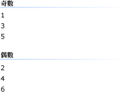

# HOW TO：使用設計工具將 Windows Forms ListView 控制項中的群組項目How to: Group Items in a Windows Forms ListView Control Using the Designer
分組功能<xref:System.Windows.Forms.ListView>控制項可讓您以群組顯示相關的項目集。The grouping feature of the <xref:System.Windows.Forms.ListView> control enables you to display related sets of items in groups. 這些群組是在螢幕上分隔包含群組標題的水平群組標頭。These groups are separated on the screen by horizontal group headers that contain the group titles. 您可以使用<xref:System.Windows.Forms.ListView>群組，使導覽更容易的大型清單依字母順序，分組項目，依日期，或任何其他的邏輯群組。You can use <xref:System.Windows.Forms.ListView> groups to make navigating large lists easier by grouping items alphabetically, by date, or by any other logical grouping. 下圖顯示一些分組的項目。The following image shows some grouped items.  
  
   
  
 下列程序需要**Windows 應用程式**表單，其中包含專案<xref:System.Windows.Forms.ListView>控制項。The following procedure requires a **Windows Application** project with a form containing a <xref:System.Windows.Forms.ListView> control. 如需這類專案的設定資訊，請參閱[How to:建立 Windows Forms 應用程式專案](/visualstudio/ide/step-1-create-a-windows-forms-application-project)和[How to:將控制項新增至 Windows Forms](how-to-add-controls-to-windows-forms.md)。For information about setting up such a project, see [How to: Create a Windows Forms application project](/visualstudio/ide/step-1-create-a-windows-forms-application-project) and [How to: Add Controls to Windows Forms](how-to-add-controls-to-windows-forms.md).  
  
 若要啟用群組，您必須先建立一或多個<xref:System.Windows.Forms.ListViewGroup>物件在設計工具或以程式設計的方式。To enable grouping, you must first create one or more <xref:System.Windows.Forms.ListViewGroup> objects either in the designer or programmatically. 一旦已定義的群組，您可以指派給它的項目。Once a group has been defined, you can assign items to it.  
  
> [!NOTE]
>  <xref:System.Windows.Forms.ListView> 群組是僅適用於[!INCLUDE[WinXpFamily](../../../../includes/winxpfamily-md.md)]當您的應用程式呼叫<xref:System.Windows.Forms.Application.EnableVisualStyles%2A?displayProperty=nameWithType>方法。<xref:System.Windows.Forms.ListView> groups are available only on [!INCLUDE[WinXpFamily](../../../../includes/winxpfamily-md.md)] when your application calls the <xref:System.Windows.Forms.Application.EnableVisualStyles%2A?displayProperty=nameWithType> method. 在舊版的作業系統，與群組相關的任何程式碼沒有任何作用，並不會出現群組。On earlier operating systems, any code relating to groups has no effect and the groups will not appear. 如需詳細資訊，請參閱<xref:System.Windows.Forms.ListView.Groups%2A?displayProperty=nameWithType>。For more information, see <xref:System.Windows.Forms.ListView.Groups%2A?displayProperty=nameWithType>.  
>   
>  根據您目前使用的設定或版本，您所看到的對話方塊與功能表命令可能會與 [說明] 中描述的不同。The dialog boxes and menu commands you see might differ from those described in Help depending on your active settings or edition. 若要變更設定，請從 [ **工具** ] 功能表中選取 [ **匯入和匯出設定** ]。To change your settings, choose **Import and Export Settings** on the **Tools** menu. 如需詳細資訊，請參閱[將 Visual Studio IDE 個人化](/visualstudio/ide/personalizing-the-visual-studio-ide)。For more information, see [Personalize the Visual Studio IDE](/visualstudio/ide/personalizing-the-visual-studio-ide).  
  
### 若要新增或移除群組，在設計工具To add or remove groups in the designer  
  
1.  在 [**屬性**] 視窗中，按一下**省略符號**() 下一步按鈕<xref:System.Windows.Forms.ListView.Groups%2A>屬性。In the **Properties** window, click the **Ellipsis** () button next to the <xref:System.Windows.Forms.ListView.Groups%2A> property.  
  
     **ListViewGroup 集合編輯器**隨即出現。The **ListViewGroup Collection Editor** appears.  
  
2.  若要新增的群組，請按一下**新增** 按鈕。To add a group, click the **Add** button. 您可以再設定屬性的新群組，例如<xref:System.Windows.Forms.ListViewGroup.Header%2A>和<xref:System.Windows.Forms.ListViewGroup.HeaderAlignment%2A>屬性。You can then set properties of the new group, such as the <xref:System.Windows.Forms.ListViewGroup.Header%2A> and <xref:System.Windows.Forms.ListViewGroup.HeaderAlignment%2A> properties. 若要移除群組，請選取它，然後按一下**移除** 按鈕。To remove a group, select it and click the **Remove** button.  
  
### 若要將項目指派給設計工具中的群組To assign items to groups in the designer  
  
1.  在 [**屬性**] 視窗中，按一下**省略符號**() 下一步按鈕<xref:System.Windows.Forms.ListView.Items%2A>屬性。In the **Properties** window, click the **Ellipsis** () button next to the <xref:System.Windows.Forms.ListView.Items%2A> property.  
  
     **ListViewItem 集合編輯器**隨即出現。The **ListViewItem Collection Editor** appears.  
  
2.  若要加入新項目，按一下**新增** 按鈕。To add a new item, click the **Add** button. 您可以再設定屬性的新的項目，例如<xref:System.Windows.Forms.ListViewItem.Text%2A>和<xref:System.Windows.Forms.ListViewItem.ImageIndex%2A>屬性。You can then set properties of the new item, such as the <xref:System.Windows.Forms.ListViewItem.Text%2A> and <xref:System.Windows.Forms.ListViewItem.ImageIndex%2A> properties.  
  
3.  選取<xref:System.Windows.Forms.ListViewItem.Group%2A>屬性，然後從下拉式清單中選擇 群組。Select the <xref:System.Windows.Forms.ListViewItem.Group%2A> property and choose a group from the drop-down list.  
  
## 另請參閱See also
- <xref:System.Windows.Forms.ListView>
- <xref:System.Windows.Forms.ListView.Groups%2A>
- <xref:System.Windows.Forms.ListViewGroup>
- [ListView 控制項ListView Control](listview-control-windows-forms.md)
- [ListView 控制項概觀ListView Control Overview](listview-control-overview-windows-forms.md)
- [如何：新增和移除項目，使用 Windows Forms ListView 控制項How to: Add and Remove Items with the Windows Forms ListView Control](how-to-add-and-remove-items-with-the-windows-forms-listview-control.md)
