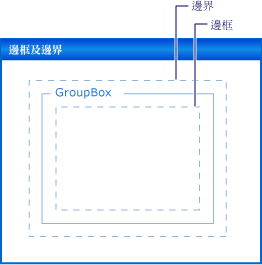

# 逐步解說：使用邊框距離、邊界和 AutoSize 屬性配置 Windows Form 控制項
對許多應用程式而言，控制項在表單上的精確位置是高優先順序。 **Windows Form 設計工具**提供您許多版面配置工具，來完成這項作業。 三個最重要的是<xref:System.Windows.Forms.Control.Margin%2A>， <xref:System.Windows.Forms.Control.Padding%2A>，和<xref:System.Windows.Forms.Control.AutoSize%2A>都存在於所有 Windows Form 控制項的屬性。  
  
 <xref:System.Windows.Forms.Control.Margin%2A> 屬性可定義控制項周圍的空間，使其他控制項與該控制項的邊框保持指定的距離。  
  
 <xref:System.Windows.Forms.Control.Padding%2A> 屬性可定義控制項的內部空間，使控制項的內容 (例如，其 <xref:System.Windows.Forms.Control.Text%2A> 屬性值) 與控制項的邊框保持指定的距離。  
  
 下圖顯示控制項上的 <xref:System.Windows.Forms.Control.Padding%2A> 和 <xref:System.Windows.Forms.Control.Margin%2A> 屬性。  
  
   
  
 <xref:System.Windows.Forms.Control.AutoSize%2A>屬性會告知自動本身自行調整大小，其內容的控制項。 它不會調整大小必須小於其原始值本身<xref:System.Windows.Forms.Control.Size%2A>屬性，然後它會負責處理的值及其<xref:System.Windows.Forms.Control.Padding%2A>屬性。  
  
 這個逐步解說中所述的工作包括：  
  
-   建立 Windows Forms 專案  
  
-   設定您的控制項的邊界  
  
-   設定您的控制項的邊框距離  
  
-   自動調整控制項大小  
  
 完成後，您就會了解這些重要配置功能所扮演的角色。  
  
> [!NOTE]
>  根據您目前使用的設定或版本，您所看到的對話方塊與功能表命令可能會與 [說明] 中描述的不同。 若要變更設定，請從 [ **工具** ] 功能表中選取 [ **匯入和匯出設定** ]。 如需詳細資訊，請參閱[將 Visual Studio IDE 個人化](/visualstudio/ide/personalizing-the-visual-studio-ide)。  
  
## 必要條件  
 若要完成這個逐步解說，您將需要：  
  
-   若要能夠建立和安裝 Visual Studio 的電腦上執行 Windows Form 應用程式專案有足夠的權限。  
  
## 建立專案  
 第一個步驟是建立專案並設定表單。  
  
#### 若要建立專案  
  
1.  建立**Windows 應用程式**專案，稱為`LayoutExample`。 如需詳細資訊，請參閱 <<c0> [ 如何： 建立 Windows 應用程式專案](https://msdn.microsoft.com/library/b2f93fed-c635-4705-8d0e-cf079a264efa)。  
  
2.  選取中的表單**Windows Form 設計工具**。  
  
## 設定您的控制項的邊界  
 您可以將預設的距離設定為您使用的控制項<xref:System.Windows.Forms.Control.Margin%2A>屬性。 當您移動控制項時接近另一個控制項，您會看到顯示兩個控制項的邊界的對齊線。 您要移動的控制項也會貼齊邊界所定義的距離。  
  
#### 若要排列使用 Margin 屬性在表單上的控制項  
  
1.  將兩個<xref:System.Windows.Forms.Button>控制項從**工具箱**拖曳至表單。  
  
2.  選取其中一個<xref:System.Windows.Forms.Button>控制，並移動接近另一個，直到幾乎碰觸。  
  
     觀察出現在它們之間的對齊線。 這個距離很的兩個控制項的總和<xref:System.Windows.Forms.Control.Margin%2A>值。 您要移動的控制項會貼齊至這個距離。 如需詳細資訊，請參閱 <<c0> [ 逐步解說： 在 Windows Form 使用對齊線排列的控制項](../../../../docs/framework/winforms/controls/walkthrough-arranging-controls-on-windows-forms-using-snaplines.md)。  
  
3.  變更<xref:System.Windows.Forms.Control.Margin%2A>屬性的其中一個方法是展開的控制項<xref:System.Windows.Forms.Control.Margin%2A>中的項目**屬性** 視窗和設定<xref:System.Windows.Forms.Padding.All%2A>屬性為 20。  
  
4.  選取其中一個<xref:System.Windows.Forms.Button>控制，並將它移到靠近其他。  
  
     對齊線定義邊界值的總和較長，而且從另一個控制項的控制項會貼齊至較大的距離。  
  
5.  變更<xref:System.Windows.Forms.Control.Margin%2A>藉由展開選取之控制項的屬性<xref:System.Windows.Forms.Control.Margin%2A>中的項目**屬性** 視窗和設定<xref:System.Windows.Forms.Padding.Top%2A>為 5 的屬性。  
  
6.  將其他控制項下方選取的控制項，並觀察對齊線是較短。 將選取的控制項移至其他控制項的左邊，並觀察對齊線會保留在步驟 4 中觀察到的值。  
  
7.  您可以設定每個層面<xref:System.Windows.Forms.Control.Margin%2A>屬性， <xref:System.Windows.Forms.Padding.Left%2A>， <xref:System.Windows.Forms.Padding.Top%2A>， <xref:System.Windows.Forms.Padding.Right%2A>， <xref:System.Windows.Forms.Padding.Bottom%2A>，以不同的值，或者您可以將它們設定為相同的值與所有<xref:System.Windows.Forms.Padding.All%2A>屬性。  
  
## 設定您的控制項的邊框距離  
 若要達成精確應用程式所需的版面配置，您的控制項通常會包含子控制項。 當您想要指定子控制項的框線的單字，至父控制項的框線時，使用父控制項的<xref:System.Windows.Forms.Control.Padding%2A>搭配子控制項的屬性<xref:System.Windows.Forms.Control.Margin%2A>屬性。 <xref:System.Windows.Forms.Control.Padding%2A>屬性也用來控制控制項內容的鄰近性 (例如<xref:System.Windows.Forms.Button>控制項的<xref:System.Windows.Forms.Control.Text%2A>屬性) 到其框線。  
  
#### 若要排列您使用的填補的表單上的控制項  
  
1.  拖曳<xref:System.Windows.Forms.Button>控制項從**工具箱**拖曳至表單。  
  
2.  變更 <xref:System.Windows.Forms.Button> 控制項的 <xref:System.Windows.Forms.Control.AutoSize%2A> 屬性值為 `true`。  
  
3.  變更<xref:System.Windows.Forms.Control.Padding%2A>藉由展開的屬性<xref:System.Windows.Forms.Control.Padding%2A>中的項目**屬性** 視窗和設定<xref:System.Windows.Forms.Padding.All%2A>為 5 的屬性。  
  
     控制項展開以提供新的邊框距離的空間。  
  
4.  拖曳<xref:System.Windows.Forms.GroupBox>控制項從**工具箱**拖曳至表單。 拖曳<xref:System.Windows.Forms.Button>控制項從**工具箱**成<xref:System.Windows.Forms.GroupBox>控制項。 位置<xref:System.Windows.Forms.Button>控制項讓它與右下角齊<xref:System.Windows.Forms.GroupBox>控制項。  
  
     觀察如下所示的對齊線<xref:System.Windows.Forms.Button>控制方法的下框線和右框線的<xref:System.Windows.Forms.GroupBox>控制項。 這些對齊線會對應至<xref:System.Windows.Forms.Control.Margin%2A>屬性<xref:System.Windows.Forms.Button>。  
  
5.  變更<xref:System.Windows.Forms.GroupBox>控制項的<xref:System.Windows.Forms.Control.Padding%2A>屬性來擴充<xref:System.Windows.Forms.Control.Padding%2A>中的項目**屬性**視窗和設定<xref:System.Windows.Forms.Padding.All%2A>屬性為 20。  
  
6.  選取 <xref:System.Windows.Forms.Button>控制項中<xref:System.Windows.Forms.GroupBox>控制項並將它移向的中央<xref:System.Windows.Forms.GroupBox>。  
  
     從的框線對齊線會出現在較大的距離<xref:System.Windows.Forms.GroupBox>控制項。 這個距離很總和<xref:System.Windows.Forms.Button>控制項的<xref:System.Windows.Forms.Control.Margin%2A>屬性並<xref:System.Windows.Forms.GroupBox>控制項的<xref:System.Windows.Forms.Control.Padding%2A>屬性。  
  
## 自動調整控制項大小  
 在某些應用程式，控制項的大小將不會相同執行階段是在設計階段。 文字<xref:System.Windows.Forms.Button>控制項，例如，可能會從資料庫中，並會事先知道它的長度。  
  
 當<xref:System.Windows.Forms.Control.AutoSize%2A>屬性設定為`true`，控制項將其內容調整本身。 如需詳細資訊，請參閱 < [AutoSize 屬性概觀](../../../../docs/framework/winforms/controls/autosize-property-overview.md)。  
  
#### 若要排列使用 AutoSize 屬性在表單上的控制項  
  
1.  拖曳<xref:System.Windows.Forms.Button>控制項從**工具箱**拖曳至表單。  
  
2.  變更 <xref:System.Windows.Forms.Button> 控制項的 <xref:System.Windows.Forms.Control.AutoSize%2A> 屬性值為 `true`。  
  
3.  變更<xref:System.Windows.Forms.Button>控制項的<xref:System.Windows.Forms.Control.Text%2A>屬性為"**此按鈕有其 Text 屬性一長串**。 」  
  
     當您認可變更，<xref:System.Windows.Forms.Button>控制項自動調整大小以容納新的文字。  
  
4.  將另一個<xref:System.Windows.Forms.Button>控制項從**工具箱**拖曳至表單。  
  
5.  變更<xref:System.Windows.Forms.Button>控制項的<xref:System.Windows.Forms.Control.Text%2A>屬性為"**此按鈕會有一長串其 Text 屬性。**"  
  
     當您認可變更，<xref:System.Windows.Forms.Button>控制項調整本身，都不大小和文字由控制項的右邊緣裁剪。  
  
6.  變更<xref:System.Windows.Forms.Control.Padding%2A>藉由展開的屬性<xref:System.Windows.Forms.Control.Padding%2A>中的項目**屬性** 視窗和設定<xref:System.Windows.Forms.Padding.All%2A>為 5 的屬性。  
  
     在控制項的內部文字會裁剪四個邊。  
  
7.  變更<xref:System.Windows.Forms.Button>控制項的<xref:System.Windows.Forms.Control.AutoSize%2A>屬性設`true`。  
  
     <xref:System.Windows.Forms.Button>控制項調整大小，以包含整個字串。 填補此外，新增該文字周圍，造成<xref:System.Windows.Forms.Button>展開所有 4 個方向的控制項。  
  
8.  拖曳<xref:System.Windows.Forms.Button>控制項從**工具箱**拖曳至表單。 請將它放置在表單的右下角附近。  
  
9. 變更 <xref:System.Windows.Forms.Button> 控制項的 <xref:System.Windows.Forms.Control.AutoSize%2A> 屬性值為 `true`。  
  
10. 設定<xref:System.Windows.Forms.Button>控制項的<xref:System.Windows.Forms.Control.Anchor%2A>屬性設<xref:System.Windows.Forms.AnchorStyles.Right>， <xref:System.Windows.Forms.AnchorStyles.Bottom>。  
  
11. 變更<xref:System.Windows.Forms.Button>控制項的<xref:System.Windows.Forms.Control.Text%2A>屬性為"**此按鈕會有一長串其 Text 屬性。**"  
  
     當您認可變更，<xref:System.Windows.Forms.Button>控制項調整其大小往左邊。 一般情況下，自動調整大小會增加在相反方向中控制項的大小及其<xref:System.Windows.Forms.Control.Anchor%2A>屬性設定。  
  
## AutoSize 和 AutoSizeMode 屬性  
 有些控制項支援`AutoSizeMode`屬性，可讓您進一步控制控制項的自動調整大小行為。  
  
#### 若要使用 AutoSizeMode 屬性  
  
1.  拖曳<xref:System.Windows.Forms.Panel>控制項從**工具箱**拖曳至表單。  
  
2.  設定的值<xref:System.Windows.Forms.Panel>控制項的<xref:System.Windows.Forms.Control.AutoSize%2A>屬性設`true`。  
  
3.  拖曳<xref:System.Windows.Forms.Button>控制項從**工具箱**成<xref:System.Windows.Forms.Panel>控制項。  
  
4.  地方<xref:System.Windows.Forms.Button>右下角附近的控制項<xref:System.Windows.Forms.Panel>控制項。  
  
5.  選取<xref:System.Windows.Forms.Panel>控制項，並抓取的右下角調整大小控點。 調整大小<xref:System.Windows.Forms.Panel>為較大且較小的控制項。  
  
    > [!NOTE]
    >  您可以自由地調整大小<xref:System.Windows.Forms.Panel>控制項，但是您無法將其大小小於位置<xref:System.Windows.Forms.Button>控制項的右下角。 此行為是預設值所指定的`AutoSizeMode`屬性，這是<xref:System.Windows.Forms.AutoSizeMode.GrowOnly>。  
  
6.  設定的值<xref:System.Windows.Forms.Panel>控制項的`AutoSizeMode`屬性設<xref:System.Windows.Forms.AutoSizeMode.GrowAndShrink>。  
  
     <xref:System.Windows.Forms.Panel>控制大小本身來括住<xref:System.Windows.Forms.Button>控制項。 您無法調整大小<xref:System.Windows.Forms.Panel>控制項。  
  
7.  拖曳<xref:System.Windows.Forms.Button>控制項左上角<xref:System.Windows.Forms.Panel>控制項。  
  
     <xref:System.Windows.Forms.Panel>控制項會調整大小以<xref:System.Windows.Forms.Button>控制項的新位置。  
  
## 後續步驟  
 有許多其他版面配置功能，用來排列 Windows Forms 應用程式中的控制項。 以下是一些您可以嘗試的組合：  
  
-   建置表單，使用<xref:System.Windows.Forms.TableLayoutPanel>控制項。 如需詳細資訊，請參閱 <<c0> [ 逐步解說： 在 Windows Forms Using a TableLayoutPanel 排列的控制項](../../../../docs/framework/winforms/controls/walkthrough-arranging-controls-on-windows-forms-using-a-tablelayoutpanel.md)。 請嘗試變更的值<xref:System.Windows.Forms.TableLayoutPanel>控制項的<xref:System.Windows.Forms.Control.Padding%2A>屬性，以及<xref:System.Windows.Forms.Control.Margin%2A>上它的子控制項的屬性。  
  
-   請嘗試相同的實驗使用<xref:System.Windows.Forms.FlowLayoutPanel>控制項。 如需詳細資訊，請參閱 <<c0> [ 逐步解說： 在 Windows Form 使用 FlowLayoutPanel 排列的控制項](../../../../docs/framework/winforms/controls/walkthrough-arranging-controls-on-windows-forms-using-a-flowlayoutpanel.md)。  
  
-   實驗中的子控制項的停駐<xref:System.Windows.Forms.Panel>控制項。 <xref:System.Windows.Forms.Control.Padding%2A>值的較通用實現<xref:System.Windows.Forms.ScrollableControl.DockPadding%2A>屬性，而且可以滿足您自己，是藉由將子控制項置於<xref:System.Windows.Forms.Panel>控制項，並設定子控制項的<xref:System.Windows.Forms.Control.Dock%2A>屬性<xref:System.Windows.Forms.DockStyle.Fill>. 設定<xref:System.Windows.Forms.Panel>控制項的<xref:System.Windows.Forms.Control.Padding%2A>屬性，以不同的值和附註的效果。  
  
## 另請參閱  
 <xref:System.Windows.Forms.Control.AutoSize%2A>  
 <xref:System.Windows.Forms.ScrollableControl.DockPadding%2A>  
 <xref:System.Windows.Forms.Control.Margin%2A>  
 <xref:System.Windows.Forms.Control.Padding%2A>  
 [AutoSize 屬性概觀](../../../../docs/framework/winforms/controls/autosize-property-overview.md)  
 [逐步解說：使用 TableLayoutPanel 排列 Windows Forms 上的控制項](../../../../docs/framework/winforms/controls/walkthrough-arranging-controls-on-windows-forms-using-a-tablelayoutpanel.md)  
 [逐步解說：使用 FlowLayoutPanel 排列 Windows Forms上的控制項](../../../../docs/framework/winforms/controls/walkthrough-arranging-controls-on-windows-forms-using-a-flowlayoutpanel.md)  
 [逐步解說：使用對齊線排列 Windows Forms 上的控制項](../../../../docs/framework/winforms/controls/walkthrough-arranging-controls-on-windows-forms-using-snaplines.md)
