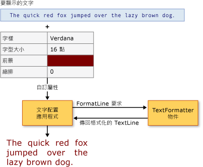

# 進階文字格式化
Windows Presentation Foundation (WPF) 提供一組強固的[!INCLUDE[TLA#tla_api#plural](../../../../includes/tlasharptla-apisharpplural-md.md)]在您的應用程式中包含文字。 版面配置和[!INCLUDE[TLA#tla_ui](../../../../includes/tlasharptla-ui-md.md)] [!INCLUDE[TLA2#tla_api#plural](../../../../includes/tla2sharptla-apisharpplural-md.md)]，例如<xref:System.Windows.Controls.TextBlock>、 提供最常見和一般使用的文字表示的項目。 繪製[!INCLUDE[TLA2#tla_api#plural](../../../../includes/tla2sharptla-apisharpplural-md.md)]，例如<xref:System.Windows.Media.GlyphRunDrawing>和<xref:System.Windows.Media.FormattedText>，提供一種機制，在 繪圖中包含格式化的文字。 在最進階級[!INCLUDE[TLA2#tla_wpf](../../../../includes/tla2sharptla-wpf-md.md)]提供可延伸的文字格式設定引擎來控制每個層面的文字表示，例如文字存放區管理、 執行文字格式設定管理，以及內嵌的物件管理。  
  
 本主題提供簡介[!INCLUDE[TLA2#tla_wpf](../../../../includes/tla2sharptla-wpf-md.md)]文字格式設定。 它著重在用戶端實作及使用[!INCLUDE[TLA2#tla_wpf](../../../../includes/tla2sharptla-wpf-md.md)]文字格式設定引擎。  
  
> [!NOTE]
>  此文件中的所有程式碼範例可以在[進階文字格式範例](http://go.microsoft.com/fwlink/?LinkID=159965)。  
  

  
   
## 必要條件  
 本主題假設您已熟悉高的層級[!INCLUDE[TLA2#tla_api#plural](../../../../includes/tla2sharptla-apisharpplural-md.md)]用於文字的呈現。 大部分使用者案例不需要進階的文字格式[!INCLUDE[TLA2#tla_api#plural](../../../../includes/tla2sharptla-apisharpplural-md.md)]本主題中討論。 如需不同的文字的介紹[!INCLUDE[TLA2#tla_api#plural](../../../../includes/tla2sharptla-apisharpplural-md.md)]，請參閱[WPF 中文件](../../../../docs/framework/wpf/advanced/documents-in-wpf.md)。  
  
   
## 進階文字格式化  
 文字版面配置和[!INCLUDE[TLA2#tla_ui](../../../../includes/tla2sharptla-ui-md.md)]控制項[!INCLUDE[TLA2#tla_wpf](../../../../includes/tla2sharptla-wpf-md.md)]提供可讓您輕鬆地在應用程式中包含格式化的文字格式設定屬性。 這些控制項會公開一些屬性來處理文字的呈現方式，包括其字體、大小和色彩。 在一般情況下，這些控制項可以處理您應用程式中大部分的文字呈現。 不過，某些進階的情節需要控制文字儲存以及文字呈現。 [!INCLUDE[TLA2#tla_wpf](../../../../includes/tla2sharptla-wpf-md.md)] 針對這個用途提供可延伸的文字格式設定引擎。  
  
 格式化功能的進階的文字中找到[!INCLUDE[TLA2#tla_wpf](../../../../includes/tla2sharptla-wpf-md.md)]組成的文字格式設定引擎、 文字往返的文字存放區和格式化屬性。 文字格式設定引擎， <xref:System.Windows.Media.TextFormatting.TextFormatter>，建立要用來呈現的文字行。 這起始行格式化的過程，和呼叫的文字格式器所達成<xref:System.Windows.Media.TextFormatting.TextFormatter.FormatLine%2A>。 文字格式子的呼叫的存放區從您的文字存放區擷取文字往返<xref:System.Windows.Media.TextFormatting.TextSource.GetTextRun%2A>方法。 <xref:System.Windows.Media.TextFormatting.TextRun>物件然後形成<xref:System.Windows.Media.TextFormatting.TextLine>文字格式子的物件，且提供給您的應用程式用來檢查或顯示。  
  
   
## 使用文字格式子  
 <xref:System.Windows.Media.TextFormatting.TextFormatter> 是[!INCLUDE[TLA2#tla_wpf](../../../../includes/tla2sharptla-wpf-md.md)]文字格式設定引擎，並提供服務的格式和分隔文字行。 文字格式子可處理不同的文字字元格式和段落樣式，且包含國際文字版面配置的支援。  
  
 不同於傳統文字[!INCLUDE[TLA#tla_api](../../../../includes/tlasharptla-api-md.md)]、<xref:System.Windows.Media.TextFormatting.TextFormatter>與透過回呼方法的一組文字配置用戶端互動。 它需要用戶端提供這些方法的實作中<xref:System.Windows.Media.TextFormatting.TextSource>類別。 下圖說明文字版面配置之間互動的用戶端應用程式和<xref:System.Windows.Media.TextFormatting.TextFormatter>。  
  
   
應用程式和 TextFormatter 之間的互動  
  
 文字格式器用來擷取格式化的文字行從文字存放區中，這是實作<xref:System.Windows.Media.TextFormatting.TextSource>。 這樣做，第一個建立的文字格式器執行個體使用<xref:System.Windows.Media.TextFormatting.TextFormatter.Create%2A>方法。 這個方法會建立文字格式子的執行個體，並設定最大線條高度和寬度的值。 一旦建立文字格式器的執行個體時，啟動列的建立程序呼叫<xref:System.Windows.Media.TextFormatting.TextFormatter.FormatLine%2A>方法。 <xref:System.Windows.Media.TextFormatting.TextFormatter> 回撥到擷取的文字和格式設定參數的文字執行的文字來源該表單一條線。  
  
 在下列範例中，會顯示格式設定文字存放區的程序。 <xref:System.Windows.Media.TextFormatting.TextFormatter>物件用來將文字存放區擷取文字行，然後再格式化成繪製的文字行<xref:System.Windows.Media.DrawingContext>。  
  
 [!code-csharp[TextFormatterExample#100](../../../../samples/snippets/csharp/VS_Snippets_Wpf/TextFormatterExample/CSharp/Window1.xaml.cs#100)]
 [!code-vb[TextFormatterExample#100](../../../../samples/snippets/visualbasic/VS_Snippets_Wpf/TextFormatterExample/VisualBasic/Window1.xaml.vb#100)]  
  
   
## 實作用戶端文字存放區  
 當您延伸文字格式設定引擎時，您必須實作與管理文字存放區的所有層面。 這不是簡單的工作。 文字存放區負責追蹤文字執行屬性、段落屬性、內嵌的物件，以及其他類似的內容。 它也提供個別文字格式子<xref:System.Windows.Media.TextFormatting.TextRun>文字格式器會使用來建立物件<xref:System.Windows.Media.TextFormatting.TextLine>物件。  
  
 若要處理的文字存放區的虛擬化，文字存放區必須衍生自<xref:System.Windows.Media.TextFormatting.TextSource>。 <xref:System.Windows.Media.TextFormatting.TextSource> 定義用來將文字存放區擷取文字往返的文字格式子的方法。 <xref:System.Windows.Media.TextFormatting.TextSource.GetTextRun%2A> 是用來擷取文字的文字格式器方法會執行，用於線條格式。 若要呼叫<xref:System.Windows.Media.TextFormatting.TextSource.GetTextRun%2A>重複會由文字格式器到發生以下條件之一為止：  
  
-   A<xref:System.Windows.Media.TextFormatting.TextEndOfLine>或子類別會傳回。  
  
-   文字往返的累積的寬度超過任一建立文字格式子的呼叫或文字格式子的呼叫中指定的最大線條寬度<xref:System.Windows.Media.TextFormatting.TextFormatter.FormatLine%2A>方法。  
  
-   A[!INCLUDE[TLA#tla_unicode](../../../../includes/tlasharptla-unicode-md.md)]新行字元序列，例如"CF"、"LF"或"CRLF"，就會傳回。  
  
   
## 提供文字執行  
 文字格式設定程序的核心是文字格式子與文字存放區之間的互動。 實作<xref:System.Windows.Media.TextFormatting.TextSource>提供文字格式器與<xref:System.Windows.Media.TextFormatting.TextRun>物件以及用來格式化文字往返的屬性。 這個互動由<xref:System.Windows.Media.TextFormatting.TextSource.GetTextRun%2A>文字格式器所呼叫的方法。  
  
 下表顯示一些預先定義之<xref:System.Windows.Media.TextFormatting.TextRun>物件。  
  
|TextRun 類型|使用量|  
|------------------|-----------|  
|<xref:System.Windows.Media.TextFormatting.TextCharacters>|用來將字元圖像 (glyph) 的表示法傳回文字格式子的特殊文字執行。|  
|<xref:System.Windows.Media.TextFormatting.TextEmbeddedObject>|用來提供內容的特殊文字執行，在這些內容中會整體進行測量、點擊測試和繪製，例如文字內的按鈕或影像。|  
|<xref:System.Windows.Media.TextFormatting.TextEndOfLine>|用來標記行尾的特殊文字執行。|  
|<xref:System.Windows.Media.TextFormatting.TextEndOfParagraph>|用來標記段落結尾的特殊文字執行。|  
|<xref:System.Windows.Media.TextFormatting.TextEndOfSegment>|用來結束先前受影響的範圍，例如標記在區段中，結尾的特定的文字執行<xref:System.Windows.Media.TextFormatting.TextModifier>執行。|  
|<xref:System.Windows.Media.TextFormatting.TextHidden>|用來標記隱藏字元範圍的特殊文字執行。|  
|<xref:System.Windows.Media.TextFormatting.TextModifier>|用來在文字執行範圍中修改其屬性的特殊文字執行。 範圍會延伸到下一個符合<xref:System.Windows.Media.TextFormatting.TextEndOfSegment>文字執行或在下一個<xref:System.Windows.Media.TextFormatting.TextEndOfParagraph>。|  
  
 預先定義的任何<xref:System.Windows.Media.TextFormatting.TextRun>物件可以進行子類別化。 這可讓文字來源提供文字格式子包含自訂資料的文字執行。  
  
 下列範例會示範<xref:System.Windows.Media.TextFormatting.TextSource.GetTextRun%2A>方法。 此文字存放區傳回<xref:System.Windows.Media.TextFormatting.TextRun>要處理的文字格式子物件。  
  
 [!code-csharp[TextFormatterExample#101](../../../../samples/snippets/csharp/VS_Snippets_Wpf/TextFormatterExample/CSharp/CustomTextSource.cs#101)]
 [!code-vb[TextFormatterExample#101](../../../../samples/snippets/visualbasic/VS_Snippets_Wpf/TextFormatterExample/VisualBasic/CustomTextSource.vb#101)]  
  
> [!NOTE]
>  在此範例中，文字存放區提供相同的文字屬性給所有文字。 進階的文字存放區必須實作自己的範圍管理，以允許個別字元可以有不同的屬性。  
  
   
## 指定格式設定屬性  
 <xref:System.Windows.Media.TextFormatting.TextRun> 物件使用來格式化的文字存放區所提供的屬性。 這些屬性有兩種類型，<xref:System.Windows.Media.TextFormatting.TextParagraphProperties>和<xref:System.Windows.Media.TextFormatting.TextRunProperties>。 <xref:System.Windows.Media.TextFormatting.TextParagraphProperties> 處理段落 （含） 的屬性，例如<xref:System.Windows.TextAlignment>和<xref:System.Windows.FlowDirection>。 <xref:System.Windows.Media.TextFormatting.TextRunProperties> 是可以執行例如前景筆刷，段落中的每個文字不同的屬性<xref:System.Windows.Media.Typeface>，和字型大小。 若要實作自訂的段落，並執行屬性類型的自訂文字，您的應用程式必須建立衍生自的<xref:System.Windows.Media.TextFormatting.TextParagraphProperties>和<xref:System.Windows.Media.TextFormatting.TextRunProperties>分別。  
  
## 另請參閱  
 [WPF 中的印刷樣式](../../../../docs/framework/wpf/advanced/typography-in-wpf.md)  
 [WPF 中的文件](../../../../docs/framework/wpf/advanced/documents-in-wpf.md)
