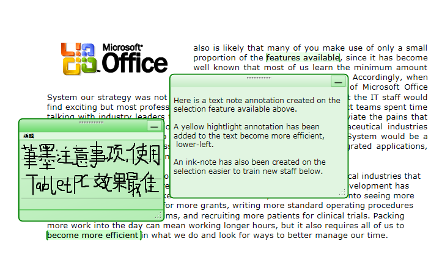
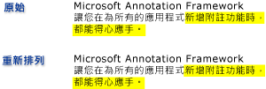

# 附註概觀
在書面文件上撰寫附註或註解是相當稀鬆平常的事，我們幾乎將它視為理所當然。 這些附註或註解是我們新增至文件的「註釋」，用以標記資訊，或反白顯示感興趣的項目以供日後參考。 雖然在書面文件上撰寫附註很容易且平常，不過在電子文件中新增個人註解的功能通常非常有限，如果有的話。  
  
 本主題會檢閱數個常見的註解，特別是自黏便箋和反白顯示，並說明如何[!INCLUDE[TLA#tla_caf](../../../../includes/tlasharptla-caf-md.md)]有助於進行這些類型的應用程式可以透過 Windows Presentation Foundation (WPF) 文件中的註解檢視控制項。  [!INCLUDE[TLA2#tla_wpf](../../../../includes/tla2sharptla-wpf-md.md)] 支援註解的文件檢視控制項包括<xref:System.Windows.Controls.FlowDocumentReader>和<xref:System.Windows.Controls.FlowDocumentScrollViewer>，以及控制項衍生自<xref:System.Windows.Controls.Primitives.DocumentViewerBase>例如<xref:System.Windows.Controls.DocumentViewer>和<xref:System.Windows.Controls.FlowDocumentPageViewer>。  
  
  
   
## 自黏便箋  
 典型的自黏便箋包含寫在一小張色紙上，然後「黏」在文件上的資訊。 數位自黏便箋為電子文件提供類似的功能，但新增了彈性，可以包含許多其他類型的內容，例如輸入的文字、手寫便箋 (比方說，[!INCLUDE[TLA#tla_tpc](../../../../includes/tlasharptla-tpc-md.md)]「筆跡」筆劃)，或 Web 連結。  
  
 下圖顯示一些反白顯示、文字自黏便箋和筆跡自黏便箋註釋的範例。  
  
   
  
 下列範例顯示您可用來在應用程式中啟用註釋支援的方法。  
  
 [!code-csharp[DocViewerAnnotationsXml#DocViewXmlStartAnnotations](../../../../samples/snippets/csharp/VS_Snippets_Wpf/DocViewerAnnotationsXml/CSharp/Window1.xaml.cs#docviewxmlstartannotations)]
 [!code-vb[DocViewerAnnotationsXml#DocViewXmlStartAnnotations](../../../../samples/snippets/visualbasic/VS_Snippets_Wpf/DocViewerAnnotationsXml/visualbasic/window1.xaml.vb#docviewxmlstartannotations)]  
  
   
## 反白顯示  
 人們使用有創意的方法，在標記書面文件時將注意力吸引到感興趣的項目，例如使用底線、反白顯示、圈起句子中的文字，或是在邊界繪製記號或標記法。  [!INCLUDE[TLA#tla_caf](../../../../includes/tlasharptla-caf-md.md)] 中的反白顯示註釋提供類似於標記 [!INCLUDE[TLA2#tla_wpf](../../../../includes/tla2sharptla-wpf-md.md)] 文件檢視控制項中所顯示資訊的功能。  
  
 下圖顯示反白顯示註釋的範例。  
  
   
  
 使用者通常會先選取 一些文字或感興趣的項目，然後按一下滑鼠右鍵來顯示建立註解<xref:System.Windows.Controls.ContextMenu>的註解的選項。  下列範例所示[!INCLUDE[TLA#tla_xaml](../../../../includes/tlasharptla-xaml-md.md)]您可以使用宣告<xref:System.Windows.Controls.ContextMenu>路由的使用者可以存取來建立和管理註釋的命令。  
  
 [!code-xaml[DocViewerAnnotationsXps#CreateDeleteAnnotations](../../../../samples/snippets/csharp/VS_Snippets_Wpf/DocViewerAnnotationsXps/CSharp/Window1.xaml#createdeleteannotations)]  
  
   
## 資料錨定  
 [!INCLUDE[TLA2#tla_caf](../../../../includes/tla2sharptla-caf-md.md)] 將註釋繫結到使用者選取的資料，而不是繫結到顯示檢視上的位置。 因此，如果文件檢視變更，例如當使用者捲動或調整顯示視窗大小時，註釋會與它繫結的資料選取範圍在一起。 例如，下圖說明使用者對文字選取範圍所做的註釋。 當文件檢視變更時 (捲動、調整大小、縮放比例或其他移動)，反白顯示註釋會隨著原始資料選取範圍移動。  
  
   
  
   
## 比對註釋與標註物件  
 您可以比對註釋與對應的標註物件。 例如，請考慮具有註解窗格的簡單文件讀取應用程式。 註解窗格可能是清單方塊，其中顯示來自錨定到文件之註釋清單的文字。 如果使用者在清單方塊中選取項目，則應用程式會將對應註釋物件所錨定之文件中的段落帶入檢視。  
  
 下列範例示範如何為這類作為註解窗格的清單方塊實作事件處理常式。  
  
 [!code-csharp[FlowDocumentAnnotatedViewer#Handler](../../../../samples/snippets/csharp/VS_Snippets_Wpf/FlowDocumentAnnotatedViewer/CSharp/Window1.xaml.cs#handler)]
 [!code-vb[FlowDocumentAnnotatedViewer#Handler](../../../../samples/snippets/visualbasic/VS_Snippets_Wpf/FlowDocumentAnnotatedViewer/visualbasic/window1.xaml.vb#handler)]  
  
 另一個範例案例會涉及啟用交換註解和透過電子郵件的文件讀取器之間的自黏便箋的應用程式。 這項功能讓這些應用程式可讓讀者巡覽至包含要交換之註釋的頁面。  
  
## 另請參閱  
 <xref:System.Windows.Controls.Primitives.DocumentViewerBase>  
 <xref:System.Windows.Controls.DocumentViewer>  
 <xref:System.Windows.Controls.FlowDocumentPageViewer>  
 <xref:System.Windows.Controls.FlowDocumentScrollViewer>  
 <xref:System.Windows.Controls.FlowDocumentReader>  
 <xref:System.Windows.Annotations.IAnchorInfo>  
 [附註結構描述](../../../../docs/framework/wpf/advanced/annotations-schema.md)  
 [ContextMenu 概觀](../../../../docs/framework/wpf/controls/contextmenu-overview.md)  
 [命令概觀](../../../../docs/framework/wpf/advanced/commanding-overview.md)  
 [非固定格式文件概觀](../../../../docs/framework/wpf/advanced/flow-document-overview.md)  
 [如何：將命令新增至 MenuItem](http://msdn.microsoft.com/library/013d68a0-5373-4a68-bd91-5de574307370)
