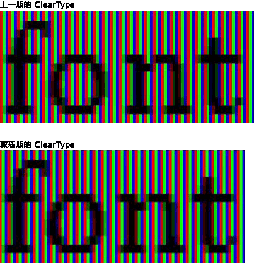
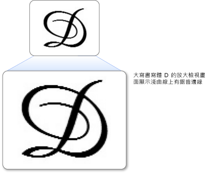
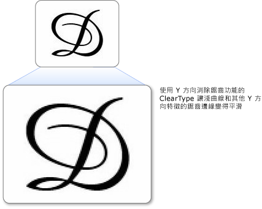

# ClearType 概觀ClearType Overview
本主題提供於 [!INCLUDE[TLA#tla_winclient](../../../../includes/tlasharptla-winclient-md.md)] 中找到之 [!INCLUDE[TLA#tla_ct](../../../../includes/tlasharptla-ct-md.md)] 技術的概觀。This topic provides an overview of the [!INCLUDE[TLA#tla_ct](../../../../includes/tlasharptla-ct-md.md)] technology found in the [!INCLUDE[TLA#tla_winclient](../../../../includes/tlasharptla-winclient-md.md)].  
  
  
   
## 技術概觀Technology Overview  
 [!INCLUDE[TLA2#tla_ct](../../../../includes/tla2sharptla-ct-md.md)] 軟體技術是由 [!INCLUDE[TLA#tla_ms](../../../../includes/tlasharptla-ms-md.md)] 所開發，後者改善了現有 LCD (液晶顯示器) 的文字可讀性，例如膝上型電腦螢幕、Pocket PC 螢幕和平面監視器。 is a software technology developed by [!INCLUDE[TLA#tla_ms](../../../../includes/tlasharptla-ms-md.md)] that improves the readability of text on existing LCDs (Liquid Crystal Displays), such as laptop screens, Pocket PC screens and flat panel monitors.  [!INCLUDE[TLA2#tla_ct](../../../../includes/tla2sharptla-ct-md.md)] 的運作方式是存取 LCD 螢幕中每個像素的個別垂直色帶項目。 works by accessing the individual vertical color stripe elements in every pixel of an LCD screen. 在 [!INCLUDE[TLA2#tla_ct](../../../../includes/tla2sharptla-ct-md.md)] 之前，電腦能夠顯示的詳細資料最小層級是單一像素，但在 LCD 監視器上執行 [!INCLUDE[TLA2#tla_ct](../../../../includes/tla2sharptla-ct-md.md)] 之後，顯示的文字特性可以小到像素寬度的幾分之一。Before [!INCLUDE[TLA2#tla_ct](../../../../includes/tla2sharptla-ct-md.md)], the smallest level of detail that a computer could display was a single pixel, but with [!INCLUDE[TLA2#tla_ct](../../../../includes/tla2sharptla-ct-md.md)] running on an LCD monitor, we can now display features of text as small as a fraction of a pixel in width. 額外的解析度可提高文字顯示細節的銳度，即使經過長時間也容易閱讀。The extra resolution increases the sharpness of the tiny details in text display, making it much easier to read over long durations.  
  
 [!INCLUDE[TLA#tla_winclient](../../../../includes/tlasharptla-winclient-md.md)] 提供的 [!INCLUDE[TLA2#tla_ct](../../../../includes/tla2sharptla-ct-md.md)] 是最新一代的 [!INCLUDE[TLA2#tla_ct](../../../../includes/tla2sharptla-ct-md.md)]，其具有 [!INCLUDE[TLA#tla_gdi](../../../../includes/tlasharptla-gdi-md.md)] 中之版本的多項改進。The [!INCLUDE[TLA2#tla_ct](../../../../includes/tla2sharptla-ct-md.md)] available in [!INCLUDE[TLA#tla_winclient](../../../../includes/tlasharptla-winclient-md.md)] is the latest generation of [!INCLUDE[TLA2#tla_ct](../../../../includes/tla2sharptla-ct-md.md)] which has several improvements over version found in [!INCLUDE[TLA#tla_gdi](../../../../includes/tlasharptla-gdi-md.md)].  
  
   
## 子像素定位Sub-pixel Positioning  
 前一版 [!INCLUDE[TLA2#tla_ct](../../../../includes/tla2sharptla-ct-md.md)] 的重大改進就是使用子像素定位。A significant improvement over the previous version of [!INCLUDE[TLA2#tla_ct](../../../../includes/tla2sharptla-ct-md.md)] is the use of sub-pixel positioning. 不同於 [!INCLUDE[TLA2#tla_gdi](../../../../includes/tla2sharptla-gdi-md.md)] 中的 [!INCLUDE[TLA2#tla_ct](../../../../includes/tla2sharptla-ct-md.md)] 實作，[!INCLUDE[TLA#tla_winclient](../../../../includes/tlasharptla-winclient-md.md)] 中的 [!INCLUDE[TLA2#tla_ct](../../../../includes/tla2sharptla-ct-md.md)] 允許字符在像素內開始，不是只能在像素界限上開始。Unlike the [!INCLUDE[TLA2#tla_ct](../../../../includes/tla2sharptla-ct-md.md)] implementation found in [!INCLUDE[TLA2#tla_gdi](../../../../includes/tla2sharptla-gdi-md.md)], the [!INCLUDE[TLA2#tla_ct](../../../../includes/tla2sharptla-ct-md.md)] found in [!INCLUDE[TLA#tla_winclient](../../../../includes/tlasharptla-winclient-md.md)] allows glyphs to start within the pixel and not just the beginning boundary of the pixel. 因為定位字符有此額外的解析度，所以字符的間距和比例更精確且一致。Because of this extra resolution in positioning glyphs, the spacing and proportions of the glyphs is more precise and consistent.  
  
 下列兩例示範使用子像素定位時，字符如何能在任何子像素界限上開始。The following two examples show how glyphs may begin on any sub-pixel boundary when sub-pixel positioning is used. 左邊的範例使用舊版 [!INCLUDE[TLA2#tla_ct](../../../../includes/tla2sharptla-ct-md.md)] 轉譯器轉譯，未採用子像素定位。The example on the left is rendered using the earlier version of the [!INCLUDE[TLA2#tla_ct](../../../../includes/tla2sharptla-ct-md.md)] renderer, which did not employ sub-pixel positioning. 右邊的範例使用新版 [!INCLUDE[TLA2#tla_ct](../../../../includes/tla2sharptla-ct-md.md)] 轉譯器轉譯，採用子像素定位。The example on the right is rendered using the new version of the [!INCLUDE[TLA2#tla_ct](../../../../includes/tla2sharptla-ct-md.md)] renderer, using sub-pixel positioning. 請注意右側映像中每個 **e** 和 **l** 的轉譯方式都略有不同，因為它們每一個都在不同的子像素上開始。Note how each **e** and **l** in the right-hand image is rendered slightly differently because each starts on a different sub-pixel. 在螢幕上檢視正常大小的文字時，因為字符映像的高對比，所以這項差異不是很明顯。When viewing the text at its normal size on the screen, this difference is not noticeable because of the high contrast of the glyph image. 這可能只是因為 [!INCLUDE[TLA2#tla_ct](../../../../includes/tla2sharptla-ct-md.md)] 納入的複雜色彩篩選。This is only possible because of sophisticated color filtering that is incorporated in [!INCLUDE[TLA2#tla_ct](../../../../includes/tla2sharptla-ct-md.md)].  
  
   
以新舊版 ClearType 顯示的文字Text displayed with earlier and later versions of ClearType  
  
 下列兩例比較舊版 [!INCLUDE[TLA2#tla_ct](../../../../includes/tla2sharptla-ct-md.md)] 轉譯器和新版 [!INCLUDE[TLA2#tla_ct](../../../../includes/tla2sharptla-ct-md.md)] 轉譯器的輸出。The following two examples compare output from the earlier [!INCLUDE[TLA2#tla_ct](../../../../includes/tla2sharptla-ct-md.md)] renderer with the new version of the [!INCLUDE[TLA2#tla_ct](../../../../includes/tla2sharptla-ct-md.md)] renderer. 顯示在右側的子像素定位，可大幅提升畫面中的類型間距，尤其是子像素和完整像素在字符寬度有明顯比例差異的小尺寸狀況。The subpixel positioning, shown on the right, greatly improves the spacing of type on screen, especially at small sizes where the difference between a sub-pixel and a whole pixel represents a significant proportion of glyph width. 請注意，第二個映像中的字母間距更勻稱。Note that spacing between the letters is more even in the second image. 文字畫面整體外觀的子像素定位累積優勢會大幅增加，並以 [!INCLUDE[TLA2#tla_ct](../../../../includes/tla2sharptla-ct-md.md)] 技術表現顯著的演進。The cumulative benefit of sub-pixel positioning to the overall appearance of a screen of text is greatly increased, and represents a significant evolution in [!INCLUDE[TLA2#tla_ct](../../../../includes/tla2sharptla-ct-md.md)] technology.  
  
   
以新舊版 ClearType 顯示的文字Text with earlier and later versions of ClearType  
  
   
## Y 方向消除鋸齒Y-Direction Antialiasing  
 [!INCLUDE[TLA#tla_winclient](../../../../includes/tlasharptla-winclient-md.md)] 中 [!INCLUDE[TLA2#tla_ct](../../../../includes/tla2sharptla-ct-md.md)] 的另一項改進是 Y 方向消除鋸齒功能。Another improvement of [!INCLUDE[TLA2#tla_ct](../../../../includes/tla2sharptla-ct-md.md)] in [!INCLUDE[TLA#tla_winclient](../../../../includes/tlasharptla-winclient-md.md)] is y-direction anti-aliasing. [!INCLUDE[TLA2#tla_gdi](../../../../includes/tla2sharptla-gdi-md.md)] 中的 [!INCLUDE[TLA2#tla_ct](../../../../includes/tla2sharptla-ct-md.md)] 沒有 Y 方向消除鋸齒功能，能在 X 軸提供更好的解析度，Y 軸則否。The [!INCLUDE[TLA2#tla_ct](../../../../includes/tla2sharptla-ct-md.md)] in [!INCLUDE[TLA2#tla_gdi](../../../../includes/tla2sharptla-gdi-md.md)] without y-direction anti-aliasing provides better resolution on the x-axis but not the y-axis. 微曲部分頂端和底端的鋸齒狀邊緣會降低其可讀性。On the tops and bottoms of shallow curves, the jagged edges detract from its readability.  
  
 下例顯示不使用 Y 方向消除鋸齒的效果。The following example shows the effect of having no y-direction antialiasing. 在此情況下，字母上方與下方的鋸齒狀邊緣很明顯。In this case, the jagged edges on the top and bottom of the letter are apparent.  
  
   
微曲部分產生鋸齒狀邊緣的文字Text with jagged edges on shallow curves  
  
 [!INCLUDE[TLA#tla_winclient](../../../../includes/tlasharptla-winclient-md.md)] 中的 [!INCLUDE[TLA2#tla_ct](../../../../includes/tla2sharptla-ct-md.md)] 在 Y 方向層級上提供消除鋸齒功能，平滑所有的鋸齒狀邊緣。 in [!INCLUDE[TLA#tla_winclient](../../../../includes/tlasharptla-winclient-md.md)] provides antialiasing on the y-direction level to smooth out any jagged edges. 這對改善東亞語言的可讀性特別重要，因為表意字元的水平和垂直微曲部分比重幾乎相同。This is particularly important for improving the readability of East Asian languages where ideographs have an almost equal amount of horizontal and vertical shallow curves.  
  
 下例顯示使用 Y 方向消除鋸齒的效果。The following example shows the effect of y-direction antialiasing. 在此情況下，字母的上方與下方會顯示平滑的曲線。In this case, the top and bottom of the letter show a smooth curve.  
  
   
以 ClearType Y 方向消除鋸齒功能顯示的文字Text with ClearType y-direction antialiasing  
  
   
## 硬體加速Hardware Acceleration  
 [!INCLUDE[TLA#tla_winclient](../../../../includes/tlasharptla-winclient-md.md)] 中的 [!INCLUDE[TLA2#tla_ct](../../../../includes/tla2sharptla-ct-md.md)] 可以利用硬體加速提升效能，並降低 CPU 負載和系統記憶體需求。 in [!INCLUDE[TLA#tla_winclient](../../../../includes/tlasharptla-winclient-md.md)] can take advantage of hardware acceleration for better performance and to reduce CPU load and system memory requirements. 使用圖形卡的像素著色器和視訊記憶體，[!INCLUDE[TLA2#tla_ct](../../../../includes/tla2sharptla-ct-md.md)] 可以更快速轉譯文字，特別是使用動畫時。By using the pixel shaders and video memory of a graphics card, [!INCLUDE[TLA2#tla_ct](../../../../includes/tla2sharptla-ct-md.md)] provides faster rendering of text, particularly when animation is used.  
  
 [!INCLUDE[TLA#tla_winclient](../../../../includes/tlasharptla-winclient-md.md)] 中的 [!INCLUDE[TLA2#tla_ct](../../../../includes/tla2sharptla-ct-md.md)] 不會修改整個系統的 [!INCLUDE[TLA2#tla_ct](../../../../includes/tla2sharptla-ct-md.md)] 設定。 in [!INCLUDE[TLA#tla_winclient](../../../../includes/tlasharptla-winclient-md.md)] does not modify the system-wide [!INCLUDE[TLA2#tla_ct](../../../../includes/tla2sharptla-ct-md.md)] settings. 停用 [!INCLUDE[TLA#tla_mswin](../../../../includes/tlasharptla-mswin-md.md)] 中的 [!INCLUDE[TLA2#tla_ct](../../../../includes/tla2sharptla-ct-md.md)] 會將 [!INCLUDE[TLA#tla_winclient](../../../../includes/tlasharptla-winclient-md.md)] 消除鋸齒設成灰階模式。Disabling [!INCLUDE[TLA2#tla_ct](../../../../includes/tla2sharptla-ct-md.md)] in [!INCLUDE[TLA#tla_mswin](../../../../includes/tlasharptla-mswin-md.md)] sets [!INCLUDE[TLA#tla_winclient](../../../../includes/tlasharptla-winclient-md.md)] antialiasing to grayscale mode. 此外，[!INCLUDE[TLA#tla_winclient](../../../../includes/tlasharptla-winclient-md.md)] 中的 [!INCLUDE[TLA2#tla_ct](../../../../includes/tla2sharptla-ct-md.md)] 不會修改 [ClearType Tuner PowerToy](http://www.microsoft.com/typography/ClearTypePowerToy.mspx) 的設定。In addition, [!INCLUDE[TLA2#tla_ct](../../../../includes/tla2sharptla-ct-md.md)] in [!INCLUDE[TLA#tla_winclient](../../../../includes/tlasharptla-winclient-md.md)] does not modify the settings of the [ClearType Tuner PowerToy](http://www.microsoft.com/typography/ClearTypePowerToy.mspx).  
  
 [!INCLUDE[TLA#tla_winclient](../../../../includes/tlasharptla-winclient-md.md)] 架構設計決策之一，就是解析度獨立的版面配置能更有效地支援日益普及的高解析度 DPI 監視器。One of the [!INCLUDE[TLA#tla_winclient](../../../../includes/tlasharptla-winclient-md.md)] architectural design decisions is to have resolution independent layout better support higher resolution DPI monitors, which are becoming more widespread. 這樣做的後果是 [!INCLUDE[TLA#tla_winclient](../../../../includes/tlasharptla-winclient-md.md)] 不支援別名文字轉譯或某些東亞文字字型的點陣圖，因為它們兩個都是解析度相依。This has the consequence of [!INCLUDE[TLA#tla_winclient](../../../../includes/tlasharptla-winclient-md.md)] not supporting aliased text rendering or the bitmaps in some East Asian fonts because they are both resolution dependent.  
  
   
## 詳細資訊Further Information  
 [ClearType 資訊ClearType Information](http://www.microsoft.com/typography/ClearTypeInfo.mspx)  
  
 [ClearType Tuner PowerToyClearType Tuner PowerToy](http://www.microsoft.com/typography/ClearTypePowerToy.mspx)  
  
## 請參閱See Also  
 [ClearType 登錄設定ClearType Registry Settings](../../../../docs/framework/wpf/advanced/cleartype-registry-settings.md)
