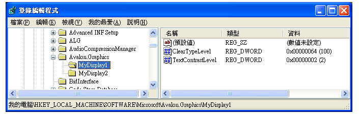
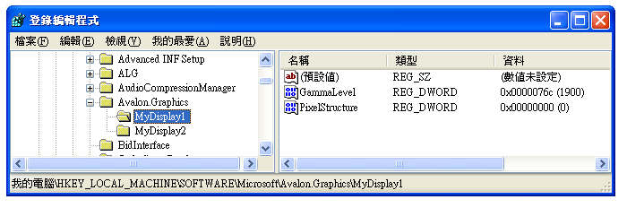

# ClearType 登錄設定ClearType Registry Settings
本主題概述[!INCLUDE[TLA2#tla_winclient](../../../../includes/tla2sharptla-winclient-md.md)][!INCLUDE[TLA#tla_ct](../../../../includes/tlasharptla-ct-md.md)]所使用的登錄設定[!INCLUDE[TLA2#tla_winclient](../../../../includes/tla2sharptla-winclient-md.md)]應用程式。This topic provides an overview of the [!INCLUDE[TLA2#tla_winclient](../../../../includes/tla2sharptla-winclient-md.md)][!INCLUDE[TLA#tla_ct](../../../../includes/tlasharptla-ct-md.md)] registry settings that are used by [!INCLUDE[TLA2#tla_winclient](../../../../includes/tla2sharptla-winclient-md.md)] applications.  
  
  
   
## 技術概觀Technology Overview  
 [!INCLUDE[TLA2#tla_winclient](../../../../includes/tla2sharptla-winclient-md.md)] 呈現文字至顯示裝置使用的應用程式[!INCLUDE[TLA2#tla_ct](../../../../includes/tla2sharptla-ct-md.md)]特性可提供增強的閱讀體驗。 applications that render text to a display device use [!INCLUDE[TLA2#tla_ct](../../../../includes/tla2sharptla-ct-md.md)] features to provide an enhanced reading experience. [!INCLUDE[TLA2#tla_ct](../../../../includes/tla2sharptla-ct-md.md)] 軟體技術是由 [!INCLUDE[TLA#tla_ms](../../../../includes/tlasharptla-ms-md.md)] 所開發，此技術改善了現有 LCD (液晶顯示器) 上的文字可讀性，例如膝上型電腦螢幕、Pocket PC 螢幕和平面監視器。 is a software technology developed by [!INCLUDE[TLA#tla_ms](../../../../includes/tlasharptla-ms-md.md)] that improves the readability of text on existing LCDs (Liquid Crystal Displays), such as laptop screens, Pocket PC screens and flat panel monitors. [!INCLUDE[TLA2#tla_ct](../../../../includes/tla2sharptla-ct-md.md)] 的運作方式是存取 LCD 螢幕中每個像素的個別垂直色帶項目。 works by accessing the individual vertical color stripe elements in every pixel of an LCD screen. 如需詳細資訊[!INCLUDE[TLA2#tla_ct](../../../../includes/tla2sharptla-ct-md.md)]，請參閱 < [ClearType 概觀](../../../../docs/framework/wpf/advanced/cleartype-overview.md)。For more information on [!INCLUDE[TLA2#tla_ct](../../../../includes/tla2sharptla-ct-md.md)], see [ClearType Overview](../../../../docs/framework/wpf/advanced/cleartype-overview.md).  
  
 使用呈現的文字[!INCLUDE[TLA2#tla_ct](../../../../includes/tla2sharptla-ct-md.md)]可以出現在不同的顯示裝置上檢視時的明顯不同。Text that is rendered with [!INCLUDE[TLA2#tla_ct](../../../../includes/tla2sharptla-ct-md.md)] can appear significantly different when viewed on various display devices. 例如，少數監視器實作色帶項目以藍色、 綠色、 紅色的順序，而不是較常見的紅色、 綠色、 藍色 ( [!INCLUDE[TLA#tla_rgb](../../../../includes/tlasharptla-rgb-md.md)]) 順序。For example, a small number of monitors implement the color stripe elements in blue, green, red order rather than the more common red, green, blue (    [!INCLUDE[TLA#tla_rgb](../../../../includes/tlasharptla-rgb-md.md)]) order.  
  
 使用呈現的文字[!INCLUDE[TLA2#tla_ct](../../../../includes/tla2sharptla-ct-md.md)]也會出現大不相同，每個人使用不同的層級的色彩敏感度檢視時。Text that is rendered with [!INCLUDE[TLA2#tla_ct](../../../../includes/tla2sharptla-ct-md.md)] can also appear significantly different when viewed by individuals with varying levels of color sensitivity. 有些人比其他人更能感知色彩的細微差異。Some individuals can detect slight differences in color better than others.  
  
 在這些情況下，[!INCLUDE[TLA2#tla_ct](../../../../includes/tla2sharptla-ct-md.md)]需要修改以提供最佳的閱讀經驗，為每個個別的功能。In each of these cases, [!INCLUDE[TLA2#tla_ct](../../../../includes/tla2sharptla-ct-md.md)] features need to be modified in order to provide the best reading experience for each individual.  
  
   
## 登錄設定Registry Settings  
 [!INCLUDE[TLA2#tla_winclient](../../../../includes/tla2sharptla-winclient-md.md)] 指定四個登錄設定來控制[!INCLUDE[TLA2#tla_ct](../../../../includes/tla2sharptla-ct-md.md)]功能： specifies four registry settings for controlling [!INCLUDE[TLA2#tla_ct](../../../../includes/tla2sharptla-ct-md.md)] features:  
  
|設定Setting|描述Description|  
|-------------|-----------------|  
|[!INCLUDE[TLA2#tla_ct](../../../../includes/tla2sharptla-ct-md.md)] 層級 level|描述的層級[!INCLUDE[TLA2#tla_ct](../../../../includes/tla2sharptla-ct-md.md)]色彩清晰度。Describes the level of [!INCLUDE[TLA2#tla_ct](../../../../includes/tla2sharptla-ct-md.md)] color clarity.|  
|色差補正層級Gamma level|說明顯示裝置的像素色彩元件層級。Describes the level of the pixel color component for a display device.|  
|像素結構Pixel structure|說明顯示裝置的像素排列。Describes the arrangement of pixels for a display device.|  
|文字對比層級Text contrast level|說明顯示文字的對比層級。Describes the level of contrast for displayed text.|  
  
 這些設定可由知道如何參考識別之外部組態公用程式存取[!INCLUDE[TLA2#tla_winclient](../../../../includes/tla2sharptla-winclient-md.md)][!INCLUDE[TLA2#tla_ct](../../../../includes/tla2sharptla-ct-md.md)]登錄設定。These settings can be accessed by an external configuration utility that knows how to reference the identified [!INCLUDE[TLA2#tla_winclient](../../../../includes/tla2sharptla-winclient-md.md)][!INCLUDE[TLA2#tla_ct](../../../../includes/tla2sharptla-ct-md.md)] registry settings. 您也可以使用 [!INCLUDE[TLA#tla_mswin](../../../../includes/tlasharptla-mswin-md.md)] 登錄編輯程式直接存取這些值來建立或修改這些設定。These settings can also be created or modified by accessing the values directly by using the [!INCLUDE[TLA#tla_mswin](../../../../includes/tlasharptla-mswin-md.md)] Registry Editor.  
  
 如果[!INCLUDE[TLA2#tla_winclient](../../../../includes/tla2sharptla-winclient-md.md)][!INCLUDE[TLA2#tla_ct](../../../../includes/tla2sharptla-ct-md.md)]登錄設定不設定 （也就是預設狀態），[!INCLUDE[TLA2#tla_winclient](../../../../includes/tla2sharptla-winclient-md.md)]應用程式查詢[!INCLUDE[TLA#tla_mswin](../../../../includes/tlasharptla-mswin-md.md)]系統字型平滑化設定的參數資訊。If the [!INCLUDE[TLA2#tla_winclient](../../../../includes/tla2sharptla-winclient-md.md)][!INCLUDE[TLA2#tla_ct](../../../../includes/tla2sharptla-ct-md.md)] registry settings are not set (which is the default state), the [!INCLUDE[TLA2#tla_winclient](../../../../includes/tla2sharptla-winclient-md.md)] application queries the [!INCLUDE[TLA#tla_mswin](../../../../includes/tlasharptla-mswin-md.md)] system parameters information for font smoothing settings.  
  
> [!NOTE]
>  如需列舉顯示裝置名稱的詳細資訊，請參閱`SystemParametersInfo`[!INCLUDE[TLA2#tla_win32](../../../../includes/tla2sharptla-win32-md.md)]函式。For information on enumerating display device names, see the `SystemParametersInfo`[!INCLUDE[TLA2#tla_win32](../../../../includes/tla2sharptla-win32-md.md)] function.  
  
   
## ClearType 層級ClearType Level  
 [!INCLUDE[TLA2#tla_ct](../../../../includes/tla2sharptla-ct-md.md)]層級可讓您調整文字的色彩敏感度和接受度個人為基礎的轉譯。The [!INCLUDE[TLA2#tla_ct](../../../../includes/tla2sharptla-ct-md.md)] level allows you to adjust the rendering of text based on the color sensitivity and perception of an individual. 對某些人而言轉譯的文字，會使用[!INCLUDE[TLA2#tla_ct](../../../../includes/tla2sharptla-ct-md.md)]以最高層級不會產生最佳的閱讀體驗。For some individuals, the rendering of text that uses [!INCLUDE[TLA2#tla_ct](../../../../includes/tla2sharptla-ct-md.md)] at its highest level does not produce the best reading experience.  
  
 [!INCLUDE[TLA2#tla_ct](../../../../includes/tla2sharptla-ct-md.md)]層級是範圍從 0 到 100 的整數值。The [!INCLUDE[TLA2#tla_ct](../../../../includes/tla2sharptla-ct-md.md)] level is an integer value that ranges from 0 to 100. 預設層級為 100，這表示[!INCLUDE[TLA2#tla_ct](../../../../includes/tla2sharptla-ct-md.md)]使用色帶項目顯示裝置的最大功能。The default level is 100, which means [!INCLUDE[TLA2#tla_ct](../../../../includes/tla2sharptla-ct-md.md)] uses the maximum capability of the color stripe elements of the display device. 不過，[!INCLUDE[TLA2#tla_ct](../../../../includes/tla2sharptla-ct-md.md)]層級為 0 會轉譯成灰階文字。However, a [!INCLUDE[TLA2#tla_ct](../../../../includes/tla2sharptla-ct-md.md)] level of 0 renders text as gray scale. 藉由設定[!INCLUDE[TLA2#tla_ct](../../../../includes/tla2sharptla-ct-md.md)]層級 0 與 100 之間的某處，您可以建立適合個人的色彩敏感度的中間層級。By setting the [!INCLUDE[TLA2#tla_ct](../../../../includes/tla2sharptla-ct-md.md)] level somewhere between 0 and 100, you can create an intermediate level that is suitable to an individual's color sensitivity.  
  
### 登錄設定Registry Setting  
 登錄設定位置[!INCLUDE[TLA2#tla_ct](../../../../includes/tla2sharptla-ct-md.md)]等級會對應到特定顯示裝置名稱的個別使用者設定：The registry setting location for the [!INCLUDE[TLA2#tla_ct](../../../../includes/tla2sharptla-ct-md.md)] level is an individual user setting that corresponds to a specific display device name:  
  
 `HKEY_CURRENT_USER\SOFTWARE\Microsoft\Avalon.Graphics\<displayName>`  
  
 每個顯示裝置名稱的使用者，`ClearTypeLevel`定義 DWORD 值。For each display device name for a user, a `ClearTypeLevel` DWORD value is defined. 下列螢幕擷取畫面顯示的 登錄編輯程式設定[!INCLUDE[TLA2#tla_ct](../../../../includes/tla2sharptla-ct-md.md)]層級。The following screenshot shows the Registry Editor setting for the [!INCLUDE[TLA2#tla_ct](../../../../includes/tla2sharptla-ct-md.md)] level.  
  
   
  
> [!NOTE]
>  [!INCLUDE[TLA2#tla_winclient](../../../../includes/tla2sharptla-winclient-md.md)] 應用程式呈現的文字中包含或不含下列任一種模式的其中一個[!INCLUDE[TLA2#tla_ct](../../../../includes/tla2sharptla-ct-md.md)]。 applications render text in one of either two modes, with and without [!INCLUDE[TLA2#tla_ct](../../../../includes/tla2sharptla-ct-md.md)]. 文字時將不會呈現[!INCLUDE[TLA2#tla_ct](../../../../includes/tla2sharptla-ct-md.md)]，它指以灰階轉譯。When text is rendered without [!INCLUDE[TLA2#tla_ct](../../../../includes/tla2sharptla-ct-md.md)], it is referred to as gray scale rendering.  
  
   
## Gamma 層級Gamma Level  
 Gamma 層級是指像素值和明亮度之間的非線性關聯性。The gamma level refers to the nonlinear relationship between a pixel value and luminance. Gamma 層級設定應該對應至顯示裝置的實體特性，否則轉譯的輸出可能會失真。The gamma level setting should correspond to the physical characteristics of the display device; otherwise, distortions in rendered output may occur. 例如，測試結果可能會太寬或太窄，或字符的垂直主體邊緣會出現色彩鬚邊。For example, test may appear too wide or too narrow, or color fringes may appear on the edges of vertical stems of glyphs.  
  
 Gamma 層級是範圍從 1000 到 2200 的整數值。The gamma level is an integer value that ranges from 1000 to 2200. 預設層級為 1900。The default level is 1900.  
  
### 登錄設定Registry Setting  
 Gamma 層級的登錄設定位置是對應到特定顯示裝置名稱的本機電腦設定：The registry setting location for the gamma level is a local machine setting that corresponds to a specific display device name:  
  
 `HKEY_LOCAL_MACHINE\SOFTWARE\Microsoft\Avalon.Graphics\<displayName>`  
  
 每個顯示裝置名稱的使用者，`GammaLevel`定義 DWORD 值。For each display device name for a user, a `GammaLevel` DWORD value is defined. 以下的螢幕擷取畫面顯示 Gamma 層級的登錄編輯程式設定。The following screenshot shows the Registry Editor setting for the gamma level.  
  
   
  
   
## 像素結構Pixel Structure  
 像素結構說明構成顯示裝置的像素類型。The pixel structure describes the type of pixels that make up a display device. 像素結構定義有三種類型︰The pixel structure is defined as one of three types:  
  
|類型Type|值Value|描述Description|  
|----------|-----------|-----------------|  
|一般Flat|00|顯示裝置沒有像素結構。The display device has no pixel structure. 這表示每種色彩光源都平均分布在像素區域，此即為灰階轉譯。This means that light sources for each color are spread equally on the pixel area—this is referred to as gray scale rendering. 這是標準顯示裝置運作的方式。This is how a standard display device works. [!INCLUDE[TLA2#tla_ct](../../../../includes/tla2sharptla-ct-md.md)] 永遠不會套用至轉譯的文字。 is never applied to the rendered text.|  
|RGBRGB|11|顯示裝置的像素色帶組成順序如下︰紅色、綠色和藍色。The display device has pixels that consist of three stripes in the following order: red, green, and blue. [!INCLUDE[TLA2#tla_ct](../../../../includes/tla2sharptla-ct-md.md)] 套用至轉譯的文字。 is applied to the rendered text.|  
|BGRBGR|22|顯示裝置的像素色帶組成順序如下︰藍色、綠色和紅色。The display device has pixels that consist of three stripes in the following order: blue, green, and red. [!INCLUDE[TLA2#tla_ct](../../../../includes/tla2sharptla-ct-md.md)] 套用至轉譯的文字。 is applied to the rendered text. 請注意順序由 RGB 類型反轉的方式。Notice how the order is inverted from the RGB type.|  
  
 像素結構對應至範圍從 0 到 2 的整數值。The pixel structure corresponds to an integer value that ranges from 0 to 2. 預設層級為 0 表示一般的像素結構。The default level is 0, which represents a flat pixel structure.  
  
> [!NOTE]
>  如需列舉顯示裝置名稱的詳細資訊，請參閱`EnumDisplayDevices`[!INCLUDE[TLA2#tla_win32](../../../../includes/tla2sharptla-win32-md.md)]函式。For information on enumerating display device names, see the `EnumDisplayDevices`[!INCLUDE[TLA2#tla_win32](../../../../includes/tla2sharptla-win32-md.md)] function.  
  
### 登錄設定Registry Setting  
 像素結構的登錄設定位置是對應到特定顯示裝置名稱的本機電腦設定：The registry setting location for the pixel structure is a local machine setting that corresponds to a specific display device name:  
  
 `HKEY_LOCAL_MACHINE\SOFTWARE\Microsoft\Avalon.Graphics\<displayName>`  
  
 每個顯示裝置名稱的使用者，`PixelStructure`定義 DWORD 值。For each display device name for a user, a `PixelStructure` DWORD value is defined. 以下的螢幕擷取畫面顯示像素結構的登錄編輯程式設定。The following screenshot shows the Registry Editor setting for the pixel structure.  
  
   
  
   
## 文字對比層級Text Contrast Level  
 文字對比層級可讓您根據字符的主體寬度調整文字的轉譯。The text contrast level allows you to adjust the rendering of text based on the stem widths of glyphs. 文字對比層級是一個範圍從 0 到 6 的整數值，整數值愈大，主體愈寬。The text contrast level is an integer value that ranges from 0 to 6—the larger the integer value, the wider the stem. 預設層級為 1。The default level is 1.  
  
### 登錄設定Registry Setting  
 文字對比層級的登錄設定位置是對應到特定顯示裝置名稱的個別使用者設定：The registry setting location for the text contrast level is an individual user setting that corresponds to a specific display device name:  
  
 `HKEY_CURRENT_USER\Software\Microsoft\Avalon.Graphics\<displayName>`  
  
 每個顯示裝置名稱的使用者，`TextContrastLevel`定義 DWORD 值。For each display device name for a user, a `TextContrastLevel` DWORD value is defined. 下列螢幕擷取畫面顯示文字對比層級的登錄編輯程式設定。The following screenshot shows the Registry Editor setting for the text contrast level.  
  
   
  
## 另請參閱See Also  
 [ClearType 概觀ClearType Overview](../../../../docs/framework/wpf/advanced/cleartype-overview.md)  
 [ClearType 消除鋸齒功能ClearType Antialiasing](/windows/desktop/gdi/cleartype-antialiasing)
