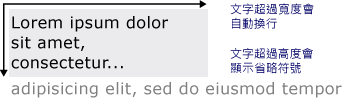

# 繪製格式化的文字
本主題提供的功能概觀<xref:System.Windows.Media.FormattedText>物件。 這個物件提供在 [!INCLUDE[TLA#tla_winclient](../../../../includes/tlasharptla-winclient-md.md)] 應用程式中繪製文字的低階控制項。  
  
  
## 技術概觀  
 <xref:System.Windows.Media.FormattedText>物件可讓您繪製多行文字，可以個別格式化文字中的每個字元。 下例顯示已套用多種格式的文字。  
  
   
使用 FormattedText 方法顯示的文字  
  
> [!NOTE]
>  針對從 [!INCLUDE[TLA#tla_win32](../../../../includes/tlasharptla-win32-md.md)] API 移轉的開發人員，[Win32 移轉](#win32_migration)一節中的資料表會列出 [!INCLUDE[TLA#tla_win32](../../../../includes/tlasharptla-win32-md.md)] DrawText 旗標和 [!INCLUDE[TLA#tla_winclient](../../../../includes/tlasharptla-winclient-md.md)] 中的大概對等項目。  
  
### 使用格式化文字的原因  
 [!INCLUDE[TLA2#tla_winclient](../../../../includes/tla2sharptla-winclient-md.md)] 包含多個將文字繪製到螢幕的控制項。 每個控制項都是不同案例的目標，且有自己的功能與限制清單。 一般情況下，<xref:System.Windows.Controls.TextBlock>必要項目，例如一個簡短的句子，在有限的文字支援時，就應該使用項目[!INCLUDE[TLA#tla_ui](../../../../includes/tlasharptla-ui-md.md)]。 <xref:System.Windows.Controls.Label> 需要最少的文字支援時，可以使用。 如需詳細資訊，請參閱 [WPF 中的文件](../../../../docs/framework/wpf/advanced/documents-in-wpf.md)。  
  
 <xref:System.Windows.Media.FormattedText>物件所提供的文字格式化功能比[!INCLUDE[TLA#tla_winclient](../../../../includes/tlasharptla-winclient-md.md)]文字控制項，並在您要使用文字裝飾的項目作為案例很有用。 如需詳細資訊，請參閱[將格式化文字轉換成幾何](#converting_formatted_text)一節。  
  
 颾魤 ㄛ<xref:System.Windows.Media.FormattedText>物件可用於建立文字導向<xref:System.Windows.Media.DrawingVisual>-衍生物件。 <xref:System.Windows.Media.DrawingVisual> 是用來呈現圖形、 影像或文字的輕量型繪圖類別。 如需詳細資訊，請參閱[使用 DrawingVisuals 範例的點擊測試](https://go.microsoft.com/fwlink/?LinkID=159994)。  
  
## 使用 FormattedText 物件  
 若要建立格式化的文字，請呼叫<xref:System.Windows.Media.FormattedText.%23ctor%2A>建構函式建立<xref:System.Windows.Media.FormattedText>物件。 建立初始的格式化文字字串之後，您就可以套用一系列的格式化樣式。  
  
 使用<xref:System.Windows.Media.FormattedText.MaxTextWidth%2A>屬性，以限制為特定寬度的文字。 文字會自動換行，避免超出指定的寬度。 使用<xref:System.Windows.Media.FormattedText.MaxTextHeight%2A>屬性，以限制特定高度的文字。 超過指定高度的文字會顯示省略符號 "…"。  
  
   
顯示換行和省略符號的文字  
  
 您可以將多個格式化樣式套用到一或多個字元。 例如，您可以呼叫這兩<xref:System.Windows.Media.FormattedText.SetFontSize%2A>和<xref:System.Windows.Media.FormattedText.SetForegroundBrush%2A>方法來變更文字中的前五個字元的格式。  
  
 下列程式碼範例會建立<xref:System.Windows.Media.FormattedText>物件，並接著套用至文字的數個格式化樣式。  
  
 [!code-csharp[FormattedTextSnippets#FormattedTextSnippets1](../../../../samples/snippets/csharp/VS_Snippets_Wpf/FormattedTextSnippets/CSharp/Window1.xaml.cs#formattedtextsnippets1)]
 [!code-vb[FormattedTextSnippets#FormattedTextSnippets1](../../../../samples/snippets/visualbasic/VS_Snippets_Wpf/FormattedTextSnippets/visualbasic/window1.xaml.vb#formattedtextsnippets1)]  
  
### 字型大小測量單位  
 如同在其他文字物件[!INCLUDE[TLA#tla_winclient](../../../../includes/tlasharptla-winclient-md.md)]應用程式，<xref:System.Windows.Media.FormattedText>物件使用與裝置無關的像素為測量單位。 不過，大部分的 [!INCLUDE[TLA#tla_win32](../../../../includes/tlasharptla-win32-md.md)] 應用程式使用點作為測量單位。 如果您想要在 [!INCLUDE[TLA#tla_winclient](../../../../includes/tlasharptla-winclient-md.md)] 應用程式中使用以點為單位的顯示文字，您需要將 [!INCLUDE[TLA#tla_dipixel#plural](../../../../includes/tlasharptla-dipixelsharpplural-md.md)] 轉換成點。 下列程式碼範例會示範如何執行此轉換。  
  
 [!code-csharp[FormattedTextSnippets#FormattedTextSnippets2](../../../../samples/snippets/csharp/VS_Snippets_Wpf/FormattedTextSnippets/CSharp/Window1.xaml.cs#formattedtextsnippets2)]
 [!code-vb[FormattedTextSnippets#FormattedTextSnippets2](../../../../samples/snippets/visualbasic/VS_Snippets_Wpf/FormattedTextSnippets/visualbasic/window1.xaml.vb#formattedtextsnippets2)]  
  
   
### 將格式化文字轉換成幾何  
 您可以將轉換成的格式化的文字<xref:System.Windows.Media.Geometry>物件，可讓您建立其他類型的趣味視覺文字。 例如，您可以在其中建立<xref:System.Windows.Media.Geometry>物件根據文字字串的外框。  
  
   
以線性漸層筆刷繪製外框的文字  
  
 下列範例示範數種方式，可透過修改筆劃、填滿和反白顯示轉換的文字，來建立有趣的視覺效果。  
  
   
設定筆劃並填滿不同色彩的範例  
  
   
影像筆刷套用至筆劃的範例  
  
   
影像筆刷套用至筆劃並反白顯示的範例  
  
 當文字轉換成<xref:System.Windows.Media.Geometry>物件時，它不再是字元集合，您無法修改文字字串中的字元。 不過，您可以修改其筆劃與填滿屬性來影響轉換文字的外觀。 筆劃是指轉換文字的外框，填滿是指轉換文字外框內的區域。 如需詳細資訊，請參閱[建立外框文字](../../../../docs/framework/wpf/advanced/how-to-create-outlined-text.md)。  
  
 您也可以轉換來格式化的文字<xref:System.Windows.Media.PathGeometry>物件，並使用物件反白顯示的文字。 比方說，您可以套用至動畫<xref:System.Windows.Media.PathGeometry>物件，讓動畫跟著格式化文字的外框。  
  
 下列範例顯示格式化的文字已轉換成<xref:System.Windows.Media.PathGeometry>物件。 以動畫顯示的橢圓形會沿著轉譯文字的筆劃路徑行進。  
  
   
遵循文字之路徑幾何的範圍  
  
 如需詳細資訊，請參閱[如何：建立文字的 PathGeometry 動畫](https://msdn.microsoft.com/library/29f8051e-798a-463f-a926-a099a99e9c67)。  
  
 您可以建立其他趣味的使用格式化的文字，一旦轉換成<xref:System.Windows.Media.PathGeometry>物件。 例如，您可以裁剪視訊以顯示在其中。  
  
   
顯示於文字之路徑幾何中的視訊  
  
   
## Win32 移轉  
 功能<xref:System.Windows.Media.FormattedText>繪製文字是類似的功能[!INCLUDE[TLA#tla_win32](../../../../includes/tlasharptla-win32-md.md)]DrawText 函式。 針對從 [!INCLUDE[TLA#tla_win32](../../../../includes/tlasharptla-win32-md.md)] API 移轉的開發人員，下列資料表會列出 [!INCLUDE[TLA#tla_win32](../../../../includes/tlasharptla-win32-md.md)] DrawText 旗標和 [!INCLUDE[TLA#tla_winclient](../../../../includes/tlasharptla-winclient-md.md)] 中的大概對等項目。  
  
|DrawText 旗標|WPF 對等項目|注意|  
|-------------------|--------------------|-----------|  
|DT_BOTTOM|<xref:System.Windows.Media.FormattedText.Height%2A>|使用<xref:System.Windows.Media.FormattedText.Height%2A>屬性來計算適當[!INCLUDE[TLA#tla_win32](../../../../includes/tlasharptla-win32-md.md)]DrawText 'y' 位置。|  
|DT_CALCRECT|<xref:System.Windows.Media.FormattedText.Height%2A>, <xref:System.Windows.Media.FormattedText.Width%2A>|使用<xref:System.Windows.Media.FormattedText.Height%2A>和<xref:System.Windows.Media.FormattedText.Width%2A>; 屬性來計算輸出矩形。|  
|DT_CENTER|<xref:System.Windows.Media.FormattedText.TextAlignment%2A>|使用<xref:System.Windows.Media.FormattedText.TextAlignment%2A>屬性值設為<xref:System.Windows.TextAlignment.Center>。|  
|DT_EDITCONTROL|無|不需要。 架構編輯控制項中的空間寬度和最後一行轉譯相同。|  
|DT_END_ELLIPSIS|<xref:System.Windows.Media.FormattedText.Trimming%2A>|使用<xref:System.Windows.Media.FormattedText.Trimming%2A>屬性的值<xref:System.Windows.TextTrimming.CharacterEllipsis>。   使用<xref:System.Windows.TextTrimming.WordEllipsis>以取得[!INCLUDE[TLA#tla_win32](../../../../includes/tlasharptla-win32-md.md)]DT_END_ELLIPSIS DT_WORD_ELIPSIS 與結尾的省略符號，在此情況下，字元省略符號只會發生在一行文字，不適合。|  
|DT_EXPAND_TABS|無|不需要。 索引標籤每 4 ems 就會自動展開至停駐點，大約 8 個語言獨立字元的寬度。|  
|DT_EXTERNALLEADING|無|不需要。 行距中一律包含外部前置。 使用<xref:System.Windows.Media.FormattedText.LineHeight%2A>屬性，建立使用者定義的行距。|  
|DT_HIDEPREFIX|無|不支援。 移除 '&' 從字串建構之前<xref:System.Windows.Media.FormattedText>物件。|  
|DT_LEFT|<xref:System.Windows.Media.FormattedText.TextAlignment%2A>|這是預設的文字對齊方式。 使用<xref:System.Windows.Media.FormattedText.TextAlignment%2A>屬性值設為<xref:System.Windows.TextAlignment.Left>。 (僅限 WPF)|  
|DT_MODIFYSTRING|無|不支援。|  
|DT_NOCLIP|<xref:System.Windows.Media.Visual.VisualClip%2A>|不自動執行裁剪。 如果您想要裁剪文字，使用<xref:System.Windows.Media.Visual.VisualClip%2A>屬性。|  
|DT_NOFULLWIDTHCHARBREAK|無|不支援。|  
|DT_NOPREFIX|無|不需要。 字串中的 '&' 字元一律視為一般字元。|  
|DT_PATHELLIPSIS|無|使用<xref:System.Windows.Media.FormattedText.Trimming%2A>屬性的值<xref:System.Windows.TextTrimming.WordEllipsis>。|  
|DT_PREFIX|無|不支援。 如果您想要使用底線的文字，例如快速鍵或連結，請使用<xref:System.Windows.Media.FormattedText.SetTextDecorations%2A>方法。|  
|DT_PREFIXONLY|無|不支援。|  
|DT_RIGHT|<xref:System.Windows.Media.FormattedText.TextAlignment%2A>|使用<xref:System.Windows.Media.FormattedText.TextAlignment%2A>屬性值設為<xref:System.Windows.TextAlignment.Right>。 (僅限 WPF)|  
|DT_RTLREADING|<xref:System.Windows.Media.FormattedText.FlowDirection%2A>|將 <xref:System.Windows.Media.FormattedText.FlowDirection%2A> 屬性設定為 <xref:System.Windows.FlowDirection.RightToLeft>。|  
|DT_SINGLELINE|無|不需要。 <xref:System.Windows.Media.FormattedText> 除非物件的行為做為單一行控制項，其中一個<xref:System.Windows.Media.FormattedText.MaxTextWidth%2A>; 屬性設定，或文字包含歸位字元/換行 (CR/LF)。|  
|DT_TABSTOP|無|不支援使用者定義的定位停駐點位置。|  
|DT_TOP|<xref:System.Windows.Media.FormattedText.Height%2A>|不需要。 預設值為靠上對齊。 可以使用來定義其他的垂直定位值<xref:System.Windows.Media.FormattedText.Height%2A>屬性來計算適當[!INCLUDE[TLA#tla_win32](../../../../includes/tlasharptla-win32-md.md)]DrawText 'y' 位置。|  
|DT_VCENTER|<xref:System.Windows.Media.FormattedText.Height%2A>|使用<xref:System.Windows.Media.FormattedText.Height%2A>屬性來計算適當[!INCLUDE[TLA#tla_win32](../../../../includes/tlasharptla-win32-md.md)]DrawText 'y' 位置。|  
|DT_WORDBREAK|無|不需要。 斷詞會自動使用<xref:System.Windows.Media.FormattedText>物件。 您無法停用它。|  
|DT_WORD_ELLIPSIS|<xref:System.Windows.Media.FormattedText.Trimming%2A>|使用<xref:System.Windows.Media.FormattedText.Trimming%2A>屬性的值<xref:System.Windows.TextTrimming.WordEllipsis>。|  
  
## 另請參閱  
 <xref:System.Windows.Media.FormattedText>  
 [WPF 中的文件](../../../../docs/framework/wpf/advanced/documents-in-wpf.md)  
 [WPF 中的印刷樣式](../../../../docs/framework/wpf/advanced/typography-in-wpf.md)  
 [建立外框文字](../../../../docs/framework/wpf/advanced/how-to-create-outlined-text.md)  
 [如何︰建立文字的 PathGeometry 動畫](https://msdn.microsoft.com/library/29f8051e-798a-463f-a926-a099a99e9c67)
