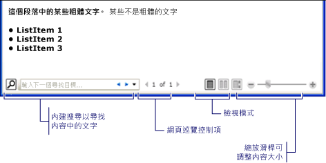

# 非固定格式文件概觀Flow Document Overview
非固定格式文件的設計是為最佳化檢視和可讀性。Flow documents are designed to optimize viewing and readability. 非固定格式文件並不會設為某種預先定義的配置，而是會根據執行階段變數 (例如視窗大小、裝置解析度和選擇性的使用者喜好設定)，動態調整及自動重排其內容。Rather than being set to one predefined layout, flow documents dynamically adjust and reflow their content based on run-time variables such as window size, device resolution, and optional user preferences. 此外，非固定格式文件提供進階文件功能，例如編頁和資料行。In addition, flow documents offer advanced document features, such as pagination and columns. 本主題提供非固定格式文件和建立方式的概觀。This topic provides an overview of flow documents and how to create them.  
  

  
   
## 什麼是非固定格式文件What is a Flow Document  
 非固定格式文件的設計是會根據視窗大小、裝置解析度及其他環境變數來「自動重排內容」。A flow document is designed to "reflow content" depending on window size, device resolution, and other environment variables. 此外，非固定格式文件具備許多內建功能，包括搜尋、將可讀性最佳化的檢視模式，以及變更字型大小與外觀的能力。In addition, flow documents have a number of built in features including search, viewing modes that optimize readability, and the ability to change the size and appearance of fonts. 當可讀性是使用文件的主要考量時，最好使用非固定格式文件。Flow Documents are best utilized when ease of reading is the primary document consumption scenario. 相反地，固定格式文件的設計是靜態展示。In contrast, Fixed Documents are designed to have a static presentation. 當來源內容的精確度很重要時，固定格式文件很有用。Fixed Documents are useful when fidelity of the source content is essential. 請參閱[WPF 中的文件](../../../../docs/framework/wpf/advanced/documents-in-wpf.md)如需有關不同類型的文件。See [Documents in WPF](../../../../docs/framework/wpf/advanced/documents-in-wpf.md) for more information on different types of documents.  
  
 下圖顯示在數個不同大小的視窗中檢視非固定格式文件範例。The following illustration shows a sample flow document viewed in several windows of different sizes. 當顯示區域變更時，內容就會自動重排以充分利用可用的空間。As the display area changes, the content reflows to make the best use of the available space.  
  
   
  
 如上圖所示，非固定格式內容可以包含許多元件，包括段落、清單、映像等等。As seen in the image above, flow content can include many components including paragraphs, lists, images, and more. 這些元件會對應至程序性程式碼中標記和物件的項目。These components correspond to elements in markup and objects in procedural code. 我們將在稍後介紹這些類別詳細[非固定格式相關的類別](#flow_related_classes)本概觀一節。We will go over these classes in detail later in the [Flow Related Classes](#flow_related_classes) section of this overview. 現在，以下是簡單的程式碼範例會建立一些粗體文字與清單的段落的非固定格式文件。For now, here is a simple code example that creates a flow document consisting of a paragraph with some bold text and a list.
  
 [!code-xaml[FlowOvwSnippets_snip#SimpleFlowExampleWholePage](../../../../samples/snippets/csharp/VS_Snippets_Wpf/FlowOvwSnippets_snip/CS/SimpleFlowExample.xaml#simpleflowexamplewholepage)]  
  
 [!code-csharp[FlowOvwSnippets_procedural_snip#SimpleFlowCodeOnlyExampleWholePage](../../../../samples/snippets/csharp/VS_Snippets_Wpf/FlowOvwSnippets_procedural_snip/CSharp/SimpleFlowExample.cs#simpleflowcodeonlyexamplewholepage)]
 [!code-vb[FlowOvwSnippets_procedural_snip#SimpleFlowCodeOnlyExampleWholePage](../../../../samples/snippets/visualbasic/VS_Snippets_Wpf/FlowOvwSnippets_procedural_snip/VisualBasic/SimpleFlowExample.vb#simpleflowcodeonlyexamplewholepage)]  
  
 下圖顯示此程式碼片段的外觀。The illustration below shows what this code snippet looks like.  
  
   
  
 在此範例中，<xref:System.Windows.Controls.FlowDocumentReader>控制項用來裝載非固定格式內容。In this example, the <xref:System.Windows.Controls.FlowDocumentReader> control is used to host the flow content. 請參閱[非固定格式文件類型](#flow_document_types)如需有關非固定格式內容裝載控制項。See [Flow Document Types](#flow_document_types) for more information on flow content hosting controls. <xref:System.Windows.Documents.Paragraph><xref:System.Windows.Documents.List>， <xref:System.Windows.Documents.ListItem>，和<xref:System.Windows.Documents.Bold>元素用來控制內容的格式，根據在標記中的順序。<xref:System.Windows.Documents.Paragraph>, <xref:System.Windows.Documents.List>, <xref:System.Windows.Documents.ListItem>, and <xref:System.Windows.Documents.Bold> elements are used to control content formatting, based on their order in markup. 比方說，<xref:System.Windows.Documents.Bold>項目僅跨越部分的段落中的文字，如此一來，只有該部分的文字是粗體。For example, the <xref:System.Windows.Documents.Bold> element spans across only part of the text in the paragraph; as a result, only that part of the text is bold. 如果您使用過 HTML，會覺得很熟悉。If you have used HTML, this will be familiar to you.  
  
 上圖中反白顯示，有數個內建固定格式文件的功能：As highlighted in the illustration above, there are several features built into Flow Documents:
  
-   搜尋: 可讓使用者執行全文檢索搜尋的整份文件。Search: Allows the user to perform a full text search of an entire document.  
  
-   檢視模式：使用者可以選取其慣用的檢視模式，包括單一頁面 （頁面-一次） 檢視模式中，兩個-頁面-一次 （書本閱讀格式） 檢視模式，以及連續捲動 （無底邊） 檢視模式。Viewing Mode: The user can select their preferred viewing mode including a single-page (page-at-a-time) viewing mode, a two-page-at-a-time (book reading format) viewing mode, and a continuous scrolling (bottomless) viewing mode.  如需這些檢視模式的詳細資訊，請參閱<xref:System.Windows.Controls.FlowDocumentReaderViewingMode>。For more information about these viewing modes, see <xref:System.Windows.Controls.FlowDocumentReaderViewingMode>.  
  
-   頁面導覽控制項︰如果文件的檢視模式使用頁面，頁面導覽控制項包括按鈕以移至下一頁 （向下箭號） 或上一頁 （向上箭頭），以及目前的頁碼和總頁數的指示器。Page Navigation Controls: If the viewing mode of the document uses pages, the page navigation controls include a button to jump to the next page (the down arrow) or previous page (the up arrow), as well as indicators for the current page number and total number of pages. 使用鍵盤方向鍵也可以翻頁。Flipping through pages can also be accomplished using the keyboard arrow keys.  
  
-   縮放:縮放控制項可讓使用者以增加或減少的縮放層級，按一下加號或減號按鈕，分別。Zoom: The zoom controls enable the user to increase or decrease the zoom level by clicking the plus or minus buttons, respectively. 縮放控制項也包括調整縮放層級的滑桿。The zoom controls also include a slider for adjusting the zoom level. 如需詳細資訊，請參閱<xref:System.Windows.Controls.FlowDocumentReader.Zoom%2A>。For more information, see <xref:System.Windows.Controls.FlowDocumentReader.Zoom%2A>.  
  
 您可以根據裝載非固定格式內容所用的控制項來修改這些功能。These features can be modified based upon the control used to host the flow content. 下一節說明不同的控制項。The next section describes the different controls.  
  
   
## 非固定格式文件類型Flow Document Types  
 非固定格式文件內容的外觀和顯示方式，取決於裝載非固定格式內容的物件。Display of flow document content and how it appears is dependent upon what object is used to host the flow content. 有四個控制項支援的非固定格式內容的檢視： <xref:System.Windows.Controls.FlowDocumentReader>， <xref:System.Windows.Controls.FlowDocumentPageViewer>， <xref:System.Windows.Controls.RichTextBox>，和<xref:System.Windows.Controls.FlowDocumentScrollViewer>。There are four controls that support viewing of flow content: <xref:System.Windows.Controls.FlowDocumentReader>, <xref:System.Windows.Controls.FlowDocumentPageViewer>, <xref:System.Windows.Controls.RichTextBox>, and <xref:System.Windows.Controls.FlowDocumentScrollViewer>. 以下簡短說明這些控制項。These controls are briefly described below.  
  
 **注意︰** <xref:System.Windows.Documents.FlowDocument>才可直接裝載非固定格式內容，因此所有的這些檢視控制項耗用<xref:System.Windows.Documents.FlowDocument>來啟用非固定格式內容裝載。  **Note:**  <xref:System.Windows.Documents.FlowDocument> is required to directly host flow content, so all of these viewing controls consume a <xref:System.Windows.Documents.FlowDocument> to enable flow content hosting.
  
### FlowDocumentReaderFlowDocumentReader  
 <xref:System.Windows.Controls.FlowDocumentReader> 包含可讓使用者動態選擇各種檢視模式，包括單一頁面 （頁面-一次） 檢視模式中，兩個-頁面-一次 （書本閱讀格式） 檢視模式，以及連續捲動 （無底邊） 檢視模式的功能。<xref:System.Windows.Controls.FlowDocumentReader> includes features that enable the user to dynamically choose between various viewing modes, including a single-page (page-at-a-time) viewing mode, a two-page-at-a-time (book reading format) viewing mode, and a continuous scrolling (bottomless) viewing mode. 如需這些檢視模式的詳細資訊，請參閱<xref:System.Windows.Controls.FlowDocumentReaderViewingMode>。For more information about these viewing modes, see <xref:System.Windows.Controls.FlowDocumentReaderViewingMode>. 如果您不需要動態切換不同檢視模式的能力<xref:System.Windows.Controls.FlowDocumentPageViewer>和<xref:System.Windows.Controls.FlowDocumentScrollViewer>特定檢視模式固定的內容檢視器提供輕量型非固定格式。If you do not need the ability to dynamically switch between different viewing modes, <xref:System.Windows.Controls.FlowDocumentPageViewer> and <xref:System.Windows.Controls.FlowDocumentScrollViewer> provide lighter-weight flow content viewers that are fixed in a particular viewing mode.  
  
### FlowDocumentPageViewer 和 FlowDocumentScrollViewerFlowDocumentPageViewer and FlowDocumentScrollViewer  
 <xref:System.Windows.Controls.FlowDocumentPageViewer> 顯示內容頁-一次檢視模式，而<xref:System.Windows.Controls.FlowDocumentScrollViewer>會以連續捲動模式顯示內容。<xref:System.Windows.Controls.FlowDocumentPageViewer> shows content in page-at-a-time viewing mode, while <xref:System.Windows.Controls.FlowDocumentScrollViewer> shows content in continuous scrolling mode. 兩者<xref:System.Windows.Controls.FlowDocumentPageViewer>和<xref:System.Windows.Controls.FlowDocumentScrollViewer>都有固定的特定檢視模式。Both <xref:System.Windows.Controls.FlowDocumentPageViewer> and <xref:System.Windows.Controls.FlowDocumentScrollViewer> are fixed to a particular viewing mode. 比較<xref:System.Windows.Controls.FlowDocumentReader>，包含的功能可讓使用者動態選擇各種檢視模式 (藉由提供<xref:System.Windows.Controls.FlowDocumentReaderViewingMode>列舉型別)，但代價是更多的資源量<xref:System.Windows.Controls.FlowDocumentPageViewer>或<xref:System.Windows.Controls.FlowDocumentScrollViewer>。Compare to <xref:System.Windows.Controls.FlowDocumentReader>, which includes features that enable the user to dynamically choose between various viewing modes (as provided by the <xref:System.Windows.Controls.FlowDocumentReaderViewingMode> enumeration), at the cost of being more resource intensive than <xref:System.Windows.Controls.FlowDocumentPageViewer> or <xref:System.Windows.Controls.FlowDocumentScrollViewer>.  
  
 預設一定會顯示垂直捲軸，而水平捲動則會視需要顯示。By default, a vertical scrollbar is always shown, and a horizontal scrollbar becomes visible if needed. 預設值適用於 UI<xref:System.Windows.Controls.FlowDocumentScrollViewer>不包含工具列; 不過，<xref:System.Windows.Controls.FlowDocumentScrollViewer.IsToolBarVisible%2A>屬性可用來啟用內建工具列。The default UI for <xref:System.Windows.Controls.FlowDocumentScrollViewer> does not include a toolbar; however, the <xref:System.Windows.Controls.FlowDocumentScrollViewer.IsToolBarVisible%2A> property can be used to enable a built-in toolbar.  
  
### RichTextBoxRichTextBox  
 您使用<xref:System.Windows.Controls.RichTextBox>當您想要允許使用者編輯非固定格式內容。You use a <xref:System.Windows.Controls.RichTextBox> when you want to allow the user to edit flow content. 比方說，如果您想要允許使用者操作的編輯器中建立項目像是資料表、 斜體和粗體格式設定等，您會使用<xref:System.Windows.Controls.RichTextBox>。For example, if you wanted to create an editor that allowed a user to manipulate things like tables, italic and bold formatting, etc, you would use a <xref:System.Windows.Controls.RichTextBox>. 請參閱[RichTextBox 概觀](../../../../docs/framework/wpf/controls/richtextbox-overview.md)如需詳細資訊。See [RichTextBox Overview](../../../../docs/framework/wpf/controls/richtextbox-overview.md) for more information.  
  
 **注意：** 非固定格式內容內<xref:System.Windows.Controls.RichTextBox>完全和其他控制項中所包含的非固定格式內容行為不。**Note:** Flow content inside a <xref:System.Windows.Controls.RichTextBox> does not behave exactly like flow content contained in other controls. 例如，沒有資料行中的<xref:System.Windows.Controls.RichTextBox>和因此沒有自動調整大小行為。For example, there are no columns in a <xref:System.Windows.Controls.RichTextBox> and hence no automatic resizing behavior. 此外，通常內建的功能，例如搜尋、 檢視模式、 頁面導覽及縮放的非固定格式內容內也不提供<xref:System.Windows.Controls.RichTextBox>。Also, the typically built in features of flow content like search, viewing mode, page navigation, and zoom are not available within a <xref:System.Windows.Controls.RichTextBox>.  
  
   
## 建立非固定格式內容Creating Flow Content  
 非固定格式內容可以是複雜，其中包含各種項目，包括文字、 影像、 表格、 甚至<xref:System.Windows.UIElement>衍生類別，如控制項。Flow content can be complex, consisting of various elements including text, images, tables, and even <xref:System.Windows.UIElement> derived classes like controls. 若要了解如何建立複雜的非固定格式內容，下列幾點很重要︰To understand how to create complex flow content, the following points are critical:  
  
-   **非固定格式相關的類別**:非固定格式內容中使用的每個類別都有特定用途。**Flow-related Classes**: Each class used in flow content has a specific purpose. 此外，非固定格式類別之間的階層式關聯性可協助您了解如何使用它們。In addition, the hierarchical relation between flow classes helps you understand how they are used. 例如，衍生自<xref:System.Windows.Documents.Block>類別來包含其他物件，而類別衍生自<xref:System.Windows.Documents.Inline>包含顯示的物件。For example, classes derived from the <xref:System.Windows.Documents.Block> class are used to contain other objects while classes derived from <xref:System.Windows.Documents.Inline> contain objects that are displayed.  
  
-   **內容結構描述**:非固定格式文件可能需要大量的巢狀項目。**Content Schema**: A flow document can require a substantial number of nested elements. 內容結構描述指定項目之間可能的父/子關聯性。The content schema specifies possible parent/child relationships between elements.  
  
 下列各節會一一詳細介紹這些區域。The following sections will go over each of these areas in more detail.  
  
   
## 非固定格式相關的類別Flow Related Classes  
 下圖顯示非固定格式內容中最常使用的物件︰The diagram below shows the objects most typically used with flow content:  
  
   
  
 針對非固定格式內容的目的，有兩個重要分類︰For the purposes of flow content, there are two important categories:  
  
1.  **區塊衍生類別**:也稱為 「 區塊內容的項目 」 或簡稱 「 區塊項目 」。**Block-derived classes**: Also called "Block content elements" or just "Block Elements". 繼承自項目<xref:System.Windows.Documents.Block>可用來分組同一個父系下的項目，或將通用屬性套用至群組。Elements that inherit from <xref:System.Windows.Documents.Block> can be used to group elements under a common parent or to apply common attributes to a group.  
  
2.  **內嵌衍生類別**:也稱為 「 內嵌內容項目 」 或簡稱 「 內嵌項目 」。**Inline-derived classes**: Also called "Inline content elements" or just "Inline Elements". 繼承自項目<xref:System.Windows.Documents.Inline>都是包含在區塊項目或另一個內嵌項目。Elements that inherit from <xref:System.Windows.Documents.Inline> are either contained within a Block Element or another Inline Element. 內嵌項目通常用為轉譯到螢幕之內容的直接容器。Inline Elements are often used as the direct container of content that is rendered to the screen. 例如， <xref:System.Windows.Documents.Paragraph> （區塊項目） 可以包含<xref:System.Windows.Documents.Run>（內嵌項目），但<xref:System.Windows.Documents.Run>實際包含在螢幕呈現的文字。For example, a <xref:System.Windows.Documents.Paragraph> (Block Element) can contain a <xref:System.Windows.Documents.Run> (Inline Element) but the <xref:System.Windows.Documents.Run> actually contains the text that is rendered on the screen.  
  
 以下簡短描述這兩種分類中的每個類別。Each class in these two categories is briefly described below.  
  
### 區塊衍生類別Block-derived Classes  
 **段落****Paragraph**  
  
 <xref:System.Windows.Documents.Paragraph> 通常用來將內容分組到段落。<xref:System.Windows.Documents.Paragraph> is typically used to group content into a paragraph. 段落最簡單且最常見的用法是建立一段文字。The simplest and most common use of Paragraph is to create a paragraph of text.  
  
 [!code-xaml[FlowOvwSnippets_snip#ParagraphExampleWholePage](../../../../samples/snippets/csharp/VS_Snippets_Wpf/FlowOvwSnippets_snip/CS/ParagraphExample.xaml#paragraphexamplewholepage)]  
  
 [!code-csharp[FlowOvwSnippets_procedural_snip#ParagraphCodeOnlyExampleWholePage](../../../../samples/snippets/csharp/VS_Snippets_Wpf/FlowOvwSnippets_procedural_snip/CSharp/ParagraphExample.cs#paragraphcodeonlyexamplewholepage)]
 [!code-vb[FlowOvwSnippets_procedural_snip#ParagraphCodeOnlyExampleWholePage](../../../../samples/snippets/visualbasic/VS_Snippets_Wpf/FlowOvwSnippets_procedural_snip/VisualBasic/ParagraphExample.vb#paragraphcodeonlyexamplewholepage)]  
  
 不過，您也可以包含其他內嵌衍生項目，您將會看到如下。However, you can also contain other inline-derived elements as you will see below. 
  
 **區段****Section**  
  
 <xref:System.Windows.Documents.Section> 只用來包含其他<xref:System.Windows.Documents.Block>-衍生項目。<xref:System.Windows.Documents.Section> is used only to contain other <xref:System.Windows.Documents.Block>-derived elements. 它不會將任何預設的格式設定套用到其所包含的項目。It does not apply any default formatting to the elements it contains. 不過，任何屬性值組<xref:System.Windows.Documents.Section>套用至其子項目。However, any property values set on a <xref:System.Windows.Documents.Section> applies to its child elements. 區段也可讓您以程式設計的方式逐一查看其子集合。A section also enables you to programmatically iterate through its child collection. <xref:System.Windows.Documents.Section> 使用以類似方式\<d i v > 以 HTML 標記。<xref:System.Windows.Documents.Section> is used in a similar manner to the \
 tag in HTML.  
  
 在下列範例中，在下一個定義三個段落<xref:System.Windows.Documents.Section>。In the example below, three paragraphs are defined under one <xref:System.Windows.Documents.Section>. 區段有<xref:System.Windows.Documents.TextElement.Background%2A>屬性值為紅色，因此段落的背景色彩也是紅色。The section has a <xref:System.Windows.Documents.TextElement.Background%2A> property value of Red, therefore the background color of the paragraphs is also red.  
  
 [!code-xaml[FlowOvwSnippets_snip#SectionExampleWholePage](../../../../samples/snippets/csharp/VS_Snippets_Wpf/FlowOvwSnippets_snip/CS/SectionExample.xaml#sectionexamplewholepage)]  
  
 [!code-csharp[FlowOvwSnippets_procedural_snip#SectionCodeOnlyExampleWholePage](../../../../samples/snippets/csharp/VS_Snippets_Wpf/FlowOvwSnippets_procedural_snip/CSharp/SectionExample.cs#sectioncodeonlyexamplewholepage)]
 [!code-vb[FlowOvwSnippets_procedural_snip#SectionCodeOnlyExampleWholePage](../../../../samples/snippets/visualbasic/VS_Snippets_Wpf/FlowOvwSnippets_procedural_snip/VisualBasic/SectionExample.vb#sectioncodeonlyexamplewholepage)]  
  
 **BlockUIContainer****BlockUIContainer**  
  
 <xref:System.Windows.Documents.BlockUIContainer> 可讓<xref:System.Windows.UIElement>項目 (也就是<xref:System.Windows.Controls.Button>) 內嵌在區塊衍生的非固定格式內容。<xref:System.Windows.Documents.BlockUIContainer> enables <xref:System.Windows.UIElement> elements (i.e. a <xref:System.Windows.Controls.Button>) to be embedded  in block-derived flow content. <xref:System.Windows.Documents.InlineUIContainer> （如下所示） 用來內嵌<xref:System.Windows.UIElement>中內嵌衍生的非固定格式內容項目。<xref:System.Windows.Documents.InlineUIContainer> (see below) is used to embed <xref:System.Windows.UIElement> elements in inline-derived flow content. <xref:System.Windows.Documents.BlockUIContainer> 並<xref:System.Windows.Documents.InlineUIContainer>很重要，因為不沒有使用任何其他方法<xref:System.Windows.UIElement>在非固定格式內容，除非它包含這兩個元素的其中一個內。<xref:System.Windows.Documents.BlockUIContainer> and <xref:System.Windows.Documents.InlineUIContainer> are important because there is no other way to use a <xref:System.Windows.UIElement> in flow content unless it is contained within one of these two elements.  
  
 下列範例示範如何使用<xref:System.Windows.Documents.BlockUIContainer>項目來裝載<xref:System.Windows.UIElement>非固定格式內容中的物件。The following example shows how to use the <xref:System.Windows.Documents.BlockUIContainer> element to host <xref:System.Windows.UIElement> objects within flow content.  
  
 [!code-xaml[SpanSnippets#_BlockUIXAML](../../../../samples/snippets/csharp/VS_Snippets_Wpf/SpanSnippets/CSharp/Window1.xaml#_blockuixaml)]  
  
 下圖顯示此範例的轉譯方式。The following figure shows how this example renders.  
  
   
  
 **清單****List**  
  
 <xref:System.Windows.Documents.List> 用來建立項目符號或數字清單。<xref:System.Windows.Documents.List> is used to create a bulleted or numeric list. 設定<xref:System.Windows.Documents.List.MarkerStyle%2A>屬性設<xref:System.Windows.TextMarkerStyle>來決定清單樣式的列舉值。Set the <xref:System.Windows.Documents.List.MarkerStyle%2A> property to a <xref:System.Windows.TextMarkerStyle> enumeration value to determine the style of the list. 下例示範如何建立簡單的清單。The example below shows how to create a simple list.  
  
 [!code-xaml[FlowOvwSnippets_snip#ListExampleWholePage](../../../../samples/snippets/csharp/VS_Snippets_Wpf/FlowOvwSnippets_snip/CS/ListExample.xaml#listexamplewholepage)]  
  
 [!code-csharp[FlowOvwSnippets_procedural_snip#ListCodeOnlyExampleWholePage](../../../../samples/snippets/csharp/VS_Snippets_Wpf/FlowOvwSnippets_procedural_snip/CSharp/ListExample.cs#listcodeonlyexamplewholepage)]
 [!code-vb[FlowOvwSnippets_procedural_snip#ListCodeOnlyExampleWholePage](../../../../samples/snippets/visualbasic/VS_Snippets_Wpf/FlowOvwSnippets_procedural_snip/VisualBasic/ListExample.vb#listcodeonlyexamplewholepage)]  
  
 **注意︰** <xref:System.Windows.Documents.List>是唯一的非固定格式項目使用<xref:System.Windows.Documents.ListItemCollection>來管理子項目。**Note:** <xref:System.Windows.Documents.List> is the only flow element that uses the <xref:System.Windows.Documents.ListItemCollection> to manage child elements.  
  
 **資料表****Table**  
  
 <xref:System.Windows.Documents.Table> 用來建立資料表。<xref:System.Windows.Documents.Table> is used to create a table. <xref:System.Windows.Documents.Table> 類似於<xref:System.Windows.Controls.Grid>項目，但它有更多的功能，因此，需要更高的資源負荷。<xref:System.Windows.Documents.Table> is similar to the <xref:System.Windows.Controls.Grid> element but it has more capabilities and, therefore, requires greater resource overhead. 因為<xref:System.Windows.Controls.Grid>已<xref:System.Windows.UIElement>，它不能在非固定格式內容除非它包含在<xref:System.Windows.Documents.BlockUIContainer>或<xref:System.Windows.Documents.InlineUIContainer>。Because <xref:System.Windows.Controls.Grid> is a <xref:System.Windows.UIElement>, it cannot be used in flow content unless it is contained in a <xref:System.Windows.Documents.BlockUIContainer> or <xref:System.Windows.Documents.InlineUIContainer>. 如需詳細資訊<xref:System.Windows.Documents.Table>，請參閱 <<c2> [ 表格概觀](../../../../docs/framework/wpf/advanced/table-overview.md)。For more information on <xref:System.Windows.Documents.Table>, see [Table Overview](../../../../docs/framework/wpf/advanced/table-overview.md).  
  
### 內嵌衍生類別Inline-derived Classes  
 **執行****Run**  
  
 <xref:System.Windows.Documents.Run> 用來包含未格式化的文字。<xref:System.Windows.Documents.Run> is used to contain unformatted text. 您所料<xref:System.Windows.Documents.Run>物件能廣泛用於非固定格式內容。You might expect <xref:System.Windows.Documents.Run> objects to be used extensively in flow content. 不過，在標記中，<xref:System.Windows.Documents.Run>項目並不需要明確使用。However, in markup, <xref:System.Windows.Documents.Run> elements are not required to be used explicitly. <xref:System.Windows.Documents.Run> 需要建立或使用程式碼管理非固定格式文件時使用。<xref:System.Windows.Documents.Run> is required to be used when creating or manipulating flow documents by using code. 例如，在下列第一個標記<xref:System.Windows.Documents.Paragraph>指定<xref:System.Windows.Documents.Run>明確時，第二個項目則否。For example, in the markup below, the first <xref:System.Windows.Documents.Paragraph> specifies the <xref:System.Windows.Documents.Run> element explicitly while the second does not. 這兩個段落會產生相同的輸出。Both paragraphs generate identical output.  
  
 [!code-xaml[FlowOvwSnippets_snip#RunExample1](../../../../samples/snippets/csharp/VS_Snippets_Wpf/FlowOvwSnippets_snip/CS/RunSnippetsExample.xaml#runexample1)]  
  
 **注意：** 從開始[!INCLUDE[net_v40_short](../../../../includes/net-v40-short-md.md)]，則<xref:System.Windows.Documents.Run.Text%2A>屬性<xref:System.Windows.Documents.Run>物件是相依性屬性。**Note:**  Starting in the [!INCLUDE[net_v40_short](../../../../includes/net-v40-short-md.md)], the <xref:System.Windows.Documents.Run.Text%2A> property of the <xref:System.Windows.Documents.Run> object is a dependency property. 您可以繫結<xref:System.Windows.Documents.Run.Text%2A>屬性到資料來源，例如<xref:System.Windows.Controls.TextBlock>。You can bind the <xref:System.Windows.Documents.Run.Text%2A> property to a data source, such as a <xref:System.Windows.Controls.TextBlock>. <xref:System.Windows.Documents.Run.Text%2A>屬性完全支援單向繫結。The <xref:System.Windows.Documents.Run.Text%2A> property fully supports one-way binding. <xref:System.Windows.Documents.Run.Text%2A>屬性也支援雙向繫結，除了<xref:System.Windows.Controls.RichTextBox>。The <xref:System.Windows.Documents.Run.Text%2A> property also supports two-way binding, except for <xref:System.Windows.Controls.RichTextBox>. 如需範例，請參閱 <xref:System.Windows.Documents.Run.Text%2A?displayProperty=nameWithType>。For an example, see <xref:System.Windows.Documents.Run.Text%2A?displayProperty=nameWithType>.  
  
 **Span****Span**  
  
 <xref:System.Windows.Documents.Span> 一起分組其他內嵌內容項目。<xref:System.Windows.Documents.Span> groups other inline content elements together. 內的內容套用任何固有的轉譯<xref:System.Windows.Documents.Span>項目。No inherent rendering is applied to content within a <xref:System.Windows.Documents.Span> element. 不過，項目繼承自<xref:System.Windows.Documents.Span>包括<xref:System.Windows.Documents.Hyperlink>， <xref:System.Windows.Documents.Bold>，<xref:System.Windows.Documents.Italic>和<xref:System.Windows.Documents.Underline>不要將格式套用至文字。However, elements that inherit from <xref:System.Windows.Documents.Span> including <xref:System.Windows.Documents.Hyperlink>, <xref:System.Windows.Documents.Bold>, <xref:System.Windows.Documents.Italic> and <xref:System.Windows.Documents.Underline> do apply formatting to text.  
  
 以下是範例<xref:System.Windows.Documents.Span>用於包含內嵌內容，包括文字、<xref:System.Windows.Documents.Bold>項目，和<xref:System.Windows.Controls.Button>。Below is an example of a <xref:System.Windows.Documents.Span> being used to contain inline content including text, a <xref:System.Windows.Documents.Bold> element, and a <xref:System.Windows.Controls.Button>.  
  
 [!code-xaml[FlowOvwSnippets_snip#SpanExampleWholePage](../../../../samples/snippets/csharp/VS_Snippets_Wpf/FlowOvwSnippets_snip/CS/SpanExample.xaml#spanexamplewholepage)]  
  
 以下的螢幕擷取畫面顯示此範例的轉譯方式。The following screenshot shows how this example renders.  
  
   
  
 **InlineUIContainer****InlineUIContainer**  
  
 <xref:System.Windows.Documents.InlineUIContainer> 可讓<xref:System.Windows.UIElement>項目 (也就是控制項喜歡<xref:System.Windows.Controls.Button>) 內嵌在<xref:System.Windows.Documents.Inline>內容項目。<xref:System.Windows.Documents.InlineUIContainer> enables <xref:System.Windows.UIElement> elements (i.e. a control like <xref:System.Windows.Controls.Button>) to be embedded in an <xref:System.Windows.Documents.Inline> content element. 這個項目是相當於內嵌<xref:System.Windows.Documents.BlockUIContainer>上面所述。This element is the inline equivalent to <xref:System.Windows.Documents.BlockUIContainer> described above. 以下是範例會使用<xref:System.Windows.Documents.InlineUIContainer>插入<xref:System.Windows.Controls.Button>中的內嵌<xref:System.Windows.Documents.Paragraph>。Below is an example that uses <xref:System.Windows.Documents.InlineUIContainer> to insert a <xref:System.Windows.Controls.Button> inline in a <xref:System.Windows.Documents.Paragraph>.  
  
 [!code-xaml[FlowOvwSnippets_snip#InlineUIContainerExampleWholePage](../../../../samples/snippets/csharp/VS_Snippets_Wpf/FlowOvwSnippets_snip/CS/InlineUIContainerExample.xaml#inlineuicontainerexamplewholepage)]  
  
 [!code-csharp[FlowOvwSnippets_procedural_snip#InlineUIContainerCodeOnlyExampleWholePage](../../../../samples/snippets/csharp/VS_Snippets_Wpf/FlowOvwSnippets_procedural_snip/CSharp/InlineUIContainerExample.cs#inlineuicontainercodeonlyexamplewholepage)]
 [!code-vb[FlowOvwSnippets_procedural_snip#InlineUIContainerCodeOnlyExampleWholePage](../../../../samples/snippets/visualbasic/VS_Snippets_Wpf/FlowOvwSnippets_procedural_snip/VisualBasic/InlineUIContainerExample.vb#inlineuicontainercodeonlyexamplewholepage)]  
  
 **注意︰** <xref:System.Windows.Documents.InlineUIContainer>不需要明確使用標記中。**Note:** <xref:System.Windows.Documents.InlineUIContainer> does not need to be used explicitly in markup. 如果您省略它，<xref:System.Windows.Documents.InlineUIContainer>還是會建立編譯的程式碼。If you omit it, an <xref:System.Windows.Documents.InlineUIContainer> will be created anyway when the code is compiled.  
  
 **圖表和 Floater****Figure and Floater**  
  
 <xref:System.Windows.Documents.Figure> 和<xref:System.Windows.Documents.Floater>可用來在非固定格式文件中內嵌內容，可以獨立於主要內容流程自訂放置屬性。<xref:System.Windows.Documents.Figure> and <xref:System.Windows.Documents.Floater> are used to embed content in Flow Documents with placement properties that can be customized independent of the primary content flow. <xref:System.Windows.Documents.Figure> 或<xref:System.Windows.Documents.Floater>項目通常用來反白顯示或強調部分內容，以支援映像或其他內容的主要內容流程內的主機或鬆散插入相關內容，例如廣告。<xref:System.Windows.Documents.Figure> or <xref:System.Windows.Documents.Floater> elements are often used to highlight or accentuate portions of content, to host supporting images or other content within the main content flow, or to inject loosely related content such as advertisements.  
  
 下列範例示範如何內嵌<xref:System.Windows.Documents.Figure>到段落的文字。The following example shows how to embed a <xref:System.Windows.Documents.Figure> into a paragraph of text.  
  
 [!code-xaml[FlowOvwSnippets_snip#FigureExampleWholePage](../../../../samples/snippets/csharp/VS_Snippets_Wpf/FlowOvwSnippets_snip/CS/FigureExample.xaml#figureexamplewholepage)]  
  
 [!code-csharp[FlowOvwSnippets_procedural_snip#FigureCodeOnlyExampleWholePage](../../../../samples/snippets/csharp/VS_Snippets_Wpf/FlowOvwSnippets_procedural_snip/CSharp/FigureExample.cs#figurecodeonlyexamplewholepage)]
 [!code-vb[FlowOvwSnippets_procedural_snip#FigureCodeOnlyExampleWholePage](../../../../samples/snippets/visualbasic/VS_Snippets_Wpf/FlowOvwSnippets_procedural_snip/VisualBasic/FigureExample.vb#figurecodeonlyexamplewholepage)]  
  
 下圖顯示此範例的轉譯方式。The following illustration shows how this example renders.  
  
   
  
 <xref:System.Windows.Documents.Figure> 和<xref:System.Windows.Documents.Floater>數種方式不同，並且用於不同的案例。<xref:System.Windows.Documents.Figure> and <xref:System.Windows.Documents.Floater> differ in several ways and are used for different scenarios.  
  
 **圖表：****Figure:**  
  
-   可以位於：您可以設定其水平和垂直錨點上，以將它固定相對於頁面、 內容、 資料行或段落。Can be positioned: You can set its horizontal and vertical anchors to dock it relative to the page, content, column or paragraph. 您也可以使用其<xref:System.Windows.Documents.Figure.HorizontalOffset%2A>和<xref:System.Windows.Documents.Figure.VerticalOffset%2A>屬性來指定任意位移。You can also use its <xref:System.Windows.Documents.Figure.HorizontalOffset%2A> and <xref:System.Windows.Documents.Figure.VerticalOffset%2A> properties to specify arbitrary offsets.  
  
-   可調整為多個資料行項目：您可以設定<xref:System.Windows.Documents.Figure>高度和寬度的頁面、 內容或資料行的高度或寬度的倍數。Is sizable to more than one column: You can set <xref:System.Windows.Documents.Figure> height and width to multiples of page, content or column height or width. 請注意，如果是頁面及內容，倍數不能大於 1。Note that in the case of page and content, multiples greater than 1 are not allowed. 例如，您可以在這裡設定的寬度<xref:System.Windows.Documents.Figure>是 「 0.5 倍頁面 」 或 「 0.25 倍內容 」 或 「 2 個資料行 」。For example, you can set the width of a <xref:System.Windows.Documents.Figure> to be "0.5 page" or "0.25 content" or "2 Column". 您也可以將高度和寬度設為絕對像素值。You can also set height and width to absolute pixel values.  
  
-   不分頁︰如果內的內容<xref:System.Windows.Documents.Figure>未符合內部<xref:System.Windows.Documents.Figure>，它會轉譯任何符合最適大小，其餘的內容會遺失Does not paginate: If the content inside a <xref:System.Windows.Documents.Figure> does not fit inside the <xref:System.Windows.Documents.Figure>, it will render whatever content does fit and the remaining content is lost  
  
 **Floater：****Floater:**  
  
-   無法定位，但會轉譯任何可用的空間。Cannot be positioned and will render wherever space can be made available for it. 您不能設定位移或錨點<xref:System.Windows.Documents.Floater>。You cannot set the offset or anchor a <xref:System.Windows.Documents.Floater>.  
  
-   無法調整為多個資料行：根據預設，<xref:System.Windows.Documents.Floater>為一個資料行的大小。Cannot be sized to more than one column: By default, <xref:System.Windows.Documents.Floater> sizes at one column. 它有<xref:System.Windows.Documents.Floater.Width%2A>屬性可以設定為絕對像素值，但此值是否大於一個資料行寬度，則會忽略它，且 floater 大小為一個資料行。It has a <xref:System.Windows.Documents.Floater.Width%2A> property that can be set to an absolute pixel value, but if this value is greater than one column width it is ignored and the floater is sized at one column. 大小不超過一個資料行藉由設定正確的像素寬度，但調整大小不是資料行相關，所以 「 0.5 個"不是有效的運算式<xref:System.Windows.Documents.Floater>寬度。You can size it to less than one column by setting the correct pixel width, but sizing is not column-relative, so "0.5Column" is not a valid expression for <xref:System.Windows.Documents.Floater> width. <xref:System.Windows.Documents.Floater> 沒有高度屬性，而且無法設定高度，其高度取決於內容<xref:System.Windows.Documents.Floater> has no height property and it's height cannot be set, it’s height depends on the content  
  
-   <xref:System.Windows.Documents.Floater> 編頁：如果指定寬度的內容延伸到 1 個以上的資料行高度，floater 會中斷並分頁至下一個資料行的下一個頁面上，依此類推。<xref:System.Windows.Documents.Floater> paginates: If its content at its specified width extends to more than 1 column height, floater breaks and paginates to the next column, the next page, etc.  
  
 <xref:System.Windows.Documents.Figure> 是您想要用來控制大小的好地方放置獨立內容位置，並確定內容可納入指定的大小。<xref:System.Windows.Documents.Figure> is a good place to put standalone content where you want to control the size and positioning, and are confident that the content will fit in the specified size. <xref:System.Windows.Documents.Floater> 是放置自由的更多內容，類似於主頁面內容，但會分開的好地方。<xref:System.Windows.Documents.Floater> is a good place to put more free-flowing content that flows similar to the main page content, but is separated from it.  
  
 **LineBreak****LineBreak**  
  
 <xref:System.Windows.Documents.LineBreak> 會導致在非固定格式內容發生分行。<xref:System.Windows.Documents.LineBreak> causes a line break to occur in flow content. 下列範例示範 <xref:System.Windows.Documents.LineBreak> 的用法。The following example demonstrates the use of <xref:System.Windows.Documents.LineBreak>.  
  
 [!code-xaml[FlowOvwSnippets_snip#LineBreakExampleWholePage](../../../../samples/snippets/csharp/VS_Snippets_Wpf/FlowOvwSnippets_snip/CS/LineBreakExample.xaml#linebreakexamplewholepage)]  
  
 以下的螢幕擷取畫面顯示此範例的轉譯方式。The following screenshot shows how this example renders.  
  
   
  
### 流程集合項目Flow Collection Elements  
 上述範例中的許多<xref:System.Windows.Documents.BlockCollection>和<xref:System.Windows.Documents.InlineCollection>用來以程式設計方式建構非固定格式內容。In many of the examples above, the <xref:System.Windows.Documents.BlockCollection> and <xref:System.Windows.Documents.InlineCollection> are used to construct flow content programmatically. 例如，若要加入項目來<xref:System.Windows.Documents.Paragraph>，您可以使用語法：For example, to add elements to a <xref:System.Windows.Documents.Paragraph>, you can use the syntax:  
  
 `…`  
  
 `myParagraph.Inlines.Add(new Run("Some text"));`  
  
 `…`  
  
 這會新增<xref:System.Windows.Documents.Run>要<xref:System.Windows.Documents.InlineCollection>的<xref:System.Windows.Documents.Paragraph>。This adds a <xref:System.Windows.Documents.Run> to the <xref:System.Windows.Documents.InlineCollection> of the <xref:System.Windows.Documents.Paragraph>.  這是相同的隱含<xref:System.Windows.Documents.Run>內找到<xref:System.Windows.Documents.Paragraph>標記中：This is the same as the implicit <xref:System.Windows.Documents.Run> found inside a <xref:System.Windows.Documents.Paragraph> in markup:  
  
 `…`  
  
 `<Paragraph>`  
  
 `Some Text`  
  
 `</Paragraph>`  
  
 `…`  
  
 作為範例，使用<xref:System.Windows.Documents.BlockCollection>，下列範例會建立新<xref:System.Windows.Documents.Section>，然後使用**新增**方法，以加入新<xref:System.Windows.Documents.Paragraph>至<xref:System.Windows.Documents.Section>內容。As an example of using the <xref:System.Windows.Documents.BlockCollection>, the following example creates a new <xref:System.Windows.Documents.Section> and then uses the **Add** method to add a new <xref:System.Windows.Documents.Paragraph> to the <xref:System.Windows.Documents.Section> contents.  
  
 [!code-csharp[FlowDocumentSnippets#_SectionBlocksAdd](../../../../samples/snippets/csharp/VS_Snippets_Wpf/FlowDocumentSnippets/CSharp/Window1.xaml.cs#_sectionblocksadd)]
 [!code-vb[FlowDocumentSnippets#_SectionBlocksAdd](../../../../samples/snippets/visualbasic/VS_Snippets_Wpf/FlowDocumentSnippets/visualbasic/window1.xaml.vb#_sectionblocksadd)]  
  
 除了將項目新增至流程集合，您也可以移除項目。In addition to adding items to a flow collection, you can remove items as well.  下列範例會刪除最後一個<xref:System.Windows.Documents.Inline>中的項目<xref:System.Windows.Documents.Span>。The following example deletes the last <xref:System.Windows.Documents.Inline> element in the <xref:System.Windows.Documents.Span>.  
  
 [!code-csharp[SpanSnippets#_SpanInlinesRemoveLast](../../../../samples/snippets/csharp/VS_Snippets_Wpf/SpanSnippets/CSharp/Window1.xaml.cs#_spaninlinesremovelast)]
 [!code-vb[SpanSnippets#_SpanInlinesRemoveLast](../../../../samples/snippets/visualbasic/VS_Snippets_Wpf/SpanSnippets/visualbasic/window1.xaml.vb#_spaninlinesremovelast)]  
  
 下列範例會清除所有內容 (<xref:System.Windows.Documents.Inline>項目) 從<xref:System.Windows.Documents.Span>。The following example clears all of the contents (<xref:System.Windows.Documents.Inline> elements) from the <xref:System.Windows.Documents.Span>.  
  
 [!code-csharp[SpanSnippets#_SpanInlinesClear](../../../../samples/snippets/csharp/VS_Snippets_Wpf/SpanSnippets/CSharp/Window1.xaml.cs#_spaninlinesclear)]
 [!code-vb[SpanSnippets#_SpanInlinesClear](../../../../samples/snippets/visualbasic/VS_Snippets_Wpf/SpanSnippets/visualbasic/window1.xaml.vb#_spaninlinesclear)]  
  
 以程式設計方式處理非固定格式內容時，您可能也會廣泛使用這些集合。When working with flow content programmatically, you will likely make extensive use of these collections.  
  
 是否使用非固定格式項目<xref:System.Windows.Documents.InlineCollection>（內嵌） 或<xref:System.Windows.Documents.BlockCollection>（區塊） 來包含其子項目取決於何種項目子系 (<xref:System.Windows.Documents.Block>或<xref:System.Windows.Documents.Inline>) 可以在父元素所包含。Whether a flow element uses an <xref:System.Windows.Documents.InlineCollection> (Inlines) or <xref:System.Windows.Documents.BlockCollection> (Blocks) to contain its child elements depends on what type of child elements (<xref:System.Windows.Documents.Block> or <xref:System.Windows.Documents.Inline>) can be contained by the parent. 下一節的＜內容結構描述＞會摘要說明非固定格式內容項目的內含項目規則。Containment rules for flow content elements are summarized in the content schema in the next section.  
  
 **注意：** 沒有集合，用於非固定格式內容的第三種<xref:System.Windows.Documents.ListItemCollection>，但是此集合僅適用於<xref:System.Windows.Documents.List>。**Note:** There is a third type of collection used with flow content, the <xref:System.Windows.Documents.ListItemCollection>, but this collection is only used with a <xref:System.Windows.Documents.List>. 此外，還有數個集合搭配使用<xref:System.Windows.Documents.Table>。In addition, there are several collections used with <xref:System.Windows.Documents.Table>. 請參閱[資料表概觀](../../../../docs/framework/wpf/advanced/table-overview.md)如需詳細資訊。See [Table Overview](../../../../docs/framework/wpf/advanced/table-overview.md) for more information.  
  
   
## 內容結構描述Content Schema  
 假設有多種不同的非固定格式內容項目，追蹤項目可以包含哪些子項目類型可能很累人。Given the number of different flow content elements, it can be overwhelming to keep track of what type of child elements an element can contain. 下圖摘要說明流程項目的內含項目規則。The diagram below summarizes the containment rules for flow elements. 箭號代表可能的父/子關聯性。The arrows represent the possible parent/child relationships.  
  
   
  
 上圖中可以看出，允許的項目子系不一定取決於它是否<xref:System.Windows.Documents.Block>項目或<xref:System.Windows.Documents.Inline>項目。As can be seen from the diagram above, the children allowed for an element are not necessarily determined by whether it is a <xref:System.Windows.Documents.Block> element or an <xref:System.Windows.Documents.Inline> element. 例如， <xref:System.Windows.Documents.Span> (<xref:System.Windows.Documents.Inline>項目) 只能有<xref:System.Windows.Documents.Inline>子項目，同時<xref:System.Windows.Documents.Figure>(也<xref:System.Windows.Documents.Inline>項目) 只能有<xref:System.Windows.Documents.Block>子項目。For example, a <xref:System.Windows.Documents.Span> (an <xref:System.Windows.Documents.Inline> element) can only have <xref:System.Windows.Documents.Inline> child elements while a <xref:System.Windows.Documents.Figure> (also an <xref:System.Windows.Documents.Inline> element) can only have <xref:System.Windows.Documents.Block> child elements. 因此，可快速判斷哪個元素可包含於其他元素中的圖表就很有用。Therefore, a diagram is useful for quickly determining what element can be contained in another. 例如，讓我們使用圖表 」 來決定如何建構非固定格式內容的<xref:System.Windows.Controls.RichTextBox>。As an example, let's use the diagram to determine how to construct the flow content of a <xref:System.Windows.Controls.RichTextBox>.  
  
 **1.** A<xref:System.Windows.Controls.RichTextBox>必須包含<xref:System.Windows.Documents.FlowDocument>因此必須包含<xref:System.Windows.Documents.Block>-衍生物件。**1.** A <xref:System.Windows.Controls.RichTextBox> must contain a <xref:System.Windows.Documents.FlowDocument> which in turn must contain a <xref:System.Windows.Documents.Block>-derived object. 以下是來自上圖的對應區段。Below is the corresponding segment from the diagram above.  
  
   
  
 這是標記目前可能的樣子。Thus far, this is what the markup might look like.  
  
 [!code-xaml[FlowOvwSnippets_snip#SchemaWalkThrough1](../../../../samples/snippets/csharp/VS_Snippets_Wpf/FlowOvwSnippets_snip/CS/MiscSnippets.xaml#schemawalkthrough1)]  
  
 **2.** 根據圖表中，有幾個<xref:System.Windows.Documents.Block>選擇，包括的項目<xref:System.Windows.Documents.Paragraph>， <xref:System.Windows.Documents.Section>， <xref:System.Windows.Documents.Table>， <xref:System.Windows.Documents.List>，和<xref:System.Windows.Documents.BlockUIContainer>（請參閱上述的 區塊衍生類別）。**2.** According to the diagram, there are several <xref:System.Windows.Documents.Block> elements to choose from including <xref:System.Windows.Documents.Paragraph>, <xref:System.Windows.Documents.Section>, <xref:System.Windows.Documents.Table>, <xref:System.Windows.Documents.List>, and <xref:System.Windows.Documents.BlockUIContainer> (see Block-derived classes above). 假設我們想<xref:System.Windows.Documents.Table>。Let's say we want a <xref:System.Windows.Documents.Table>. 上圖，根據<xref:System.Windows.Documents.Table>包含<xref:System.Windows.Documents.TableRowGroup>包含<xref:System.Windows.Documents.TableRow>項目，其中包含<xref:System.Windows.Documents.TableCell>包含的項目<xref:System.Windows.Documents.Block>-衍生物件。According to the diagram above, a <xref:System.Windows.Documents.Table> contains a <xref:System.Windows.Documents.TableRowGroup> containing <xref:System.Windows.Documents.TableRow> elements, which contain <xref:System.Windows.Documents.TableCell> elements which contain a <xref:System.Windows.Documents.Block>-derived object. 以下是對應的區段，如<xref:System.Windows.Documents.Table>取自上圖。Below is the corresponding segment for <xref:System.Windows.Documents.Table> taken from the diagram above.  
  
   
  
 以下是對應的標記。Below is the corresponding markup.  
  
 [!code-xaml[FlowOvwSnippets_snip#SchemaWalkThrough2](../../../../samples/snippets/csharp/VS_Snippets_Wpf/FlowOvwSnippets_snip/CS/MiscSnippets.xaml#schemawalkthrough2)]  
  
 **3.** 同樣地，一或多個<xref:System.Windows.Documents.Block>項目下方需要<xref:System.Windows.Documents.TableCell>。**3.** Again, one or more <xref:System.Windows.Documents.Block> elements are required underneath a <xref:System.Windows.Documents.TableCell>. 為求簡便，我們在儲存格中放入一些文字。To make it simple, let's place some text inside the cell. 我們可以使用執行此<xref:System.Windows.Documents.Paragraph>與<xref:System.Windows.Documents.Run>項目。We can do this using a <xref:System.Windows.Documents.Paragraph> with a <xref:System.Windows.Documents.Run> element. 以下是顯示圖表的對應區段<xref:System.Windows.Documents.Paragraph>花費<xref:System.Windows.Documents.Inline>項目、 且<xref:System.Windows.Documents.Run>(<xref:System.Windows.Documents.Inline>項目) 只能接受純文字。Below is the corresponding segments from the diagram showing that a <xref:System.Windows.Documents.Paragraph> can take an <xref:System.Windows.Documents.Inline> element and that a <xref:System.Windows.Documents.Run> (an <xref:System.Windows.Documents.Inline> element) can only take plain text.  
  
   
  
   
  
 以下是標記的完整範例。Below is the entire example in markup.  
  
 [!code-xaml[FlowOvwSnippets_snip#SchemaExampleWholePage](../../../../samples/snippets/csharp/VS_Snippets_Wpf/FlowOvwSnippets_snip/CS/SchemaExample.xaml#schemaexamplewholepage)]  
  
   
## 自訂文字Customizing Text  
 文字通常是非固定格式文件中最普遍的內容類型。Usually text is the most prevalent type of content in a flow document. 雖然您可以使用前文介紹的物件控制大部分的文字轉譯方式，但有一些其他方法可處理本節討論的自訂文字。Although the objects introduced above can be used to control most aspects of how text is rendered, there are some other methods for customizing text that is covered in this section.  
  
### 文字裝飾Text Decorations  
 文字裝飾讓您對文字套用底線、頂線、基準線及刪除線效果 (請參閱下圖)。Text decorations allow you to apply the underline, overline, baseline, and strikethrough effects to text (see pictures below). 使用新增這些裝飾<xref:System.Windows.Documents.Inline.TextDecorations%2A>由數個包含的物件所公開的屬性<xref:System.Windows.Documents.Inline>， <xref:System.Windows.Documents.Paragraph>， <xref:System.Windows.Controls.TextBlock>，和<xref:System.Windows.Controls.TextBox>。These decorations are added using the <xref:System.Windows.Documents.Inline.TextDecorations%2A> property that is exposed by a number of objects including <xref:System.Windows.Documents.Inline>, <xref:System.Windows.Documents.Paragraph>, <xref:System.Windows.Controls.TextBlock>, and <xref:System.Windows.Controls.TextBox>.  
  
 下列範例將示範如何設定 <xref:System.Windows.Documents.Paragraph.TextDecorations%2A> 的<xref:System.Windows.Documents.Paragraph> 屬性。The following example shows how to set the <xref:System.Windows.Documents.Paragraph.TextDecorations%2A> property of a <xref:System.Windows.Documents.Paragraph>.  
  
 [!code-xaml[InlineSnippets#_Paragraph_TextDecXAML](../../../../samples/snippets/csharp/VS_Snippets_Wpf/InlineSnippets/CSharp/Window1.xaml#_paragraph_textdecxaml)]  
  
 [!code-csharp[InlineSnippets#_Paragraph_TextDec](../../../../samples/snippets/csharp/VS_Snippets_Wpf/InlineSnippets/CSharp/Window1.xaml.cs#_paragraph_textdec)]
 [!code-vb[InlineSnippets#_Paragraph_TextDec](../../../../samples/snippets/visualbasic/VS_Snippets_Wpf/InlineSnippets/visualbasic/window1.xaml.vb#_paragraph_textdec)]  
  
 下圖顯示此範例的轉譯方式。The following figure shows how this example renders.  
  
   
  
 下圖顯示如何**頂線**，**基準**，並**底線**分別裝飾呈現。The following figures show how the **Overline**, **Baseline**, and **Underline** decorations render, respectively.  
  
   
  
   
  
   
  
### 印刷樣式Typography  
 <xref:System.Windows.Documents.TextElement.Typography%2A>屬性由大多數流量相關內容包括<xref:System.Windows.Documents.TextElement>， <xref:System.Windows.Documents.FlowDocument>， <xref:System.Windows.Controls.TextBlock>，和<xref:System.Windows.Controls.TextBox>。The <xref:System.Windows.Documents.TextElement.Typography%2A> property is exposed by most flow-related content including <xref:System.Windows.Documents.TextElement>, <xref:System.Windows.Documents.FlowDocument>, <xref:System.Windows.Controls.TextBlock>, and <xref:System.Windows.Controls.TextBox>. 這個屬性是用來控制文字的印刷特性/變化 (即小型或大型大寫字、上標和下標等等)。This property is used to control typographical characteristics/variations of text (i.e. small or large caps, making superscripts and subscripts, etc).  
  
 下列範例示範如何設定<xref:System.Windows.Documents.TextElement.Typography%2A>屬性，使用<xref:System.Windows.Documents.Paragraph>做為範例項目。The following example shows how to set the <xref:System.Windows.Documents.TextElement.Typography%2A> attribute, using <xref:System.Windows.Documents.Paragraph> as the example element.  
  
 [!code-xaml[TextElementSnippets#_TextElement_TypogXAML](../../../../samples/snippets/csharp/VS_Snippets_Wpf/TextElementSnippets/CSharp/Window1.xaml#_textelement_typogxaml)]  
  
 下圖顯示此範例的轉譯方式。The following figure shows how this example renders.  
  
   
  
 相反地，下圖顯示如何轉譯套用預設印刷樣式屬性的類似範例。In contrast, the following figure shows how a similar example with default typographic properties renders.  
  
   
  
 下列範例示範如何設定<xref:System.Windows.Controls.TextBox.Typography%2A>屬性以程式設計的方式。The following example shows how to set the <xref:System.Windows.Controls.TextBox.Typography%2A> property programmatically.  
  
 [!code-csharp[TextElementSnippets#_TextElement_Typog](../../../../samples/snippets/csharp/VS_Snippets_Wpf/TextElementSnippets/CSharp/Window1.xaml.cs#_textelement_typog)]
 [!code-vb[TextElementSnippets#_TextElement_Typog](../../../../samples/snippets/visualbasic/VS_Snippets_Wpf/TextElementSnippets/visualbasic/window1.xaml.vb#_textelement_typog)]  
  
 請參閱[WPF 中的印刷樣式](../../../../docs/framework/wpf/advanced/typography-in-wpf.md)如需印刷樣式的詳細資訊。See [Typography in WPF](../../../../docs/framework/wpf/advanced/typography-in-wpf.md) for more information on typography.  
  
## 另請參閱See also
- [TextText](../../../../docs/framework/wpf/advanced/optimizing-performance-text.md)
- [WPF 中的印刷樣式Typography in WPF](../../../../docs/framework/wpf/advanced/typography-in-wpf.md)
- [HOW-TO 主題How-to Topics](../../../../docs/framework/wpf/advanced/flow-content-elements-how-to-topics.md)
- [TextElement 內容模型概觀TextElement Content Model Overview](../../../../docs/framework/wpf/advanced/textelement-content-model-overview.md)
- [RichTextBox 概觀RichTextBox Overview](../../../../docs/framework/wpf/controls/richtextbox-overview.md)
- [WPF 中的文件Documents in WPF](../../../../docs/framework/wpf/advanced/documents-in-wpf.md)
- [資料表概觀Table Overview](../../../../docs/framework/wpf/advanced/table-overview.md)
- [註釋概觀Annotations Overview](../../../../docs/framework/wpf/advanced/annotations-overview.md)
