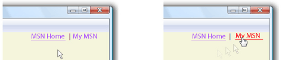

# HOW TO：指定超連結是否要加上底線
<xref:System.Windows.Documents.Hyperlink>物件是內嵌層級非固定格式內容項目，可讓您將非固定格式內容內超連結。 根據預設，<xref:System.Windows.Documents.Hyperlink>使用<xref:System.Windows.TextDecoration>物件，以顯示底線。 <xref:System.Windows.TextDecoration> 物件可以具現化，需要大量的效能，特別是如果您有許多<xref:System.Windows.Documents.Hyperlink>物件。 若要大量使用<xref:System.Windows.Documents.Hyperlink>項目，您可能要考慮這類觸發事件時，才顯示底線<xref:System.Windows.ContentElement.MouseEnter>事件。  
  
 在下列範例中，「 我的 MSN 」 連結，底線是動態的它才會出現<xref:System.Windows.ContentElement.MouseEnter>觸發事件。  
  
   
定義與 Textdecoration 的超連結  
  
## 範例  
 下列標記範例示範<xref:System.Windows.Documents.Hyperlink>定義不含底線與：  
  
 [!code-xaml[Performance#PerformanceSnippet11](~/samples/snippets/csharp/VS_Snippets_Wpf/Performance/CSharp/Hyperlink.xaml#performancesnippet11)]  
  
 下列程式碼範例示範如何建立如底線<xref:System.Windows.Documents.Hyperlink>上<xref:System.Windows.ContentElement.MouseEnter>事件，並將它移除上<xref:System.Windows.ContentElement.MouseLeave>事件。  
  
 [!code-csharp[Performance#PerformanceSnippet15](~/samples/snippets/csharp/VS_Snippets_Wpf/Performance/CSharp/Hyperlink.xaml.cs#performancesnippet15)]
 [!code-vb[Performance#PerformanceSnippet15](~/samples/snippets/visualbasic/VS_Snippets_Wpf/Performance/visualbasic/hyperlink.xaml.vb#performancesnippet15)]  
  
## 另請參閱
- <xref:System.Windows.TextDecoration>
- <xref:System.Windows.Documents.Hyperlink>
- [最佳化 WPF 應用程式效能](optimizing-wpf-application-performance.md)
- [建立文字裝飾](how-to-create-a-text-decoration.md)
