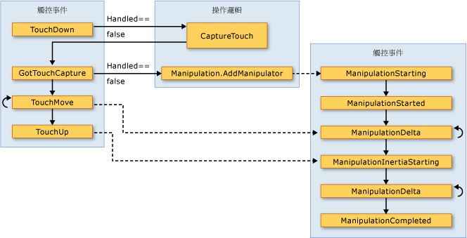

# 輸入概觀Input Overview
 [!INCLUDE[TLA#tla_winclient](../../../../includes/tlasharptla-winclient-md.md)] 子系統提供一個功能強大的 [!INCLUDE[TLA#tla_api](../../../../includes/tlasharptla-api-md.md)]，以取得來自各種裝置的輸入，包括滑鼠、鍵盤、觸控和手寫筆。 The[!INCLUDE[TLA#tla_winclient](../../../../includes/tlasharptla-winclient-md.md)] subsystem provides a powerful [!INCLUDE[TLA#tla_api](../../../../includes/tlasharptla-api-md.md)] for obtaining input from a variety of devices, including the mouse, keyboard, touch, and stylus. 本主題描述 [!INCLUDE[TLA2#tla_winclient](../../../../includes/tla2sharptla-winclient-md.md)] 所提供的服務，以及說明輸入系統的架構。This topic describes the services provided by [!INCLUDE[TLA2#tla_winclient](../../../../includes/tla2sharptla-winclient-md.md)] and explains the architecture of the input systems.  
  
  
   
## 輸入 APIInput API  
 主要輸入[!INCLUDE[TLA2#tla_api](../../../../includes/tla2sharptla-api-md.md)]暴露在基底項目類別中找到： <xref:System.Windows.UIElement>， <xref:System.Windows.ContentElement>， <xref:System.Windows.FrameworkElement>，和<xref:System.Windows.FrameworkContentElement>。The primary input [!INCLUDE[TLA2#tla_api](../../../../includes/tla2sharptla-api-md.md)] exposure is found on the base element classes: <xref:System.Windows.UIElement>, <xref:System.Windows.ContentElement>, <xref:System.Windows.FrameworkElement>, and <xref:System.Windows.FrameworkContentElement>.  如需基底項目的詳細資訊，請參閱[基底項目概觀](../../../../docs/framework/wpf/advanced/base-elements-overview.md)。For more information about the base elements, see [Base Elements Overview](../../../../docs/framework/wpf/advanced/base-elements-overview.md).  這些類別提供按鍵動作、滑鼠按鈕、滑鼠滾輪、滑鼠移動、焦點管理和滑鼠捕捉等相關輸入事件的功能。These classes provide functionality for input events related to key presses, mouse buttons, mouse wheel, mouse movement, focus management, and mouse capture, to name a few. 將輸入 [!INCLUDE[TLA2#tla_api](../../../../includes/tla2sharptla-api-md.md)] 放在基底項目上，而不是將所有輸入事件作為服務，輸入架構可讓輸入事件成為 UI 中的特定物件來源，以及支援事件路由傳送，進而讓多個項目可以處理輸入事件。By placing the input [!INCLUDE[TLA2#tla_api](../../../../includes/tla2sharptla-api-md.md)] on the base elements, rather than treating all input events as a service, the input architecture enables the input events to be sourced by a particular object in the UI, and to support an event routing scheme whereby more than one element has an opportunity to handle an input event. 許多輸入事件都有一組與其建立關聯的事件。Many input events have a pair of events associated with them.  例如，向下事件索引鍵相關聯<xref:System.Windows.Input.Keyboard.KeyDown>和<xref:System.Windows.Input.Keyboard.PreviewKeyDown>事件。For example, the key down event is associated with the <xref:System.Windows.Input.Keyboard.KeyDown> and <xref:System.Windows.Input.Keyboard.PreviewKeyDown> events.  這些事件的差異在於如何將它們路由傳送至目標項目。The difference in these events is in how they are routed to the target element.  預覽事件會從根項目到目標項目往下瀏覽通道項目樹狀結構。Preview events tunnel down the element tree from the root element to the target element.  事件反昇事件會從目標項目往上反昇到根項目。Bubbling events bubble up from the target element to the root element.  這個概觀和[路由事件概觀](../../../../docs/framework/wpf/advanced/routed-events-overview.md)稍後會更詳細討論 [!INCLUDE[TLA2#tla_winclient](../../../../includes/tla2sharptla-winclient-md.md)] 中的事件路由。Event routing in [!INCLUDE[TLA2#tla_winclient](../../../../includes/tla2sharptla-winclient-md.md)] is discussed in more detail later in this overview and in the [Routed Events Overview](../../../../docs/framework/wpf/advanced/routed-events-overview.md).  
  
### 鍵盤和滑鼠類別Keyboard and Mouse Classes  
 除了輸入[!INCLUDE[TLA2#tla_api](../../../../includes/tla2sharptla-api-md.md)]基底項目類別，<xref:System.Windows.Input.Keyboard>類別和<xref:System.Windows.Input.Mouse>類別會提供其他[!INCLUDE[TLA2#tla_api](../../../../includes/tla2sharptla-api-md.md)]處理鍵盤和滑鼠輸入。In addition to the input [!INCLUDE[TLA2#tla_api](../../../../includes/tla2sharptla-api-md.md)] on the base element classes, the <xref:System.Windows.Input.Keyboard> class and <xref:System.Windows.Input.Mouse> classes provide additional [!INCLUDE[TLA2#tla_api](../../../../includes/tla2sharptla-api-md.md)] for working with keyboard and mouse input.  
  
 輸入的範例[!INCLUDE[TLA2#tla_api](../../../../includes/tla2sharptla-api-md.md)]上<xref:System.Windows.Input.Keyboard>類別<xref:System.Windows.Input.Keyboard.Modifiers%2A>屬性，它會傳回<xref:System.Windows.Input.ModifierKeys>目前已按下而<xref:System.Windows.Input.Keyboard.IsKeyDown%2A>方法，可判斷是否要按下指定的索引鍵。Examples of input [!INCLUDE[TLA2#tla_api](../../../../includes/tla2sharptla-api-md.md)] on the <xref:System.Windows.Input.Keyboard> class are the <xref:System.Windows.Input.Keyboard.Modifiers%2A> property, which returns the <xref:System.Windows.Input.ModifierKeys> currently pressed, and the <xref:System.Windows.Input.Keyboard.IsKeyDown%2A> method, which determines whether a specified key is pressed.  
  
 下列範例會使用<xref:System.Windows.Input.Keyboard.GetKeyStates%2A>方法來判斷<xref:System.Windows.Input.Key>處於關閉狀態。The following example uses the <xref:System.Windows.Input.Keyboard.GetKeyStates%2A> method to determine if a <xref:System.Windows.Input.Key> is in the down state.  
  
 [!code-csharp[keyargssnippetsample#KeyEventArgsKeyBoardGetKeyStates](../../../../samples/snippets/csharp/VS_Snippets_Wpf/KeyArgsSnippetSample/CSharp/Window1.xaml.cs#keyeventargskeyboardgetkeystates)]
 [!code-vb[keyargssnippetsample#KeyEventArgsKeyBoardGetKeyStates](../../../../samples/snippets/visualbasic/VS_Snippets_Wpf/KeyArgsSnippetSample/visualbasic/window1.xaml.vb#keyeventargskeyboardgetkeystates)]  
  
 輸入的範例[!INCLUDE[TLA2#tla_api](../../../../includes/tla2sharptla-api-md.md)]上<xref:System.Windows.Input.Mouse>類別<xref:System.Windows.Input.Mouse.MiddleButton%2A>，從中取得滑鼠中間按鈕的狀態和<xref:System.Windows.Input.Mouse.DirectlyOver%2A>，此 cmdlet 會取得項目將滑鼠指標位於目前。Examples of input [!INCLUDE[TLA2#tla_api](../../../../includes/tla2sharptla-api-md.md)] on the <xref:System.Windows.Input.Mouse> class are <xref:System.Windows.Input.Mouse.MiddleButton%2A>, which obtains the state of the middle mouse button, and <xref:System.Windows.Input.Mouse.DirectlyOver%2A>, which gets the element the mouse pointer is currently over.  
  
 下列範例會判斷是否<xref:System.Windows.Input.Mouse.LeftButton%2A>滑鼠上處於<xref:System.Windows.Input.MouseButtonState.Pressed>狀態。The following example determines whether the <xref:System.Windows.Input.Mouse.LeftButton%2A> on the mouse is in the <xref:System.Windows.Input.MouseButtonState.Pressed> state.  
  
 [!code-csharp[mouserelatedsnippets#MouseRelatedSnippetsGetLeftButtonMouse](../../../../samples/snippets/csharp/VS_Snippets_Wpf/MouseRelatedSnippets/CSharp/Window1.xaml.cs#mouserelatedsnippetsgetleftbuttonmouse)]
 [!code-vb[mouserelatedsnippets#MouseRelatedSnippetsGetLeftButtonMouse](../../../../samples/snippets/visualbasic/VS_Snippets_Wpf/MouseRelatedSnippets/visualbasic/window1.xaml.vb#mouserelatedsnippetsgetleftbuttonmouse)]  
  
 <xref:System.Windows.Input.Mouse>和<xref:System.Windows.Input.Keyboard>類別涵蓋整個本概觀中詳述。The <xref:System.Windows.Input.Mouse> and <xref:System.Windows.Input.Keyboard> classes are covered in more detail throughout this overview.  
  
### 手寫筆輸入Stylus Input  
 [!INCLUDE[TLA2#tla_winclient](../../../../includes/tla2sharptla-winclient-md.md)]擁有其整合式支援<xref:System.Windows.Input.Stylus>。 has integrated support for the <xref:System.Windows.Input.Stylus>.  <xref:System.Windows.Input.Stylus>是畫筆輸入所做的熱門[!INCLUDE[TLA#tla_tpc](../../../../includes/tlasharptla-tpc-md.md)]。The <xref:System.Windows.Input.Stylus> is a pen input made popular by the [!INCLUDE[TLA#tla_tpc](../../../../includes/tlasharptla-tpc-md.md)].  [!INCLUDE[TLA2#tla_winclient](../../../../includes/tla2sharptla-winclient-md.md)] 應用程式可以使用滑鼠 [!INCLUDE[TLA2#tla_api](../../../../includes/tla2sharptla-api-md.md)] 來將手寫筆視為滑鼠，但是 [!INCLUDE[TLA2#tla_winclient](../../../../includes/tla2sharptla-winclient-md.md)] 也會公開手寫筆裝置抽象概念，其使用的模型類似鍵盤和滑鼠。 applications can treat the stylus as a mouse by using the mouse [!INCLUDE[TLA2#tla_api](../../../../includes/tla2sharptla-api-md.md)], but [!INCLUDE[TLA2#tla_winclient](../../../../includes/tla2sharptla-winclient-md.md)] also exposes a stylus device abstraction that use a model similar to the keyboard and mouse.  所有手寫筆相關的 [!INCLUDE[TLA2#tla_api#plural](../../../../includes/tla2sharptla-apisharpplural-md.md)] 都會包含 "Stylus" 這個單字。All stylus-related [!INCLUDE[TLA2#tla_api#plural](../../../../includes/tla2sharptla-apisharpplural-md.md)] contain the word "Stylus".  
  
 因為手寫筆可以當作滑鼠，所以只支援滑鼠輸入的應用程式仍然可以自動取得某種程度的手寫筆支援。Because the stylus can act as a mouse, applications that support only mouse input can still obtain some level of stylus support automatically. 以這種方式使用手寫筆時，應用程式可以處理適當的手寫筆事件，然後處理對應的滑鼠事件。When the stylus is used in such a manner, the application is given the opportunity to handle the appropriate stylus event and then handles the corresponding mouse event. 此外，還可以透過手寫筆裝置抽象概念來取得筆跡輸入這類較高階服務。In addition, higher-level services such as ink input are also available through the stylus device abstraction.  如需將筆跡作為輸入的詳細資訊，請參閱[筆跡入門](../../../../docs/framework/wpf/advanced/getting-started-with-ink.md)。For more information about ink as input, see [Getting Started with Ink](../../../../docs/framework/wpf/advanced/getting-started-with-ink.md).  
  
   
## 事件路由Event Routing  
 A<xref:System.Windows.FrameworkElement>可以包含其他項目，做為其內容模型中，進而形成樹狀項目子系項目。A <xref:System.Windows.FrameworkElement> can contain other elements as child elements in its content model, forming a tree of elements.  在 [!INCLUDE[TLA2#tla_winclient](../../../../includes/tla2sharptla-winclient-md.md)] 中，父項目可以透過處理事件，來參與導向至其子項目或其他子系的輸入。In [!INCLUDE[TLA2#tla_winclient](../../../../includes/tla2sharptla-winclient-md.md)], the parent element can participate in input directed to its child elements or other descendants by handing events. 這特別適用於透過較小的控制項來建置控制項，即稱為「控制項組合」或「組合」的程序。This is especially useful for building controls out of smaller controls, a process known as "control composition" or "compositing." 如需項目樹狀結構以及項目樹狀結構與事件路由間之關聯性的詳細資訊，請參閱 [WPF 中的樹狀結構](../../../../docs/framework/wpf/advanced/trees-in-wpf.md)。For more information about element trees and how element trees relate to event routes, see [Trees in WPF](../../../../docs/framework/wpf/advanced/trees-in-wpf.md).  
  
 事件路由是將事件轉遞至多個項目的程序，因此，沿著路由的特定物件或項目可以選擇將重大回應提供給不同項目可能設為來源的事件 (透過處理)。Event routing is the process of forwarding events to multiple elements, so that a particular object or element along the route can choose to offer a significant response (through handling) to an event that might have been sourced by a different element.  路由事件使用三種路由機制中的其中一種︰直接、事件反昇和通道。Routed events use one of three routing mechanisms: direct, bubbling, and tunneling.  在直接路由中，來源項目是唯一收到通知的項目，而且不會將事件路由傳送至任何其他項目。In direct routing, the source element is the only element notified, and the event is not routed to any other elements. 不過，直接路由事件仍會提供只有路由事件才能使用的一些額外功能，而不是標準 [!INCLUDE[TLA2#tla_clr](../../../../includes/tla2sharptla-clr-md.md)] 事件。However, the direct routed event still offers some additional capabilities that are only present for routed events as opposed to standard [!INCLUDE[TLA2#tla_clr](../../../../includes/tla2sharptla-clr-md.md)] events. 事件反昇處理項目樹狀結構的方式是先通知將事件設為來源的項目，接著通知父項目，依此類推。Bubbling works up the element tree by first notifying the element that sourced the event, then the parent element, and so on.  通道會從項目樹狀結構的根項目開始，然後往下進行，並結束於原始來源項目。Tunneling starts at the root of the element tree and works down, ending with the original source element.  如需路由事件的詳細資訊，請參閱[路由事件概觀](../../../../docs/framework/wpf/advanced/routed-events-overview.md)。For more information about routed events, see [Routed Events Overview](../../../../docs/framework/wpf/advanced/routed-events-overview.md).  
  
 [!INCLUDE[TLA2#tla_winclient](../../../../includes/tla2sharptla-winclient-md.md)] 輸入事件一般會成對出現，而此配對包含通道事件和事件反昇事件。 input events generally come in pairs that consists of a tunneling event and a bubbling event.  通道事件與事件反昇事件的區別在於 "Preview" 前置詞。Tunneling events are distinguished from bubbling events with the "Preview" prefix.  比方說，<xref:System.Windows.Input.Mouse.PreviewMouseMove>滑鼠移動事件通道版本和<xref:System.Windows.Input.Mouse.MouseMove>是反昇的版本，此事件。For instance, <xref:System.Windows.Input.Mouse.PreviewMouseMove> is the tunneling version of a mouse move event and <xref:System.Windows.Input.Mouse.MouseMove> is the bubbling version of this event. 事件配對是一項在項目層級實作的慣例，而不是 [!INCLUDE[TLA2#tla_winclient](../../../../includes/tla2sharptla-winclient-md.md)] 事件系統的一項固有功能。This event pairing is a convention that is implemented at the element level and is not an inherent capability of the [!INCLUDE[TLA2#tla_winclient](../../../../includes/tla2sharptla-winclient-md.md)] event system. 如需詳細資訊，請參閱[路由事件概觀](../../../../docs/framework/wpf/advanced/routed-events-overview.md)中的＜WPF 輸入事件＞一節。For details, see the WPF Input Events section in [Routed Events Overview](../../../../docs/framework/wpf/advanced/routed-events-overview.md).  
  
   
## 處理輸入事件Handling Input Events  
 若要接收項目的輸入，事件處理常式必須與該特定事件建立關聯。To receive input on an element, an event handler must be associated with that particular event.  在 [!INCLUDE[TLA2#tla_xaml](../../../../includes/tla2sharptla-xaml-md.md)] 中，這相當簡單︰您可以參考事件名稱作為將接聽此事件之項目的屬性。In [!INCLUDE[TLA2#tla_xaml](../../../../includes/tla2sharptla-xaml-md.md)] this is straightforward: you reference the name of the event as an attribute of the element that will be listening for this event.  然後，您可以根據委派，將屬性的值設定為您所定義之事件處理常式的名稱。Then, you set the value of the attribute to the name of the event handler that you define, based on a delegate.  事件處理常式必須使用 [!INCLUDE[TLA#tla_cshrp](../../../../includes/tlasharptla-cshrp-md.md)] 這類程式碼進行撰寫，而且可以包含在程式碼後置檔案中。The event handler must be written in code such as [!INCLUDE[TLA#tla_cshrp](../../../../includes/tlasharptla-cshrp-md.md)] and can be included in a code-behind file.  
  
 作業系統報告在鍵盤焦點位於項目時所發生的按鍵動作時，會發生鍵盤事件。Keyboard events occur when the operating system reports key actions that occur while keyboard focus is on an element. 滑鼠和手寫筆事件各分為兩個分類︰報告相對於項目之指標位置變更的事件，以及報告裝置按鈕狀態變更的事件。Mouse and stylus events each fall into two categories: events that report changes in pointer position relative to the element, and events that report changes in the state of device buttons.  
  
### 鍵盤輸入事件範例Keyboard Input Event Example  
 下列範例會接聽按下向左鍵作業。The following example listens for a left arrow key press.  A<xref:System.Windows.Controls.StackPanel>會建立具有<xref:System.Windows.Controls.Button>。A <xref:System.Windows.Controls.StackPanel> is created that has a <xref:System.Windows.Controls.Button>.  事件處理常式來接聽向的左鍵按下按鍵會附加至<xref:System.Windows.Controls.Button>執行個體。An event handler to listen for the left arrow key press is attached to the <xref:System.Windows.Controls.Button> instance.  
  
 此範例的第一個區段會建立<xref:System.Windows.Controls.StackPanel>和<xref:System.Windows.Controls.Button>，並將附加的事件處理常式<xref:System.Windows.UIElement.KeyDown>。The first section of the example creates the <xref:System.Windows.Controls.StackPanel> and the <xref:System.Windows.Controls.Button> and attaches the event handler for the <xref:System.Windows.UIElement.KeyDown>.  
  
 [!code-xaml[InputOvw#Input_OvwKeyboardExampleXAML](../../../../samples/snippets/csharp/VS_Snippets_Wpf/InputOvw/CSharp/Page1.xaml#input_ovwkeyboardexamplexaml)]  
  
 [!code-csharp[InputOvw#Input_OvwKeyboardExampleUICodeBehind](../../../../samples/snippets/csharp/VS_Snippets_Wpf/InputOvw/CSharp/Page1.xaml.cs#input_ovwkeyboardexampleuicodebehind)]
 [!code-vb[InputOvw#Input_OvwKeyboardExampleUICodeBehind](../../../../samples/snippets/visualbasic/VS_Snippets_Wpf/InputOvw/VisualBasic/Page1.xaml.vb#input_ovwkeyboardexampleuicodebehind)]  
  
 第二個區段是使用程式碼所撰寫，並定義事件處理常式。The second section is written in code and defines the event handler.  當按下向的左鍵和<xref:System.Windows.Controls.Button>具有鍵盤焦點，執行此處理常式和<xref:System.Windows.Controls.Control.Background%2A>色彩<xref:System.Windows.Controls.Button>變更。When the left arrow key is pressed and the <xref:System.Windows.Controls.Button> has keyboard focus, the handler runs and the <xref:System.Windows.Controls.Control.Background%2A> color of the <xref:System.Windows.Controls.Button> is changed.  如果按下按鍵，但它不是向的左鍵<xref:System.Windows.Controls.Control.Background%2A>色彩<xref:System.Windows.Controls.Button>變更回其開始色彩。If the key is pressed, but it is not the left arrow key, the <xref:System.Windows.Controls.Control.Background%2A> color of the <xref:System.Windows.Controls.Button> is changed back to its starting color.  
  
 [!code-csharp[InputOvw#Input_OvwKeyboardExampleHandlerCodeBehind](../../../../samples/snippets/csharp/VS_Snippets_Wpf/InputOvw/CSharp/Page1.xaml.cs#input_ovwkeyboardexamplehandlercodebehind)]
 [!code-vb[InputOvw#Input_OvwKeyboardExampleHandlerCodeBehind](../../../../samples/snippets/visualbasic/VS_Snippets_Wpf/InputOvw/VisualBasic/Page1.xaml.vb#input_ovwkeyboardexamplehandlercodebehind)]  
  
### 滑鼠輸入事件範例Mouse Input Event Example  
 在下列範例中，<xref:System.Windows.Controls.Control.Background%2A>色彩<xref:System.Windows.Controls.Button>變更時，滑鼠指標進入<xref:System.Windows.Controls.Button>。In the following example, the <xref:System.Windows.Controls.Control.Background%2A> color of a <xref:System.Windows.Controls.Button> is changed when the mouse pointer enters the <xref:System.Windows.Controls.Button>.  <xref:System.Windows.Controls.Control.Background%2A>色彩還原當滑鼠離開<xref:System.Windows.Controls.Button>。The <xref:System.Windows.Controls.Control.Background%2A> color is restored when the mouse leaves the <xref:System.Windows.Controls.Button>.  
  
 此範例的第一個區段會建立<xref:System.Windows.Controls.StackPanel>和<xref:System.Windows.Controls.Button>控制，並將附加的事件處理常式<xref:System.Windows.UIElement.MouseEnter>和<xref:System.Windows.UIElement.MouseLeave>事件<xref:System.Windows.Controls.Button>。The first section of the example creates the <xref:System.Windows.Controls.StackPanel> and the <xref:System.Windows.Controls.Button> control and attaches the event handlers for the <xref:System.Windows.UIElement.MouseEnter> and <xref:System.Windows.UIElement.MouseLeave> events to the <xref:System.Windows.Controls.Button>.  
  
 [!code-xaml[InputOvw#Input_OvwMouseExampleXAML](../../../../samples/snippets/csharp/VS_Snippets_Wpf/InputOvw/CSharp/Page1.xaml#input_ovwmouseexamplexaml)]  
  
 [!code-csharp[InputOvw#Input_OvwMouseExampleUICodeBehind](../../../../samples/snippets/csharp/VS_Snippets_Wpf/InputOvw/CSharp/Page1.xaml.cs#input_ovwmouseexampleuicodebehind)]
 [!code-vb[InputOvw#Input_OvwMouseExampleUICodeBehind](../../../../samples/snippets/visualbasic/VS_Snippets_Wpf/InputOvw/VisualBasic/Page1.xaml.vb#input_ovwmouseexampleuicodebehind)]  
  
 此範例的第二個區段是使用程式碼所撰寫，並定義事件處理常式。The second section of the example is written in code and defines the event handlers.  當滑鼠進入<xref:System.Windows.Controls.Button>、<xref:System.Windows.Controls.Control.Background%2A>色彩<xref:System.Windows.Controls.Button>變更為<xref:System.Windows.Media.Brushes.SlateGray%2A>。When the mouse enters the <xref:System.Windows.Controls.Button>, the <xref:System.Windows.Controls.Control.Background%2A> color of the <xref:System.Windows.Controls.Button> is changed to <xref:System.Windows.Media.Brushes.SlateGray%2A>.  當滑鼠離開<xref:System.Windows.Controls.Button>、<xref:System.Windows.Controls.Control.Background%2A>色彩<xref:System.Windows.Controls.Button>變回<xref:System.Windows.Media.Brushes.AliceBlue%2A>。When the mouse leaves the <xref:System.Windows.Controls.Button>, the <xref:System.Windows.Controls.Control.Background%2A> color of the <xref:System.Windows.Controls.Button> is changed back to <xref:System.Windows.Media.Brushes.AliceBlue%2A>.  
  
 [!code-csharp[InputOvw#Input_OvwMouseExampleEneterHandler](../../../../samples/snippets/csharp/VS_Snippets_Wpf/InputOvw/CSharp/Page1.xaml.cs#input_ovwmouseexampleeneterhandler)]
 [!code-vb[InputOvw#Input_OvwMouseExampleEneterHandler](../../../../samples/snippets/visualbasic/VS_Snippets_Wpf/InputOvw/VisualBasic/Page1.xaml.vb#input_ovwmouseexampleeneterhandler)]  
  
 [!code-csharp[InputOvw#Input_OvwMouseExampleLeaveHandler](../../../../samples/snippets/csharp/VS_Snippets_Wpf/InputOvw/CSharp/Page1.xaml.cs#input_ovwmouseexampleleavehandler)]
 [!code-vb[InputOvw#Input_OvwMouseExampleLeaveHandler](../../../../samples/snippets/visualbasic/VS_Snippets_Wpf/InputOvw/VisualBasic/Page1.xaml.vb#input_ovwmouseexampleleavehandler)]  
  
   
## 文字輸入Text Input  
 <xref:System.Windows.ContentElement.TextInput>事件可讓您聆聽文字輸入與裝置無關的方式。The <xref:System.Windows.ContentElement.TextInput> event enables you to listen for text input in a device-independent manner. 鍵盤是文字輸入的主要方法，但是語音、手寫和其他輸入裝置也可以產生文字輸入。The keyboard is the primary means of text input, but speech, handwriting, and other input devices can generate text input also.  
  
 鍵盤輸入[!INCLUDE[TLA2#tla_winclient](../../../../includes/tla2sharptla-winclient-md.md)]首先會傳送適當<xref:System.Windows.ContentElement.KeyDown> / <xref:System.Windows.ContentElement.KeyUp>事件。For keyboard input, [!INCLUDE[TLA2#tla_winclient](../../../../includes/tla2sharptla-winclient-md.md)] first sends the appropriate <xref:System.Windows.ContentElement.KeyDown>/<xref:System.Windows.ContentElement.KeyUp> events. 若未處理的事件索引鍵是文字而不是 （方向箭號之類的控制項金鑰） 或功能鍵，則<xref:System.Windows.ContentElement.TextInput>就會引發事件。If those events are not handled and the key is textual (rather than a control key such as directional arrows or function keys), then a <xref:System.Windows.ContentElement.TextInput> event is raised.  不一定會簡單的一對一對應之間<xref:System.Windows.ContentElement.KeyDown> / <xref:System.Windows.ContentElement.KeyUp>和<xref:System.Windows.ContentElement.TextInput>事件，因此多個按鍵可以產生單一字元的文字輸入單一按鍵可以產生多字元字串。There is not always a simple one-to-one mapping between <xref:System.Windows.ContentElement.KeyDown>/<xref:System.Windows.ContentElement.KeyUp> and <xref:System.Windows.ContentElement.TextInput> events because multiple keystrokes can generate a single character of text input and single keystrokes can generate multi-character strings.  這特別適用於中文、日文和韓文這類語言，而這類語言使用 [!INCLUDE[TLA#tla_ime#plural](../../../../includes/tlasharptla-imesharpplural-md.md)] 來產生其對應字母的數千個可能字元。This is especially true for languages such as Chinese, Japanese, and Korean which use [!INCLUDE[TLA#tla_ime#plural](../../../../includes/tlasharptla-imesharpplural-md.md)] to generate the thousands of possible characters in their corresponding alphabets.  
  
 當[!INCLUDE[TLA2#tla_winclient](../../../../includes/tla2sharptla-winclient-md.md)]傳送<xref:System.Windows.ContentElement.KeyUp> / <xref:System.Windows.ContentElement.KeyDown>事件，<xref:System.Windows.Input.KeyEventArgs.Key%2A>設為<xref:System.Windows.Input.Key.System?displayProperty=nameWithType>如果按鍵動作可能會變得一部分<xref:System.Windows.ContentElement.TextInput>（ALT + S 按下時，例如） 的事件。When [!INCLUDE[TLA2#tla_winclient](../../../../includes/tla2sharptla-winclient-md.md)] sends a <xref:System.Windows.ContentElement.KeyUp>/<xref:System.Windows.ContentElement.KeyDown> event, <xref:System.Windows.Input.KeyEventArgs.Key%2A> is set to <xref:System.Windows.Input.Key.System?displayProperty=nameWithType> if the keystrokes could become part of a <xref:System.Windows.ContentElement.TextInput> event (if ALT+S is pressed, for example). 這可讓程式碼中的<xref:System.Windows.ContentElement.KeyDown>事件處理常式，以檢查<xref:System.Windows.Input.Key.System?displayProperty=nameWithType>而且，如果找到，保留之後引發的處理常式的處理<xref:System.Windows.ContentElement.TextInput>事件。This allows code in a <xref:System.Windows.ContentElement.KeyDown> event handler to check for <xref:System.Windows.Input.Key.System?displayProperty=nameWithType> and, if found, leave processing for the handler of the subsequently raised <xref:System.Windows.ContentElement.TextInput> event. 在這些情況下的各種屬性<xref:System.Windows.Input.TextCompositionEventArgs>引數可以用來判斷原始的按鍵輸入。In these cases, the various properties of the <xref:System.Windows.Input.TextCompositionEventArgs> argument can be used to determine the original keystrokes. 同樣地，如果[!INCLUDE[TLA2#tla_ime](../../../../includes/tla2sharptla-ime-md.md)]為作用中，<xref:System.Windows.Input.Key>值為<xref:System.Windows.Input.Key.ImeProcessed?displayProperty=nameWithType>，和<xref:System.Windows.Input.KeyEventArgs.ImeProcessedKey%2A>提供原始按鍵輸入。Similarly, if an [!INCLUDE[TLA2#tla_ime](../../../../includes/tla2sharptla-ime-md.md)] is active, <xref:System.Windows.Input.Key> has the value of <xref:System.Windows.Input.Key.ImeProcessed?displayProperty=nameWithType>, and <xref:System.Windows.Input.KeyEventArgs.ImeProcessedKey%2A> gives the original keystroke or keystrokes.  
  
 下列範例會定義的處理常式<xref:System.Windows.Controls.Primitives.ButtonBase.Click>事件和處理常式<xref:System.Windows.UIElement.KeyDown>事件。The following example defines a handler for the <xref:System.Windows.Controls.Primitives.ButtonBase.Click> event and a handler for the <xref:System.Windows.UIElement.KeyDown> event.  
  
 程式碼或標記的第一個區段會建立使用者介面。The first segment of code or markup creates the user interface.  
  
 [!code-xaml[InputOvw#Input_OvwTextInputXAML](../../../../samples/snippets/csharp/VS_Snippets_Wpf/InputOvw/CSharp/Page1.xaml#input_ovwtextinputxaml)]  
  
 [!code-csharp[InputOvw#Input_OvwTextInputUICodeBehind](../../../../samples/snippets/csharp/VS_Snippets_Wpf/InputOvw/CSharp/Page1.xaml.cs#input_ovwtextinputuicodebehind)]
 [!code-vb[InputOvw#Input_OvwTextInputUICodeBehind](../../../../samples/snippets/visualbasic/VS_Snippets_Wpf/InputOvw/VisualBasic/Page1.xaml.vb#input_ovwtextinputuicodebehind)]  
  
 程式碼的第二個區段包含事件處理常式。The second segment of code contains the event handlers.  
  
 [!code-csharp[InputOvw#Input_OvwTextInputHandlersCodeBehind](../../../../samples/snippets/csharp/VS_Snippets_Wpf/InputOvw/CSharp/Page1.xaml.cs#input_ovwtextinputhandlerscodebehind)]
 [!code-vb[InputOvw#Input_OvwTextInputHandlersCodeBehind](../../../../samples/snippets/visualbasic/VS_Snippets_Wpf/InputOvw/VisualBasic/Page1.xaml.vb#input_ovwtextinputhandlerscodebehind)]  
  
 輸入的事件反昇事件路由，因為<xref:System.Windows.Controls.StackPanel>接收的輸入無論哪個項目具有鍵盤焦點。Because input events bubble up the event route, the <xref:System.Windows.Controls.StackPanel> receives the input regardless of which element has keyboard focus. <xref:System.Windows.Controls.TextBox>控制項第一次收到通知和`OnTextInputKeyDown`才會呼叫處理常式<xref:System.Windows.Controls.TextBox>並未處理輸入。The <xref:System.Windows.Controls.TextBox> control is notified first and the `OnTextInputKeyDown` handler is called only if the <xref:System.Windows.Controls.TextBox> did not handle the input. 如果<xref:System.Windows.UIElement.PreviewKeyDown>而不是使用事件<xref:System.Windows.UIElement.KeyDown>事件，`OnTextInputKeyDown`會先呼叫處理常式。If the <xref:System.Windows.UIElement.PreviewKeyDown> event is used instead of the <xref:System.Windows.UIElement.KeyDown> event, the `OnTextInputKeyDown` handler is called first.  
  
 在此範例中，處理邏輯會撰寫兩次：一次針對 CTRL+O，一次則是針對按鈕的 Click 事件。In this example, the handling logic is written two times—one time for CTRL+O, and again for button's click event. 這可以使用命令進行簡化，而不是直接處理輸入事件。This can be simplified by using commands, instead of handling the input events directly.  這個概觀和[命令概觀](../../../../docs/framework/wpf/advanced/commanding-overview.md)討論命令。Commands are discussed in this overview and in [Commanding Overview](../../../../docs/framework/wpf/advanced/commanding-overview.md).  
  
   
## 觸控和操作Touch and Manipulation  
 Windows 7 作業系統中的新硬體和 API 讓應用程式可以同時接收來自多個觸控的輸入。New hardware and API in the Windows 7 operating system provide applications the ability to receive input from multiple touches simultaneously. [!INCLUDE[TLA2#tla_winclient](../../../../includes/tla2sharptla-winclient-md.md)] 可讓應用程式在發生觸控時引發事件，以透過回應其他輸入 (例如滑鼠或鍵盤) 的類似方式來偵測和回應觸控。 enables applications to detect and respond to touch in a manner similar to responding to other input, such as the mouse or keyboard, by raising events when touch occurs.  
  
 [!INCLUDE[TLA2#tla_winclient](../../../../includes/tla2sharptla-winclient-md.md)] 會在觸控發生時公開兩種類型的事件︰觸控事件和操作事件。 exposes two types of events when touch occurs: touch events and manipulation events. 觸控事件提供觸控式螢幕上每根手指的未經處理資料和其移動。Touch events provide raw data about each finger on a touchscreen and its movement. 操作事件會將輸入解譯成特定動作。Manipulation events interpret the input as certain actions. 本節討論這兩種類型的事件。Both types of events are discussed in this section.  
  
### 必要條件Prerequisites  
 您需要下列元件，才能開發回應觸控的應用程式。You need the following components to develop an application that responds to touch.  
  
-   [!INCLUDE[vs_dev10_ext](../../../../includes/vs-dev10-ext-md.md)]..  
  
-   Windows 7。Windows 7.  
  
-   支援 Windows Touch 的觸控式螢幕這類裝置。A device, such as a touchscreen, that supports Windows Touch.  
  
### 用語Terminology  
 討論觸控時，會使用下列詞彙。The following terms are used when touch is discussed.  
  
-   **觸控**是 Windows 7 可辨識的一種使用者輸入類型。**Touch** is a type of user input that is recognized by Windows 7. 通常，將手指放在觸控式螢幕上，就會起始觸控。Usually, touch is initiated by putting fingers on a touch-sensitive screen. 請注意，如果裝置只會將手指的位置和移動轉換為滑鼠輸入，則膝上型電腦上常見的觸控板這類裝置不支援觸控。Note that devices such as a touchpad that is common on laptop computers do not support touch if the device merely converts the finger's position and movement as mouse input.  
  
-   **多點觸控**是同時從多點發生的觸控。**Multitouch** is touch that occurs from more than one point simultaneously. Windows 7 和 [!INCLUDE[TLA2#tla_winclient](../../../../includes/tla2sharptla-winclient-md.md)] 支援多點觸控。Windows 7 and [!INCLUDE[TLA2#tla_winclient](../../../../includes/tla2sharptla-winclient-md.md)] supports multitouch. 只要 [!INCLUDE[TLA2#tla_winclient](../../../../includes/tla2sharptla-winclient-md.md)] 文件討論觸控，這些概念就適用於多點觸控。Whenever touch is discussed in the documentation for [!INCLUDE[TLA2#tla_winclient](../../../../includes/tla2sharptla-winclient-md.md)], the concepts apply to multitouch.  
  
-   將觸控解譯為套用至物件的實體動作時，會發生**操作**。A **manipulation** occurs when touch is interpreted as a physical action that is applied to an object. 在 [!INCLUDE[TLA2#tla_winclient](../../../../includes/tla2sharptla-winclient-md.md)] 中，操作事件會將輸入解譯為平移、擴充或旋轉操作。In [!INCLUDE[TLA2#tla_winclient](../../../../includes/tla2sharptla-winclient-md.md)], manipulation events interpret input as a translation, expansion, or rotation manipulation.  
  
-   `touch device` 所代表的裝置會產生觸控式螢幕上的一根手指這類觸控輸入。A `touch device` represents a device that produces touch input, such as a single finger on a touchscreen.  
  
### 回應觸控的控制項Controls that Respond to Touch  
 如果控制項具有可捲動到檢視外部的內容，則將手指拖曳過該控制項即可捲動下列控制項。The following controls can be scrolled by dragging a finger across the control if it has content that is scrolled out of view.  
  
-   <xref:System.Windows.Controls.ComboBox>  
  
-   <xref:System.Windows.Controls.ContextMenu>  
  
-   <xref:System.Windows.Controls.DataGrid>  
  
-   <xref:System.Windows.Controls.ListBox>  
  
-   <xref:System.Windows.Controls.ListView>  
  
-   <xref:System.Windows.Controls.MenuItem>  
  
-   <xref:System.Windows.Controls.TextBox>  
  
-   <xref:System.Windows.Controls.ToolBar>  
  
-   <xref:System.Windows.Controls.TreeView>  
  
 <xref:System.Windows.Controls.ScrollViewer>定義<xref:System.Windows.Controls.ScrollViewer.PanningMode%2A?displayProperty=nameWithType>附加屬性，可讓您指定觸控式移動瀏覽是否已啟用的水平、 垂直、 兩者，或兩者皆非。The <xref:System.Windows.Controls.ScrollViewer> defines the <xref:System.Windows.Controls.ScrollViewer.PanningMode%2A?displayProperty=nameWithType> attached property that enables you to specify whether touch panning is enabled horizontally, vertically, both, or neither. <xref:System.Windows.Controls.ScrollViewer.PanningDeceleration%2A?displayProperty=nameWithType>屬性會指定如何快速地捲動變慢時使用者取消從觸控螢幕手指。The <xref:System.Windows.Controls.ScrollViewer.PanningDeceleration%2A?displayProperty=nameWithType> property specifies how quickly the scrolling slows down when the user lifts the finger from the touchscreen. <xref:System.Windows.Controls.ScrollViewer.PanningRatio%2A?displayProperty=nameWithType>附加的屬性會指定捲動位移轉譯操作位移的比率。The <xref:System.Windows.Controls.ScrollViewer.PanningRatio%2A?displayProperty=nameWithType> attached property specifies the ratio of scrolling offset to translate manipulation offset.  
  
### 觸控事件Touch Events  
 基底類別， <xref:System.Windows.UIElement>， <xref:System.Windows.UIElement3D>，和<xref:System.Windows.ContentElement>，定義您可以訂閱讓您的應用程式會回應要碰觸的事件。The base classes, <xref:System.Windows.UIElement>, <xref:System.Windows.UIElement3D>, and <xref:System.Windows.ContentElement>, define events that you can subscribe to so your application will respond to touch. 您的應用程式將觸控解譯為非操作物件的動作時，觸控事件十分有用。Touch events are useful when your application interprets touch as something other than manipulating an object. 例如，可讓使用者使用一或多根手指繪製的應用程式訂閱觸控事件。For example, an application that enables a user to draw with one or more fingers would subscribe to touch events.  
  
 不論定義類別為何，所有這三個類別都會定義下列行為類似的事件。All three classes define the following events, which behave similarly, regardless of the defining class.  
  
-   <xref:System.Windows.UIElement.TouchDown>  
  
-   <xref:System.Windows.UIElement.TouchMove>  
  
-   <xref:System.Windows.UIElement.TouchUp>  
  
-   <xref:System.Windows.UIElement.TouchEnter>  
  
-   <xref:System.Windows.UIElement.TouchLeave>  
  
-   <xref:System.Windows.UIElement.PreviewTouchDown>  
  
-   <xref:System.Windows.UIElement.PreviewTouchMove>  
  
-   <xref:System.Windows.UIElement.PreviewTouchUp>  
  
-   <xref:System.Windows.UIElement.GotTouchCapture>  
  
-   <xref:System.Windows.UIElement.LostTouchCapture>  
  
 與鍵盤和滑鼠事件類似，觸控事件都是路由事件。Like keyboard and mouse events, the touch events are routed events. 開頭為 `Preview` 的事件是通道事件，而開頭為 `Touch` 的事件是事件反昇事件。The events that begin with `Preview` are tunneling events and the events that begin with `Touch` are bubbling events. 如需路由事件的詳細資訊，請參閱[路由事件概觀](../../../../docs/framework/wpf/advanced/routed-events-overview.md)。For more information about routed events, see [Routed Events Overview](../../../../docs/framework/wpf/advanced/routed-events-overview.md). 當您處理這些事件時，您可以取得的位置的輸入，相對於任何項目，藉由呼叫<xref:System.Windows.Input.TouchEventArgs.GetTouchPoint%2A>或<xref:System.Windows.Input.TouchEventArgs.GetIntermediateTouchPoints%2A>方法。When you handle these events, you can get the position of the input, relative to any element, by calling the <xref:System.Windows.Input.TouchEventArgs.GetTouchPoint%2A> or <xref:System.Windows.Input.TouchEventArgs.GetIntermediateTouchPoints%2A> method.  
  
 若要了解觸控事件之間的互動，請考慮在使用者將一根手指放在項目上，並將手指移至項目中，然後將手指移開項目。To understand the interaction among the touch events, consider the scenario where a user puts one finger on an element, moves the finger in the element, and then lifts the finger from the element. 下圖顯示事件反昇事件的執行 (為求簡化，會省略通道事件)。The following illustration shows the execution of the bubbling events (the tunneling events are omitted for simplicity).  
  
 ![觸控事件的順序。] (../../../../docs/framework/wpf/advanced/media/ndp-touchevents.png "NDP_TouchEvents")  
觸控事件Touch events  
  
 下列清單描述上圖中的事件順序。The following list describes the sequence of the events in the preceding illustration.  
  
1.  <xref:System.Windows.UIElement.TouchEnter>事件發生時讓手指在項目一次。The <xref:System.Windows.UIElement.TouchEnter> event occurs one time when the user puts a finger on the element.  
  
2.  <xref:System.Windows.UIElement.TouchDown>事件，就會發生一次。The <xref:System.Windows.UIElement.TouchDown> event occurs one time.  
  
3.  <xref:System.Windows.UIElement.TouchMove>事件發生很多次，當使用者移動的項目內手指。The <xref:System.Windows.UIElement.TouchMove> event occurs multiple times as the user moves the finger within the element.  
  
4.  <xref:System.Windows.UIElement.TouchUp>事件，就會發生一次，當使用者取消從項目手指。The <xref:System.Windows.UIElement.TouchUp> event occurs one time when the user lifts the finger from the element.  
  
5.  <xref:System.Windows.UIElement.TouchLeave>事件，就會發生一次。The <xref:System.Windows.UIElement.TouchLeave> event occurs one time.  
  
 使用兩根以上的手指時，每根手指都會發生這些事件。When more than two fingers are used, the events occur for each finger.  
  
### 操作事件Manipulation Events  
 情況下，應用程式可讓使用者操作的物件，<xref:System.Windows.UIElement>類別定義操作事件。For cases where an application enables a user to manipulate an object, the <xref:System.Windows.UIElement> class defines manipulation events. 與只會報告觸控位置的觸控事件不同，操作事件會報告輸入解譯方式。Unlike the touch events that simply report the position of touch, the manipulation events report how the input can be interpreted. 操作有三種類型：平移、擴充和旋轉。There are three types of manipulations, translation, expansion, and rotation. 下列清單描述如何叫用這三種類型的操作。The following list describes how to invoke the three types of manipulations.  
  
-   將手指放在物件上，然後將手指移過觸控式螢幕，以叫用轉譯操作。Put a finger on an object and move the finger across the touchscreen to invoke a translation manipulation. 這通常會移動物件。This usually moves the object.  
  
-   將兩根手指放在物件上，然後拉近兩根手指或分開兩根手指，以叫用擴充操作。Put two fingers on an object and move the fingers closer together or farther apart from one another to invoke an expansion manipulation. 這通常會調整物件大小。This usually resizes the object.  
  
-   將兩根手指放在物件上，然後旋轉這兩根手指，以叫用旋轉操作。Put two fingers on an object and rotate the fingers around each other to invoke a rotation manipulation. 這通常會旋轉物件。This usually rotates the object.  
  
 可以同時進行多種類型的操作。More than one type of manipulation can occur simultaneously.  
  
 當您讓物件回應操作時，可以讓物件看起來像有慣性。When you cause objects to respond to manipulations, you can have the object appear to have inertia. 這可讓您的物件模擬真實世界。This can make your objects simulate the physical world. 例如，當您在桌上推動書本時，如果推得夠用力，則在放開書本之後，書本還會繼續移動。For example, when you push a book across a table, if you push hard enough the book will continue to move after you release it. [!INCLUDE[TLA2#tla_winclient](../../../../includes/tla2sharptla-winclient-md.md)] 可讓您透過在使用者的手指放開物件之後引發操作事件，來模擬此行為。 enables you to simulate this behavior by raising manipulation events after the user's fingers releases the object.  
  
 如需如何建立可讓使用者移動、調整大小和旋轉物件的應用程式的資訊，請參閱[逐步解說：建立您的第一個觸控應用程式](../../../../docs/framework/wpf/advanced/walkthrough-creating-your-first-touch-application.md)。For information about how to create an application that enables the user to move, resize, and rotate an object, see [Walkthrough: Creating Your First Touch Application](../../../../docs/framework/wpf/advanced/walkthrough-creating-your-first-touch-application.md).  
  
 <xref:System.Windows.UIElement>定義下列操作事件。The <xref:System.Windows.UIElement> defines the following manipulation events.  
  
-   <xref:System.Windows.UIElement.ManipulationStarting>  
  
-   <xref:System.Windows.UIElement.ManipulationStarted>  
  
-   <xref:System.Windows.UIElement.ManipulationDelta>  
  
-   <xref:System.Windows.UIElement.ManipulationInertiaStarting>  
  
-   <xref:System.Windows.UIElement.ManipulationCompleted>  
  
-   <xref:System.Windows.UIElement.ManipulationBoundaryFeedback>  
  
 根據預設，<xref:System.Windows.UIElement>不會收到這些操作事件。By default, a <xref:System.Windows.UIElement> does not receive these manipulation events. 若要接收管理事件的<xref:System.Windows.UIElement>，將<xref:System.Windows.UIElement.IsManipulationEnabled%2A?displayProperty=nameWithType>至`true`。To receive manipulation events on a <xref:System.Windows.UIElement>, set <xref:System.Windows.UIElement.IsManipulationEnabled%2A?displayProperty=nameWithType> to `true`.  
  
#### 操作事件的執行路徑The Execution Path of Manipulation Events  
 請考慮使用者「擲回」物件的情況。Consider a scenario where a user "throws" an object. 使用者將手指放在物件上，並將手指移過觸控式螢幕的一小段距離，然後在移動時移開手指。The user puts a finger on the object, moves the finger across the touchscreen for a short distance, and then lifts the finger while it is moving. 這樣的結果是會移動使用者手指下方的物件，並在使用者移開手指之後繼續移動。The result of this is that the object will move under the user's finger and continue to move after the user lifts the finger.  
  
 下圖顯示操作事件的執行路徑以及每個事件的重要資訊。The following illustration shows the execution path of manipulation events and important information about each event.  
  
 ![操作事件的順序。] (../../../../docs/framework/wpf/advanced/media/ndp-manipulationevents.png "NDP_ManipulationEvents")  
操作事件Manipulation events  
  
 下列清單描述上圖中的事件順序。The following list describes the sequence of the events in the preceding illustration.  
  
1.  <xref:System.Windows.UIElement.ManipulationStarting>事件發生於使用者將手指放在物件上。The <xref:System.Windows.UIElement.ManipulationStarting> event occurs when the user places a finger on the object. 在其他方面，此事件可讓您設定<xref:System.Windows.Input.ManipulationStartingEventArgs.ManipulationContainer%2A>屬性。Among other things, this event allows you to set the <xref:System.Windows.Input.ManipulationStartingEventArgs.ManipulationContainer%2A> property. 在後續的事件，請用操作的位置，會相對於<xref:System.Windows.Input.ManipulationStartingEventArgs.ManipulationContainer%2A>。In the subsequent events, the position of the manipulation will be relative to the <xref:System.Windows.Input.ManipulationStartingEventArgs.ManipulationContainer%2A>. 在事件以外<xref:System.Windows.UIElement.ManipulationStarting>，這個屬性是唯讀的所以<xref:System.Windows.UIElement.ManipulationStarting>事件是您可以設定此屬性的唯一時間。In events other than <xref:System.Windows.UIElement.ManipulationStarting>, this property is read-only, so the <xref:System.Windows.UIElement.ManipulationStarting> event is the only time that you can set this property.  
  
2.  <xref:System.Windows.UIElement.ManipulationStarted>接下來發生的事件。The <xref:System.Windows.UIElement.ManipulationStarted> event occurs next. 此事件會報告操作的原點。This event reports the origin of the manipulation.  
  
3.  <xref:System.Windows.UIElement.ManipulationDelta>事件，就會發生多個使用者的手指移動觸控螢幕上的時間。The <xref:System.Windows.UIElement.ManipulationDelta> event occurs multiple times as a user's fingers move on a touchscreen. <xref:System.Windows.Input.ManipulationDeltaEventArgs.DeltaManipulation%2A>屬性<xref:System.Windows.Input.ManipulationDeltaEventArgs>類別會報告操作是否會解譯為移動、 擴充或轉譯。The <xref:System.Windows.Input.ManipulationDeltaEventArgs.DeltaManipulation%2A> property of the <xref:System.Windows.Input.ManipulationDeltaEventArgs> class reports whether the manipulation is interpreted as movement, expansion, or translation. 這是您執行大部分物件操作工作的位置。This is where you perform most of the work of manipulating an object.  
  
4.  <xref:System.Windows.UIElement.ManipulationInertiaStarting>事件發生於使用者的手指與失去連線物件。The <xref:System.Windows.UIElement.ManipulationInertiaStarting> event occurs when the user's fingers lose contact with the object. 此事件可讓您指定慣性期間的操作減速。This event enables you to specify the deceleration of the manipulations during inertia. 因此，如果選擇的話，您的物件可以模擬不同的實體空間或屬性。This is so your object can emulate different physical spaces or attributes if you choose. 例如，假設應用程式有兩個物件代表真實世界中的項目，而且其中一個比另一個重。For example, suppose your application has two objects that represent items in the physical world, and one is heavier than the other. 您可以將較重的物件減速，使其比較輕的物件更快。You can make the heavier object decelerate faster than the lighter object.  
  
5.  <xref:System.Windows.UIElement.ManipulationDelta>事件在慣性發生時，就會發生多次。The <xref:System.Windows.UIElement.ManipulationDelta> event occurs multiple times as inertia occurs. 請注意，使用者手指移過觸控式螢幕時，以及 [!INCLUDE[TLA2#tla_winclient](../../../../includes/tla2sharptla-winclient-md.md)] 模擬慣性時，都會發生此事件。Note that this event occurs when the user's fingers move across the touchscreen and when [!INCLUDE[TLA2#tla_winclient](../../../../includes/tla2sharptla-winclient-md.md)] simulates inertia. 換句話說，<xref:System.Windows.UIElement.ManipulationDelta>之前和之後，就會發生<xref:System.Windows.UIElement.ManipulationInertiaStarting>事件。In other words, <xref:System.Windows.UIElement.ManipulationDelta> occurs before and after the <xref:System.Windows.UIElement.ManipulationInertiaStarting> event. <xref:System.Windows.Input.ManipulationDeltaEventArgs.IsInertial%2A?displayProperty=nameWithType>屬性報告是否<xref:System.Windows.UIElement.ManipulationDelta>事件發生期間慣性，因此您可以檢查該屬性，並執行不同的動作，其值而定。The <xref:System.Windows.Input.ManipulationDeltaEventArgs.IsInertial%2A?displayProperty=nameWithType> property reports whether the <xref:System.Windows.UIElement.ManipulationDelta> event occurs during inertia, so you can check that property and perform different actions, depending on its value.  
  
6.  <xref:System.Windows.UIElement.ManipulationCompleted>就會發生事件的操作和任何慣性結束。The <xref:System.Windows.UIElement.ManipulationCompleted> event occurs when the manipulation and any inertia ends. 也就是說，之後的所有<xref:System.Windows.UIElement.ManipulationDelta>事件發生，<xref:System.Windows.UIElement.ManipulationCompleted>事件發出信號，的操作已完成，就會發生。That is, after all the <xref:System.Windows.UIElement.ManipulationDelta> events occur, the <xref:System.Windows.UIElement.ManipulationCompleted> event occurs to signal that the manipulation is complete.  
  
 <xref:System.Windows.UIElement>也會定義<xref:System.Windows.UIElement.ManipulationBoundaryFeedback>事件。The <xref:System.Windows.UIElement> also defines the <xref:System.Windows.UIElement.ManipulationBoundaryFeedback> event. 就會發生此事件時<xref:System.Windows.Input.ManipulationDeltaEventArgs.ReportBoundaryFeedback%2A>中呼叫方法<xref:System.Windows.UIElement.ManipulationDelta>事件。This event occurs when the <xref:System.Windows.Input.ManipulationDeltaEventArgs.ReportBoundaryFeedback%2A> method is called in the <xref:System.Windows.UIElement.ManipulationDelta> event. <xref:System.Windows.UIElement.ManipulationBoundaryFeedback>事件可讓應用程式或元件提供視覺化回應，當物件叫用的界限。The <xref:System.Windows.UIElement.ManipulationBoundaryFeedback> event enables applications or components to provide visual feedback when an object hits a boundary. 例如，<xref:System.Windows.Window>類別控制代碼<xref:System.Windows.UIElement.ManipulationBoundaryFeedback>来讓視窗稍微移動時遇到其邊緣事件。For example, the <xref:System.Windows.Window> class handles the <xref:System.Windows.UIElement.ManipulationBoundaryFeedback> event to cause the window to slightly move when its edge is encountered.  
  
 您可以藉由呼叫取消操作<xref:System.Windows.Input.ManipulationStartingEventArgs.Cancel%2A>方法以外的任何操作事件中的事件引數上<xref:System.Windows.UIElement.ManipulationBoundaryFeedback>事件。You can cancel the manipulation by calling the <xref:System.Windows.Input.ManipulationStartingEventArgs.Cancel%2A> method on the event arguments in any manipulation event except <xref:System.Windows.UIElement.ManipulationBoundaryFeedback> event. 當您呼叫<xref:System.Windows.Input.ManipulationStartingEventArgs.Cancel%2A>，不會再引發操作事件，而且滑鼠事件發生的觸控。When you call <xref:System.Windows.Input.ManipulationStartingEventArgs.Cancel%2A>, the manipulation events are no longer raised and mouse events occur for touch. 下表描述操作取消時間與所發生的滑鼠事件之間的關聯性。The following table describes the relationship between the time the manipulation is canceled and the mouse events that occur.  
  
|其中呼叫 Cancel 的事件The event that Cancel is called in|針對已發生之輸入所發生的滑鼠事件The mouse events that occur for input that already occurred|  
|----------------------------------------|-----------------------------------------------------------------|  
|<xref:System.Windows.UIElement.ManipulationStarting> 和 <xref:System.Windows.UIElement.ManipulationStarted><xref:System.Windows.UIElement.ManipulationStarting> and <xref:System.Windows.UIElement.ManipulationStarted>|滑鼠向下事件。Mouse down events.|  
|<xref:System.Windows.UIElement.ManipulationDelta>|滑鼠向下和滑鼠移動事件。Mouse down and mouse move events.|  
|<xref:System.Windows.UIElement.ManipulationInertiaStarting> 和 <xref:System.Windows.UIElement.ManipulationCompleted><xref:System.Windows.UIElement.ManipulationInertiaStarting> and <xref:System.Windows.UIElement.ManipulationCompleted>|滑鼠向下、滑鼠移動和滑鼠向上事件。Mouse down, mouse move, and mouse up events.|  
  
 請注意，如果您呼叫<xref:System.Windows.Input.ManipulationStartingEventArgs.Cancel%2A>慣性處理時，此方法會傳回`false`和輸入不會產生滑鼠事件。Note that if you call <xref:System.Windows.Input.ManipulationStartingEventArgs.Cancel%2A> when the manipulation is in inertia, the method returns `false` and the input does not raise mouse events.  
  
### 觸控與操作事件之間的關聯性The Relationship Between Touch and Manipulation Events  
 A<xref:System.Windows.UIElement>一律可以收到觸控事件。A <xref:System.Windows.UIElement> can always receive touch events. 當<xref:System.Windows.UIElement.IsManipulationEnabled%2A>屬性設定為`true`、<xref:System.Windows.UIElement>可以接收觸控與操作事件。When the <xref:System.Windows.UIElement.IsManipulationEnabled%2A> property is set to `true`, a <xref:System.Windows.UIElement> can receive both touch and manipulation events.  如果<xref:System.Windows.UIElement.TouchDown>不處理事件 (也就是<xref:System.Windows.RoutedEventArgs.Handled%2A>屬性是`false`)，擷取的項目觸控操作邏輯，並產生操作事件。If the <xref:System.Windows.UIElement.TouchDown> event is not handled (that is, the <xref:System.Windows.RoutedEventArgs.Handled%2A> property is `false`), the manipulation logic captures the touch to the element and generates the manipulation events. 如果<xref:System.Windows.RoutedEventArgs.Handled%2A>屬性設定為`true`中<xref:System.Windows.UIElement.TouchDown>管理邏輯的事件，不會產生操作事件。If the <xref:System.Windows.RoutedEventArgs.Handled%2A> property is set to `true` in the <xref:System.Windows.UIElement.TouchDown> event, the manipulation logic does not generate manipulation events. 下圖示範觸控事件與操作事件之間的關聯性。The following illustration shows the relationship between touch events and manipulation events.  
  
   
觸控和操作事件Touch and manipulation events  
  
 下列清單描述上圖中所顯示之觸控事件與操作事件間的關聯性。The following list describes the relationship between the touch and manipulation events that is shown in the preceding illustration.  
  
-   當第一個觸控裝置產生<xref:System.Windows.UIElement.TouchDown>事件<xref:System.Windows.UIElement>，操作邏輯呼叫<xref:System.Windows.UIElement.CaptureTouch%2A>方法，會產生<xref:System.Windows.UIElement.GotTouchCapture>事件。When the first touch device generates a <xref:System.Windows.UIElement.TouchDown> event on a <xref:System.Windows.UIElement>, the manipulation logic calls the <xref:System.Windows.UIElement.CaptureTouch%2A> method, which generates the <xref:System.Windows.UIElement.GotTouchCapture> event.  
  
-   當<xref:System.Windows.UIElement.GotTouchCapture>發生時，處理邏輯呼叫<xref:System.Windows.Input.Manipulation.AddManipulator%2A?displayProperty=nameWithType>方法，會產生<xref:System.Windows.UIElement.ManipulationStarting>事件。When the <xref:System.Windows.UIElement.GotTouchCapture> occurs, the manipulation logic calls the <xref:System.Windows.Input.Manipulation.AddManipulator%2A?displayProperty=nameWithType> method, which generates the <xref:System.Windows.UIElement.ManipulationStarting> event.  
  
-   當<xref:System.Windows.UIElement.TouchMove>事件發生時，處理邏輯會產生<xref:System.Windows.UIElement.ManipulationDelta>之前發生的事件<xref:System.Windows.UIElement.ManipulationInertiaStarting>事件。When the <xref:System.Windows.UIElement.TouchMove> events occur, the manipulation logic generates the <xref:System.Windows.UIElement.ManipulationDelta> events that occur before the <xref:System.Windows.UIElement.ManipulationInertiaStarting> event.  
  
-   當上次觸控裝置的項目就會引發<xref:System.Windows.UIElement.TouchUp>事件時，處理邏輯會產生<xref:System.Windows.UIElement.ManipulationInertiaStarting>事件。When the last touch device on the element raises the <xref:System.Windows.UIElement.TouchUp> event, the manipulation logic generates the <xref:System.Windows.UIElement.ManipulationInertiaStarting> event.  
  
   
## 焦點Focus  
 [!INCLUDE[TLA2#tla_winclient](../../../../includes/tla2sharptla-winclient-md.md)] 中有兩個關於焦點的主要概念︰鍵盤焦點和邏輯焦點。There are two main concepts that pertain to focus in [!INCLUDE[TLA2#tla_winclient](../../../../includes/tla2sharptla-winclient-md.md)]: keyboard focus and logical focus.  
  
### 鍵盤焦點Keyboard Focus  
 鍵盤焦點是指接收鍵盤輸入的項目。Keyboard focus refers to the element that is receiving keyboard input.  整個桌面只能有一個項目有鍵盤焦點。There can be only one element on the whole desktop that has keyboard focus.  在[!INCLUDE[TLA2#tla_winclient](../../../../includes/tla2sharptla-winclient-md.md)]，具有鍵盤焦點的項目會有<xref:System.Windows.IInputElement.IsKeyboardFocused%2A>設`true`。In [!INCLUDE[TLA2#tla_winclient](../../../../includes/tla2sharptla-winclient-md.md)], the element that has keyboard focus will have <xref:System.Windows.IInputElement.IsKeyboardFocused%2A> set to `true`.  靜態<xref:System.Windows.Input.Keyboard>方法<xref:System.Windows.Input.Keyboard.FocusedElement%2A>傳回目前擁有鍵盤焦點的項目。The static <xref:System.Windows.Input.Keyboard> method <xref:System.Windows.Input.Keyboard.FocusedElement%2A> returns the element that currently has keyboard focus.  
  
 可以取得鍵盤焦點，按下 tab 鍵的項目，或按一下滑鼠按一下特定項目，例如<xref:System.Windows.Controls.TextBox>。Keyboard focus can be obtained by tabbing to an element or by clicking the mouse on certain elements, such as a <xref:System.Windows.Controls.TextBox>.  鍵盤焦點，還可以取得以程式設計方式使用<xref:System.Windows.Input.Keyboard.Focus%2A>方法<xref:System.Windows.Input.Keyboard>類別。Keyboard focus can also be obtained programmatically by using the <xref:System.Windows.Input.Keyboard.Focus%2A> method on the <xref:System.Windows.Input.Keyboard> class.  <xref:System.Windows.Input.Keyboard.Focus%2A>嘗試將指定的項目鍵盤焦點。<xref:System.Windows.Input.Keyboard.Focus%2A> attempts to give the specified element keyboard focus.  傳回的項目<xref:System.Windows.Input.Keyboard.Focus%2A>是目前擁有鍵盤焦點的項目。The element returned by <xref:System.Windows.Input.Keyboard.Focus%2A> is the element that currently has keyboard focus.  
  
 若要取得鍵盤焦點的項目順序<xref:System.Windows.UIElement.Focusable%2A>屬性和<xref:System.Windows.UIElement.IsVisible%2A>屬性必須設為**true**。In order for an element to obtain keyboard focus the <xref:System.Windows.UIElement.Focusable%2A> property and the <xref:System.Windows.UIElement.IsVisible%2A> properties must be set to **true**.  部分類別，例如<xref:System.Windows.Controls.Panel>，有<xref:System.Windows.UIElement.Focusable%2A>設`false`預設; 因此，您可能要將此屬性設定為`true`如果您想要能夠取得焦點的項目。Some classes, such as <xref:System.Windows.Controls.Panel>, have <xref:System.Windows.UIElement.Focusable%2A> set to `false` by default; therefore, you may have to set this property to `true` if you want that element to be able to obtain focus.  
  
 下列範例會使用<xref:System.Windows.Input.Keyboard.Focus%2A>上設定鍵盤焦點<xref:System.Windows.Controls.Button>。The following example uses <xref:System.Windows.Input.Keyboard.Focus%2A> to set keyboard focus on a <xref:System.Windows.Controls.Button>.  建議將初始焦點設在應用程式是在<xref:System.Windows.FrameworkElement.Loaded>事件處理常式。The recommended place to set initial focus in an application is in the <xref:System.Windows.FrameworkElement.Loaded> event handler.  
  
 [!code-csharp[focussample#FocusSampleSetFocus](../../../../samples/snippets/csharp/VS_Snippets_Wpf/FocusSample/CSharp/Window1.xaml.cs#focussamplesetfocus)]
 [!code-vb[focussample#FocusSampleSetFocus](../../../../samples/snippets/visualbasic/VS_Snippets_Wpf/FocusSample/visualbasic/window1.xaml.vb#focussamplesetfocus)]  
  
 如需鍵盤焦點的詳細資訊，請參閱[焦點概觀](../../../../docs/framework/wpf/advanced/focus-overview.md)。For more information about keyboard focus, see [Focus Overview](../../../../docs/framework/wpf/advanced/focus-overview.md).  
  
### 邏輯焦點Logical Focus  
 邏輯焦點是指<xref:System.Windows.Input.FocusManager.FocusedElement%2A?displayProperty=nameWithType>焦點領域中。Logical focus refers to the <xref:System.Windows.Input.FocusManager.FocusedElement%2A?displayProperty=nameWithType> in a focus scope.  應用程式中可以有多個具有邏輯焦點的項目，但特定的焦點範圍中只能有一個有邏輯焦點的項目。There can be multiple elements that have logical focus in an application, but there may only be one element that has logical focus in a particular focus scope.  
  
 焦點領域是容器項目，可追蹤的<xref:System.Windows.Input.FocusManager.FocusedElement%2A>其範圍內。A focus scope is a container element that keeps track of the <xref:System.Windows.Input.FocusManager.FocusedElement%2A> within its scope.  當焦點離開焦點範圍時，焦點項目就會失去鍵盤焦點，但卻仍然保有邏輯焦點。When focus leaves a focus scope, the focused element will lose keyboard focus but will retain logical focus.  當焦點回到焦點範圍時，焦點項目就會取得鍵盤焦點。When focus returns to the focus scope, the focused element will obtain keyboard focus.  這讓鍵盤焦點能在多個焦點範圍間變更，但確保焦點範圍內的焦點項目仍是焦點返回時的焦點項目。This allows for keyboard focus to be changed between multiple focus scopes but insures that the focused element within the focus scope remains the focused element when focus returns.  
  
 項目可以變成焦點領域中[!INCLUDE[TLA#tla_xaml](../../../../includes/tlasharptla-xaml-md.md)]藉由設定<xref:System.Windows.Input.FocusManager>附加屬性<xref:System.Windows.Input.FocusManager.IsFocusScope%2A>至`true`，或藉由使用設定附加的屬性的程式碼中<xref:System.Windows.Input.FocusManager.SetIsFocusScope%2A>方法。An element can be turned into a focus scope in [!INCLUDE[TLA#tla_xaml](../../../../includes/tlasharptla-xaml-md.md)] by setting the <xref:System.Windows.Input.FocusManager> attached property <xref:System.Windows.Input.FocusManager.IsFocusScope%2A> to `true`, or in code by setting the attached property by using the <xref:System.Windows.Input.FocusManager.SetIsFocusScope%2A> method.  
  
 下列範例使<xref:System.Windows.Controls.StackPanel>焦點領域設定成<xref:System.Windows.Input.FocusManager.IsFocusScope%2A>附加屬性。The following example makes a <xref:System.Windows.Controls.StackPanel> into a focus scope by setting the <xref:System.Windows.Input.FocusManager.IsFocusScope%2A> attached property.  
  
 [!code-xaml[MarkupSnippets#MarkupIsFocusScopeXAML](../../../../samples/snippets/csharp/VS_Snippets_Wpf/MarkupSnippets/CSharp/Window1.xaml#markupisfocusscopexaml)]  
  
 [!code-csharp[FocusSnippets#FocusSetIsFocusScope](../../../../samples/snippets/csharp/VS_Snippets_Wpf/FocusSnippets/CSharp/Window1.xaml.cs#focussetisfocusscope)]
 [!code-vb[FocusSnippets#FocusSetIsFocusScope](../../../../samples/snippets/visualbasic/VS_Snippets_Wpf/FocusSnippets/visualbasic/window1.xaml.vb#focussetisfocusscope)]  
  
 中的類別[!INCLUDE[TLA2#tla_winclient](../../../../includes/tla2sharptla-winclient-md.md)]這是預設的焦點領域是<xref:System.Windows.Window>， <xref:System.Windows.Controls.Menu>， <xref:System.Windows.Controls.ToolBar>，和<xref:System.Windows.Controls.ContextMenu>。Classes in [!INCLUDE[TLA2#tla_winclient](../../../../includes/tla2sharptla-winclient-md.md)] which are focus scopes by default are <xref:System.Windows.Window>, <xref:System.Windows.Controls.Menu>, <xref:System.Windows.Controls.ToolBar>, and <xref:System.Windows.Controls.ContextMenu>.  
  
 具有鍵盤焦點的項目也會有焦點領域，它屬於; 的邏輯焦點因此，設定焦點的元素上<xref:System.Windows.Input.Keyboard.Focus%2A>方法<xref:System.Windows.Input.Keyboard>類別或基底項目類別將會嘗試提供邏輯焦點與項目鍵盤焦點。An element that has keyboard focus will also have logical focus for the focus scope it belongs to; therefore, setting focus on an element with the <xref:System.Windows.Input.Keyboard.Focus%2A> method on the <xref:System.Windows.Input.Keyboard> class or the base element classes will attempt to give the element keyboard focus and logical focus.  
  
 若要判斷焦點領域中的焦點項目，請使用<xref:System.Windows.Input.FocusManager.GetFocusedElement%2A>。To determine the focused element in a focus scope, use <xref:System.Windows.Input.FocusManager.GetFocusedElement%2A>. 若要變更焦點領域的焦點項目，請使用<xref:System.Windows.Input.FocusManager.SetFocusedElement%2A>。To change the focused element for a focus scope, use <xref:System.Windows.Input.FocusManager.SetFocusedElement%2A>.  
  
 如需邏輯焦點的詳細資訊，請參閱[焦點概觀](../../../../docs/framework/wpf/advanced/focus-overview.md)。For more information about logical focus, see [Focus Overview](../../../../docs/framework/wpf/advanced/focus-overview.md).  
  
   
## 滑鼠位置Mouse Position  
 [!INCLUDE[TLA2#tla_winclient](../../../../includes/tla2sharptla-winclient-md.md)] 輸入 [!INCLUDE[TLA2#tla_api](../../../../includes/tla2sharptla-api-md.md)] 提供有關座標空間的有用資訊。The [!INCLUDE[TLA2#tla_winclient](../../../../includes/tla2sharptla-winclient-md.md)] input [!INCLUDE[TLA2#tla_api](../../../../includes/tla2sharptla-api-md.md)] provides helpful information with regard to coordinate spaces.  例如，座標 `(0,0)` 是左上角的座標，但樹狀結構中的項目左上方為何？For example, coordinate `(0,0)` is the upper-left coordinate, but the upper-left of which element in the tree? 為輸入目標的項目？The element that is the input target? 附加事件處理常式的項目？The element you attached your event handler to? 或其他事項？Or something else? 為了避免混淆，[!INCLUDE[TLA2#tla_winclient](../../../../includes/tla2sharptla-winclient-md.md)] 輸入 [!INCLUDE[TLA2#tla_api](../../../../includes/tla2sharptla-api-md.md)] 會需要您在處理透過滑鼠取得的座標時指定參考框架。To avoid confusion, the [!INCLUDE[TLA2#tla_winclient](../../../../includes/tla2sharptla-winclient-md.md)] input [!INCLUDE[TLA2#tla_api](../../../../includes/tla2sharptla-api-md.md)] requires that you specify your frame of reference when you work with coordinates obtained through the mouse. <xref:System.Windows.Input.Mouse.GetPosition%2A>方法會傳回滑鼠指標相對於指定項目的座標。The <xref:System.Windows.Input.Mouse.GetPosition%2A> method returns the coordinate of the mouse pointer relative to the specified element.  
  
   
## 滑鼠捕捉Mouse Capture  
 滑鼠裝置專門保留稱為滑鼠捕捉的強制回應特性。Mouse devices specifically hold a modal characteristic known as mouse capture. 滑鼠捕捉是用來維護啟動拖放作業後的轉換輸入狀態；因此，不一定會發生涉及滑鼠指標之額定螢幕位置的其他作業。Mouse capture is used to maintain a transitional input state when a drag-and-drop operation is started, so that other operations involving the nominal on-screen position of the mouse pointer do not necessarily occur. 拖曳期間，使用者按一下就會中止拖放，這樣會在拖曳原點持有滑鼠捕捉時，讓大部分的 mouseover 提示為不適當。During the drag, the user cannot click without aborting the drag-and-drop, which makes most mouseover cues inappropriate while the mouse capture is held by the drag origin. 輸入系統會公開可判斷滑鼠捕捉狀態的 [!INCLUDE[TLA2#tla_api#plural](../../../../includes/tla2sharptla-apisharpplural-md.md)]，以及可強制滑鼠捕捉到特定項目或清除滑鼠捕捉狀態的 [!INCLUDE[TLA2#tla_api#plural](../../../../includes/tla2sharptla-apisharpplural-md.md)]。The input system exposes [!INCLUDE[TLA2#tla_api#plural](../../../../includes/tla2sharptla-apisharpplural-md.md)] that can determine mouse capture state, as well as [!INCLUDE[TLA2#tla_api#plural](../../../../includes/tla2sharptla-apisharpplural-md.md)] that can force mouse capture to a specific element, or clear mouse capture state. 如需拖放作業的詳細資訊，請參閱[拖放概觀](../../../../docs/framework/wpf/advanced/drag-and-drop-overview.md)。For more information on drag-and-drop operations, see [Drag and Drop Overview](../../../../docs/framework/wpf/advanced/drag-and-drop-overview.md).  
  
   
## 命令Commands  
 命令比裝置輸入更接近語意層級的輸入處理。Commands enable input handling at a more semantic level than device input.  命令是簡單指示詞，例如 `Cut`、`Copy`、`Paste` 或 `Open`。Commands are simple directives, such as `Cut`, `Copy`, `Paste`, or `Open`.  命令適用於將命令邏輯集中。Commands are useful for centralizing your command logic.  在同一個命令可能會存取從<xref:System.Windows.Controls.Menu>上<xref:System.Windows.Controls.ToolBar>，或透過鍵盤快速鍵。The same command might be accessed from a <xref:System.Windows.Controls.Menu>, on a <xref:System.Windows.Controls.ToolBar>, or through a keyboard shortcut. 命令也提供一種機制，可在命令變成無法使用時停用控制項。Commands also provide a mechanism for disabling controls when the command becomes unavailable.  
  
 <xref:System.Windows.Input.RoutedCommand>是[!INCLUDE[TLA2#tla_winclient](../../../../includes/tla2sharptla-winclient-md.md)]實作<xref:System.Windows.Input.ICommand>。<xref:System.Windows.Input.RoutedCommand> is the [!INCLUDE[TLA2#tla_winclient](../../../../includes/tla2sharptla-winclient-md.md)] implementation of <xref:System.Windows.Input.ICommand>.  當<xref:System.Windows.Input.RoutedCommand>執行時，<xref:System.Windows.Input.CommandManager.PreviewExecuted>和<xref:System.Windows.Input.CommandManager.Executed>哪些通道和透過項目樹狀結構的泡泡，例如其他輸入的命令目標上所引發的事件。When a <xref:System.Windows.Input.RoutedCommand> is executed, a <xref:System.Windows.Input.CommandManager.PreviewExecuted> and an <xref:System.Windows.Input.CommandManager.Executed> event are raised on the command target, which tunnel and bubble through the element tree like other input.  如果未設定命令目標，則具有鍵盤焦點的項目就是命令目標。If a command target is not set, the element with keyboard focus will be the command target.  執行該命令的邏輯會附加至<xref:System.Windows.Input.CommandBinding>。The logic that performs the command is attached to a <xref:System.Windows.Input.CommandBinding>.  當<xref:System.Windows.Input.CommandManager.Executed>事件到達<xref:System.Windows.Input.CommandBinding>該特定命令，<xref:System.Windows.Input.ExecutedRoutedEventHandler>上<xref:System.Windows.Input.CommandBinding>呼叫。When an <xref:System.Windows.Input.CommandManager.Executed> event reaches a <xref:System.Windows.Input.CommandBinding> for that specific command, the <xref:System.Windows.Input.ExecutedRoutedEventHandler> on the <xref:System.Windows.Input.CommandBinding> is called.  此處理常式會執行命令的動作。This handler performs the action of the command.  
  
 如需命令的詳細資訊，請參閱[命令概觀](../../../../docs/framework/wpf/advanced/commanding-overview.md)。For more information on commanding, see [Commanding Overview](../../../../docs/framework/wpf/advanced/commanding-overview.md).  
  
 [!INCLUDE[TLA2#tla_winclient](../../../../includes/tla2sharptla-winclient-md.md)]提供程式庫，其中包含的常見命令<xref:System.Windows.Input.ApplicationCommands>， <xref:System.Windows.Input.MediaCommands>， <xref:System.Windows.Input.ComponentCommands>， <xref:System.Windows.Input.NavigationCommands>，和<xref:System.Windows.Documents.EditingCommands>，或者您也可以定義自己。 provides a library of common commands which consists of <xref:System.Windows.Input.ApplicationCommands>, <xref:System.Windows.Input.MediaCommands>, <xref:System.Windows.Input.ComponentCommands>, <xref:System.Windows.Input.NavigationCommands>, and <xref:System.Windows.Documents.EditingCommands>, or you can define your own.  
  
 下列範例示範如何設定<xref:System.Windows.Controls.MenuItem>以便按一下時它將會叫用<xref:System.Windows.Input.ApplicationCommands.Paste%2A>命令<xref:System.Windows.Controls.TextBox>，此時是假設<xref:System.Windows.Controls.TextBox>具有鍵盤焦點。The following example shows how to set up a <xref:System.Windows.Controls.MenuItem> so that when it is clicked it will invoke the <xref:System.Windows.Input.ApplicationCommands.Paste%2A> command on the <xref:System.Windows.Controls.TextBox>, assuming the <xref:System.Windows.Controls.TextBox> has keyboard focus.  
  
 [!code-xaml[CommandingOverviewSnippets#CommandingOverviewSimpleCommand](../../../../samples/snippets/csharp/VS_Snippets_Wpf/CommandingOverviewSnippets/CSharp/Window1.xaml#commandingoverviewsimplecommand)]  
  
 [!code-csharp[CommandingOverviewSnippets#CommandingOverviewCommandTargetCodeBehind](../../../../samples/snippets/csharp/VS_Snippets_Wpf/CommandingOverviewSnippets/CSharp/Window1.xaml.cs#commandingoverviewcommandtargetcodebehind)]
 [!code-vb[CommandingOverviewSnippets#CommandingOverviewCommandTargetCodeBehind](../../../../samples/snippets/visualbasic/VS_Snippets_Wpf/CommandingOverviewSnippets/visualbasic/window1.xaml.vb#commandingoverviewcommandtargetcodebehind)]  
  
 如需 [!INCLUDE[TLA2#tla_winclient](../../../../includes/tla2sharptla-winclient-md.md)] 中命令的詳細資訊，請參閱[命令概觀](../../../../docs/framework/wpf/advanced/commanding-overview.md)。For more information about commands in [!INCLUDE[TLA2#tla_winclient](../../../../includes/tla2sharptla-winclient-md.md)], see [Commanding Overview](../../../../docs/framework/wpf/advanced/commanding-overview.md).  
  
   
## 輸入系統和基底項目The Input System and Base Elements  
 輸入事件，例如所定義的附加事件<xref:System.Windows.Input.Mouse>， <xref:System.Windows.Input.Keyboard>，和<xref:System.Windows.Input.Stylus>類別時，輸入系統引發並插入的點擊測試視覺化樹狀結構，在執行階段為基礎的物件模型中的特定位置。Input events such as the attached events defined by the <xref:System.Windows.Input.Mouse>, <xref:System.Windows.Input.Keyboard>, and <xref:System.Windows.Input.Stylus> classes are raised by the input system and injected into a particular position in the object model based on hit testing the visual tree at run time.  
  
 每個事件， <xref:System.Windows.Input.Mouse>， <xref:System.Windows.Input.Keyboard>，和<xref:System.Windows.Input.Stylus>定義所附加的事件也重新公開由基底項目類別<xref:System.Windows.UIElement>和<xref:System.Windows.ContentElement>做為新的路由事件。Each of the events that <xref:System.Windows.Input.Mouse>, <xref:System.Windows.Input.Keyboard>, and <xref:System.Windows.Input.Stylus> define as an attached event is also re-exposed by the base element classes <xref:System.Windows.UIElement> and <xref:System.Windows.ContentElement> as a new routed event. 可處理原始附加事件並重複使用事件資料的類別會產生基底項目路由事件。The base element routed events are generated by classes handling the original attached event and reusing the event data.  
  
 輸入事件透過其基底項目輸入事件實作與特定來源項目建立關聯時，可以透過事件路由的其餘部分進行路由傳送，而其乃根據邏輯和視覺化樹狀結構物件的組合，並透過應用程式碼進行處理。When the input event becomes associated with a particular source element through its base element input event implementation, it can be routed through the remainder of an event route that is based on a combination of logical and visual tree objects, and be handled by application code.  通常，它是更方便地處理這些裝置相關輸入的事件上使用的路由的事件<xref:System.Windows.UIElement>和<xref:System.Windows.ContentElement>，因為您可以使用更具直覺性事件處理常式中的語法這兩個[!INCLUDE[TLA2#tla_xaml](../../../../includes/tla2sharptla-xaml-md.md)]和程式碼中。Generally, it is more convenient to handle these device-related input events using the routed events on <xref:System.Windows.UIElement> and <xref:System.Windows.ContentElement>, because you can use more intuitive event handler syntax both in [!INCLUDE[TLA2#tla_xaml](../../../../includes/tla2sharptla-xaml-md.md)] and in code. 您可以選擇改為處理已初始程序的附加事件，但會遇到幾個問題︰基底項目類別處理可能會將附加事件標記為已處理，而且您需要使用存取子方法，而不是真正事件語法，才能附加所附加事件的處理常式。You could choose to handle the attached event that initiated the process instead, but you would face several issues: the attached event may be marked handled by the base element class handling, and you need to use accessor methods rather than true event syntax in order to attach handlers for attached events.  
  
   
## 後續步驟What's Next  
 您現在有數種方式可處理 [!INCLUDE[TLA2#tla_winclient](../../../../includes/tla2sharptla-winclient-md.md)] 中的輸入。You now have several techniques to handle input in [!INCLUDE[TLA2#tla_winclient](../../../../includes/tla2sharptla-winclient-md.md)].  您也應該進一步了解各種類型的輸入事件以及 [!INCLUDE[TLA2#tla_winclient](../../../../includes/tla2sharptla-winclient-md.md)] 所使用的路由事件機制。You should also have an improved understanding of the various types of input events and the routed event mechanisms used by [!INCLUDE[TLA2#tla_winclient](../../../../includes/tla2sharptla-winclient-md.md)].  
  
 具有其他資源可詳細說明 [!INCLUDE[TLA2#tla_winclient](../../../../includes/tla2sharptla-winclient-md.md)] 架構項目和事件路由。Additional resources are available that explain [!INCLUDE[TLA2#tla_winclient](../../../../includes/tla2sharptla-winclient-md.md)] framework elements and event routing in more detail. 如需詳細資訊，請參閱下列概觀：[命令概觀](../../../../docs/framework/wpf/advanced/commanding-overview.md)、[焦點概觀](../../../../docs/framework/wpf/advanced/focus-overview.md)、[基底項目概觀](../../../../docs/framework/wpf/advanced/base-elements-overview.md)、[WPF 中的樹狀結構](../../../../docs/framework/wpf/advanced/trees-in-wpf.md)和[路由事件概觀](../../../../docs/framework/wpf/advanced/routed-events-overview.md)。See the following overviews for more information, [Commanding Overview](../../../../docs/framework/wpf/advanced/commanding-overview.md), [Focus Overview](../../../../docs/framework/wpf/advanced/focus-overview.md), [Base Elements Overview](../../../../docs/framework/wpf/advanced/base-elements-overview.md), [Trees in WPF](../../../../docs/framework/wpf/advanced/trees-in-wpf.md), and [Routed Events Overview](../../../../docs/framework/wpf/advanced/routed-events-overview.md).  
  
## 另請參閱See Also  
 [焦點概觀Focus Overview](../../../../docs/framework/wpf/advanced/focus-overview.md)  
 [命令概觀Commanding Overview](../../../../docs/framework/wpf/advanced/commanding-overview.md)  
 [路由事件概觀Routed Events Overview](../../../../docs/framework/wpf/advanced/routed-events-overview.md)  
 [基底項目概觀Base Elements Overview](../../../../docs/framework/wpf/advanced/base-elements-overview.md)  
 [屬性Properties](../../../../docs/framework/wpf/advanced/properties-wpf.md)
