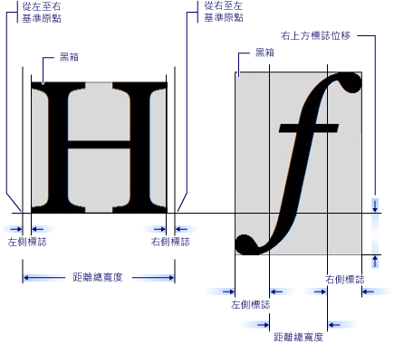

# GlyphRun 物件和 Glyphs 項目簡介
本主題描述<xref:System.Windows.Media.GlyphRun>物件和<xref:System.Windows.Documents.Glyphs>項目。  
  
  
   
## GlyphRun 簡介  
 [!INCLUDE[TLA#tla_winclient](../../../../includes/tlasharptla-winclient-md.md)] 提供進階的文字支援包括圖像層級標記，直接存取<xref:System.Windows.Documents.Glyphs>客戶想要攔截和保存格式化之後的文字。 這些功能可針對下列每個案例中的不同文字轉譯需求提供重要支援。  
  
1.  固定格式文件的螢幕顯示。  
  
2.  列印案例。  
  
    -   使用 [!INCLUDE[TLA#tla_xaml](../../../../includes/tlasharptla-xaml-md.md)] 作為裝置印表機語言。  
  
    -   [!INCLUDE[TLA#tla_mxdw](../../../../includes/tlasharptla-mxdw-md.md)].  
  
    -   先前的印表機驅動程式，從 [!INCLUDE[TLA#tla_win32](../../../../includes/tlasharptla-win32-md.md)] 應用程式輸出為固定格式。  
  
    -   列印多工緩衝處理格式。  
  
3.  固定格式文件呈現，包括舊版 [!INCLUDE[TLA#tla_mswin](../../../../includes/tlasharptla-mswin-md.md)] 和其他電腦裝置的用戶端。  
  
> [!NOTE]
>  <xref:System.Windows.Documents.Glyphs> 和<xref:System.Windows.Media.GlyphRun>專為固定格式文件展示及列印案例。 [!INCLUDE[TLA#tla_winclient](../../../../includes/tlasharptla-winclient-md.md)] 提供數個項目用於一般配置和[!INCLUDE[TLA#tla_ui](../../../../includes/tlasharptla-ui-md.md)]運用於如下案例<xref:System.Windows.Controls.Label>和<xref:System.Windows.Controls.TextBlock>。 如需配置和 [!INCLUDE[TLA2#tla_ui](../../../../includes/tla2sharptla-ui-md.md)] 案例的詳細資訊，請參閱 [WPF 中的印刷樣式](typography-in-wpf.md)。  
  
   
## GlyphRun 物件  
 <xref:System.Windows.Media.GlyphRun>物件都代表一系列字符具有單一大小且具有單一轉譯樣式之單一字型單一字體。  
  
 <xref:System.Windows.Media.GlyphRun> 包含這兩個字型詳細資料，例如圖像 （glyph）<xref:System.Windows.Documents.Glyphs.Indices%2A>和個別字符位置。 它也包含原始[!INCLUDE[TLA#tla_unicode](../../../../includes/tlasharptla-unicode-md.md)]字碼的指標產生執行從字元到字符緩衝區位移的對應資訊，以及每個字元和每個字符旗標。  
  
 <xref:System.Windows.Media.GlyphRun> 具有對應的高階<xref:System.Windows.FrameworkElement>， <xref:System.Windows.Documents.Glyphs>。 <xref:System.Windows.Documents.Glyphs> 可用項目樹狀結構中，並在[!INCLUDE[TLA2#tla_xaml](../../../../includes/tla2sharptla-xaml-md.md)]標記，以代表<xref:System.Windows.Media.GlyphRun>輸出。  
  
   
## Glyphs 項目  
 <xref:System.Windows.Documents.Glyphs>項目代表的輸出<xref:System.Windows.Media.GlyphRun>在[!INCLUDE[TLA2#tla_xaml](../../../../includes/tla2sharptla-xaml-md.md)]。 下列標記語法用來描述<xref:System.Windows.Documents.Glyphs>項目。  
  
 [!code-xaml[GlyphsOvwSample1#1](~/samples/snippets/csharp/VS_Snippets_Wpf/GlyphsOvwSample1/CS/default.xaml#1)]  
  
 下列屬性定義對應至範例標記中的前四個屬性。  
  
|屬性|描述|  
|--------------|-----------------|  
|<xref:System.Windows.Documents.Glyphs.FontUri%2A>|指定資源識別碼︰ 檔案名稱、 Web [!INCLUDE[TLA#tla_uri](../../../../includes/tlasharptla-uri-md.md)]，或在應用程式.exe 或容器的資源參考。|  
|<xref:System.Windows.Documents.Glyphs.FontRenderingEmSize%2A>|指定字型大小 (以繪圖介面單位為單位) (預設值為 .96 英吋)。|  
|<xref:System.Windows.Documents.Glyphs.StyleSimulations%2A>|指定粗體和斜體樣式的旗標。|  
|<xref:System.Windows.Documents.Glyphs.BidiLevel%2A>|指定雙向配置層級。 偶數值和零值表示由左至右的版面配置，奇數值則表示由右至左的版面配置。|  
  
   
### Indices 屬性  
 <xref:System.Windows.Documents.Glyphs.Indices%2A>屬性是一個字串的字符規格。 如果由一系列字符形成單一叢集，則會先指定叢集中的第一個字符，再指定合併多少字符和多少字碼指標來形成叢集。 <xref:System.Windows.Documents.Glyphs.Indices%2A>屬性收集在一個字串中的下列屬性。  
  
-   字符索引  
  
-   字符遞增寬度  
  
-   合併字符附加向量  
  
-   從字碼指標到字符的叢集對應  
  
-   字符旗標  
  
 每個字符規格的形式如下。  
  
 `[GlyphIndex][,[Advance][,[uOffset][,[vOffset][,[Flags]]]]]`  
  
   
## 字符度量  
 每個字符都會定義度量，以指定與其他的對齊方式<xref:System.Windows.Documents.Glyphs>。 下圖定義兩個不同字符字元的各種印刷品質。  
  
   
  
   
## 字符標記  
 下列程式碼範例示範如何使用的各種屬性<xref:System.Windows.Documents.Glyphs>中的項目[!INCLUDE[TLA2#tla_xaml](../../../../includes/tla2sharptla-xaml-md.md)]。  
  
 [!code-xaml[GlyphsOvwSamp2#1](~/samples/snippets/csharp/VS_Snippets_Wpf/GlyphsOvwSamp2/CS/default.xaml#1)]  
  
## 另請參閱
- [WPF 中的印刷樣式](typography-in-wpf.md)
- [WPF 中的文件](documents-in-wpf.md)
- [Text](optimizing-performance-text.md)
