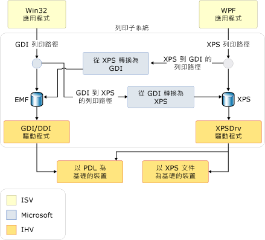

# 列印概觀
Microsoft.NET Framework 中，使用 Windows Presentation Foundation (WPF) 應用程式開發人員有了新豐富的列印和列印系統管理[!INCLUDE[TLA#tla_api#plural](../../../../includes/tlasharptla-apisharpplural-md.md)]。 藉由 [!INCLUDE[TLA#tla_winvista](../../../../includes/tlasharptla-winvista-md.md)]，某些列印系統增強功能也可供建立 [!INCLUDE[TLA#tla_winforms](../../../../includes/tlasharptla-winforms-md.md)] 應用程式的開發人員和使用 Unmanaged 程式碼的開發人員使用。 這項新功能的核心是新的 [!INCLUDE[TLA#tla_xps](../../../../includes/tlasharptla-xps-md.md)] 檔案格式和 [!INCLUDE[TLA2#tla_xps](../../../../includes/tla2sharptla-xps-md.md)] 列印路徑。  
  
 此主題包括下列各節。  
  
   
## 關於 XPS  
 [!INCLUDE[TLA2#tla_metro](../../../../includes/tla2sharptla-metro-md.md)] 是一種電子文件格式、多工緩衝檔案格式且為頁面描述語言。 它是一種 Open Document 格式，使用 [!INCLUDE[TLA#tla_xml](../../../../includes/tlasharptla-xml-md.md)]、[!INCLUDE[TLA#tla_opc](../../../../includes/tlasharptla-opc-md.md)] 和其他業界標準，以建立跨平台的文件。 [!INCLUDE[TLA2#tla_metro](../../../../includes/tla2sharptla-metro-md.md)] 簡化建立、共用、列印、檢視和封存數位文件的程序。 如需有關 [!INCLUDE[TLA2#tla_metro](../../../../includes/tla2sharptla-metro-md.md)] 的其他資訊，請參閱 [XPS 網站](https://www.microsoft.com/xps)。  
  
 [以程式設計方式列印 XPS 檔](../../../../docs/framework/wpf/advanced/how-to-programmatically-print-xps-files.md)中示範數種使用 [!INCLUDE[TLA2#tla_wpf](../../../../includes/tla2sharptla-wpf-md.md)] 來列印以 [!INCLUDE[TLA2#tla_metro](../../../../includes/tla2sharptla-metro-md.md)] 為基礎之內容的技術。 在檢閱本主題所包含內容期間，您會發現參考這些範例相當有用。 (Unmanaged 程式碼開發人員應該會看到文件[MXDC_ESCAPE 函式](https://msdn.microsoft.com/library/windows/desktop/dd162739.aspx)。 Windows Form 開發人員必須使用[!INCLUDE[TLA2#tla_api](../../../../includes/tla2sharptla-api-md.md)]中<xref:System.Drawing.Printing>不支援完整的命名空間[!INCLUDE[TLA2#tla_xps](../../../../includes/tla2sharptla-xps-md.md)]列印路徑，但支援混合式 GDI-XPS 列印路徑。 請參閱下方的**列印路徑架構**)。  
  
   
## XPS 列印路徑  
 [!INCLUDE[TLA#tla_metro](../../../../includes/tlasharptla-metro-md.md)]列印路徑是一種新[!INCLUDE[TLA#tla_mswin](../../../../includes/tlasharptla-mswin-md.md)]列印在 Windows 應用程式中的處理方式來重新定義的功能。 因為 [!INCLUDE[TLA2#tla_xps](../../../../includes/tla2sharptla-xps-md.md)] 可以取代文件呈現語言 (例如 RTF)、列印多工緩衝處理器格式 (例如 WMF)，以及頁面描述語言 (例如 PCL 或 Postscript)；從應用程式發行到列印驅動程式或裝置中的最後處理，新的列印路徑都會保持 [!INCLUDE[TLA2#tla_metro](../../../../includes/tla2sharptla-metro-md.md)] 格式。  
  
 [!INCLUDE[TLA2#tla_metro](../../../../includes/tla2sharptla-metro-md.md)] 列印路徑建置於 [!INCLUDE[TLA2#tla_metro](../../../../includes/tla2sharptla-metro-md.md)] 印表機驅動程式模型 (XPSDrv)，這提供開發人員一些好處，例如 [!INCLUDE[TLA#tla_wys](../../../../includes/tlasharptla-wys-md.md)] 列印、改進的色彩支援，以及大幅改進的列印效能。 (如需 XPSDrv 的詳細資訊，請參閱 [Windows 驅動程式開發套件 (英文)](https://msdn.microsoft.com/library/windows/hardware/ff557573.aspx))。  
  
 列印多工緩衝處理器作業[!INCLUDE[TLA2#tla_metro](../../../../includes/tla2sharptla-metro-md.md)]文件基本上是舊版 Windows 相同。 不過除了現有的 [!INCLUDE[TLA2#tla_metro](../../../../includes/tla2sharptla-metro-md.md)] 列印路徑之外，它也已經增強支援 [!INCLUDE[TLA2#tla_gdi](../../../../includes/tla2sharptla-gdi-md.md)] 列印路徑。 新的列印路徑原本會取用 [!INCLUDE[TLA2#tla_metro](../../../../includes/tla2sharptla-metro-md.md)] 多工緩衝檔案。 雖然為舊版 [!INCLUDE[TLA#tla_mswin](../../../../includes/tlasharptla-mswin-md.md)] 撰寫的使用者模式之印表機驅動程式仍能運作，但需要[!INCLUDE[TLA2#tla_metro](../../../../includes/tla2sharptla-metro-md.md)] 印表機驅動程式 (XPSDrv) 以使用 [!INCLUDE[TLA2#tla_metro](../../../../includes/tla2sharptla-metro-md.md)] 列印路徑。  
  
 [!INCLUDE[TLA2#tla_metro](../../../../includes/tla2sharptla-metro-md.md)] 列印路徑的優點相當顯著，而且包含：  
  
-   [!INCLUDE[TLA2#tla_wys](../../../../includes/tla2sharptla-wys-md.md)] 列印支援  
  
-   進階色彩設定檔的原生支援，其中包含每個通道 32 位元 (bpc)、CMYK、具名色彩、n-inks 和透明及漸層效果的原生支援。  
  
-   改進的列印效能適用於這兩個.NET Framework 和[!INCLUDE[TLA#tla_win32](../../../../includes/tlasharptla-win32-md.md)]架構的應用程式。  
  
-   業界標準 [!INCLUDE[TLA2#tla_metro](../../../../includes/tla2sharptla-metro-md.md)] 格式。  
  
 基本列印的情況下，搭配使用者介面的單一進入點、組態和工作提交，可使用一個簡單又直覺式的 [!INCLUDE[TLA2#tla_api](../../../../includes/tla2sharptla-api-md.md)]。 進階案例中，對於 [!INCLUDE[TLA#tla_ui](../../../../includes/tlasharptla-ui-md.md)] 自訂 (或根本沒有 [!INCLUDE[TLA2#tla_ui](../../../../includes/tla2sharptla-ui-md.md)])、同步或非同步列印及批次列印功能，加入額外支援。 這兩個選項都提供完整或部分信任模式中的列印支援。  
  
 搭配心裡的擴充性設計[!INCLUDE[TLA2#tla_metro](../../../../includes/tla2sharptla-metro-md.md)]。 藉由使用擴充性架構，可以用模組化的方式加入功能至 [!INCLUDE[TLA2#tla_metro](../../../../includes/tla2sharptla-metro-md.md)]。 擴充性功能包括：  
  
-   列印結構描述。 會定期更新公用結構描述，並讓裝置功能可快速擴充。 (請參閱下方的 **PrintTicket 和 PrintCapabilities**)。  
  
-   可擴充的篩選管線。 [!INCLUDE[TLA2#tla_metro](../../../../includes/tla2sharptla-metro-md.md)] 印表機驅動程式 (XPSDrv) 篩選管線的設計是用來讓 [!INCLUDE[TLA2#tla_metro](../../../../includes/tla2sharptla-metro-md.md)] 文件可直接縮放列印。 (查閱中的"XPSDrv" [Windows Driver Kit](https://msdn.microsoft.com/library/windows/hardware/ff557573.aspx)。)  
  
### 列印路徑架構  
 雖然兩個[!INCLUDE[TLA2#tla_win32](../../../../includes/tla2sharptla-win32-md.md)]和.NET Framework 應用程式支援[!INCLUDE[TLA2#tla_metro](../../../../includes/tla2sharptla-metro-md.md)]， [!INCLUDE[TLA2#tla_win32](../../../../includes/tla2sharptla-win32-md.md)] Windows Forms 應用程式，並用[!INCLUDE[TLA2#tla_gdi](../../../../includes/tla2sharptla-gdi-md.md)]來[!INCLUDE[TLA2#tla_metro](../../../../includes/tla2sharptla-metro-md.md)]轉換，以便建立[!INCLUDE[TLA2#tla_metro](../../../../includes/tla2sharptla-metro-md.md)]格式化內容[!INCLUDE[TLA2#tla_metro](../../../../includes/tla2sharptla-metro-md.md)]印表機驅動程式 (XPSDrv)。 這些應用程式不需要使用 [!INCLUDE[TLA2#tla_metro](../../../../includes/tla2sharptla-metro-md.md)] 列印路徑，並可以繼續使用以 [!INCLUDE[TLA#tla_emf](../../../../includes/tlasharptla-emf-md.md)] 為基礎的列印。 不過，大部分的 [!INCLUDE[TLA2#tla_metro](../../../../includes/tla2sharptla-metro-md.md)] 功能和增強功能僅適用於目標為 [!INCLUDE[TLA2#tla_metro](../../../../includes/tla2sharptla-metro-md.md)] 列印路徑的應用程式。  
  
 若要啟用 XPSDrv 架構的印表機，藉由使用[!INCLUDE[TLA2#tla_win32](../../../../includes/tla2sharptla-win32-md.md)]和 Windows Forms 應用程式，[!INCLUDE[TLA2#tla_metro](../../../../includes/tla2sharptla-metro-md.md)]印表機驅動程式 (XPSDrv) 支援的轉換[!INCLUDE[TLA2#tla_gdi](../../../../includes/tla2sharptla-gdi-md.md)]到[!INCLUDE[TLA2#tla_metro](../../../../includes/tla2sharptla-metro-md.md)]格式。 XPSDrv 模型也會提供從 [!INCLUDE[TLA2#tla_metro](../../../../includes/tla2sharptla-metro-md.md)] 至 [!INCLUDE[TLA2#tla_gdi](../../../../includes/tla2sharptla-gdi-md.md)] 格式的轉換器，讓 [!INCLUDE[TLA2#tla_win32](../../../../includes/tla2sharptla-win32-md.md)] 應用程式可以列印 [!INCLUDE[TLA2#tla_xps](../../../../includes/tla2sharptla-xps-md.md)] 文件。 針對[!INCLUDE[TLA2#tla_wpf](../../../../includes/tla2sharptla-wpf-md.md)]應用程式]、 [轉換[!INCLUDE[TLA2#tla_metro](../../../../includes/tla2sharptla-metro-md.md)]要[!INCLUDE[TLA2#tla_gdi](../../../../includes/tla2sharptla-gdi-md.md)]格式自動進行<xref:System.Windows.Xps.XpsDocumentWriter.Write%2A>和<xref:System.Windows.Xps.XpsDocumentWriter.WriteAsync%2A>方法<xref:System.Windows.Xps.XpsDocumentWriter>類別，每當寫入作業的目標列印佇列並沒有XPSDrv 驅動程式。 (Windows Form 應用程式無法列印[!INCLUDE[TLA2#tla_xps](../../../../includes/tla2sharptla-xps-md.md)]文件。)  
  
 下圖說明列印子系統，並定義 [!INCLUDE[TLA#tla_ms](../../../../includes/tlasharptla-ms-md.md)] 所提供的部分，以及軟體和硬體廠商所定義的部分。  
  
   
  
### 基本 XPS 列印  
 [!INCLUDE[TLA2#tla_wpf](../../../../includes/tla2sharptla-wpf-md.md)] 定義基本和進階的 [!INCLUDE[TLA#tla_api](../../../../includes/tlasharptla-api-md.md)]。 對於不需廣泛的列印自訂或存取完整 [!INCLUDE[TLA2#tla_metro](../../../../includes/tla2sharptla-metro-md.md)] 功能集的應用程式，基本的列印支援可供使用。 基本列印支援由需要最少組態的列印對話方塊控制項公開，並具有類似 [!INCLUDE[TLA2#tla_ui](../../../../includes/tla2sharptla-ui-md.md)] 的功能。 使用這個簡化的列印模型，許多 [!INCLUDE[TLA2#tla_metro](../../../../includes/tla2sharptla-metro-md.md)] 功能可供使用。  
  
#### PrintDialog  
 <xref:System.Windows.Controls.PrintDialog?displayProperty=nameWithType> 控制項提供 [!INCLUDE[TLA2#tla_ui](../../../../includes/tla2sharptla-ui-md.md)] 組態的單一進入點和 [!INCLUDE[TLA2#tla_metro](../../../../includes/tla2sharptla-metro-md.md)] 工作提交。 如需如何具現化及使用控制項的相關資訊，請參閱[叫用列印對話方塊](../../../../docs/framework/wpf/advanced/how-to-invoke-a-print-dialog.md)。  
  
### 進階的 XPS 列印  
 若要存取一組完整的 [!INCLUDE[TLA2#tla_metro](../../../../includes/tla2sharptla-metro-md.md)] 功能，則必須使用進階的 [!INCLUDE[TLA2#tla_api](../../../../includes/tla2sharptla-api-md.md)] 列印。 以下更加詳細地描述幾個相關的 [!INCLUDE[TLA2#tla_api](../../../../includes/tla2sharptla-api-md.md)]。 如需完整的清單[!INCLUDE[TLA2#tla_metro](../../../../includes/tla2sharptla-metro-md.md)]列印路徑[!INCLUDE[TLA2#tla_api#plural](../../../../includes/tla2sharptla-apisharpplural-md.md)]，請參閱<xref:System.Windows.Xps>和<xref:System.Printing>命名空間的參考。  
  
#### PrintTicket 和 PrintCapabilities  
 <xref:System.Printing.PrintTicket>並<xref:System.Printing.PrintCapabilities>類別為基礎的進階[!INCLUDE[TLA2#tla_metro](../../../../includes/tla2sharptla-metro-md.md)]功能。 這兩種類型的物件都是列印導向功能的 [!INCLUDE[TLA#tla_xml](../../../../includes/tlasharptla-xml-md.md)] 格式化結構，例如定序、雙面列印、裝訂等等。列印的結構描述會定義這些結構。 <xref:System.Printing.PrintTicket> 會指示印表機該如何處理列印工作。 <xref:System.Printing.PrintCapabilities> 類別會定義印表機的功能。 藉由查詢印表機的功能，可以建立 <xref:System.Printing.PrintTicket> 來完整利用印表機支援的功能。 同樣地，您也可避免不支援的功能。  
  
 下列範例示範如何查詢印表機的 <xref:System.Printing.PrintCapabilities>，並使用程式碼建立 <xref:System.Printing.PrintTicket>。  
  
 [!code-cpp[xpscreate#PrinterCapabilities](../../../../samples/snippets/cpp/VS_Snippets_Wpf/XpsCreate/CPP/XpsCreate.cpp#printercapabilities)]
 [!code-csharp[xpscreate#PrinterCapabilities](../../../../samples/snippets/csharp/VS_Snippets_Wpf/XpsCreate/CSharp/XpsCreate.cs#printercapabilities)]
 [!code-vb[xpscreate#PrinterCapabilities](../../../../samples/snippets/visualbasic/VS_Snippets_Wpf/XpsCreate/visualbasic/xpscreate.vb#printercapabilities)]  
  
#### PrintServer 和 PrintQueue  
 <xref:System.Printing.PrintServer> 類別代表網路列印伺服器，且 <xref:System.Printing.PrintQueue> 類別代表印表機以及相關聯的輸出工作佇列。 同時，[!INCLUDE[TLA2#tla_api#plural](../../../../includes/tla2sharptla-apisharpplural-md.md)] 允許伺服器列印工作的進階管理。 <xref:System.Printing.PrintServer> 或其中一個衍生的類別，會用來管理 <xref:System.Printing.PrintQueue>。 <xref:System.Printing.PrintQueue.AddJob%2A> 方法會用來將新的列印工作插入佇列。  
  
 下列範例示範如何建立 <xref:System.Printing.LocalPrintServer> 及使用程式碼存取其預設的 <xref:System.Printing.PrintQueue>。  
  
 [!code-csharp[xpsprint#PrintQueueSnip](../../../../samples/snippets/csharp/VS_Snippets_Wpf/XpsPrint/CSharp/XpsPrintHelper.cs#printqueuesnip)]
 [!code-vb[xpsprint#PrintQueueSnip](../../../../samples/snippets/visualbasic/VS_Snippets_Wpf/XpsPrint/visualbasic/xpsprinthelper.vb#printqueuesnip)]  
  
#### XpsDocumentWriter  
 <xref:System.Windows.Xps.XpsDocumentWriter> 和其許多的 <xref:System.Windows.Xps.XpsDocumentWriter.Write%2A> 和 <xref:System.Windows.Xps.XpsDocumentWriter.WriteAsync%2A> 方法，可用來寫入 [!INCLUDE[TLA2#tla_metro](../../../../includes/tla2sharptla-metro-md.md)] 文件到 <xref:System.Printing.PrintQueue>。 例如，<xref:System.Windows.Xps.XpsDocumentWriter.Write%28System.Windows.Documents.FixedPage%2CSystem.Printing.PrintTicket%29> 方法用來同步輸出 [!INCLUDE[TLA2#tla_metro](../../../../includes/tla2sharptla-metro-md.md)] 文件和 <xref:System.Printing.PrintTicket>。 <xref:System.Windows.Xps.XpsDocumentWriter.WriteAsync%28System.Windows.Documents.FixedDocument%2CSystem.Printing.PrintTicket%29> 方法用來非同步輸出 [!INCLUDE[TLA2#tla_metro](../../../../includes/tla2sharptla-metro-md.md)] 文件和 <xref:System.Printing.PrintTicket>。  
  
 下列範例示範如何使用程式碼建立 <xref:System.Windows.Xps.XpsDocumentWriter>。  
  
 [!code-csharp[XpsPrint#PrintQueueSnip](../../../../samples/snippets/csharp/VS_Snippets_Wpf/XpsPrint/CSharp/XpsPrintHelper.cs#printqueuesnip)]
 [!code-vb[XpsPrint#PrintQueueSnip](../../../../samples/snippets/visualbasic/VS_Snippets_Wpf/XpsPrint/visualbasic/xpsprinthelper.vb#printqueuesnip)]  
  
 <xref:System.Printing.PrintQueue.AddJob%2A> 方法也會提供列印的方式。 請參閱[以程式設計方式列印 XPS 檔](../../../../docs/framework/wpf/advanced/how-to-programmatically-print-xps-files.md)。 。  
  
   
## GDI 列印路徑  
 雖然[!INCLUDE[TLA2#tla_wpf](../../../../includes/tla2sharptla-wpf-md.md)]應用程式原本就支援[!INCLUDE[TLA2#tla_metro](../../../../includes/tla2sharptla-metro-md.md)]列印路徑，[!INCLUDE[TLA2#tla_win32](../../../../includes/tla2sharptla-win32-md.md)]和 Windows Forms 應用程式也可以利用一些[!INCLUDE[TLA2#tla_metro](../../../../includes/tla2sharptla-metro-md.md)]功能。 [!INCLUDE[TLA2#tla_metro](../../../../includes/tla2sharptla-metro-md.md)] 印表機驅動程式 (XPSDrv) 可以轉換 [!INCLUDE[TLA2#tla_gdi](../../../../includes/tla2sharptla-gdi-md.md)] 基礎的輸出為 [!INCLUDE[TLA2#tla_metro](../../../../includes/tla2sharptla-metro-md.md)] 格式。 進階案例中，對內容的自訂轉換，支援使用[Microsoft XPS 文件轉換器 (MXDC)](https://msdn.microsoft.com/library/windows/desktop/ff686803.aspx)。 同樣地，[!INCLUDE[TLA2#tla_wpf](../../../../includes/tla2sharptla-wpf-md.md)]應用程式也可以輸出至[!INCLUDE[TLA2#tla_gdi](../../../../includes/tla2sharptla-gdi-md.md)]藉由呼叫其中的列印路徑<xref:System.Windows.Xps.XpsDocumentWriter.Write%2A>或是<xref:System.Windows.Xps.XpsDocumentWriter.WriteAsync%2A>方法<xref:System.Windows.Xps.XpsDocumentWriter>類別並指定非 XpsDrv 印表機為目標列印佇列。  

對於不需要 [!INCLUDE[TLA2#tla_metro](../../../../includes/tla2sharptla-metro-md.md)] 功能或支援的應用程式、目前的 [!INCLUDE[TLA2#tla_gdi](../../../../includes/tla2sharptla-gdi-md.md)] 列印路徑會維持不變。  
  
-   如上的其他參考資料[!INCLUDE[TLA2#tla_gdi](../../../../includes/tla2sharptla-gdi-md.md)]列印路徑和各種[!INCLUDE[TLA2#tla_metro](../../../../includes/tla2sharptla-metro-md.md)]轉換選項，請參閱[Microsoft XPS 文件轉換器 (MXDC)](https://msdn.microsoft.com/library/windows/desktop/ff686803.aspx)和中的"XPSDrv" [Windows Driver Kit](https://msdn.microsoft.com/library/windows/hardware/ff557573.aspx).  
  
   
## XPSDrv 驅動程式模型  
 當列印至啟用 [!INCLUDE[TLA2#tla_metro](../../../../includes/tla2sharptla-metro-md.md)] 的印表機或驅動程式時，藉由使用 [!INCLUDE[TLA2#tla_metro](../../../../includes/tla2sharptla-metro-md.md)] 做為原生列印多工緩衝處理格式，會改進[!INCLUDE[TLA2#tla_metro](../../../../includes/tla2sharptla-metro-md.md)] 列印路徑多工緩衝處理器效率。 在文件多工緩衝處理之前，簡化多工緩衝處理程序就不需要產生中繼多工緩衝處理檔案，例如 [!INCLUDE[TLA2#tla_emf](../../../../includes/tla2sharptla-emf-md.md)] 資料檔。 透過較小的多工緩衝處理檔案大小，[!INCLUDE[TLA2#tla_metro](../../../../includes/tla2sharptla-metro-md.md)] 列印路徑可以減少網路流量並改善列印效能。  
  
 [!INCLUDE[TLA2#tla_emf](../../../../includes/tla2sharptla-emf-md.md)] 是代表應用程式輸出的封閉式格式，做為一系列 [!INCLUDE[TLA2#tla_gdi](../../../../includes/tla2sharptla-gdi-md.md)] 的呼叫來轉譯服務。 不同於 [!INCLUDE[TLA2#tla_emf](../../../../includes/tla2sharptla-emf-md.md)]，當輸出至以  [!INCLUDE[TLA2#tla_metro](../../../../includes/tla2sharptla-metro-md.md)] 為基礎的印表機驅動程式 (XPSDrv) 時，[!INCLUDE[TLA2#tla_metro](../../../../includes/tla2sharptla-metro-md.md)] 多工緩衝處理格式代表實際的文件，而不需要進一步的解譯。 驅動程式可以直接在格式中的資料上運作。 當您使用 [!INCLUDE[TLA2#tla_emf](../../../../includes/tla2sharptla-emf-md.md)] 檔案和以  [!INCLUDE[TLA2#tla_gdi](../../../../includes/tla2sharptla-gdi-md.md)] 為基礎的列印驅動程式時，這項功能就不需要資料和色彩空間轉換。  
  
 當您使用以 [!INCLUDE[TLA2#tla_metro](../../../../includes/tla2sharptla-metro-md.md)] 印表機驅動程式 (XPSDrv) 為目標的[!INCLUDE[TLA2#tla_metro](../../../../includes/tla2sharptla-metro-md.md)] 文件時，相較於其 [!INCLUDE[TLA2#tla_emf](../../../../includes/tla2sharptla-emf-md.md)] 對等項目，這通常會減少多工緩衝處理檔案大小；不過，有例外狀況：  
  
-   非常複雜、多層或無效率寫入的向量圖形可能大於相同圖形的點陣圖版本。  
  
-   供螢幕顯示之用，XPS 檔內嵌裝置字型，以及以電腦為基礎的字型；而 GDI 多工緩衝處理檔案則不會內嵌裝置字型。 但是這兩種字型為部分內嵌的字型 (如下所示)，而且印表機驅動程式可以移除裝置字型，然後再將檔案傳輸至印表機。  
  
 多工緩衝處理大小縮減會透過數種機制執行：  
  
-   **字型部分內嵌**。 只有在實際文件中使用的字元會儲存於 [!INCLUDE[TLA2#tla_metro](../../../../includes/tla2sharptla-metro-md.md)] 檔案。  
  
-   **進階圖形支援**。 透明及漸層效果基本類型的原生支援可避免 [!INCLUDE[TLA2#tla_xps](../../../../includes/tla2sharptla-xps-md.md)] 文件中內容的點陣化。  
  
-   **識別通用資源**。 多次使用的資源 (例如代表公司標誌的影像) 會被視為共用資源，並只會載入一次。  
  
-   **ZIP 壓縮**。 所有 [!INCLUDE[TLA2#tla_metro](../../../../includes/tla2sharptla-metro-md.md)] 文件使用 ZIP 壓縮。  
  
## 另請參閱  
 <xref:System.Windows.Controls.PrintDialog>  
 <xref:System.Windows.Xps.XpsDocumentWriter>  
 <xref:System.Windows.Xps.Packaging.XpsDocument>  
 <xref:System.Printing.PrintTicket>  
 <xref:System.Printing.PrintCapabilities>  
 <xref:System.Printing.PrintServer>  
 <xref:System.Printing.PrintQueue>  
 [HOW-TO 主題](../../../../docs/framework/wpf/advanced/printing-how-to-topics.md)  
 [WPF 中的文件](../../../../docs/framework/wpf/advanced/documents-in-wpf.md)  
 [XPS](https://www.microsoft.com/xps)  
 [文件序列化與儲存](../../../../docs/framework/wpf/advanced/document-serialization-and-storage.md)  
 [Microsoft XPS 文件轉換器 (MXDC)](https://msdn.microsoft.com/library/windows/desktop/ff686803.aspx)
