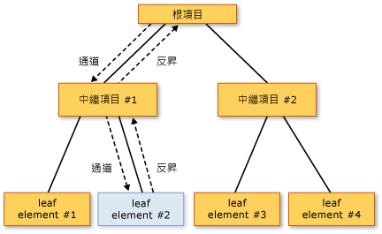

# 路由事件概觀
本主題說明 [!INCLUDE[TLA#tla_winclient](../../../../includes/tlasharptla-winclient-md.md)] 中路由事件的概念。 本主題會定義路由事件的術語、說明如何透過元素的樹狀結構路由傳送路由事件、摘要說明如何處理路由事件，以及介紹如何建立您自己的自訂路由事件。
  
   
## 必要條件  
 本主題假設您具備 [!INCLUDE[TLA#tla_clr](../../../../includes/tlasharptla-clr-md.md)] 和物件導向程式設計的基本知識，以及如何將 [!INCLUDE[TLA2#tla_winclient](../../../../includes/tla2sharptla-winclient-md.md)] 元素之間的關聯性概念化為樹狀結構的概念。 若要遵循本主題中的範例，您也應該了解 [!INCLUDE[TLA#tla_xaml](../../../../includes/tlasharptla-xaml-md.md)]，並知道如何撰寫非常基本的 [!INCLUDE[TLA2#tla_winclient](../../../../includes/tla2sharptla-winclient-md.md)] 應用程式或頁面。 如需詳細資訊，請參閱[逐步解說： 第一個 WPF 桌面應用程式](../../../../docs/framework/wpf/getting-started/walkthrough-my-first-wpf-desktop-application.md)和[XAML 概觀 (WPF)](../../../../docs/framework/wpf/advanced/xaml-overview-wpf.md)。  
  
   
## 什麼是路由事件？  
 您可以從功能或實作觀點來考量路由事件。 此處說明這兩個定義，讓使用者能夠選擇較實用的定義。  
  
 功能定義︰路由事件是一種事件類型，可在元素樹狀結構中的多個接聽程式上叫用處理常式，而不只是在引發事件的物件上。  
  
 實作定義： 路由的事件是[!INCLUDE[TLA2#tla_clr](../../../../includes/tla2sharptla-clr-md.md)]的執行個體所支援的事件<xref:System.Windows.RoutedEvent>類別，並處理[!INCLUDE[TLA#tla_winclient](../../../../includes/tlasharptla-winclient-md.md)]事件系統。  
  
 一般的 [!INCLUDE[TLA2#tla_winclient](../../../../includes/tla2sharptla-winclient-md.md)] 應用程式包含許多元素。 不論是在程式碼中建立或是在 [!INCLUDE[TLA2#tla_xaml](../../../../includes/tla2sharptla-xaml-md.md)] 中宣告，這些元素均存在於彼此間的元素樹狀結構關聯性中。 事件路由的周遊方向取決於事件定義，但通常路由會從來源元素開始周遊，然後透過元素樹狀結構向上執行「事件反昇」，直到它到達元素樹狀結構根元素 (通常是頁面或視窗) 為止。 如果您先前曾用過 DHTML 物件模型，可能很熟悉這個事件反昇概念。  
  
 請考慮下列簡單的元素樹狀結構：  
  
 [!code-xaml[EventOvwSupport#GroupButton](../../../../samples/snippets/csharp/VS_Snippets_Wpf/EventOvwSupport/CSharp/default.xaml#groupbutton)]  
  
 這個元素樹狀結構會產生如下的畫面：  
  
 ![[是]、[否] 和 [取消] 按鈕](../../../../docs/framework/wpf/advanced/media/routedevent-ovw-1.gif "RoutedEvent_ovw_1")  
  
 在這個簡化的項目樹狀目錄中的來源<xref:System.Windows.Controls.Primitives.ButtonBase.Click>事件是其中一個<xref:System.Windows.Controls.Button>項目，以及兩者<xref:System.Windows.Controls.Button>已按下會有機會處理事件的第一個項目。 但是，如果沒有處理常式附加至<xref:System.Windows.Controls.Button>充當事件，則事件會反昇至向上<xref:System.Windows.Controls.Button>中項目樹狀結構，也就是父系<xref:System.Windows.Controls.StackPanel>。 可能需要的事件會反昇至<xref:System.Windows.Controls.Border>，與然後頁面根項目樹狀 （未顯示）。  
  
 換句話說，此事件路由<xref:System.Windows.Controls.Primitives.ButtonBase.Click>事件：  
  
 Button-->StackPanel-->Border-->...  
  
### 路由事件的最上層案例  
 以下是激發路由事件概念的案例簡單摘要，以及為什麼一般的 [!INCLUDE[TLA2#tla_clr](../../../../includes/tla2sharptla-clr-md.md)] 事件無法滿足這些案例的原因：  
  
 **控制項組合和封裝︰**[!INCLUDE[TLA2#tla_winclient](../../../../includes/tla2sharptla-winclient-md.md)] 中的各種控制項具有豐富的內容模型。 例如，您可以在其中放置內的映像<xref:System.Windows.Controls.Button>，來有效地擴充按鈕的視覺化樹狀結構。 不過，加入的影像必須不中斷的點擊測試行為造成的按鈕，以回應<xref:System.Windows.Controls.Primitives.ButtonBase.Click>其內容，即使使用者在技術上屬於映像的像素為單位。  
  
 **單一處理常式附加點︰**在 [!INCLUDE[TLA#tla_winforms](../../../../includes/tlasharptla-winforms-md.md)] 中，您必須多次附加相同的處理常式，以處理可從多個元素引發的事件。 路由事件可讓您只需附加該處理常式一次 (如上一個範例中所示)，然後就能視需要使用處理常式邏輯判斷此事件來自何處。 例如，這可能是先前所示之 [!INCLUDE[TLA2#tla_xaml](../../../../includes/tla2sharptla-xaml-md.md)] 的處理常式：  
  
 [!code-csharp[EventOvwSupport#GroupButtonCodeBehind](../../../../samples/snippets/csharp/VS_Snippets_Wpf/EventOvwSupport/CSharp/default.xaml.cs#groupbuttoncodebehind)]
 [!code-vb[EventOvwSupport#GroupButtonCodeBehind](../../../../samples/snippets/visualbasic/VS_Snippets_Wpf/EventOvwSupport/visualbasic/default.xaml.vb#groupbuttoncodebehind)]  
  
 **類別處理：**路由事件允許類別所定義的靜態處理常式。 這個類別處理常式有機會在任何附加的執行個體處理常式之前處理事件。  
  
 **參考事件，但不使用反射：**特定程式碼和標記技術需要識別特定事件的方式。 路由的事件建立<xref:System.Windows.RoutedEvent>欄位做為識別項提供了強固的事件識別技巧，不需要靜態或執行階段反映。  
  
### 路由事件的實作方式  
 路由的事件是[!INCLUDE[TLA2#tla_clr](../../../../includes/tla2sharptla-clr-md.md)]的執行個體所支援的事件<xref:System.Windows.RoutedEvent>類別，並向[!INCLUDE[TLA2#tla_winclient](../../../../includes/tla2sharptla-winclient-md.md)]事件系統。 <xref:System.Windows.RoutedEvent>從登錄取得執行個體通常會被保留為`public` `static` `readonly`欄位成員之類別的註冊，並因此 「 擁有 」 路由的事件。 與名稱完全相同之 [!INCLUDE[TLA2#tla_clr](../../../../includes/tla2sharptla-clr-md.md)] 事件 (有時稱為「包裝函式」事件) 的關聯，可藉由覆寫 [!INCLUDE[TLA2#tla_clr](../../../../includes/tla2sharptla-clr-md.md)] 事件的 `add` 和 `remove` 實作來完成。 一般而言，`add` 和 `remove` 會保留為隱含的預設值，以使用適當的語言特定事件語法來加入和移除該事件的處理常式。 路由的事件的支援和連線機制在概念上類似的相依性屬性的方式[!INCLUDE[TLA2#tla_clr](../../../../includes/tla2sharptla-clr-md.md)]屬性，並受到<xref:System.Windows.DependencyProperty>類別，並向[!INCLUDE[TLA2#tla_winclient](../../../../includes/tla2sharptla-winclient-md.md)]屬性系統。  
  
 下列範例示範自訂宣告`Tap`路由的事件，包括註冊和公開<xref:System.Windows.RoutedEvent>識別碼欄位和`add`和`remove`實作`Tap` [!INCLUDE[TLA2#tla_clr](../../../../includes/tla2sharptla-clr-md.md)]事件。  
  
 [!code-csharp[RoutedEventCustom#AddRemoveHandler](../../../../samples/snippets/csharp/VS_Snippets_Wpf/RoutedEventCustom/CSharp/SDKSampleLibrary/class1.cs#addremovehandler)]
 [!code-vb[RoutedEventCustom#AddRemoveHandler](../../../../samples/snippets/visualbasic/VS_Snippets_Wpf/RoutedEventCustom/VB/SDKSampleLibrary/Class1.vb#addremovehandler)]  
  
### 路由事件處理常式和 XAML  
 若要使用 [!INCLUDE[TLA2#tla_xaml](../../../../includes/tla2sharptla-xaml-md.md)] 加入事件的處理常式，您可以宣告事件名稱做為屬於事件接聽程式之元素上的屬性。 屬性的值是您所實作之處理常式方法的名稱，此名稱必須存在於程式碼後置檔案的部分類別中。  
  
 [!code-xaml[EventOvwSupport#SimplestSyntax](../../../../samples/snippets/csharp/VS_Snippets_Wpf/EventOvwSupport/CSharp/default.xaml#simplestsyntax)]  
  
 加入標準 [!INCLUDE[TLA2#tla_clr](../../../../includes/tla2sharptla-clr-md.md)] 事件處理常式的 [!INCLUDE[TLA2#tla_xaml](../../../../includes/tla2sharptla-xaml-md.md)] 語法，與加入路由事件處理常式一樣，因為您真的要將處理常式加入到 [!INCLUDE[TLA2#tla_clr](../../../../includes/tla2sharptla-clr-md.md)] 事件包裝函式，底下具有路由事件實作。 如需在 [!INCLUDE[TLA2#tla_xaml](../../../../includes/tla2sharptla-xaml-md.md)] 中加入事件處理常式的詳細資訊，請參閱 [XAML 概觀 (WPF)](../../../../docs/framework/wpf/advanced/xaml-overview-wpf.md)。  
  
   
## 路由傳送策略  
 路由事件會使用下列其中一個路由傳送策略：  
  
-   **事件反昇︰**會叫用事件來源上的事件處理常式。 路由事件接著會路由傳送到後續的父元素，直到其到達元素樹狀結構的根元素為止。 大部分的路由事件會使用事件反昇路由傳送策略。 事件反昇的路由事件通常是用來報告來自不同控制項或其他 UI 元素的輸入或狀態變更。  
  
-   **直接︰**只有來源元素本身有機會叫用處理常式來回應。 這類似於 [!INCLUDE[TLA#tla_winforms](../../../../includes/tlasharptla-winforms-md.md)] 針對事件所使用的「路由傳送」。 不過，不同於標準[!INCLUDE[TLA2#tla_clr](../../../../includes/tla2sharptla-clr-md.md)]事件，直接路由的事件的支援類別處理 （類別處理將在後續的章節中說明），而且可以供<xref:System.Windows.EventSetter>和<xref:System.Windows.EventTrigger>。  
  
-   **通道︰**一開始會叫用元素樹狀結構根元素上的事件處理常式。 路由事件接著會在路由中朝向屬於路由事件來源的節點元素 (會引發路由事件的元素) 移動，以透過後續的子元素周遊該路由。 通道路由事件時常會做為複合控制項的一部分來使用或處理，這類來自複合組件的事件可利用專用於該完整控制項的事件來刻意隱藏或取代。 [!INCLUDE[TLA2#tla_winclient](../../../../includes/tla2sharptla-winclient-md.md)] 中提供的輸入事件通常會實作為成對的通道/事件反昇組合。 由於用於配對的命名慣例，通道事件有時也稱為預覽事件。  
  
   
## 為什麼要使用路由事件？  
 身為應用程式開發人員，您不一定需要知道或在意要將您正在處理的事件實作為路由事件。 路由事件都有特殊的行為，但是，如果您正在引發事件的元素上處理該事件，則大多不會看見該行為。  
  
 路由事件變成功能強大之處在於，您是否使用任何建議的案例︰在一般的根元素上定義一般的處理常式、組合自己的控制項，或定義自己的控制項類別。  
  
 路由事件接聽程式和路由事件來源不需要在其階層中共用一般事件。 任何<xref:System.Windows.UIElement>或<xref:System.Windows.ContentElement>可以是任何路由事件的事件接聽程式。 因此，您可以使用可在設為概念性「介面」的整個運作中 [!INCLUDE[TLA2#tla_api](../../../../includes/tla2sharptla-api-md.md)] 內使用的整組路由事件，讓應用程式中的不同元素可以交換事件資訊。 路由事件的這個「介面」概念特別適用於輸入事件。  
  
 路由事件也可用來透過元素樹狀結構進行通訊，因為事件的事件資料會永久存在於路由的每個元素中。 一個元素可以變更事件資料中的某些內容，而該變更可供路由中的下一個元素使用。  
  
 從路由層面以外的觀點來看，兩個其他因素讓任何指定的 [!INCLUDE[TLA2#tla_winclient](../../../../includes/tla2sharptla-winclient-md.md)] 事件可能實作為路由事件，而不是標準 [!INCLUDE[TLA2#tla_clr](../../../../includes/tla2sharptla-clr-md.md)] 事件。 如果您要實作自己的事件，也可以考慮這些準則：  
  
-   某些[!INCLUDE[TLA2#tla_winclient](../../../../includes/tla2sharptla-winclient-md.md)]設定樣式和範本的功能，例如<xref:System.Windows.EventSetter>和<xref:System.Windows.EventTrigger>需要參考是路由的事件的事件。 這是先前所述的事件識別碼案例。  
  
-   路由事件支援類別處理機制，此類別可藉以指定靜態方法，有機會在任何已註冊的執行個體處理常式可存取路由事件之前處理它們。 這在控制項設計中非常有用，因為您的類別可以強制執行事件驅動的類別行為，您無法藉由處理執行個體上的事件來附帶隱藏這類行為。  
  
 上述每個考量都會在本主題的不同小節中加以討論。  
  
   
## 加入和實作路由事件的事件處理常式  
 若要在 [!INCLUDE[TLA2#tla_xaml](../../../../includes/tla2sharptla-xaml-md.md)] 中加入事件處理常式，您只需將事件名稱加入至元素做為屬性，並將屬性值設為實作適當委派的事件處理常式名稱，如下列範例所示。  
  
 [!code-xaml[EventOvwSupport#SimplestSyntax](../../../../samples/snippets/csharp/VS_Snippets_Wpf/EventOvwSupport/CSharp/default.xaml#simplestsyntax)]  
  
 `b1SetColor`包含處理的程式碼實作處理常式名稱<xref:System.Windows.Controls.Primitives.ButtonBase.Click>事件。 `b1SetColor`必須有相同的簽章<xref:System.Windows.RoutedEventHandler>委派，它是事件處理常式委派的<xref:System.Windows.Controls.Primitives.ButtonBase.Click>事件。 所有路由事件處理常式委派的第一個參數會指定要加入事件處理常式的元素，而第二個參數會指定事件的資料。  
  
[!code-csharp[EventOvwSupport#SimpleHandlerA](../../../../samples/snippets/csharp/VS_Snippets_Wpf/EventOvwSupport/CSharp/default.xaml.cs#simplehandlera)]
[!code-vb[EventOvwSupport#SimpleHandlerA](../../../../samples/snippets/visualbasic/VS_Snippets_Wpf/EventOvwSupport/visualbasic/default.xaml.vb#simplehandlera)]  
  
 <xref:System.Windows.RoutedEventHandler>是基本的路由的事件處理常式委派。 如果是針對特定控制項或案例特製化的路由事件，用於路由事件處理常式的委派也可能會變得更特製化，讓它們能夠傳輸特製化的事件資料。 比方說，在一般的輸入案例中，您可能會處理<xref:System.Windows.UIElement.DragEnter>路由的事件。 您的處理常式應該實作<xref:System.Windows.DragEventHandler>委派。 藉由使用最適合的委派，您可以處理<xref:System.Windows.DragEventArgs>中的處理常式和讀取<xref:System.Windows.DragEventArgs.Data%2A>屬性，其中包含剪貼簿裝載在拖曳作業。  
  
 如需如何使用 [!INCLUDE[TLA2#tla_xaml](../../../../includes/tla2sharptla-xaml-md.md)] 來將事件處理常式加入至元素的完整範例，請參閱[處理路由事件](../../../../docs/framework/wpf/advanced/how-to-handle-a-routed-event.md)。  
  
 在使用程式碼建立的應用程式中加入路由事件的處理常式很簡單。 路由的事件處理常式永遠可以透過 helper 方法來新增<xref:System.Windows.UIElement.AddHandler%2A>(這是現有的備份會呼叫的方法相同`add`。)不過，現有的 [!INCLUDE[TLA2#tla_winclient](../../../../includes/tla2sharptla-winclient-md.md)] 路由事件通常支援實作 `add` 和 `remove` 邏輯，以允許透過語言特有的事件語法來加入路由事件的處理常式，此語法是比 Helper 方法更直覺的語法。 以下是 Helper 方法的使用方式範例：  
  
 [!code-csharp[EventOvwSupport#AddHandlerCode](../../../../samples/snippets/csharp/VS_Snippets_Wpf/EventOvwSupport/CSharp/default.xaml.cs#addhandlercode)]
 [!code-vb[EventOvwSupport#AddHandlerCode](../../../../samples/snippets/visualbasic/VS_Snippets_Wpf/EventOvwSupport/visualbasic/default.xaml.vb#addhandlercode)]  
  
 下列範例示範 [!INCLUDE[TLA#tla_cshrp](../../../../includes/tlasharptla-cshrp-md.md)] 運算子語法 ([!INCLUDE[TLA2#tla_visualb](../../../../includes/tla2sharptla-visualb-md.md)] 具備因其處理取值的方式而有些微差異的運算子語法)：  
  
 [!code-csharp[EventOvwSupport#AddHandlerPlusEquals](../../../../samples/snippets/csharp/VS_Snippets_Wpf/EventOvwSupport/CSharp/default.xaml.cs#addhandlerplusequals)]
 [!code-vb[EventOvwSupport#AddHandlerPlusEquals](../../../../samples/snippets/visualbasic/VS_Snippets_Wpf/EventOvwSupport/visualbasic/default.xaml.vb#addhandlerplusequals)]  
  
 如需如何在程式碼中加入事件處理常式的範例，請參閱[使用程式碼加入事件處理常式](../../../../docs/framework/wpf/advanced/how-to-add-an-event-handler-using-code.md)。  
  
 如果您使用 [!INCLUDE[TLA2#tla_visualb](../../../../includes/tla2sharptla-visualb-md.md)]，也可以使用 `Handles` 關鍵字，將處理常式當成處理常式宣告的一部分來加入。 如需詳細資訊，請參閱 [Visual Basic 和 WPF 事件處理](../../../../docs/framework/wpf/advanced/visual-basic-and-wpf-event-handling.md)。  
  
   
### 已處理的概念  
 所有的路由的事件共用一般事件資料基底類別， <xref:System.Windows.RoutedEventArgs>。 <xref:System.Windows.RoutedEventArgs>定義<xref:System.Windows.RoutedEventArgs.Handled%2A>屬性接受布林值。 目的<xref:System.Windows.RoutedEventArgs.Handled%2A>屬性是要讓將標示為路由的事件路由上的任何事件處理常式*處理*，藉由設定的值<xref:System.Windows.RoutedEventArgs.Handled%2A>至`true`。 透過處理常式在路由中的某一個元素上進行處理之後，就會再次向路由中的每一個接聽程式報告共用的事件資料。  
  
 值<xref:System.Windows.RoutedEventArgs.Handled%2A>影響路由的事件會報告或處理的過程如何進一步路由。 如果<xref:System.Windows.RoutedEventArgs.Handled%2A>是`true`在事件的路由的事件，然後接聽其他項目上的路由事件的處理常式的資料通常不會再叫用該特定事件執行個體。 此情況適用於 [!INCLUDE[TLA2#tla_xaml](../../../../includes/tla2sharptla-xaml-md.md)] 中附加的處理常式，以及適用於利用語言特定之事件處理常式附加語法 (例如 `+=` 或 `Handles`) 所加入的處理常式。 最常見的處理常式案例中，標示為藉由設定已處理的事件<xref:System.Windows.RoutedEventArgs.Handled%2A>至`true`會 「 停止 」 路由的通道路由或反昇的路由，以及由類別處理常式所處理之路由的點的任何事件。  
  
 不過，沒有 「 handledEventsToo"機制，藉此接聽程式仍然可以執行處理常式以回應路由事件其中<xref:System.Windows.RoutedEventArgs.Handled%2A>是`true`事件資料。 換句話說，事件路由無法藉由將事件資料標示為已處理來真正停止。 您只可以在程式碼，或使用 handledEventsToo 機制<xref:System.Windows.EventSetter>:  
  
-   在程式碼，而不是使用一般的運作方式的特定語言事件語法[!INCLUDE[TLA2#tla_clr](../../../../includes/tla2sharptla-clr-md.md)]事件，呼叫[!INCLUDE[TLA2#tla_winclient](../../../../includes/tla2sharptla-winclient-md.md)]方法<xref:System.Windows.UIElement.AddHandler%28System.Windows.RoutedEvent%2CSystem.Delegate%2CSystem.Boolean%29>加入您的處理常式。 將 `handledEventsToo` 的值指定為 `true`。  
  
-   在<xref:System.Windows.EventSetter>，將<xref:System.Windows.EventSetter.HandledEventsToo%2A>屬性`true`。  
  
 除了行為，<xref:System.Windows.RoutedEventArgs.Handled%2A>狀態會產生路由的事件的概念中<xref:System.Windows.RoutedEventArgs.Handled%2A>具有您應該在設計您的應用程式及撰寫事件處理常式程式碼的含意。 您可以手法<xref:System.Windows.RoutedEventArgs.Handled%2A>為簡單的通訊協定所公開的路由事件。 您使用此通訊協定是由您，但概念的方式設計的值<xref:System.Windows.RoutedEventArgs.Handled%2A>適用於如下所示：  
  
-   如果將路由事件標示為已處理，則不需再次透過該路由中的其他元素來處理它。  
  
-   如果路由的事件不會標示為處理，則先前此路由上的其他接聽程式已選擇不至註冊處理常式或已註冊的選擇不要管理事件資料和設定的處理常式<xref:System.Windows.RoutedEventArgs.Handled%2A>至`true`。 (或者，當然有可能目前的接聽程式為路由中的第一個點)。目前接聽程式上的處理常式現在有三個可能的做法：  
  
    -   不採取任何動作；事件會保持未處理狀態，而事件會路由傳送到下一個接聽程式。  
  
    -   執行程式碼以回應事件，但判定採取的動作後續不足以保證會將事件標示為已處理。 事件會路由傳送到下一個接聽程式。  
  
    -   執行程式碼以回應事件。 在傳遞至處理常式的事件資料中將事件標示為已處理，因為已將所採取的動作視為後續不足以保證會標示為已處理。 下一步的接聽程式，但使用，仍會路由傳送事件<xref:System.Windows.RoutedEventArgs.Handled%2A> = `true`其事件資料，因此只有`handledEventsToo`接聽程式有機會進一步叫用處理常式。  
  
 這個概念的設計加強的路由行為先前所述： 就附加即使先前的處理常式，此路由上已經設定會叫用的路由事件的處理常式（雖然仍然可以在程式碼或樣式）更難以<xref:System.Windows.RoutedEventArgs.Handled%2A>至`true`。  
  
 如需有關<xref:System.Windows.RoutedEventArgs.Handled%2A>、 類別處理的路由事件，以及有關時建議適當的標記做為路由的事件<xref:System.Windows.RoutedEventArgs.Handled%2A>，請參閱[標示路由傳送事件中當做 Handled，和類別處理](../../../../docs/framework/wpf/advanced/marking-routed-events-as-handled-and-class-handling.md)。  
  
 在應用程式中，只在引發事件反昇路由事件的物件上處理該事件是相當常見的，而這並不完全與事件的路由特性有關。 不過，它仍是在事件資料中將路由事件標示為已處理的最佳做法，萬一元素樹狀結構中進一步向上的元素也具有已針對該相同路由事件附加的處理常式時，可避免發生未預期的副作用。  
  
   
## 類別處理常式  
 如果您正在定義衍生的類別從某種<xref:System.Windows.DependencyObject>，您也可以定義及附加路由事件的類別宣告或繼承的事件成員的類別處理常式。 每當路由事件到達其路由中的元素執行個體時，就可以在任何附加至該類別執行個體的執行個體接聽程式處理常式之前叫用類別處理常式。  
  
 某些 [!INCLUDE[TLA2#tla_winclient](../../../../includes/tla2sharptla-winclient-md.md)] 控制項具有適用於特定路由事件的繼承類別處理。 這可能會造成表面上未曾引發過路由事件，但實際上卻已處理過類別的情況，而且，如果您使用某些技術，您的執行個體處理常式可能仍會處理該路由事件。 此外，許多基底類別和控制項會公開可用於覆寫類別處理行為的虛擬方法。 如需如何因應不想要的類別處理，並在自訂類別中定義您自己之類別處理的詳細資訊，請參閱[將路由事件標記為已處理以及類別處理](../../../../docs/framework/wpf/advanced/marking-routed-events-as-handled-and-class-handling.md)。  
  
   
## 在 WPF 中附加事件  
 [!INCLUDE[TLA2#tla_xaml](../../../../includes/tla2sharptla-xaml-md.md)] 語言也會定義稱為「附加事件」的特定事件類型。 附加事件可讓您將特殊事件的處理常式加入至任意元素。 處理事件的元素不需要定義或繼承附加事件，而物件不可能引發事件，且目的地處理執行個體也不需定義或「擁有」該事件做為類別成員。  
  
 [!INCLUDE[TLA2#tla_winclient](../../../../includes/tla2sharptla-winclient-md.md)] 輸入系統會廣泛使用附加事件。 不過，幾乎這所有的附加事件都會轉送到基底元素。 輸入事件接著會顯示為對等的非附加路由事件，其為基底元素類別的成員。 比方說，基礎附加事件<xref:System.Windows.Input.Mouse.MouseDown?displayProperty=nameWithType>可以更輕鬆地處理在任何給定<xref:System.Windows.UIElement>使用<xref:System.Windows.UIElement.MouseDown>上<xref:System.Windows.UIElement>而不處理附加的事件的語法中[!INCLUDE[TLA2#tla_xaml](../../../../includes/tla2sharptla-xaml-md.md)]或程式碼。  
  
 如需 [!INCLUDE[TLA2#tla_winclient](../../../../includes/tla2sharptla-winclient-md.md)] 中附加事件的詳細資訊，請參閱[附加事件概觀](../../../../docs/framework/wpf/advanced/attached-events-overview.md)。  
  
   
## XAML 中的完整事件名稱  
 類似 *typename*.*eventname* 附加事件語法的另一種語法用法 (但嚴格來說，它不是附加事件的使用方式) 是，當您連接由子元素所引發之路由事件的處理常式時。 您可將處理常式附加到共同父項，以利用事件路由，即使共同父項可能沒有相關的路由事件做為成員。 再看一下這個範例：  
  
 [!code-xaml[EventOvwSupport#GroupButton](../../../../samples/snippets/csharp/VS_Snippets_Wpf/EventOvwSupport/CSharp/default.xaml#groupbutton)]  
  
 此處的處理常式加入其中的父項目接聽程式是<xref:System.Windows.Controls.StackPanel>。 不過，它會新增宣告，將會引發由路由事件的處理常式<xref:System.Windows.Controls.Button>類別 (<xref:System.Windows.Controls.Primitives.ButtonBase>實際上，但若要使用<xref:System.Windows.Controls.Button>透過繼承)。 <xref:System.Windows.Controls.Button>「 擁有 」 事件，但任何連接到任何的路由事件的路由的事件系統允許處理常式<xref:System.Windows.UIElement>或<xref:System.Windows.ContentElement>否則可以將附加接聽程式的執行個體接聽程式[!INCLUDE[TLA#tla_clr](../../../../includes/tlasharptla-clr-md.md)]事件。 這些完整事件屬性名稱的預設 xmlns 命名空間通常是預設的 [!INCLUDE[TLA2#tla_winclient](../../../../includes/tla2sharptla-winclient-md.md)] xmlns 命名空間，但您也可以針對自訂路由事件指定有前置詞的命名空間。 如需 xmlns 的詳細資訊，請參閱 [WPF XAML 的 XAML 命名空間和命名空間對應](../../../../docs/framework/wpf/advanced/xaml-namespaces-and-namespace-mapping-for-wpf-xaml.md)。  
  
   
## WPF 輸入事件  
 [!INCLUDE[TLA2#tla_winclient](../../../../includes/tla2sharptla-winclient-md.md)] 平台中有一個路由事件的常用應用程式適用於輸入事件。 在 [!INCLUDE[TLA2#tla_winclient](../../../../includes/tla2sharptla-winclient-md.md)] 中，通道路由事件名稱前面依慣例會加上 "Preview" 這個字。 輸入事件通常會成對出現，其中一個是事件反昇事件，另一個則是通道事件。 例如，<xref:System.Windows.ContentElement.KeyDown>事件和<xref:System.Windows.ContentElement.PreviewKeyDown>事件有相同的簽章，前者正在反昇輸入的事件並且第二個通道輸入事件。 有時，輸入事件只會有事件反昇版本，或可能只有直接路由版本。 在文件中，路由事件主題會交互參考具備替代路由傳送策略的類似路由事件 (如果這類路由事件存在)，而受管理參考頁面中的章節會釐清每個路由事件的路由傳送策略。  
  
 系統會實作成對出現的 [!INCLUDE[TLA2#tla_winclient](../../../../includes/tla2sharptla-winclient-md.md)] 輸入事件，讓來自輸入的單一使用者動作 (例如按下滑鼠按鈕) 將依序引發配對中的這兩個路由事件。 首先，引發通道事件，並周遊其路由。 接著，引發事件反昇事件，並周遊其路由。 兩個事件常值共用相同的事件資料執行個體，因為<xref:System.Windows.UIElement.RaiseEvent%2A>引發反昇事件在實作類別中的方法呼叫會接聽來自通道的事件的事件資料與新引發的事件中重複使用它。 具有通道事件處理常式的接聽程式有機會優先將路由事件標示為已處理 (第一個是類別處理常式，然後是執行個體處理常式)。 如果將通道路由中的元素標示為已處理，則已經處理的事件資料就會針對事件反昇事件進行傳送，而且將不會叫用基於對等事件反昇輸入事件附加的一般處理常式。 表面上來看，就如同未曾引發過已處理的事件反昇事件。 這個處理行為非常適用於控制項複合，您可能想要讓您的最終控制項 (而不是它的複合組件) 報告所有以點擊測試為基礎的輸入事件或以焦點為基礎的輸入事件。 最後一個控制項元素更接近複合中的根元素，因此有機會優先對通道事件進行類別處理，而且，或許可利用更專屬於控制項的事件，做為支援控制項類別的程式碼一部分來「取代」該路由事件。  
  
 如需輸入事件處理如何運作的圖表說明，請考量下列輸入事件範例。 在下列樹狀結構圖中，`leaf element #2` 是 `PreviewMouseDown`，然後是 `MouseDown` 事件的來源。  
  
   
輸入事件的事件反昇和通道  
  
 事件處理的順序如下：  
  
1.  根元素上的 `PreviewMouseDown` (通道)。  
  
2.  中繼元素 #1 上的 `PreviewMouseDown` (通道)。  
  
3.  來源元素 #2 上的 `PreviewMouseDown` (通道)。  
  
4.  來源元素 #2 上的 `MouseDown` (事件反昇)。  
  
5.  中繼元素 #1 上的 `MouseDown` (事件反昇)。  
  
6.  根元素上的 `MouseDown` (事件反昇)。  
  
 路由事件處理常式委派提供對兩個物件的參考︰引發事件的物件，以及已叫用處理常式的物件。 已叫用處理常式的物件是 `sender` 參數所報告的物件。 第一次引發事件的物件由報告<xref:System.Windows.RoutedEventArgs.Source%2A>事件資料中的屬性。 路由的事件可以仍然引發和處理由相同的物件，在此情況下`sender`和<xref:System.Windows.RoutedEventArgs.Source%2A>都是一樣 （這是使用步驟 3 和 4 在事件處理範例清單的情況下）。  
  
 父項目會接收輸入的事件通道和反昇，因為其中<xref:System.Windows.RoutedEventArgs.Source%2A>是其中一個子元素。 一定要知道來源項目時，您可以藉由存取識別來源項目<xref:System.Windows.RoutedEventArgs.Source%2A>屬性。  
  
 通常，一旦輸入的事件標記<xref:System.Windows.RoutedEventArgs.Handled%2A>，進一步處理常式不會叫用。 一般而言，您應該在叫用處理常式來處理代表輸入事件意義之應用程式特定的邏輯處理之後，儘速將輸入事件標示為已處理。  
  
 有關這個一般陳述式的例外狀況<xref:System.Windows.RoutedEventArgs.Handled%2A>的輸入，刻意略過註冊事件處理常式的狀態是<xref:System.Windows.RoutedEventArgs.Handled%2A>會仍然任一路由上的叫用的事件資料的狀態。 如需詳細資訊，請參閱[預覽事件](../../../../docs/framework/wpf/advanced/preview-events.md)或[將路由事件標記為已處理以及類別處理](../../../../docs/framework/wpf/advanced/marking-routed-events-as-handled-and-class-handling.md)。  
  
 通道事件與事件反昇事件之間共用的事件資料模型，以及後續引發的第一個通道事件，然後是事件反昇事件，不是一般適用於所有路由事件的概念。 該行為特別是透過 [!INCLUDE[TLA2#tla_winclient](../../../../includes/tla2sharptla-winclient-md.md)] 輸入裝置如何選擇引發並連接輸入事件配對的方式來實作。 實作您自己的輸入事件是一個進階案例，但您也可以選擇針對自己的輸入事件遵循該模型。  
  
 某些類別會選擇對特定輸入事件進行類別處理，一般的用意是重新定義特定使用者驅動的輸入事件在該控制項內所代表的意義，然後引發新的事件。 如需詳細資訊，請參閱[將路由事件標記為已處理以及類別處理](../../../../docs/framework/wpf/advanced/marking-routed-events-as-handled-and-class-handling.md)。  
  
 如需輸入以及在一般應用程式案例中輸入如何與事件互動的詳細資訊，請參閱[輸入概觀](../../../../docs/framework/wpf/advanced/input-overview.md)。  
  
   
## EventSetters 和 EventTriggers  
 在 樣式，您可以加入一些預先宣告[!INCLUDE[TLA2#tla_xaml](../../../../includes/tla2sharptla-xaml-md.md)]事件處理中標記的語法就使用<xref:System.Windows.EventSetter>。 套用樣式時，會將參考的處理常式加入至樣式執行個體。 您可以宣告<xref:System.Windows.EventSetter>僅適用於路由事件。 下列為範例。 請注意，此處參考的 `b1SetColor` 方法位於程式碼後置檔案中。  
  
 [!code-xaml[EventOvwSupport#XAML2](../../../../samples/snippets/csharp/VS_Snippets_Wpf/EventOvwSupport/CSharp/page2.xaml#xaml2)]  
  
 這裡所獲得的好處是樣式可能包含大量的其他資訊，可將套用到任何應用程式中的按鈕，以及取得<xref:System.Windows.EventSetter>一部分該樣式會升級程式碼重複使用，即使在標記層級。 此外，<xref:System.Windows.EventSetter>擷取處理常式進一步差最後一步的一般應用程式和網頁標記的方法名稱。  
  
 另一個組合的路由的事件和動畫功能的特定的語法[!INCLUDE[TLA2#tla_winclient](../../../../includes/tla2sharptla-winclient-md.md)]是<xref:System.Windows.EventTrigger>。 如同<xref:System.Windows.EventSetter>，只有路由的事件可用於<xref:System.Windows.EventTrigger>。 一般而言，<xref:System.Windows.EventTrigger>宣告為部分的樣式，但是<xref:System.Windows.EventTrigger>也可以宣告在頁面層級項目上的一部分<xref:System.Windows.FrameworkElement.Triggers%2A>集合，或在<xref:System.Windows.Controls.ControlTemplate>。 <xref:System.Windows.EventTrigger>可讓您指定<xref:System.Windows.Media.Animation.Storyboard>執行路由的事件到達其路由中的項目，每當宣告<xref:System.Windows.EventTrigger>該事件。 優點<xref:System.Windows.EventTrigger>透過只處理事件，並導致啟動現有的分鏡腳本是<xref:System.Windows.EventTrigger>提供更有效控制分鏡腳本和其執行階段行為。 如需詳細資訊，請參閱[在分鏡腳本開始後使用事件觸發程式進行控制](../../../../docs/framework/wpf/graphics-multimedia/how-to-use-event-triggers-to-control-a-storyboard-after-it-starts.md)。  
  
   
## 深入了解路由事件  
 本主題主要是從描述基本概念並提供如何及何時回應路由事件的觀點來討論路由事件，而路由事件已經存在於各種基底元素和控制項中。 不過，您可以在自訂類別上建立自己的路由事件以及所有必要的支援，例如特製化的事件資料類別和委派。 路由的事件的擁有者可以是任何類別，但必須引發和處理路由的事件<xref:System.Windows.UIElement>或<xref:System.Windows.ContentElement>衍生類別才能發揮作用。 如需自訂事件的詳細資訊，請參閱[建立自訂路由事件](../../../../docs/framework/wpf/advanced/how-to-create-a-custom-routed-event.md)。  
  
## 另請參閱  
 <xref:System.Windows.EventManager>  
 <xref:System.Windows.RoutedEvent>  
 <xref:System.Windows.RoutedEventArgs>  
 [將路由事件標記為已處理以及類別處理](../../../../docs/framework/wpf/advanced/marking-routed-events-as-handled-and-class-handling.md)  
 [輸入概觀](../../../../docs/framework/wpf/advanced/input-overview.md)  
 [命令概觀](../../../../docs/framework/wpf/advanced/commanding-overview.md)  
 [自訂相依性屬性](../../../../docs/framework/wpf/advanced/custom-dependency-properties.md)  
 [WPF 中的樹狀結構](../../../../docs/framework/wpf/advanced/trees-in-wpf.md)  
 [弱式事件模式](../../../../docs/framework/wpf/advanced/weak-event-patterns.md)
