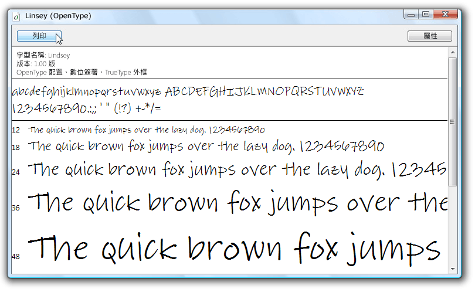

# 範例 OpenType 字型套件
本主題提供範例 [!INCLUDE[TLA#tla_opentype](../../../../includes/tlasharptla-opentype-md.md)] 字型的概觀，此字型是隨著 [!INCLUDE[TLA2#tla_wcsdk](../../../../includes/tla2sharptla-wcsdk-md.md)] 所散發。 範例字型支援延伸的 [!INCLUDE[TLA#tla_opentype](../../../../includes/tlasharptla-opentype-md.md)] 功能，此功能可供 [!INCLUDE[TLA#tla_winclient](../../../../includes/tlasharptla-winclient-md.md)] 應用程式使用。  
  
  
   
## OpenType 字型套件中的字型  
 [!INCLUDE[TLA2#tla_wcsdk](../../../../includes/tla2sharptla-wcsdk-md.md)] 提供一組範例 [!INCLUDE[TLA#tla_winclient](../../../../includes/tlasharptla-winclient-md.md)] 字型，您可以在建立 [!INCLUDE[TLA#tla_opentype](../../../../includes/tlasharptla-opentype-md.md)] 應用程式時使用此字型。 範例字型是根據 Ascender Corporation 的授權來提供。 這些字型只會實作透過 [!INCLUDE[TLA#tla_opentype](../../../../includes/tlasharptla-opentype-md.md)] 格式所定義之全體功能的子集。 下表列出範例 [!INCLUDE[TLA#tla_opentype](../../../../includes/tlasharptla-opentype-md.md)] 字型的名稱。  
  
|**名稱**|**檔案**|  
|--------------|--------------|  
|Kootenay|Kooten.ttf|  
|Lindsey|Linds.ttf|  
|Miramonte|Miramo.ttf|  
|Miramonte Bold|Miramob.ttf|  
|Pericles|Peric.ttf|  
|Pericles Light|Pericl.ttf|  
|Pescadero|Pesca.ttf|  
|Pescadero Bold|Pescab.ttf|  
  
 下圖顯示範例 [!INCLUDE[TLA#tla_opentype](../../../../includes/tlasharptla-opentype-md.md)] 字型的外觀。  
  
   
OpenType 字型套件中的字型  
  
 範例字型是根據 Ascender Corporation 的授權來提供。 Ascender 是進階字型產品的供應商。 若要授權範例字型的延伸或自訂版本，請參閱 [Ascender Corporation 網站 (英文)](https://go.microsoft.com/fwlink/?LinkId=182627)。  
  
> [!NOTE]
>  身為開發人員，您的職責是確保對於您內嵌在應用程式中或是以其他方式轉散發的任何字型，您必須有必要的授權權限。  
  
   
## 安裝字型  
 您可以選擇將範例 [!INCLUDE[TLA#tla_opentype](../../../../includes/tlasharptla-opentype-md.md)] 字型安裝到預設的 [!INCLUDE[TLA#tla_mswin](../../../../includes/tlasharptla-mswin-md.md)] 字型目錄 **\WINDOWS\Fonts**。 使用 [字型] 控制台來安裝字型。 一旦這些字型位於您的電腦上之後，所有參考預設 [!INCLUDE[TLA#tla_mswin](../../../../includes/tlasharptla-mswin-md.md)] 字型的應用程式就能存取它們。 您可以按兩下字型檔案，以數個字型大小來顯示一組代表字元。 下列螢幕擷取畫面顯示 Lindsey 字型檔案 Linds.ttf。  
  
   
顯示 Lindsey 字型  
  
   
## 使用字型  
 有兩種方式可讓您在應用程式中使用字型。 您可將字型新增到您的應用程式以做為專案內容項目，此項目並未內嵌為組件中的資源。 或者，您可以將字型新增到您的應用程式，以做為內嵌於您應用程式組件檔中的專案資源項目。 如需詳細資訊，請參閱[將字型與應用程式一起封裝](packaging-fonts-with-applications.md)。  
  
## 另請參閱
- <xref:System.Windows.Documents.Typography>
- [OpenType 字型功能](opentype-font-features.md)
- [將字型與應用程式一起封裝](packaging-fonts-with-applications.md)
