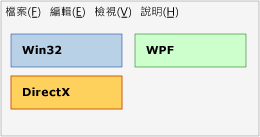
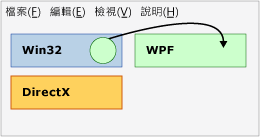
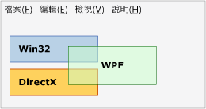
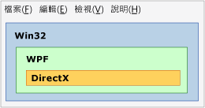
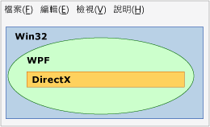

# 技術領域概觀Technology Regions Overview
如果應用程式中使用了多種展示技術 (例如 WPF、Win32 或 DirectX)，它們就必須在通用的最上層視窗中共用轉譯區域。If multiple presentation technologies are used in an application, such as WPF, Win32, or DirectX, they must share the rendering areas within a common top-level window. 本主題所描述的問題可能會影響您 WPF 交互操作應用程式的展示與輸入。This topic describes issues that might influence the presentation and input for your WPF interoperation application.  
  
## 區域Regions  
 您可以在最上層視窗中，將下列作業概念化：每個由交互操作應用程式的技術之一所組成的 HWND 都擁有自己的區域 (亦稱為「空間」)。Within a top-level window, you can conceptualize that each HWND that comprises one of the technologies of an interoperation application has its own region (also called "airspace"). 視窗內的每個像素只能屬於一個 HWND，其會構成該 HWND 的區域Each pixel within the window belongs to exactly one HWND, which constitutes the region of that HWND. (嚴格說來，如果有多個 [!INCLUDE[TLA2#tla_winclient](../../../../includes/tla2sharptla-winclient-md.md)] HWND，就會有一個以上的 [!INCLUDE[TLA2#tla_winclient](../../../../includes/tla2sharptla-winclient-md.md)] 區域，但基於本討論的目的，您可以假設只有一個)。(Strictly speaking, there is more than one [!INCLUDE[TLA2#tla_winclient](../../../../includes/tla2sharptla-winclient-md.md)] region if there is more than one [!INCLUDE[TLA2#tla_winclient](../../../../includes/tla2sharptla-winclient-md.md)] HWND, but for purposes of this discussion, you can assume there is only one). 區域意謂在應用程式存留期間，嘗試以高於該像素的方式來轉譯的所有層級或其他視窗都必須屬於相同轉譯層技術的一部分。The region implies that all layers or other windows that attempt to render above that pixel during application lifetime must be part of the same render-level technology. 嘗試透過 [!INCLUDE[TLA2#tla_win32](../../../../includes/tla2sharptla-win32-md.md)] 轉譯 [!INCLUDE[TLA2#tla_winclient](../../../../includes/tla2sharptla-winclient-md.md)] 像素會產生非預期的結果，而且不允許盡可能透過交互操作的 [!INCLUDE[TLA2#tla_api#plural](../../../../includes/tla2sharptla-apisharpplural-md.md)] 來進行。Attempting to render [!INCLUDE[TLA2#tla_winclient](../../../../includes/tla2sharptla-winclient-md.md)] pixels over [!INCLUDE[TLA2#tla_win32](../../../../includes/tla2sharptla-win32-md.md)] leads to undesirable results, and is disallowed as much as possible through the interoperation [!INCLUDE[TLA2#tla_api#plural](../../../../includes/tla2sharptla-apisharpplural-md.md)].  
  
### 區域範例Region Examples  
 下圖顯示混用 [!INCLUDE[TLA2#tla_win32](../../../../includes/tla2sharptla-win32-md.md)]、[!INCLUDE[TLA2#tla_dx](../../../../includes/tla2sharptla-dx-md.md)] 和 [!INCLUDE[TLA2#tla_winclient](../../../../includes/tla2sharptla-winclient-md.md)] 的應用程式。The following illustration shows an application that mixes [!INCLUDE[TLA2#tla_win32](../../../../includes/tla2sharptla-win32-md.md)], [!INCLUDE[TLA2#tla_dx](../../../../includes/tla2sharptla-dx-md.md)], and [!INCLUDE[TLA2#tla_winclient](../../../../includes/tla2sharptla-winclient-md.md)]. 每一種技術都會使用一組自己個別的非重疊像素，因此不會產生區域問題。Each technology uses its own separate, non-overlapping set of pixels, and there are no region issues.  
  
   
  
 假設此應用程式會使用滑鼠指標位置來建立動畫，此動畫會嘗試透過這三個區域的任一個來轉譯。Suppose that this application uses the mouse pointer position to create an animation that attempts to render over any of these three regions. 無論哪一個技術負責動畫本身，該技術都可能違反其他兩個區域。No matter which technology was responsible for the animation itself, that technology would violate the region of the other two. 下圖顯示嘗試透過 Win32 區域來轉譯 WPF 圓形。The following illustration shows an attempt to render a WPF circle over a Win32 region.  
  
   
  
 另一項違反是，如果您嘗試在不同技術之間使用透明度/Alpha 透明混色。Another violation is if you try to use transparency/alpha blending between different technologies.  在下圖中，[!INCLUDE[TLA2#tla_winclient](../../../../includes/tla2sharptla-winclient-md.md)] 方塊違反了 [!INCLUDE[TLA2#tla_win32](../../../../includes/tla2sharptla-win32-md.md)] 和 [!INCLUDE[TLA2#tla_dx](../../../../includes/tla2sharptla-dx-md.md)] 區域。In the following illustration, the [!INCLUDE[TLA2#tla_winclient](../../../../includes/tla2sharptla-winclient-md.md)] box violates the [!INCLUDE[TLA2#tla_win32](../../../../includes/tla2sharptla-win32-md.md)] and [!INCLUDE[TLA2#tla_dx](../../../../includes/tla2sharptla-dx-md.md)] regions. 因為 [!INCLUDE[TLA2#tla_winclient](../../../../includes/tla2sharptla-winclient-md.md)] 方塊中的像素呈現半透明效果，所以它們必須由 [!INCLUDE[TLA2#tla_dx](../../../../includes/tla2sharptla-dx-md.md)] 和 [!INCLUDE[TLA2#tla_winclient](../../../../includes/tla2sharptla-winclient-md.md)] 共同擁有，但這是不可能。Because pixels in that [!INCLUDE[TLA2#tla_winclient](../../../../includes/tla2sharptla-winclient-md.md)] box are semi-transparent, they would have to be owned jointly by both [!INCLUDE[TLA2#tla_dx](../../../../includes/tla2sharptla-dx-md.md)] and [!INCLUDE[TLA2#tla_winclient](../../../../includes/tla2sharptla-winclient-md.md)], which is not possible.  因此，這是另一項違反且無法建置。So this is another violation and cannot be built.  
  
   
  
 前三個範例使用了矩形區域，但可能會有不同的圖形。The previous three examples used rectangular regions, but different shapes are possible.  例如，區域可以有一個洞。For example, a region can have a hole. 下圖顯示 [!INCLUDE[TLA2#tla_win32](../../../../includes/tla2sharptla-win32-md.md)] 區域且其中有一個矩形的洞，這是結合 [!INCLUDE[TLA2#tla_winclient](../../../../includes/tla2sharptla-winclient-md.md)] 和 [!INCLUDE[TLA2#tla_dx](../../../../includes/tla2sharptla-dx-md.md)] 區域的大小。The following illustration shows a [!INCLUDE[TLA2#tla_win32](../../../../includes/tla2sharptla-win32-md.md)] region with a rectangular hole this is the size of the [!INCLUDE[TLA2#tla_winclient](../../../../includes/tla2sharptla-winclient-md.md)] and [!INCLUDE[TLA2#tla_dx](../../../../includes/tla2sharptla-dx-md.md)] regions combined.  
  
   
  
 區域不一定是矩形，也可以是 [!INCLUDE[TLA2#tla_win32](../../../../includes/tla2sharptla-win32-md.md)] HRGN (區域) 所描述的任何圖形。Regions can also be completely nonrectangular, or any shape describable by a [!INCLUDE[TLA2#tla_win32](../../../../includes/tla2sharptla-win32-md.md)] HRGN (region).  
  
   
  
## 透明度和最上層視窗Transparency and Top-Level Windows  
 事實上，只有 Windows 中的視窗管理員才能處理 [!INCLUDE[TLA2#tla_win32](../../../../includes/tla2sharptla-win32-md.md)] HWND。The window manager in Windows only really processes [!INCLUDE[TLA2#tla_win32](../../../../includes/tla2sharptla-win32-md.md)] HWNDs. 因此，每隔[!INCLUDE[TLA2#tla_winclient](../../../../includes/tla2sharptla-winclient-md.md)]<xref:System.Windows.Window>是一個 HWND。Therefore, every [!INCLUDE[TLA2#tla_winclient](../../../../includes/tla2sharptla-winclient-md.md)] <xref:System.Windows.Window> is an HWND. <xref:System.Windows.Window> System.windows.window>hwnd 必須遵守的一般規則針對任何 HWND。The <xref:System.Windows.Window> HWND must abide by the general rules for any HWND. 在該 HWND 中，[!INCLUDE[TLA2#tla_winclient](../../../../includes/tla2sharptla-winclient-md.md)] 程式碼可以執行整體 [!INCLUDE[TLA2#tla_winclient](../../../../includes/tla2sharptla-winclient-md.md)] [!INCLUDE[TLA2#tla_api#plural](../../../../includes/tla2sharptla-apisharpplural-md.md)] 支援的任何操作。Within that HWND, [!INCLUDE[TLA2#tla_winclient](../../../../includes/tla2sharptla-winclient-md.md)] code can do whatever the overall [!INCLUDE[TLA2#tla_winclient](../../../../includes/tla2sharptla-winclient-md.md)] [!INCLUDE[TLA2#tla_api#plural](../../../../includes/tla2sharptla-apisharpplural-md.md)] support. 但與桌面上的其他 HWND 互動時，[!INCLUDE[TLA2#tla_winclient](../../../../includes/tla2sharptla-winclient-md.md)] 必須遵守 [!INCLUDE[TLA2#tla_win32](../../../../includes/tla2sharptla-win32-md.md)] 處理和轉譯規則。But for interactions with other HWNDs on the desktop, [!INCLUDE[TLA2#tla_winclient](../../../../includes/tla2sharptla-winclient-md.md)] must abide by [!INCLUDE[TLA2#tla_win32](../../../../includes/tla2sharptla-win32-md.md)] processing and rendering rules.  [!INCLUDE[TLA2#tla_winclient](../../../../includes/tla2sharptla-winclient-md.md)] 使用支援非矩形視窗[!INCLUDE[TLA2#tla_win32](../../../../includes/tla2sharptla-win32-md.md)] [!INCLUDE[TLA2#tla_api#plural](../../../../includes/tla2sharptla-apisharpplural-md.md)]— 非矩形視窗，和每一像素 alpha 的分層的視窗的視窗使用 Hrgn。supports non-rectangular windows by using [!INCLUDE[TLA2#tla_win32](../../../../includes/tla2sharptla-win32-md.md)] [!INCLUDE[TLA2#tla_api#plural](../../../../includes/tla2sharptla-apisharpplural-md.md)]—HRGNs for non-rectangular windows, and layered windows for a per-pixel alpha.  
  
 不支援常數的 Alpha 和色鍵。Constant alpha and color keys are not supported.  [!INCLUDE[TLA2#tla_win32](../../../../includes/tla2sharptla-win32-md.md)] 分層的視窗功能會因平台。layered window capabilities vary by platform.  
  
 分層視窗可讓整個視窗呈現半透明狀態，方法是指定要套用至視窗中每個像素的 Alpha 值Layered windows can make the entire window translucent (semi-transparent) by specifying an alpha value to apply to every pixel in the window.  ([!INCLUDE[TLA2#tla_win32](../../../../includes/tla2sharptla-win32-md.md)] 實際上支援每個像素的 Alpha，但這很難在實際程式中使用，因為在此模式中，您可能需要自行繪製任何子系 HWND，包括對話方塊和下拉式清單)。([!INCLUDE[TLA2#tla_win32](../../../../includes/tla2sharptla-win32-md.md)] in fact supports per-pixel alpha, but this is very difficult to use in practical programs because in this mode you would need to draw any child HWND yourself, including dialogs and dropdowns).  
  
 [!INCLUDE[TLA2#tla_winclient](../../../../includes/tla2sharptla-winclient-md.md)] 支援 Hrgn;不過，有 managed[!INCLUDE[TLA2#tla_api#plural](../../../../includes/tla2sharptla-apisharpplural-md.md)]這項功能。supports HRGNs; however, there are no managed [!INCLUDE[TLA2#tla_api#plural](../../../../includes/tla2sharptla-apisharpplural-md.md)] for this functionality. 您可以使用平台叫用並<xref:System.Windows.Interop.HwndSource>來呼叫相關[!INCLUDE[TLA2#tla_win32](../../../../includes/tla2sharptla-win32-md.md)] [!INCLUDE[TLA2#tla_api#plural](../../../../includes/tla2sharptla-apisharpplural-md.md)]。You can use platform invoke and <xref:System.Windows.Interop.HwndSource> to call the relevant [!INCLUDE[TLA2#tla_win32](../../../../includes/tla2sharptla-win32-md.md)] [!INCLUDE[TLA2#tla_api#plural](../../../../includes/tla2sharptla-apisharpplural-md.md)]. 如需詳細資訊，請參閱[從 Managed 程式碼呼叫原生函式](/cpp/dotnet/calling-native-functions-from-managed-code)。For more information, see [Calling Native Functions from Managed Code](/cpp/dotnet/calling-native-functions-from-managed-code).  
  
 [!INCLUDE[TLA2#tla_winclient](../../../../includes/tla2sharptla-winclient-md.md)] 分層的視窗在不同的作業系統上有不同的功能。layered windows have different capabilities on different operating systems. 這是因為 [!INCLUDE[TLA2#tla_winclient](../../../../includes/tla2sharptla-winclient-md.md)] 會使用 [!INCLUDE[TLA2#tla_dx](../../../../includes/tla2sharptla-dx-md.md)] 來轉譯，而分層視窗主要是設計來轉譯 [!INCLUDE[TLA2#tla_gdi](../../../../includes/tla2sharptla-gdi-md.md)] ，而不是轉譯 [!INCLUDE[TLA2#tla_dx](../../../../includes/tla2sharptla-dx-md.md)]。This is because [!INCLUDE[TLA2#tla_winclient](../../../../includes/tla2sharptla-winclient-md.md)] uses [!INCLUDE[TLA2#tla_dx](../../../../includes/tla2sharptla-dx-md.md)] to render, and layered windows were primarily designed for [!INCLUDE[TLA2#tla_gdi](../../../../includes/tla2sharptla-gdi-md.md)] rendering, not [!INCLUDE[TLA2#tla_dx](../../../../includes/tla2sharptla-dx-md.md)] rendering.  
  
-   [!INCLUDE[TLA2#tla_winclient](../../../../includes/tla2sharptla-winclient-md.md)] 支援硬體加速的分層視窗在[!INCLUDE[TLA#tla_longhorn](../../../../includes/tlasharptla-longhorn-md.md)]和更新版本。supports hardware accelerated layered windows on [!INCLUDE[TLA#tla_longhorn](../../../../includes/tlasharptla-longhorn-md.md)] and later. [!INCLUDE[TLA2#tla_winxp](../../../../includes/tla2sharptla-winxp-md.md)] 上硬體加速的分層視窗需要來自 [!INCLUDE[TLA#tla_dx](../../../../includes/tlasharptla-dx-md.md)] 的支援，因此功能將取決於該機器上的 [!INCLUDE[TLA#tla_dx](../../../../includes/tlasharptla-dx-md.md)] 版本。Hardware accelerated layered windows on [!INCLUDE[TLA2#tla_winxp](../../../../includes/tla2sharptla-winxp-md.md)] require support from [!INCLUDE[TLA#tla_dx](../../../../includes/tlasharptla-dx-md.md)], so the capabilities will depend on the version of [!INCLUDE[TLA#tla_dx](../../../../includes/tlasharptla-dx-md.md)] on that machine.  
  
-   [!INCLUDE[TLA2#tla_winclient](../../../../includes/tla2sharptla-winclient-md.md)] 不支援透明色鍵，因為[!INCLUDE[TLA2#tla_winclient](../../../../includes/tla2sharptla-winclient-md.md)]無法保證可呈現您要求，特別當轉譯是硬體加速的確切色彩。does not support transparency color keys, because [!INCLUDE[TLA2#tla_winclient](../../../../includes/tla2sharptla-winclient-md.md)] cannot guarantee to render the exact color you requested, particularly when rendering is hardware-accelerated.  
  
-   如果您的應用程式是在 [!INCLUDE[TLA2#tla_winxp](../../../../includes/tla2sharptla-winxp-md.md)] 上執行，位於 [!INCLUDE[TLA2#tla_dx](../../../../includes/tla2sharptla-dx-md.md)] 介面上方的分層視窗就會在 [!INCLUDE[TLA2#tla_dx](../../../../includes/tla2sharptla-dx-md.md)] 應用程式轉譯時閃爍If your application is running on [!INCLUDE[TLA2#tla_winxp](../../../../includes/tla2sharptla-winxp-md.md)], layered windows on top of [!INCLUDE[TLA2#tla_dx](../../../../includes/tla2sharptla-dx-md.md)] surfaces flicker when the [!INCLUDE[TLA2#tla_dx](../../../../includes/tla2sharptla-dx-md.md)] application renders.  (實際轉譯順序是 [!INCLUDE[TLA#tla_gdi](../../../../includes/tlasharptla-gdi-md.md)] 會隱藏分層視窗，接著 [!INCLUDE[TLA2#tla_dx](../../../../includes/tla2sharptla-dx-md.md)] 會繪製，然後 [!INCLUDE[TLA#tla_gdi](../../../../includes/tlasharptla-gdi-md.md)] 會將分層視窗推送回來)。(The actual rendering sequence is that [!INCLUDE[TLA#tla_gdi](../../../../includes/tlasharptla-gdi-md.md)] hides the layered window, then [!INCLUDE[TLA2#tla_dx](../../../../includes/tla2sharptla-dx-md.md)] draws, and then [!INCLUDE[TLA#tla_gdi](../../../../includes/tlasharptla-gdi-md.md)] puts the layered window back).  非 [!INCLUDE[TLA2#tla_winclient](../../../../includes/tla2sharptla-winclient-md.md)] 的分層視窗也有這項限制。Non-[!INCLUDE[TLA2#tla_winclient](../../../../includes/tla2sharptla-winclient-md.md)] layered windows also have this limitation.  
  
## 另請參閱See also

- [WPF 和 Win32 互通WPF and Win32 Interoperation](wpf-and-win32-interoperation.md)
- [逐步解說：將 WPF 時鐘裝載在 Win32 中Walkthrough: Hosting a WPF Clock in Win32](walkthrough-hosting-a-wpf-clock-in-win32.md)
- [在 WPF 中裝載 Win32 內容Hosting Win32 Content in WPF](hosting-win32-content-in-wpf.md)
