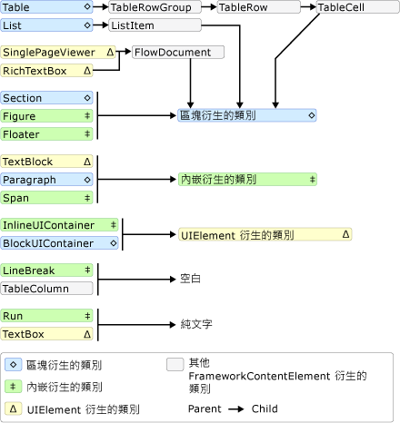
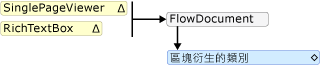
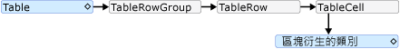
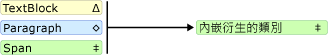
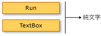

# TextElement 內容模型概觀
本內容模型概觀描述支援的內容<xref:System.Windows.Documents.TextElement>。 <xref:System.Windows.Documents.Paragraph>類別是一種<xref:System.Windows.Documents.TextElement>。 內容模型描述哪些物件/元素可包含於其他物件/元素內。 本概觀摘要說明用於衍生自物件的內容模型<xref:System.Windows.Documents.TextElement>。 如需詳細資訊，請參閱 <<c0> [ 非固定格式文件概觀](../../../../docs/framework/wpf/advanced/flow-document-overview.md)。  
  
  
   
## 內容模型圖表  
 下圖摘要說明內容的模型類別衍生自<xref:System.Windows.Documents.TextElement>以及如何其他非`TextElement`符合此模型的類別。  
  
   
  
 從上圖中可以看出，允許的項目子系不一定取決於類別是否衍生自<xref:System.Windows.Documents.Block>類別或<xref:System.Windows.Documents.Inline>類別。 例如， <xref:System.Windows.Documents.Span> ( <xref:System.Windows.Documents.Inline>-衍生的類別) 只能有<xref:System.Windows.Documents.Inline>子項目，但<xref:System.Windows.Documents.Figure>(也<xref:System.Windows.Documents.Inline>-衍生的類別) 只能有<xref:System.Windows.Documents.Block>子項目。 因此，可快速判斷哪個元素可包含於其他元素中的圖表就很有用。 例如，讓我們使用圖表 」 來決定如何建構非固定格式內容的<xref:System.Windows.Controls.RichTextBox>。  
  
1.  A<xref:System.Windows.Controls.RichTextBox>必須包含<xref:System.Windows.Documents.FlowDocument>因此必須包含<xref:System.Windows.Documents.Block>-衍生物件。 以下是上圖的對應區段。  
  
       
  
     這是標記目前可能的樣子。  
  
     [!code-xaml[FlowOvwSnippets_snip#SchemaWalkThrough1](../../../../samples/snippets/csharp/VS_Snippets_Wpf/FlowOvwSnippets_snip/CS/MiscSnippets.xaml#schemawalkthrough1)]  
  
2.  根據圖表中，有幾個<xref:System.Windows.Documents.Block>選擇，包括的項目<xref:System.Windows.Documents.Paragraph>， <xref:System.Windows.Documents.Section>， <xref:System.Windows.Documents.Table>， <xref:System.Windows.Documents.List>，和<xref:System.Windows.Documents.BlockUIContainer>（請參閱上圖中的區塊衍生類別）。 假設我們想<xref:System.Windows.Documents.Table>。 上圖中，根據<xref:System.Windows.Documents.Table>包含<xref:System.Windows.Documents.TableRowGroup>包含<xref:System.Windows.Documents.TableRow>項目，其中包含<xref:System.Windows.Documents.TableCell>包含的項目<xref:System.Windows.Documents.Block>-衍生物件。 以下是對應的區段，如<xref:System.Windows.Documents.Table>取自上圖中。  
  
       
  
     以下是對應的標記。  
  
     [!code-xaml[FlowOvwSnippets_snip#SchemaWalkThrough2](../../../../samples/snippets/csharp/VS_Snippets_Wpf/FlowOvwSnippets_snip/CS/MiscSnippets.xaml#schemawalkthrough2)]  
  
3.  同樣地，一或多個<xref:System.Windows.Documents.Block>項目下方需要<xref:System.Windows.Documents.TableCell>。 為求簡便，我們在儲存格中放入一些文字。 我們可以使用執行此<xref:System.Windows.Documents.Paragraph>與<xref:System.Windows.Documents.Run>項目。 以下是顯示圖表的對應區段<xref:System.Windows.Documents.Paragraph>花費<xref:System.Windows.Documents.Inline>項目、 且<xref:System.Windows.Documents.Run>(<xref:System.Windows.Documents.Inline>項目) 只能接受純文字。  
  
       
  
       
  
 以下是標記的完整範例。  
  
 [!code-xaml[FlowOvwSnippets_snip#SchemaExampleWholePage](../../../../samples/snippets/csharp/VS_Snippets_Wpf/FlowOvwSnippets_snip/CS/SchemaExample.xaml#schemaexamplewholepage)]  
  
   
## 以程式設計方式使用 TextElement 內容  
 內容<xref:System.Windows.Documents.TextElement>組成的集合，因此以程式設計方式操作的內容<xref:System.Windows.Documents.TextElement>物件是藉由使用這些集合。 有三個不同的集合，可供<xref:System.Windows.Documents.TextElement>-衍生的類別：  
  
-   <xref:System.Windows.Documents.InlineCollection>：表示 <xref:System.Windows.Documents.Inline> 項目的集合。 <xref:System.Windows.Documents.InlineCollection> 會定義 <xref:System.Windows.Documents.Paragraph>、<xref:System.Windows.Documents.Span> 和 <xref:System.Windows.Controls.TextBlock> 項目的可允許子內容。  
  
-   <xref:System.Windows.Documents.BlockCollection>：表示 <xref:System.Windows.Documents.Block> 項目的集合。 <xref:System.Windows.Documents.BlockCollection> 會定義 <xref:System.Windows.Documents.FlowDocument>、<xref:System.Windows.Documents.Section>、<xref:System.Windows.Documents.ListItem>、<xref:System.Windows.Documents.TableCell>、<xref:System.Windows.Documents.Floater> 和 <xref:System.Windows.Documents.Figure> 項目的可允許子內容。  
  
-   <xref:System.Windows.Documents.ListItemCollection>：流動內容項目，表示特定的內容項目，在已排序或未按順序<xref:System.Windows.Documents.List>。  
  
 您可以使用操作 （新增或移除項目） 從這些使用的個別屬性的集合**Inlines**，**區塊**，並**ListItems**。 下列範例示範如何操作的內容使用 Span **Inlines**屬性。  
  
> [!NOTE]
>  表格會使用數個集合來管理它的內容，但不會在此處加以討論。 如需詳細資訊，請參閱 <<c0> [ 資料表概觀](../../../../docs/framework/wpf/advanced/table-overview.md)。  
  
 下列範例會建立新<xref:System.Windows.Documents.Span>物件，然後使用`Add`方法來新增兩個文字執行為內容的子系<xref:System.Windows.Documents.Span>。  
  
 [!code-csharp[SpanSnippets#_SpanInlinesAdd](../../../../samples/snippets/csharp/VS_Snippets_Wpf/SpanSnippets/CSharp/Window1.xaml.cs#_spaninlinesadd)]
 [!code-vb[SpanSnippets#_SpanInlinesAdd](../../../../samples/snippets/visualbasic/VS_Snippets_Wpf/SpanSnippets/visualbasic/window1.xaml.vb#_spaninlinesadd)]  
  
 下列範例會建立新<xref:System.Windows.Documents.Run>項目，並將它插入開頭<xref:System.Windows.Documents.Span>。  
  
 [!code-csharp[SpanSnippets#_SpanInlinesInsert](../../../../samples/snippets/csharp/VS_Snippets_Wpf/SpanSnippets/CSharp/Window1.xaml.cs#_spaninlinesinsert)]
 [!code-vb[SpanSnippets#_SpanInlinesInsert](../../../../samples/snippets/visualbasic/VS_Snippets_Wpf/SpanSnippets/visualbasic/window1.xaml.vb#_spaninlinesinsert)]  
  
 下列範例會刪除最後一個<xref:System.Windows.Documents.Inline>中的項目<xref:System.Windows.Documents.Span>。  
  
 [!code-csharp[SpanSnippets#_SpanInlinesRemoveLast](../../../../samples/snippets/csharp/VS_Snippets_Wpf/SpanSnippets/CSharp/Window1.xaml.cs#_spaninlinesremovelast)]
 [!code-vb[SpanSnippets#_SpanInlinesRemoveLast](../../../../samples/snippets/visualbasic/VS_Snippets_Wpf/SpanSnippets/visualbasic/window1.xaml.vb#_spaninlinesremovelast)]  
  
 下列範例會清除所有內容 (<xref:System.Windows.Documents.Inline>項目) 從<xref:System.Windows.Documents.Span>。  
  
 [!code-csharp[SpanSnippets#_SpanInlinesClear](../../../../samples/snippets/csharp/VS_Snippets_Wpf/SpanSnippets/CSharp/Window1.xaml.cs#_spaninlinesclear)]
 [!code-vb[SpanSnippets#_SpanInlinesClear](../../../../samples/snippets/visualbasic/VS_Snippets_Wpf/SpanSnippets/visualbasic/window1.xaml.vb#_spaninlinesclear)]  
  
   
## 共用此內容模型的類型  
 下列類型繼承自<xref:System.Windows.Documents.TextElement>類別，並可用來顯示此概觀中所述的內容。  
  
 <xref:System.Windows.Documents.Bold>, <xref:System.Windows.Documents.Figure>, <xref:System.Windows.Documents.Floater>, <xref:System.Windows.Documents.Hyperlink>, <xref:System.Windows.Documents.InlineUIContainer>, <xref:System.Windows.Documents.Italic>, <xref:System.Windows.Documents.LineBreak>, <xref:System.Windows.Documents.List>, <xref:System.Windows.Documents.ListItem>, <xref:System.Windows.Documents.Paragraph>, <xref:System.Windows.Documents.Run>, <xref:System.Windows.Documents.Section>, <xref:System.Windows.Documents.Span>, <xref:System.Windows.Documents.Table>, <xref:System.Windows.Documents.Underline>.  
  
 請注意，此清單只包含隨附的非抽象類型[!INCLUDE[TLA2#tla_winfxsdk](../../../../includes/tla2sharptla-winfxsdk-md.md)]。 您可以使用繼承自其他類型<xref:System.Windows.Documents.TextElement>。  
  
   
## 可包含 TextElement 物件的類型  
 請參閱[WPF 內容模型](../../../../docs/framework/wpf/controls/wpf-content-model.md)。  
  
## 另請參閱
- [透過 Blocks 屬性管理 FlowDocument](../../../../docs/framework/wpf/advanced/how-to-manipulate-a-flowdocument-through-the-blocks-property.md)
- [透過 Blocks 屬性管理非固定格式內容元素](../../../../docs/framework/wpf/advanced/how-to-manipulate-flow-content-elements-through-the-blocks-property.md)
- [透過 Blocks 屬性管理 FlowDocument](../../../../docs/framework/wpf/advanced/how-to-manipulate-a-flowdocument-through-the-blocks-property.md)
- [透過 Columns 屬性管理表格的資料行](../../../../docs/framework/wpf/advanced/how-to-manipulate-table-columns-through-the-columns-property.md)
- [透過 RowGroups 屬性管理表格的資料列群組](../../../../docs/framework/wpf/advanced/how-to-manipulate-table-row-groups-through-the-rowgroups-property.md)
