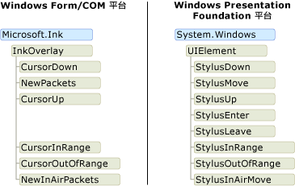
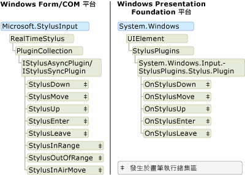

# Ink 物件模型：Windows Forms 和 COM 與 WPF 的比較

有基本上是三個支援的平台數位筆跡： Tablet PC 的 Windows Form 平台、 Tablet PC COM 平台和 Windows Presentation Foundation (WPF) 平台。  類似的物件模型，但物件模型的 Windows Form 和 COM 平台共用[!INCLUDE[TLA2#tla_wpf](../../../../includes/tla2sharptla-wpf-md.md)]平台是本質上不同。  本主題討論的高階的差異，讓曾用過一個物件模型的開發人員可以更了解其他。  
  
## 啟用應用程式中的筆墨  
 所有的三個平台出貨物件和控制項，可讓應用程式以接收來自 tablet 手寫筆輸入。  Windows Forms 和 COM 平台隨附[Microsoft.Ink.InkPicture](https://docs.microsoft.com/previous-versions/dotnet/netframework-3.5/ms583740(v=vs.90))， [Microsoft.Ink.InkEdit](https://docs.microsoft.com/previous-versions/dotnet/netframework-3.5/ms552265(v=vs.90))， [Microsoft.Ink.InkOverlay](https://docs.microsoft.com/previous-versions/dotnet/netframework-3.5/ms552322(v=vs.90))並[Microsoft.Ink.InkCollector](https://docs.microsoft.com/previous-versions/dotnet/netframework-3.5/ms583683(v=vs.90))類別。  [Microsoft.Ink.InkPicture](https://docs.microsoft.com/previous-versions/dotnet/netframework-3.5/ms583740(v=vs.90))並[Microsoft.Ink.InkEdit](https://docs.microsoft.com/previous-versions/dotnet/netframework-3.5/ms552265(v=vs.90))是控制項，您可以新增至應用程式以收集筆跡。  [Microsoft.Ink.InkOverlay](https://docs.microsoft.com/previous-versions/dotnet/netframework-3.5/ms552322(v=vs.90))並[Microsoft.Ink.InkCollector](https://docs.microsoft.com/previous-versions/dotnet/netframework-3.5/ms583683(v=vs.90))可以附加至現有的視窗，筆跡啟用 windows 和自訂控制項。  
  
 WPF 平台包括<xref:System.Windows.Controls.InkCanvas>控制項。  您可以新增<xref:System.Windows.Controls.InkCanvas>您的應用程式並開始立即收集筆跡。 使用<xref:System.Windows.Controls.InkCanvas>，使用者可以複製、 選取和調整大小的筆墨。  您可以將其他控制項加入<xref:System.Windows.Controls.InkCanvas>，和使用者可以太手寫透過這些控制項。  您可以建立具備筆墨功能的自訂控制項加入<xref:System.Windows.Controls.InkPresenter>並收集其手寫筆點。  
  
 下表列出可讓您進一步了解啟用應用程式中的筆墨：  
  
|若要這樣做...|WPF 平台上...|在 Windows Form/COM 平台上...|  
|-----------------|--------------------------|------------------------------------------|  
|具備筆墨功能將控制項新增至應用程式|請參閱[Getting Started with 筆墨](getting-started-with-ink.md)。|請參閱[自動宣告表單範例](/windows/desktop/tablet/auto-claims-form-sample)|  
|啟用自訂控制項上的筆墨|請參閱[建立筆墨輸入控制項](creating-an-ink-input-control.md)。|請參閱[筆跡剪貼簿範例](/windows/desktop/tablet/ink-clipboard-sample)。|  
  
## 筆墨資料  
 在 Windows Form 和 COM 的平台上[Microsoft.Ink.InkCollector](https://docs.microsoft.com/previous-versions/dotnet/netframework-3.5/ms583683(v=vs.90))， [Microsoft.Ink.InkOverlay](https://docs.microsoft.com/previous-versions/dotnet/netframework-3.5/ms552322(v=vs.90))， [Microsoft.Ink.InkEdit](https://docs.microsoft.com/previous-versions/dotnet/netframework-3.5/ms552265(v=vs.90))，和[Microsoft.Ink.InkPicture](https://docs.microsoft.com/previous-versions/dotnet/netframework-3.5/ms583740(v=vs.90))每個公開[Microsoft.Ink.Ink](https://docs.microsoft.com/previous-versions/dotnet/netframework-3.5/ms583670(v=vs.90))物件。 [Microsoft.Ink.Ink](https://docs.microsoft.com/previous-versions/dotnet/netframework-3.5/ms583670(v=vs.90))物件的一或多個包含的資料[Microsoft.Ink.Stroke](https://docs.microsoft.com/previous-versions/dotnet/netframework-3.5/ms552692(v=vs.90))物件，並公開 （expose） 常用的方法和屬性，以管理和操作這些筆劃。  [Microsoft.Ink.Ink](https://docs.microsoft.com/previous-versions/dotnet/netframework-3.5/ms583670(v=vs.90))物件會管理包含; 筆劃的存留期[Microsoft.Ink.Ink](https://docs.microsoft.com/previous-versions/dotnet/netframework-3.5/ms583670(v=vs.90))物件會建立並刪除其所擁有的筆劃。  每個[Microsoft.Ink.Stroke](https://docs.microsoft.com/previous-versions/dotnet/netframework-3.5/ms552692(v=vs.90))具有其父代內是唯一的識別項[Microsoft.Ink.Ink](https://docs.microsoft.com/previous-versions/dotnet/netframework-3.5/ms583670(v=vs.90))物件。  
  
 WPF 平台上<xref:System.Windows.Ink.Stroke?displayProperty=nameWithType>類別擁有及管理自己的存留期。 一群<xref:System.Windows.Ink.Stroke>可以一起收集的物件，在<xref:System.Windows.Ink.StrokeCollection>，其中提供的方法適用於一般的筆墨資料管理作業這類點擊測試、 清除、 轉換及序列化筆墨。 A<xref:System.Windows.Ink.Stroke>零個、 一個或多個可以屬於<xref:System.Windows.Ink.StrokeCollection>在任何物件提供的時間。  而不需[Microsoft.Ink.Ink](https://docs.microsoft.com/previous-versions/dotnet/netframework-3.5/ms583670(v=vs.90))物件，<xref:System.Windows.Controls.InkCanvas>並<xref:System.Windows.Controls.InkPresenter>包含<xref:System.Windows.Ink.StrokeCollection?displayProperty=nameWithType>。  
  
 下列圖例配對會比較筆墨資料的物件模型。  在 Windows Form 和 COM 的平台上[Microsoft.Ink.Ink](https://docs.microsoft.com/previous-versions/dotnet/netframework-3.5/ms583670(v=vs.90))物件會限制的存留期[Microsoft.Ink.Stroke](https://docs.microsoft.com/previous-versions/dotnet/netframework-3.5/ms552692(v=vs.90))物件，以及隸屬於個別的筆劃的手寫筆封包。  兩個或多個筆劃可以參考相同[Microsoft.Ink.DrawingAttributes](https://docs.microsoft.com/previous-versions/dotnet/netframework-3.5/ms583636(v=vs.90))物件，如下圖所示。  
  
   
  
 在  [!INCLUDE[TLA2#tla_winclient](../../../../includes/tla2sharptla-winclient-md.md)]，每個<xref:System.Windows.Ink.Stroke?displayProperty=nameWithType>是存在，只要項目有其參考 common language runtime 物件。  每個<xref:System.Windows.Ink.Stroke>參考<xref:System.Windows.Input.StylusPointCollection>和<xref:System.Windows.Ink.DrawingAttributes?displayProperty=nameWithType>物件，還有 common language runtime 物件。  
  
   
  
 下表比較如何完成一些常見的工作上[!INCLUDE[TLA2#tla_wpf](../../../../includes/tla2sharptla-wpf-md.md)]平台和 Windows Form 和 COM 的平台。  
  
|工作|Windows Presentation Foundation|Windows Forms 和 COM|  
|----------|-------------------------------------|---------------------------|  
|儲存筆墨|<xref:System.Windows.Ink.StrokeCollection.Save%2A>|[Microsoft.Ink.Ink.Save](https://docs.microsoft.com/previous-versions/dotnet/netframework-3.5/ms571335(v=vs.90))|  
|載入筆墨|建立<xref:System.Windows.Ink.StrokeCollection>與<xref:System.Windows.Ink.StrokeCollection.%23ctor%2A>建構函式。|[Microsoft.Ink.Ink.Load](https://docs.microsoft.com/previous-versions/dotnet/netframework-3.5/ms569609(v=vs.90))|  
|點擊的測試|<xref:System.Windows.Ink.StrokeCollection.HitTest%2A>|[Microsoft.Ink.Ink.HitTest](https://docs.microsoft.com/previous-versions/dotnet/netframework-3.5/ms571330(v=vs.90))|  
|複製筆墨|<xref:System.Windows.Controls.InkCanvas.CopySelection%2A>|[Microsoft.Ink.Ink.ClipboardCopy](https://docs.microsoft.com/previous-versions/dotnet/netframework-3.5/ms571316(v=vs.90))|  
|貼上筆墨|<xref:System.Windows.Controls.InkCanvas.Paste%2A>|[Microsoft.Ink.Ink.ClipboardPaste](https://docs.microsoft.com/previous-versions/dotnet/netframework-3.5/ms571318(v=vs.90))|  
|存取自訂屬性上的筆劃集合|<xref:System.Windows.Ink.StrokeCollection.AddPropertyData%2A> (在內部儲存及存取透過屬性<xref:System.Windows.Ink.StrokeCollection.AddPropertyData%2A>， <xref:System.Windows.Ink.StrokeCollection.RemovePropertyData%2A>，和<xref:System.Windows.Ink.StrokeCollection.ContainsPropertyData%2A>)|使用[Microsoft.Ink.Ink.ExtendedProperties](https://docs.microsoft.com/previous-versions/dotnet/netframework-3.5/ms582214(v=vs.90))|  
  
### 共用平台之間的筆墨  
 雖然平台的筆墨資料的不同的物件模型，但共用平台之間的資料是非常簡單。 下列範例 Windows Form 應用程式中儲存筆墨及載入 Windows Presentation Foundation 應用程式中的筆墨。  
  
 [!code-csharp[WinFormWPFInk#UsingWinforms](~/samples/snippets/csharp/VS_Snippets_Wpf/WinformWPFInk/CSharp/Program.cs#usingwinforms)]
 [!code-vb[WinFormWPFInk#UsingWinforms](~/samples/snippets/visualbasic/VS_Snippets_Wpf/WinformWPFInk/VisualBasic/Module1.vb#usingwinforms)]  
[!code-csharp[WinFormWPFInk#SaveWinforms](~/samples/snippets/csharp/VS_Snippets_Wpf/WinformWPFInk/CSharp/Program.cs#savewinforms)]
[!code-vb[WinFormWPFInk#SaveWinforms](~/samples/snippets/visualbasic/VS_Snippets_Wpf/WinformWPFInk/VisualBasic/Module1.vb#savewinforms)]  
  
 [!code-csharp[WinFormWPFInk#UsingWPF](~/samples/snippets/csharp/VS_Snippets_Wpf/WinformWPFInk/CSharp/Program.cs#usingwpf)]
 [!code-vb[WinFormWPFInk#UsingWPF](~/samples/snippets/visualbasic/VS_Snippets_Wpf/WinformWPFInk/VisualBasic/Module1.vb#usingwpf)]  
[!code-csharp[WinFormWPFInk#LoadWPF](~/samples/snippets/csharp/VS_Snippets_Wpf/WinformWPFInk/CSharp/Program.cs#loadwpf)]
[!code-vb[WinFormWPFInk#LoadWPF](~/samples/snippets/visualbasic/VS_Snippets_Wpf/WinformWPFInk/VisualBasic/Module1.vb#loadwpf)]  
  
 下列範例會從 Windows Presentation Foundation 應用程式中儲存筆墨和載入的 Windows Forms 應用程式中的筆墨。  
  
 [!code-csharp[WinFormWPFInk#UsingWPF](~/samples/snippets/csharp/VS_Snippets_Wpf/WinformWPFInk/CSharp/Program.cs#usingwpf)]
 [!code-vb[WinFormWPFInk#UsingWPF](~/samples/snippets/visualbasic/VS_Snippets_Wpf/WinformWPFInk/VisualBasic/Module1.vb#usingwpf)]  
[!code-csharp[WinFormWPFInk#SaveWPF](~/samples/snippets/csharp/VS_Snippets_Wpf/WinformWPFInk/CSharp/Program.cs#savewpf)]
[!code-vb[WinFormWPFInk#SaveWPF](~/samples/snippets/visualbasic/VS_Snippets_Wpf/WinformWPFInk/VisualBasic/Module1.vb#savewpf)]  
  
 [!code-csharp[WinFormWPFInk#UsingWinforms](~/samples/snippets/csharp/VS_Snippets_Wpf/WinformWPFInk/CSharp/Program.cs#usingwinforms)]
 [!code-vb[WinFormWPFInk#UsingWinforms](~/samples/snippets/visualbasic/VS_Snippets_Wpf/WinformWPFInk/VisualBasic/Module1.vb#usingwinforms)]  
[!code-csharp[WinFormWPFInk#LoadWinforms](~/samples/snippets/csharp/VS_Snippets_Wpf/WinformWPFInk/CSharp/Program.cs#loadwinforms)]
[!code-vb[WinFormWPFInk#LoadWinforms](~/samples/snippets/visualbasic/VS_Snippets_Wpf/WinformWPFInk/VisualBasic/Module1.vb#loadwinforms)]
## 來自 Tablet 手寫筆的事件  

 [Microsoft.Ink.InkOverlay](https://docs.microsoft.com/previous-versions/dotnet/netframework-3.5/ms552322(v=vs.90))， [Microsoft.Ink.InkCollector](https://docs.microsoft.com/previous-versions/dotnet/netframework-3.5/ms583683(v=vs.90))，並[Microsoft.Ink.InkPicture](https://docs.microsoft.com/previous-versions/dotnet/netframework-3.5/ms583740(v=vs.90))在 Windows Forms 和 COM 平台會收到事件時的使用者輸入手寫筆的資料。 [Microsoft.Ink.InkOverlay](https://docs.microsoft.com/previous-versions/dotnet/netframework-3.5/ms552322(v=vs.90))或是[Microsoft.Ink.InkCollector](https://docs.microsoft.com/previous-versions/dotnet/netframework-3.5/ms583683(v=vs.90))會附加至 視窗或控制項，並可以訂閱的平板電腦的輸入資料所引發的事件。 這些事件發生所在的執行緒，取決於是否會引發事件與畫筆、 滑鼠，或以程式設計的方式。 如需與這些事件相關執行緒的詳細資訊，請參閱[一般的執行緒考量](/windows/desktop/tablet/general-threading-considerations)並[執行緒可以引發事件](/windows/desktop/tablet/threads-on-which-an-event-can-fire)。  
  
 Windows Presentation Foundation 平台上<xref:System.Windows.UIElement>類別具有手寫筆輸入的事件。 這表示每個控制項會公開一組完整的手寫筆事件。  手寫筆事件有通道/事件反昇事件配對，而且一律在應用程式執行緒上進行。  如需詳細資訊，請參閱 <<c0> [ 路由事件概觀](routed-events-overview.md)。  
  
 下圖顯示比較的物件模型引發手寫筆事件的類別。 Windows Presentation Foundation 物件模型會顯示只是事件反昇事件，不對應通道的事件。  
  
   
  
## 手寫筆的資料  
 所有的三個平台為您提供方法攔截並處理來自 tablet 手寫筆的資料。  在 Windows Forms 和 COM 平台上，即可達成此目的建立[Microsoft.StylusInput.RealTimeStylus](https://docs.microsoft.com/previous-versions/dotnet/netframework-3.5/ms585724(v=vs.90))、 將視窗或控制項附加至，和建立類別來實作[Microsoft.StylusInput.IStylusSyncPlugin](https://docs.microsoft.com/previous-versions/dotnet/netframework-3.5/ms575201(v=vs.90))或是[Microsoft.StylusInput.IStylusAsyncPlugin](https://docs.microsoft.com/previous-versions/dotnet/netframework-3.5/ms575194(v=vs.90))介面。 自訂外掛程式接著會新增至的外掛程式集合[Microsoft.StylusInput.RealTimeStylus](https://docs.microsoft.com/previous-versions/dotnet/netframework-3.5/ms585724(v=vs.90))。 如需有關此物件模型的詳細資訊，請參閱 < [StylusInput Api 的架構](/windows/desktop/tablet/architecture-of-the-stylusinput-apis)。  
  
 在 [!INCLUDE[TLA2#tla_wpf](../../../../includes/tla2sharptla-wpf-md.md)]平台<xref:System.Windows.UIElement>類別會公開的外掛程式，類似設計集合[Microsoft.StylusInput.RealTimeStylus](https://docs.microsoft.com/previous-versions/dotnet/netframework-3.5/ms585724(v=vs.90))。  若要攔截手寫筆的資料，建立繼承自類別<xref:System.Windows.Input.StylusPlugIns.StylusPlugIn>並將物件加入至<xref:System.Windows.UIElement.StylusPlugIns%2A>的集合<xref:System.Windows.UIElement>。 如需這種互動的詳細資訊，請參閱[攔截手寫筆輸入](intercepting-input-from-the-stylus.md)。  
  
 在所有平台，執行緒集區接收筆墨資料透過手寫筆的事件，並將它傳送至應用程式執行緒。  如需執行緒的 COM 和 Windows 平台上的詳細資訊，請參閱[StylusInput Api 的執行緒考量](/windows/desktop/tablet/threading-considerations-for-the-stylusinput-apis)。  如需執行緒的 Windows Presentation 軟體的詳細資訊，請參閱[筆跡執行緒模型](the-ink-threading-model.md)。  
  
 下圖比較的物件模型，接收畫筆的畫筆執行緒集區資料的類別。  
  
 
