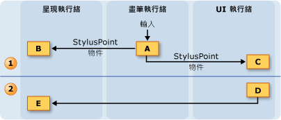
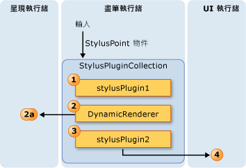
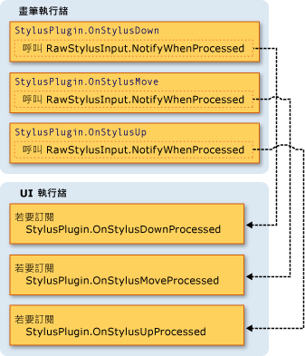
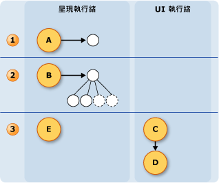

# 筆墨執行緒模型The Ink Threading Model
其中一個 Tablet PC 上的優點是筆墨的，它感覺更像是撰寫使用一般紙筆。One of the benefits of ink on a Tablet PC is that it feels a lot like writing with a regular pen and paper.  若要達成此目的，tablet 畫筆會收集輸入的資料，以更高的速率超過沒有滑鼠，而且會筆跡轉譯成使用者寫入。To accomplish this, the tablet pen collects input data at a much higher rate than a mouse does and renders the ink as the user writes.  應用程式的使用者介面 (UI) 執行緒不足，無法收集畫筆資料及呈現筆墨，因為它可能會被封鎖。The application's user interface (UI) thread is not sufficient for collecting pen data and rendering ink, because it can become blocked.  若要解決此，[!INCLUDE[TLA2#tla_winclient](../../../../includes/tla2sharptla-winclient-md.md)]使用者撰寫的筆墨時，應用程式會使用兩個額外的執行緒。To solve this, a [!INCLUDE[TLA2#tla_winclient](../../../../includes/tla2sharptla-winclient-md.md)] application uses two additional threads when a user writes ink.  
  
 下列清單描述使用的收集和呈現數位筆跡執行緒：The following list describes the threads that take part in collecting and rendering digital ink:  
  
-   畫筆執行緒會將手寫筆的執行緒。Pen thread - the thread that takes input from the stylus.  （事實上，這是在執行緒集區中，但本主題是指其畫筆執行緒）。(In reality, this is a thread pool, but this topic refers to it as a pen thread.)  
  
-   應用程式使用者介面執行緒控制應用程式的使用者介面執行緒。Application user interface thread - the thread that controls the user interface of the application.  
  
-   動態呈現執行緒： 呈現時使用者筆墨執行緒繪製筆觸。Dynamic rendering thread - the thread that renders the ink while the user draws a stroke. 視窗 Presentation Foundation 中所述的動態呈現執行緒會呈現其他 UI 項目，應用程式執行緒以外的不同[執行緒模型](../../../../docs/framework/wpf/advanced/threading-model.md)。The dynamic rendering thread is different than the thread that renders other UI elements for the application, as mentioned in Window Presentation Foundation [Threading Model](../../../../docs/framework/wpf/advanced/threading-model.md).  
  
 不論應用程式使用筆跡的模型都相同<xref:System.Windows.Controls.InkCanvas>或自訂控制項中的一個類似[建立筆跡輸入控制項](../../../../docs/framework/wpf/advanced/creating-an-ink-input-control.md)。The inking model is the same whether the application uses the <xref:System.Windows.Controls.InkCanvas> or a custom control similar to the one in [Creating an Ink Input Control](../../../../docs/framework/wpf/advanced/creating-an-ink-input-control.md).  雖然本主題討論的執行緒<xref:System.Windows.Controls.InkCanvas>，相同的概念適用於當您建立自訂控制項。Although this topic discusses threading in terms of the <xref:System.Windows.Controls.InkCanvas>, the same concepts apply when you create a custom control.  
  
## 執行緒處理概觀Threading Overview  
 下圖說明的執行緒模型，當使用者繪製筆觸時：The following diagram illustrates the threading model when a user draws a stroke:  
  
 ![繪製筆觸期間的執行緒模型。] (../../../../docs/framework/wpf/advanced/media/inkthreading-drawingink.png "InkThreading_DrawingInk")  
  
1.  使用者繪製筆觸時發生的動作Actions occurring while the user draws the stroke  
  
    1.  當使用者繪製筆觸時，手寫筆的點有畫筆執行緒上。When the user draws a stroke, the stylus points come in on the pen thread.  手寫筆外掛程式，包括<xref:System.Windows.Input.StylusPlugIns.DynamicRenderer>、 接受手寫筆上的點畫筆執行緒並有機會修改過他們的<xref:System.Windows.Controls.InkCanvas>接收它們。Stylus plug-ins, including the <xref:System.Windows.Input.StylusPlugIns.DynamicRenderer>, accept the stylus points on the pen thread and have the chance to modify them before the <xref:System.Windows.Controls.InkCanvas> receives them.  
  
    2.  <xref:System.Windows.Input.StylusPlugIns.DynamicRenderer>呈現手寫筆的點上的動態呈現執行緒。The <xref:System.Windows.Input.StylusPlugIns.DynamicRenderer> renders the stylus points on the dynamic rendering thread. 這會發生在上一個步驟相同的時間。This happens at the same time as the previous step.  
  
    3.  <xref:System.Windows.Controls.InkCanvas>接收手寫筆在 UI 執行緒上的點。The <xref:System.Windows.Controls.InkCanvas> receives the stylus points on the UI thread.  
  
2.  發生使用者結束筆觸動作Actions occurring after the user ends the stroke  
  
    1.  當使用者完成繪製筆觸<xref:System.Windows.Controls.InkCanvas>建立<xref:System.Windows.Ink.Stroke>物件，並將它加入至<xref:System.Windows.Controls.InkPresenter>，它以靜態方式呈現。When the user finishes drawing the stroke, the <xref:System.Windows.Controls.InkCanvas> creates a <xref:System.Windows.Ink.Stroke> object and adds it to the <xref:System.Windows.Controls.InkPresenter>, which statically renders it.  
  
    2.  UI 執行緒警示<xref:System.Windows.Input.StylusPlugIns.DynamicRenderer>筆觸以靜態方式轉譯，所以<xref:System.Windows.Input.StylusPlugIns.DynamicRenderer>筆劃其視覺表示法中移除。The UI thread alerts the <xref:System.Windows.Input.StylusPlugIns.DynamicRenderer> that the stroke is statically rendered, so the <xref:System.Windows.Input.StylusPlugIns.DynamicRenderer> removes its visual representation of the stroke.  
  
## 集合筆跡和手寫筆外掛程式Ink collection and Stylus Plug-ins  
 每個<xref:System.Windows.UIElement>具有<xref:System.Windows.Input.StylusPlugIns.StylusPlugInCollection>。Each <xref:System.Windows.UIElement> has a <xref:System.Windows.Input.StylusPlugIns.StylusPlugInCollection>.  <xref:System.Windows.Input.StylusPlugIns.StylusPlugIn>中的物件<xref:System.Windows.Input.StylusPlugIns.StylusPlugInCollection>接收且可修改手寫筆上的點畫筆執行緒。The <xref:System.Windows.Input.StylusPlugIns.StylusPlugIn> objects in the <xref:System.Windows.Input.StylusPlugIns.StylusPlugInCollection> receive and can modify the stylus points on the pen thread. <xref:System.Windows.Input.StylusPlugIns.StylusPlugIn>物件接收的順序根據手寫筆的點<xref:System.Windows.Input.StylusPlugIns.StylusPlugInCollection>。The <xref:System.Windows.Input.StylusPlugIns.StylusPlugIn> objects receive the stylus points according to their order in the <xref:System.Windows.Input.StylusPlugIns.StylusPlugInCollection>.  
  
 下列圖表說明在假設性的情況下其中<xref:System.Windows.UIElement.StylusPlugIns%2A>集合<xref:System.Windows.UIElement>包含`stylusPlugin1`、 <xref:System.Windows.Input.StylusPlugIns.DynamicRenderer>，和`stylusPlugin2`，依此順序。The following diagram illustrates the hypothetical situation where the <xref:System.Windows.UIElement.StylusPlugIns%2A> collection of a <xref:System.Windows.UIElement> contains `stylusPlugin1`, a <xref:System.Windows.Input.StylusPlugIns.DynamicRenderer>, and `stylusPlugin2`, in that order.  
  
 ![Stylusplugin 效果順序會影響輸出。] (../../../../docs/framework/wpf/advanced/media/inkthreading-pluginorder.png "InkThreading_PluginOrder")  
  
 在上圖中，會發生下列行為：In the previous diagram, the following behavior takes place:  
  
1.  `StylusPlugin1`修改的值，x 和 y。`StylusPlugin1` modifies the values for x and y.  
  
2.  <xref:System.Windows.Input.StylusPlugIns.DynamicRenderer>接收已修改的手寫筆的點，並呈現它們的動態呈現執行緒上。<xref:System.Windows.Input.StylusPlugIns.DynamicRenderer> receives the modified stylus points and renders them on the dynamic rendering thread.  
  
3.  `StylusPlugin2`接收已修改的手寫筆的點，並進一步修改的 x 值和 y。`StylusPlugin2` receives the modified stylus points and further modifies the values for x and y.  
  
4.  應用程式收集手寫筆的點，並當使用者完成筆劃，以靜態方式呈現筆觸。The application collects the stylus points, and, when the user finishes the stroke, statically renders the stroke.  
  
 假設`stylusPlugin1`將手寫筆的點限制為矩形和`stylusPlugin2`轉譯手寫筆右邊的點。Suppose that `stylusPlugin1` restricts the stylus points to a rectangle and `stylusPlugin2` translates the stylus points to the right.  在前述案例中，<xref:System.Windows.Input.StylusPlugIns.DynamicRenderer>接收受限制的手寫筆的點，但未翻譯的手寫筆的點。In the previous scenario, the <xref:System.Windows.Input.StylusPlugIns.DynamicRenderer> receives the restricted stylus points, but not the translated stylus points.  當使用者繪製筆觸時，筆劃轉譯矩形界限內，但看起來轉譯直到使用者取消畫筆筆觸。When the user draws the stroke, the stroke is rendered within the bounds of the rectangle, but the stroke doesn't appear to be translated until the user lifts the pen.  
  
### 使用手寫筆外掛程式在 UI 執行緒上執行作業Performing operations with a Stylus Plug-in on the UI thread  
 無法在畫筆的執行緒上執行精確的點擊測試，因為某些項目可能有時會接收其他項目的手寫筆輸入。Because accurate hit-testing cannot be performed on the pen thread, some elements might occasionally receive stylus input intended for other elements. 如果您需要確定輸入執行作業之前已正確傳遞，訂閱，並執行中的作業<xref:System.Windows.Input.StylusPlugIns.StylusPlugIn.OnStylusDownProcessed%2A>， <xref:System.Windows.Input.StylusPlugIns.StylusPlugIn.OnStylusMoveProcessed%2A>，或<xref:System.Windows.Input.StylusPlugIns.StylusPlugIn.OnStylusUpProcessed%2A>方法。If you need to make sure the input was routed correctly before performing an operation, subscribe to and perform the operation in the <xref:System.Windows.Input.StylusPlugIns.StylusPlugIn.OnStylusDownProcessed%2A>, <xref:System.Windows.Input.StylusPlugIns.StylusPlugIn.OnStylusMoveProcessed%2A>, or <xref:System.Windows.Input.StylusPlugIns.StylusPlugIn.OnStylusUpProcessed%2A> method. 執行精確的點擊測試之後，這些方法會叫用由應用程式執行緒。These methods are invoked by the application thread after accurate hit-testing has been performed. 若要訂閱這些方法，請呼叫<xref:System.Windows.Input.StylusPlugIns.RawStylusInput.NotifyWhenProcessed%2A>發生於畫筆執行緒的方法中的方法。To subscribe to these methods, call the <xref:System.Windows.Input.StylusPlugIns.RawStylusInput.NotifyWhenProcessed%2A> method in the method that occurs on the pen thread.  
  
 下圖說明畫筆執行緒與 UI 執行緒，相對於的手寫筆事件之間的關聯性<xref:System.Windows.Input.StylusPlugIns.StylusPlugIn>。The following diagram illustrates the relationship between the pen thread and UI thread with respect to the stylus events of a <xref:System.Windows.Input.StylusPlugIns.StylusPlugIn>.  
  
 ![筆跡執行緒模型 &#40;UI 和 Pen &#41;] (../../../../docs/framework/wpf/advanced/media/inkthreading-plugincallbacks.png "InkThreading_PluginCallbacks")  
  
## 呈現筆墨Rendering Ink  
 當使用者繪製筆觸，<xref:System.Windows.Input.StylusPlugIns.DynamicRenderer>讓筆跡出現 「 資料流程 」 畫筆從 UI 執行緒忙碌，即使呈現不同的執行緒上的筆墨。As the user draws a stroke, <xref:System.Windows.Input.StylusPlugIns.DynamicRenderer> renders the ink on a separate thread so the ink appears to "flow" from the pen even when the UI thread is busy.  <xref:System.Windows.Input.StylusPlugIns.DynamicRenderer>視覺化樹狀結構建置動態呈現執行緒上，因為它會收集手寫筆的點。The <xref:System.Windows.Input.StylusPlugIns.DynamicRenderer> builds a visual tree on the dynamic rendering thread as it collects stylus points.  當使用者完成筆劃<xref:System.Windows.Input.StylusPlugIns.DynamicRenderer>詢問應用程式會在下一步的轉譯階段會收到通知。When the user finishes the stroke, the <xref:System.Windows.Input.StylusPlugIns.DynamicRenderer> asks to be notified when the application does the next rendering pass.  應用程式完成下一步的呈現階段之後<xref:System.Windows.Input.StylusPlugIns.DynamicRenderer>清除其視覺化樹狀結構。After the application completes the next rendering pass, the <xref:System.Windows.Input.StylusPlugIns.DynamicRenderer> cleans up its visual tree.  下圖說明此程序。The following diagram illustrates this process.  
  
   
  
1.  使用者開始筆觸。The user begins the stroke.  
  
    1.  <xref:System.Windows.Input.StylusPlugIns.DynamicRenderer>建立的視覺化樹狀結構。The <xref:System.Windows.Input.StylusPlugIns.DynamicRenderer> creates the visual tree.  
  
2.  使用者繪製筆觸。The user is drawing the stroke.  
  
    1.  <xref:System.Windows.Input.StylusPlugIns.DynamicRenderer>建置的視覺化樹狀。The <xref:System.Windows.Input.StylusPlugIns.DynamicRenderer> builds the visual tree.  
  
3.  在使用者結束筆觸。The user ends the stroke.  
  
    1.  <xref:System.Windows.Controls.InkPresenter>筆劃將其視覺化樹狀結構。The <xref:System.Windows.Controls.InkPresenter> adds the stroke to its visual tree.  
  
    2.  媒體整合層級 （軍事） 以靜態方式呈現筆劃。The Media Integration Layer (MIL) statically renders the strokes.  
  
    3.  <xref:System.Windows.Input.StylusPlugIns.DynamicRenderer>清除視覺效果。The <xref:System.Windows.Input.StylusPlugIns.DynamicRenderer> cleans up the visuals.
