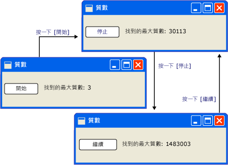
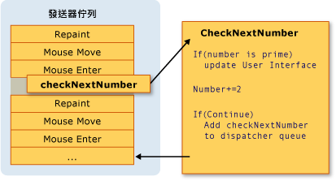
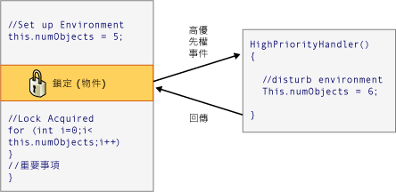

# 執行緒模型
[!INCLUDE[TLA#tla_winclient](../../../../includes/tlasharptla-winclient-md.md)] 是設計來避免開發人員遇到執行緒的難題。 如此一來，大部分的[!INCLUDE[TLA2#tla_winclient](../../../../includes/tla2sharptla-winclient-md.md)]開發人員不需要撰寫可使用多個執行緒的介面。 由於多執行緒的程式非常複雜且很難偵錯，因此，若有單一執行緒解決方案，就應避免使用多執行緒程式。  
  
 不論如何架構，不過，沒有[!INCLUDE[TLA2#tla_ui](../../../../includes/tla2sharptla-ui-md.md)]framework 曾經可以為每個排序的問題提供單一執行緒的解決方案。 [!INCLUDE[TLA2#tla_winclient](../../../../includes/tla2sharptla-winclient-md.md)] 來自關閉，但仍有多個執行緒，改善的情況下[!INCLUDE[TLA#tla_ui](../../../../includes/tlasharptla-ui-md.md)]回應性或應用程式的效能。 討論一些背景資料之後，本文將說明這其中的一些情況，然後以一些較低層級詳細資訊的討論來做出結論。  
  

  
> [!NOTE]
>  本主題將討論使用執行緒<xref:System.Windows.Threading.Dispatcher.BeginInvoke%2A>非同步呼叫的方法。 您也可以藉由呼叫來進行非同步呼叫<xref:System.Windows.Threading.Dispatcher.InvokeAsync%2A>方法，這個方法會採用<xref:System.Action>或<xref:System.Func%601>做為參數。  <xref:System.Windows.Threading.Dispatcher.InvokeAsync%2A>方法會傳回<xref:System.Windows.Threading.DispatcherOperation>或<xref:System.Windows.Threading.DispatcherOperation%601>，其具有<xref:System.Windows.Threading.DispatcherOperation.Task%2A>屬性。 您可以使用`await`關鍵字使用<xref:System.Windows.Threading.DispatcherOperation>或相關聯<xref:System.Threading.Tasks.Task>。 如果您要同步等候<xref:System.Threading.Tasks.Task>所傳回<xref:System.Windows.Threading.DispatcherOperation>或<xref:System.Windows.Threading.DispatcherOperation%601>，呼叫<xref:System.Windows.Threading.TaskExtensions.DispatcherOperationWait%2A>擴充方法。  呼叫<xref:System.Threading.Tasks.Task.Wait%2A?displayProperty=nameWithType>會導致死結。 如需有關使用<xref:System.Threading.Tasks.Task>為了執行非同步作業，請參閱工作平行處理原則。  <xref:System.Windows.Threading.Dispatcher.Invoke%2A>方法也會有多載<xref:System.Action>或<xref:System.Func%601>做為參數。  您可以使用<xref:System.Windows.Threading.Dispatcher.Invoke%2A>進行同步的方法會呼叫委派，傳入<xref:System.Action>或<xref:System.Func%601>。  
  
   
## 概觀和發送器  
 一般而言，[!INCLUDE[TLA2#tla_winclient](../../../../includes/tla2sharptla-winclient-md.md)]開頭的兩個執行緒的應用程式： 一個用於處理轉譯和另一個用於管理[!INCLUDE[TLA2#tla_ui](../../../../includes/tla2sharptla-ui-md.md)]。 有效地呈現執行緒執行時在背景中隱藏[!INCLUDE[TLA2#tla_ui](../../../../includes/tla2sharptla-ui-md.md)]執行緒收到輸入、 處理事件、 繪製畫面上，並執行應用程式程式碼。 大部分的應用程式使用單一[!INCLUDE[TLA2#tla_ui](../../../../includes/tla2sharptla-ui-md.md)]執行緒，但在某些情況下最好使用數種。 我們稍後將使用範例來討論這一點。  
  
 [!INCLUDE[TLA2#tla_ui](../../../../includes/tla2sharptla-ui-md.md)]執行緒佇列工作項目，呼叫物件內<xref:System.Windows.Threading.Dispatcher>。 <xref:System.Windows.Threading.Dispatcher> 會依優先權選取工作項目，並逐一執行以完成每個工作項目。  每個[!INCLUDE[TLA2#tla_ui](../../../../includes/tla2sharptla-ui-md.md)]執行緒必須至少一個<xref:System.Windows.Threading.Dispatcher>，而且每個<xref:System.Windows.Threading.Dispatcher>可以在一個執行緒中執行的工作項目。  
  
 若要建置能有效回應，使用者易記的應用程式訣竅是最大化<xref:System.Windows.Threading.Dispatcher>保持工作項目小的輸送量。 這個方法的項目永遠不會過時坐在<xref:System.Windows.Threading.Dispatcher>佇列等候處理。 輸入與回應之間任何可察覺到的延遲都能讓使用者感到挫折。  
  
 如何便[!INCLUDE[TLA2#tla_winclient](../../../../includes/tla2sharptla-winclient-md.md)]應用程式應該要處理大的作業嗎？ 如果您的程式碼牽涉到大型計算，或需要查詢某些遠端伺服器上的資料庫，又該怎麼做？ 通常，處理不同的執行緒，保持中大的作業回應的[!INCLUDE[TLA2#tla_ui](../../../../includes/tla2sharptla-ui-md.md)]執行緒可用傾向於中的項目<xref:System.Windows.Threading.Dispatcher>佇列。 大的作業完成時，它可以報告其結果傳回給[!INCLUDE[TLA2#tla_ui](../../../../includes/tla2sharptla-ui-md.md)]顯示的執行緒。  
  
 在過去，[!INCLUDE[TLA#tla_mswin](../../../../includes/tlasharptla-mswin-md.md)]允許[!INCLUDE[TLA2#tla_ui](../../../../includes/tla2sharptla-ui-md.md)]只能由建立它們的執行緒存取的項目。 這表示負責某些長時間執行工作的背景執行緒無法在完成時更新文字方塊。 [!INCLUDE[TLA#tla_mswin](../../../../includes/tlasharptla-mswin-md.md)] 這樣可確保完整性[!INCLUDE[TLA2#tla_ui](../../../../includes/tla2sharptla-ui-md.md)]元件。 如果背景執行緒已在繪製期間更新了清單方塊的內容，則該清單方塊看起來可能很奇怪。  
  
 [!INCLUDE[TLA2#tla_winclient](../../../../includes/tla2sharptla-winclient-md.md)] 有個內建的互斥機制，會強制執行這項協調。 在大部分的類別[!INCLUDE[TLA2#tla_winclient](../../../../includes/tla2sharptla-winclient-md.md)]衍生自<xref:System.Windows.Threading.DispatcherObject>。 在建構，<xref:System.Windows.Threading.DispatcherObject>儲存參考<xref:System.Windows.Threading.Dispatcher>連結至目前執行的執行緒。 實際上，<xref:System.Windows.Threading.DispatcherObject>關聯建立它的執行緒。 在程式執行期間<xref:System.Windows.Threading.DispatcherObject>可以呼叫其公用<xref:System.Windows.Threading.DispatcherObject.VerifyAccess%2A>方法。 <xref:System.Windows.Threading.DispatcherObject.VerifyAccess%2A> 會檢查<xref:System.Windows.Threading.Dispatcher>與目前執行緒相關聯，並比較它<xref:System.Windows.Threading.Dispatcher>參考儲存在建構期間。 如果兩者不符，<xref:System.Windows.Threading.DispatcherObject.VerifyAccess%2A>擲回例外狀況。 <xref:System.Windows.Threading.DispatcherObject.VerifyAccess%2A> 用於呼叫屬於每個方法的開頭<xref:System.Windows.Threading.DispatcherObject>。  
  
 如果只有一個執行緒可以修改[!INCLUDE[TLA2#tla_ui](../../../../includes/tla2sharptla-ui-md.md)]，如何執行背景執行緒與使用者互動？ 背景執行緒可以詢問[!INCLUDE[TLA2#tla_ui](../../../../includes/tla2sharptla-ui-md.md)]執行緒以執行其代表的作業。 其做法是註冊的工作項目<xref:System.Windows.Threading.Dispatcher>的[!INCLUDE[TLA2#tla_ui](../../../../includes/tla2sharptla-ui-md.md)]執行緒。 <xref:System.Windows.Threading.Dispatcher>類別提供兩種方法註冊的工作項目：<xref:System.Windows.Threading.Dispatcher.Invoke%2A>和<xref:System.Windows.Threading.Dispatcher.BeginInvoke%2A>。 這兩種方法都會排程要執行的委派。 <xref:System.Windows.Threading.Dispatcher.Invoke%2A> 是同步的呼叫-也就是它不會傳回直到[!INCLUDE[TLA2#tla_ui](../../../../includes/tla2sharptla-ui-md.md)]執行緒實際完成執行委派。 <xref:System.Windows.Threading.Dispatcher.BeginInvoke%2A> 為非同步且立即傳回。  
  
 <xref:System.Windows.Threading.Dispatcher>依優先順序排序其佇列中的項目。 有十個時將元素加入可能指定的層級<xref:System.Windows.Threading.Dispatcher>佇列。 這些優先順序保存在<xref:System.Windows.Threading.DispatcherPriority>列舉型別。 詳細資訊，關於<xref:System.Windows.Threading.DispatcherPriority>位於層級[!INCLUDE[TLA2#tla_winfxsdk](../../../../includes/tla2sharptla-winfxsdk-md.md)]文件。  
  
   
## 執行中的執行緒︰範例  
  
   
### 單一執行緒應用程式與長時間執行的計算  
 大部分[!INCLUDE[TLA#tla_gui#plural](../../../../includes/tlasharptla-guisharpplural-md.md)]花費大量時間閒置時等候回應使用者互動中產生的事件。 小心程式設計閒置時間可用態度，而不會影響的回應性[!INCLUDE[TLA2#tla_ui](../../../../includes/tla2sharptla-ui-md.md)]。 [!INCLUDE[TLA2#tla_winclient](../../../../includes/tla2sharptla-winclient-md.md)]執行緒模型不允許輸入必要的作業中發生的狀況時中斷[!INCLUDE[TLA2#tla_ui](../../../../includes/tla2sharptla-ui-md.md)]執行緒。 這表示您必須確定返回<xref:System.Windows.Threading.Dispatcher>定期至暫止之前他們取得過時的輸入事件的處理序。  
  
 參考下列範例：  
  
   
  
 這個簡單的應用程式會從三開始向上計算，以搜尋質數。 當使用者按一下**啟動** 按鈕，開始搜尋。 當程式找到質數時，會使用它的發現來更新使用者介面。 使用者隨時都能停止搜尋。  
  
 雖然夠簡單，但質數搜尋會永無止盡的繼續執行，其中會遇到一些難題。  如果我們處理整個搜尋按鈕的 click 事件處理常式內，我們絕不會提供[!INCLUDE[TLA2#tla_ui](../../../../includes/tla2sharptla-ui-md.md)]執行緒有機會處理其他事件。 [!INCLUDE[TLA2#tla_ui](../../../../includes/tla2sharptla-ui-md.md)]無法輸入或處理序的回應訊息。 它永遠不會重新繪製，而且永遠不會回應按鈕 Click。  
  
 我們可以在個別執行緒中管理質數搜尋，但接著需要處理同步問題。 使用單一執行緒的方法，我們可以直接更新標籤，以列出所找到的最大質數。  
  
 如果我們分解成可管理的區塊的計算的工作時，我們可以定期回來<xref:System.Windows.Threading.Dispatcher>和處理事件。 我們可以提供[!INCLUDE[TLA2#tla_winclient](../../../../includes/tla2sharptla-winclient-md.md)]有機會重新繪製和處理輸入。  
  
 分割的處理時間計算和事件處理之間的最佳方式是為了管理從計算<xref:System.Windows.Threading.Dispatcher>。 使用<xref:System.Windows.Threading.Dispatcher.BeginInvoke%2A>方法中，我們可以質數檢查排定在相同佇列的[!INCLUDE[TLA2#tla_ui](../../../../includes/tla2sharptla-ui-md.md)]取自 < 事件。 在範例中，我們一次只會排程單一質數檢查。 質數檢查完成之後，我們會立即排程下次檢查。 這項檢查之後才會繼續暫止[!INCLUDE[TLA2#tla_ui](../../../../includes/tla2sharptla-ui-md.md)]已處理的事件。  
  
   
  
 [!INCLUDE[TLA#tla_word](../../../../includes/tlasharptla-word-md.md)] 會使用這項機制來完成拼字檢查。 拼字檢查是在背景使用的閒置時間[!INCLUDE[TLA2#tla_ui](../../../../includes/tla2sharptla-ui-md.md)]執行緒。 讓我們看看程式碼。  
  
 下列範例顯示建立使用者介面的 XAML。  
  
 [!code-xaml[ThreadingPrimeNumbers#ThreadingPrimeNumberXAML](../../../../samples/snippets/csharp/VS_Snippets_Wpf/ThreadingPrimeNumbers/CSharp/Window1.xaml#threadingprimenumberxaml)]  
  
 下列範例顯示程式碼後置。  
  
 [!code-csharp[ThreadingPrimeNumbers#ThreadingPrimeNumberCodeBehind](../../../../samples/snippets/csharp/VS_Snippets_Wpf/ThreadingPrimeNumbers/CSharp/Window1.xaml.cs#threadingprimenumbercodebehind)]
 [!code-vb[ThreadingPrimeNumbers#ThreadingPrimeNumberCodeBehind](../../../../samples/snippets/visualbasic/VS_Snippets_Wpf/ThreadingPrimeNumbers/visualbasic/mainwindow.xaml.vb#threadingprimenumbercodebehind)]  
  
 下列範例顯示的事件處理常式<xref:System.Windows.Controls.Button>。  
  
 [!code-csharp[ThreadingPrimeNumbers#ThreadingPrimeNumberStartOrStop](../../../../samples/snippets/csharp/VS_Snippets_Wpf/ThreadingPrimeNumbers/CSharp/Window1.xaml.cs#threadingprimenumberstartorstop)]
 [!code-vb[ThreadingPrimeNumbers#ThreadingPrimeNumberStartOrStop](../../../../samples/snippets/visualbasic/VS_Snippets_Wpf/ThreadingPrimeNumbers/visualbasic/mainwindow.xaml.vb#threadingprimenumberstartorstop)]  
  
 除了更新的文字上<xref:System.Windows.Controls.Button>，這個處理常式負責排程加入要委派的第一次的質數檢查<xref:System.Windows.Threading.Dispatcher>佇列。 之後此事件處理常式已完成其工作時，有時<xref:System.Windows.Threading.Dispatcher>會選取用於執行這個委派。  
  
 如前所述，<xref:System.Windows.Threading.Dispatcher.BeginInvoke%2A>是<xref:System.Windows.Threading.Dispatcher>成員用來排定執行的委派。 在此情況中，我們選擇<xref:System.Windows.Threading.DispatcherPriority.SystemIdle>優先順序。 <xref:System.Windows.Threading.Dispatcher>只時沒有任何重要的事件處理時，才會執行這個委派。 [!INCLUDE[TLA2#tla_ui](../../../../includes/tla2sharptla-ui-md.md)] 回應性比數字檢查更重要。 我們也會傳遞新的委派來代表數字檢查常式。  
  
 [!code-csharp[ThreadingPrimeNumbers#ThreadingPrimeNumberCheckNextNumber](../../../../samples/snippets/csharp/VS_Snippets_Wpf/ThreadingPrimeNumbers/CSharp/Window1.xaml.cs#threadingprimenumberchecknextnumber)]
 [!code-vb[ThreadingPrimeNumbers#ThreadingPrimeNumberCheckNextNumber](../../../../samples/snippets/visualbasic/VS_Snippets_Wpf/ThreadingPrimeNumbers/visualbasic/mainwindow.xaml.vb#threadingprimenumberchecknextnumber)]  
  
 這個方法會檢查下一個奇數是否為質數。 如果是主要，此方法來直接更新`bigPrime`<xref:System.Windows.Controls.TextBlock>以反映其探索。 由於計算會發生在用來建立元件的相同執行緒中，因此我們可以執行這項操作。 我們已選擇要用於計算的另一個執行緒，我們必須使用更複雜的同步處理機制，並執行中的更新[!INCLUDE[TLA2#tla_ui](../../../../includes/tla2sharptla-ui-md.md)]執行緒。 接下來我們將示範這種情況。  
  
 此範例的完整原始程式碼，請參閱[單一執行緒應用程式與長時間執行的計算範例](http://go.microsoft.com/fwlink/?LinkID=160038)  
  
   
### 利用背景執行緒處理封鎖作業  
 處理圖形應用程式中的封鎖作業可能很困難。 我們不想從事件處理常式中呼叫封鎖方法，因為應用程式將呈現凍結狀態。 我們可以使用另一個執行緒來處理這些作業，但是當我們完成時，我們必須與同步處理[!INCLUDE[TLA2#tla_ui](../../../../includes/tla2sharptla-ui-md.md)]執行緒因為我們無法直接修改[!INCLUDE[TLA2#tla_gui](../../../../includes/tla2sharptla-gui-md.md)]從我們的背景工作執行緒。 我們可以使用<xref:System.Windows.Threading.Dispatcher.Invoke%2A>或<xref:System.Windows.Threading.Dispatcher.BeginInvoke%2A>插入到委派<xref:System.Windows.Threading.Dispatcher>的[!INCLUDE[TLA2#tla_ui](../../../../includes/tla2sharptla-ui-md.md)]執行緒。 最後，會使用修改的權限執行這些委派[!INCLUDE[TLA2#tla_ui](../../../../includes/tla2sharptla-ui-md.md)]項目。  
  
 在此範例中，我們模仿遠端程序呼叫來擷取氣象預報。 我們使用不同的背景工作執行緒執行此呼叫，及我們排程中的更新方法<xref:System.Windows.Threading.Dispatcher>的[!INCLUDE[TLA2#tla_ui](../../../../includes/tla2sharptla-ui-md.md)]當我們完成執行緒。  
  
   
  
 [!code-csharp[ThreadingWeatherForecast#ThreadingWeatherCodeBehind](../../../../samples/snippets/csharp/VS_Snippets_Wpf/ThreadingWeatherForecast/CSharp/Window1.xaml.cs#threadingweathercodebehind)]
 [!code-vb[ThreadingWeatherForecast#ThreadingWeatherCodeBehind](../../../../samples/snippets/visualbasic/VS_Snippets_Wpf/ThreadingWeatherForecast/visualbasic/window1.xaml.vb#threadingweathercodebehind)]  
  
 以下是一些要注意的詳細資料。  
  
-   建立按鈕處理常式  
  
     [!code-csharp[ThreadingWeatherForecast#ThreadingWeatherButtonHandler](../../../../samples/snippets/csharp/VS_Snippets_Wpf/ThreadingWeatherForecast/CSharp/Window1.xaml.cs#threadingweatherbuttonhandler)]
     [!code-vb[ThreadingWeatherForecast#ThreadingWeatherButtonHandler](../../../../samples/snippets/visualbasic/VS_Snippets_Wpf/ThreadingWeatherForecast/visualbasic/window1.xaml.vb#threadingweatherbuttonhandler)]  
  
 按一下按鈕時，我們會顯示時鐘圖案並開始以動畫顯示它。 我們停用按鈕。 我們叫用`FetchWeatherFromServer`新執行緒，然後我們方法傳回時，允許<xref:System.Windows.Threading.Dispatcher>等候收集氣象預報預測時的處理程序事件。  
  
-   擷取氣象  
  
     [!code-csharp[ThreadingWeatherForecast#ThreadingWeatherFetchWeather](../../../../samples/snippets/csharp/VS_Snippets_Wpf/ThreadingWeatherForecast/CSharp/Window1.xaml.cs#threadingweatherfetchweather)]
     [!code-vb[ThreadingWeatherForecast#ThreadingWeatherFetchWeather](../../../../samples/snippets/visualbasic/VS_Snippets_Wpf/ThreadingWeatherForecast/visualbasic/window1.xaml.vb#threadingweatherfetchweather)]  
  
 為了簡單起見，我們並未在此範例中實際使用任何網路程式碼。 相反地，我們讓新的執行緒進入睡眠狀態 4 秒，藉以模擬網路存取延遲。 在這段，原始[!INCLUDE[TLA2#tla_ui](../../../../includes/tla2sharptla-ui-md.md)]執行緒仍會執行，而且回應事件。 為了顯示此情況，我們讓動畫持續執行，並讓最小化及最大化按鈕也能繼續運作。  
  
 當延遲完成後，我們會隨機選取我們氣象預報預測，就可以回報給[!INCLUDE[TLA2#tla_ui](../../../../includes/tla2sharptla-ui-md.md)]執行緒。 執行此作業，排程的呼叫`UpdateUserInterface`中[!INCLUDE[TLA2#tla_ui](../../../../includes/tla2sharptla-ui-md.md)]執行緒使用的執行緒<xref:System.Windows.Threading.Dispatcher>。 我們將描述氣象的字串傳遞到這個排程的方法呼叫。  
  
-   更新 [!INCLUDE[TLA2#tla_ui](../../../../includes/tla2sharptla-ui-md.md)]  
  
     [!code-csharp[ThreadingWeatherForecast#ThreadingWeatherUpdateUI](../../../../samples/snippets/csharp/VS_Snippets_Wpf/ThreadingWeatherForecast/CSharp/Window1.xaml.cs#threadingweatherupdateui)]
     [!code-vb[ThreadingWeatherForecast#ThreadingWeatherUpdateUI](../../../../samples/snippets/visualbasic/VS_Snippets_Wpf/ThreadingWeatherForecast/visualbasic/window1.xaml.vb#threadingweatherupdateui)]  
  
 當<xref:System.Windows.Threading.Dispatcher>中[!INCLUDE[TLA2#tla_ui](../../../../includes/tla2sharptla-ui-md.md)]執行緒有時間，它會執行排程的呼叫`UpdateUserInterface`。 這個方法會停止時鐘動畫，並選擇影像來說明氣象。 它會顯示此影像，並還原 [Fetch Forecast (擷取預報)] 按鈕。  
  
   
### 多個視窗，多個執行緒  
 某些[!INCLUDE[TLA2#tla_winclient](../../../../includes/tla2sharptla-winclient-md.md)]應用程式需要多個最上層視窗。 完全接受一個執行緒 /<xref:System.Windows.Threading.Dispatcher>組合來管理多個視窗，但有時候多個執行緒進行更好。 如果有可能發生某一個視窗將獨佔執行緒的情況，這特別適用。  
  
 [!INCLUDE[TLA#tla_mswin](../../../../includes/tlasharptla-mswin-md.md)] 檔案總管會以這種方式運作。 每個新的檔案總管視窗都屬於原始的程序，但會在獨立執行緒的控制下建立它。  
  
 使用[!INCLUDE[TLA2#tla_winclient](../../../../includes/tla2sharptla-winclient-md.md)]<xref:System.Windows.Controls.Frame>控制項，我們可以顯示網頁。 我們可以輕鬆地建立簡單[!INCLUDE[TLA2#tla_ie](../../../../includes/tla2sharptla-ie-md.md)]取代。 我們從一個重要功能開始︰開啟新檔案總管視窗的能力。 當使用者按一下 [New Window (新視窗)] 按鈕時，我們會在另一個執行緒中啟動視窗複本。 如此一來，在其中一個視窗中長時間執行或封鎖的作業就不會鎖定所有其他視窗。  
  
 事實上，網頁瀏覽器模型有它自己的複雜執行緒模型。 我們選擇它是因為大多數讀者應該都已熟悉它。  
  
 下列範例顯示此程式碼。  
  
 [!code-xaml[ThreadingMultipleBrowsers#ThreadingMultiBrowserXAML](../../../../samples/snippets/csharp/VS_Snippets_Wpf/ThreadingMultipleBrowsers/CSharp/Window1.xaml#threadingmultibrowserxaml)]  
  
 [!code-csharp[ThreadingMultipleBrowsers#ThreadingMultiBrowserCodeBehind](../../../../samples/snippets/csharp/VS_Snippets_Wpf/ThreadingMultipleBrowsers/CSharp/Window1.xaml.cs#threadingmultibrowsercodebehind)]
 [!code-vb[ThreadingMultipleBrowsers#ThreadingMultiBrowserCodeBehind](../../../../samples/snippets/visualbasic/VS_Snippets_Wpf/ThreadingMultipleBrowsers/VisualBasic/Window1.xaml.vb#threadingmultibrowsercodebehind)]  
  
 此程式碼的下列執行緒區段是我們在此內容中最感興趣的部分：  
  
 [!code-csharp[ThreadingMultipleBrowsers#ThreadingMultiBrowserNewWindow](../../../../samples/snippets/csharp/VS_Snippets_Wpf/ThreadingMultipleBrowsers/CSharp/Window1.xaml.cs#threadingmultibrowsernewwindow)]
 [!code-vb[ThreadingMultipleBrowsers#ThreadingMultiBrowserNewWindow](../../../../samples/snippets/visualbasic/VS_Snippets_Wpf/ThreadingMultipleBrowsers/VisualBasic/Window1.xaml.vb#threadingmultibrowsernewwindow)]  
  
 按下 [New Window (新視窗)] 按鈕時會呼叫此方法。 它會建立新的執行緒，並以非同步方式啟動它。  
  
 [!code-csharp[ThreadingMultipleBrowsers#ThreadingMultiBrowserThreadStart](../../../../samples/snippets/csharp/VS_Snippets_Wpf/ThreadingMultipleBrowsers/CSharp/Window1.xaml.cs#threadingmultibrowserthreadstart)]
 [!code-vb[ThreadingMultipleBrowsers#ThreadingMultiBrowserThreadStart](../../../../samples/snippets/visualbasic/VS_Snippets_Wpf/ThreadingMultipleBrowsers/VisualBasic/Window1.xaml.vb#threadingmultibrowserthreadstart)]  
  
 這個方法是新執行緒的起點。 我們在此執行緒的控制下建立新視窗。 [!INCLUDE[TLA2#tla_winclient](../../../../includes/tla2sharptla-winclient-md.md)] 自動建立新<xref:System.Windows.Threading.Dispatcher>管理新的執行緒。 我們需要如何做以讓視窗的功能是啟動<xref:System.Windows.Threading.Dispatcher>。  
  
   
## 技術詳細資料與困難點  
  
### 使用執行緒撰寫元件  
 Microsoft.NET Framework 開發人員指南說明如何元件可以公開給其用戶端的非同步行為的模式 (請參閱[事件架構非同步模式概觀](../../../../docs/standard/asynchronous-programming-patterns/event-based-asynchronous-pattern-overview.md))。 比方說，假設您想要封裝`FetchWeatherFromServer`成可重複使用、 程元件的方法。 下列標準的 Microsoft.NET Framework 模式中，這看起來會像下面這樣。  
  
 [!code-csharp[CommandingOverviewSnippets#ThreadingArticleWeatherComponent1](../../../../samples/snippets/csharp/VS_Snippets_Wpf/CommandingOverviewSnippets/CSharp/Window1.xaml.cs#threadingarticleweathercomponent1)]
 [!code-vb[CommandingOverviewSnippets#ThreadingArticleWeatherComponent1](../../../../samples/snippets/visualbasic/VS_Snippets_Wpf/CommandingOverviewSnippets/visualbasic/window1.xaml.vb#threadingarticleweathercomponent1)]  
  
 `GetWeatherAsync` 會使用上述其中一種技術 (例如建立背景執行緒)，以非同步方式執行工作，而不需封鎖呼叫執行緒。  
  
 其中一個最重要的部分，此模式呼叫*MethodName* `Completed`方法呼叫的相同執行緒上*MethodName* `Async`方法開始進行。 您無法執行這項操作使用[!INCLUDE[TLA2#tla_winclient](../../../../includes/tla2sharptla-winclient-md.md)]相當容易，藉由儲存<xref:System.Windows.Threading.Dispatcher.CurrentDispatcher%2A>— 但然後程元件只可用於[!INCLUDE[TLA2#tla_winclient](../../../../includes/tla2sharptla-winclient-md.md)]應用程式，不在[!INCLUDE[TLA#tla_winforms](../../../../includes/tlasharptla-winforms-md.md)]或[!INCLUDE[TLA#tla_aspnet](../../../../includes/tlasharptla-aspnet-md.md)]程式。  
  
 <xref:System.Windows.Threading.DispatcherSynchronizationContext>類別會處理這項需求 — 為概要著<xref:System.Windows.Threading.Dispatcher>適用於其他[!INCLUDE[TLA2#tla_ui](../../../../includes/tla2sharptla-ui-md.md)]以及架構。  
  
 [!code-csharp[CommandingOverviewSnippets#ThreadingArticleWeatherComponent2](../../../../samples/snippets/csharp/VS_Snippets_Wpf/CommandingOverviewSnippets/CSharp/Window1.xaml.cs#threadingarticleweathercomponent2)]
 [!code-vb[CommandingOverviewSnippets#ThreadingArticleWeatherComponent2](../../../../samples/snippets/visualbasic/VS_Snippets_Wpf/CommandingOverviewSnippets/visualbasic/window1.xaml.vb#threadingarticleweathercomponent2)]  
  
### 巢狀提取  
 有時候並不可行完全鎖住[!INCLUDE[TLA2#tla_ui](../../../../includes/tla2sharptla-ui-md.md)]執行緒。 讓我們看一下<xref:System.Windows.MessageBox.Show%2A>方法<xref:System.Windows.MessageBox>類別。 <xref:System.Windows.MessageBox.Show%2A> 不會傳回直到使用者按一下 [確定] 按鈕。 不過，它會建立必須有訊息迴圈才能互動的視窗。 雖然我們正在等待使用者按下 [OK (確定)]，但原始的應用程式視窗並不會回應使用者輸入。 不過，它會繼續處理繪製訊息。 原始視窗會在涵蓋並顯示時自行重新繪製。  
  
 ![包含 [OK (確定)] 按鈕的 MessageBox](../../../../docs/framework/wpf/advanced/media/threadingnestedpumping.png "ThreadingNestedPumping")  
  
 有些執行緒必須負責訊息方塊視窗。 [!INCLUDE[TLA2#tla_winclient](../../../../includes/tla2sharptla-winclient-md.md)] 只會針對訊息方塊視窗建立新的執行緒，但這個執行緒無法在原始視窗中繪製已停用的元素 (請記住先前討論過的互斥)。 相反地，[!INCLUDE[TLA2#tla_winclient](../../../../includes/tla2sharptla-winclient-md.md)]使用巢狀的訊息處理系統。 <xref:System.Windows.Threading.Dispatcher>類別包含特殊的方法呼叫<xref:System.Windows.Threading.Dispatcher.PushFrame%2A>，其中儲存應用程式的目前執行點，然後開始新的訊息迴圈。 巢狀的訊息迴圈完成時，原始之後就會繼續執行<xref:System.Windows.Threading.Dispatcher.PushFrame%2A>呼叫。  
  
 在此情況下，<xref:System.Windows.Threading.Dispatcher.PushFrame%2A>會維護程式內容，在呼叫<xref:System.Windows.MessageBox>。<xref:System.Windows.MessageBox.Show%2A>，並啟動新的訊息迴圈，以重新繪製背景視窗和處理訊息方塊視窗的輸入。 當使用者按一下 確定，並清除 快顯視窗中時，巢狀的迴圈結束，並在呼叫之後繼續控制<xref:System.Windows.MessageBox.Show%2A>。  
  
### 過時的路由事件  
 中的路由的事件系統[!INCLUDE[TLA2#tla_winclient](../../../../includes/tla2sharptla-winclient-md.md)]引發事件時通知整個樹狀結構。  
  
 [!code-xaml[InputOvw#ThreadingArticleStaticRoutedEvent](../../../../samples/snippets/csharp/VS_Snippets_Wpf/InputOvw/CSharp/Page1.xaml#threadingarticlestaticroutedevent)]  
  
 當按下滑鼠左的按鈕上，該橢圓形，`handler2`執行。 之後`handler2`完成時，事件會傳送到<xref:System.Windows.Controls.Canvas>物件使用`handler1`處理它。 才會發生這個情況`handler2`不明確標記事件物件為已處理。  
  
 可能的`handler2`會花費很長的時間處理此事件。 `handler2` 可能會使用<xref:System.Windows.Threading.Dispatcher.PushFrame%2A>開始的小時不會傳回巢狀的訊息迴圈。 如果`handler2`不的標記事件，為已處理此訊息迴圈時完成，即使它是極舊的事件傳遞在樹狀結構。  
  
### 重新進入和鎖定  
 鎖定機制[!INCLUDE[TLA#tla_clr](../../../../includes/tlasharptla-clr-md.md)]不完全相同的行為可能有人; 可能會以為執行緒要求鎖定時完全停止作業。 實際上，執行緒會繼續接收和處理高優先順序的訊息。 這有助於防止發生鎖死，並讓介面進行最低限度的回應，但它也會造成發生輕微 Bug 的可能性。  大部分的情況下您不需要知道的任何項目，這個問題，但在極少數的情況下 (通常涉及[!INCLUDE[TLA2#tla_win32](../../../../includes/tla2sharptla-win32-md.md)]視窗訊息 」 或 「 STA COM 元件) 這可以是值得一提。  
  
 因為開發人員假設未大部分介面建置的執行緒安全，請注意，[!INCLUDE[TLA2#tla_ui](../../../../includes/tla2sharptla-ui-md.md)]永遠不會存取多個執行緒。 在此情況下，單一執行緒可能會發生環境變更，在非預期的時間，導致這些錯誤效果<xref:System.Windows.Threading.DispatcherObject>互斥機制應該解決。 請考慮下列虛擬程式碼：  
  
   
  
 大部分的情況下，是正確的事，但有時候在[!INCLUDE[TLA2#tla_winclient](../../../../includes/tla2sharptla-winclient-md.md)]這類非預期的重新進入實際上會造成問題的位置。 因此，在特定索引鍵的時候，[!INCLUDE[TLA2#tla_winclient](../../../../includes/tla2sharptla-winclient-md.md)]呼叫<xref:System.Windows.Threading.Dispatcher.DisableProcessing%2A>，變更要使用該執行緒的鎖定指示[!INCLUDE[TLA2#tla_winclient](../../../../includes/tla2sharptla-winclient-md.md)]重新進入釋放的鎖定，而非平常[!INCLUDE[TLA2#tla_clr](../../../../includes/tla2sharptla-clr-md.md)]鎖定。  
  
 這樣為什麼未[!INCLUDE[TLA2#tla_clr](../../../../includes/tla2sharptla-clr-md.md)]小組選擇這種行為？ 它必須使用 STA COM 物件和完成項執行緒來執行。 當物件是記憶體回收，其`Finalize`方法執行時，在專用的完成項執行緒上未[!INCLUDE[TLA2#tla_ui](../../../../includes/tla2sharptla-ui-md.md)]執行緒。 其中是問題，因為 COM STA 物件上建立[!INCLUDE[TLA2#tla_ui](../../../../includes/tla2sharptla-ui-md.md)]執行緒才能被處置上[!INCLUDE[TLA2#tla_ui](../../../../includes/tla2sharptla-ui-md.md)]執行緒。 [!INCLUDE[TLA2#tla_clr](../../../../includes/tla2sharptla-clr-md.md)]相當的<xref:System.Windows.Threading.Dispatcher.BeginInvoke%2A>(在此情況下使用 Win32 的`SendMessage`)。 但是如果[!INCLUDE[TLA2#tla_ui](../../../../includes/tla2sharptla-ui-md.md)]忙碌執行緒、 完成項執行緒已停止，STA COM 物件無法處置，這樣就可以建立嚴重的記憶體流失。 所以[!INCLUDE[TLA2#tla_clr](../../../../includes/tla2sharptla-clr-md.md)]小組呼叫很難進行鎖定的運作方式一樣。  
  
 針對工作[!INCLUDE[TLA2#tla_winclient](../../../../includes/tla2sharptla-winclient-md.md)]是為了避免非預期的重新進入，而不重新導入以記憶體流失，這就是為什麼我們不會阻擋 everywhere 重新進入。  
  
## 另請參閱  
 [單一執行緒應用程式與長期執行的計算範例](http://go.microsoft.com/fwlink/?LinkID=160038)
