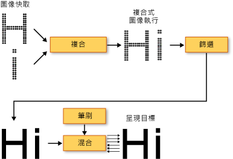

# WPF 中的印刷樣式Typography in WPF
本主題將介紹 [!INCLUDE[TLA2#tla_winclient](../../../../includes/tla2sharptla-winclient-md.md)] 的主要印刷樣式功能。This topic introduces the major typographic features of [!INCLUDE[TLA2#tla_winclient](../../../../includes/tla2sharptla-winclient-md.md)]. 這些功能包括提升文字轉譯的品質與效能、[!INCLUDE[TLA#tla_opentype](../../../../includes/tlasharptla-opentype-md.md)] 印刷樣式支援、已增強的國際文字、已增強的字型支援，以及新的文字應用程式開發介面 (API)。These features include improved quality and performance of text rendering, [!INCLUDE[TLA#tla_opentype](../../../../includes/tlasharptla-opentype-md.md)] typography support, enhanced international text, enhanced font support, and new text application programming interfaces (APIs).  
  

  
   
## 提升文字的品質與效能Improved Quality and Performance of Text  
 [!INCLUDE[TLA2#tla_winclient](../../../../includes/tla2sharptla-winclient-md.md)] 中的文字是使用 [!INCLUDE[TLA#tla_ct](../../../../includes/tlasharptla-ct-md.md)] 來轉譯，可增強文字的清晰度與可讀性。Text in [!INCLUDE[TLA2#tla_winclient](../../../../includes/tla2sharptla-winclient-md.md)] is rendered using [!INCLUDE[TLA#tla_ct](../../../../includes/tlasharptla-ct-md.md)], which enhances the clarity and readability of text. [!INCLUDE[TLA2#tla_ct](../../../../includes/tla2sharptla-ct-md.md)] 軟體技術是由 [!INCLUDE[TLA#tla_ms](../../../../includes/tlasharptla-ms-md.md)] 所開發，此技術改善了現有 LCD (液晶顯示器) 上的文字可讀性，例如膝上型電腦螢幕、Pocket PC 螢幕和平面監視器。 is a software technology developed by [!INCLUDE[TLA#tla_ms](../../../../includes/tlasharptla-ms-md.md)] that improves the readability of text on existing LCDs (Liquid Crystal Displays), such as laptop screens, Pocket PC screens and flat panel monitors. [!INCLUDE[TLA2#tla_ct](../../../../includes/tla2sharptla-ct-md.md)] 使用子像素轉譯，讓文字可利用像素的小數部分來對齊字元，使用更高畫質來顯示它的真正樣貌。 uses sub-pixel rendering which allows text to be displayed with a greater fidelity to its true shape by aligning characters on a fractional part of a pixel. 額外的解析度可提高文字顯示細節的解析度，即使經過長時間也很容易閱讀。The extra resolution increases the sharpness of the tiny details in text display, making it much easier to read over long durations. [!INCLUDE[TLA2#tla_winclient](../../../../includes/tla2sharptla-winclient-md.md)] 中 [!INCLUDE[TLA2#tla_ct](../../../../includes/tla2sharptla-ct-md.md)] 的另一項改進是以 y 方向消除鋸齒，這會使文字字元中平滑曲線頂端和底部更平滑。Another improvement of [!INCLUDE[TLA2#tla_ct](../../../../includes/tla2sharptla-ct-md.md)] in [!INCLUDE[TLA2#tla_winclient](../../../../includes/tla2sharptla-winclient-md.md)] is y-direction anti-aliasing, which smoothes the tops and bottoms of shallow curves in text characters. 如需 [!INCLUDE[TLA2#tla_ct](../../../../includes/tla2sharptla-ct-md.md)] 功能的詳細資訊，請參閱 [ClearType 概觀](../../../../docs/framework/wpf/advanced/cleartype-overview.md)。For more details on [!INCLUDE[TLA2#tla_ct](../../../../includes/tla2sharptla-ct-md.md)] features, see [ClearType Overview](../../../../docs/framework/wpf/advanced/cleartype-overview.md).  
  
   
以 ClearType Y 方向消除鋸齒功能顯示的文字Text with ClearType y-direction antialiasing  
  
 整個文字轉譯管線可在 [!INCLUDE[TLA2#tla_winclient](../../../../includes/tla2sharptla-winclient-md.md)] 上啟用硬體加速，但前提是您的機器符合所需硬體的最低層級。The entire text rendering pipeline can be hardware-accelerated in [!INCLUDE[TLA2#tla_winclient](../../../../includes/tla2sharptla-winclient-md.md)] provided your machine meets the minimum level of hardware required. 無法使用硬體執行的轉譯會回復為軟體轉譯。Rendering that cannot be performed using hardware falls back to software rendering. 硬體加速會影響文字轉譯管線的所有階段；範圍從儲存個別字符、將字符組合至字符執行、套用效果，到將 [!INCLUDE[TLA2#tla_ct](../../../../includes/tla2sharptla-ct-md.md)] 混色演算法套用至最終顯示的輸出。Hardware-acceleration affects all phases of the text rendering pipeline—from storing individual glyphs, compositing glyphs into glyph runs, applying effects, to applying the [!INCLUDE[TLA2#tla_ct](../../../../includes/tla2sharptla-ct-md.md)] blending algorithm to the final displayed output. 如需硬體加速的詳細資訊，請參閱[圖形轉譯層](../../../../docs/framework/wpf/advanced/graphics-rendering-tiers.md)。For more information on hardware acceleration, see [Graphics Rendering Tiers](../../../../docs/framework/wpf/advanced/graphics-rendering-tiers.md).  
  
   
文字轉譯管線的圖表Diagram of the text rendering pipeline  
  
 此外，具動畫效果的文字 (無論是字元或字符) 都可充分利用 [!INCLUDE[TLA2#tla_winclient](../../../../includes/tla2sharptla-winclient-md.md)] 所啟用的圖形硬體功能。In addition, animated text, whether by character or glyph, takes full advantage of the graphics hardware capability enabled by [!INCLUDE[TLA2#tla_winclient](../../../../includes/tla2sharptla-winclient-md.md)]. 這樣可產生平滑的文字動畫。This results in smooth text animation.  
  
   
## 豐富的印刷樣式Rich Typography  
 [!INCLUDE[TLA2#tla_opentype](../../../../includes/tla2sharptla-opentype-md.md)] 字型格式是 [!INCLUDE[TLA#tla_truetype](../../../../includes/tlasharptla-truetype-md.md)] 字型格式的延伸。The [!INCLUDE[TLA2#tla_opentype](../../../../includes/tla2sharptla-opentype-md.md)] font format is an extension of the [!INCLUDE[TLA#tla_truetype](../../../../includes/tlasharptla-truetype-md.md)] font format. [!INCLUDE[TLA2#tla_opentype](../../../../includes/tla2sharptla-opentype-md.md)] 字型格式是由 [!INCLUDE[TLA#tla_ms](../../../../includes/tlasharptla-ms-md.md)] 和 Adobe 共同開發，並提供各式各樣豐富的進階印刷樣式功能。The [!INCLUDE[TLA2#tla_opentype](../../../../includes/tla2sharptla-opentype-md.md)] font format was developed jointly by [!INCLUDE[TLA#tla_ms](../../../../includes/tlasharptla-ms-md.md)] and Adobe, and provides a rich assortment of advanced typographic features. <xref:System.Windows.Documents.Typography>物件會公開的許多進階功能[!INCLUDE[TLA2#tla_opentype](../../../../includes/tla2sharptla-opentype-md.md)]字型，例如文體替代字和花飾字。The <xref:System.Windows.Documents.Typography> object exposes many of the advanced features of [!INCLUDE[TLA2#tla_opentype](../../../../includes/tla2sharptla-opentype-md.md)] fonts, such as stylistic alternates and swashes. [!INCLUDE[TLA2#tla_lhsdk](../../../../includes/tla2sharptla-lhsdk-md.md)] 提供一組範例 [!INCLUDE[TLA2#tla_opentype](../../../../includes/tla2sharptla-opentype-md.md)] 字型，這組字型的設計具有豐富的特色，例如 Pericles 和 Pescadero 字型。The [!INCLUDE[TLA2#tla_lhsdk](../../../../includes/tla2sharptla-lhsdk-md.md)] provides a set of sample [!INCLUDE[TLA2#tla_opentype](../../../../includes/tla2sharptla-opentype-md.md)] fonts that are designed with rich features, such as the Pericles and Pescadero fonts. 如需詳細資訊，請參閱[範例 OpenType 字型套件](../../../../docs/framework/wpf/advanced/sample-opentype-font-pack.md)。For more information, see [Sample OpenType Font Pack](../../../../docs/framework/wpf/advanced/sample-opentype-font-pack.md).  
  
 Pericles [!INCLUDE[TLA2#tla_opentype](../../../../includes/tla2sharptla-opentype-md.md)] 字型包含其他字符，可為標準的字符組提供文體替代字。The Pericles [!INCLUDE[TLA2#tla_opentype](../../../../includes/tla2sharptla-opentype-md.md)] font contains additional glyphs that provide stylistic alternates to the standard set of glyphs. 下列文字顯示文體替代字符。The following text displays stylistic alternate glyphs.  
  
   
使用 OpenType 文體替代圖像的文字Text using OpenType stylistic alternate glyphs  
  
 花飾字是裝飾性字符，會使用精心設計且通常與書寫體相關聯的裝飾。Swashes are decorative glyphs that use elaborate ornamentation often associated with calligraphy. 下列文字顯示 Pescadero 字型的標準和花飾字字符。The following text displays standard and swash glyphs for the Pescadero font.  
  
   
使用 OpenType 標準和勾耳圖像的文字Text using OpenType standard and swash glyphs  
  
 如需 [!INCLUDE[TLA2#tla_opentype](../../../../includes/tla2sharptla-opentype-md.md)] 功能的詳細資訊，請參閱 [OpenType 字型功能](../../../../docs/framework/wpf/advanced/opentype-font-features.md)。For more details on [!INCLUDE[TLA2#tla_opentype](../../../../includes/tla2sharptla-opentype-md.md)] features, see [OpenType Font Features](../../../../docs/framework/wpf/advanced/opentype-font-features.md).  
  
   
## 已增強的國際文字支援Enhanced International Text Support  
 [!INCLUDE[TLA2#tla_winclient](../../../../includes/tla2sharptla-winclient-md.md)] 藉由提供下列功能來提供已增強的國際文字支援： provides enhanced international text support by providing the following features:  
  
-   在所有書寫系統中，使用自動調整度量功能來自動調整行間距。Automatic line-spacing in all writing systems, using adaptive measurement.  
  
-   對於國際文字的廣泛支援。Broad support for international text. 如需詳細資訊，請參閱 [WPF 的全球化](../../../../docs/framework/wpf/advanced/globalization-for-wpf.md)。For more information, see [Globalization for WPF](../../../../docs/framework/wpf/advanced/globalization-for-wpf.md).  
  
-   語言導向的分行、斷字及對齊。Language-guided line breaking, hyphenation, and justification.  
  
   
## 已增強的字型支援Enhanced Font Support  
 [!INCLUDE[TLA2#tla_winclient](../../../../includes/tla2sharptla-winclient-md.md)] 藉由提供下列功能來提供已增強的字型支援： provides enhanced font support by providing the following features:  
  
-   適用於所有文字的 Unicode。Unicode for all text. 字型行為和選取不再需要字元集或字碼頁。Font behavior and selection no longer require charset or codepage.  
  
-   字型行為與全域設定 (例如系統地區設定) 無關。Font behavior independent of global settings, such as system locale.  
  
-   個別<xref:System.Windows.FontWeight>， <xref:System.Windows.FontStretch>，並<xref:System.Windows.FontStyle>定義的型別<xref:System.Windows.Media.FontFamily>。Separate <xref:System.Windows.FontWeight>, <xref:System.Windows.FontStretch>, and <xref:System.Windows.FontStyle> types for defining a <xref:System.Windows.Media.FontFamily>. 這提供的彈性比使用 [!INCLUDE[TLA#tla_win32](../../../../includes/tlasharptla-win32-md.md)] 程式設計還要大，其中的斜體與粗體布林值組合是用來定義字型家族。This provides greater flexibility than in [!INCLUDE[TLA#tla_win32](../../../../includes/tlasharptla-win32-md.md)] programming, in which Boolean combinations of italic and bold are used to define a font family.  
  
-   書寫方向 (水平和垂直) 會與字型名稱分開處理。Writing direction (horizontal versus vertical) handled independent of font name.  
  
-   可攜式 [!INCLUDE[TLA#tla_xml](../../../../includes/tlasharptla-xml-md.md)] 檔案中的字型連結和字型遞補，使用的是複合字型技術。Font linking and font fallback in a portable [!INCLUDE[TLA#tla_xml](../../../../includes/tlasharptla-xml-md.md)] file, using composite font technology. 複合字型，能夠建構全系列的多語系字型。Composite fonts allow for the construction of full range multilingual fonts. 複合字型也提供一種機制來避免顯示遺漏的字符。Composite fonts also provide a mechanism that avoids displaying missing glyphs. 如需詳細資訊，請參閱中的備註<xref:System.Windows.Media.FontFamily>類別。For more information, see the remarks in the <xref:System.Windows.Media.FontFamily> class.  
  
-   從複合字型，使用單一語言字型群組建置的國際字型。International fonts built from composite fonts, using a group of single-language fonts. 這可在開發多國語言的字型時節省資源成本。This saves on resource costs when developing fonts for multiple languages.  
  
-   內嵌於文件中的複合字型，藉此提供文件的可攜性。Composite fonts embedded in a document, thereby providing document portability. 如需詳細資訊，請參閱中的備註<xref:System.Windows.Media.FontFamily>類別。For more information, see the remarks in the <xref:System.Windows.Media.FontFamily> class.  
  
   
## 新的文字應用程式開發介面 (API)New Text Application Programming Interfaces (APIs)  
 [!INCLUDE[TLA2#tla_winclient](../../../../includes/tla2sharptla-winclient-md.md)] 提供數個文字 [!INCLUDE[TLA2#tla_api#plural](../../../../includes/tla2sharptla-apisharpplural-md.md)]，讓開發人員能夠在他們的應用程式中包含文字時使用。 provides several text [!INCLUDE[TLA2#tla_api#plural](../../../../includes/tla2sharptla-apisharpplural-md.md)] for developers to use when including text in their applications. 這些 [!INCLUDE[TLA2#tla_api#plural](../../../../includes/tla2sharptla-apisharpplural-md.md)] 可分為三個類別：These [!INCLUDE[TLA2#tla_api#plural](../../../../includes/tla2sharptla-apisharpplural-md.md)] are grouped into three categories:  
  
-   **版面配置和使用者介面**。**Layout and user interface**. [!INCLUDE[TLA#tla_gui](../../../../includes/tlasharptla-gui-md.md)] 的一般文字控制項。The common text controls for the [!INCLUDE[TLA#tla_gui](../../../../includes/tlasharptla-gui-md.md)].  
  
-   **輕量型文字繪製**。**Lightweight text drawing**. 可讓您直接對物件繪製文字。Allows you to draw text directly to objects.  
  
-   **進階文字格式化**。**Advanced text formatting**. 可讓您實作自訂的文字引擎。Allows you to implement a custom text engine.  
  
### 版面配置和使用者介面Layout and User Interface  
 在最高層級的功能中，文字[!INCLUDE[TLA2#tla_api#plural](../../../../includes/tla2sharptla-apisharpplural-md.md)]提供通用[!INCLUDE[TLA#tla_ui](../../../../includes/tlasharptla-ui-md.md)]這類控制<xref:System.Windows.Controls.Label>， <xref:System.Windows.Controls.TextBlock>，和<xref:System.Windows.Controls.TextBox>。At the highest level of functionality, the text [!INCLUDE[TLA2#tla_api#plural](../../../../includes/tla2sharptla-apisharpplural-md.md)] provide common [!INCLUDE[TLA#tla_ui](../../../../includes/tlasharptla-ui-md.md)] controls such as <xref:System.Windows.Controls.Label>, <xref:System.Windows.Controls.TextBlock>, and <xref:System.Windows.Controls.TextBox>. 這些控制項提供應用程式內基本的 [!INCLUDE[TLA2#tla_ui](../../../../includes/tla2sharptla-ui-md.md)] 元素，以及提供一種簡單方式來呈現文字並與之互動。These controls provide the basic [!INCLUDE[TLA2#tla_ui](../../../../includes/tla2sharptla-ui-md.md)] elements within an application, and offer an easy way to present and interact with text. 控制這類<xref:System.Windows.Controls.RichTextBox>和<xref:System.Windows.Controls.PasswordBox>啟用更進階或特製化的文字處理。Controls such as <xref:System.Windows.Controls.RichTextBox> and <xref:System.Windows.Controls.PasswordBox> enable more advanced or specialized text-handling. 這類類別和<xref:System.Windows.Documents.TextRange>， <xref:System.Windows.Documents.TextSelection>，和<xref:System.Windows.Documents.TextPointer>可讓您更有用的文字操作。And classes such as <xref:System.Windows.Documents.TextRange>, <xref:System.Windows.Documents.TextSelection>, and <xref:System.Windows.Documents.TextPointer> enable useful text manipulation. 這些[!INCLUDE[TLA2#tla_ui](../../../../includes/tla2sharptla-ui-md.md)]控制項提供屬性，例如<xref:System.Windows.Controls.Control.FontFamily%2A>， <xref:System.Windows.Controls.Control.FontSize%2A>，和<xref:System.Windows.Controls.Control.FontStyle%2A>，可讓您控制用來呈現文字的字型。These [!INCLUDE[TLA2#tla_ui](../../../../includes/tla2sharptla-ui-md.md)] controls provide properties such as <xref:System.Windows.Controls.Control.FontFamily%2A>, <xref:System.Windows.Controls.Control.FontSize%2A>, and <xref:System.Windows.Controls.Control.FontStyle%2A>, which enable you to control the font that is used to render the text.  
  
#### 使用點陣圖效果、轉換和文字效果Using Bitmap Effects, Transforms, and Text Effects  
 [!INCLUDE[TLA2#tla_winclient](../../../../includes/tla2sharptla-winclient-md.md)] 可讓您藉由使用點陣圖效果、轉換和文字效果等功能，對文字建立具視覺效果的趣味用法。 allows you to create visually interesting uses of text by uses features such as bitmap effects, transforms, and text effects. 下列範例示範套用至文字之延伸陰影效果的典型類型。The following example shows a typical type of a drop shadow effect applied to text.  
  
   
具有延伸陰影的文字Text with a drop shadow  
  
 下列範例示範套用至文字的延伸陰影效果與雜點。The following example shows a drop shadow effect and noise applied to text.  
  
   
具有延伸陰影與雜點的文字Text with a drop shadow and noise  
  
 下列範例示範套用至文字的外光暈效果。The following example shows an outer glow effect applied to text.  
  
   
具有外光暈效果的文字Text with an outer glow effect  
  
 下列範例示範套用至文字的模糊效果。The following example shows a blur effect applied to text.  
  
   
具有模糊效果的文字Text with a blur effect  
  
 下列範例示範沿著 X 軸縮放 150% 的第二行文字，以及沿著 Y 軸縮放 150% 的第三行文字。The following example shows the second line of text scaled by 150% along the x-axis, and the third line of text scaled by 150% along the y-axis.  
  
   
使用 ScaleTransform 的文字Text using a ScaleTransform  
  
 下列範例示範沿著 X 軸傾斜的文字。The following example shows text skewed along the x-axis.  
  
   
使用 SkewTransform 的文字Text using a SkewTransform  
  
 A<xref:System.Windows.Media.TextEffect>物件是協助程式物件，可讓您將文字視為文字字串中的字元的一個或多個群組。A <xref:System.Windows.Media.TextEffect> object is a helper object that allows you to treat text as one or more groups of characters in a text string. 下列範例示範旋轉個別字元。The following example shows an individual character being rotated. 每一個字元會以 1 秒的間隔獨立旋轉。Each character is rotated independently at 1-second intervals.  
  
   
旋轉文字效果動畫的範例Example of a rotating text effect animation  
  
#### 使用非固定格式文件Using Flow Documents  
 除了一般[!INCLUDE[TLA2#tla_ui](../../../../includes/tla2sharptla-ui-md.md)]控制項[!INCLUDE[TLA2#tla_winclient](../../../../includes/tla2sharptla-winclient-md.md)]提供的文字呈現的版面配置控制項 —<xref:System.Windows.Documents.FlowDocument>項目。In addition to the common [!INCLUDE[TLA2#tla_ui](../../../../includes/tla2sharptla-ui-md.md)] controls, [!INCLUDE[TLA2#tla_winclient](../../../../includes/tla2sharptla-winclient-md.md)] offers a layout control for text presentation—the <xref:System.Windows.Documents.FlowDocument> element. <xref:System.Windows.Documents.FlowDocument>項目，搭配<xref:System.Windows.Controls.DocumentViewer>項目，提供大量具有不同的版面配置需求的文字的控制項。The <xref:System.Windows.Documents.FlowDocument> element, in conjunction with the <xref:System.Windows.Controls.DocumentViewer> element, provides a control for large amounts of text with varying layout requirements. 版面配置控制項提供的存取權透過的進階印刷樣式<xref:System.Windows.Documents.Typography>物件和其他的字型相關屬性[!INCLUDE[TLA2#tla_ui](../../../../includes/tla2sharptla-ui-md.md)]控制項。Layout controls provide access to advanced typography through the <xref:System.Windows.Documents.Typography> object and font-related properties of other [!INCLUDE[TLA2#tla_ui](../../../../includes/tla2sharptla-ui-md.md)] controls.  
  
 下列範例顯示的文字內容裝載於<xref:System.Windows.Controls.FlowDocumentReader>，以提供搜尋、 瀏覽、 分頁及內容縮放支援。The following example shows text content hosted in a <xref:System.Windows.Controls.FlowDocumentReader>, which provides search, navigation, pagination, and content scaling support.  
  
   
裝載於 FlowDocumentReader 的文字Text hosted in a FlowDocumentReader  
  
 如需詳細資訊，請參閱 [WPF 中的文件](../../../../docs/framework/wpf/advanced/documents-in-wpf.md)。For more information, see [Documents in WPF](../../../../docs/framework/wpf/advanced/documents-in-wpf.md).  
  
### 輕量型文字繪製Lightweight Text Drawing  
 您可以直接繪製文字[!INCLUDE[TLA2#tla_winclient](../../../../includes/tla2sharptla-winclient-md.md)]使用的物件<xref:System.Windows.Media.DrawingContext.DrawText%2A>方法<xref:System.Windows.Media.DrawingContext>物件。You can draw text directly to [!INCLUDE[TLA2#tla_winclient](../../../../includes/tla2sharptla-winclient-md.md)] objects by using the <xref:System.Windows.Media.DrawingContext.DrawText%2A> method of the <xref:System.Windows.Media.DrawingContext> object. 若要使用此方法，您建立<xref:System.Windows.Media.FormattedText>物件。To use this method, you create a <xref:System.Windows.Media.FormattedText> object. 這個物件可讓您繪製多行文字，且可個別格式化文字中的每個字元。This object allows you to draw multi-line text, in which each character in the text can be individually formatted. 功能<xref:System.Windows.Media.FormattedText>物件包含許多 Win32 API 中 DrawText 旗標的功能。The functionality of the <xref:System.Windows.Media.FormattedText> object contains much of the functionality of the DrawText flags in the Win32 API. 颾魤 ㄛ<xref:System.Windows.Media.FormattedText>物件包含像是省略符號支援，當文字超過其範圍時，會顯示省略符號的功能。In addition, the <xref:System.Windows.Media.FormattedText> object contains functionality such as ellipsis support, in which an ellipsis is displayed when text exceeds its bounds. 下列範例示範的文字具有數種已套用的格式，包括第二個和第三個字的線性漸層。The following example shows text that has several formats applied to it, including a linear gradient on the second and third words.  
  
   
使用 FormattedText 物件顯示的文字Displayed text using FormattedText object  
  
 您可以將轉換成的格式化的文字<xref:System.Windows.Media.Geometry>物件，可讓您建立其他類型的趣味視覺文字。You can convert formatted text into <xref:System.Windows.Media.Geometry> objects, allowing you to create other types of visually interesting text. 例如，您可以在其中建立<xref:System.Windows.Media.Geometry>物件根據文字字串的外框。For example, you could create a <xref:System.Windows.Media.Geometry> object based on the outline of a text string.  
  
   
以線性漸層筆刷繪製外框的文字Text outline using a linear gradient brush  
  
 下列範例示範數種方式，可透過修改筆劃、填滿和反白顯示轉換的文字，來建立有趣的視覺效果。The following examples illustrate several ways of creating interesting visual effects by modifying the stroke, fill, and highlight of converted text.  
  
   
設定筆劃並填滿不同色彩的範例Example of setting stroke and fill to different colors  
  
   
影像筆刷套用至筆劃的範例Example of an image brush applied to the stroke  
  
   
影像筆刷套用至筆劃並反白顯示的範例Example of an image brush applied to the stroke and highlight  
  
 如需詳細資訊<xref:System.Windows.Media.FormattedText>物件，請參閱 <<c2> [ 繪製格式化的文字](../../../../docs/framework/wpf/advanced/drawing-formatted-text.md)。For more information on the <xref:System.Windows.Media.FormattedText> object, see [Drawing Formatted Text](../../../../docs/framework/wpf/advanced/drawing-formatted-text.md).  
  
### 進階文字格式化Advanced Text Formatting  
 在最進階的文字[!INCLUDE[TLA2#tla_api#plural](../../../../includes/tla2sharptla-apisharpplural-md.md)]，[!INCLUDE[TLA2#tla_winclient](../../../../includes/tla2sharptla-winclient-md.md)]可讓您藉由建立自訂文字版面配置<xref:System.Windows.Media.TextFormatting.TextFormatter>物件中和其他類型<xref:System.Windows.Media.TextFormatting>命名空間。At the most advanced level of the text [!INCLUDE[TLA2#tla_api#plural](../../../../includes/tla2sharptla-apisharpplural-md.md)], [!INCLUDE[TLA2#tla_winclient](../../../../includes/tla2sharptla-winclient-md.md)] offers you the ability to create custom text layout by using the <xref:System.Windows.Media.TextFormatting.TextFormatter> object and other types in the <xref:System.Windows.Media.TextFormatting> namespace. <xref:System.Windows.Media.TextFormatting.TextFormatter>和相關聯的類別可讓您實作自訂文字版面配置，支援您自己定義的字元格式、 段落樣式行分行規則及其他版面配置功能，針對國際文字。The <xref:System.Windows.Media.TextFormatting.TextFormatter> and associated classes allow you to implement custom text layout that supports your own definition of character formats, paragraph styles, line breaking rules, and other layout features for international text. 在非常少數的情況下，您會想要覆寫 [!INCLUDE[TLA2#tla_winclient](../../../../includes/tla2sharptla-winclient-md.md)] 文字配置支援的預設實作。There are very few cases in which you would want to override the default implementation of the [!INCLUDE[TLA2#tla_winclient](../../../../includes/tla2sharptla-winclient-md.md)] text layout support. 不過，如果您要建立文字編輯控制項或應用程式，您可能需要不同於預設 [!INCLUDE[TLA2#tla_winclient](../../../../includes/tla2sharptla-winclient-md.md)] 實作的實作。However, if you were creating a text editing control or application, you might require a different implementation than the default [!INCLUDE[TLA2#tla_winclient](../../../../includes/tla2sharptla-winclient-md.md)] implementation.  
  
 不同於傳統的文字[!INCLUDE[TLA#tla_api](../../../../includes/tlasharptla-api-md.md)]，則<xref:System.Windows.Media.TextFormatting.TextFormatter>互動文字配置用戶端透過一組回呼方法。Unlike a traditional text [!INCLUDE[TLA#tla_api](../../../../includes/tlasharptla-api-md.md)], the <xref:System.Windows.Media.TextFormatting.TextFormatter> interacts with a text layout client through a set of callback methods. 它需要用戶端提供這些方法的實作中<xref:System.Windows.Media.TextFormatting.TextSource>類別。It requires the client to provide these methods in an implementation of the <xref:System.Windows.Media.TextFormatting.TextSource> class. 下圖說明用戶端應用程式之間的文字版面配置互動和<xref:System.Windows.Media.TextFormatting.TextFormatter>。The following diagram illustrates the text layout interaction between the client application and <xref:System.Windows.Media.TextFormatting.TextFormatter>.  
  
   
應用程式和 TextFormatter 之間的互動Interaction between application and TextFormatter  
  
 如需如何建立自訂文字版面配置的詳細資訊，請參閱[進階文字格式化](../../../../docs/framework/wpf/advanced/advanced-text-formatting.md)。For more details on creating custom text layout, see [Advanced Text Formatting](../../../../docs/framework/wpf/advanced/advanced-text-formatting.md).  
  
## 另請參閱See Also  
 <xref:System.Windows.Media.FormattedText>  
 <xref:System.Windows.Media.TextFormatting.TextFormatter>  
 [ClearType 概觀ClearType Overview](../../../../docs/framework/wpf/advanced/cleartype-overview.md)  
 [OpenType 字型功能OpenType Font Features](../../../../docs/framework/wpf/advanced/opentype-font-features.md)  
 [繪製格式化的文字Drawing Formatted Text](../../../../docs/framework/wpf/advanced/drawing-formatted-text.md)  
 [進階文字格式化Advanced Text Formatting](../../../../docs/framework/wpf/advanced/advanced-text-formatting.md)  
 [TextText](../../../../docs/framework/wpf/advanced/optimizing-performance-text.md)  
 [Microsoft 印刷樣式Microsoft Typography](https://www.microsoft.com/typography/default.mspx)
