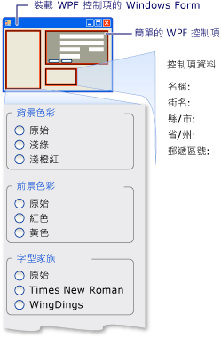

# <a name="walkthrough-hosting-a-wpf-composite-control-in-windows-forms"></a>逐步解說：在 Windows Form 中裝載 WPF 複合控制項
[!INCLUDE[TLA#tla_winclient](../../../../includes/tlasharptla-winclient-md.md)] 提供用來建立應用程式的豐富環境。 不過，如果您已長期開發[!INCLUDE[TLA#tla_winforms](../../../../includes/tlasharptla-winforms-md.md)]程式碼，它可以更有效率地將現有[!INCLUDE[TLA#tla_winforms](../../../../includes/tlasharptla-winforms-md.md)]應用程式與[!INCLUDE[TLA2#tla_winclient](../../../../includes/tla2sharptla-winclient-md.md)]而不從頭重寫程式。 常見的案例是當您想要內嵌一個或多個控制項實作[!INCLUDE[TLA2#tla_winclient](../../../../includes/tla2sharptla-winclient-md.md)]Windows Forms 應用程式內。 如需有關自訂 WPF 控制項的詳細資訊，請參閱 <<c0> [ 控制項自訂](../../../../docs/framework/wpf/controls/control-customization.md)。  
  
 本逐步解說引導您完成應用程式以裝載[!INCLUDE[TLA2#tla_winclient](../../../../includes/tla2sharptla-winclient-md.md)]複合控制項，以在 Windows Forms 應用程式中執行資料輸入。 複合控制項會封裝在 DLL 中。 這個一般程序可以延伸到更複雜的應用程式和控制項。 本逐步解說設計成幾乎完全相同的外觀和功能[逐步解說： 裝載在 WPF 中的 Windows Forms 複合控制項](../../../../docs/framework/wpf/advanced/walkthrough-hosting-a-windows-forms-composite-control-in-wpf.md)。 主要差異在於裝載案例相反。  
  
 本逐步解說分為兩節。 第一節簡要說明的實作[!INCLUDE[TLA2#tla_winclient](../../../../includes/tla2sharptla-winclient-md.md)]複合控制項。 第二節詳細討論如何裝載 Windows Forms 應用程式中的複合控制項、 接收來自控制項的事件以及存取某些控制項的屬性。  
  
 這個逐步解說中所述的工作包括：  
  
-   實作 WPF 複合控制項。  
  
-   實作 Windows Form 主應用程式。  
  
 在此逐步解說中所述工作的完整程式碼清單，請參閱 <<c0> [ 裝載 WPF 複合控制項在 Windows Form 範例](https://go.microsoft.com/fwlink/?LinkID=159996)。  
  
## <a name="prerequisites"></a>必要條件  
 您需要下列元件才能完成此逐步解說：  
  
-   [!INCLUDE[vs_dev10_long](../../../../includes/vs-dev10-long-md.md)].  
  
## <a name="implementing-the-wpf-composite-control"></a>實作 WPF 複合控制項  
 [!INCLUDE[TLA2#tla_winclient](../../../../includes/tla2sharptla-winclient-md.md)]此範例中使用的複合控制項是接受使用者的名稱和地址的簡單資料輸入表單。 使用者按一下兩個按鈕中的其中一個來表示工作已完成時，控制項會引發自訂事件，以將該資訊傳回給主應用程式。 下圖顯示轉譯的控制項。  
  
   
WPF 複合控制項  
  
### <a name="creating-the-project"></a>建立專案  
 啟動專案：  
  
1.  啟動[!INCLUDE[TLA#tla_visualstu](../../../../includes/tlasharptla-visualstu-md.md)]，然後開啟**新的專案** 對話方塊。  
  
2.  在 Visual C# 和 Windows 分類中，選取**WPF 使用者控制項程式庫**範本。  
  
3.  將新專案命名為 `MyControls`。  
  
4.  針對位置，指定方便命名的最上層資料夾，例如`WindowsFormsHostingWpfControl`。 稍後，您會將主應用程式放在此資料夾中。  
  
5.  按一下 [確定] 建立專案。 預設專案會包含名為的單一控制項`UserControl1`。  
  
6.  在 [方案總管] 中，重新命名`UserControl1`至`MyControl1`。  
  
 您的專案應該有下列系統 DLL 的參考。 如果預設未包括所有這些 DLL，則請將它們新增至專案。  
  
-   PresentationCore  
  
-   PresentationFramework  
  
-   系統  
  
-   WindowsBase  
  
### <a name="creating-the-user-interface"></a>建立使用者介面  
 [!INCLUDE[TLA#tla_ui](../../../../includes/tlasharptla-ui-md.md)]複合控制項是實作與[!INCLUDE[TLA#tla_xaml](../../../../includes/tlasharptla-xaml-md.md)]。 複合控制項[!INCLUDE[TLA2#tla_ui](../../../../includes/tla2sharptla-ui-md.md)]包含五個<xref:System.Windows.Controls.TextBox>項目。 每個<xref:System.Windows.Controls.TextBox>項目都有相關聯<xref:System.Windows.Controls.TextBlock>作為標籤的項目。 有兩個<xref:System.Windows.Controls.Button>項目底部 **[確定]** 並**取消**。 使用者按一下任一個按鈕時，控制項會引發自訂事件，以將資訊傳回給主應用程式。  
  
#### <a name="basic-layout"></a>基本版面配置  
 各種[!INCLUDE[TLA2#tla_ui](../../../../includes/tla2sharptla-ui-md.md)]元素都包含在<xref:System.Windows.Controls.Grid>項目。 您可以使用<xref:System.Windows.Controls.Grid>要排列的複合內容控制大致相同方式使用`Table`在 HTML 中的項目。 [!INCLUDE[TLA2#tla_winclient](../../../../includes/tla2sharptla-winclient-md.md)] 也有<xref:System.Windows.Documents.Table>項目，但<xref:System.Windows.Controls.Grid>更為輕量並且較適合簡單版面配置工作。  
  
 下列 XAML 顯示基本版面配置。 此 XAML 定義控制項的整體結構，藉由指定的資料行數目和中的資料列<xref:System.Windows.Controls.Grid>項目。  
  
 在 MyControl1.xaml 中，將現有的 XAML 取代為下列 XAML。  
  
 [!code-xaml[WindowsFormsHostingWpfControl#101](../../../../samples/snippets/csharp/VS_Snippets_Wpf/WindowsFormsHostingWpfControl/CSharp/MyControls/Page1.xaml#101)]  
[!code-xaml[WindowsFormsHostingWpfControl#102](../../../../samples/snippets/csharp/VS_Snippets_Wpf/WindowsFormsHostingWpfControl/CSharp/MyControls/Page1.xaml#102)]  
  
#### <a name="adding-textblock-and-textbox-elements-to-the-grid"></a>將 TextBlock 和 TextBox 項目新增至格線  
 您放置[!INCLUDE[TLA2#tla_ui](../../../../includes/tla2sharptla-ui-md.md)]藉由設定此項目的方格中的項目<xref:System.Windows.Controls.Grid.RowProperty>和<xref:System.Windows.Controls.Grid.ColumnProperty>屬性加入適當的資料列和資料行數目。 請記住，資料列和資料行編號是以零起始。 您可以藉由設定跨越多個資料行的項目及其<xref:System.Windows.Controls.Grid.ColumnSpanProperty>屬性。 如需詳細資訊<xref:System.Windows.Controls.Grid>項目，請參閱[建立 Grid 項目](../../../../docs/framework/wpf/controls/how-to-create-a-grid-element.md)。  
  
 下列 XAML 示範複合控制項的<xref:System.Windows.Controls.TextBox>和<xref:System.Windows.Controls.TextBlock>項目及其<xref:System.Windows.Controls.Grid.RowProperty>和<xref:System.Windows.Controls.Grid.ColumnProperty>設定為將項目正確放在方格中的屬性。  
  
 在 MyControl1.xaml 中，加入下列 XAML 內<xref:System.Windows.Controls.Grid>項目。  
  
 [!code-xaml[WindowsFormsHostingWpfControl#103](../../../../samples/snippets/csharp/VS_Snippets_Wpf/WindowsFormsHostingWpfControl/CSharp/MyControls/Page1.xaml#103)]  
  
#### <a name="styling-the-ui-elements"></a>設定 UI 項目的樣式  
 資料輸入表單上的許多項目都會有類似的外觀，表示它們具有數個屬性的相同設定。 而不是分別設定每個項目的屬性，使用先前的 XAML<xref:System.Windows.Style>項目來定義項目類別的標準屬性設定。 此方法會減少控制項的複雜度，並可讓您透過單一樣式屬性來變更多個項目的外觀。  
  
 <xref:System.Windows.Style>元素都包含在<xref:System.Windows.Controls.Grid>項目的<xref:System.Windows.FrameworkElement.Resources%2A>屬性，因此可供在控制項中的所有項目。 如果命名樣式，您將它套用至項目加上<xref:System.Windows.Style>項目設定樣式的名稱。 未命名的樣式會成為項目的預設樣式。 如需詳細資訊[!INCLUDE[TLA2#tla_winclient](../../../../includes/tla2sharptla-winclient-md.md)]樣式，請參閱[樣式和範本化](../../../../docs/framework/wpf/controls/styling-and-templating.md)。  
  
 下列 XAML 顯示<xref:System.Windows.Style>複合控制項的項目。 若要查看如何將樣式套用至項目，請參閱先前的 XAML。 例如，上次<xref:System.Windows.Controls.TextBlock>項目具有`inlineText`樣式，而最後<xref:System.Windows.Controls.TextBox>項目使用的預設樣式。  
  
 在 MyControl1.xaml 中，加入下列 XAML 後方<xref:System.Windows.Controls.Grid>啟動項目。  
  
 [!code-xaml[WindowsFormsHostingWpfControl#104](../../../../samples/snippets/csharp/VS_Snippets_Wpf/WindowsFormsHostingWpfControl/CSharp/MyControls/Page1.xaml#104)]  
  
#### <a name="adding-the-ok-and-cancel-buttons"></a>新增 OK 和 Cancel 按鈕  
 複合控制項上的最後一個項目 **[確定]** 並**取消**<xref:System.Windows.Controls.Button>項目，所佔用的最後一個資料列的前兩個資料行<xref:System.Windows.Controls.Grid>。 這些項目使用一般的事件處理常式中， `ButtonClicked`，且預設<xref:System.Windows.Controls.Button>先前的 XAML 中定義的樣式。  
  
 在 MyControl1.xaml 中，加入下列 XAML 最後一個之後<xref:System.Windows.Controls.TextBox>項目。 [!INCLUDE[TLA2#tla_xaml](../../../../includes/tla2sharptla-xaml-md.md)]屬於複合控制項現在已完成。  
  
 [!code-xaml[WindowsFormsHostingWpfControl#105](../../../../samples/snippets/csharp/VS_Snippets_Wpf/WindowsFormsHostingWpfControl/CSharp/MyControls/Page1.xaml#105)]  
  
### <a name="implementing-the-code-behind-file"></a>實作程式碼後置檔案  
 程式碼後置檔案 MyControl1.xaml.cs 會實作三項重要工作：
  
1.  處理使用者按一下其中一個按鈕時所發生的事件。  
  
2.  擷取從資料<xref:System.Windows.Controls.TextBox>項目，並將它封裝在自訂事件引數物件。  
  
3.  引發自訂`OnButtonClick`事件，就會通知使用者已完成，並將資料傳遞回主應用程式的主應用程式。  
  
 此控制項也會公開一些可讓您變更外觀的色彩和字型屬性。 不同於<xref:System.Windows.Forms.Integration.WindowsFormsHost>類別，用來裝載 Windows Form 控制項，這<xref:System.Windows.Forms.Integration.ElementHost>類別會公開控制項的<xref:System.Windows.Controls.Panel.Background%2A>只有屬性。 若要維護這個程式碼範例和中所討論的範例之間的相似度[逐步解說： 裝載在 WPF 中的 Windows Forms 複合控制項](../../../../docs/framework/wpf/advanced/walkthrough-hosting-a-windows-forms-composite-control-in-wpf.md)，控制項會直接公開其餘屬性。  
  
#### <a name="the-basic-structure-of-the-code-behind-file"></a>程式碼後置檔案的基本結構  
 此程式碼後置檔案包含單一的命名空間中， `MyControls`，其中會包含兩個類別：`MyControl1`和`MyControlEventArgs`。  
  
```  
namespace MyControls  
{  
  public partial class MyControl1 : Grid  
  {  
    //...  
  }  
  public class MyControlEventArgs : EventArgs  
  {  
    //...  
  }  
}  
```  
  
 第一個類別中， `MyControl1`，其中包含實作的功能的程式碼是部分類別[!INCLUDE[TLA2#tla_ui](../../../../includes/tla2sharptla-ui-md.md)]MyControl1.xaml 中所定義。 剖析 MyControl1.xaml 時，[!INCLUDE[TLA2#tla_xaml](../../../../includes/tla2sharptla-xaml-md.md)]會轉換成相同的部分類別和兩個部分類別會合併以形成已編譯的控制項。 因此，程式碼後置檔案中的類別名稱必須符合指派給 MyControl1.xaml 的類別名稱，而且必須繼承自控制項的根項目。 第二個類別中， `MyControlEventArgs`，是用來將資料傳送回主應用程式的事件引數類別。  
  
 開啟 MyControl1.xaml.cs。 變更現有的類別宣告，使其具有下列名稱，並繼承自<xref:System.Windows.Controls.Grid>。  
  
 [!code-csharp[WindowsFormsHostingWpfControl#21](../../../../samples/snippets/csharp/VS_Snippets_Wpf/WindowsFormsHostingWpfControl/CSharp/MyControls/Page1.xaml.cs#21)]  
  
#### <a name="initializing-the-control"></a>初始化控制項  
 下例程式碼實作數個基本工作︰  
  
-   宣告私用的事件， `OnButtonClick`，和其相關聯的委派， `MyControlEventHandler`。  
  
-   建立可儲存使用者資料的數個私用全域變數。 這項資料是透過對應的屬性所公開。  
  
-   實作的處理常式`Init`，在控制項的<xref:System.Windows.FrameworkElement.Loaded>事件。 此處理常式會初始化全域變數，方法是將 MyControl1.xaml 中所定義的值指派給它們。 若要這樣做，它會使用<xref:System.Windows.FrameworkElement.Name%2A>指派給典型<xref:System.Windows.Controls.TextBlock>項目， `nameLabel`，以存取該元素的屬性設定。  
  
 刪除現有的建構函式，並新增下列程式碼，以您`MyControl1`類別。  
  
 [!code-csharp[WindowsFormsHostingWpfControl#11](../../../../samples/snippets/csharp/VS_Snippets_Wpf/WindowsFormsHostingWpfControl/CSharp/MyControls/Page1.xaml.cs#11)]  
  
#### <a name="handling-the-buttons-click-events"></a>處理 Buttons 的 Click 事件  
 使用者會指出資料輸入工作已完成按一下**確定**  按鈕或**取消** 按鈕。 這兩個按鈕都使用相同<xref:System.Windows.Controls.Primitives.ButtonBase.Click>事件處理常式， `ButtonClicked`。 這兩個按鈕都有名稱，`btnOK`或是`btnCancel`，可讓處理常式來判斷所按的按鈕，藉由檢查的值`sender`引數。 此處理常式會執行下列動作︰  
  
-   會建立`MyControlEventArgs`物件，其中包含從資料<xref:System.Windows.Controls.TextBox>項目。  
  
-   如果使用者已按下**取消**按鈕，設定`MyControlEventArgs`物件的`IsOK`屬性設`false`。  
  
-   引發`OnButtonClick`事件，表示主應用程式，使用者已完成，並傳遞回收集到的資料。  
  
 將下列程式碼加入您`MyControl1`類別，之後`Init`方法。  
  
 [!code-csharp[WindowsFormsHostingWpfControl#12](../../../../samples/snippets/csharp/VS_Snippets_Wpf/WindowsFormsHostingWpfControl/CSharp/MyControls/Page1.xaml.cs#12)]  
  
#### <a name="creating-properties"></a>建立屬性  
 類別的其餘部分只會公開對應至先前所討論之全域變數的屬性。 屬性變更時，set 存取子會變更對應的項目屬性以及更新基礎全域變數來修改控制項的外觀。  
  
 將下列程式碼加入您`MyControl1`類別。  
  
 [!code-csharp[WindowsFormsHostingWpfControl#13](../../../../samples/snippets/csharp/VS_Snippets_Wpf/WindowsFormsHostingWpfControl/CSharp/MyControls/Page1.xaml.cs#13)]  
  
#### <a name="sending-the-data-back-to-the-host"></a>將資料傳回主應用程式  
 在檔案中的最後一個元件是`MyControlEventArgs`類別，用來將收集的資料傳送回主應用程式。  
  
 將下列程式碼加入您`MyControls`命名空間。 此實作十分簡單，未來不會進行討論。  
  
 [!code-csharp[WindowsFormsHostingWpfControl#14](../../../../samples/snippets/csharp/VS_Snippets_Wpf/WindowsFormsHostingWpfControl/CSharp/MyControls/Page1.xaml.cs#14)]  
  
 建置方案。 組置將會產生名為 MyControls.dll 的 DLL。  
  
<a name="winforms_host_section"></a>   
## <a name="implementing-the-windows-forms-host-application"></a>實作 Windows Forms 主應用程式  
 Windows Form 裝載應用程式會使用<xref:System.Windows.Forms.Integration.ElementHost>物件來裝載[!INCLUDE[TLA2#tla_winclient](../../../../includes/tla2sharptla-winclient-md.md)]複合控制項。 應用程式會處理`OnButtonClick`事件，以接收來自複合控制項的資料。 應用程式也會有一組選項按鈕，可用來修改控制項的外觀。 下圖顯示應用程式。  
  
   
Windows Forms 應用程式中裝載的 WPF 複合控制項  
  
### <a name="creating-the-project"></a>建立專案  
 啟動專案：  
  
1.  啟動[!INCLUDE[TLA2#tla_visualstu](../../../../includes/tla2sharptla-visualstu-md.md)]，然後開啟**新的專案** 對話方塊。  
  
2.  在 Visual C# 和 Windows 分類中，選取**Windows Forms 應用程式**範本。  
  
3.  將新專案命名為 `WFHost`。  
  
4.  針對位置，指定包含 MyControls 專案的相同最上層資料夾。  
  
5.  按一下 [確定] 建立專案。  
  
 您也需要將參考加入至包含的 DLL`MyControl1`和其他組件。  
  
1.  以滑鼠右鍵按一下方案總管 中的專案名稱，然後選取**加入參考**。  
  
2.  按一下 **瀏覽**索引標籤，然後瀏覽至包含 MyControls.dll 的資料夾。 在此逐步解說中，這個資料夾是 MyControls\bin\Debug。  
  
3.  選取 MyControls.dll，然後再按一下**確定**。  
  
4.  加入下列組件的參考。  
  
    -   PresentationCore  
  
    -   PresentationFramework  
  
    -   System.Xaml  
  
    -   WindowsBase  
  
    -   WindowsFormsIntegration  
  
### <a name="implementing-the-user-interface-for-the-application"></a>實作應用程式的使用者介面  
 Windows Forms 應用程式的 UI 包含數個控制項，可與 WPF 複合控制項互動。  
  
1.  在 Windows Forms 設計工具中，開啟 Form1。  
  
2.  放大表單，以容納控制項。  
  
3.  在表單右上角，新增<xref:System.Windows.Forms.Panel?displayProperty=nameWithType>控制項來保留[!INCLUDE[TLA2#tla_winclient](../../../../includes/tla2sharptla-winclient-md.md)]複合控制項。  
  
4.  新增下列<xref:System.Windows.Forms.GroupBox?displayProperty=nameWithType>控制項加入表單。  
  
    |名稱|Text|  
    |----------|----------|  
    |groupBox1|背景色彩|  
    |groupBox2|前景色彩|  
    |groupBox3|字型大小|  
    |groupBox4|字型家族|  
    |groupBox5|字型樣式|  
    |groupBox6|字型粗細|  
    |groupBox7|來自控制項的資料|  
  
5.  新增下列<xref:System.Windows.Forms.RadioButton?displayProperty=nameWithType>控制項新增至<xref:System.Windows.Forms.GroupBox?displayProperty=nameWithType>控制項。  
  
    |GroupBox|名稱|Text|  
    |--------------|----------|----------|  
    |groupBox1|radioBackgroundOriginal|原始|  
    |groupBox1|radioBackgroundLightGreen|LightGreen|  
    |groupBox1|radioBackgroundLightSalmon|LightSalmon|  
    |groupBox2|radioForegroundOriginal|原始|  
    |groupBox2|radioForegroundRed|紅色|  
    |groupBox2|radioForegroundYellow|黃色|  
    |groupBox3|radioSizeOriginal|原始|  
    |groupBox3|radioSizeTen|10|  
    |groupBox3|radioSizeTwelve|12|  
    |groupBox4|radioFamilyOriginal|原始|  
    |groupBox4|radioFamilyTimes|Tw Cen MT Condensed|  
    |groupBox4|radioFamilyWingDings|WingDings|  
    |groupBox5|radioStyleOriginal|一般|  
    |groupBox5|radioStyleItalic|斜體|  
    |groupBox6|radioWeightOriginal|原始|  
    |groupBox6|radioWeightBold|粗體|  
  
6.  新增下列<xref:System.Windows.Forms.Label?displayProperty=nameWithType>到最後一個控制<xref:System.Windows.Forms.GroupBox?displayProperty=nameWithType>。 這些控制項會顯示所傳回的資料[!INCLUDE[TLA2#tla_winclient](../../../../includes/tla2sharptla-winclient-md.md)]複合控制項。  
  
    |GroupBox|名稱|Text|  
    |--------------|----------|----------|  
    |groupBox7|lblName|名稱：|  
    |groupBox7|lblAddress|街道地址：|  
    |groupBox7|lblCity|城市：|  
    |groupBox7|lblState|狀態:|  
    |groupBox7|lblZip|郵遞區號︰|  
  
### <a name="initializing-the-form"></a>初始化表單  
 您通常會在表單的實作裝載程式碼<xref:System.Windows.Forms.Form.Load>事件處理常式。 下列程式碼示範<xref:System.Windows.Forms.Form.Load>事件處理常式中，處理常式[!INCLUDE[TLA2#tla_winclient](../../../../includes/tla2sharptla-winclient-md.md)]複合控制項的<xref:System.Windows.FrameworkElement.Loaded>事件，並稍後將使用的數個全域變數的宣告。  
  
 在 Windows Form 設計工具中，按兩下表單，以建立<xref:System.Windows.Forms.Form.Load>事件處理常式。 在 Form1.cs 頂端，新增下列`using`陳述式。  
  
 [!code-csharp[WindowsFormsHostingWpfControl#10](../../../../samples/snippets/csharp/VS_Snippets_Wpf/WindowsFormsHostingWpfControl/CSharp/WFHost/Form1.cs#10)]  
  
 取代的現有內容`Form1`為下列程式碼的類別。  
  
 [!code-csharp[WindowsFormsHostingWpfControl#2](../../../../samples/snippets/csharp/VS_Snippets_Wpf/WindowsFormsHostingWpfControl/CSharp/WFHost/Form1.cs#2)]  
  
 `Form1_Load`前面的程式碼的方法會顯示一般的程序來裝載[!INCLUDE[TLA2#tla_winclient](../../../../includes/tla2sharptla-winclient-md.md)]控制項：  
  
1.  建立新<xref:System.Windows.Forms.Integration.ElementHost>物件。  
  
2.  將控制項的<xref:System.Windows.Forms.Control.Dock%2A>屬性設<xref:System.Windows.Forms.DockStyle.Fill?displayProperty=nameWithType>。  
  
3.  新增<xref:System.Windows.Forms.Integration.ElementHost>若要控制<xref:System.Windows.Forms.Panel>控制項的<xref:System.Windows.Forms.Control.Controls%2A>集合。  
  
4.  建立的執行個體[!INCLUDE[TLA2#tla_winclient](../../../../includes/tla2sharptla-winclient-md.md)]控制項。  
  
5.  藉由指定的控制項中裝載複合控制項在表單上的<xref:System.Windows.Forms.Integration.ElementHost>控制項的<xref:System.Windows.Forms.Integration.ElementHost.Child%2A>屬性。  
  
 中的其餘兩行會`Form1_Load`方法附加至兩個控制項事件的處理常式：  
  
-   `OnButtonClick` 是在使用者按一下時，會將複合控制項所引發的自訂事件**確定**或是**取消** 按鈕。 您可以處理事件以取得使用者回應，以及收集使用者所指定的任何資料。  
  
-   <xref:System.Windows.FrameworkElement.Loaded> 是標準的事件所引發[!INCLUDE[TLA2#tla_winclient](../../../../includes/tla2sharptla-winclient-md.md)]控制時完全載入。 因為此範例需要使用控制項中的屬性來初始化數個全域變數，所以在這裡使用這個事件。 表單的當時<xref:System.Windows.Forms.Form.Load>事件，控制項不是完全載入，以及這些值仍會設為`null`。 您要等到控制項的<xref:System.Windows.FrameworkElement.Loaded>才能存取這些屬性，就會發生事件。  
  
 <xref:System.Windows.FrameworkElement.Loaded>上述的程式碼所示事件處理常式。 `OnButtonClick`處理常式會在下一節中討論。  
  
### <a name="handling-onbuttonclick"></a>處理 OnButtonClick  
 `OnButtonClick`當使用者按一下，就會發生事件**確定**或是**取消** 按鈕。  
  
 事件處理常式會檢查事件引數的`IsOK`欄位，以判斷所按的按鈕。 `lbl`*資料*變數對應至<xref:System.Windows.Forms.Label>先前討論過的控制項。 如果使用者按一下 **[確定]** 按鈕，從控制項的資料<xref:System.Windows.Controls.TextBox>控制項已指派給對應<xref:System.Windows.Forms.Label>控制項。 如果使用者按一下**取消**，則<xref:System.Windows.Forms.Label.Text%2A>值都會設為預設字串。  
  
 新增下面的按鈕按一下事件處理常式程式碼，使`Form1`類別。  
  
 [!code-csharp[WindowsFormsHostingWpfControl#3](../../../../samples/snippets/csharp/VS_Snippets_Wpf/WindowsFormsHostingWpfControl/CSharp/WFHost/Form1.cs#3)]  
  
 建置並執行應用程式。 在 WPF 複合控制項中新增一些文字，然後按一下**確定**。 文字會顯示在標籤中。 此時，尚未新增程式碼來處理選項按鈕。  
  
### <a name="modifying-the-appearance-of-the-control"></a>修改控制項的外觀  
 <xref:System.Windows.Forms.RadioButton>表單上的控制項可讓使用者變更[!INCLUDE[TLA2#tla_winclient](../../../../includes/tla2sharptla-winclient-md.md)]複合控制項的前景和背景色彩，以及數個字型屬性。 背景色彩由<xref:System.Windows.Forms.Integration.ElementHost>物件。 其餘的屬性會公開為控制項的自訂屬性。  
  
 依序按兩下<xref:System.Windows.Forms.RadioButton>來建立表單上的控制項<xref:System.Windows.Forms.RadioButton.CheckedChanged>事件處理常式。 取代<xref:System.Windows.Forms.RadioButton.CheckedChanged>為下列程式碼的事件處理常式。  
  
 [!code-csharp[WindowsFormsHostingWpfControl#4](../../../../samples/snippets/csharp/VS_Snippets_Wpf/WindowsFormsHostingWpfControl/CSharp/WFHost/Form1.cs#4)]  
  
 建置並執行應用程式。 按一下不同的選項按鈕，以查看在 WPF 複合控制項上的效果。  
  
## <a name="see-also"></a>另請參閱  
 <xref:System.Windows.Forms.Integration.ElementHost>  
 <xref:System.Windows.Forms.Integration.WindowsFormsHost>  
 [在 Visual Studio 中設計 XAML](/visualstudio/designers/designing-xaml-in-visual-studio)  
 [逐步解說：在 WPF 中裝載 Windows Forms 複合控制項](../../../../docs/framework/wpf/advanced/walkthrough-hosting-a-windows-forms-composite-control-in-wpf.md)  
 [逐步解說：在 Windows Forms 中裝載立體 WPF 複合控制項](../../../../docs/framework/wpf/advanced/walkthrough-hosting-a-3-d-wpf-composite-control-in-windows-forms.md)
