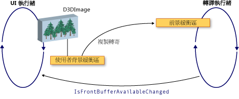

# WPF 和 Direct3D9 互通WPF and Direct3D9 Interoperation
您可以在 Windows Presentation Foundation (WPF) 應用程式中包含 Direct3D9 內容。You can include Direct3D9 content in a Windows Presentation Foundation (WPF) application. 本主題描述如何建立 Direct3D9 內容，以便有效地相互操作使用 WPF。This topic describes how to create Direct3D9 content so that it efficiently interoperates with WPF.  
  
> [!NOTE]
>  當使用 Direct3D9 內容在 WPF 中，您也需要考慮效能。When using Direct3D9 content in WPF, you also need to think about performance. 如需如何獲得最佳效能的詳細資訊，請參閱[Direct3D9 和 WPF 互通性的效能考量](../../../../docs/framework/wpf/advanced/performance-considerations-for-direct3d9-and-wpf-interoperability.md)。For more information about how to optimize for performance, see [Performance Considerations for Direct3D9 and WPF Interoperability](../../../../docs/framework/wpf/advanced/performance-considerations-for-direct3d9-and-wpf-interoperability.md).  
  
## 顯示緩衝區Display Buffers  
 <xref:System.Windows.Interop.D3DImage>類別會管理兩個顯示緩衝區，稱為*背景緩衝區*和*前端緩衝區*。The <xref:System.Windows.Interop.D3DImage> class manages two display buffers, which are called the *back buffer* and the *front buffer*. 背景緩衝區是 Direct3D9 介面。The back buffer is your Direct3D9 surface. 變更背景緩衝區會複製轉寄至前端緩衝區當您呼叫<xref:System.Windows.Interop.D3DImage.Unlock%2A>方法。Changes to the back buffer are copied forward to the front buffer when you call the <xref:System.Windows.Interop.D3DImage.Unlock%2A> method.  
  
 下圖顯示背景緩衝區和前端緩衝區之間的關聯性。The following illustration shows the relationship between the back buffer and the front buffer.  
  
   
  
## 建立 Direct3D9 裝置Direct3D9 Device Creation  
 若要轉譯 Direct3D9 內容，您必須建立 Direct3D9 裝置。To render Direct3D9 content, you must create a Direct3D9 device. 有兩個 Direct3D9 物件可讓您建立一個裝置，`IDirect3D9`和`IDirect3D9Ex`。There are two Direct3D9 objects that you can use to create a device, `IDirect3D9` and `IDirect3D9Ex`. 若要建立使用這些物件`IDirect3DDevice9`和`IDirect3DDevice9Ex`裝置，分別。Use these objects to create `IDirect3DDevice9` and `IDirect3DDevice9Ex` devices, respectively.  
  
 藉由呼叫下列方法之一，建立一個裝置。Create a device by calling one of the following methods.  
  
-   `IDirect3D9 * Direct3DCreate9(UINT SDKVersion);`  
  
-   `HRESULT Direct3DCreate9Ex(UINT SDKVersion, IDirect3D9Ex **ppD3D);`  
  
 在 Windows Vista 或更新版本的作業系統，使用`Direct3DCreate9Ex`與顯示設定為使用 Windows 顯示驅動程式模型 (WDDM) 的方法。On Windows Vista or later operating system, use the `Direct3DCreate9Ex` method with a display that is configured to use the Windows Display Driver Model (WDDM). 使用`Direct3DCreate9`任何平台上的方法。Use the `Direct3DCreate9` method on any other platform.  
  
### Direct3DCreate9Ex 方法的可用性Availability of the Direct3DCreate9Ex method  
 具有 d3d9.dll`Direct3DCreate9Ex`方法只能在 Windows Vista 或更新版本的作業系統上。The d3d9.dll has the `Direct3DCreate9Ex` method only on Windows Vista or later operating system. 如果您直接連結的函式在 Windows XP 上，您的應用程式就無法載入。If you directly link the function on Windows XP, your application fails to load. 若要判斷是否`Direct3DCreate9Ex`支援方法，載入的 DLL，出現的程序的位址。To determine whether the `Direct3DCreate9Ex` method is supported, load the DLL and look for the proc address. 下列程式碼會示範如何測試`Direct3DCreate9Ex`方法。The following code shows how to test for the `Direct3DCreate9Ex` method. 如需完整的程式碼範例，請參閱[逐步解說： 建立 Direct3D9 內容為裝載於 WPF](../../../../docs/framework/wpf/advanced/walkthrough-creating-direct3d9-content-for-hosting-in-wpf.md)。For a full code example, see [Walkthrough: Creating Direct3D9 Content for Hosting in WPF](../../../../docs/framework/wpf/advanced/walkthrough-creating-direct3d9-content-for-hosting-in-wpf.md).  
  
 [!code-cpp[System.Windows.Interop.D3DImage#RendererManager_EnsureD3DObjects](../../../../samples/snippets/cpp/VS_Snippets_Wpf/System.Windows.Interop.D3DImage/cpp/renderermanager.cpp#renderermanager_ensured3dobjects)]  
  
### HWND 建立HWND Creation  
 建立裝置需要 HWND。Creating a device requires an HWND. 一般情況下，您會建立空的 HWND 的 Direct3D9 使用。In general, you create a dummy HWND for Direct3D9 to use. 下列程式碼範例示範如何建立空的 HWND。The following code example shows how to create a dummy HWND.  
  
 [!code-cpp[System.Windows.Interop.D3DImage#RendererManager_EnsureHWND](../../../../samples/snippets/cpp/VS_Snippets_Wpf/System.Windows.Interop.D3DImage/cpp/renderermanager.cpp#renderermanager_ensurehwnd)]  
  
### 呈現參數Present Parameters  
 建立裝置也需要`D3DPRESENT_PARAMETERS`結構，但只有幾個參數是很重要。Creating a device also requires a `D3DPRESENT_PARAMETERS` struct, but only a few parameters are important. 這些參數會選擇記憶體使用量降到最低。These parameters are chosen to minimize the memory footprint.  
  
 設定`BackBufferHeight`和`BackBufferWidth`欄位設為 1。Set the `BackBufferHeight` and `BackBufferWidth` fields to 1. 將它們設定為 0 會導致其設定為 HWND 的維度。Setting them to 0 causes them to be set to the dimensions of the HWND.  
  
 一定會設定`D3DCREATE_MULTITHREADED`和`D3DCREATE_FPU_PRESERVE`旗標，以避免損毀記憶體使用 Direct3D9 以及防止 Direct3D9 變更 FPU 設定。Always set the `D3DCREATE_MULTITHREADED` and `D3DCREATE_FPU_PRESERVE` flags to prevent corrupting memory used by Direct3D9 and to prevent Direct3D9 from changing FPU settings.  
  
 下列程式碼示範如何初始化`D3DPRESENT_PARAMETERS`結構。The following code shows how to initialize the `D3DPRESENT_PARAMETERS` struct.  
  
 [!code-cpp[System.Windows.Interop.D3DImage#Renderer_Init](../../../../samples/snippets/cpp/VS_Snippets_Wpf/System.Windows.Interop.D3DImage/cpp/renderer.cpp#renderer_init)]  
  
## 建立背景緩衝區的呈現目標Creating the Back Buffer Render Target  
 若要顯示在 Direct3D9 內容<xref:System.Windows.Interop.D3DImage>，您建立的 Direct3D9 介面，並將它指派藉由呼叫<xref:System.Windows.Interop.D3DImage.SetBackBuffer%2A>方法。To display Direct3D9 content in a <xref:System.Windows.Interop.D3DImage>, you create a Direct3D9 surface and assign it by calling the <xref:System.Windows.Interop.D3DImage.SetBackBuffer%2A> method.  
  
### 驗證配接器支援Verifying Adapter Support  
 之前建立介面，請確認所有的配接器支援您所需要的介面屬性。Before creating a surface, verify that all adapters support the surface properties you require. 即使您將轉譯為只有一張介面卡，WPF 視窗可能會顯示任何介面卡上系統中。Even if you render to only one adapter, the WPF window may be displayed on any adapter in the system. 您應該撰寫 Direct3D9 處理多配接器設定的程式碼，因為 WPF 可能移動可用的配接器之間的介面，您應該檢查支援所有介面卡。You should always write Direct3D9 code that handles multi-adapter configurations, and you should check all adapters for support, because WPF might move the surface among the available adapters.  
  
 下列程式碼範例示範如何檢查 Direct3D9 系統上的所有配接器支援。The following code example shows how to check all adapters on the system for Direct3D9 support.  
  
 [!code-cpp[System.Windows.Interop.D3DImage#RendererManager_TestSurfaceSettings](../../../../samples/snippets/cpp/VS_Snippets_Wpf/System.Windows.Interop.D3DImage/cpp/renderermanager.cpp#renderermanager_testsurfacesettings)]  
  
### 建立介面Creating the Surface  
 之前建立介面，請先確認裝置的功能支援良好的效能目標作業系統上。Before creating a surface, verify that the device capabilities support good performance on the target operating system. 如需詳細資訊，請參閱[Direct3D9 和 WPF 互通性的效能考量](../../../../docs/framework/wpf/advanced/performance-considerations-for-direct3d9-and-wpf-interoperability.md)。For more information, see [Performance Considerations for Direct3D9 and WPF Interoperability](../../../../docs/framework/wpf/advanced/performance-considerations-for-direct3d9-and-wpf-interoperability.md).  
  
 當您已確認裝置功能時，您可以建立介面。When you have verified device capabilities, you can create the surface. 下列程式碼範例示範如何建立呈現目標。The following code example shows how to create the render target.  
  
 [!code-cpp[System.Windows.Interop.D3DImage#Renderer_CreateSurface](../../../../samples/snippets/cpp/VS_Snippets_Wpf/System.Windows.Interop.D3DImage/cpp/renderer.cpp#renderer_createsurface)]  
  
### WDDMWDDM  
 在 Windows Vista 和更新版本的作業系統，這會設定為使用 WDDM，可以建立呈現目標材質並傳遞層級 0 介面<xref:System.Windows.Interop.D3DImage.SetBackBuffer%2A>方法。On Windows Vista and later operating systems, which are configured to use the WDDM, you can create a render target texture and pass the level 0 surface to the <xref:System.Windows.Interop.D3DImage.SetBackBuffer%2A> method. 這種方法不會建議在 Windows XP 上，因為您無法建立可鎖定的呈現目標材質，效能將會降低。This approach is not recommended on Windows XP, because you cannot create a lockable render target texture and performance will be reduced.  
  
## 處理的裝置狀態Handling Device State  
 <xref:System.Windows.Interop.D3DImage>類別會管理兩個顯示緩衝區，稱為*背景緩衝區*和*前端緩衝區*。The <xref:System.Windows.Interop.D3DImage> class manages two display buffers, which are called the *back buffer* and the *front buffer*. 背景緩衝區是 Direct3D 介面。The back buffer is your Direct3D surface.  變更背景緩衝區會複製轉寄至前端緩衝區當您呼叫<xref:System.Windows.Interop.D3DImage.Unlock%2A>方法，它會顯示在硬體。Changes to the back buffer are copied forward to the front buffer when you call the <xref:System.Windows.Interop.D3DImage.Unlock%2A> method, where it is displayed on the hardware. 有時候，前端緩衝區變成無法使用。Occasionally, the front buffer becomes unavailable. 這種欠缺可用性可能因鎖定畫面、 全螢幕獨佔 Direct3D 應用程式、 切換使用者，或其他系統活動。This lack of availability can be caused by screen locking, full-screen exclusive Direct3D applications, user-switching, or other system activities. 當發生這種情況時，WPF 應用程式就會通知處理<xref:System.Windows.Interop.D3DImage.IsFrontBufferAvailableChanged>事件。When this occurs, your WPF application is notified by handling the <xref:System.Windows.Interop.D3DImage.IsFrontBufferAvailableChanged> event.  您的應用程式回應變得無法使用前端緩衝區的方式取決於是否啟用 WPF 改為使用軟體呈現。How your application responds to the front buffer becoming unavailable depends on whether WPF is enabled to fall back to software rendering. <xref:System.Windows.Interop.D3DImage.SetBackBuffer%2A>方法具有可接受的參數會指定是否 WPF 退回使用軟體呈現多載。The <xref:System.Windows.Interop.D3DImage.SetBackBuffer%2A> method has an overload that takes a parameter that specifies whether WPF falls back to software rendering.  
  
 當您呼叫<xref:System.Windows.Interop.D3DImage.SetBackBuffer%28System.Windows.Interop.D3DResourceType%2CSystem.IntPtr%29>多載，或呼叫<xref:System.Windows.Interop.D3DImage.SetBackBuffer%28System.Windows.Interop.D3DResourceType%2CSystem.IntPtr%2CSystem.Boolean%29>多載`enableSoftwareFallback`參數設定為`false`，呈現系統釋放背景緩衝區的參考，當前端緩衝區變成無法使用，而且執行任何動作顯示。When you call the <xref:System.Windows.Interop.D3DImage.SetBackBuffer%28System.Windows.Interop.D3DResourceType%2CSystem.IntPtr%29> overload or call the <xref:System.Windows.Interop.D3DImage.SetBackBuffer%28System.Windows.Interop.D3DResourceType%2CSystem.IntPtr%2CSystem.Boolean%29> overload with the `enableSoftwareFallback` parameter set to `false`, the rendering system releases its reference to the back buffer when the front buffer becomes unavailable and nothing is displayed. 轉譯系統前端緩衝區再次可用時，會引發<xref:System.Windows.Interop.D3DImage.IsFrontBufferAvailableChanged>事件以通知您的 WPF 應用程式。When the front buffer is available again, the rendering system raises the <xref:System.Windows.Interop.D3DImage.IsFrontBufferAvailableChanged> event to notify your WPF application.  您可以建立事件處理常式<xref:System.Windows.Interop.D3DImage.IsFrontBufferAvailableChanged>轉譯使用有效的 Direct3D 介面，然後再次重新啟動的事件。You can create an event handler for the <xref:System.Windows.Interop.D3DImage.IsFrontBufferAvailableChanged> event to restart rendering again with a valid Direct3D surface. 若要重新啟動轉譯，您必須呼叫<xref:System.Windows.Interop.D3DImage.SetBackBuffer%2A>。To restart rendering, you must call <xref:System.Windows.Interop.D3DImage.SetBackBuffer%2A>.  
  
 當您呼叫<xref:System.Windows.Interop.D3DImage.SetBackBuffer%28System.Windows.Interop.D3DResourceType%2CSystem.IntPtr%2CSystem.Boolean%29>多載`enableSoftwareFallback`參數設定為`true`，呈現系統會保留其背景緩衝區的參考時前端緩衝區變成無法使用，因此不需要呼叫<xref:System.Windows.Interop.D3DImage.SetBackBuffer%2A>時最上層緩衝區恢復可用性為止。When you call the <xref:System.Windows.Interop.D3DImage.SetBackBuffer%28System.Windows.Interop.D3DResourceType%2CSystem.IntPtr%2CSystem.Boolean%29> overload with the `enableSoftwareFallback` parameter set to `true`, the rendering system retains its reference to the back buffer when the front buffer becomes unavailable, so there is no need to call <xref:System.Windows.Interop.D3DImage.SetBackBuffer%2A> when the front buffer is available again.  
  
 啟用軟體呈現時，可能是使用者的裝置無法使用，但是呈現系統會保留在 Direct3D 介面的參考。When software rendering is enabled, there may be situations where the user’s device becomes unavailable, but the rendering system retains a reference to the Direct3D surface. 若要檢查 Direct3D9 裝置是否無法使用，請呼叫`TestCooperativeLevel`方法。To check whether a Direct3D9 device is unavailable, call the `TestCooperativeLevel` method. 若要檢查 Direct3D9Ex 裝置呼叫`CheckDeviceState`方法，因為`TestCooperativeLevel`方法已被取代，且一律會傳回成功。To check a Direct3D9Ex devices call the `CheckDeviceState` method, because the `TestCooperativeLevel` method is deprecated and always returns success. 如果使用者裝置已經變成無法使用，呼叫<xref:System.Windows.Interop.D3DImage.SetBackBuffer%2A>釋放 WPF 的背景緩衝區的參考。If the user device has become unavailable, call <xref:System.Windows.Interop.D3DImage.SetBackBuffer%2A> to release WPF’s reference to the back buffer.  如果您要重設您的裝置，請呼叫<xref:System.Windows.Interop.D3DImage.SetBackBuffer%2A>與`backBuffer`參數設定為`null`，然後呼叫<xref:System.Windows.Interop.D3DImage.SetBackBuffer%2A>再次`backBuffer`設為有效的 Direct3D 介面。If you need to reset your device, call <xref:System.Windows.Interop.D3DImage.SetBackBuffer%2A> with the `backBuffer` parameter set to `null`, and then call <xref:System.Windows.Interop.D3DImage.SetBackBuffer%2A> again with `backBuffer` set to a valid Direct3D surface.  
  
 呼叫`Reset`復原由無效的裝置，只有當您實作多配接器支援的方法。Call the `Reset` method to recover from an invalid device only if you implement multi-adapter support. 否則，釋放所有 Direct3D9 介面並重新建立它們完全。Otherwise, release all Direct3D9 interfaces and re-create them completely. 如果配接器配置已變更，不會更新 Direct3D9 變更前建立的物件。If the adapter layout has changed, Direct3D9 objects created before the change are not updated.  
  
## 處理調整大小Handling Resizing  
 如果<xref:System.Windows.Interop.D3DImage>會顯示在其原生大小以外解決方式，它就更能調整根據目前<xref:System.Windows.Media.RenderOptions.BitmapScalingMode%2A>，不同之處在於<xref:System.Windows.Media.Effects.SamplingMode.Bilinear>用來替代<xref:System.Windows.Media.BitmapScalingMode.Fant>。If a <xref:System.Windows.Interop.D3DImage> is displayed at a resolution other than its native size, it is scaled according to the current <xref:System.Windows.Media.RenderOptions.BitmapScalingMode%2A>, except that <xref:System.Windows.Media.Effects.SamplingMode.Bilinear> is substituted for <xref:System.Windows.Media.BitmapScalingMode.Fant>.  
  
 如果您需要更高的精確度時，您必須建立新介面時的容器<xref:System.Windows.Interop.D3DImage>變更大小。If you require higher fidelity, you must create a new surface when the container of the <xref:System.Windows.Interop.D3DImage> changes size.  
  
 有三個可能的方式來處理調整大小。There are three possible approaches to handle resizing.  
  
-   參與 版面配置系統，並在大小變更時，建立新的介面。Participate in the layout system and create a new surface when the size changes. 不要建立太多介面，因為您可能會耗盡或視訊記憶體分段。Do not create too many surfaces, because you may exhaust or fragment video memory.  
  
-   請等候調整大小事件發生的一段固定時間來建立新的介面。Wait until a resize event has not occurred for a fixed period of time to create the new surface.  
  
-   建立<xref:System.Windows.Threading.DispatcherTimer>，以檢查每秒數次的容器大小。Create a <xref:System.Windows.Threading.DispatcherTimer> that checks the container dimensions several times per second.  
  
## 多重監視器最佳化Multi-monitor Optimization  
 呈現系統移動時，會造成效能大幅降低<xref:System.Windows.Interop.D3DImage>到另一個監視器。Significantly reduced performance can result when the rendering system moves a <xref:System.Windows.Interop.D3DImage> to another monitor.  
  
 在上 WDDM，只要監視器位於相同的視訊卡，而且您使用`Direct3DCreate9Ex`，沒有任何效能降低。On WDDM, as long as the monitors are on the same video card and you use `Direct3DCreate9Ex`, there is no reduction in performance. 如果監視器位於不同的視訊卡，效能會降低。If the monitors are on separate video cards, performance is reduced. 在 Windows XP 中，一律會降低效能。On Windows XP, performance is always reduced.  
  
 當<xref:System.Windows.Interop.D3DImage>移到另一個監視，您可以建立新的介面對應的配接器，以還原良好的效能。When the <xref:System.Windows.Interop.D3DImage> moves to another monitor, you can create a new surface on the corresponding adapter to restore good performance.  
  
 若要避免的效能負面影響，撰寫程式碼特別針對多重監視器案例。To avoid the performance penalty, write code specifically for the multi-monitor case. 下列清單會顯示一種方式撰寫多重監視器的程式碼。The following list shows one way to write multi-monitor code.  
  
1.  尋找某個點的<xref:System.Windows.Interop.D3DImage>中使用的螢幕空間`Visual.ProjectToScreen`方法。Find a point of the <xref:System.Windows.Interop.D3DImage> in screen space with the `Visual.ProjectToScreen` method.  
  
2.  使用`MonitorFromPoint`GDI 方法，以尋找顯示點監視。Use the `MonitorFromPoint` GDI method to find the monitor that is displaying the point.  
  
3.  使用`IDirect3D9::GetAdapterMonitor`方法來尋找哪些 Direct3D9 配接器監視位於上。Use the `IDirect3D9::GetAdapterMonitor` method to find which Direct3D9 adapter the monitor is on.  
  
4.  如果配接器不是背景緩衝區的介面卡相同，在新的監視器上建立新的背景緩衝區，並將它指派給<xref:System.Windows.Interop.D3DImage>背景緩衝區。If the adapter is not the same as the adapter with the back buffer, create a new back buffer on the new monitor and assign it to the <xref:System.Windows.Interop.D3DImage> back buffer.  
  
> [!NOTE]
>  如果<xref:System.Windows.Interop.D3DImage>跨越監視器，效能將會很慢，除了在 WDDM 和`IDirect3D9Ex`相同的介面卡上。If the <xref:System.Windows.Interop.D3DImage> straddles monitors, performance will be slow, except in the case of WDDM and `IDirect3D9Ex` on the same adapter. 沒有任何方法可以提升效能，在此情況下。There is no way to improve performance in this situation.  
  
 下列程式碼範例示範如何尋找目前的監視。The following code example shows how to find the current monitor.  
  
 [!code-cpp[System.Windows.Interop.D3DImage#RendererManager_SetAdapter](../../../../samples/snippets/cpp/VS_Snippets_Wpf/System.Windows.Interop.D3DImage/cpp/renderermanager.cpp#renderermanager_setadapter)]  
  
 更新監視時<xref:System.Windows.Interop.D3DImage>容器的大小或位置變更或在更新使用監視`DispatcherTimer`幾次每秒的更新。Update the monitor when the <xref:System.Windows.Interop.D3DImage> container's size or position changes, or update the monitor by using a `DispatcherTimer` that updates a few times per second.  
  
## WPF 軟體呈現WPF Software Rendering  
 WPF 會以同步方式呈現在下列情況中的軟體在 UI 執行緒上。WPF renders synchronously on the UI thread in software in the following situations.  
  
-   列印Printing  
  
-   <xref:System.Windows.Media.Effects.BitmapEffect>  
  
-   <xref:System.Windows.Media.Imaging.RenderTargetBitmap>  
  
 其中一種情況發生時，會呈現系統呼叫<xref:System.Windows.Interop.D3DImage.CopyBackBuffer%2A>方法，將硬體緩衝區複製到的軟體。When one of these situations occurs, the rendering system calls the <xref:System.Windows.Interop.D3DImage.CopyBackBuffer%2A> method to copy the hardware buffer to software. 預設實作會呼叫`GetRenderTargetData`方法與您的介面。The default implementation calls the `GetRenderTargetData` method with your surface. 因為這個呼叫發生鎖定/解除鎖定模式之外，它可能會失敗。Because this call occurs outside of the Lock/Unlock pattern, it may fail. 在此情況下，`CopyBackBuffer`方法會傳回`null`並不會顯示影像。In this case, the `CopyBackBuffer` method returns `null` and no image is displayed.  
  
 您可以覆寫<xref:System.Windows.Interop.D3DImage.CopyBackBuffer%2A>方法，呼叫基底實作，而且如果它傳回`null`，您可以傳回預留位置<xref:System.Windows.Media.Imaging.BitmapSource>。You can override the <xref:System.Windows.Interop.D3DImage.CopyBackBuffer%2A> method, call the base implementation, and if it returns `null`, you can return a placeholder <xref:System.Windows.Media.Imaging.BitmapSource>.  
  
 您也可以實作自己的軟體呈現，而不是呼叫基底實作。You can also implement your own software rendering instead of calling the base implementation.  
  
> [!NOTE]
>  如果在軟體中，完全呈現 WPF<xref:System.Windows.Interop.D3DImage>不會顯示因為 WPF 沒有前端的緩衝區。If WPF is rendering completely in software, <xref:System.Windows.Interop.D3DImage> is not shown because WPF does not have a front buffer.  
  
## 請參閱See Also  
 <xref:System.Windows.Interop.D3DImage>  
 [Direct3D9 和 WPF 互通性的效能考量Performance Considerations for Direct3D9 and WPF Interoperability](../../../../docs/framework/wpf/advanced/performance-considerations-for-direct3d9-and-wpf-interoperability.md)  
 [逐步解說：建立裝載於 WPF 中的 Direct3D9 內容Walkthrough: Creating Direct3D9 Content for Hosting in WPF](../../../../docs/framework/wpf/advanced/walkthrough-creating-direct3d9-content-for-hosting-in-wpf.md)  
 [逐步解說：在 WPF 中裝載 Direct3D9 內容Walkthrough: Hosting Direct3D9 Content in WPF](../../../../docs/framework/wpf/advanced/walkthrough-hosting-direct3d9-content-in-wpf.md)
