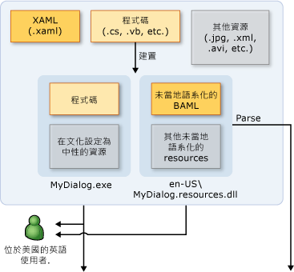
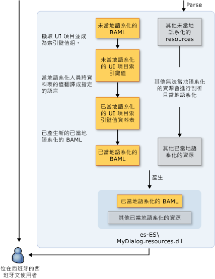

# WPF 全球化和當地語系化概觀WPF Globalization and Localization Overview
當您限制只有一種語言可以使用您的產品時，就是將潛在客戶群限制為全世界 65 億人口的一小部分。When you limit your product's availability to only one language, you limit your potential customer base to a fraction of our world’s 6.5 billion population. 如果您想要全球對象都可以使用應用程式，則具成本效益的產品當地語系化是更多客戶可以使用的一種最佳且最經濟的方法。If you want your applications to reach a global audience, cost-effective localization of your product is one of the best and most economical ways to reach more customers.  
  
 本概觀介紹全球化和當地語系化的[!INCLUDE[TLA#tla_winclient](../../../../includes/tlasharptla-winclient-md.md)]。This overview introduces globalization and localization in [!INCLUDE[TLA#tla_winclient](../../../../includes/tlasharptla-winclient-md.md)]. 全球化是在多個位置執行之應用程式的設計和開發。Globalization is the design and development of applications that perform in multiple locations. 例如，全球化支援不同文化特性中使用者的當地語系化使用者介面和地區資料。For example, globalization supports localized user interfaces and regional data for users in different cultures. [!INCLUDE[TLA2#tla_winclient](../../../../includes/tla2sharptla-winclient-md.md)] 提供全球化的設計功能，包括自動版面配置、 附屬組件，與當地語系化的屬性和註解。 provides globalized design features, including automatic layout, satellite assemblies, and localized attributes and commenting.
  
 當地語系化會將應用程式資源翻譯為應用程式所支援之特定文化特性的當地語系化版本。Localization is the translation of application resources into localized versions for the specific cultures that the application supports. 當您將當地語系化中[!INCLUDE[TLA2#tla_winclient](../../../../includes/tla2sharptla-winclient-md.md)]，使用中的 Api<xref:System.Windows.Markup.Localizer>命名空間。When you localize in [!INCLUDE[TLA2#tla_winclient](../../../../includes/tla2sharptla-winclient-md.md)], you use the APIs in the <xref:System.Windows.Markup.Localizer> namespace. 這些應用程式開發介面電源[LocBaml 工具範例](http://go.microsoft.com/fwlink/?LinkID=160016)命令列工具。These APIs power the [LocBaml Tool Sample](http://go.microsoft.com/fwlink/?LinkID=160016) command-line tool. 如需如何建立及使用 LocBaml 資訊，請參閱[當地語系化應用程式](../../../../docs/framework/wpf/advanced/how-to-localize-an-application.md)。For information about how to build and use LocBaml, see [Localize an Application](../../../../docs/framework/wpf/advanced/how-to-localize-an-application.md).    
  
## WPF 中的全球化和當地語系化最佳做法Best Practices for Globalization and Localization in WPF  
 您可以進行大部分的內建的全球化和當地語系化功能[!INCLUDE[TLA2#tla_winclient](../../../../includes/tla2sharptla-winclient-md.md)]遵循 UI 設計和此章節提供當地語系化相關的提示。You can make the most of the globalization and localization functionality that is built into [!INCLUDE[TLA2#tla_winclient](../../../../includes/tla2sharptla-winclient-md.md)] by following the UI design and localization-related tips that this section provides.  
  
### WPF UI 設計最佳做法Best Practices for WPF UI Design  
 當您設計[!INCLUDE[TLA2#tla_winclient](../../../../includes/tla2sharptla-winclient-md.md)]– 基礎[!INCLUDE[TLA2#tla_ui](../../../../includes/tla2sharptla-ui-md.md)]，請考慮實作這些最佳作法：When you design a [!INCLUDE[TLA2#tla_winclient](../../../../includes/tla2sharptla-winclient-md.md)]–based [!INCLUDE[TLA2#tla_ui](../../../../includes/tla2sharptla-ui-md.md)], consider implementing these best practices:  
  
-   撰寫您[!INCLUDE[TLA2#tla_ui](../../../../includes/tla2sharptla-ui-md.md)]中[!INCLUDE[TLA2#tla_xaml](../../../../includes/tla2sharptla-xaml-md.md)]; 避免建立[!INCLUDE[TLA2#tla_ui](../../../../includes/tla2sharptla-ui-md.md)]程式碼中。Write your [!INCLUDE[TLA2#tla_ui](../../../../includes/tla2sharptla-ui-md.md)] in [!INCLUDE[TLA2#tla_xaml](../../../../includes/tla2sharptla-xaml-md.md)]; avoid creating [!INCLUDE[TLA2#tla_ui](../../../../includes/tla2sharptla-ui-md.md)] in code. 當您建立您[!INCLUDE[TLA2#tla_ui](../../../../includes/tla2sharptla-ui-md.md)]使用[!INCLUDE[TLA2#tla_xaml](../../../../includes/tla2sharptla-xaml-md.md)]，您將它公開透過內建當地語系化應用程式開發介面。When you create your [!INCLUDE[TLA2#tla_ui](../../../../includes/tla2sharptla-ui-md.md)] by using [!INCLUDE[TLA2#tla_xaml](../../../../includes/tla2sharptla-xaml-md.md)], you expose it through built-in localization APIs.  
  
-   請避免使用絕對位置和固定的大小來配置內容。請改用相對或自動調整大小。Avoid using absolute positions and fixed sizes to lay out content; instead, use relative or automatic sizing.
  
    -   使用<xref:System.Windows.Window.SizeToContent%2A>; 並將寬度和高度設定為保留`Auto`。Use <xref:System.Windows.Window.SizeToContent%2A>; and keep widths and heights set to `Auto`.  
  
    -   請避免使用<xref:System.Windows.Controls.Canvas>配置[!INCLUDE[TLA2#tla_ui](../../../../includes/tla2sharptla-ui-md.md)]s。Avoid using <xref:System.Windows.Controls.Canvas> to lay out [!INCLUDE[TLA2#tla_ui](../../../../includes/tla2sharptla-ui-md.md)]s.  
  
    -   使用<xref:System.Windows.Controls.Grid>及其大小共用功能。Use <xref:System.Windows.Controls.Grid> and its size-sharing feature.  
  
-   因為當地語系化文字通常需要更多空間，所以請在邊界提供額外空間。Provide extra space in margins because localized text often requires more space. 額外空間可放置可能突出的字元。Extra space allows for possible overhanging characters.  
  
-   啟用<xref:System.Windows.Controls.TextBlock.TextWrapping%2A>上<xref:System.Windows.Controls.TextBlock>避免裁剪。Enable <xref:System.Windows.Controls.TextBlock.TextWrapping%2A> on <xref:System.Windows.Controls.TextBlock> to avoid clipping.
  
-   設定**xml: lang**屬性。Set the **xml:lang** attribute. 這個屬性所描述的文化特性特定的項目和其子項目。This attribute describes the culture of a specific element and its child elements. 這個屬性的值變更數個功能中的行為[!INCLUDE[TLA2#tla_winclient](../../../../includes/tla2sharptla-winclient-md.md)]。The value of this property changes the behavior of several features in [!INCLUDE[TLA2#tla_winclient](../../../../includes/tla2sharptla-winclient-md.md)]. 例如，它會變更斷字、拼字檢查、數字替代、複雜指令碼形成和字型遞補的行為。For example, it changes the behavior of hyphenation, spell checking, number substitution, complex script shaping, and font fallback. 請參閱[WPF 的全球化](../../../../docs/framework/wpf/advanced/globalization-for-wpf.md)如需有關設定[xml: lang 處理在 XAML 中](../../../../docs/framework/xaml-services/xml-lang-handling-in-xaml.md)。See [Globalization for WPF](../../../../docs/framework/wpf/advanced/globalization-for-wpf.md) for more information about setting the [xml:lang Handling in XAML](../../../../docs/framework/xaml-services/xml-lang-handling-in-xaml.md).  
  
-   建立自訂的複合字型，以取得不同語言所用字型的較佳的控制項。Create a customized composite font to obtain better control of fonts that are used for different languages. 根據預設，[!INCLUDE[TLA2#tla_winclient](../../../../includes/tla2sharptla-winclient-md.md)]使用 GlobalUserInterface.composite 字型 Windows\Fonts 目錄中的。By default, [!INCLUDE[TLA2#tla_winclient](../../../../includes/tla2sharptla-winclient-md.md)] uses the GlobalUserInterface.composite font in your Windows\Fonts directory.  
  
-   當您建立瀏覽應用程式可能會當地語系化的文化特性中的格式，呈現文字由右至左，明確地設定<xref:System.Windows.FlowDirection>每一頁，以確保頁面不會繼承<xref:System.Windows.FlowDirection>從<xref:System.Windows.Navigation.NavigationWindow>。When you create navigation applications that may be localized in a culture that presents text in a right-to-left format, explicitly set the <xref:System.Windows.FlowDirection> of every page to ensure the page does not inherit <xref:System.Windows.FlowDirection> from the <xref:System.Windows.Navigation.NavigationWindow>.  
  
-   當您建立外部瀏覽器所裝載的獨立瀏覽應用程式時，設定<xref:System.Windows.Application.StartupUri%2A>初始應用程式<xref:System.Windows.Navigation.NavigationWindow>而不是到網頁 (例如， `<Application StartupUri="NavigationWindow.xaml">`)。When you create stand-alone navigation applications that are hosted outside a browser, set the <xref:System.Windows.Application.StartupUri%2A> for your initial application to a <xref:System.Windows.Navigation.NavigationWindow> instead of to a page (for example, `<Application StartupUri="NavigationWindow.xaml">`). 此設計可讓您變更<xref:System.Windows.FlowDirection>的視窗，並導覽列。This design enables you to change the <xref:System.Windows.FlowDirection> of the Window and the navigation bar. 如需詳細資訊和範例，請參閱[全球化首頁範例](http://go.microsoft.com/fwlink/?LinkID=159990)。For more information and an example, see [Globalization Homepage Sample](http://go.microsoft.com/fwlink/?LinkID=159990).  
  
### WPF 當地語系化最佳做法Best Practices for WPF Localization  
 當您將當地語系化[!INCLUDE[TLA2#tla_winclient](../../../../includes/tla2sharptla-winclient-md.md)]– 應用程式，請考慮實作這些最佳作法：When you localize [!INCLUDE[TLA2#tla_winclient](../../../../includes/tla2sharptla-winclient-md.md)]–based applications, consider implementing these best practices:  
  
-   用於當地語系化註解的當地語系化人員提供額外的內容。Use localization comments to provide extra context for localizers.  
  
-   用於當地語系化屬性控制而不是選擇性地省略當地語系化<xref:System.Windows.Markup.Localizer.BamlLocalizableResourceKey.Uid%2A>項目上的屬性。Use localization attributes to control localization instead of selectively omitting <xref:System.Windows.Markup.Localizer.BamlLocalizableResourceKey.Uid%2A> properties on elements. 請參閱[當地語系化屬性和註解](../../../../docs/framework/wpf/advanced/localization-attributes-and-comments.md)如需詳細資訊。See [Localization Attributes and Comments](../../../../docs/framework/wpf/advanced/localization-attributes-and-comments.md) for more information.  
  
-   使用**msbuild /t:updateuid**和 **/t:checkuid**新增並檢查<xref:System.Windows.Markup.Localizer.BamlLocalizableResourceKey.Uid%2A>屬性中的您[!INCLUDE[TLA2#tla_xaml](../../../../includes/tla2sharptla-xaml-md.md)]。Use **msbuild /t:updateuid** and **/t:checkuid** to add and check <xref:System.Windows.Markup.Localizer.BamlLocalizableResourceKey.Uid%2A> properties in your [!INCLUDE[TLA2#tla_xaml](../../../../includes/tla2sharptla-xaml-md.md)]. 使用<xref:System.Windows.Markup.Localizer.BamlLocalizableResourceKey.Uid%2A>來追蹤開發和當地語系化之間變更的屬性。Use <xref:System.Windows.Markup.Localizer.BamlLocalizableResourceKey.Uid%2A> properties to track changes between development and localization. <xref:System.Windows.Markup.Localizer.BamlLocalizableResourceKey.Uid%2A> 屬性可協助您將新的開發變更的當地語系化。<xref:System.Windows.Markup.Localizer.BamlLocalizableResourceKey.Uid%2A> properties help you localize new development changes. 如果您手動新增<xref:System.Windows.Markup.Localizer.BamlLocalizableResourceKey.Uid%2A>屬性[!INCLUDE[TLA2#tla_ui](../../../../includes/tla2sharptla-ui-md.md)]，此工作是通常繁瑣且較不精確。If you manually add <xref:System.Windows.Markup.Localizer.BamlLocalizableResourceKey.Uid%2A> properties to a [!INCLUDE[TLA2#tla_ui](../../../../includes/tla2sharptla-ui-md.md)], the task is typically tedious and less accurate.  
  
    -   無法編輯或變更<xref:System.Windows.Markup.Localizer.BamlLocalizableResourceKey.Uid%2A>之後開始當地語系化的屬性。Do not edit or change <xref:System.Windows.Markup.Localizer.BamlLocalizableResourceKey.Uid%2A> properties after you begin localization.  
  
    -   請勿使用重複<xref:System.Windows.Markup.Localizer.BamlLocalizableResourceKey.Uid%2A>屬性 （當您使用複製和貼上 命令時，請記住這個提示）。Do not use duplicate <xref:System.Windows.Markup.Localizer.BamlLocalizableResourceKey.Uid%2A> properties (remember this tip when you use the copy-and-paste command).  
  
    -   設定`UltimateResourceFallback`中指定適當的語言進行遞補 AssemblyInfo.\* 位置 (例如， `[assembly: NeutralResourcesLanguage("en-US",   UltimateResourceFallbackLocation.Satellite)]`)。Set the `UltimateResourceFallback` location in AssemblyInfo.\* to specify the appropriate language for fallback (for example, `[assembly: NeutralResourcesLanguage("en-US",   UltimateResourceFallbackLocation.Satellite)]`).  
  
         如果您決定要包含在主要組件中的原始碼語言，藉由略過`<UICulture>`專案檔中標記中，設定`UltimateResourceFallback`主組件，而不是附屬項目位置 (例如， `[assembly: NeutralResourcesLanguage("en-US", UltimateResourceFallbackLocation.MainAssembly)]`)。If you decide to include your source language in the main assembly by omitting the `<UICulture>` tag in your project file, set the `UltimateResourceFallback` location as the main assembly instead of the satellite (for example, `[assembly: NeutralResourcesLanguage("en-US", UltimateResourceFallbackLocation.MainAssembly)]`).  
  
   
## 將 WPF 應用程式當地語系化Localize a WPF Application  
 當您將當地語系化[!INCLUDE[TLA2#tla_winclient](../../../../includes/tla2sharptla-winclient-md.md)]應用程式中，有數個選項。When you localize a [!INCLUDE[TLA2#tla_winclient](../../../../includes/tla2sharptla-winclient-md.md)] application, you have several options. 例如，您的應用程式中繫結可當地語系化的資源[!INCLUDE[TLA2#tla_xml](../../../../includes/tla2sharptla-xml-md.md)]檔案，可當地語系化的文字儲存在 resx 資料表中，或使用您當地語系化[!INCLUDE[TLA#tla_xaml](../../../../includes/tlasharptla-xaml-md.md)]檔案。For example, you can bind the localizable resources in your application to an [!INCLUDE[TLA2#tla_xml](../../../../includes/tla2sharptla-xml-md.md)] file, store localizable text in resx tables, or have your localizer use [!INCLUDE[TLA#tla_xaml](../../../../includes/tlasharptla-xaml-md.md)] files. 本章節描述使用 BAML 形式的 XAML，有數個優點的當地語系化工作流程：This section describes a localization workflow that uses the BAML form of XAML, which provides several benefits:  
  
-   建置之後，即可進行當地語系化。You can localize after you build .  
  
-   您可以使用當地語系化從 BAML 形式之 XAML 的舊版本更新為 BAML 形式之 XAML 的新版本，以在開發的同時進行當地語系化。You can update to a newer version of the BAML form of XAMLwith localizations from an older version of the BAML form of XAML so that you can localize at the same time that you develop.  
  
-   您可以驗證原始來源項目及語意在編譯時期因為 BAML 形式的 XAML 的編譯的形式[!INCLUDE[TLA2#tla_xaml](../../../../includes/tla2sharptla-xaml-md.md)]。You can validate original source elements and semantics at compile time because the BAML form of XAML is the compiled form of [!INCLUDE[TLA2#tla_xaml](../../../../includes/tla2sharptla-xaml-md.md)].  
  
### 當地語系化建置程序Localization Build Process  
 當您開發[!INCLUDE[TLA2#tla_winclient](../../../../includes/tla2sharptla-winclient-md.md)]應用程式，當地語系化的建置程序如下所示：When you develop a [!INCLUDE[TLA2#tla_winclient](../../../../includes/tla2sharptla-winclient-md.md)] application, the build process for localization is as follows:  
  
-   開發人員建立和全球化[!INCLUDE[TLA2#tla_winclient](../../../../includes/tla2sharptla-winclient-md.md)]應用程式。The developer creates and globalizes the [!INCLUDE[TLA2#tla_winclient](../../../../includes/tla2sharptla-winclient-md.md)] application. 在專案檔中的開發人員集`<UICulture>en-US</UICulture>`，讓應用程式編譯時，會產生非語言相關的主要組件。In the project file the developer sets `<UICulture>en-US</UICulture>` so that when the application is compiled, a language-neutral main assembly is generated. 此組件具有包含所有可當地語系化資源的附屬 .resources.dll 檔案。This assembly has a satellite .resources.dll file that contains all the localizable resources. （選擇性） 您可以保留原始碼語言中主要組件因為我們當地語系化[!INCLUDE[TLA2#tla_api#plural](../../../../includes/tla2sharptla-apisharpplural-md.md)]支援主要組件中的擷取。Optionally, you can keep the source language in the main assembly because our localization [!INCLUDE[TLA2#tla_api#plural](../../../../includes/tla2sharptla-apisharpplural-md.md)] support extraction from the main assembly.  
  
-   當檔案會編譯成組建，[!INCLUDE[TLA2#tla_xaml](../../../../includes/tla2sharptla-xaml-md.md)]轉換成 BAML 形式的 XAML。When the file is compiled into the build, the [!INCLUDE[TLA2#tla_xaml](../../../../includes/tla2sharptla-xaml-md.md)] is converted to the BAML form of XAML. 文化特性中性`MyDialog.exe`和文化特性上相依 （英文）`MyDialog.resources.dll`檔案會發行給英語的客戶。The culturally neutral `MyDialog.exe` and the culturally dependent (English) `MyDialog.resources.dll` files are released to the English-speaking customer.  
  
### 當地語系化工作流程Localization Workflow  
 當地語系化程序開始後未當地語系化`MyDialog.resources.dll`建置檔案。The localization process begins after the unlocalized `MyDialog.resources.dll` file is built. [!INCLUDE[TLA2#tla_ui](../../../../includes/tla2sharptla-ui-md.md)]元素和屬性，在您的原始[!INCLUDE[TLA2#tla_xaml](../../../../includes/tla2sharptla-xaml-md.md)]從中使用為索引鍵 / 值組 BAML 形式的 XAML[!INCLUDE[TLA2#tla_api#plural](../../../../includes/tla2sharptla-apisharpplural-md.md)]下<xref:System.Windows.Markup.Localizer>。The [!INCLUDE[TLA2#tla_ui](../../../../includes/tla2sharptla-ui-md.md)] elements and properties in your original [!INCLUDE[TLA2#tla_xaml](../../../../includes/tla2sharptla-xaml-md.md)] are extracted from the BAML form of XAML into key-value pairs by using the [!INCLUDE[TLA2#tla_api#plural](../../../../includes/tla2sharptla-apisharpplural-md.md)] under <xref:System.Windows.Markup.Localizer>. 當地語系化人員會使用鍵值組來當地語系化應用程式。Localizers use the key-value pairs to localize the application. 當地語系化完成之後，即可從新值產生新的 .resource.dll。You can generate a new .resource.dll from the new values after localization is complete.  
  
 索引鍵-值組的索引鍵為`x:Uid`值放在開發人員在原始的[!INCLUDE[TLA2#tla_xaml](../../../../includes/tla2sharptla-xaml-md.md)]。The keys of the key-value pairs are `x:Uid` values that are placed by the developer in the original [!INCLUDE[TLA2#tla_xaml](../../../../includes/tla2sharptla-xaml-md.md)]. 這些`x:Uid`值可讓[!INCLUDE[TLA2#tla_api](../../../../includes/tla2sharptla-api-md.md)]來追蹤和合併期間當地語系化開發人員和當地語系化之間發生的變更。These `x:Uid` values enable the [!INCLUDE[TLA2#tla_api](../../../../includes/tla2sharptla-api-md.md)] to track and merge changes that happen between the developer and the localizer during localization. 例如，如果開發人員變更[!INCLUDE[TLA2#tla_ui](../../../../includes/tla2sharptla-ui-md.md)]當地語系化人員開始當地語系化之後，您可以合併開發具有的變更已經完成的當地語系化工作，因此最少的轉譯工作就會遺失。For example, if the developer changes the [!INCLUDE[TLA2#tla_ui](../../../../includes/tla2sharptla-ui-md.md)] after the localizer begins localizing, you can merge the development change with the already completed localization work so that minimal translation work is lost.  
  
 下圖顯示根據 BAML 形式之 XAML 的一般當地語系化工作流程。The following graphic shows a typical localization workflow that is based on the BAML form of XAML. 此圖表會假設在英文中，開發人員撰寫應用程式。This diagram assumes the developer writes the application in English. 開發人員會建立和全球化 WPF 應用程式。The developer creates and globalizes the WPF application. 在專案檔中的開發人員集`<UICulture>en-US</UICulture>`，以便建置語言中性主要組件取得產生的附屬項目.resources.dll 包含所有可當地語系化的資源。In the project file the developer sets `<UICulture>en-US</UICulture>` so that on build, a language neutral main assembly gets generated with a satellite .resources.dll containing all localizable resources. 或者，有人保持主要組件中的來源語言，因為 WPF 當地語系化 API 支援從主要組件進行擷取。Alternately, one could keep the source language in the main assembly because WPF localization APIs support extraction from the main assembly. 建置程序之後，XAML 會編譯到 BAML。After the build process, the XAML get compiled into BAML. 與文化特性無關的 MyDialog.exe.resources.dll 會傳送給英語系的客戶。The culturally neutral MyDialog.exe.resources.dll get shipped to the English speaking customer.  
  
   
  
   
  
   
## WPF 當地語系化範例Examples of WPF Localization  
 本章節包含的當地語系化應用程式，協助您了解如何建置和當地語系化範例[!INCLUDE[TLA2#tla_winclient](../../../../includes/tla2sharptla-winclient-md.md)]應用程式。This section contains examples of localized applications to help you understand how to build and localize [!INCLUDE[TLA2#tla_winclient](../../../../includes/tla2sharptla-winclient-md.md)] applications.  
  
#### 執行對話方塊範例Run Dialog Box Example  
 下圖顯示的輸出**執行**對話方塊範例。The following graphics show the output of the **Run** dialog box sample.  
  
 **英文：****English:**  
  
   
  
 **德文：****German:**  
  
   
  
 **設計全域執行對話方塊****Designing a Global Run Dialog Box**  
  
 這個範例會產生**執行**對話方塊使用[!INCLUDE[TLA2#tla_winclient](../../../../includes/tla2sharptla-winclient-md.md)]和[!INCLUDE[TLA2#tla_xaml](../../../../includes/tla2sharptla-xaml-md.md)]。This example produces a **Run** dialog box by using [!INCLUDE[TLA2#tla_winclient](../../../../includes/tla2sharptla-winclient-md.md)] and [!INCLUDE[TLA2#tla_xaml](../../../../includes/tla2sharptla-xaml-md.md)]. 這個對話方塊就相當於**執行**對話方塊可從[!INCLUDE[TLA#tla_win](../../../../includes/tlasharptla-win-md.md)]開始 功能表。This dialog box is equivalent to the **Run** dialog box that is available from the [!INCLUDE[TLA#tla_win](../../../../includes/tlasharptla-win-md.md)] Start menu.  
  
 建立全域對話方塊的一些重點如下︰Some highlights for making global dialog boxes are:  
  
 **自動版面配置****Automatic Layout**  
  
 *在 Window1.xaml 中：**In Window1.xaml:*  
  
 `<Window SizeToContent="WidthAndHeight">`  
  
 前一個 Window 屬性會根據內容的大小來自動調整視窗大小。The previous Window property automatically resizes the window according to the size of the content. 此屬性會防止視窗中在當地語系化因大小增加而裁切內容；內容在當地語系化後大小減少時，它也會移除不必要的空間。This property prevents the window from cutting off content that increases in size after localization; it also removes unneeded space when content decreases in size after localization.  
  
 `<Grid x:Uid="Grid_1">`  
  
 <xref:System.Windows.Markup.Localizer.BamlLocalizableResourceKey.Uid%2A> 為了讓需要屬性時[!INCLUDE[TLA2#tla_winclient](../../../../includes/tla2sharptla-winclient-md.md)]當地語系化[!INCLUDE[TLA2#tla_api#plural](../../../../includes/tla2sharptla-apisharpplural-md.md)]正常運作。<xref:System.Windows.Markup.Localizer.BamlLocalizableResourceKey.Uid%2A> properties are needed in order for [!INCLUDE[TLA2#tla_winclient](../../../../includes/tla2sharptla-winclient-md.md)] localization [!INCLUDE[TLA2#tla_api#plural](../../../../includes/tla2sharptla-apisharpplural-md.md)] to work correctly.  
  
 它們由[!INCLUDE[TLA2#tla_winclient](../../../../includes/tla2sharptla-winclient-md.md)]當地語系化[!INCLUDE[TLA2#tla_api#plural](../../../../includes/tla2sharptla-apisharpplural-md.md)]變更追蹤之間的開發和當地語系化的[!INCLUDE[TLA#tla_ui](../../../../includes/tlasharptla-ui-md.md)]。They are used by [!INCLUDE[TLA2#tla_winclient](../../../../includes/tla2sharptla-winclient-md.md)] localization [!INCLUDE[TLA2#tla_api#plural](../../../../includes/tla2sharptla-apisharpplural-md.md)] to track changes between the development and localization of the [!INCLUDE[TLA#tla_ui](../../../../includes/tlasharptla-ui-md.md)]. <xref:System.Windows.Markup.Localizer.BamlLocalizableResourceKey.Uid%2A> 屬性可讓您合併較新版的[!INCLUDE[TLA2#tla_ui](../../../../includes/tla2sharptla-ui-md.md)]與較舊的當地語系化[!INCLUDE[TLA2#tla_ui](../../../../includes/tla2sharptla-ui-md.md)]。<xref:System.Windows.Markup.Localizer.BamlLocalizableResourceKey.Uid%2A> properties enable you to merge a newer version of the [!INCLUDE[TLA2#tla_ui](../../../../includes/tla2sharptla-ui-md.md)] with an older localization of the [!INCLUDE[TLA2#tla_ui](../../../../includes/tla2sharptla-ui-md.md)]. 您將加入<xref:System.Windows.Markup.Localizer.BamlLocalizableResourceKey.Uid%2A>屬性執行**msbuild /t:updateuid RunDialog.csproj**命令殼層。You add a <xref:System.Windows.Markup.Localizer.BamlLocalizableResourceKey.Uid%2A> property by running **msbuild /t:updateuid RunDialog.csproj** in a command shell. 這是建議的方法加入的<xref:System.Windows.Markup.Localizer.BamlLocalizableResourceKey.Uid%2A>屬性，所以手動加入它們通常相當耗時而且需要較不精確。This is the recommended method of adding <xref:System.Windows.Markup.Localizer.BamlLocalizableResourceKey.Uid%2A> properties because manually adding them is typically time-consuming and less accurate. 您可以檢查<xref:System.Windows.Markup.Localizer.BamlLocalizableResourceKey.Uid%2A>屬性均已正確設定執行**msbuild /t:checkuid RunDialog.csproj**。You can check that <xref:System.Windows.Markup.Localizer.BamlLocalizableResourceKey.Uid%2A> properties are correctly set by running **msbuild /t:checkuid RunDialog.csproj**.  
  
 [!INCLUDE[TLA2#tla_ui](../../../../includes/tla2sharptla-ui-md.md)]使用結構化<xref:System.Windows.Controls.Grid>控制項，這是利用自動配置的有用控制項中[!INCLUDE[TLA2#tla_winclient](../../../../includes/tla2sharptla-winclient-md.md)]。The [!INCLUDE[TLA2#tla_ui](../../../../includes/tla2sharptla-ui-md.md)] is structured by using the <xref:System.Windows.Controls.Grid> control, which is a useful control for taking advantage of the automatic layout in [!INCLUDE[TLA2#tla_winclient](../../../../includes/tla2sharptla-winclient-md.md)]. 請注意，對話方塊分成三個資料列和五個資料行。Note that the dialog box is split into three rows and five columns. 不是其中一個資料列和資料行定義具有固定的大小。因此，[!INCLUDE[TLA2#tla_ui](../../../../includes/tla2sharptla-ui-md.md)]位於每個資料格中的項目可以調整增加和減少大小當地語系化過程。Not one of the row and column definitions has a fixed size; hence, the [!INCLUDE[TLA2#tla_ui](../../../../includes/tla2sharptla-ui-md.md)] elements that are positioned in each cell can adapt to increases and decreases in size during localization.  
  
 [!code-xaml[GlobalizationRunDialog#GridColumnDef](../../../../samples/snippets/csharp/VS_Snippets_Wpf/GlobalizationRunDialog/CS/Window1.xaml#gridcolumndef)]  
  
 前兩個資料行其中**開啟：** 標籤和<xref:System.Windows.Controls.ComboBox>位於使用 10%的[!INCLUDE[TLA2#tla_ui](../../../../includes/tla2sharptla-ui-md.md)]總寬度。The first two columns where the **Open:** label and <xref:System.Windows.Controls.ComboBox> are placed use 10 percent of the [!INCLUDE[TLA2#tla_ui](../../../../includes/tla2sharptla-ui-md.md)] total width.  
  
 [!code-xaml[GlobalizationRunDialog#GridColumnDef2](../../../../samples/snippets/csharp/VS_Snippets_Wpf/GlobalizationRunDialog/CS/Window1.xaml#gridcolumndef2)]  
  
 請注意，此範例會使用的共用調整大小功能<xref:System.Windows.Controls.Grid>。Note that of the example uses the shared-sizing feature of <xref:System.Windows.Controls.Grid>. 最後三個資料行本身放置在同一個充分利用這<xref:System.Windows.Controls.DefinitionBase.SharedSizeGroup%2A>。The last three columns take advantage of this by placing themselves in the same <xref:System.Windows.Controls.DefinitionBase.SharedSizeGroup%2A>. 因為其中一個預期來自屬性名稱，所以這可讓資料行共用相同的大小。As one would expect from the name of the property, this allows the columns to share the same size. 因此，如果 "Browse…"So when the "Browse…" 當地語系化為較長的字串 "Durchsuchen…"，則所有按鈕的寬度都會增加，而不會有較小的 "OK" 按鈕，以及顯得特別大的 "Durchsuchen…"gets localized to the longer string "Durchsuchen…", all buttons grow in width instead of having a small "OK" button and a disproportionately large "Durchsuchen…" 按鈕。button.  
  
 **Xml:lang****Xml:lang**  
  
 `Xml:lang="en-US"`  
  
 請注意[xml: lang 處理在 XAML 中](../../../../docs/framework/xaml-services/xml-lang-handling-in-xaml.md)放在根項目[!INCLUDE[TLA2#tla_ui](../../../../includes/tla2sharptla-ui-md.md)]。Notice the [xml:lang Handling in XAML](../../../../docs/framework/xaml-services/xml-lang-handling-in-xaml.md) placed at the root element of the [!INCLUDE[TLA2#tla_ui](../../../../includes/tla2sharptla-ui-md.md)]. 此屬性描述所指定項目的文化特性和其子項目。This property describes the culture of a given element and its children. 這個值由數個功能中[!INCLUDE[TLA2#tla_winclient](../../../../includes/tla2sharptla-winclient-md.md)]且適當地當地語系化過程中變更。This value is used by several features in [!INCLUDE[TLA2#tla_winclient](../../../../includes/tla2sharptla-winclient-md.md)] and should be changed appropriately during localization. 此值可變更使用何種語言字典來進行斷字和拼字檢查。This value changes what language dictionary is use to hyphenate and spell check words. 它也會影響顯示的位數，以及字型遞補系統如何選取要使用的字型。It also affects the display of digits and how the font fallback system selects which font to use. 最後，此屬性會影響數字顯示方式，以及使用複雜指令碼所撰寫之文字的形成方式。Finally, the property affects the way numbers are displayed and the way texts written in complex scripts are shaped. 預設值是 "en-US"。The default value is "en-US".  
  
 **建置附屬資源組件****Building a Satellite Resource Assembly**  
  
 *在 .csproj 中：**In .csproj:*  
  
 `<UICulture>en-US</UICulture>`  
  
 請注意新增`UICulture`值。Notice the addition of a `UICulture` value. 這設定為有效<xref:System.Globalization.CultureInfo>值，例如 EN-US，建置專案將會在它產生附屬組件與所有可當地語系化的資源。When this is set to a valid <xref:System.Globalization.CultureInfo> value such as en-US, building the project will generate a satellite assembly with all localizable resources in it.  
  
 `<Resource Include="RunIcon.JPG">`  
  
 `<Localizable>False</Localizable>`  
  
 `</Resource>`  
  
 `RunIcon.JPG`不需要當地語系化，因為它應該會出現相同的所有文化特性。The `RunIcon.JPG` does not need to be localized because it should appear the same for all cultures. `Localizable` 設定為`false`，使其仍然語言中性主要組件中而不是附屬組件。`Localizable` is set to `false` so that it remains in the language neutral main assembly instead of the satellite assembly. 所有 noncompilable 資源的預設值是`Localizable`設`true`。The default value of all noncompilable resources is `Localizable` set to `true`.  
  
 **將執行對話方塊當地語系化****Localizing the Run Dialog**  
  
 **剖析****Parse**  
  
 建置應用程式之後，將它當地語系化的第一個步驟是剖析附屬組件的可當地語系化資源。After building the application, the first step in localizing it is parsing the localizable resources out of the satellite assembly. 本主題的用途，使用範例 LocBaml 工具，可以在找到[LocBaml 工具範例](http://go.microsoft.com/fwlink/?LinkID=160016)。For the purposes of this topic, use the sample LocBaml tool which can be found at [LocBaml Tool Sample](http://go.microsoft.com/fwlink/?LinkID=160016). 請注意，LocBaml 只是一種範例工具，旨在協助您開始建置符合當地語系化程序的當地語系化工具。Note that LocBaml is only a sample tool meant to help you get started in building a localization tool that fits into your localization process. 使用 LocBaml，執行下列命令以剖析： **LocBaml/剖析 RunDialog.resources.dll /out:** 來產生 「 RunDialog.resources.dll.CSV"檔案。Using LocBaml, run the following to parse: **LocBaml /parse RunDialog.resources.dll /out:** to generate a "RunDialog.resources.dll.CSV" file.  
  
 **當地語系化****Localize**  
  
 使用支援 Unicode 的慣用 CSV 編輯器，才能編輯這個檔案。Use your favorite CSV editor that supports Unicode to edit this file. 篩選出當地語系化分類為 "None" 的所有項目。Filter out all entries with a localization category of "None". 您應該會看到下列項目：You should see the following entries:  
  
|資源索引鍵Resource Key|當地語系化分類Localization Category|值Value|  
|-|-|-| 
|Button_1:System.Windows.Controls.Button.$ContentButton_1:System.Windows.Controls.Button.$Content|按鈕Button|確定OK|  
|Button_2:System.Windows.Controls.Button.$ContentButton_2:System.Windows.Controls.Button.$Content|按鈕Button|取消Cancel|  
|Button_3:System.Windows.Controls.Button.$ContentButton_3:System.Windows.Controls.Button.$Content|按鈕Button|瀏覽...Browse...|  
|ComboBox_1:System.Windows.Controls.ComboBox.$ContentComboBox_1:System.Windows.Controls.ComboBox.$Content|ComboBoxComboBox||  
|TextBlock_1:System.Windows.Controls.TextBlock.$ContentTextBlock_1:System.Windows.Controls.TextBlock.$Content|TextText|輸入程式、資料夾、文件或網際網路資源的名稱，Windows 會自動開啟。Type the name of a program, folder, document, or Internet resource, and Windows will open it for you.|  
|TextBlock_2:System.Windows.Controls.TextBlock.$ContentTextBlock_2:System.Windows.Controls.TextBlock.$Content|TextText|開啟：Open:|  
|Window_1:System.Windows.Window.TitleWindow_1:System.Windows.Window.Title|標題Title|執行Run|  
  
 將應用程式當地語系化為德文需要下列翻譯︰Localizing the application to German would require the following translations:  
  
|資源索引鍵Resource Key|當地語系化分類Localization Category|值Value|  
|-|-|-| 
|Button_1:System.Windows.Controls.Button.$ContentButton_1:System.Windows.Controls.Button.$Content|按鈕Button|確定OK|  
|Button_2:System.Windows.Controls.Button.$ContentButton_2:System.Windows.Controls.Button.$Content|按鈕Button|AbbrechenAbbrechen|  
|Button_3:System.Windows.Controls.Button.$ContentButton_3:System.Windows.Controls.Button.$Content|按鈕Button|Durchsuchen…Durchsuchen…|  
|ComboBox_1:System.Windows.Controls.ComboBox.$ContentComboBox_1:System.Windows.Controls.ComboBox.$Content|ComboBoxComboBox||  
|TextBlock_1:System.Windows.Controls.TextBlock.$ContentTextBlock_1:System.Windows.Controls.TextBlock.$Content|TextText|Geben Sie den Namen eines Programms, Ordners, Dokuments oder einer Internetresource an.Geben Sie den Namen eines Programms, Ordners, Dokuments oder einer Internetresource an.|  
|TextBlock_2:System.Windows.Controls.TextBlock.$ContentTextBlock_2:System.Windows.Controls.TextBlock.$Content|TextText|Öffnen:Öffnen:|  
|Window_1:System.Windows.Window.TitleWindow_1:System.Windows.Window.Title|標題Title|執行Run|  
  
 **產生****Generate**  
  
 當地語系化的最後一個步驟包括建立新的當地語系化附屬組件。The last step of localization involves creating the newly localized satellite assembly. 使用下列 LocBaml 命令，即可完成這項作業：This can be accomplished with the following LocBaml command:  
  
 **LocBaml.exe /generate RunDialog.resources.dll /trans:RunDialog.resources.dll.CSV /out: . /cul:de-DE****LocBaml.exe /generate RunDialog.resources.dll /trans:RunDialog.resources.dll.CSV /out: . /cul:de-DE**  
  
 在德文[!INCLUDE[TLA#tla_mswin](../../../../includes/tlasharptla-mswin-md.md)]，如果此.resources.dll 放在 DE-DE 資料夾旁邊的主要組件，這項資源會自動載入而非 EN-US 資料夾中。On German [!INCLUDE[TLA#tla_mswin](../../../../includes/tlasharptla-mswin-md.md)], if this resources.dll is placed in a de-DE folder next to the main assembly, this resource will automatically load instead of the one in the en-US folder. 如果您沒有德文版的[!INCLUDE[TLA#tla_mswin](../../../../includes/tlasharptla-mswin-md.md)]若要測試這種情況，設定文化特性的任何文化特性[!INCLUDE[TLA#tla_mswin](../../../../includes/tlasharptla-mswin-md.md)]您使用 (也就是 EN-US)，並取代原始.resources.dll。If you do not have a German version of [!INCLUDE[TLA#tla_mswin](../../../../includes/tlasharptla-mswin-md.md)] to test this, set the culture to whatever culture of [!INCLUDE[TLA#tla_mswin](../../../../includes/tlasharptla-mswin-md.md)] you are using (i.e. en-US), and replace the original resources.dll.  
  
 **附屬資源載入****Satellite Resource Loading**  
  
|MyDialog.exeMyDialog.exe|en-US\MyDialog.resources.dllen-US\MyDialog.resources.dll|de-DE\MyDialog.resources.dllde-DE\MyDialog.resources.dll|  
|------------------|------------------------------------|------------------------------------|  
|程式碼Code|附屬資源 BAMLOriginal English BAML|當地語系化 BAMLLocalized BAML|  
|文化特性中性資源Culturally neutral resources|英文的其他資源Other resources in English|當地語系化為德文的其他資源Other resources localized to German|  
  
 .NET framework 會自動選擇要載入根據應用程式的哪些附屬資源組件`Thread.CurrentThread.CurrentUICulture`。The .NET framework automatically chooses which satellite resources assembly to load based on the application’s `Thread.CurrentThread.CurrentUICulture`. 預設值的文化特性為您[!INCLUDE[TLA#tla_mswin](../../../../includes/tlasharptla-mswin-md.md)]OS。This defaults to the culture of your [!INCLUDE[TLA#tla_mswin](../../../../includes/tlasharptla-mswin-md.md)] OS. 因此，如果您使用德文[!INCLUDE[TLA#tla_mswin](../../../../includes/tlasharptla-mswin-md.md)]，de-DE\MyDialog.resources.dll 載入，如果您使用英文[!INCLUDE[TLA#tla_mswin](../../../../includes/tlasharptla-mswin-md.md)]，en-US\MyDialog.resources.dll 載入。So if you are using German [!INCLUDE[TLA#tla_mswin](../../../../includes/tlasharptla-mswin-md.md)], the de-DE\MyDialog.resources.dll loads, if you are using English [!INCLUDE[TLA#tla_mswin](../../../../includes/tlasharptla-mswin-md.md)], the en-US\MyDialog.resources.dll loads. 您可以在專案的 AssemblyInfo.\* 中指定 NeutralResourcesLanguage，以設定應用程式的最終後援資源。You can set the ultimate fallback resource for your application by specifying the NeutralResourcesLanguage in your project’s AssemblyInfo.\*. 例如，如果您指定：For example if you specify:  
  
 `[assembly: NeutralResourcesLanguage("en-US", UltimateResourceFallbackLocation.Satellite)]`  
  
 則在無法使用 de-DE\MyDialog.resources.dll 或 de\MyDialog.resources.dll 時，會搭配使用 en-US\MyDialog.resources.dll 與德文 Windows。then the en-US\MyDialog.resources.dll will be used with German Windows if a de-DE\MyDialog.resources.dll or de\MyDialog.resources.dll are both unavailable.  
  
### Microsoft Saudi Arabia 首頁Microsoft Saudi Arabia Homepage  
 下圖顯示英文和阿拉伯文首頁。The following graphics show an English and Arabic Homepage. 完整的範例會產生這些圖形，請參閱[全球化首頁範例](http://go.microsoft.com/fwlink/?LinkID=159990)。For the complete sample that produces these graphics see [Globalization Homepage Sample](http://go.microsoft.com/fwlink/?LinkID=159990).  
  
 **英文：****English:**  
  
   
  
 **阿拉伯文：****Arabic:**  
  
   
  
### 設計全域 Microsoft 首頁Designing a Global Microsoft Homepage  
 這個模擬的 Microsoft Saudi Arabia 網站說明針對 RightToLeft 語言所提供的全球化功能。This mock up of the Microsoft Saudi Arabia web site illustrates the globalization features provided for RightToLeft languages. 希伯來文與阿拉伯文等語言因此具有由右至左讀取順序的版面配置[!INCLUDE[TLA2#tla_ui](../../../../includes/tla2sharptla-ui-md.md)]必須經常進行配置方式則相當不同比其在由左到右的語言，例如英文。Languages such as Hebrew and Arabic have a right-to-left reading order so the layout of [!INCLUDE[TLA2#tla_ui](../../../../includes/tla2sharptla-ui-md.md)] must often be laid out quite differently than it would be in left-to-right languages such as English. 從由左至右語言當地語系化為由右至左語言 (反之亦然) 可能相當困難。Localizing from a left-to-right language to a right-to-left language or vice versa can be quite challenging. [!INCLUDE[TLA2#tla_winclient](../../../../includes/tla2sharptla-winclient-md.md)] 設計成讓這類當地語系化更為簡單。 has been designed to make such localizations much easier.  
  
 **FlowDirection****FlowDirection**  
  
 *Homepage.xaml：**Homepage.xaml:*  
  
 [!code-xaml[GlobalizationHomepage#Homepage](../../../../samples/snippets/csharp/VS_Snippets_Wpf/GlobalizationHomepage/CS/Homepage.xaml#homepage)]  
  
 請注意<xref:System.Windows.FrameworkElement.FlowDirection%2A>屬性<xref:System.Windows.Controls.Page>。Notice the <xref:System.Windows.FrameworkElement.FlowDirection%2A> property on <xref:System.Windows.Controls.Page>. 變更此屬性為<xref:System.Windows.FlowDirection.RightToLeft>會變更<xref:System.Windows.FrameworkElement.FlowDirection%2A>的<xref:System.Windows.Controls.Page>及其子系項目，讓這個配置[!INCLUDE[TLA2#tla_ui](../../../../includes/tla2sharptla-ui-md.md)]翻轉變成由右至左，如阿拉伯文的使用者所預期。Changing this property to <xref:System.Windows.FlowDirection.RightToLeft> will change the <xref:System.Windows.FrameworkElement.FlowDirection%2A> of the <xref:System.Windows.Controls.Page> and its children elements so that the layout of this [!INCLUDE[TLA2#tla_ui](../../../../includes/tla2sharptla-ui-md.md)] is flipped to become right-to-left as an Arabic user would expect. 其中一個可以藉由指定明確覆寫繼承行為<xref:System.Windows.FrameworkElement.FlowDirection%2A>的任何項目。One can override the inheritance behavior by specifying an explicit <xref:System.Windows.FrameworkElement.FlowDirection%2A> on any element. <xref:System.Windows.FrameworkElement.FlowDirection%2A>屬性位於任何<xref:System.Windows.FrameworkElement>或文件相關的項目，隱含的值為<xref:System.Windows.FlowDirection.LeftToRight>。The <xref:System.Windows.FrameworkElement.FlowDirection%2A> property is available on any <xref:System.Windows.FrameworkElement> or document related element and has an implicit value of <xref:System.Windows.FlowDirection.LeftToRight>.  
  
 觀察，即使背景漸層筆刷翻轉了並排顯示正確當根<xref:System.Windows.FrameworkElement.FlowDirection%2A>變更：Observe that even the background gradient brushes are flipped correctly when the root <xref:System.Windows.FrameworkElement.FlowDirection%2A> is changed:  
  
 **FlowDirection="LeftToRight"****FlowDirection="LeftToRight"**  
  
   
  
 **FlowDirection="RightToLeft"****FlowDirection="RightToLeft"**  
  
   
  
 **避免面板和控制項使用固定維度****Avoid Using Fixed Dimensions for Panels and Controls**  
  
 透過 Homepage.xaml 看，請注意，除了用的固定的寬度和高度指定的整個[!INCLUDE[TLA2#tla_ui](../../../../includes/tla2sharptla-ui-md.md)]在上方<xref:System.Windows.Controls.DockPanel>，有沒有固定的維度。Take a look through Homepage.xaml, notice that aside from the fixed width and height specified for the entire [!INCLUDE[TLA2#tla_ui](../../../../includes/tla2sharptla-ui-md.md)] on the top <xref:System.Windows.Controls.DockPanel>, there are no other fixed dimensions. 請避免使用固定維度，防止裁剪長度超過來源文字的當地語系化文字。Avoid using fixed dimensions to prevent clipping localized text that may be longer than the source text. [!INCLUDE[TLA2#tla_winclient](../../../../includes/tla2sharptla-winclient-md.md)] 面板和控制項將會根據所含的內容來自動調整大小。 panels and controls will automatically resize based on the content that they contain. 大部分控制項也有您可針對更多控制項設定的最小和最大維度 (即 MinWidth= "20")。Most controls also have minimum and maximum dimensions that you can set for more control (i.e. MinWidth= "20"). 與<xref:System.Windows.Controls.Grid>，您也可以設定相對寬度和高度，使用 ' *' (也就是寬度 ="0.25\*") 或使用共用功能的儲存格大小。With <xref:System.Windows.Controls.Grid>, you can also set relative widths and heights by using ‘*’ (i.e. Width= "0.25\*") or use its cell size sharing feature.  
  
 **當地語系化註解****Localization Comments**  
  
 在許多情況下，內容可能會模稜兩可，而不容易翻譯。There are many cases where content may be ambiguous and difficult to translate. 開發人員或設計人員可以透過當地語系化註解來提供額外內容和註解。The developer or designer has the ability to provide extra context and comments to localizers through localization comments. 例如，下面的 Localization.Comments 釐清字元 ‘&#124;’ 的使用。For example the Localization.Comments below clarifies the usage of the character ‘&#124;’.  
  
 [!code-xaml[GlobalizationHomepage#LocalizationComment](../../../../samples/snippets/csharp/VS_Snippets_Wpf/GlobalizationHomepage/CS/Homepage.xaml#localizationcomment)]  
  
 這個註解會變成 TextBlock_1 的內容與在 LocBaml 工具的情況下 (請參閱[當地語系化應用程式](../../../../docs/framework/wpf/advanced/how-to-localize-an-application.md))，第 6 TextBlock_1 資料列，輸出.csv 檔案中的資料行中看到它：This comment becomes associated with TextBlock_1’s content and in the case of the LocBaml Tool, ( see [Localize an Application](../../../../docs/framework/wpf/advanced/how-to-localize-an-application.md)), it can be seen in the 6th column of the TextBlock_1 row in the output .csv file:  
  
|資源索引鍵Resource Key|分類Category|可讀取Readable|可修改Modifiable|註解Comment|值Value|  
|-|-|-|-|-|-|  
|TextBlock_1:System.Windows.Controls.TextBlock.$ContentTextBlock_1:System.Windows.Controls.TextBlock.$Content|TextText|trueTRUE|trueTRUE|此字元是當成裝飾規則使用。This character is used as a decorative rule.|&#124;&#124;|  
  
 使用下列語法，可以放入任何項目之內容或屬性的註解︰Comments can be placed on the content or property of any element using the following syntax:  
  
 [!code-xaml[GlobalizationHomepage#LocalizationCommentsProp](../../../../samples/snippets/csharp/VS_Snippets_Wpf/GlobalizationHomepage/CS/Homepage.xaml#localizationcommentsprop)]  
  
 **當地語系化屬性****Localization Attributes**  
  
 開發人員或當地語系化管理員通常需要控制當地語系化人員可以讀取和修改的內容。Often the developer or localization manager needs control of what localizers can read and modify. 例如，您可能不想要當地語系化人員翻譯公司名稱或法律用語。For example, you might not want the localizer to translate the name of your company or legal wording. [!INCLUDE[TLA2#tla_winclient](../../../../includes/tla2sharptla-winclient-md.md)] 提供屬性，可讓您設定項目內容或屬性的可讀性、可修改性和分類，而當地語系化工具可以使用此內容或屬性來鎖定、隱藏或排序項目。 provides attributes that enable you to set the readability, modifiability, and category of an element’s content or property which your localization tool can use to lock, hide, or sort elements. 如需詳細資訊，請參閱<xref:System.Windows.Localization.Attributes%2A>。For more information, see <xref:System.Windows.Localization.Attributes%2A>. 基於此範例的目的，LocBaml 工具只會輸出這些屬性的值。For the purposes of this sample, the LocBaml Tool just outputs the values of these attributes. [!INCLUDE[TLA2#tla_winclient](../../../../includes/tla2sharptla-winclient-md.md)] 控制項都會有這些屬性的預設值，但您可以覆寫它們。 controls all have default values for these attributes, but you the can override them. 例如，下列範例會覆寫的預設當地語系化屬性`TextBlock_1`和設定的內容是可讀取但無法修改當地語系化。For example, the following example overrides the default localization attributes for `TextBlock_1` and sets the content to be readable but unmodifiable for localizers.  
  
 [!code-xaml[LocalizationComAtt#LocalizationAttributes](../../../../samples/snippets/csharp/VS_Snippets_Wpf/LocalizationComAtt/CSharp/Attributes.xaml#localizationattributes)]  
  
 除了可讀性和可修改性屬性[!INCLUDE[TLA2#tla_winclient](../../../../includes/tla2sharptla-winclient-md.md)]提供數種常見的 UI 類別 (<xref:System.Windows.LocalizationCategory>)，可以用來將多個內容提供當地語系化。In addition to the readability and modifiability attributes, [!INCLUDE[TLA2#tla_winclient](../../../../includes/tla2sharptla-winclient-md.md)] provides an enumeration of common UI categories (<xref:System.Windows.LocalizationCategory>) that can be used to give localizers more context. [!INCLUDE[TLA2#tla_winclient](../../../../includes/tla2sharptla-winclient-md.md)]平台控制項的預設分類會覆寫中[!INCLUDE[TLA2#tla_xaml](../../../../includes/tla2sharptla-xaml-md.md)]以及：The [!INCLUDE[TLA2#tla_winclient](../../../../includes/tla2sharptla-winclient-md.md)] default categories for platform controls can be overridden in [!INCLUDE[TLA2#tla_xaml](../../../../includes/tla2sharptla-xaml-md.md)] as well:  
  
 [!code-xaml[LocalizationComAtt#LocalizationAttributesOverridden](../../../../samples/snippets/csharp/VS_Snippets_Wpf/LocalizationComAtt/CSharp/Attributes.xaml#localizationattributesoverridden)]  
  
 預設當地語系化屬性 (attribute)[!INCLUDE[TLA2#tla_winclient](../../../../includes/tla2sharptla-winclient-md.md)]提供也會覆寫透過程式碼，所以您可以正確地設定自訂控制項的正確的預設值。The default localization attributes that [!INCLUDE[TLA2#tla_winclient](../../../../includes/tla2sharptla-winclient-md.md)] provides can also be overridden through code, so you can correctly set the right default values for custom controls. 例如: For example:  
  
 `[Localizability(Readability = Readability.Readable, Modifiability=Modifiability.Unmodifiable, LocalizationCategory.None)]`  
  
 `public class CorporateLogo: TextBlock`  
  
 `{`  
  
 `…`  
  
 `..`  
  
 `.`  
  
 `}`  
  
 每個執行個體的屬性中設定[!INCLUDE[TLA2#tla_xaml](../../../../includes/tla2sharptla-xaml-md.md)]將優先於設定中的自訂控制項程式碼的值。The per instance attributes set in [!INCLUDE[TLA2#tla_xaml](../../../../includes/tla2sharptla-xaml-md.md)] will take precedence over the values set in code on custom controls. 如需有關屬性和註解的詳細資訊，請參閱[當地語系化屬性和註解](../../../../docs/framework/wpf/advanced/localization-attributes-and-comments.md)。For more information on attributes and comments, see [Localization Attributes and Comments](../../../../docs/framework/wpf/advanced/localization-attributes-and-comments.md).  
  
 **字型遞補和複合字型****Font Fallback and Composite Fonts**  
  
 如果您指定不支援指定的字碼指標範圍的字型[!INCLUDE[TLA2#tla_winclient](../../../../includes/tla2sharptla-winclient-md.md)]會自動後援會使用位於 Windows\Fonts 目錄全域使用者 Interface.compositefont 的其中一個。If you specify a font that does not support a given codepoint range, [!INCLUDE[TLA2#tla_winclient](../../../../includes/tla2sharptla-winclient-md.md)] will automatically fallback to one that does by using the Global User Interface.compositefont that is located in your Windows\Fonts directory. 複合字型的運作方式就像任何其他字型一樣，而且設定項目的 FontFamily 即可明確地使用 (即 FontFamily= "Global User Interface")。Composite fonts work just as any other font and can be used explicitly by setting an element’s FontFamily (i.e. FontFamily= "Global User Interface"). 建立您自己的複合字型並指定要用於特定字碼指標範圍和語言的字型，即可指定自己的字型遞補喜好設定。You can specify your own font fallback preference by creating your own composite font and specifying what font to use for specific codepoint ranges and languages.  
  
 如需有關複合字型，請參閱<xref:System.Windows.Media.FontFamily>。For more information on composite fonts see <xref:System.Windows.Media.FontFamily>.  
  
 **將 Microsoft 首頁當地語系化****Localizing the Microsoft Homepage**  
  
 您可以遵循「執行對話方塊」範例中的相同步驟，將此應用程式當地語系化。You can follow the same steps as the Run Dialog example to localize this application. 當地語系化的.csv 檔案，如阿拉伯文是否可供您在[全球化首頁範例](http://go.microsoft.com/fwlink/?LinkID=159990)。The localized .csv file for Arabic is available for you in the [Globalization Homepage Sample](http://go.microsoft.com/fwlink/?LinkID=159990).
