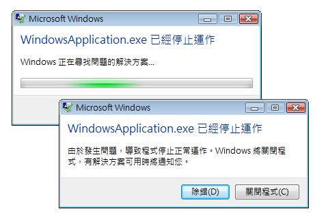

# <a name="application-management-overview"></a>應用程式管理概觀
所有應用程式通常會共用一組適用於應用程式實作和管理的通用功能。 本主題提供中的功能概觀<xref:System.Windows.Application>類別，用於建立和管理應用程式。  
   
  
## <a name="the-application-class"></a>Application 類別  
 在[!INCLUDE[TLA2#tla_wpf](../../../../includes/tla2sharptla-wpf-md.md)]，應用程式範圍的一般功能封裝在<xref:System.Windows.Application>類別。 <xref:System.Windows.Application>類別包含下列功能：  
  
-   追蹤應用程式存留期並與其互動。  
  
-   擷取及處理命令列參數。  
  
-   偵測及回應未處理的例外狀況。  
  
-   共用應用程式範圍的屬性和資源。  
  
-   管理獨立應用程式中的視窗。  
  
-   追蹤及管理瀏覽。  
  
<a name="The_Application_Class"></a>   
## <a name="how-to-perform-common-tasks-using-the-application-class"></a>如何使用 Application 類別執行一般工作  
 如果您不感興趣的詳細資料的所有<xref:System.Windows.Application>下表列出一些常見工作的類別，<xref:System.Windows.Application>以及如何完成這些工作。 您可以檢視相關的 API 和主題，來尋找詳細資訊和範例程式碼。  
  
|工作|方法|  
|----------|--------------|  
|取得代表目前應用程式的物件|請使用 <xref:System.Windows.Application.Current%2A?displayProperty=nameWithType> 屬性。|  
|將啟動畫面新增至應用程式|請參閱[WPF 應用程式中加入啟動顯示畫面](../../../../docs/framework/wpf/app-development/how-to-add-a-splash-screen-to-a-wpf-application.md)。|  
|啟動應用程式|請使用 <xref:System.Windows.Application.Run%2A?displayProperty=nameWithType> 方法。|  
|停止應用程式|使用<xref:System.Windows.Application.Shutdown%2A>方法<xref:System.Windows.Application.Current%2A?displayProperty=nameWithType>物件。|  
|從命令列取得引數|處理<xref:System.Windows.Application.Startup?displayProperty=nameWithType>事件並使用<xref:System.Windows.StartupEventArgs.Args%2A?displayProperty=nameWithType>屬性。 如需範例，請參閱<xref:System.Windows.Application.Startup?displayProperty=nameWithType>事件。|  
|取得及設定應用程式結束代碼|設定<xref:System.Windows.ExitEventArgs.ApplicationExitCode%2A?displayProperty=nameWithType>屬性<xref:System.Windows.Application.Exit?displayProperty=nameWithType>事件處理常式或呼叫<xref:System.Windows.Application.Shutdown%2A>方法並傳入整數。|  
|偵測及回應未處理的例外狀況|處理<xref:System.Windows.Application.DispatcherUnhandledException>事件。|  
|取得及設定應用程式範圍的資源|請使用 <xref:System.Windows.Application.Resources%2A?displayProperty=nameWithType> 屬性。|  
|使用應用程式範圍的資源字典|請參閱[使用應用程式範圍的資源字典](../../../../docs/framework/wpf/app-development/how-to-use-an-application-scope-resource-dictionary.md)。|  
|取得及設定應用程式範圍的屬性|請使用 <xref:System.Windows.Application.Properties%2A?displayProperty=nameWithType> 屬性。|  
|取得及儲存應用程式的狀態|請參閱[保存及還原應用程式範圍的屬性可以跨應用程式工作階段](../../../../docs/framework/wpf/app-development/persist-and-restore-application-scope-properties.md)。|  
|管理非程式碼資料檔案，包括資源檔、內容檔案和來源網站檔案。|請參閱[WPF 應用程式資源、 內容和資料檔案](../../../../docs/framework/wpf/app-development/wpf-application-resource-content-and-data-files.md)。|  
|管理獨立應用程式中的視窗|請參閱 [WPF 視窗概觀](../../../../docs/framework/wpf/app-development/wpf-windows-overview.md)。|  
|追蹤及管理瀏覽|請參閱[巡覽概觀](../../../../docs/framework/wpf/app-development/navigation-overview.md)。|  
  
<a name="The_Application_Definition"></a>   
## <a name="the-application-definition"></a>應用程式定義  
 若要利用的功能<xref:System.Windows.Application>類別，您必須實作應用程式定義。 A[!INCLUDE[TLA2#tla_wpf](../../../../includes/tla2sharptla-wpf-md.md)]應用程式定義是類別，衍生自<xref:System.Windows.Application>且具有特殊設定[!INCLUDE[TLA#tla_msbuild](../../../../includes/tlasharptla-msbuild-md.md)]設定。  
  
### <a name="implementing-an-application-definition"></a>實作應用程式定義  
 一般[!INCLUDE[TLA2#tla_wpf](../../../../includes/tla2sharptla-wpf-md.md)]使用標記和程式碼後置實作應用程式定義。 這可讓您使用標記，以宣告方式設定應用程式屬性、資源和註冊事件，同時在程式碼後置中，處理事件及實作應用程式特定行為。  
  
 下列範例示範如何使用標記和程式碼後置，來實作應用程式定義：  
  
 [!code-xaml[ApplicationSnippets#ApplicationXAML](../../../../samples/snippets/csharp/VS_Snippets_Wpf/ApplicationSnippets/CSharp/App.xaml#applicationxaml)]  
  
 [!code-csharp[ApplicationSnippets#ApplicationCODEBEHIND](../../../../samples/snippets/csharp/VS_Snippets_Wpf/ApplicationSnippets/CSharp/App.xaml.cs#applicationcodebehind)]
 [!code-vb[ApplicationSnippets#ApplicationCODEBEHIND](../../../../samples/snippets/visualbasic/VS_Snippets_Wpf/ApplicationSnippets/visualbasic/application.xaml.vb#applicationcodebehind)]  
  
 若要搭配使用標記檔案和程式碼後置檔案，下列情況必須成立：  
  
-   在標記中，`Application`元素必須包含`x:Class`屬性。 應用程式建置的時，是否存在`x:Class`標記中的檔案會導致[!INCLUDE[TLA2#tla_msbuild](../../../../includes/tla2sharptla-msbuild-md.md)]建立`partial`類別衍生自<xref:System.Windows.Application>且具有所指定名稱`x:Class`屬性。 這需要加入[!INCLUDE[TLA2#tla_xml](../../../../includes/tla2sharptla-xml-md.md)]的命名空間宣告[!INCLUDE[TLA2#tla_xaml](../../../../includes/tla2sharptla-xaml-md.md)]結構描述 ( `xmlns:x="http://schemas.microsoft.com/winfx/2006/xaml"` )。  
  
-   在程式碼後置類別必須是`partial`類別具有相同名稱的指定`x:Class`屬性標記中，必須衍生自<xref:System.Windows.Application>。 這可讓相關聯的程式碼後置檔案`partial`建置應用程式時，所產生的標記檔案類別 (請參閱[建置 WPF 應用程式](../../../../docs/framework/wpf/app-development/building-a-wpf-application-wpf.md))。  
  
> [!NOTE]
>  當您建立新的 WPF 應用程式專案或 WPF 瀏覽器應用程式的專案使用[!INCLUDE[TLA#tla_visualstu](../../../../includes/tlasharptla-visualstu-md.md)]，應用程式定義預設隨附且使用標記和程式碼後置定義。  
  
 此程式碼是實作應用程式定義的最低需求。 不過，其他[!INCLUDE[TLA2#tla_msbuild](../../../../includes/tla2sharptla-msbuild-md.md)]需要對應用程式定義，再建置及執行應用程式的組態。  
  
### <a name="configuring-the-application-definition-for-msbuild"></a>設定 MSBuild 的應用程式定義  
 獨立應用程式和[!INCLUDE[TLA#tla_xbap#plural](../../../../includes/tlasharptla-xbapsharpplural-md.md)]可以執行之前，需要特定層級的基礎結構的實作。 此基礎結構的最重要部分是進入點。 當使用者啟動應用程式時，作業系統會呼叫進入點，這是用於啟動應用程式的已知函式。  
  
 傳統上，開發人員必須自行撰寫這段程式碼的一部分或全部 (視使用技術而定)。 不過，[!INCLUDE[TLA2#tla_wpf](../../../../includes/tla2sharptla-wpf-md.md)]標記檔案的應用程式定義設定為時，為您產生這個程式碼[!INCLUDE[TLA2#tla_msbuild](../../../../includes/tla2sharptla-msbuild-md.md)]`ApplicationDefinition`項目，如下列所示[!INCLUDE[TLA2#tla_msbuild](../../../../includes/tla2sharptla-msbuild-md.md)]專案檔：  
  
```xml  
<Project   
  DefaultTargets="Build"  
                        xmlns="http://schemas.microsoft.com/developer/msbuild/2003">  
  ...  
  <ApplicationDefinition Include="App.xaml" />  
  <Compile Include="App.xaml.cs" />  
  ...  
</Project>  
```  
  
 程式碼後置檔案包含程式碼，因為它會標示為[!INCLUDE[TLA2#tla_msbuild](../../../../includes/tla2sharptla-msbuild-md.md)]`Compile`項目，做為是正常現象。  
  
 這些應用程式[!INCLUDE[TLA2#tla_msbuild](../../../../includes/tla2sharptla-msbuild-md.md)]標記和程式碼後置檔案的應用程式定義的設定會導致[!INCLUDE[TLA2#tla_msbuild](../../../../includes/tla2sharptla-msbuild-md.md)]來產生程式碼如下所示：  
  
 [!code-csharp[AppDefAugSnippets#AppDefAugCODE1](../../../../samples/snippets/csharp/VS_Snippets_Wpf/AppDefAugSnippets/CSharp/App.cs#appdefaugcode1)]
 [!code-vb[AppDefAugSnippets#AppDefAugCODE1](../../../../samples/snippets/visualbasic/VS_Snippets_Wpf/AppDefAugSnippets/VisualBasic/App.vb#appdefaugcode1)]  
[!code-csharp[AppDefAugSnippets#AppDefAugCODE2](../../../../samples/snippets/csharp/VS_Snippets_Wpf/AppDefAugSnippets/CSharp/App.cs#appdefaugcode2)]
[!code-vb[AppDefAugSnippets#AppDefAugCODE2](../../../../samples/snippets/visualbasic/VS_Snippets_Wpf/AppDefAugSnippets/VisualBasic/App.vb#appdefaugcode2)]  
  
 產生的程式碼加強您的應用程式定義的其他基礎結構程式碼，其中包括 進入點方法`Main`。 <xref:System.STAThreadAttribute>屬性套用至`Main`方法，指出主[!INCLUDE[TLA2#tla_ui](../../../../includes/tla2sharptla-ui-md.md)]執行緒的[!INCLUDE[TLA2#tla_wpf](../../../../includes/tla2sharptla-wpf-md.md)]應用程式是 STA 執行緒，所需的[!INCLUDE[TLA2#tla_wpf](../../../../includes/tla2sharptla-wpf-md.md)]應用程式。 呼叫時，`Main`建立的新執行個體`App`之前先呼叫`InitializeComponent`方法，以註冊事件，並設定屬性，會在標記中實作。 因為`InitializeComponent`產生，您不需要明確地呼叫`InitializeComponent`從應用程式定義像您在執行動作<xref:System.Windows.Controls.Page>和<xref:System.Windows.Window>實作。 最後，<xref:System.Windows.Application.Run%2A>呼叫方法來啟動應用程式。  
  
<a name="Getting_the_Current_Application"></a>   
## <a name="getting-the-current-application"></a>取得目前的應用程式  
 因為功能的<xref:System.Windows.Application>類別由應用程式共用，可以有只有一個執行個體<xref:System.Windows.Application>每個類別<xref:System.AppDomain>。 若要強制執行，<xref:System.Windows.Application>類別實作為單一類別 (請參閱[C# 中實作的單一](http://go.microsoft.com/fwlink/?LinkId=100567))，建立本身的單一執行個體，並提供的共用存取權與`static` <xref:System.Windows.Application.Current%2A>屬性。  
  
 下列程式碼示範如何取得參考<xref:System.Windows.Application>物件目前<xref:System.AppDomain>。  
  
 [!code-csharp[ApplicationManagementOverviewSnippets#GetCurrentAppCODE](../../../../samples/snippets/csharp/VS_Snippets_Wpf/ApplicationManagementOverviewSnippets/CSharp/MainWindow.xaml.cs#getcurrentappcode)]
 [!code-vb[ApplicationManagementOverviewSnippets#GetCurrentAppCODE](../../../../samples/snippets/visualbasic/VS_Snippets_Wpf/ApplicationManagementOverviewSnippets/VisualBasic/MainWindow.xaml.vb#getcurrentappcode)]  
  
 <xref:System.Windows.Application.Current%2A> 傳回的執行個體的參考<xref:System.Windows.Application>類別。 如果您想要的參考您<xref:System.Windows.Application>衍生的類別，您必須轉換的值<xref:System.Windows.Application.Current%2A>屬性，如下列範例所示。  
  
 [!code-csharp[ApplicationManagementOverviewSnippets#GetSTCurrentAppCODE](../../../../samples/snippets/csharp/VS_Snippets_Wpf/ApplicationManagementOverviewSnippets/CSharp/MainWindow.xaml.cs#getstcurrentappcode)]
 [!code-vb[ApplicationManagementOverviewSnippets#GetSTCurrentAppCODE](../../../../samples/snippets/visualbasic/VS_Snippets_Wpf/ApplicationManagementOverviewSnippets/VisualBasic/MainWindow.xaml.vb#getstcurrentappcode)]  
  
 您可以檢查的值<xref:System.Windows.Application.Current%2A>存留期間的任何一點<xref:System.Windows.Application>物件。 不過，您應該要小心。 之後<xref:System.Windows.Application>類別具現化，所以在一段期間的狀態<xref:System.Windows.Application>物件不一致。 在這段期間，<xref:System.Windows.Application>正在執行的各種初始設定工作所需的程式碼，若要執行，包括建立應用程式基礎結構、 設定屬性，以及註冊事件。 如果您嘗試使用<xref:System.Windows.Application>物件在這段期間，您的程式碼可能會有非預期的結果，特別是當它相依於各種<xref:System.Windows.Application>屬性設定。  
  
 當<xref:System.Windows.Application>完成初始設定工作，其存留期真正開始。  
  
<a name="Application_Lifetime"></a>   
## <a name="application-lifetime"></a>應用程式存留期  
 存留期[!INCLUDE[TLA2#tla_wpf](../../../../includes/tla2sharptla-wpf-md.md)]應用程式由多個所引發的事件標記<xref:System.Windows.Application>，讓您知道您的應用程式已啟動時，已啟用及停用，並已關閉。  
  
  
<a name="Splash_Screen"></a>   
### <a name="splash-screen"></a>啟動顯示畫面  
 從開始[!INCLUDE[net_v35SP1_short](../../../../includes/net-v35sp1-short-md.md)]，您可以指定要在啟動視窗中，使用的影像或*啟動顯示畫面*。 <xref:System.Windows.SplashScreen>類別可讓您輕鬆地載入您的應用程式時顯示啟動視窗。 <xref:System.Windows.SplashScreen>建立 window 並顯示之前<xref:System.Windows.Application.Run%2A>呼叫。 如需詳細資訊，請參閱[應用程式啟動時間](../../../../docs/framework/wpf/advanced/application-startup-time.md)和[WPF 應用程式中加入啟動顯示畫面](../../../../docs/framework/wpf/app-development/how-to-add-a-splash-screen-to-a-wpf-application.md)。  
  
<a name="Starting_an_Application"></a>   
### <a name="starting-an-application"></a>啟動應用程式  
 之後<xref:System.Windows.Application.Run%2A>稱為和應用程式初始化、 應用程式已準備好執行。 表示當目前<xref:System.Windows.Application.Startup>引發：  
  
 [!code-csharp[ApplicationStartupSnippets#StartupCODEBEHIND1](../../../../samples/snippets/csharp/VS_Snippets_Wpf/ApplicationStartupSnippets/CSharp/App.xaml.cs#startupcodebehind1)]
 [!code-vb[ApplicationStartupSnippets#StartupCODEBEHIND1](../../../../samples/snippets/visualbasic/VS_Snippets_Wpf/ApplicationStartupSnippets/visualbasic/application.xaml.vb#startupcodebehind1)]  
[!code-csharp[ApplicationStartupSnippets#StartupCODEBEHIND2](../../../../samples/snippets/csharp/VS_Snippets_Wpf/ApplicationStartupSnippets/CSharp/App.xaml.cs#startupcodebehind2)]
[!code-vb[ApplicationStartupSnippets#StartupCODEBEHIND2](../../../../samples/snippets/visualbasic/VS_Snippets_Wpf/ApplicationStartupSnippets/visualbasic/application.xaml.vb#startupcodebehind2)]  
  
 此時在應用程式的存留期間，最常見的做法是以顯示[!INCLUDE[TLA2#tla_ui](../../../../includes/tla2sharptla-ui-md.md)]。  
  
<a name="Showing_a_User_Interface"></a>   
### <a name="showing-a-user-interface"></a>顯示使用者介面  
 大部分的獨立 Windows 應用程式開啟<xref:System.Windows.Window>何時開始執行。 <xref:System.Windows.Application.Startup>事件處理常式是一個位置，從中您可以這樣做，請以下列程式碼所示。  
  
 [!code-xaml[AppShowWindowHardSnippets#StartupEventMARKUP](../../../../samples/snippets/csharp/VS_Snippets_Wpf/AppShowWindowHardSnippets/CSharp/App.xaml#startupeventmarkup)]  
  
 [!code-csharp[AppShowWindowHardSnippets#StartupEventCODEBEHIND](../../../../samples/snippets/csharp/VS_Snippets_Wpf/AppShowWindowHardSnippets/CSharp/App.xaml.cs#startupeventcodebehind)]
 [!code-vb[AppShowWindowHardSnippets#StartupEventCODEBEHIND](../../../../samples/snippets/visualbasic/VS_Snippets_Wpf/AppShowWindowHardSnippets/VisualBasic/Application.xaml.vb#startupeventcodebehind)]  
  
> [!NOTE]
>  第一個<xref:System.Windows.Window>為具現化在獨立應用程式就會變成主應用程式視窗的預設值。 這<xref:System.Windows.Window>所參考物件<xref:System.Windows.Application.MainWindow%2A?displayProperty=nameWithType>屬性。 值<xref:System.Windows.Application.MainWindow%2A>如果不同的視窗比第一個屬性也可以透過程式設計方式變更具現化<xref:System.Windows.Window>應該是主視窗。  
  
 當[!INCLUDE[TLA2#tla_xbap](../../../../includes/tla2sharptla-xbap-md.md)]第一次啟動時，它會最有可能瀏覽至<xref:System.Windows.Controls.Page>。 如下列程式碼所示。  
  
 [!code-xaml[XBAPAppStartupSnippets#StartupXBAPMARKUP](../../../../samples/snippets/csharp/VS_Snippets_Wpf/XBAPAppStartupSnippets/CSharp/App.xaml#startupxbapmarkup)]  
  
 [!code-csharp[XBAPAppStartupSnippets#StartupXBAPCODEBEHIND](../../../../samples/snippets/csharp/VS_Snippets_Wpf/XBAPAppStartupSnippets/CSharp/App.xaml.cs#startupxbapcodebehind)]
 [!code-vb[XBAPAppStartupSnippets#StartupXBAPCODEBEHIND](../../../../samples/snippets/visualbasic/VS_Snippets_Wpf/XBAPAppStartupSnippets/VisualBasic/Application.xaml.vb#startupxbapcodebehind)]  
  
 如果您處理<xref:System.Windows.Application.Startup>只能開啟<xref:System.Windows.Window>或瀏覽至<xref:System.Windows.Controls.Page>，您可以設定`StartupUri`屬性，屬性標記中。  
  
 下列範例示範如何使用<xref:System.Windows.Application.StartupUri%2A>從獨立應用程式，來開啟<xref:System.Windows.Window>。  
  
 [!code-xaml[ApplicationManagementOverviewSnippets#OverviewStartupUriMARKUP](../../../../samples/snippets/csharp/VS_Snippets_Wpf/ApplicationManagementOverviewSnippets/CSharp/App.xaml#overviewstartupurimarkup)]  
  
 下列範例示範如何使用<xref:System.Windows.Application.StartupUri%2A>從[!INCLUDE[TLA2#tla_xbap](../../../../includes/tla2sharptla-xbap-md.md)]瀏覽至<xref:System.Windows.Controls.Page>。  
  
 [!code-xaml[PageSnippets#XBAPStartupUriMARKUP](../../../../samples/snippets/csharp/VS_Snippets_Wpf/PageSnippets/CSharp/App.xaml#xbapstartupurimarkup)]  
  
 此標記與前述用來開啟視窗的程式碼有相同的效果。  
  
> [!NOTE]
>  如需有關瀏覽的詳細資訊，請參閱[巡覽概觀](../../../../docs/framework/wpf/app-development/navigation-overview.md)。  
  
 您需要處理<xref:System.Windows.Application.Startup>事件，以開啟<xref:System.Windows.Window>如果您需要具現化使用非預設的建構函式，或您要設定其屬性或事件訂閱，然後才顯示，您需要處理的任何命令列引數，當應用程式的啟動時提供。  
  
<a name="Processing_Command_Line_Arguments"></a>   
### <a name="processing-command-line-arguments"></a>處理命令列引數  
 在 Windows 中，您可以啟動獨立應用程式，從命令提示字元或桌面。 在這兩種情況下，都會將命令列引數傳遞至應用程式。 下列範例顯示以單一命令列引數 "/StartMinimized" 啟動的應用程式：  
  
 `wpfapplication.exe /StartMinimized`  
  
 應用程式初始化期間[!INCLUDE[TLA2#tla_wpf](../../../../includes/tla2sharptla-wpf-md.md)]從作業系統擷取命令列引數，並將它們傳遞<xref:System.Windows.Application.Startup>透過事件處理常式<xref:System.Windows.StartupEventArgs.Args%2A>屬性<xref:System.Windows.StartupEventArgs>參數。 您可以使用如下的程式碼擷取及儲存命令列引數。  
  
 [!code-xaml[ApplicationStartupSnippets#HandleStartupXAML](../../../../samples/snippets/csharp/VS_Snippets_Wpf/ApplicationStartupSnippets/CSharp/App.xaml#handlestartupxaml)]  
  
 [!code-csharp[ApplicationStartupSnippets#HandleStartupCODEBEHIND](../../../../samples/snippets/csharp/VS_Snippets_Wpf/ApplicationStartupSnippets/CSharp/App.xaml.cs#handlestartupcodebehind)]
 [!code-vb[ApplicationStartupSnippets#HandleStartupCODEBEHIND](../../../../samples/snippets/visualbasic/VS_Snippets_Wpf/ApplicationStartupSnippets/visualbasic/application.xaml.vb#handlestartupcodebehind)]  
  
 程式碼控制代碼<xref:System.Windows.Application.Startup>來檢查是否 **/StartMinimized**提供命令列引數; 如果是的話，它會開啟主視窗與<xref:System.Windows.WindowState>的<xref:System.Windows.WindowState.Minimized>。 請注意，因為<xref:System.Windows.Window.WindowState%2A>屬性必須設定以程式設計的方式，主要<xref:System.Windows.Window>必須在程式碼中明確地開啟。  
  
 [!INCLUDE[TLA2#tla_xbap#plural](../../../../includes/tla2sharptla-xbapsharpplural-md.md)] 無法擷取和處理命令列引數，因為在啟動使用[!INCLUDE[TLA#tla_clickonce](../../../../includes/tlasharptla-clickonce-md.md)]部署 (請參閱[WPF 應用程式部署](../../../../docs/framework/wpf/app-development/deploying-a-wpf-application-wpf.md))。 不過，它們可以透過用來啟動的 URL 擷取及處理查詢字串參數。  
  
<a name="Application_Activation_and_Deactivation"></a>   
### <a name="application-activation-and-deactivation"></a>應用程式啟用和停用  
 Windows 可讓使用者在應用程式之間切換。 最常見的做法是使用 ALT+TAB 按鍵組合。 應用程式可以只切換是否顯示<xref:System.Windows.Window>，使用者可以選取。 目前所選<xref:System.Windows.Window>是*作用中視窗*(也稱為*前景視窗*)，且<xref:System.Windows.Window>接收使用者輸入。 應用程式與現用視窗*作用中應用程式*(或*前景應用程式*)。 在下列情況中，應用程式會變成使用中應用程式：  
  
-   它會啟動並顯示<xref:System.Windows.Window>。  
  
-   使用者從另一個應用程式切換選取<xref:System.Windows.Window>應用程式中。  
  
 當應用程式變成作用中處理，您可以偵測<xref:System.Windows.Application.Activated?displayProperty=nameWithType>事件。  
  
 同樣地，在下列情況中，應用程式會變成非使用中：  
  
-   使用者從目前的應用程式切換至另一個應用程式。  
  
-   應用程式關閉時。  
  
 您可以藉由處理應用程式變成非作用時偵測到<xref:System.Windows.Application.Deactivated?displayProperty=nameWithType>事件。  
  
 下列程式碼示範如何處理<xref:System.Windows.Application.Activated>和<xref:System.Windows.Application.Deactivated>事件，以判斷應用程式是否為作用中。  
  
 [!code-xaml[ApplicationActivationSnippets#DetectActivationStateXAML](../../../../samples/snippets/csharp/VS_Snippets_Wpf/ApplicationActivationSnippets/CSharp/App.xaml#detectactivationstatexaml)]  
  
 [!code-csharp[ApplicationActivationSnippets#DetectActivationStateCODEBEHIND](../../../../samples/snippets/csharp/VS_Snippets_Wpf/ApplicationActivationSnippets/CSharp/App.xaml.cs#detectactivationstatecodebehind)]
 [!code-vb[ApplicationActivationSnippets#DetectActivationStateCODEBEHIND](../../../../samples/snippets/visualbasic/VS_Snippets_Wpf/ApplicationActivationSnippets/visualbasic/application.xaml.vb#detectactivationstatecodebehind)]  
  
 A<xref:System.Windows.Window>也可以啟用和停用。 如需詳細資訊，請參閱 <xref:System.Windows.Window.Activated?displayProperty=nameWithType> 和 <xref:System.Windows.Window.Deactivated?displayProperty=nameWithType>。  
  
> [!NOTE]
>  既不<xref:System.Windows.Application.Activated?displayProperty=nameWithType>也<xref:System.Windows.Application.Deactivated?displayProperty=nameWithType>，就會引發[!INCLUDE[TLA2#tla_xbap#plural](../../../../includes/tla2sharptla-xbapsharpplural-md.md)]。  
  
<a name="Application_Shutdown"></a>   
### <a name="application-shutdown"></a>應用程式關閉  
 應用程式一旦關閉，其存留期間便告結束，而應用程式關閉的可能原因包括：  
  
-   使用者關閉每個<xref:System.Windows.Window>。  
  
-   使用者關閉主<xref:System.Windows.Window>。  
  
-   在使用者結束 Windows 工作階段，透過登出或關閉。  
  
-   已符合應用程式特定條件。  
  
 若要可協助您管理應用程式關閉<xref:System.Windows.Application>提供<xref:System.Windows.Application.Shutdown%2A>方法，<xref:System.Windows.Application.ShutdownMode%2A>屬性，而<xref:System.Windows.Application.SessionEnding>和<xref:System.Windows.Application.Exit>事件。  
  
> [!NOTE]
>  <xref:System.Windows.Application.Shutdown%2A> 只能從包含的應用程式呼叫<xref:System.Security.Permissions.UIPermission>。 獨立[!INCLUDE[TLA2#tla_wpf](../../../../includes/tla2sharptla-wpf-md.md)]應用程式永遠擁有這個權限。 不過，[!INCLUDE[TLA2#tla_xbap#plural](../../../../includes/tla2sharptla-xbapsharpplural-md.md)]網際網路區域的部分信任安全性沙箱中執行不這麼做。  
  
#### <a name="shutdown-mode"></a>程式關閉模式  
 大多數應用程式會在所有視窗關閉或主視窗關閉時一併關閉。 不過有時候，應用程式關閉的時機可能是由其他應用程式特定條件決定。 您可以指定在您的應用程式將關閉設定的條件<xref:System.Windows.Application.ShutdownMode%2A>具有下列其中一種<xref:System.Windows.ShutdownMode>列舉值：  
  
-   <xref:System.Windows.ShutdownMode.OnLastWindowClose>  
  
-   <xref:System.Windows.ShutdownMode.OnMainWindowClose>  
  
-   <xref:System.Windows.ShutdownMode.OnExplicitShutdown>  
  
 預設值<xref:System.Windows.Application.ShutdownMode%2A>是<xref:System.Windows.ShutdownMode.OnLastWindowClose>，也就是說，應用程式會自動關閉當使用者關閉應用程式中的上一個視窗時。 不過，如果您的應用程式應該關閉主視窗關閉時，[!INCLUDE[TLA2#tla_wpf](../../../../includes/tla2sharptla-wpf-md.md)]會自動執行，如果您設定<xref:System.Windows.Application.ShutdownMode%2A>至<xref:System.Windows.ShutdownMode.OnMainWindowClose>。 這在下列範例中顯示。  
  
 [!code-xaml[ApplicationShutdownModeSnippets#OnMainWindowCloseMARKUP](../../../../samples/snippets/csharp/VS_Snippets_Wpf/ApplicationShutdownModeSnippets/CS/Page1.xaml#onmainwindowclosemarkup)]  
  
 當您有特定的應用程式關閉條件時，您設定<xref:System.Windows.Application.ShutdownMode%2A>至<xref:System.Windows.ShutdownMode.OnExplicitShutdown>。 在此情況下，它是透過明確呼叫關閉應用程式，您必須負責<xref:System.Windows.Application.Shutdown%2A>方法; 否則您的應用程式將會繼續執行，即使關閉所有視窗。 請注意，<xref:System.Windows.Application.Shutdown%2A>會隱含呼叫時<xref:System.Windows.Application.ShutdownMode%2A>是<xref:System.Windows.ShutdownMode.OnLastWindowClose>或<xref:System.Windows.ShutdownMode.OnMainWindowClose>。  
  
> [!NOTE]
>  <xref:System.Windows.Application.ShutdownMode%2A> 您可以將從[!INCLUDE[TLA2#tla_xbap](../../../../includes/tla2sharptla-xbap-md.md)]，但會忽略它;[!INCLUDE[TLA2#tla_xbap](../../../../includes/tla2sharptla-xbap-md.md)]在瀏覽器或瀏覽器裝載，離開的瀏覽已一律關閉[!INCLUDE[TLA2#tla_xbap](../../../../includes/tla2sharptla-xbap-md.md)]已關閉。 如需詳細資訊，請參閱[覽概觀](../../../../docs/framework/wpf/app-development/navigation-overview.md)。  
  
#### <a name="session-ending"></a>工作階段結束  
 所描述的關機條件<xref:System.Windows.Application.ShutdownMode%2A>屬性專屬於應用程式。 不過在某些情況下，應用程式可能會因為外部狀況而關閉。 當使用者結束 Windows 工作階段的下列動作時，就會發生的最常見的外部條件：  
  
-   登出  
  
-   關機  
  
-   重新啟動  
  
-   休眠  
  
 若要偵測 Windows 工作階段結束時，您可以處理<xref:System.Windows.Application.SessionEnding>事件，如下列範例所示。  
  
 [!code-xaml[ApplicationSessionEndingSnippets#HandlingSessionEndingXAML](../../../../samples/snippets/csharp/VS_Snippets_Wpf/ApplicationSessionEndingSnippets/CSharp/App.xaml#handlingsessionendingxaml)]  
  
 [!code-csharp[ApplicationSessionEndingSnippets#HandlingSessionEndingCODEBEHIND](../../../../samples/snippets/csharp/VS_Snippets_Wpf/ApplicationSessionEndingSnippets/CSharp/App.xaml.cs#handlingsessionendingcodebehind)]
 [!code-vb[ApplicationSessionEndingSnippets#HandlingSessionEndingCODEBEHIND](../../../../samples/snippets/visualbasic/VS_Snippets_Wpf/ApplicationSessionEndingSnippets/visualbasic/application.xaml.vb#handlingsessionendingcodebehind)]  
  
 在此範例中，程式碼會檢查<xref:System.Windows.SessionEndingCancelEventArgs.ReasonSessionEnding%2A>屬性來判斷如何結束 Windows 工作階段。 接著，它會使用這個值對使用者顯示確認訊息。 如果使用者不想要結束的工作階段，此程式碼設定<xref:System.ComponentModel.CancelEventArgs.Cancel%2A>至`true`防止結束 Windows 工作階段。  
  
> [!NOTE]
>  <xref:System.Windows.Application.SessionEnding> 不會引發[!INCLUDE[TLA2#tla_xbap#plural](../../../../includes/tla2sharptla-xbapsharpplural-md.md)]。  
  
#### <a name="exit"></a>結束  
 當應用程式關閉時，可能需要執行一些最終處理作業，例如保存應用程式狀態。 這些情況下，您可以處理<xref:System.Windows.Application.Exit>事件。  
  
 [!code-xaml[HOWTOApplicationModelSnippets#PersistRestoreAppScopePropertiesXAML1](../../../../samples/snippets/csharp/VS_Snippets_Wpf/HOWTOApplicationModelSnippets/CSharp/App.xaml#persistrestoreappscopepropertiesxaml1)]  
[!code-xaml[HOWTOApplicationModelSnippets#PersistRestoreAppScopePropertiesXAML2](../../../../samples/snippets/csharp/VS_Snippets_Wpf/HOWTOApplicationModelSnippets/CSharp/App.xaml#persistrestoreappscopepropertiesxaml2)]  
  
 [!code-csharp[HOWTOApplicationModelSnippets#PersistAppScopePropertiesCODEBEHIND1](../../../../samples/snippets/csharp/VS_Snippets_Wpf/HOWTOApplicationModelSnippets/CSharp/App.xaml.cs#persistappscopepropertiescodebehind1)]
 [!code-vb[HOWTOApplicationModelSnippets#PersistAppScopePropertiesCODEBEHIND1](../../../../samples/snippets/visualbasic/VS_Snippets_Wpf/HOWTOApplicationModelSnippets/visualbasic/application.xaml.vb#persistappscopepropertiescodebehind1)]  
[!code-csharp[HOWTOApplicationModelSnippets#PersistAppScopePropertiesCODEBEHIND2](../../../../samples/snippets/csharp/VS_Snippets_Wpf/HOWTOApplicationModelSnippets/CSharp/App.xaml.cs#persistappscopepropertiescodebehind2)]
[!code-vb[HOWTOApplicationModelSnippets#PersistAppScopePropertiesCODEBEHIND2](../../../../samples/snippets/visualbasic/VS_Snippets_Wpf/HOWTOApplicationModelSnippets/visualbasic/application.xaml.vb#persistappscopepropertiescodebehind2)]  
  
 完整的範例，請參閱[保存和還原應用程式領域屬性跨應用程式工作階段](../../../../docs/framework/wpf/app-development/persist-and-restore-application-scope-properties.md)。  
  
 <xref:System.Windows.Application.Exit> 可以由兩個獨立應用程式和[!INCLUDE[TLA2#tla_xbap#plural](../../../../includes/tla2sharptla-xbapsharpplural-md.md)]。 如[!INCLUDE[TLA2#tla_xbap#plural](../../../../includes/tla2sharptla-xbapsharpplural-md.md)]，<xref:System.Windows.Application.Exit>會在下列情況中引發：  
  
-   [!INCLUDE[TLA2#tla_xbap](../../../../includes/tla2sharptla-xbap-md.md)]巡覽離開的。  
  
-   在[!INCLUDE[TLA2#tla_ie7](../../../../includes/tla2sharptla-ie7-md.md)]，當 [] 索引標籤裝載[!INCLUDE[TLA2#tla_xbap](../../../../includes/tla2sharptla-xbap-md.md)]已關閉。  
  
-   關閉瀏覽器時。  
  
#### <a name="exit-code"></a>結束代碼  
 應用程式大部分是由作業系統啟動，以回應使用者要求。 不過，應用程式可由另一個應用程式啟動，以執行某項特定工作。 關閉已啟動的應用程式時，正在啟動的應用程式可能需要知道已啟動之應用程式的關閉條件。 在這些情況下，Windows 會允許應用程式在關閉傳回應用程式結束代碼。 根據預設，[!INCLUDE[TLA2#tla_wpf](../../../../includes/tla2sharptla-wpf-md.md)]應用程式會傳回 0 的結束代碼值。  
  
> [!NOTE]
>  當您偵錯從[!INCLUDE[TLA2#tla_visualstu](../../../../includes/tla2sharptla-visualstu-md.md)]，應用程式結束程式碼會顯示在**輸出**應用程式關閉時，看起來像下列的訊息中的視窗：  
>   
>  `The program '[5340] AWPFApp.vshost.exe: Managed' has exited with code 0 (0x0).`  
>   
>  您開啟**輸出**按一下視窗**輸出**上**檢視**功能表。  
  
 若要變更的結束代碼，您可以呼叫<xref:System.Windows.Application.Shutdown%28System.Int32%29>多載，可接受整數引數的結束代碼為：  
  
 [!code-csharp[ApplicationExitSnippets#AppExitCODE](../../../../samples/snippets/csharp/VS_Snippets_Wpf/ApplicationExitSnippets/CSharp/MainWindow.xaml.cs#appexitcode)]
 [!code-vb[ApplicationExitSnippets#AppExitCODE](../../../../samples/snippets/visualbasic/VS_Snippets_Wpf/ApplicationExitSnippets/visualbasic/mainwindow.xaml.vb#appexitcode)]  
  
 您可以偵測結束程式碼的值，並將它變更，藉由處理<xref:System.Windows.Application.Exit>事件。 <xref:System.Windows.Application.Exit>傳遞事件處理常式<xref:System.Windows.ExitEventArgs>可存取的結束代碼<xref:System.Windows.ExitEventArgs.ApplicationExitCode%2A>屬性。 如需詳細資訊，請參閱<xref:System.Windows.Application.Exit>。  
  
> [!NOTE]
>  您可以在兩個獨立應用程式設定結束碼和[!INCLUDE[TLA2#tla_xbap#plural](../../../../includes/tla2sharptla-xbapsharpplural-md.md)]。 不過，會忽略結束代碼值[!INCLUDE[TLA2#tla_xbap#plural](../../../../includes/tla2sharptla-xbapsharpplural-md.md)]。  
  
<a name="Unhandled_Exceptions"></a>   
### <a name="unhandled-exceptions"></a>未處理的例外狀況  
 有時候，應用程式可能會在異常情況下關閉，例如擲回非預期的例外狀況時。 在此情況下，應用程式可能沒有可偵測及處理例外狀況的程式碼。 這種類型的例外狀況是未處理的例外狀況；在應用程式關閉之前，會顯示與下圖所示類似的通知。  
  
   
  
 從使用者體驗的觀點來看，應用程式最好能夠藉由執行下列部分或所有動作，來避免此預設行為：  
  
-   顯示方便使用的資訊。  
  
-   嘗試繼續執行應用程式。  
  
-   記錄詳細，方便開發人員的 Windows 事件記錄檔中的例外狀況資訊。  
  
 實作這項支援取決於要能夠偵測到未處理的例外狀況，這是什麼<xref:System.Windows.Application.DispatcherUnhandledException>都會引發事件。  
  
 [!code-xaml[ApplicationDispatcherUnhandledExceptionSnippets#HandleDispatcherUnhandledExceptionXAML](../../../../samples/snippets/csharp/VS_Snippets_Wpf/ApplicationDispatcherUnhandledExceptionSnippets/CSharp/App.xaml#handledispatcherunhandledexceptionxaml)]  
  
 [!code-csharp[ApplicationDispatcherUnhandledExceptionSnippets#HandleDispatcherUnhandledExceptionCODEBEHIND1](../../../../samples/snippets/csharp/VS_Snippets_Wpf/ApplicationDispatcherUnhandledExceptionSnippets/CSharp/App.xaml.cs#handledispatcherunhandledexceptioncodebehind1)]
 [!code-vb[ApplicationDispatcherUnhandledExceptionSnippets#HandleDispatcherUnhandledExceptionCODEBEHIND1](../../../../samples/snippets/visualbasic/VS_Snippets_Wpf/ApplicationDispatcherUnhandledExceptionSnippets/visualbasic/application.xaml.vb#handledispatcherunhandledexceptioncodebehind1)]  
[!code-csharp[ApplicationDispatcherUnhandledExceptionSnippets#HandleDispatcherUnhandledExceptionCODEBEHIND2](../../../../samples/snippets/csharp/VS_Snippets_Wpf/ApplicationDispatcherUnhandledExceptionSnippets/CSharp/App.xaml.cs#handledispatcherunhandledexceptioncodebehind2)]
[!code-vb[ApplicationDispatcherUnhandledExceptionSnippets#HandleDispatcherUnhandledExceptionCODEBEHIND2](../../../../samples/snippets/visualbasic/VS_Snippets_Wpf/ApplicationDispatcherUnhandledExceptionSnippets/visualbasic/application.xaml.vb#handledispatcherunhandledexceptioncodebehind2)]  
  
 <xref:System.Windows.Application.DispatcherUnhandledException>傳遞事件處理常式<xref:System.Windows.Threading.DispatcherUnhandledExceptionEventArgs>包含未處理的例外狀況，包括本身的例外狀況的相關內容資訊的參數 (<xref:System.Windows.Threading.DispatcherUnhandledExceptionEventArgs.Exception%2A?displayProperty=nameWithType>)。 您可以使用這項資訊來判斷如何處理例外狀況。  
  
 當您處理<xref:System.Windows.Application.DispatcherUnhandledException>，您應該設定<xref:System.Windows.Threading.DispatcherUnhandledExceptionEventArgs.Handled%2A?displayProperty=nameWithType>屬性`true`，否則[!INCLUDE[TLA2#tla_wpf](../../../../includes/tla2sharptla-wpf-md.md)]仍然會視為未處理的例外狀況，並會還原為先前所述的預設行為。 如果引發未處理的例外狀況，而<xref:System.Windows.Application.DispatcherUnhandledException>不處理事件，或在處理事件和<xref:System.Windows.Threading.DispatcherUnhandledExceptionEventArgs.Handled%2A>設`false`，應用程式立即關閉。 此外，沒有其他<xref:System.Windows.Application>引發事件。 因此，您需要處理<xref:System.Windows.Application.DispatcherUnhandledException>如果應用程式的應用程式關閉之前，必須執行的程式碼。  
  
 雖然應用程式可能因為未處理的例外狀況而關閉，但是應用程式通常是為了回應使用者的要求而關閉 (如下節所述)。  
  
<a name="Application_Lifetime_Events"></a>   
### <a name="application-lifetime-events"></a>應用程式存留期事件  
 獨立應用程式和[!INCLUDE[TLA2#tla_xbap#plural](../../../../includes/tla2sharptla-xbapsharpplural-md.md)]沒有完全相同的存留期。 下圖說明獨立應用程式存留期內的主要事件，並顯示這些事件的引發順序。  
  
   
  
 同樣地下, 圖說明重要的事件存留期間的[!INCLUDE[TLA2#tla_xbap](../../../../includes/tla2sharptla-xbap-md.md)]，並顯示其引發的順序。  
  
   
  
## <a name="see-also"></a>另請參閱  
 <xref:System.Windows.Application>  
 [WPF 視窗概觀](../../../../docs/framework/wpf/app-development/wpf-windows-overview.md)  
 [瀏覽概觀](../../../../docs/framework/wpf/app-development/navigation-overview.md)  
 [WPF 應用程式資源、內容和資料檔案](../../../../docs/framework/wpf/app-development/wpf-application-resource-content-and-data-files.md)  
 [WPF 中的 Pack URI](../../../../docs/framework/wpf/app-development/pack-uris-in-wpf.md)  
 [應用程式模型： 使用說明主題](http://msdn.microsoft.com/library/76771b09-3688-4d1c-8818-9b3f4cf39a30)  
 [應用程式開發](../../../../docs/framework/wpf/app-development/index.md)
